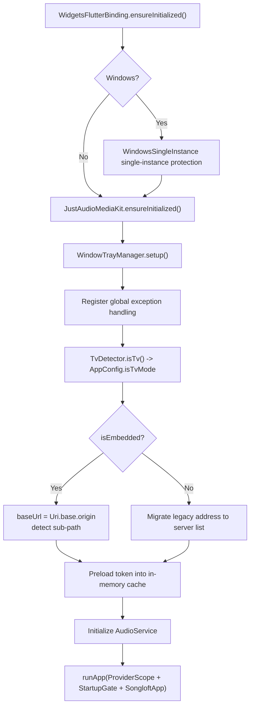
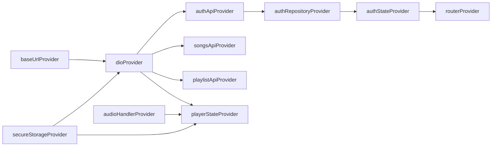
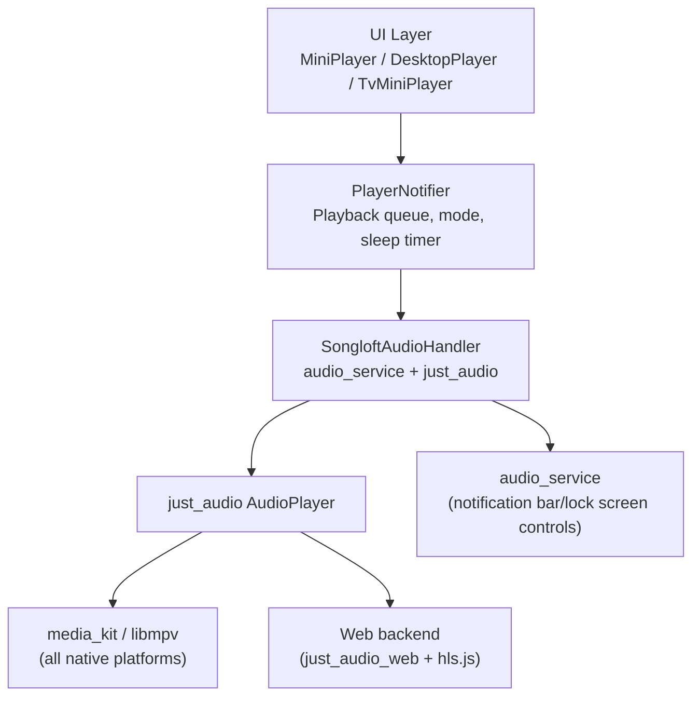
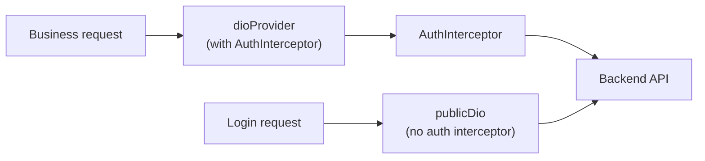

# Frontend System Design

This document is based on the following source files:

- `songloft-player/pubspec.yaml` -- Dependency list and project configuration
- `songloft-player/lib/main.dart` -- Application entry point and initialization flow
- `songloft-player/lib/config/app_config.dart` -- Deployment mode and compile-time constants
- `songloft-player/lib/core/router/app_router.dart` -- GoRouter route definitions
- `songloft-player/lib/core/audio/audio_service.dart` -- Audio service wrapper
- `songloft-player/lib/core/network/api_client.dart` -- Dio network layer
- `songloft-player/lib/core/network/auth_interceptor.dart` -- Authentication interceptor
- `songloft-player/lib/core/network/base_url_provider.dart` -- BaseURL state management
- `songloft-player/lib/core/network/server_probe.dart` -- Server reachability probing
- `songloft-player/lib/core/theme/app_theme.dart` -- Material 3 theme construction
- `songloft-player/lib/core/theme/responsive.dart` -- Responsive breakpoints and screen types
- `songloft-player/lib/core/storage/secure_storage.dart` -- Token storage
- `songloft-player/lib/core/env/tv_detector.dart` -- TV device detection
- `songloft-player/lib/core/utils/url_helper.dart` -- Resource URL construction
- `songloft-player/lib/core/utils/platform_utils.dart` -- Platform detection utilities
- `songloft-player/lib/core/utils/audio_format_helper.dart` -- Audio format transcoding decision
- `songloft-player/lib/shared/layouts/shell_layout.dart` -- ShellRoute layout
- `songloft-player/lib/shared/layouts/adaptive_scaffold.dart` -- Adaptive scaffold
- `songloft-player/lib/features/startup/presentation/startup_gate.dart` -- Startup gate
- `songloft-player/lib/features/player/domain/player_state.dart` -- Player state model
- `songloft-player/lib/features/player/presentation/providers/player_provider.dart` -- Player Notifier
- `songloft-player/lib/features/auth/presentation/providers/auth_provider.dart` -- Authentication state management
- `songloft-player/lib/features/settings/presentation/providers/settings_provider.dart` -- Settings and theme
- `songloft-player/lib/features/home/presentation/plugin_webview_page.dart` -- Plugin WebView conditional export
- `songloft-player/lib/features/home/presentation/plugin_webview_page_native.dart` -- Native WebView
- `songloft-player/lib/features/home/presentation/plugin_webview_page_stub.dart` -- Web platform stub

## Table of Contents

1. [Introduction](#1-introduction)
2. [Directory Structure and Layered Architecture](#2-directory-structure-and-layered-architecture)
3. [Application Startup Flow](#3-application-startup-flow)
4. [Deployment Modes](#4-deployment-modes)
5. [State Management](#5-state-management)
6. [Routing System](#6-routing-system)
7. [Audio Playback System](#7-audio-playback-system)
8. [Network Layer](#8-network-layer)
9. [Theme System](#9-theme-system)
10. [Multi-Platform Adaptation](#10-multi-platform-adaptation)
11. [Plugin Integration](#11-plugin-integration)
12. [Conclusion](#12-conclusion)

---

## 1. Introduction

The Songloft frontend is a cross-platform music player based on Flutter 3.29+ / Dart 3.7+, supporting six platforms -- Android, iOS, Web, macOS, Windows, and Linux -- with additional adaptation for Android TV mode. The project uses a feature-based directory structure and Riverpod state management, delivers a unified audio playback experience through `just_audio` + `audio_service`, and controls the embedded/standalone deployment modes through compile-time constants.

**Section sources**: `pubspec.yaml` (technology stack definition), `AGENTS.md` (project overview)

---

## 2. Directory Structure and Layered Architecture

### 2.1 Top-Level Directories

```
lib/
  main.dart           # Application entry point
  config/             # Compile-time configuration (AppConfig)
  core/               # Infrastructure layer
    audio/            # Audio service wrapper
    backend/          # Bundle local mode backend (lifecycle, desktop child process, embedded library, run mode)
    env/              # Environment detection (TV mode)
    network/          # Network layer (Dio, interceptors, ServerProbe)
    platform/         # Platform-specific services (Live Activity)
    router/           # GoRouter route definitions
    storage/          # Local storage (token, preferences, playback state)
    theme/            # Theme and responsive breakpoints
    tracely/          # Telemetry monitoring
    utils/            # Utilities (URL construction, platform detection, format transcoding)
  features/           # Business feature modules
    auth/             # Authentication (login/logout/token management)
    home/             # Home (including the plugin WebView page)
    jsplugin/         # JS plugin management (store, list)
    library/          # Song library (song list, search, favorites)
    player/           # Player (full-screen/mini/desktop player, lyrics)
    playlist/         # Playlist (list, detail, drag-and-drop ordering)
    settings/         # Settings (scan, cache, proxy, upgrade)
    startup/          # Startup gate (Splash + server probing)
  shared/             # Cross-feature shared
    layouts/          # Layout components (ShellLayout, AdaptiveScaffold)
    models/           # Shared data models (Song, etc.)
    utils/            # Shared utilities (responsive SnackBar)
    widgets/          # Common widgets
```

### 2.2 Feature Layering Convention

Each feature module internally follows a three-tier data / domain / presentation structure:

| Layer | Responsibility | Typical Files |
|------|------|----------|
| `data/` | API calls, data serialization | `songs_api.dart`, `auth_api.dart`, `playlist_api.dart` |
| `domain/` | Business models and state definitions | `auth_state.dart`, `player_state.dart` |
| `presentation/` | UI pages, widgets, providers | `login_page.dart`, `player_provider.dart` |

Providers are consistently placed under `presentation/providers/`, and page-level widgets under `presentation/widgets/`. This layering ensures the unidirectionality of the data flow: API -> Domain Model -> Provider -> UI.

**Section sources**: `lib/` directory structure, `lib/features/` subdirectories

---

## 3. Application Startup Flow

The `main()` function completes platform initialization in a fixed order, ensuring each subsystem is ready before `runApp`.



### 3.1 StartupGate Server Probing

In standalone mode, `StartupGate` performs server reachability probing during the Splash screen:

1. Read the server list from persistent storage
2. Use it directly when there is a single server; when there are multiple servers, call `ServerProbe.pickFirstReachable()` to probe `/api/v1/health` in parallel
3. Prefer the reachable server with the smallest list index (2.5s timeout), falling back to the first item in the list when all fail
4. Write the selected URL into `baseUrlProvider` and set `probeOutcomeProvider` for the first-screen prompt

Embedded mode skips probing entirely, rendering the child immediately after `_ready = true`.

### 3.2 AudioService Initialization

AudioService initialization comes with graceful-degradation protection:

- **Web platform**: skips the await of `AudioService.init`, creating `SongloftAudioHandler` directly to render the first frame as quickly as possible
- **Native platform**: initializes via `AudioService.init<SongloftAudioHandler>()`, configuring the Android notification channel; on failure, degrades to a no-notification-bar mode
- `androidStopForegroundOnPause: false` keeps the foreground service running to prevent systems like HyperOS3 from aggressively reclaiming resources after the foreground service stops

**Section sources**: `lib/main.dart`, `lib/features/startup/presentation/startup_gate.dart`, `lib/core/network/server_probe.dart`

---

## 4. Deployment Modes

### 4.1 Compile-Time Constants

`AppConfig` injects the deployment mode at build time via `--dart-define=DEPLOY_MODE=embedded|standalone`:

```dart
static const bool isEmbedded = _kDeployMode == 'embedded';
```

`isEmbedded` is a compile-time constant, and Dart's tree-shaking removes the code of unused branches.

### 4.2 Comparison of the Two Modes

| Dimension | embedded | standalone |
|------|----------|------------|
| Deployment | Flutter Web packaged into the Go binary | Independent static deployment or native app |
| API address | Automatically uses `Uri.base.origin` (same origin) | Manually configured by the user, with multi-server management support |
| Sub-path | Automatically detected from `<base href>` | Not applicable |
| Server probing | Skipped | Parallel probing by StartupGate |
| API address UI | Hidden (removed by tree-shaking) | Shown, with editing and switching support |

### 4.3 Sub-Path Deployment

In embedded mode, the backend injects the sub-path when started with `-base-path /xxx`. The frontend detects `Uri.base.path` and writes the non-root path into `AppConfig.basePath` and `AppConfig.apiPrefix`:

```dart
AppConfig.basePath = trimmed;       // e.g. "/music"
AppConfig.apiPrefix = '$trimmed/api/v1';  // "/music/api/v1"
```

`UrlHelper` automatically prepends the `basePath` prefix when constructing resource URLs, ensuring the request paths for cover art, songs, lyrics, and other resources are correct.

### 4.4 Bundle Local Mode (v2.9.0+)

In addition to the `DEPLOY_MODE=embedded|standalone` dimension (which determines at compile time whether it is packaged same-origin with the backend), the client has an orthogonal **run mode** dimension: Bundle local mode embeds the Go backend directly into the Flutter client, allowing users to use the app without deploying a separate server. It is enabled via the compile-time argument `--dart-define=HAS_BACKEND=true` (`AppConfig.hasEmbeddedBackend`), and applies only to non-Web platforms (Android/iOS/macOS/Windows/Linux); Web is not supported.

The run mode is represented by the `RunMode` enum, persisted to SharedPreferences (key `songloft_run_mode`), and automatically restored at startup:

| Run Mode | Description |
|----------|------|
| `RunMode.remote` | Remote mode (default), connects to the user-configured remote server |
| `RunMode.local` | Local mode, starts the embedded Go backend (`127.0.0.1:<port>`) and automatically logs in with `admin/admin` |

- In non-bundle builds (without `HAS_BACKEND` injected), even if `local` was persisted historically, it is forcibly reverted to `remote` to avoid mistakenly showing "local mode"
- The relevant implementation is concentrated in `lib/core/backend/`:
  - `run_mode_provider.dart` -- `RunModeNotifier` (run mode persistence) + `LocalMusicDirNotifier` (local music directory)
  - `backend_lifecycle.dart` -- `BackendLifecycle` (WidgetsBindingObserver, restarts the backend when the app resumes to the foreground, stops it when detached)
  - `desktop_backend_service.dart` -- on desktop, starts the Go backend as a child process (looks up `songloft-server` in the same directory as the executable, parses the port from stdout)
  - `embedded_backend_service.dart` -- on mobile, calls the gomobile-bound native library via `MethodChannel('com.songloft/backend')`
- Local mode startup flow: request storage permission → start the backend → poll the health check (up to 10 times × 300ms) → auto-login

**Section sources**: `lib/config/app_config.dart`, `lib/main.dart`, `lib/core/utils/url_helper.dart`, `lib/core/backend/`

---

## 5. State Management

### 5.1 Riverpod Provider System

The project uses `flutter_riverpod` 3.x for state management, with providers falling into the following categories:

| Type | Purpose | Example |
|------|------|------|
| `Provider` | Static dependency injection | `dioProvider`, `secureStorageProvider`, `apiClientProvider` |
| `NotifierProvider` | Mutable business state | `authStateProvider`, `playerStateProvider`, `themeModeProvider` |
| `AsyncNotifierProvider` | Asynchronous config read/write | `hlsProxyEnabledProvider`, `tabConfigProvider`, `autoScanProvider` |
| `FutureProvider` | One-time asynchronous data | `serverVersionProvider`, `upgradeCheckProvider`, `configsProvider` |
| `Provider.family` | Parameterized dependency | `publicDioProvider` (created per customBaseUrl argument) |

### 5.2 Core Provider List

**Infrastructure layer**:

- `audioHandlerProvider` -- Global `SongloftAudioHandler`, injected in `main()` via `overrideWithValue`
- `baseUrlProvider` -- The currently effective API base URL, the single source of truth; on write, mirrored synchronously to `AppConfig.baseUrl`
- `dioProvider` -- Authenticated Dio instance, automatically rebuilt by `ref.watch(baseUrlProvider)`
- `secureStorageProvider` -- Token storage service
- `routerProvider` -- GoRouter instance

**Authentication layer**:

- `authStateProvider` -- Authentication state (unknown / loading / authenticated / unauthenticated)
- `isAuthenticatedProvider` / `isAuthResolvedProvider` -- Convenience derived providers

**Player layer**:

- `playerStateProvider` -- Complete player state (current song, playlist, progress, volume, playback mode, sleep timer, etc.)
- `hasCurrentSongProvider` / `isPlayingProvider` / `currentSongProvider` / `playerProgressProvider` -- Convenience selectors that avoid rebuilds triggered by unrelated field changes

**Settings layer**:

- `themeModeProvider` -- Theme mode (system / light / dark)
- `scanProgressProvider` -- Scan progress polling
- `tabConfigProvider` -- Bottom navigation bar Tab configuration
- Feature toggles: `hlsProxyEnabledProvider`, `httpProxyProvider`, `logLevelProvider`, `autoScanProvider`

### 5.3 Provider Dependency Chain



When `baseUrlProvider` changes, `dioProvider` automatically rebuilds a new Dio instance, and all API providers and Notifiers that depend on Dio become aware of the address switch.

**Section sources**: `lib/core/network/api_client.dart`, `lib/core/network/base_url_provider.dart`, `lib/features/auth/presentation/providers/auth_provider.dart`, `lib/features/player/presentation/providers/player_provider.dart`, `lib/features/settings/presentation/providers/settings_provider.dart`

---

## 6. Routing System

### 6.1 GoRouter Configuration

Routing uses `go_router` 17.x, provided as a Riverpod provider via `routerProvider`. The authentication guard bridges the Riverpod state to GoRouter's `refreshListenable` through `_AuthChangeNotifier`, avoiding rebuilding the GoRouter instance on every auth change.

### 6.2 Route Table

| Path | Page | Description |
|------|------|------|
| `/login` | `LoginPage` | Standalone route, without ShellLayout |
| `/plugin` | `PluginWebViewPage` | Full-screen plugin page, without the navigation bar |
| `/` | `HomePage` / `TvHomePage` | Home; TV mode uses a separate page |
| `/library` | `LibraryPage` | Song library |
| `/playlists` | `PlaylistsPage` | Playlist list |
| `/playlists/:id` | `PlaylistDetailPage` | Playlist detail |
| `/settings` | `SettingsPage` | Settings |
| `/settings/servers` | `ServersPage` | Server list management |
| `/settings/tab-config` | `TabConfigPage` | Navigation menu configuration |
| `/settings/duplicate-check` | `DuplicateCheckPage` | Duplicate song detection |
| `/settings/plugin-registry` | `PluginRegistryPage` | Plugin store |
| `/plugin-tab/:entryPath` | Plugin Tab | A plugin embedded as a bottom navigation Tab |

### 6.3 Authentication Guard

The `redirect` callback runs on every route change:

- When the authentication state is undetermined (`unknown`), no redirect is made, waiting for `checkAuth()` to complete
- When unauthenticated and not on the login page, redirect to `/login`
- When authenticated and on the login page, redirect to `/`

### 6.4 ShellRoute and Layout

The main application routes are wrapped in a `ShellRoute`, with `ShellLayout` serving as the layout container, integrating `AdaptiveScaffold` (adaptive navigation), the bottom player, and the playlist drawer. Plugin Tab pages are persisted via `Offstage` to avoid repeatedly destroying and recreating the WebView/iframe.

**Section sources**: `lib/core/router/app_router.dart`, `lib/shared/layouts/shell_layout.dart`

---

## 7. Audio Playback System

### 7.1 Architecture Layers



### 7.2 SongloftAudioHandler

`SongloftAudioHandler` extends `BaseAudioHandler with SeekHandler` and is the bridge layer between `audio_service` and `just_audio`:

- Uses the official example pattern `playbackEventStream.pipe(playbackState)` to directly pipe just_audio events to the audio_service state, with no intermediate state loss
- `_transformEvent()` maps just_audio's `PlaybackEvent` to audio_service's `PlaybackState`, including the notification bar control buttons (previous/play-pause/next)
- `playSong()` uniformly handles all song types (local/remote/radio), with URL construction done through `UrlHelper`
- The Web platform and radio live streams use `AudioSource.uri`, while ordinary songs on native platforms use `LockCachingAudioSource` for cache-while-playing
- Before switching songs, proactively calls `notifySongActivated` to notify the backend to cancel the prefetch/transcode work for the old song

### 7.3 PlayerNotifier Playback Queue Management

`PlayerNotifier` is the player's core state manager, maintaining the complete `PlayerState`:

**Playback modes**: sequential (order), list loop (loop), single loop (single), shuffle (random), single play (singlePlay, stops after finishing)

**Queue management strategy**:
- `playPlaylistById()` uses paginated loading: fetches the first page (10 songs) and plays immediately, then asynchronously loads the remaining songs in the background
- `_loadGeneration` generation mechanism prevents races: the generation is incremented when the user switches playlists, and the old background load task exits when it detects a generation change after an await
- `_playGeneration` playback generation: when the user rapidly switches songs, the old `_playCurrent` coroutine exits when it finds a gen change after an await, preventing the old song's source from overwriting the new one

**Playback failure retry**:
- First layer: a single song is retried up to 2 times (`_maxRetryPerSong`), with a 1s interval
- Second layer: after retries are exhausted, automatically skips to the next song (only in order/loop/random modes)
- Third layer: stops playback after 3 consecutive song failures (`_maxConsecutiveSkips`)

**Prefetch**: when playing the current song, pre-selects the next index (`_preSelectNextIndex`) and sends a `?prefetch=1` request to notify the backend to cache/transcode ahead of time. When 30s remain on the song, prefetch is triggered once more as a safeguard.

**Playback state persistence**: the playback queue, current index, and playback position are persisted via `PlaybackStateStorage` and `AppPreferences`, restoring the last playback position after the app restarts.

**Sleep timer**: supports both duration-countdown and song-count modes, automatically pausing when the condition is reached.

### 7.4 Platform Audio Backends

| Platform | Backend | Description |
|------|------|------|
| Android | media_kit (libmpv) | Plays MP3/FLAC/OGG/M4A/WAV/Opus etc. via libmpv |
| iOS | media_kit (libmpv) | Plays MP3/FLAC/M4A/ALAC/AIFF etc. via libmpv |
| Web | HTML5 Audio | Supports MP3/FLAC/OGG/M4A/WAV/Opus |
| Windows/Linux | media_kit (libmpv) | Bridged via `just_audio_media_kit` |
| macOS | media_kit (libmpv) | Same as the other native platforms, plays via libmpv |

Formats not natively decodable on the current platform (such as WMA, APE) are determined by `AudioFormatHelper.getTranscodeFormat()`, which automatically appends a `format=mp3` parameter to the request URL to request server-side transcoding.

### 7.5 Volume Control

- **Mobile platforms**: use `VolumeController` to control the system volume; the just_audio player volume is fixed at maximum
- **Desktop/Web platforms**: use the just_audio player volume control, with the value persisted to `AppPreferences`

**Section sources**: `lib/core/audio/audio_service.dart`, `lib/features/player/presentation/providers/player_provider.dart`, `lib/features/player/domain/player_state.dart`, `lib/core/utils/audio_format_helper.dart`

---

## 8. Network Layer

### 8.1 Dio Dual-Instance Architecture



- `publicDioProvider`: no auth interceptor, used for public requests such as login and version checks. The login scenario separately shortens the `connectTimeout` to 10s
- `dioProvider`: with `AuthInterceptor`, automatically rebuilt by `ref.watch(baseUrlProvider)`; all business requests go through here

### 8.2 AuthInterceptor Automatic Token Refresh

`AuthInterceptor` implements the complete JWT token lifecycle management:

1. **Request interception**: automatically injects `Authorization: Bearer <token>` for non-public paths. Prefers the `SecureStorageService.cachedAccessToken` in-memory cache, reading asynchronously from SharedPreferences only when the cache is empty
2. **401 automatic refresh**: on receiving a 401 response, uses the refresh token to call `/auth/refresh` to obtain a new token pair
3. **Concurrency protection**: when multiple 401s arrive simultaneously, refresh is triggered only once (`_isRefreshing` + `Completer`), and other requests wait for the refresh result
4. **Retry**: after a successful refresh, automatically retries the original request
5. **Expiration handling**: when the refresh token is also invalid, clears the local token and notifies `AuthNotifier` to redirect to login via the `onTokenExpired` callback

Public path allowlist: `/auth/login`, `/auth/refresh`, `/version`, `/health`.

### 8.3 BaseURL State Management

`BaseUrlNotifier` is the single source of truth for the API address:

- `dioProvider` watches it via `ref.watch(baseUrlProvider)`, automatically rebuilding the Dio instance when the address changes
- On write, mirrored synchronously to `AppConfig.baseUrl` for reading by non-Riverpod contexts (such as `UrlHelper` string construction)
- All address modifications must go through this Notifier; directly modifying `AppConfig.baseUrl` is prohibited

### 8.4 Resource URL Construction

`UrlHelper` uniformly handles URL construction for songs, cover art, lyrics, and other resources:

- Relative path (`/api/v1/...`): constructs `baseUrl + basePath + url + access_token`
- External full URL (`http/https`): returned directly
- `buildSongUrl()` additionally checks platform format support, appending the `format=mp3` transcoding parameter when necessary

The token is passed via the URL query parameter (`access_token=xxx`) rather than a header, because native platforms' `just_audio` player and system notification bar cover art loading cannot carry custom headers.

**Section sources**: `lib/core/network/api_client.dart`, `lib/core/network/auth_interceptor.dart`, `lib/core/network/base_url_provider.dart`, `lib/core/utils/url_helper.dart`

---

## 9. Theme System

### 9.1 Material 3 Theme

Uses Material 3's `ColorScheme.fromSeed` to generate a complete palette, with the seed color being the M3 Blue baseline (`#415F91`), consistent with the color of the backend plugins' CSS variable system.

Theme construction uniformly handles light/dark and responsive sizing through `AppTheme._buildTheme()`:

```dart
ThemeData(
  useMaterial3: true,
  fontFamilyFallback: const ['NotoSansSC', 'sans-serif'],
  colorScheme: ColorScheme.fromSeed(seedColor: _seedColor, brightness: brightness),
  // Responsive SnackBar and Button sizes adjust with ScreenType
)
```

### 9.2 Theme Mode Switching

`ThemeModeNotifier` manages three modes: `ThemeMode.system` (default), `ThemeMode.light`, and `ThemeMode.dark`. The mode is persisted to `AppPreferences`, and in `SongloftApp`'s `build`, `ref.watch(themeModeProvider)` drives the `themeMode` property of `MaterialApp.router`.

### 9.3 Responsive Breakpoints

The `ScreenType` enum divides into four tiers based on screen width:

| Type | Breakpoint | Navigation Layout | Player Style |
|------|------|----------|------------|
| `mobile` | < 600px | Bottom `NavigationBar` | `MiniPlayer` |
| `tablet` | 600 - 899px | Left `NavigationRail` | `DesktopPlayer` |
| `desktop` | 900 - 1919px | Left 240px-wide sidebar | `DesktopPlayer` |
| `tv` | >= 1920px | Top Tab navigation | `TvMiniPlayer` (Android TV) or `DesktopPlayer` |

`SongloftApp` obtains the `ScreenType` based on the `MediaQuery` width in the `builder` of `MaterialApp.router`, dynamically applying the responsive theme (button sizes, SnackBar width, etc. adjust with the screen type).

### 9.4 Fonts

The built-in Noto Sans SC font ensures consistent Chinese rendering, with the fallback chain `['NotoSansSC', 'sans-serif']` configured via `fontFamilyFallback`.

**Section sources**: `lib/core/theme/app_theme.dart`, `lib/core/theme/responsive.dart`, `lib/features/settings/presentation/providers/settings_provider.dart`

---

## 10. Multi-Platform Adaptation

### 10.1 Platform Adaptation Matrix

| Feature | Android | iOS | Web | macOS | Windows | Linux |
|------|---------|-----|-----|-------|---------|-------|
| Notification bar controls | AudioService notification | MPNowPlayingInfo | None | MPNowPlayingInfo | None | None |
| Audio backend | media_kit | media_kit | HTML5 Audio | media_kit | media_kit | media_kit |
| System volume | VolumeController | VolumeController | just_audio | just_audio | just_audio | just_audio |
| Window management | None | None | None | window_manager | window_manager + single instance + system tray | window_manager |
| Token storage | SharedPreferences | SharedPreferences | localStorage | SharedPreferences | SharedPreferences | SharedPreferences |
| Plugin WebView | InAppWebView | InAppWebView | iframe embedding | InAppWebView | InAppWebView | InAppWebView |
| TV mode | Supported (D-Pad focus navigation) | N/A | N/A | N/A | N/A | N/A |
| Live Activity | N/A | Dynamic Island | N/A | N/A | N/A | N/A |

### 10.2 Conditional Compilation and Platform Stubs

The project achieves platform isolation through Dart conditional exports, ensuring the Web build does not include native platform code:

```dart
// plugin_webview_page.dart
export 'plugin_webview_page_stub.dart'
    if (dart.library.io) 'plugin_webview_page_native.dart';
```

- Native platforms (`dart.library.io` available): use `flutter_inappwebview` to load the plugin page
- Web platform: use an iframe (`HtmlElementView`) to embed the plugin page within the app, bridging the theme and host capabilities via postMessage

### 10.3 TV Mode

TV mode is determined through two layers of detection:

1. `TvDetector.isTv()`: detects Android TV characteristics by calling native code via `MethodChannel('com.songloft/tv_detector')`, written into `AppConfig.isTvMode` in `main()`
2. `ResponsiveBreakpoints.tv >= 1920px`: screen width breakpoint determination

Differentiated design in TV mode:

- Navigation: top Tab navigation replaces the sidebar, with buttons supporting D-Pad focus navigation (Enter/Select/GameButtonA to confirm)
- Focus feedback: on focus, scale up (`AnimatedScale`) + primary-color border + glowing shadow
- Home: uses the separate `TvHomePage` page
- Player: Android TV uses `TvMiniPlayer`, while desktop/Web large screens still use `DesktopPlayer`
- UI sizing: buttons at minimum 120x56, larger font sizes, wider spacing

### 10.4 Windows Platform-Specific Handling

- **Single instance**: `WindowsSingleInstance` prevents duplicate launches; a second window brings up the existing instance
- **System tray**: `WindowTrayManager` provides minimize-to-tray functionality, intercepting the close event
- **Token storage**: prefers the `cachedAccessToken` in-memory cache, avoiding the unstable SharedPreferences reads on the Windows platform

### 10.5 Audio Format Transcoding

`AudioFormatHelper` maintains an allowlist of supported formats per platform:

- **Web**: mp3, flac, ogg, m4a, aac, wav, opus
- **iOS**: mp3, flac, m4a, aac, wav, alac, aiff
- **Android**: mp3, flac, ogg, m4a, aac, wav, opus
- **Desktop platforms (media_kit)**: returns an empty set, imposing no format restrictions (libmpv supports almost all formats)

When a song format is not in the current platform's allowlist (such as WMA, APE), `getTranscodeFormat()` returns `'mp3'`, and the playback request automatically carries the `format=mp3` parameter to have the server transcode.

**Section sources**: `lib/main.dart`, `lib/core/env/tv_detector.dart`, `lib/core/utils/platform_utils.dart`, `lib/core/utils/audio_format_helper.dart`, `lib/shared/layouts/adaptive_scaffold.dart`

---

## 11. Plugin Integration

### 11.1 Plugin Page Loading

JS plugins are embedded in the frontend as WebViews, in two usage scenarios:

- **Full-screen plugin page** (`/plugin?url=...&name=...`): standalone route with an AppBar (back/close/open in browser), without showing the bottom navigation
- **Plugin Tab page** (`/plugin-tab/:entryPath`): embedded as a bottom navigation Tab, kept alive and persisted via `Offstage` in `ShellLayout`, without destroying the WebView when switching Tabs

### 11.2 Theme Synchronization

Plugin pages stay in sync with the theme of the main app through two mechanisms:

1. **URL parameter**: on first load, `?theme=light|dark` is appended to the URL, and the plugin obtains the initial theme through `common.js`'s URL parameter parsing
2. **postMessage real-time update**: on theme switch, the plugin page inside the WebView is notified to switch in real time via `window.postMessage({type:'songloft-theme', theme:'light|dark'}, '*')`

### 11.3 Authentication Passing

The native WebView injects a JS script before the page loads via `UserScript`, writing the JWT token into `localStorage`:

```javascript
localStorage.setItem('songloft-auth', JSON.stringify({accessToken: '<token>'}));
```

The `common.js` inside the plugin reads this token for subsequent API calls. When opened in a browser, the token is passed via the URL query parameter `access_token=xxx`.

### 11.4 Web Platform Implementation

The Web platform does not use `flutter_inappwebview` (to avoid inflating the build size), instead using an iframe (`HtmlElementView`) to embed the plugin page within the app -- both the full-screen plugin page and the Tab plugin page bridge the theme and the client SDK (host bridge) through the host iframe + postMessage. `PluginWebViewPage` uses conditional export, so the Web build only includes the iframe stub implementation. Users can still open a plugin page in a separate new tab via the "Open in browser" button in the AppBar; in that case there is no host parent window, so the host bridge does not take effect.

**Section sources**: `lib/features/home/presentation/plugin_webview_page.dart`, `lib/features/home/presentation/plugin_webview_page_native.dart`, `lib/features/home/presentation/plugin_webview_page_stub.dart`, `lib/shared/layouts/shell_layout.dart`

---

## 12. Conclusion

The Songloft frontend achieves clear separation of concerns through a feature-based layered architecture: the core layer provides infrastructure (network, audio, theme, storage), the features layer is organized by business module, and the shared layer provides cross-module reuse. The Riverpod provider system threads the network layer's dependency chain together around `baseUrlProvider`, and manages the playback state around `playerStateProvider`.

The audio playback system bridges `just_audio` and `audio_service` through `SongloftAudioHandler`, on top of which `PlayerNotifier` builds complete playback queue management, paginated loading, prefetching, failure retry, and playback state persistence. Multi-platform adaptation is achieved through conditional exports, `PlatformUtils` runtime detection, and `AdaptiveScaffold` responsive layout, delivering a consistent experience across the six platforms.

**Diagram sources**: All Mermaid diagrams in this document are drawn based on the actual call relationships and data flows in the source code
