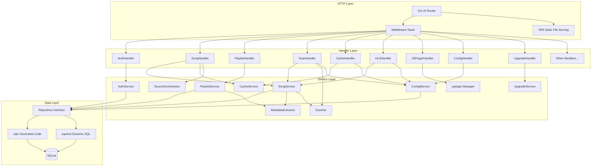
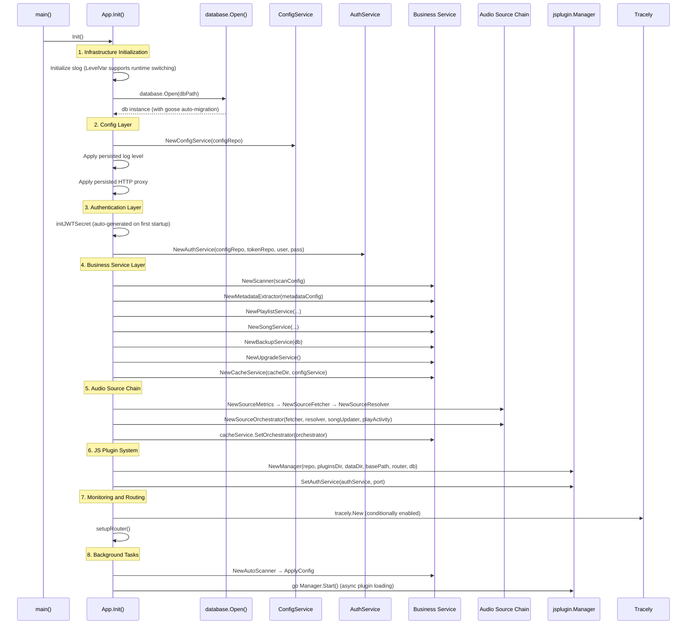
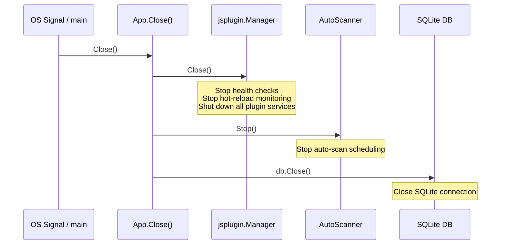
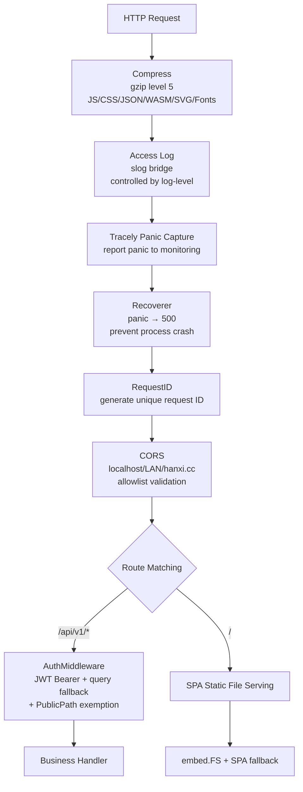
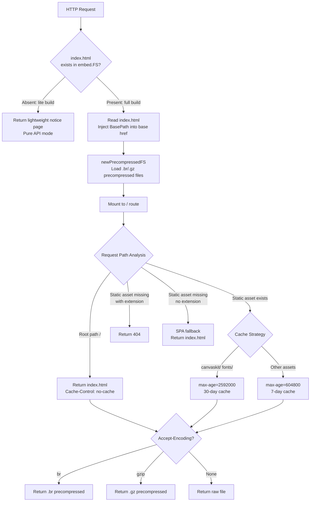

# Backend System Design

This document describes the overall architecture of the Songloft backend, the initialization sequence, lifecycle management, the middleware stack, and the static file serving mechanism.
The source code is located in <code>internal/app/</code> and <code>internal/config/</code>.

## Table of Contents

1. [Backend Architecture Overview](#1-backend-architecture-overview)
2. [App Initialization Sequence](#2-app-initialization-sequence)
3. [App Lifecycle](#3-app-lifecycle)
4. [Middleware Stack Ordering](#4-middleware-stack-ordering)
5. [Static File Serving Architecture](#5-static-file-serving-architecture)

---

## 1. Backend Architecture Overview

The Songloft backend adopts the classic three-tier layered architecture, using the `App` struct as the top-level container that wires up all dependencies and manages their lifecycle.



**Diagram sources**: `internal/app/app.go` (dependency injection), `internal/app/routers.go` (route registration)

Core design principles:

- **Dependency injection**: the Service layer only receives Repository interfaces, never the `DB` instance itself
- **Dual-track fixed SQL + dynamic SQL**: deterministic queries go through sqlc code generation, variable-length WHERE/SET clauses are built with squirrel
- **Cross-table writes**: always performed through `db.RunInTx(ctx, func(ctx, uow))` using a single `*sql.Tx`, avoiding SQLITE_BUSY

**Section sources**: `internal/app/app.go`, `internal/app/routers.go`

---

## 2. App Initialization Sequence

The `App.Init()` method is the startup entry point for the entire backend, creating and wiring all components in strict dependency order.



**Diagram sources**: `internal/app/app.go` Init() method

Key details of each initialization phase:

| Phase | Component | Key points |
|------|------|------|
| Infrastructure | slog + DB | `LevelVar` supports dynamic log-level switching at runtime; goose migrations run automatically when the DB is opened |
| Config layer | ConfigService | Reads all persisted configuration from the `configs` table (log level, HTTP proxy, music path, etc.) |
| Authentication layer | JWT + AuthService | `jwt_secret` is auto-generated and persisted on first startup; dual-token (access + refresh) mechanism |
| Business layer | Song/Playlist/Cache, etc. | Each Service is injected only with Repository interfaces; cross dependencies are lazily injected via `Set*` methods |
| Audio source chain | Fetcher → Resolver → Orchestrator | Decoupled from `jsplugin.Manager` / `MetadataExtractor` through adapter interfaces |
| Plugin system | jsplugin.Manager | Started asynchronously (`go Manager.Start`), including plugin loading + health checks + file-fingerprint hot reload |
| Background tasks | AutoScanner | Restores the auto-scan schedule from persisted configuration |

**Section sources**: `internal/app/app.go` Init() method (L87-L391)

---

## 3. App Lifecycle

### 3.1 Startup Flow (Start)

`App.Start()` is called after `Init()` completes, and is responsible for mounting the Chi router onto the HTTP server and starting to listen.

```go
func (a *App) Start() error {
    var handler http.Handler = a.router
    if a.config.BasePath != "" {
        mux := http.NewServeMux()
        mux.Handle(a.config.BasePath+"/", http.StripPrefix(a.config.BasePath, a.router))
        handler = mux
    }
    return http.ListenAndServe(":"+a.config.Port, handler)
}
```

When a `BasePath` is configured (such as `/songloft`), Start strips the prefix at the outermost layer using `http.StripPrefix`, ensuring that route matching inside the Chi router is unaffected by sub-path deployment. It also registers a 301 redirect that exactly matches `BasePath` (without a trailing slash), so that when a user visits `/songloft` they are automatically redirected to `/songloft/`.

### 3.2 Shutdown Flow (Close)

`App.Close()` shuts down each component in reverse dependency order:



**Diagram sources**: `internal/app/app.go` Close() method (L72-L85)

The shutdown order follows the principle of "stop producers first, then close consumers, and finally close storage": the JS plugin manager (which may issue DB writes) is closed first, the AutoScanner (which depends on SongService) is stopped next, and the database connection is closed last.

**Section sources**: `internal/app/app.go` Start() (L459-L483), Close() (L72-L85)

---

## 4. Middleware Stack Ordering

Middleware is registered onto the Chi router in order within `setupBaseRouter()`; requests pass through each middleware top to bottom, and responses return in reverse order.



**Diagram sources**: `internal/app/routers.go` setupBaseRouter() (L237-L349)

Responsibilities of each middleware:

| Middleware | Source | Responsibility |
|--------|------|------|
| **Compress** | chi middleware | Enables gzip level 5 compression for 9 MIME types |
| **Access Log** | `access_log.go` slogLogFormatter | Bridges the chi access log to slog, with dynamic control via `/settings/log-level` |
| **Tracely Panic** | inline defer/recover | Captures panics before Recoverer and reports them to Tracely monitoring, then re-panics |
| **Recoverer** | chi middleware | Captures panics and returns 500, preventing a single request from crashing the process |
| **RequestID** | chi middleware | Generates a unique ID for each request, used for log correlation and debugging |
| **CORS** | go-chi/cors | Validates cross-origin requests against an origin allowlist (localhost, LAN ranges, hanxi.cc domain) |
| **Auth** | `middleware/auth.go` | JWT Bearer token validation, with `access_token` query fallback (audio/image scenarios); optional `PublicPathChecker` exemption for plugin-declared public paths |

The Auth middleware is applied only to the `/api/v1/*` route group and JS plugin API routes; static file serving and public endpoints (`/health`, `/version`, `/auth/login`, `/auth/refresh`) do not go through authentication.

**Section sources**: `internal/app/routers.go` (L237-L349), `internal/app/access_log.go`, `internal/middleware/auth.go`

---

## 5. Static File Serving Architecture

Static file serving is implemented by `embed.go`, which embeds the Flutter Web frontend into the Go binary and provides SPA routing fallback at runtime.



**Diagram sources**: `internal/app/embed.go` (L17-L98), `internal/app/compress.go` (L32-L78)

### 5.1 Build Modes and Static Serving Behavior

| Build mode | embed.FS state | Behavior |
|----------|--------------|------|
| **Full build** (default) | Contains `songloft-player-build/web-embedded/` | Full SPA serving with precompression support |
| **Lite build** (`-tags lite`) | embed.FS is empty | The root path returns a lightweight notice page; pure API mode |

### 5.2 Precompressed File Serving (compress.go)

`precompressedFS` loads the build-time-generated `.br` (Brotli) and `.gz` (Gzip) precompressed files from embed.FS at startup. When a request arrives, it selects by `Accept-Encoding` priority:

1. **Brotli** (`br`): highest compression ratio, supported by all modern browsers
2. **Gzip** (`gzip`): the most broadly compatible fallback
3. **Raw file**: reads the original file from embed.FS when no compression encoding is supported

For `index.html`, whose content changes after `BasePath` injection, `addCustomEntry()` re-runs Brotli/Gzip compression at runtime, ensuring the precompressed cache always stays consistent with the actual content.

ETags are generated from a CRC32 checksum, combined with `If-None-Match` to implement 304 Not Modified responses, reducing transfer overhead.

### 5.3 SPA Routing Fallback Rules

The SPA fallback logic distinguishes static asset requests from frontend routing requests:

- **Path with extension** (such as `.js`, `.css`, `.png`): looked up in embed.FS; if not found, a 404 is returned directly, avoiding the frontend mistakenly parsing HTML as JS/JSON
- **Path without extension** (such as `/settings`, `/playlists/1`): treated as a frontend route, returning `index.html` and handing routing off to the Flutter client

**Section sources**: `internal/app/embed.go`, `internal/app/compress.go`
