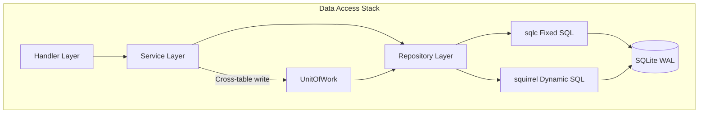
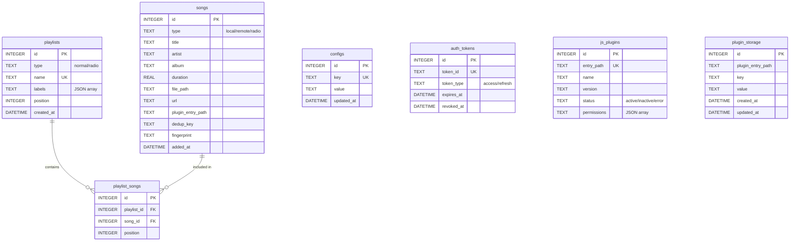

# Database Design

This document is based on the following source files:

- `internal/database/database.go` -- DB interface definition
- `internal/database/sqlite.go` -- SQLiteDB implementation, connection pool, goose migrations
- `internal/database/unit_of_work.go` -- UnitOfWork transaction pattern
- `internal/database/errors.go` -- unified error sentinels
- `internal/database/filters.go` -- dynamic filtering and sort allowlists
- `internal/database/song_repository.go` -- song repository (the largest Repository)
- `internal/database/playlist_repository.go` -- playlist repository
- `internal/database/playlist_song_repository.go` -- playlist-song junction repository
- `internal/database/config_repository.go` -- config item repository
- `internal/database/token_repository.go` -- auth token repository
- `internal/database/jsplugin_repository.go` -- JS plugin repository
- `internal/database/testutil/memdb.go` -- in-memory database test utility
- `internal/database/migrations/0001_init.sql` -- complete initial schema (6 tables + indexes + triggers + seed data)
- `internal/database/migrations/0002_*.sql` ~ `0025_*.sql` -- incremental migrations (including 0016 which adds the plugin_storage table)
- `internal/database/queries/*.sql` -- sqlc query definitions (7 files)
- `sqlc.yaml` -- sqlc code generation configuration

## Table of Contents

1. [Introduction](#1-introduction)
2. [Database Architecture Overview](#2-database-architecture-overview)
3. [ER Diagram](#3-er-diagram)
4. [Table Structure Details](#4-table-structure-details)
5. [Index and Constraint Design](#5-index-and-constraint-design)
6. [Migration System](#6-migration-system)
7. [sqlc Code Generation](#7-sqlc-code-generation)
8. [Repository Pattern](#8-repository-pattern)
9. [UnitOfWork Transaction Pattern](#9-unitofwork-transaction-pattern)
10. [Dynamic SQL and Filtering System](#10-dynamic-sql-and-filtering-system)
11. [Testing Strategy](#11-testing-strategy)
12. [Design Decisions and Conventions](#12-design-decisions-and-conventions)

---

## 1. Introduction

Songloft's data layer is built on SQLite, using WAL (Write-Ahead Logging) mode to achieve read/write concurrency. The entire data access stack consists of four layers: goose embedded migrations manage schema evolution, sqlc generates type-safe Go code from annotated SQL to handle fixed queries, squirrel builds dynamic WHERE/ORDER clauses, and Repository + UnitOfWork encapsulate business-level data operations and cross-table transactions.

The database driver is `modernc.org/sqlite` (a pure Go implementation), which requires no CGO, supports static compilation with `CGO_ENABLED=0`, and fits minimal images such as Docker scratch/alpine.

**Section sources**: `internal/database/sqlite.go` (Open function, DSN parameters), `AGENTS.md` (database conventions)

---

## 2. Database Architecture Overview

The system contains 7 business tables, forming a data model centered on songs and playlists.



Connection configuration (`sqlite.go` Open function):

| Parameter | Value | Description |
|------|-----|------|
| `journal_mode` | WAL | Read/write concurrency; reads are not blocked by writes |
| `busy_timeout` | 10000ms | Waits up to 10 seconds on a lock, avoiding SQLITE_BUSY |
| `synchronous` | NORMAL | Sufficiently safe under WAL mode |
| `cache_size` | 10000 pages (~40MB) | Page cache |
| `foreign_keys` | 1 | Enables foreign key constraints (CASCADE depends on this) |

Go connection pool: `MaxOpenConns=10`, `MaxIdleConns=5`, `ConnMaxLifetime=30min`.

**Section sources**: `internal/database/sqlite.go:28-55`

---

## 3. ER Diagram



**Diagram sources**: `internal/database/migrations/0001_init.sql`, `0007_*.sql` ~ `0025_*.sql` (`plugin_storage` see `0016_plugin_storage.sql`)

---

## 4. Table Structure Details

### 4.1 songs -- Songs Table

Stores metadata for three song types -- local, remote, and radio -- and is the largest table in the system (37 columns).

| Field | Type | Description |
|------|------|------|
| `id` | INTEGER PK | Auto-increment primary key |
| `type` | TEXT, CHECK | `local` / `remote` / `radio` |
| `title` / `artist` / `album` | TEXT | Basic metadata |
| `duration` | REAL | Duration (seconds) |
| `file_path` | TEXT | Local file path (local only) |
| `url` | TEXT | Remote/radio URL |
| `cover_path` / `cover_url` | TEXT | Local cover art path / remote URL |
| `lyric` | TEXT | Lyrics JSON (LyricPayload) |
| `lyric_source` | TEXT, CHECK | file / embedded / scraped / url / cached / manual |
| `lyric_remote_url` | TEXT | Remote lyrics URL (migration 0003) |
| `file_size` / `format` / `bit_rate` / `sample_rate` | mixed | Audio technical parameters |
| `is_live` | INTEGER | Whether it is a live stream (0/1) |
| `plugin_entry_path` | TEXT | Source plugin identifier |
| `source_data` | TEXT | Plugin-specific source data |
| `dedup_key` | TEXT | Dedup key (unique within a plugin) |
| `year` / `genre` | INTEGER / TEXT | Year / genre (migration 0007) |
| `fingerprint` / `fingerprint_duration` | TEXT / REAL | Audio fingerprint (migration 0008) |
| `isrc` | TEXT | International Standard Recording Code (migration 0009) |
| `cache_path` | TEXT | Local cache path for remote songs (migration 0014) |
| `cue_source_path` / `cue_track_index` / `cue_audio_path` | TEXT / INTEGER / TEXT | CUE track split source (migration 0018) |
| `file_modified_at` | DATETIME | File modification time, used for incremental scan detection (migration 0019) |
| `track` | TEXT | Track number (migration 0020) |
| `language` / `style` | TEXT | Language / style (migration 0022) |
| `is_video` | INTEGER | Whether it is a video (0/1, migration 0024) |
| `added_at` / `updated_at` | DATETIME | Insertion / update time (maintained by triggers) |

Key design: the `(plugin_entry_path, dedup_key)` composite unique index (a partial index, `WHERE dedup_key != ''`) is used to deduplicate remote songs by plugin. `UpsertRemote` leverages this index to implement "update if exists, insert if not".

**Section sources**: `internal/database/migrations/0001_init.sql`, `0005_lyric_source_manual.sql` (table rebuild), `0007`~`0024` incremental ALTER, `internal/database/song_repository.go`

### 4.2 playlists -- Playlists Table

| Field | Type | Description |
|------|------|------|
| `id` | INTEGER PK | Auto-increment primary key |
| `type` | TEXT, CHECK | `normal` / `radio` |
| `name` | TEXT, UNIQUE | Playlist name (globally unique) |
| `description` | TEXT | Description |
| `cover_path` / `cover_url` | TEXT | Cover art |
| `labels` | TEXT | Labels JSON array (`built_in` / `auto_created`) |
| `position` | INTEGER | Sort position |
| `created_at` / `updated_at` | DATETIME | Timestamps |

Seed data: `id=1` "Favorites" (labels=["built_in"]), `id=2` "Radio Favorites". `labels` is queried via `json_each()`, for example to skip built-in playlists during batch deletion.

**Section sources**: `internal/database/migrations/0001_init.sql:30-42,163-166`

### 4.3 playlist_songs -- Playlist-Song Junction Table

| Field | Type | Description |
|------|------|------|
| `id` | INTEGER PK | Auto-increment primary key |
| `playlist_id` | INTEGER FK | → playlists(id) ON DELETE CASCADE |
| `song_id` | INTEGER FK | → songs(id) ON DELETE CASCADE |
| `position` | INTEGER | Sort position of the song within the playlist |
| `added_at` | DATETIME | Time added |

`UNIQUE(playlist_id, song_id)` prevents duplicates. Bidirectional CASCADE ensures automatic cleanup when a song/playlist is deleted.

### 4.4 configs -- Config Table

`key` TEXT UNIQUE + `value` TEXT (usually JSON) + `updated_at` (maintained by trigger). Writes use UPSERT: `INSERT ... ON CONFLICT(key) DO UPDATE SET value = excluded.value`.

9 seed configs: migration 0001 writes 8 (`music_path`, `cover_storage_path`, `scan_config`, `ffprobe_path`, `jwt_secret` (randomly generated), `source_validation`/`source_fallback`/`source_metrics`); migration 0006 adds `plugin_registries`.

### 4.5 auth_tokens -- Auth Token Table

Stores JWT access/refresh token records. `token_id` is UNIQUE, `revoked_at` is NULLABLE (NULL means not revoked). Revocation check: `revoked_at IS NOT NULL OR expires_at < NOW`. `CleanExpired` periodically purges expired records.

### 4.6 js_plugins -- JS Plugin Table

Stores metadata for installed plugins (23 columns). `entry_path` is UNIQUE and serves as the routing identifier. The three fields `permissions`, `public_paths`, and `external_paths` are JSON arrays. The `status` CHECK constraint allows `active`/`inactive`/`error`.

**Section sources**: `internal/database/migrations/0001_init.sql`, `0010_*.sql`, `0011_*.sql`, `0013_*.sql`

### 4.7 plugin_storage -- Plugin Persistent KV Table

A key-value store that JS plugins read and write through the `storage` Bridge API (added in migration 0016). The combination of `plugin_entry_path` + `key` forms a `UNIQUE` constraint, implementing a per-plugin isolated namespace. `value` is TEXT (usually JSON), with `created_at` / `updated_at` timestamps. Queries are defined in `internal/database/queries/plugin_storage.sql`.

| Field | Type | Description |
|------|------|------|
| `id` | INTEGER PK | Auto-increment primary key |
| `plugin_entry_path` | TEXT | Plugin identifier (namespace) |
| `key` | TEXT | Key |
| `value` | TEXT | Value (defaults to `''`, usually JSON) |
| `created_at` / `updated_at` | DATETIME | Timestamps |

**Section sources**: `internal/database/migrations/0016_plugin_storage.sql`, `internal/database/queries/plugin_storage.sql`

---

## 5. Index and Constraint Design

| Index name | Table | Columns | Type | Description |
|--------|-----|-----|------|------|
| `idx_songs_type` | songs | type | Regular | Filter by type |
| `idx_songs_title` | songs | title | Regular | Title search |
| `idx_songs_artist` | songs | artist | Regular | Artist search |
| `idx_songs_added_at` | songs | added_at DESC | Regular | Default sort optimization |
| `idx_songs_file_path` | songs | file_path | Regular | Folder-prefix LIKE (migration 0004) |
| `idx_songs_plugin_entry_path` | songs | plugin_entry_path | Partial | WHERE != '' |
| `idx_songs_dedup_key_unique` | songs | (plugin_entry_path, dedup_key) | Unique + partial | Remote song deduplication |
| `idx_songs_fingerprint` | songs | fingerprint | Partial | Duplicate detection (migration 0008) |
| `idx_playlists_name_unique` | playlists | name | Unique | Globally unique playlist name |
| `idx_playlist_songs_position` | playlist_songs | (playlist_id, position) | Regular | In-playlist sorting |
| `idx_auth_tokens_*` | auth_tokens | token_id/type/expires/revoked | Regular | Queries across dimensions |
| `idx_js_plugins_*` | js_plugins | status/entry_path | Regular | Status and path queries |

The four core tables (songs/playlists/configs/js_plugins) each have an `AFTER UPDATE` trigger that automatically maintains `updated_at = CURRENT_TIMESTAMP`.

**Section sources**: `internal/database/migrations/0001_init.sql:106-160`

---

## 6. Migration System

Migration files are embedded into the Go binary via `//go:embed migrations/*.sql`; at startup `goose.Up` automatically runs all unapplied migrations, requiring no external tooling.

```go
//go:embed migrations/*.sql
var migrationsFS embed.FS

func runMigrations(db *sql.DB) error {
    goose.SetBaseFS(migrationsFS)
    goose.SetDialect("sqlite3")
    return goose.Up(db, "migrations")
}
```

### Migration File List (25 files)

| Number | Description |
|------|------|
| 0001 | Initial schema: 6 tables + indexes + triggers + built-in playlists + default config |
| 0002 | Add `scan_auto_create_include_subdirs` config item |
| 0003 | Add `lyric_remote_url` column, migrate bare LRC to JSON |
| 0004 | Add `file_path` index (folder-prefix queries) |
| 0005 | Relax the `lyric_source` CHECK constraint to add `manual` (table rebuild) |
| 0006 | Seed the official plugin registry URL |
| 0007 | Add `year`, `genre` fields |
| 0008 | Add `fingerprint`, `fingerprint_duration` + partial index |
| 0009 | Add `isrc` field |
| 0010 | js_plugins adds `public_paths` JSON array |
| 0011 | js_plugins adds `icon` field |
| 0012 | Add `scan_auto_create_playlists` config item |
| 0013 | js_plugins adds `external_paths` JSON array |
| 0014 | songs adds `cache_path` (local cache path for remote songs) |
| 0015 | Add scan playlist mode config |
| 0016 | Add `plugin_storage` table (plugin KV storage) |
| 0017 | Fix cover storage path |
| 0018 | songs adds CUE support (`cue_source_path`/`cue_track_index`/`cue_audio_path`) |
| 0019 | songs adds `file_modified_at` |
| 0020 | songs adds `track` (track number) |
| 0021 | Scan support for `.mov` format |
| 0022 | songs adds `language`, `style` |
| 0023 | Scan support for `.mp4` format |
| 0024 | Video support: songs adds `is_video` |
| 0025 | Add facet index |

### Notes

- SQLite does not support `ALTER TABLE ... MODIFY COLUMN` or modifying a CHECK constraint, so migration 0005 uses a "table rebuild" strategy: CREATE TABLE songs_new → INSERT INTO ... SELECT → DROP TABLE songs → ALTER TABLE songs_new RENAME TO songs → rebuild all indexes and triggers.
- Each SQL statement must be independently wrapped in `-- +goose StatementBegin` / `-- +goose StatementEnd`; otherwise the SQLite driver executes only the first prepared statement in a single Exec, and subsequent SQL is silently lost.
- Directly running `ALTER data/songloft.db` is forbidden; all schema changes must go through migration files.
- Migration file names follow the `000N_description.sql` format, and goose executes them in numeric order.

**Section sources**: `internal/database/sqlite.go:16,58-67`, all files under `internal/database/migrations/`

---

## 7. sqlc Code Generation

`sqlc.yaml` is configured with engine=sqlite, reads SQL from `queries/`, infers the schema from `migrations/`, and generates code into `internal/database/sqlc/`. Key options: `emit_interface: true` generates a `DBTX` interface so that `*sql.DB` and `*sql.Tx` are interchangeable; `emit_empty_slices: true` returns `[]T` instead of nil for empty results.

The 7 query files correspond to the 7 tables:

| File | Query count | Representative queries |
|------|--------|-----------|
| `songs.sql` | 30 | GetSongByID, CreateSong, UpdateRemoteSongMutable, FindSongByDedupKey, ListDuplicateFingerprints |
| `playlists.sql` | 13 | GetPlaylistByID, CreatePlaylist, FindPlaylistByName, InsertAutoCreatedPlaylist |
| `playlist_songs.sql` | 11 | AddSongToPlaylist, GetPlaylistSongs(Paginated), AddSongToPlaylistIgnore |
| `configs.sql` | 3 | GetConfig, SetConfig (UPSERT), DeleteConfig |
| `tokens.sql` | 5 | CreateToken, RevokeToken, IsTokenRevoked, CleanExpiredTokens |
| `js_plugins.sql` | 8 | ListJSPlugins, CreateJSPlugin, UpdateJSPluginStatus, UpdateJSPluginHashes |
| `plugin_storage.sql` | 7 | Plugin KV read/write (GetPluginStorage/SetPluginStorage, etc.) |

sqlc annotation conventions: `:one` returns a single row, `:many` returns a slice, `:exec` executes only, `:execrows` returns the number of affected rows, `:execlastid` returns the last insert ID. After modifying queries you must run `make sqlc` and commit the generated artifacts.

**Section sources**: `sqlc.yaml`, `internal/database/queries/*.sql`

---

## 8. Repository Pattern

### 8.1 Architecture

Each Repository holds a `sqlc.DBTX` interface, delegates fixed queries to `*sqlc.Queries`, and uses squirrel for dynamic queries. It is obtained via `SQLiteDB` factory methods.

```go
type SongRepository struct {
    db      sqlc.DBTX      // *sql.DB or *sql.Tx
    queries *sqlc.Queries  // sqlc-generated queries
}
```

### 8.2 SongRepository -- Song Repository

The largest repository, covering the full song lifecycle. Key methods:

| Method | SQL approach | Description |
|------|----------|------|
| `GetByID` / `Create` / `Update` / `Delete` | sqlc | Basic CRUD |
| `UpdateLyrics` / `UpdateDuration` / `UpdateFingerprint` | sqlc | Partial field updates |
| `UpsertRemote` | sqlc | Deduped write of remote songs by dedup_key |
| `List` / `ListIDs` / `Count` | squirrel | Dynamic filtering + sorting + pagination |
| `BatchCreate` / `BatchDelete` | mixed | Batch operations with automatic transaction management |
| `ListLocalPaths` | sqlc | Used for scan deduplication |
| `ListDuplicateGroups` | sqlc | Fingerprint duplicate detection |

### 8.3 PlaylistRepository -- Playlist Repository

| Method | SQL approach | Description |
|------|----------|------|
| `Create` / `Update` | sqlc (transaction) | Includes duplicate-name conflict detection |
| `List` / `Count` | squirrel | LEFT JOIN to count songs |
| `AutoCreate` | mixed (transaction) | Batch-generate playlists based on directory structure |
| `BatchDelete` | manual SQL | Skips built_in playlists |
| `BatchUpdatePositions` | sqlc (transaction) | Batch update of sort order |

### 8.4 PlaylistSongRepository -- Junction Repository

Manages the many-to-many association between playlists and songs.

| Method | SQL approach | Description |
|------|----------|------|
| `AddSong` / `AddSongIgnore` | sqlc | Add a song; the latter silently skips if it already exists |
| `AddSongsBatch` | sqlc (transaction) | Batch append, automatically skipping existing entries, returning (added, skipped) |
| `RemoveSong` | sqlc | Remove a song |
| `ReplaceSong` | sqlc (transaction) | Replace an old song with a new one, preserving its position |
| `GetSongs` / `GetSongsPaginated` | sqlc | Fetch songs ordered by position |
| `CountSongs` / `MaxPosition` | sqlc | Count and position queries |
| `BatchUpdatePositions` | sqlc (transaction) | Rewrite all positions in the given order |
| `ListPlaylistsContainingSong` | sqlc | Find all playlists containing a given song (used by the conversion service) |

### 8.5 ConfigRepository -- Config Repository

| Method | SQL approach | Description |
|------|----------|------|
| `Get` | sqlc | Read by key; returns `ErrNotFound` if not found |
| `Set` | sqlc | UPSERT write (INSERT ON CONFLICT DO UPDATE) |
| `Delete` | sqlc | Delete by key |
| `List` / `Count` | squirrel | Keyword filtering + allowlisted sorting + pagination |

### 8.6 TokenRepository -- Token Repository

| Method | SQL approach | Description |
|------|----------|------|
| `Create` | sqlc | Write a new token and back-fill the ID |
| `GetByID` | sqlc | Look up by token_id |
| `Revoke` | sqlc | Mark as revoked (set revoked_at) |
| `IsRevoked` | sqlc | Determine whether revoked or expired |
| `ListActive` | squirrel | List active tokens (dynamic filtering + sorting) |
| `CleanExpired` | sqlc | Batch-purge expired records |

### 8.7 JSPluginRepository -- Plugin Repository

A pure sqlc repository with no dynamic SQL needs.

| Method | SQL approach | Description |
|------|----------|------|
| `GetAll` / `GetByID` / `GetByEntryPath` | sqlc | Queries (JSON fields auto-deserialized) |
| `Create` / `Update` | sqlc | Full-field operations (JSON fields serialized) |
| `Delete` | sqlc | Delete |
| `UpdateStatus` | sqlc | Update the status field only |
| `UpdateHashes` | sqlc | Update zip_hash/entry_hash/file_mod_time |

### 8.8 Error Semantics

```go
var ErrNotFound = errors.New("database: record not found")  // sql.ErrNoRows or RowsAffected()==0
var ErrConflict = errors.New("database: conflict")          // UNIQUE constraint violation
```

The Service layer uses `errors.Is` to distinguish: `ErrNotFound` → HTTP 404, `ErrConflict` → business semantics (such as `ErrPlaylistNameConflict`).

**Section sources**: `internal/database/errors.go`, the various `*_repository.go`

---

## 9. UnitOfWork Transaction Pattern

Under SQLite's single-writer architecture, cross-table writes must be completed within the same `*sql.Tx`. `UnitOfWork` binds the three write-heavy Repositories to the same transaction:

```go
type UnitOfWork struct {
    Songs         *SongRepository
    Playlists     *PlaylistRepository
    PlaylistSongs *PlaylistSongRepository
}
```

`SQLiteDB.RunInTx` automatically manages the transaction lifecycle, rolling back when fn returns an error, and also rolling back and re-panicking on panic:

```go
db.RunInTx(ctx, func(ctx context.Context, uow *database.UnitOfWork) error {
    if err := uow.Songs.Create(ctx, newSong); err != nil {
        return err
    }
    return uow.PlaylistSongs.ReplaceSong(ctx, playlistID, oldSongID, newSong.ID)
})
```

Some Repository methods also need a transaction internally (such as Create's duplicate-name check + INSERT). Smart nesting is implemented through the `runInTx` helper function: it starts a transaction itself when the underlying object is `*sql.DB`, and directly reuses it when the underlying object is already a `*sql.Tx`.

**Section sources**: `internal/database/unit_of_work.go`, `internal/database/sqlite.go:80-102`

---

## 10. Dynamic SQL and Filtering System

### Filter Structs

A corresponding Filter is defined for each entity: `SongFilter` (Type/Keyword/PathPrefix/pagination/sorting), `PlaylistFilter` (Type/Labels/Keyword), `ConfigFilter` (Keyword), `TokenFilter` (TokenType/IsActive).

### Sort Allowlist

To prevent SQL injection, sort fields must be within the allowlist, otherwise the query falls back to the default sort:

```go
var songOrderWhitelist = map[string]struct{}{
    "id": {}, "title": {}, "artist": {}, "album": {},
    "duration": {}, "added_at": {}, "updated_at": {},
}
```

`applyOrder` handles sorting logic uniformly, supporting table-prefixed JOIN queries (such as `"p."` for the playlist LEFT JOIN). `applyPagination` handles LIMIT/OFFSET uniformly (limit<=0 means no pagination).

### squirrel Build Flow

```go
sb := songSelectBuilder()           // base SELECT
sb = applySongFilter(sb, filter)    // dynamic WHERE
sb = applyOrder(sb, ...)            // allowlisted sorting
sb = applyPagination(sb, ...)       // pagination
query, args, _ := sb.ToSql()        // generate SQL
```

`PathPrefix` filtering uses `escapeLikeLiteral` to escape wildcards plus an `ESCAPE '\'` clause. The playlist list uses a LEFT JOIN subquery to count songs.

**Section sources**: `internal/database/filters.go`, `internal/database/song_repository.go:280-311,448-464`

---

## 11. Testing Strategy

`testutil.OpenMemoryDB` provides a zero-configuration test database:

```go
func OpenMemoryDB(t *testing.T) *database.SQLiteDB {
    db, err := database.Open(":memory:")  // automatically runs all goose migrations
    if err != nil { t.Fatalf(...) }
    t.Cleanup(func() { _ = db.Close() })
    return db
}
```

- A real SQLite `:memory:`, not a mock; the schema is fully identical to production
- Each test gets an independent instance, with no state pollution
- Hand-written mock DBs are forbidden; all tests go through real Repositories
- Row-count assertions must subtract the built-in data (2 playlists + 9 configs)

**Section sources**: `internal/database/testutil/memdb.go`, `AGENTS.md`

---

## 12. Design Decisions and Conventions

**No ORM**: fixed queries → sqlc compile-time type checking; dynamic queries → explicit squirrel building (string concatenation forbidden); cross-table writes → RunInTx + UnitOfWork.

**JSON field storage**: SQLite TEXT fields store JSON, queried via `json_each()`/`json_extract()`. The Go layer does `json.Marshal` on Create/Update and `json.Unmarshal` in RowToModel. Fields involved: `playlists.labels`, `js_plugins.permissions/public_paths/external_paths`, `configs.value`.

**CASCADE deletion**: the bidirectional CASCADE on `playlist_songs` is a core design -- deleting a song automatically cleans up that song's records in all playlists, and deleting a playlist automatically cleans up all associations under it. Repository method comments clearly note this dependency (for example, `SongRepository.Delete` is commented: "playlist_songs is automatically cleaned up by FK ON DELETE CASCADE"). Relies on the `foreign_keys=1` PRAGMA being enabled.

**The Service layer must not manipulate transactions directly**: it must obtain a UnitOfWork through `DB.RunInTx`, and calling `BeginTx` on its own is forbidden, avoiding SQLITE_BUSY deadlocks under SQLite's single-writer model.

**Cover art reference counting**: cover art is stored shared by content hash; `SongRepository.CountCoverPathReferences` counts the total number of rows across both the songs and playlists tables that reference the same `cover_path`, and the caller must confirm the count is 0 before physically deleting the cover file.

**Section sources**: `AGENTS.md` (database conventions), the various Repository source files
