# Service Layer Design

This document is based on all source files under the `internal/services/` directory, covering the responsibility boundaries, key methods, and dependency relationships of the song, playlist, authentication, config, scan, cache, audio-source orchestration, backup, upgrade, and fingerprint services.

## Table of Contents

1. [Design Principles](#1-design-principles)
2. [SongService -- Song Management](#2-songservice----song-management)
3. [PlaylistService -- Playlist Management](#3-playlistservice----playlist-management)
4. [AuthService -- Authentication and JWT](#4-authservice----authentication-and-jwt)
5. [ConfigService -- Config Management](#5-configservice----config-management)
6. [Scanner -- File Scanner](#6-scanner----file-scanner)
7. [AutoScanner -- Auto-Scan Scheduling](#7-autoscanner----auto-scan-scheduling)
8. [MetadataExtractor -- Audio Metadata Extraction](#8-metadataextractor----audio-metadata-extraction)
9. [ScanProgressManager -- Scan Progress Tracking](#9-scanprogressmanager----scan-progress-tracking)
10. [CacheService -- Audio Cache](#10-cacheservice----audio-cache)
11. [FingerprintService -- Audio Fingerprint](#11-fingerprintservice----audio-fingerprint)
12. [BackupService -- Backup and Restore](#12-backupservice----backup-and-restore)
13. [UpgradeService -- Online Upgrade](#13-upgradeservice----online-upgrade)
14. [Auxiliary Services and Utility Modules](#14-auxiliary-services-and-utility-modules)
15. [source Subpackage -- Audio Source Orchestration Architecture](#15-source-subpackage----audio-source-orchestration-architecture)
16. [playactivity Subpackage -- Play Activity Tracking](#16-playactivity-subpackage----play-activity-tracking)
17. [Inter-Service Dependency Diagram](#17-inter-service-dependency-diagram)

---

## 1. Design Principles

The service layer follows these core conventions:

- **Dependency injection**: each Service only receives Repository interfaces and never depends directly on `*database.DB`.
- **Transaction management**: cross-table writes are completed through `Transactor.RunInTx` + `UnitOfWork`; manually calling `BeginTx` at the service layer is forbidden.
- **Error semantics**: the repository layer uniformly returns `database.ErrNotFound` on a miss, and the service uses `errors.Is` to distinguish it.
- **Optional dependencies**: some service dependencies are lazily injected via `Set*` methods (such as `SongService.SetCacheService`), avoiding circular dependencies and startup-ordering issues.
- **Interface segregation**: cross-layer calls all go through minimal interfaces (such as `CacheSongFetcher`, `SongUpdater`, `Prober`) to prevent circular dependencies between packages.

**Section sources**: `internal/services/song_service.go`, `AGENTS.md`

---

## 2. SongService -- Song Management

SongService is the largest service in the service layer, responsible for the full lifecycle management of songs, including local file scan import and remote song management.

### Core Dependencies

| Dependency | Type | Description |
|------|------|------|
| `SongRepository` | interface | Song CRUD, batch operations, fingerprint queries |
| `Transactor` | interface | Transaction executor (`RunInTx`) |
| `MetadataExtractor` | struct | Audio metadata extraction |
| `Scanner` | struct | Filesystem scanning |
| `ConfigService` | struct | Read scan configuration |
| `PlaylistAutoCreator` | interface | Auto-create playlists after scanning |
| `CacheService` | optional injection | Cascade cache cleanup when deleting a song |
| `FingerprintService` | optional injection | Auto-compute fingerprints after a scan completes |

### Key Methods

| Method | Description |
|------|------|
| `GetByID` / `List` / `Search` / `Count` / `ListIDs` | Song queries, supporting multi-criteria filtering and pagination |
| `Update` / `Delete` / `BatchDelete` | Song modification and deletion; deletion cascades cover art and cache cleanup |
| `ScanAndImportAsync` | Asynchronously triggers local file scan import (4-worker concurrent metadata extraction, 50-item batch transaction writes) |
| `AddRemoteSongs` / `AddRadios` | Batch-add network songs/radios; remote songs are deduplicated by `dedup_key` via `UpsertRemote` |
| `UpdateLyrics` | Update lyrics and attempt to write them back to the local audio file's tags |
| `UpdateSongDuration` / `UpdateSongSource` | Update duration and audio source info via SourceOrchestrator callbacks |
| `CleanInvalidSongs` | Clean up records for songs whose files no longer exist or reside in excluded directories |
| `OrganizeSongs` | Batch move/rename local song files and update database paths |
| `DownloadCover` / `SaveCoverFromData` | Cover art download and saving |

### Scan Import Flow

`doScanAndImport` uses a three-stage pipeline:

1. **Pre-filtering**: compares disk files against existing database paths, skipping unchanged files (including file-stability detection -- files modified within 10 seconds are treated as being written).
2. **Concurrent extraction**: 4 worker goroutines extract metadata in parallel (tag library + ffprobe fallback), including spam-tag detection (`fixSpamTags`: when more than 50% of files in the same directory share the same title/artist, fall back to the file name).
3. **Batch writes**: commit every 50 items through a `RunInTx` transaction, reducing SQLite WAL flush overhead.

After the scan completes, it triggers in sequence: auto-create playlists (`runAutoCreatePlaylists`), auto-compute fingerprints (`runAutoFingerprint`).

### Cover Art Reference Counting

`removeCoverIfUnreferenced` is a package-level helper shared by both SongService and PlaylistService. Cover art is stored in layered fashion by content hash (the first 4 characters of the SHA-256 form two levels of directories); multiple songs/playlists may share the same physical file, so the reference count must be confirmed to be 0 before deletion.

**Section sources**: `internal/services/song_service.go`

---

## 3. PlaylistService -- Playlist Management

PlaylistService manages playlist CRUD and playlist-song association operations.

### Core Dependencies

| Dependency | Type | Description |
|------|------|------|
| `PlaylistRepository` | interface | Playlist CRUD, batch operations |
| `PlaylistSongRepository` | interface | Playlist-song association (add/remove/sort) |
| `SongRepository` | interface | Query song type, cover art reference counting |
| `MetadataExtractor` | struct | Cover art saving |

### Key Methods

| Method | Description |
|------|------|
| `Create` / `GetByID` / `Update` / `Delete` | Playlist CRUD; built-in playlists (`built_in`) cannot be deleted and only allow cover changes |
| `BatchDelete` | Batch delete, automatically skipping built-in playlists |
| `AddSong` / `AddSongs` / `RemoveSong` | Song association operations; the batch `AddSongs` first queries types to filter out incompatible songs |
| `GetSongs` / `CountSongs` | Paginated retrieval of songs in a playlist |
| `ReorderSongs` / `ReorderPlaylists` | Drag-and-drop sorting |
| `UploadCover` | Upload a playlist cover image |
| `Touch` | Update the last-played time |

### Business Rules

- The playlist type (`normal`/`radio`) determines which song types can be added, validated by `playlist.CanAddSong(songType)`.
- The `name`/`description`/`labels`/`type` of built-in playlists (id=1 Favorites, id=2 Radio Favorites) cannot be modified.

**Section sources**: `internal/services/playlist_service.go`

---

## 4. AuthService -- Authentication and JWT

AuthService implements a single-user authentication model, based on the JWT dual-token (Access + Refresh) mechanism.

### Core Dependencies

| Dependency | Type | Description |
|------|------|------|
| `TokenRepository` | interface | Token persistence and revocation-state queries |
| `ConfigRepository` | interface | Read the `jwt_secret` key (only at construction) |

### Key Methods

| Method | Description |
|------|------|
| `Login` | Validate username and password, generate an Access Token (7 days) + Refresh Token (30 days) |
| `Logout` | Revoke the Access Token and the Refresh Token of the same client |
| `RefreshToken` | Revoke the old token pair and generate a new token pair |
| `ValidateToken` | JWT signature verification + revocation-state check, with an in-memory `sync.Map` cache (a background task purges expired entries every minute) |
| `GeneratePluginToken` | Plugin-only permanent token (valid for 100 years, not persisted, regenerated after a process restart) |

**Section sources**: `internal/services/auth_service.go`

---

## 5. ConfigService -- Config Management

ConfigService encapsulates read/write of generic KV configuration, with an in-memory cache layer.

### Core Dependencies

| Dependency | Type | Description |
|------|------|------|
| `ConfigRepository` | interface | Config CRUD |

### Key Methods

- **Reads**: `GetString` / `GetInt` / `GetBool` / `GetJSON` -- typed reads, cache-first, returning a default value when missing.
- **Writes**: `Set` / `SetJSON` / `CreateConfig` / `UpdateConfig` / `DeleteConfig` -- write to the DB then automatically clear the corresponding cache.
- **Cache management**: `ClearCache` / `ClearCacheKey` -- manual invalidation.
- **CRUD**: `ListConfigs` / `CountConfigs` / `GetConfig` -- used by the generic config editor.

The cache uses a `sync.Map` to store `key → value` mappings, with no TTL expiration; it relies on active invalidation during write operations.

**Section sources**: `internal/services/config_service.go`

---

## 6. Scanner -- File Scanner

Scanner is responsible for recursively scanning the music directory and returning the paths of all supported-format audio files.

### Core Dependencies

No Repository dependency; purely filesystem operations. Configuration (music directory path, exclusion rules, list of supported formats) is injected via `ScanConfig`.

### Key Methods

- `ScanFiles` -- recursively scans the music directory and returns a list of file paths. Uses `filepath.EvalSymlinks` + a `visited` map to prevent symlink loops.
- `ShouldExcludeDir` -- dual-mode exclusion: exact match by full path (`ExcludePaths`) + pattern match by directory name (`ExcludeDirs`).
- `IsFileInExcludedArea` -- determines whether a file is in an excluded area (used by `CleanInvalidSongs`).
- `ListSubDirs` / `CollectAllDirNames` -- frontend directory-tree lazy loading and autocompletion.
- `GetFileInfo` -- get basic file information (size/modification time/format).

**Section sources**: `internal/services/scanner.go`

---

## 7. AutoScanner -- Auto-Scan Scheduling

Automatically triggers file scans at a configured interval. Depends on `SongService` (calling `ScanAndImportAsync`) and `ConfigService` (reading the `auto_scan` JSON config).

Key methods: `GetConfig` (read enabled state and interval), `ApplyConfig` (stop the old schedule, start a new ticker goroutine), `Stop`. The interval in seconds is clamped to the range [60, 86400].

**Section sources**: `internal/services/auto_scan.go`

---

## 8. MetadataExtractor -- Audio Metadata Extraction

MetadataExtractor extracts metadata such as title, artist, album, duration, cover art, and lyrics from audio files.

### Core Dependencies

No Repository dependency. The ffprobe path, cover art storage path, and title-source configuration are injected via `MetadataConfig`.

### Key Methods

| Method | Description |
|------|------|
| `Extract` | Full metadata extraction: tag library first, ffprobe fallback to fill in duration/bitrate/sample rate |
| `ProbeForValidation` | Probe technical metrics (duration/format/bitrate/sample rate/size), used for download validation |
| `SaveCover` / `SaveCoverData` | Save cover art deduplicated by SHA-256 content hash (`covers/{hash[0:2]}/{hash[2:4]}/{full_hash}.{ext}`) |
| `FindLyricFile` / `ReadLyricFile` | Find and read a same-named `.lrc` file (overriding embedded lyrics) |

Title decision: when `TitleSource=tag` (default), use the tag's title if it has one, otherwise use the file name; when `TitleSource=filename`, always use the file name. It does not perform "longest common substring dedup + concatenation".

**Section sources**: `internal/services/metadata.go`

---

## 9. ScanProgressManager -- Scan Progress Tracking

A thread-safe state machine that tracks the full lifecycle of file scan import. State transitions: `idle → scanning → importing → creating_playlists → completed`, with `cancelling → cancelled` and `failed` branches.

Key methods: `Start` (CAS semantics to prevent concurrency), `SetTotalFiles`, `UpdateProgress` (per-file imported/skipped/failed), `Cancel` (broadcast the cancellation signal over a channel), `Complete`/`Fail`. The `ScanProgress` struct contains the state, total file count, scanned/imported/skipped/failed counts, count of cleaned-up stale files, current file path, and start/end times.

**Section sources**: `internal/services/scan_progress.go`

---

## 10. CacheService -- Audio Cache

CacheService provides transparent caching of remote songs, comprising two parts: raw audio caching and transcode caching. The song remains of type `remote`; on a cache hit the local path is returned directly.

### Core Dependencies

| Dependency | Type | Description |
|------|------|------|
| `ConfigService` | struct | Read/write cache configuration (`music_cache_config`) |
| `CacheSongFetcher` | interface (optional injection) | Download orchestrator for plugin songs (actually SourceOrchestrator) |

### Key Methods -- Song Cache (`cache_service_song.go`)

| Method | Description |
|------|------|
| `Get` | Unified entry: return directly on a cache hit / download and write to cache on a miss |
| `FindCachedFileBySong` | Find cache files in `{id}.{cache_key}.{ext}` format |
| `EvictSong` | Delete all caches for a given song (called by the SongService deletion hook) |

### Key Methods -- Transcode Cache (`cache_service_transcode.go`)

| Method | Description |
|------|------|
| `GetOrTranscode` | Return directly if the format matches / return on a cache hit / transcode with ffmpeg and cache on a miss |
| `FindTranscodedFile` | Find a transcode cache file (`{id}.{key}.tc.{format}`) |
| `NeedsTranscode` / `NormalizeFormat` | Format normalization and transcode decision |

### Key Methods -- Infrastructure (`cache_service.go`)

| Method | Description |
|------|------|
| `GetCacheStats` | Count the cache directory size and file count |
| `CleanCache` | Clear all caches |
| `EvictLRU` | LRU eviction: use a max-heap to select the oldest files and delete them one by one until below the limit |
| `GetCacheConfig` / `UpdateCacheConfig` | Config management (`max_size`, `cache_dir`) |

### Cache File Layout

```
cache_dir/{id/100%1000}/{id/10000%100}/{id}.{cache_key}.{ext}
```

`cache_key` is computed by `cacheKeyOf`: for a plugin source, `sanitize(plugin + "_" + dedup_key)`; for a pure external link, `"u" + md5(URL)[:12]`. This prevents false hits caused by ID collisions after cross-DB rebuilds.

### Inflight Deduplication

Concurrent requests for the same `song.ID` are deduplicated through the `inflightDownload` channel, downloading only once. Special handling: when the first request is canceled by `ctx.Canceled` (the user switches songs), subsequent waiters retry the download rather than inheriting the cancellation error.

### LRU Eviction

Uses `container/heap` to implement a max-heap, keeping only the oldest N files during traversal (N = max(indexSize/4, 128)), with O(N) memory overhead instead of O(total file count). When over the limit, deletion starts from the oldest.

**Section sources**: `internal/services/cache_service.go`, `cache_service_song.go`, `cache_service_transcode.go`

---

## 11. FingerprintService -- Audio Fingerprint

Manages Chromaprint-based audio fingerprint computation, used for duplicate song detection. Depends on the `SongRepository` interface.

Key methods: `ComputeMissing` (4-worker concurrent computation of missing fingerprints), `RecomputeAll` (clear then fully recompute), `GetProgress` (returns status/computed/total/failed). If a task is already running, it interrupts the old task before restarting.

Underlying tools: `ExtractFingerprint` calls `ffmpeg -f chromaprint` to extract a base64 fingerprint (15-second timeout); `IsChromaprintAvailable` detects and caches the result on first call.

**Section sources**: `internal/services/fingerprint.go`

---

## 12. BackupService -- Backup and Restore

Implements export and import of playlists and their song data. Depends on the `database.DB` interface, completing the import within a single transaction via `RunInTx` + `UnitOfWork`.

- `Export` -- export all playlists and their song metadata as a `BackupData` struct.
- `Import` -- merge songs for playlists with the same name; local songs are matched by `file_path` (skipped if not present); remote/radio songs are deduplicated by `dedup_key` via `UpsertRemote`; no new `built_in` labels are created.

**Section sources**: `internal/services/backup_service.go`

---

## 13. UpgradeService -- Online Upgrade

UpgradeService implements online upgrade and rollback in a Docker environment. It has no Repository dependency and uses `httputil.NewClient` to create a proxy-aware HTTP client.

### Key Methods

| Method | Description |
|------|------|
| `CheckForUpdates` | Only checks the current channel: dev by build_time, release by version number; switching updates between dev/release or full/lite is forbidden |
| `UpgradeBinary` | Full flow: download → test (-help) → back up → `os.Rename` atomic replace → delay 5 seconds then `os.Exit(0)` |
| `ResetToBaseImage` | Roll back to the Docker base image: `/app/songloft` → `/app/data/songloft` |
| `GetProgress` | Get upgrade progress (status/percentage/current step) |

`getPlatformSuffix` appends the download URL suffix based on the base image's Build Type (`full`/`lite`), ensuring the type stays consistent after upgrade.

**Section sources**: `internal/services/upgrade_service.go`

---

## 14. Auxiliary Services and Utility Modules

### 14.1 LyricFetcher -- Lyrics Fetching (`lyric_fetcher.go`)

Fetches a lyrics payload from a lyric URL. Depends on `InternalURLResolver` to assemble relative paths into local absolute URLs. The `Fetch` method parses the `{code, data: {lyric, tlyric, rlyric, lxlyric}}` envelope format, limiting the response body to 5 MB.

### 14.2 InternalURLResolver -- Internal URL Resolution (`internal_url.go`)

Assembles relative paths starting with `/` into the form `http://127.0.0.1:{port}{path}?access_token={token}`, used for backend-internal HTTP calls (lyrics fetching, cache download, etc.). Absolute URLs are returned unchanged.

### 14.3 moveFile -- Cross-Device File Move (`file_move.go`)

First attempts `os.Rename`; if it hits `syscall.EXDEV` (cross-device), it falls back to copy + remove. Typical scenario: `os.CreateTemp("")` in `/tmp` (tmpfs) with the target directory on a Docker volume.

### 14.4 WriteSongTags -- Metadata Write-Back (`song_file_writer.go`)

Writes song metadata fully back into the audio file (`pkg/tag.WriteTag`, dispatched by extension + temp-file atomic write). Returns a `FileWriteStatus` (written/unchanged/skipped/failed) rather than an error, implementing the semantics of "the DB must succeed, a file failure can be degraded". Before writing, it compares against existing tags via `tagsUnchanged` and skips if they match. Supported write formats: MP3, FLAC, APE, WAV, M4A/MP4/M4B/MOV, OGG/OGA, AIFF/AIF (text, lyrics, and cover art can all be written, except that WAV does not support cover art due to format constraints); other extensions return `ErrUnsupportedWrite`, and the caller degrades it to a log without blocking the main flow.

### 14.5 IsHostnameAllowed -- SSRF Protection (`whitelist.go`)

Intranet-blocking policy: after resolving the domain name via DNS, checks whether it is a loopback/private/link-local/unspecified address, blocking SSRF. On resolution failure it lets the request through, leaving the subsequent HTTP request to report the error.

**Section sources**: `internal/services/upgrade_service.go`, `lyric_fetcher.go`, `internal_url.go`, `file_move.go`, `song_file_writer.go`, `whitelist.go`

---

## 15. source Subpackage -- Audio Source Orchestration Architecture

`internal/services/source/` implements the probing, validation, switching, and health feedback of network song audio sources. It uses a three-tier orchestration architecture and is the sole entry point between CacheService and the audio-source logic.

### 15.1 Architecture Overview

```
CacheService.Get
       │
       ▼
SourceOrchestrator.Fetch(song, mode)
       │
       ├─ Step 1: Primary source + L1 in-plugin self-search
       │       └─ SourceFetcher.Fetch(primary plugin, source_data, allowFallback=true)
       │               ├─ plugin /api/music/url → obtain download URL
       │               ├─ HTTP download → temp file
       │               ├─ Prober.ProbeForValidation → technical metrics
       │               ├─ Validator.Validate → integrity validation
       │               └─ Metrics.Record → report result
       │
       └─ Step 2 (ModeFallback only): L2 cross-plugin fan-out
               └─ SourceResolver.Discover → candidate audio source list
                       ├─ concurrently call each plugin's /api/search
                       ├─ similarityScore similarity scoring
                       ├─ Metrics.WeightedScore weighted ranking
                       └─ SourceFetcher.Fetch each (candidate, allowFallback=false)
```

### 15.2 SourceOrchestrator -- Orchestrator (`orchestrator.go`)

The orchestrator is the top layer of audio-source acquisition, coordinating the Fetcher, Resolver, and SongUpdater.

**Two working modes**:

| Mode | Behavior | Use case |
|------|------|----------|
| `ModeStrict` | Only try the primary source + L1 in-plugin self-search, returning immediately on failure | Synchronous paths such as the cache HTTP handler |
| `ModeFallback` | Full-chain fallback: primary source → L1 → L2 cross-plugin fan-out | Background batch tasks |

**Key methods**:

| Method | Description |
|------|------|
| `Fetch` | Orchestrate the entire download chain, returning a `FetchResult` (with the temp file path) on success |
| `AsyncReassign` | Background silent source switching: called asynchronously when the cache handler fails, deduplicated for the same songID within 5 minutes |
| `persistIfChanged` | On success, write back the song's `plugin_entry_path` / `source_data` and back-fill the missing `duration` |

**Fallback strategy**:

- Sleep `[FallbackInterval, FallbackInterval + FallbackJitter)` between L2 candidates to avoid rate control (default 3-5 seconds).
- The total number of attempts is limited by `MaxAttempts` (default 4).
- Error classification determines whether to fall back: `IsFallbackable` returns true for `InvalidAudioError`/`NetworkError`/`PluginInvocationError`.

### 15.3 SourceFetcher -- Download and Validation (`fetcher.go`)

SourceFetcher fetches a temp file via `(plugin_entry_path, source_data)` and completes validation.

**Dependency injection** (via `FetcherOpts`):

| Dependency | Description |
|------|------|
| `Prober` | Abstraction of `MetadataExtractor.ProbeForValidation` |
| `PluginInvoker` | Abstraction of `jsplugin.Manager.InvokeHTTP` |
| `SourceMetrics` | Result reporting |
| `LoadValidationOpts` | Hot-read validation config at runtime |

**Fetch flow**:

1. Call the plugin `POST /api/music/url`: pass `source_data` + an optional `fallback` hint.
2. HTTP download to a temp file (120-second timeout).
3. `Prober.ProbeForValidation` probes technical metrics.
4. `Validate` checks integrity (duration/bitrate/format).
5. On success: report `OutcomeSuccess` and return a `FetchResult`. On failure: report the corresponding classification and clean up the temp file.

### 15.4 SourceResolver -- Cross-Plugin Search (`resolver.go`)

SourceResolver searches for a same-named song across all active audio-source plugins, returning ranked candidate sources.

**Key methods**:

| Method | Description |
|------|------|
| `Discover` | Fan-out concurrent calls to each plugin's `/api/search`, ranked by similarity score + health weighting |

**Ranking algorithm**:

Combined similarity = 0.5 * titleSim + 0.3 * artistSim + 0.2 * durationSim

- `titleSim`: normalized Levenshtein distance after normalization.
- `artistSim`: multiple artists split by `/&,`, taking the set IoU.
- `durationSim`: normalized relative difference.

Final score = combined similarity * Metrics.WeightedScore (`0.3 + 0.7 * successRate`).

**Configuration**: 5-second timeout per plugin, 8-second total fan-out timeout, minimum score 0.6, at most 5 candidates, 5-minute LRU cache.

### 15.5 SourceMetrics -- Health Statistics (`metrics.go`)

Uses a ring buffer (default 200 entries) to maintain each plugin's most recent Fetch results, computing the success rate and a three-tier health classification: `green` (success rate >= 0.8 and samples >= 10), `yellow` (in between, or insufficient samples), `red` (success rate < 0.4 and samples >= 10, filtered out by the Resolver).

Key methods: `Record` (report a result), `SuccessRate`/`Class` (query health), `WeightedScore` (`0.3 + 0.7 * successRate`, used for Resolver ranking), `Snapshot` (admin API snapshot).

### 15.6 Validator -- File Integrity Validation (`validator.go`)

`Validate` is a pure function that determines whether a downloaded file is complete:

1. Master switch off → pass directly (graceful degradation).
2. Absolute lower bound on duration (default 30 seconds).
3. Relative duration deviation (default 0.85 ~ 1.5 times the expected duration).
4. Lower bound on average bitrate (default 8 kbps).

### 15.7 Error Classification (`errors.go`)

| Error type | Description | Fallbackable |
|----------|------|-----------------|
| `InvalidAudioError` | Validation failed (duration/bitrate not qualified) | Yes |
| `NetworkError` | HTTP-layer failure (DNS/timeout/non-2xx) | Yes |
| `PluginInvocationError` | Plugin invocation failed | Yes |
| `AllSourcesFailedError` | All candidates tried, terminal error | No |

**Diagram sources**: `internal/services/source/orchestrator.go`, `fetcher.go`, `resolver.go`, `metrics.go`, `validator.go`, `errors.go`

---

## 16. playactivity Subpackage -- Play Activity Tracking

`internal/services/playactivity/` maintains cancel handles for in-progress work "related to a given song", so that when the user switches songs the old work can be canceled all at once.

### Problem Background

Issue #79: rapid song switching still "spins". One root cause is that the backend cannot externally know that the user has abandoned the old request, and the old HTTP play, prefetch, ffmpeg transcode, and AsyncReassign keep occupying plugin workers and the transcode semaphore.

### Core Types

| Type | Description |
|------|------|
| `Registry` | A cancel table indexed by `(SessionKey, songID, Category)` |
| `SessionKey` | Buckets by client session (`client_id`), preventing multiple clients from canceling each other |
| `Category` | Work type: `play` / `prefetch` / `transcode` / `reassign` |

### Key Methods

| Method | Description |
|------|------|
| `Track` | Register a piece of work, returning a derived ctx + a release closure (which must be called via defer) |
| `Activate` | Mark a song as currently active: cancel all work of other songs in the same bucket + the prefetch of the same song |
| `Size` / `TotalSize` | For diagnostics: return the per-bucket / global entry count |

### Activate Cancellation Strategy

When `Activate(sk, keepSongID)` is called: cancel all work of other songs in the same bucket + the prefetch of the same song; retain the same song's play/transcode/reassign. The cancellation operation first collects entries, releases the lock, and only then cancels, avoiding reentrancy.

`SourceOrchestrator` registers the AsyncReassign ctx into the Registry via the `ReassignTracker` interface, so that when the user switches songs the reassign goroutine immediately yields.

**Section sources**: `internal/services/playactivity/registry.go`

---

## 17. Inter-Service Dependency Diagram

```mermaid
graph TD
    subgraph "Core Business Services"
        SongSvc["SongService"]
        PlaylistSvc["PlaylistService"]
        AuthSvc["AuthService"]
        ConfigSvc["ConfigService"]
    end

    subgraph "Scanning and Metadata"
        Scanner["Scanner"]
        MetaExtractor["MetadataExtractor"]
        ScanProgress["ScanProgressManager"]
        AutoScanner["AutoScanner"]
    end

    subgraph "Cache and Transcoding"
        CacheSvc["CacheService"]
    end

    subgraph "source Subpackage"
        Orchestrator["SourceOrchestrator"]
        Fetcher["SourceFetcher"]
        Resolver["SourceResolver"]
        Metrics["SourceMetrics"]
        Validator["Validator"]
    end

    subgraph "playactivity Subpackage"
        Registry["Registry"]
    end

    subgraph "Other Services"
        FpSvc["FingerprintService"]
        BackupSvc["BackupService"]
        UpgradeSvc["UpgradeService"]
        LyricFetch["LyricFetcher"]
        URLResolver["InternalURLResolver"]
    end

    subgraph "Repository Interfaces"
        SongRepo["SongRepository"]
        PlaylistRepo["PlaylistRepository"]
        PlaylistSongRepo["PlaylistSongRepository"]
        TokenRepo["TokenRepository"]
        ConfigRepo["ConfigRepository"]
        Transactor["Transactor"]
    end

    %% SongService dependencies
    SongSvc --> SongRepo
    SongSvc --> Transactor
    SongSvc --> MetaExtractor
    SongSvc --> Scanner
    SongSvc --> ConfigSvc
    SongSvc --> ScanProgress
    SongSvc -.->|Optional injection| CacheSvc
    SongSvc -.->|Optional injection| FpSvc
    SongSvc -.->|PlaylistAutoCreator| PlaylistSvc

    %% PlaylistService dependencies
    PlaylistSvc --> PlaylistRepo
    PlaylistSvc --> PlaylistSongRepo
    PlaylistSvc --> SongRepo
    PlaylistSvc --> MetaExtractor

    %% AuthService dependencies
    AuthSvc --> TokenRepo
    AuthSvc -.->|Read jwt_secret at construction| ConfigRepo

    %% ConfigService dependencies
    ConfigSvc --> ConfigRepo

    %% AutoScanner dependencies
    AutoScanner --> SongSvc
    AutoScanner --> ConfigSvc

    %% CacheService dependencies
    CacheSvc --> ConfigSvc
    CacheSvc -.->|CacheSongFetcher| Orchestrator

    %% source subpackage dependencies
    Orchestrator --> Fetcher
    Orchestrator --> Resolver
    Orchestrator -.->|SongUpdater| SongSvc
    Orchestrator -.->|ReassignTracker| Registry
    Fetcher --> Metrics
    Fetcher -.->|Prober| MetaExtractor
    Resolver --> Metrics

    %% FingerprintService dependencies
    FpSvc --> SongRepo

    %% LyricFetcher dependencies
    LyricFetch --> URLResolver

    %% BackupService dependencies (uses the DB interface directly)
    BackupSvc -.->|database.DB| Transactor

    style SongSvc fill:#e1f5fe
    style CacheSvc fill:#e8f5e9
    style Orchestrator fill:#fff3e0
    style Registry fill:#fce4ec
```



**Diagram sources**: the constructors and injection methods of all source files under `internal/services/`
