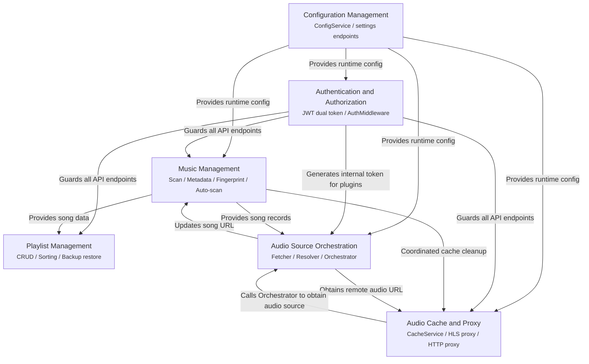

# Core Feature Implementation

This document is the overview page for the "Core Feature Implementation" directory, indexing the detailed sub-pages of the six major feature domains.
The source code is located in <code>internal/app/app.go</code> (component initialization and dependency wiring) and <code>internal/app/routers.go</code> (route grouping and endpoint registration).

- [internal/app/app.go](https://github.com/songloft-org/songloft/blob/main/internal/app/app.go) -- The creation and wiring order of all core components in App.Init()
- [internal/app/routers.go](https://github.com/songloft-org/songloft/blob/main/internal/app/routers.go) -- Route groups: authentication, songs, playlists, scan, cache, settings, upgrade, etc.

## Table of Contents

1. [Overview](#1-overview)
2. [Music Management](#2-music-management)
3. [Playlist Management](#3-playlist-management)
4. [Audio Source Orchestration](#4-audio-source-orchestration)
5. [Audio Cache and Proxy](#5-audio-cache-and-proxy)
6. [Authentication and Authorization](#6-authentication-and-authorization)
7. [Configuration Management](#7-configuration-management)
8. [Feature Domain Dependencies](#8-feature-domain-dependencies)

---

## 1. Overview

The core business logic of the Songloft backend is distributed across six major feature domains, each accomplished by the collaboration of several Service, Handler, and Repository components. `App.Init()` wires up all components in a strict dependency order: first infrastructure (database, config), then the authentication layer, then the business Services (scan, songs, playlists, cache), followed by the audio source processing chain (Fetcher / Resolver / Orchestrator), and finally the background tasks (AutoScanner, async JS plugin loading).

The following sections briefly introduce each feature domain's responsibilities, core components, and corresponding route groups; for detailed implementations refer to the individual sub-pages.

**Section sources**: `internal/app/app.go` Init() (L87-L391)

---

## 2. Music Management

Music management covers local file scanning, audio metadata extraction, audio fingerprint computation, and automatic scan scheduling, and is the data entry point of the entire system. `Scanner` traverses the file system according to the configured music directory and filter rules, `MetadataExtractor` extracts metadata such as title, artist, album, and cover art from audio files, `FingerprintService` computes audio fingerprints via the Chromaprint algorithm for duplicate detection, and `AutoScanner` periodically triggers a full scan based on persisted config.

Key components:

| Component | Type | Responsibility |
|------|------|------|
| `Scanner` | Service | File system traversal, with format filtering and directory exclusion |
| `MetadataExtractor` | Service | Audio metadata reading (tag library + ffprobe fallback) |
| `FingerprintService` | Service | Chromaprint audio fingerprint computation and duplicate detection |
| `AutoScanner` | Service | Scheduled scan orchestration, restored from the `auto_scan` config |
| `SongService` | Service | Song CRUD, batch operations, invalid song cleanup |
| `ScanHandler` | Handler | `/scan`, `/scan/progress`, `/scan/fingerprints` endpoints |
| `SongHandler` | Handler | `/songs` CRUD, `/songs/{id}/play`, `/songs/{id}/cover` endpoints |

Route groups: `/api/v1/scan/*` (scan operations), `/api/v1/songs/*` (song CRUD and playback), `/api/v1/settings/music-path` (music path config), `/api/v1/settings/auto-scan` (auto-scan toggle).

**Section sources**: `internal/app/app.go` (L206-L224, L377-L381), `internal/app/routers.go` (L117-L131, L155-L165, L181-L189)

---

## 3. Playlist Management

Playlist management provides creating, reading, updating, and deleting playlists, as well as adding, removing, and sorting songs within a playlist, and also supports export/import backup of playlist data. The system pre-provisions two built-in playlists (id=1 "Favorites", id=2 "Radio Favorites", tagged with `labels=["built_in"]`), created by database migration scripts. `PlaylistService` manages the many-to-many relationship between playlists and songs via `PlaylistRepository` and `PlaylistSongRepository`, and `BackupService` serializes playlist data to JSON for export and restore.

Key components:

| Component | Type | Responsibility |
|------|------|------|
| `PlaylistService` | Service | Playlist CRUD, song association, sorting |
| `BackupService` | Service | Playlist export (JSON) and import restore |
| `PlaylistHandler` | Handler | `/playlists` CRUD, `/playlists/{id}/songs` endpoints |
| `BackupHandler` | Handler | `/playlists/export`, `/playlists/import` endpoints |

Route groups: `/api/v1/playlists/*` (playlist CRUD, song operations, cover art, sorting, batch delete, backup import/export).

**Section sources**: `internal/app/app.go` (L223), `internal/app/routers.go` (L133-L151)

---

## 4. Audio Source Orchestration

Audio source orchestration is the core mechanism by which Songloft handles playback of network songs, using a three-layer architecture: `SourceFetcher` performs HTTP probing and validity verification against a single audio source; `SourceResolver` iterates over all installed JS plugins, sorts them by health metrics, and calls each plugin in turn to obtain source candidates; `SourceOrchestrator`, as the top-level orchestrator, coordinates the Fetcher and Resolver workflow and updates the song record after a source is successfully obtained. The `PlayActivity` registry tracks the in-progress work of each song (play/prefetch/transcode/reassign) and automatically cancels the in-progress operations of the old request when the user quickly skips tracks.

Key components:

| Component | Type | Responsibility |
|------|------|------|
| `SourceFetcher` | source package | Single-source HTTP probing, validity verification, metric reporting |
| `SourceResolver` | source package | Multi-plugin candidate sorting, trying sources in turn to obtain an available one |
| `SourceOrchestrator` | source package | Orchestrates Fetcher + Resolver, updates the song URL |
| `SourceMetrics` | source package | Pure in-memory rolling window, collecting plugin audio source health metrics |
| `PlayActivity Registry` | playactivity package | Global table for canceling across song/session |

Route groups: Audio source orchestration does not register route endpoints directly; instead it is called internally by `SongHandler.GetSongPlay` (`/api/v1/songs/{id}/play`) and `CacheService`. The `SourceMetrics` health data is exposed to the admin interface via `GET /api/v1/plugins/health` (`JSPluginHandler.handlePluginHealth`).

**Section sources**: `internal/app/app.go` (L254-L322), `internal/app/routers.go` (L194-L200)

---

## 5. Audio Cache and Proxy

Audio cache and proxy comprises three subsystems: the music cache (CacheService) transparently caches the audio files of remote songs to the server's local storage, using an LRU eviction strategy and an inflight deduplication mechanism; the HLS proxy, in proxy mode, has the server fetch and rewrite the `.m3u8` playlist and proxy all segments and key segments, resolving source-site hotlink protection and CORS issues; the general HTTP proxy provides unified proxy forwarding for all outbound backend requests (plugin registry fetching, upgrade checks, etc.).

Key components:

| Component | Type | Responsibility |
|------|------|------|
| `CacheService` | Service | Transparent caching of remote audio files, LRU eviction, inflight deduplication |
| `HLSHandler` | Handler | m3u8 rewriting and segment/key reverse-proxying in HLS proxy mode |
| `httputil.ProxyConfig` | utility package | Global HTTP proxy config and shared Transport |
| `CacheHandler` | Handler | `/cache-manage/*` cache stats, cleanup, config endpoints |

Route groups: `/api/v1/cache-manage/*` (cache stats, cleanup, config, directory validation), `/api/v1/songs/{id}/hls/*` (HLS reverse proxy), `/api/v1/settings/hls-proxy` (HLS proxy toggle), `/api/v1/settings/http-proxy` (general proxy config).

**Section sources**: `internal/app/app.go` (L237-L249, L128-L138), `internal/app/routers.go` (L153-L154, L169-L170, L201-L207, L214-L219)

---

## 6. Authentication and Authorization

The authentication system is based on a JWT dual-token mechanism: a short-lived Access Token is used for API request authentication, and a long-lived Refresh Token is used for seamless renewal. On first startup, `initJWTSecret` automatically generates the secret and persists it to the `configs` table. `AuthService` manages token issuance, refresh, revocation, and listing, and `TokenRepository` persists Refresh Token state to support multi-device management. The authentication middleware `AuthMiddleware` extracts the token from the `Authorization: Bearer` header first, falling back to the `access_token` query parameter (for scenarios such as audio streams and images where custom request headers are not possible), and also supports the `publicPaths` exemption mechanism declared by JS plugins.

Key components:

| Component | Type | Responsibility |
|------|------|------|
| `AuthService` | Service | JWT issuance, refresh, revocation, token listing |
| `AuthHandler` | Handler | `/auth/login`, `/auth/refresh`, `/auth/tokens` endpoints |
| `AuthMiddleware` | Middleware | Bearer + query fallback authentication, PublicPath exemption |
| `TokenRepository` | Repository | Refresh Token persistence and state management |

Route groups: `/api/v1/auth/*` (login and refresh are public endpoints; logout and token management require authentication).

**Section sources**: `internal/app/app.go` (L140-L142, L227-L232, L257-L262), `internal/app/routers.go` (L97-L99, L111-L114)

---

## 7. Configuration Management

Configuration management comprises three layers of config interfaces: standalone business endpoints (`/settings/<name>`) provide strongly-typed JSON config for frontend features, with default values and side-effect triggering; business module aggregate endpoints (such as `/cache-manage/config`) organize config together with the module's action endpoints; and the general KV endpoint (`/configs/{key}`) serves as an admin-editor backdoor, allowing manual reading and writing of arbitrary config key-values. `ConfigService` wraps `ConfigRepository` and provides convenience methods such as `GetString`, `GetJSON`, and `Set`. The tab config (`/settings/tab-config`) controls the display and ordering of the frontend bottom navigation bar. The `onConfigChanged` callback mechanism ensures the side effects of the general KV endpoint and the business endpoints stay consistent.

Key components:

| Component | Type | Responsibility |
|------|------|------|
| `ConfigService` | Service | Config CRUD, JSON serialization/deserialization |
| `ConfigHandler` | Handler | `/configs/*` general KV endpoint, `/settings/tab-config` endpoint |
| `ScanHandler` | Handler | `/settings/music-path`, `/settings/auto-scan`, and other scan-related config |
| `HLSHandler` | Handler | `/settings/hls-proxy` HLS proxy toggle |
| `JSPluginHandler` | Handler | `/settings/plugin-registries`, `/settings/http-proxy` endpoints |
| `LogHandler` | Handler | `/settings/log-level` dynamic log-level switching |
| `ConfigRepository` | Repository | Persistent read/write of the `configs` table |

Route groups: `/api/v1/configs/*` (general KV CRUD), `/api/v1/settings/*` (individual business config endpoints, distributed across the corresponding business Handlers).

**Section sources**: `internal/app/app.go` (L115-L117), `internal/app/routers.go` (L56-L71, L153-L172, L174-L179)

---

## 8. Feature Domain Dependencies

There are clear dependencies among the six feature domains: configuration management is the infrastructure for all domains, authentication and authorization guards all API endpoints, music management provides song data for playlists and audio sources, and audio source orchestration is called by the cache service to obtain remote audio.

**Diagram sources**: `internal/app/app.go` (the dependency injection order in the Init method and the `Set*` cross-dependency injection), `internal/app/routers.go` (route grouping and Handler dependencies)
