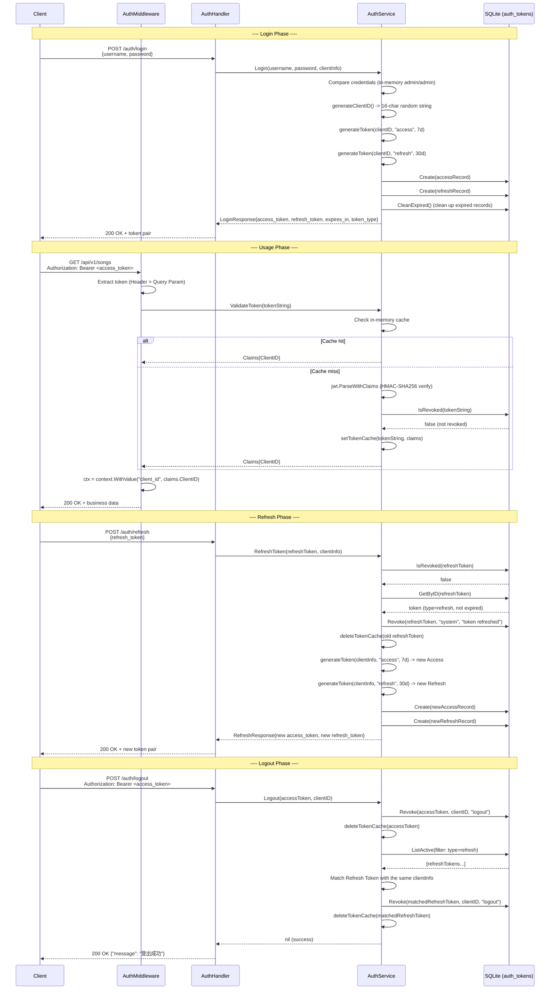

# Authentication and Authorization

internal/services/auth_service.go
internal/middleware/auth.go
internal/handlers/auth.go
internal/database/token_repository.go
internal/models/models.go
internal/app/app.go
internal/config/types.go
internal/database/migrations/0001_init.sql
internal/database/queries/tokens.sql
internal/database/filters.go

## Table of Contents

- [Overview](#overview)
- [JWT Dual-Token Mechanism](#jwt-dual-token-mechanism)
- [Authentication Flow](#authentication-flow)
- [Token Management](#token-management)
- [Plugin Internal Token](#plugin-internal-token)
- [Middleware Flow](#middleware-flow)
- [Security Strategy](#security-strategy)
- [Flow Sequence Diagram](#flow-sequence-diagram)
- [Database Schema](#database-schema)

---

## Overview

**Section source**: `internal/services/auth_service.go`, `internal/middleware/auth.go`, `internal/app/app.go`

Songloft uses a JWT (JSON Web Token) dual-token mechanism to implement authentication and authorization. The system is a single-user architecture; the administrator credentials are passed in via command-line arguments or environment variables, and the JWT signing secret (HMAC-SHA256) is automatically generated on first startup and persisted to the SQLite `configs` table. All API endpoints that require authentication are intercepted uniformly by a Chi v5 middleware, and the public paths declared by plugins can bypass authentication.

Core components:

| Component | File | Responsibility |
|------|------|------|
| `AuthService` | `services/auth_service.go` | JWT generation/validation/refresh/revocation, in-memory cache |
| `AuthMiddleware` | `middleware/auth.go` | HTTP request interception, token extraction and signature verification |
| `AuthHandler` | `handlers/auth.go` | REST API endpoints (login/logout/refresh/token management) |
| `TokenRepository` | `database/token_repository.go` | Token persistence (sqlc + squirrel) |
| `auth_tokens` table | `migrations/0001_init.sql` | Token storage schema |

---

## JWT Dual-Token Mechanism

**Section source**: `internal/services/auth_service.go` (L126-L174), `internal/models/models.go` (L450-L462)

The system uses an Access Token + Refresh Token dual-token model:

| Attribute | Access Token | Refresh Token |
|------|-------------|---------------|
| Validity period | 7 days | 30 days |
| Purpose | Access protected API endpoints | Obtain a new token pair |
| Database storage | `token_type = 'access'` | `token_type = 'refresh'` |
| Signing algorithm | HMAC-SHA256 | HMAC-SHA256 |

### Claims Structure

```go
type Claims struct {
    ClientID string `json:"client_id"` // 客户端标识或 "plugin-system"
    jwt.RegisteredClaims                // 标准字段：ExpiresAt, IssuedAt, ID
}
```

Each JWT contains three standard claims: `exp` (expiration time), `iat` (issued-at time), `jti` (a 32-character random Token ID), plus a custom `client_id` field. `client_id` is generated as a 16-character random string by `generateClientID()` when the user logs in, and is fixed to `"plugin-system"` in plugin tokens.

### Token Generation

The `generateToken` method (L436-L455) is uniformly responsible for issuing tokens: it constructs the Claims, signs with `jwt.SigningMethodHS256`, and uses the `jwt_secret` from the database as the key. The generated JWT string serves both as the client credential and, as the `token_id` primary key of the `auth_tokens` table, is stored in the database.

### Response Format

A successful login returns a `LoginResponse`:

```json
{
  "access_token": "eyJhbGciOiJIUzI1NiIs...",
  "refresh_token": "eyJhbGciOiJIUzI1NiIs...",
  "expires_in": 604800,
  "token_type": "Bearer"
}
```

`expires_in` is the remaining seconds of the Access Token (about 604800 seconds, i.e. 7 days), and `token_type` is fixed to `"Bearer"`.

---

## Authentication Flow

**Section source**: `internal/services/auth_service.go` (L105-L174, L256-L334), `internal/handlers/auth.go`

### Login

1. The client POSTs `/api/v1/auth/login` with request body `{"username": "...", "password": "..."}`
2. `AuthHandler.Login` obtains `clientInfo` from `UserAgent` or `RemoteAddr`
3. `AuthService.Login` compares the credentials (the `username`/`password` held in memory, sourced from command-line arguments or default values)
4. Generates a 16-character random `clientID`
5. Issues an Access Token (7 days) and a Refresh Token (30 days) separately
6. Writes both token records into the `auth_tokens` table, storing the client UA in `client_info`
7. Triggers `CleanExpired` to clean up expired token records
8. Returns `LoginResponse` (containing the dual tokens + expiration seconds + type)

### RefreshToken

1. The client POSTs `/api/v1/auth/refresh` with request body `{"refresh_token": "..."}` (this endpoint requires no Bearer authentication)
2. `AuthService.RefreshToken` checks whether the Refresh Token has been revoked (`IsRevoked`)
3. Retrieves the token record from the database and validates that `token_type == "refresh"` and it is not expired
4. Revokes the old Refresh Token (marking `revoked_by = "system"`, `reason = "token refreshed"`)
5. Issues a brand-new Access Token + Refresh Token pair
6. Stores the new token pair into the database and clears the old token cache
7. Returns `RefreshResponse` (same structure as `LoginResponse`)

Refresh uses a **rotation strategy (Token Rotation)**: each refresh discards the old Refresh Token and issues a new pair, reducing the window of risk after a token leak.

### Logout

1. The client POSTs `/api/v1/auth/logout` (Bearer authentication required)
2. Extracts the current Access Token from the `Authorization` header
3. Revokes that Access Token (`reason = "logout"`)
4. Queries all active Refresh Tokens, matches by `client_info` to find the Refresh Token of the same client, and revokes it as well
5. Clears the in-memory cache of all related tokens

---

## Token Management

**Section source**: `internal/handlers/auth.go` (L150-L253), `internal/services/auth_service.go` (L383-L396)

The system provides a complete token lifecycle management API; all endpoints require Bearer authentication:

### ListTokens (GET `/api/v1/auth/tokens`)

Lists the currently active (not revoked and not expired) tokens. Supported query parameters:

| Parameter | Type | Default | Description |
|------|------|--------|------|
| `type` | string | empty (all) | Filter by type: `access` or `refresh` |
| `limit` | int | 20 | Items per page |
| `offset` | int | 0 | Pagination offset |

The underlying `TokenRepository.ListActive` uses squirrel to build the query dynamically, with the sort field restricted to the allowlist `{id, token_type, expires_at, created_at}` (to prevent SQL injection), and defaults to sorting by `created_at DESC`.

The return structure contains a `tokens` array (each item containing `token_id`, `token_type`, `client_info`, `expires_at`, `created_at`), `total`, `limit`, and `offset`.

### RevokeToken (DELETE `/api/v1/auth/tokens/{token_id}`)

Actively revokes the specified token. The request body `{"reason": "..."}` records the revocation reason. The revocation operation will:

1. Set `revoked_at` (the current time), `revoked_by` (obtained from the `X-Client-ID` header), and `revoked_reason` in the `auth_tokens` table
2. Clear the in-memory cache of that token, ensuring subsequent requests take effect immediately

### GetTokenInfo (GET `/api/v1/auth/tokens/{token_id}`)

Retrieves the detailed information of the specified token. Currently this endpoint returns `501 Not Implemented`, reserved for future implementation. The corresponding `TokenInfo` model has already been defined and contains complete audit fields (`revoked_at`, `revoked_by`, `revoked_reason`).

### client_info Tracking

On each login and refresh, the handler automatically obtains the client information (UA string) from `r.UserAgent()`, falling back to `r.RemoteAddr` if it is empty. This information is stored in the `auth_tokens.client_info` field and is used to:
- Identify different devices/clients in the token list
- Associate and revoke the Refresh Token of the same client by `client_info` on logout

---

## Plugin Internal Token

**Section source**: `internal/services/auth_service.go` (L398-L433, L357-L363)

When the JS plugin sandbox (QuickJS) internally calls host APIs it needs a valid JWT, but the user's Access Token is not suitable for this. The system provides `GeneratePluginToken` to issue permanent tokens dedicated to plugin use.

### Characteristics

| Attribute | Value |
|------|------|
| `client_id` | Fixed `"plugin-system"` |
| Validity period | 100 years (effectively permanent) |
| Database storage | **Not stored** |
| Revocation check | **Skipped** (in `ValidateToken`, `client_id == "plugin-system"` passes directly) |
| Lifecycle | Process-level, regenerated after restart |

### Design Considerations

The plugin token is not stored in the database for three reasons:
1. The CHECK constraint on `auth_tokens.token_type` only allows `'access'` and `'refresh'`, so this avoids modifying the schema
2. The plugin token is for internal use and does not require persistence and revocation management
3. It is automatically regenerated after the program restarts, and its security is guaranteed by the JWT signature

In the `ValidateToken` validation flow (L357-L363), after detecting `claims.ClientID == "plugin-system"` it directly caches and returns, skipping the database `IsRevoked` query to avoid a false positive caused by no such token being found.

---

## Middleware Flow

**Section source**: `internal/middleware/auth.go`, `internal/app/routers.go`

### Authentication Middleware (AuthMiddleware)

`AuthMiddleware` is a Chi v5 middleware factory function that takes an `*AuthService` and a variadic `PublicPathChecker`, and returns a `func(http.Handler) http.Handler`.

**Processing flow** (from highest to lowest priority):

```
Request enters
  |
  v
[1] PublicPathChecker check ──── matches public path ──── pass through directly (next.ServeHTTP)
  |
  no match
  |
  v
[2] Authorization header extraction ──── "Bearer <token>" ──── obtain tokenString
  |
  header is empty
  |
  v
[3] Query Param extraction ──── ?access_token=<token> ──── obtain tokenString
  |                              (includes Xiaoai speaker space fix)
  no token
  |
  v
  401 "Missing authentication information"
  |
  has token
  |
  v
[4] AuthService.ValidateToken ──── failure ──── 401 "Invalid token"
  |
  success
  |
  v
[5] Write into context("client_id") ──── next.ServeHTTP
```

### Token Extraction Details

**Header first**: extracted from `Authorization: Bearer <token>`, using `strings.TrimPrefix` to ensure only the `Bearer` scheme is accepted.

**Query Param fallback**: extracted from `?access_token=<token>`. This is to support scenarios where the HTTP header cannot be customized (`` tags loading cover art, `<audio>` tags playing audio, Flutter `CachedNetworkImage`, etc.).

**Xiaoai speaker compatibility**: firmware on devices such as HyperOS replaces the `&` in the URL with a space, causing `access_token=xxx param2=val2` to become a single parameter value. The middleware splits it with `strings.Cut(tokenString, " ")`, restoring the swallowed parameter back into the query string.

### PublicPathChecker Interface

```go
type PublicPathChecker interface {
    IsPublicPath(path string) bool
}
```

Implemented by `JSPluginManager`, used for the `publicPaths` declared by plugins in their manifest (such as the Subsonic-compatible `/rest/*` endpoints). On plugin install/update/uninstall/hot reload, `RefreshPublicPaths()` is automatically called to refresh the in-memory path prefix cache.

### Route Layering

The layered application of the authentication middleware in route registration:

| Layer | Middleware | Endpoint examples |
|------|--------|----------|
| No authentication | none | `/auth/login`, `/auth/refresh` |
| Plugin authentication (with PublicPathChecker) | `AuthMiddleware(authService, jsPluginManager)` | `/jsplugin/{entry_path}/*` |
| Standard authentication | `AuthMiddleware(authService)` | `/auth/logout`, `/auth/tokens`, `/songs/*`, `/playlists/*`, etc. |

---

## Security Strategy

**Section source**: `internal/app/app.go` (L460-L463, L485-L509, L582-L601), `internal/config/types.go`, `internal/services/auth_service.go` (L85-L92)

### Default Credentials and Security Warning

The system supports setting administrator credentials via command-line arguments (`-username`, `-password`) or environment variables (`ADMIN_USERNAME`, `ADMIN_PASSWORD`). When neither is provided, it falls back to the default values `admin`/`admin` and sets `AppConfig.UsingDefaultCredentials = true`.

If the use of default credentials is detected on startup, the log outputs an explicit warning:

```
使用默认管理员账号密码启动
默认管理员账号: admin，默认密码: admin
```

Credential priority: command-line arguments > environment variables > default values `admin/admin`.

### JWT Secret Auto-Generation and Persistence

The initialization flow of the JWT signing secret (`initJWTSecret`, L485-L509):

1. The database migration (`0001_init.sql`) presets `jwt_secret = lower(hex(randomblob(32)))`, i.e. a 64-character hexadecimal string (256-bit random)
2. On application startup, `initJWTSecret` checks whether `jwt_secret` already exists in the `configs` table
3. If it exists, skip (guaranteeing tokens remain valid after restart); if it does not, call `GenerateSecret()` to generate the hexadecimal encoding of a 32-byte random number and write it
4. `NewAuthService` reads the secret from the database and `hex.DecodeString`-decodes it into a 32-byte `[]byte` for HMAC-SHA256 signing

The secret is persisted in SQLite, ensuring already-issued tokens remain valid after a service restart. Deleting the database invalidates all issued tokens.

### Token Revocation Audit

Each token revocation records complete audit information:

| Field | Description | Example value |
|------|------|--------|
| `revoked_at` | Revocation time | `2024-01-01T12:00:00Z` |
| `revoked_by` | Revoker identifier | Client ID, `"system"`, `"unknown"` |
| `revoked_reason` | Revocation reason | `"logout"`, `"token refreshed"` |

Revoker and reason for different scenarios:
- User logout: `revoked_by` = client ID, `reason` = `"logout"`
- Token refresh: `revoked_by` = `"system"`, `reason` = `"token refreshed"`
- Administrator manual revocation: `revoked_by` = from the `X-Client-ID` header, `reason` = specified in the request body

### Token In-Memory Cache

`AuthService` maintains a `sync.Map` as a token validation cache (L27-L42) to avoid querying the database on every request:

- **Cache key**: the JWT string itself
- **Cache value**: `TokenCacheEntry{Claims, ExpiresAt, Revoked}`
- **Cache hit**: return Claims directly, no database query
- **Cache invalidation**: automatically cleared when the token expires or is revoked
- **Scheduled cleanup**: a background goroutine traverses and cleans up expired/revoked entries every minute (`startCacheCleanup`, L205-L220)
- **Active invalidation**: revocation operations (`RevokeToken`, `Logout`, `RefreshToken`) immediately call `deleteTokenCache` to clear the corresponding cache

### Expired Token Cleanup

At the database level, `CleanExpired` (`DELETE FROM auth_tokens WHERE expires_at < ?`) is automatically triggered after each successful login, deleting all expired token records to prevent the table from growing indefinitely.

---

## Flow Sequence Diagram

**Diagram source**: `internal/services/auth_service.go`, `internal/middleware/auth.go`, `internal/handlers/auth.go`



---

## Database Schema

**Section source**: `internal/database/migrations/0001_init.sql` (L67-L78, L116-L119, L175), `internal/database/queries/tokens.sql`

### auth_tokens Table

```sql
CREATE TABLE auth_tokens (
    id             INTEGER PRIMARY KEY AUTOINCREMENT,
    token_id       TEXT NOT NULL UNIQUE,          -- JWT 字符串（同时作为主键和凭证）
    token_type     TEXT NOT NULL CHECK(token_type IN ('access', 'refresh')),
    client_info    TEXT NOT NULL DEFAULT '',       -- 客户端 UA / IP
    expires_at     DATETIME NOT NULL,             -- 过期时间
    revoked_at     DATETIME,                      -- 撤销时间（NULL 表示未撤销）
    revoked_by     TEXT NOT NULL DEFAULT '',       -- 撤销者标识
    revoked_reason TEXT NOT NULL DEFAULT '',       -- 撤销原因
    created_at     DATETIME NOT NULL DEFAULT CURRENT_TIMESTAMP
);
```

Indexes: `token_id` (UNIQUE), `token_type`, `expires_at`, `revoked_at`.

### JWT Secret Preset

The migration file presets the JWT secret via SQLite built-in functions:

```sql
INSERT INTO configs (key, value) VALUES
    ('jwt_secret', lower(hex(randomblob(32))));
```

`randomblob(32)` generates 32 bytes of random data, `hex()` converts it to a 64-character hexadecimal string, and `lower()` normalizes it to lowercase. On application startup, `initJWTSecret` does not overwrite it if it detects it already exists, ensuring the secret remains stable over the database's lifetime.

### sqlc Fixed Queries

| Query name | Operation | Description |
|--------|------|------|
| `CreateToken` | INSERT | Write a new token record, return the auto-increment ID |
| `GetTokenByID` | SELECT | Query a single record by `token_id` |
| `RevokeToken` | UPDATE | Set `revoked_at`/`revoked_by`/`revoked_reason` |
| `CleanExpiredTokens` | DELETE | Delete all records where `expires_at < ?` |
| `IsTokenRevoked` | SELECT EXISTS | Check whether the token is revoked or expired |

The dynamic query `ListActive` is built with squirrel, supporting filtering by `token_type`, allowlist ordering, and pagination, with the sort field restricted to `{id, token_type, expires_at, created_at}` to prevent injection.
