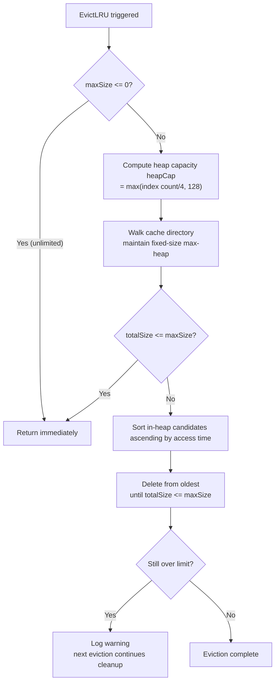
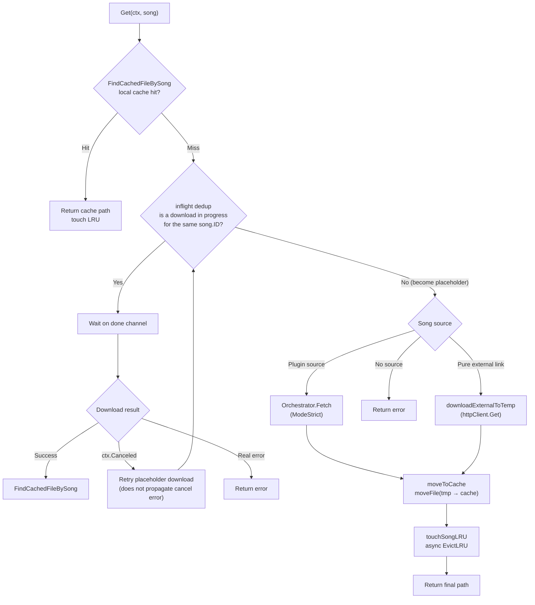

# Audio Cache and Proxy

This document is based on the following source files:

- `internal/services/cache_service.go` -- Cache core structures, LRU eviction, config management
- `internal/services/cache_service_song.go` -- Song-level cache operations, inflight deduplication, cache key computation
- `internal/services/cache_service_transcode.go` -- Transcode cache, ffmpeg invocation, format mapping
- `internal/handlers/cache.go` -- Cache management API handler
- `internal/handlers/hls.go` -- HLS radio reverse proxy, m3u8 rewrite engine
- `internal/handlers/proxy.go` -- Generic resource proxy, CORS bypass
- `internal/services/whitelist.go` -- SSRF protection, private network blocking
- `internal/services/file_move.go` -- Cross-device file move
- `internal/httputil/proxy.go` -- Global outbound HTTP proxy config
- `internal/handlers/jsplugin_registry.go` -- HTTP Proxy settings endpoint

## Table of Contents

1. [Overview](#1-overview)
2. [Audio Cache System](#2-audio-cache-system)
3. [Cache Operation Flow](#3-cache-operation-flow)
4. [Transcode Cache](#4-transcode-cache)
5. [HLS Radio Proxy](#5-hls-radio-proxy)
6. [Generic Resource Proxy](#6-generic-resource-proxy)
7. [Global Outbound HTTP Proxy](#7-global-outbound-http-proxy)
8. [SSRF Protection](#8-ssrf-protection)
9. [Cross-Device File Move](#9-cross-device-file-move)
10. [Data Structures and Constants Reference](#10-data-structures-and-constants-reference)

---

## 1. Overview

Songloft's cache and proxy subsystem carries three core responsibilities: (1) transparently caching audio on the server during remote song playback to avoid repeated downloads; (2) providing a reverse proxy for HLS radio streams to work around origin-server hotlink protection and CORS restrictions; (3) providing a generic proxy channel for frontend resource requests (cover art, lyrics, etc.). All three share a unified SSRF protection layer and outbound proxy configuration.

**Section sources**: `internal/services/cache_service.go` (CacheService struct definition), `internal/handlers/hls.go` (HLSHandler), `internal/handlers/proxy.go` (ProxyHandler)

---

## 2. Audio Cache System

### 2.1 Overall Design

CacheService is the core of the cache subsystem, responsible for storing, looking up, evicting, and managing the configuration of cache files. After a song is cached it retains its `remote` type unchanged; on a cache hit the local file path is returned directly, transparent to the caller. Core fields include: current/default cache directory, LRU index (`map[string]time.Time`), plugin-source download orchestrator (the `CacheSongFetcher` interface, injected by `app.go`), ffmpeg path, and a transcode serialization semaphore (size=1).

**Section sources**: `internal/services/cache_service.go` (CacheService struct, NewCacheService)

### 2.2 Cache File Naming and Directory Layout

Cache files use a two-level sharded directory plus a composite filename, preventing an excessive file count in any single directory while binding each cache key to a song's identity to prevent false hits after a cross-DB rebuild.

**Section sources**: `internal/services/cache_service_song.go` (getCachePath, cacheKeyOf, sanitizeCacheKey)

```
Layout: cache_dir/<id/100%1000>/<id/10000%100>/<id>.<key>.<ext>

Example: id=1234, key="subsonic_srv1_550109760"
  → cache_dir/12/0/1234.subsonic_srv1_550109760.mp3
```

**Cache key computation rules** (`cacheKeyOf`):

| Song Source | Key Computation | Example |
|----------|-------------|------|
| Plugin source (has `plugin_entry_path` + `dedup_key`) | `sanitize(plugin + "_" + dedup_key)` | `subsonic_srv1_550109760` |
| Pure external link (URL only) | `"u" + md5(URL)[:12]` | `u3a7f2b1c9d4e` |
| No identifiable source | Returns empty, does not take the cache path | -- |

`sanitizeCacheKey` replaces characters outside `[a-zA-Z0-9._-]` with underscores and truncates to 64 bytes, ensuring a safe filename.

Leftover files in the old format `<id><ext>` (without the `.key` segment) will not be matched by `FindCachedFileBySong`. This is by design: after a cross-DB rebuild, old caches naturally become invalid due to key mismatches, triggering a re-download.

### 2.3 LRU Eviction Mechanism

When the total cache size exceeds `max_size` (default 1GB, 0 means unlimited), the oldest files are evicted by last-access time. The eviction algorithm uses a `container/heap` max-heap, keeping only the oldest N files as candidates, reducing memory overhead from O(total file count) to O(candidate count).

**Section sources**: `internal/services/cache_service.go` (EvictLRU, lruMaxHeap, lruHeapCap)



**Heap capacity formula**: `heapCap = max(len(lruIndex)/4, 128)`, capped at the total index count. This means a single eviction evaluates at most 25% of files, avoiding the cost of a full sort for very large caches (tens of thousands of files). If it is still over the limit after one eviction round (not enough candidates), a Warn is logged, and the next trigger continues cleanup.

The LRU index is loaded at startup from filesystem mtimes via `loadLRUIndex`, and updated at runtime via `touchSongLRU` on the in-memory timestamps. Temporary files (`.tmp` suffix) are skipped both during traversal and index loading.

### 2.4 Cache Config Management

The cache config is persisted to the configs table (key = `music_cache_config`), storing the two fields `max_size` and `cache_dir` in JSON format.

**Section sources**: `internal/services/cache_service.go` (CacheConfig, CacheConfigResponse, UpdateCacheConfig, setCacheDir), `internal/handlers/cache.go` (HandleUpdateCacheConfig, HandleValidateCacheDir)

| Config Item | Type | Default | Description |
|--------|------|--------|------|
| `max_size` | int64 | 1GB (1073741824) | Cache upper limit; 0 means unlimited; cannot be negative |
| `cache_dir` | string | `""` | Custom cache directory; empty string uses the default directory |

**Directory switch flow**: When `UpdateCacheConfig` is called, if `cache_dir` changes, `setCacheDir` is executed: create the new directory → clear the in-memory LRU index → rebuild the index from the new directory. Files in the old directory are not automatically migrated. After switching, `EvictLRU` is triggered asynchronously.

**Directory validation endpoint** (`POST /api/v1/cache-manage/validate-dir`): After the user enters a directory, the frontend can validate it in advance. The endpoint automatically creates the directory, writes a test file to check writability, and returns the total and available disk space via `syscall.Statfs`. The response contains `valid` (whether usable), `created` (whether newly created), `total_size`/`free_size` (disk capacity), and `error` (failure reason).

### 2.5 Cache Management API

**Section sources**: `internal/handlers/cache.go` (all CacheHandler methods)

| Endpoint | Method | Description |
|------|------|------|
| `/api/v1/cache-manage/stats` | GET | Returns `CacheStats` (total size, file count, upper limit) |
| `/api/v1/cache-manage/clean` | POST | Deletes all cache files and clears the in-memory index |
| `/api/v1/cache-manage/config` | GET | Returns `CacheConfigResponse` (including the read-only default directory) |
| `/api/v1/cache-manage/config` | PUT | Updates `CacheConfig`, triggers LRU eviction |
| `/api/v1/cache-manage/validate-dir` | POST | Validates directory usability (auto-create + writability + disk space) |

---

## 3. Cache Operation Flow

### 3.1 The Unified Get Entry Point

`CacheService.Get(ctx, song)` is the unified entry point for the cache handler, covering four phases: cache hit, inflight deduplication, actual download, and moving into the cache.

**Section sources**: `internal/services/cache_service_song.go` (Get, downloadExternalToTemp, moveToCache, FindCachedFileBySong)



### 3.2 Inflight Deduplication

Concurrent requests for the same `song.ID` are deduplicated via `songCacheState.inflight` (`map[int64]*inflightDownload`). Each `inflightDownload` holds a `done chan struct{}` and an `err error`. The process-wide singleton `songCacheState` also maintains transcode inflight state (`map[string]*inflightDownload`, keyed by `"tc_{songID}_{format}"`) and song-level LRU timestamps.

**Section sources**: `internal/services/cache_service_song.go` (songCacheState, inflight logic in the Get method)

Key design: when the first request fails due to `ctx.Canceled` (a request aborted because the user switched songs), subsequent waiters do not inherit this cancel error. After detecting `errors.Is(dl.err, context.Canceled)`, a waiter re-enters the placeholder loop and becomes the new downloader. This solves the "immediate 502 when switching away and back to the same song" problem (issue #79). Waiters also watch their own `ctx.Done()`, preventing them from being dragged down if the first request hangs.

### 3.3 Download Paths

There are two paths depending on the song source:

| Source | Method | Characteristics |
|------|------|------|
| Plugin source (`IsPluginSourced()`) | `Orchestrator.Fetch(ModeStrict)` | Strict mode, no fallback; on failure the caller triggers `AsyncReassign` for background source reassignment |
| Pure external link (`song.URL != ""`) | `downloadExternalToTemp` | Simplified HTTP GET, no fallback, no metadata validation |

`downloadExternalToTemp` writes to the system temp directory and validates that the downloaded size is not smaller than `MinAudioSize` (1KB), preventing an error response from being cached. Content-Type is mapped to a file extension (`audio/mpeg` → `.mp3`, `audio/flac` → `.flac`, etc.).

### 3.4 Moving Into the Cache

`moveToCache` calls `moveFile` (see Section 9) to atomically move the temporary file into the cache directory. On Windows, if the target already exists, it is deleted first. The filename format is `<id>.<key><ext>`.

### 3.5 Cache Eviction

`EvictSong(songID)` deletes all cache files for the specified song (including leftovers from multiple historical keys and the old format), invoked by the `SongService.Delete` hook. Matching rule: all files in the directory that start with `<id>` and are immediately followed by `.` or the end of the filename, avoiding accidentally deleting 1234.mp3 when id=12.

**Section sources**: `internal/services/cache_service_song.go` (EvictSong)

---

## 4. Transcode Cache

### 4.1 Design Overview

When the target format requested by the client differs from the source file format, CacheService transcodes via ffmpeg and caches the result to avoid repeated transcoding. The transcode cache shares the same directory scheme as the original cache.

**Section sources**: `internal/services/cache_service_transcode.go` (GetOrTranscode, doTranscode, runFFmpeg)

### 4.2 GetOrTranscode Flow

1. Source format == target format → return `srcPath` directly (`NeedsTranscode` decision)
2. `FindTranscodedFile` hit → return cache path and touch LRU
3. Miss → check transcode inflight deduplication (key = `"tc_{songID}_{format}"`); wait if one is in progress
4. After becoming placeholder, execute `doTranscode` → `runFFmpeg` (controlled by the serialization semaphore) → `os.Rename` (same directory, no EXDEV)
5. touch LRU, async `EvictLRU`, return the transcoded file path

### 4.3 Format Recognition and Mapping

**Section sources**: `internal/services/cache_service_transcode.go` (NeedsTranscode, EffectiveSourceFormat, NormalizeFormat, tagFormatToAudioFormat)

The source format is determined by `EffectiveSourceFormat`: it prefers `song.Format` (the metadata format name returned by the tag library, such as `ID3v2.3`, `MP4`), mapped to an audio format via `tagFormatToAudioFormat`; when it cannot be determined, it falls back to the file extension.

`NormalizeFormat` unifies aliases:

| Input | Normalized Result |
|------|-----------|
| `mpeg` / `mp3` | `mp3` |
| `mp4` / `m4a` / `aac` | `m4a` |
| `ogg` / `vorbis` | `ogg` |
| `wav` / `wave` | `wav` |
| `wma` / `asf` | `wma` |

### 4.4 ffmpeg Parameters

| Target Format | Encoder | Quality Parameter | muxer |
|----------|--------|---------|-------|
| mp3 | libmp3lame | `-q:a 0` | mp3 |
| ogg | libvorbis | `-q:a 6` | ogg |
| m4a | aac | `-b:a 256k` | ipod |
| flac | flac | (none) | flac |
| wav | pcm_s16le | (none) | wav |

All transcode commands uniformly add `-vn` (strip the video track). The `transcodeSem` semaphore (capacity 1) guarantees at most one ffmpeg process at a time, avoiding concurrent transcoding saturating the CPU and affecting current playback. While waiting on the semaphore, ctx is monitored so it can exit early on timeout or cancellation.

### 4.5 Transcode Cache File Naming

The transcoded filename format is `{id}.{key}.tc.{format}`, or `{id}.tc.{format}` (when there is no key). The temporary file is created in the target directory (same device), so `os.Rename` will not trigger EXDEV.

---

## 5. HLS Radio Proxy

### 5.1 Design Goals

The HLS proxy solves two problems: (1) origin-server Referer/UA hotlink protection causing direct player connections to fail; (2) browser CORS policy in Web embedded mode blocking cross-origin m3u8 fetches. When the proxy is enabled, all HLS segment bytes are forwarded through the local machine, so the player only communicates with the Songloft service.

**Section sources**: `internal/handlers/hls.go` (HLSHandler struct, ServeProxy, HandlePlaylist, HandleSegment)

### 5.2 Proxy Switch

Business endpoint `GET/PUT /api/v1/settings/hls-proxy`, request body `{enabled: bool}`, default `false`.

**Section sources**: `internal/handlers/hls.go` (hlsProxyConfigKey, IsEnabled, SetEnabled, GetProxySetting, UpdateProxySetting)

- `false` (disabled): The radio `.m3u8` address is 302-redirected directly to the player, which fetches the origin itself. Zero bandwidth overhead but subject to origin-server restrictions.
- `true` (enabled): The server fetches and rewrites the m3u8, proxying all segments/keys/init segments. All segment bytes go through the local machine's bandwidth.

The config is stored as the string `"true"/"false"` in the configs table (key = `hls_proxy_enabled`) and parsed by `ConfigService.GetBool`.

### 5.3 Proxy Flow

The request chain in proxy mode: Player requests `/songs/{id}/play.m3u8` → Songloft fetches the upstream m3u8 → `rewriteM3U8` rewrites same-origin URIs into relative paths (`playlist?u=base64` / `segment?u=base64`) and injects `access_token` → returns the rewritten m3u8. After parsing, the player revisits `hls/segment?u=xxx` (segment passthrough) or `hls/playlist?u=xxx` (sub-m3u8 rewritten again).

### 5.4 Endpoint Details

| Endpoint | Method | Description |
|------|------|------|
| `/api/v1/songs/{id}/play.m3u8` | GET | Top-level entry, `serveRadio` calls `ServeProxy` |
| `/api/v1/songs/{id}/hls/playlist?u=<base64url>` | GET/HEAD | Sub-level m3u8 proxy |
| `/api/v1/songs/{id}/hls/segment?u=<base64url>` | GET/HEAD | Segment/key/init segment proxy |
| `/api/v1/settings/hls-proxy` | GET/PUT | Proxy switch |

The `u` parameter uses `base64.RawURLEncoding` to encode the upstream absolute URL.

### 5.5 m3u8 Rewrite Engine

`rewriteM3U8` is the core of rewriting; it parses the m3u8 line by line and replaces all same-origin URIs with local relative paths.

**Section sources**: `internal/handlers/hls.go` (rewriteM3U8, rewriteAttrTagURI, parseAttrLine, parseAttrList)

**Rewrite coverage** (classic HLS + full LL-HLS set):

| HLS Tag | URI Attribute | Rewrite Target |
|----------|---------|---------|
| `#EXT-X-STREAM-INF` | The bare URL line that follows | playlist |
| `#EXT-X-I-FRAME-STREAM-INF` | `URI` | playlist |
| `#EXT-X-MEDIA` | `URI` | playlist |
| `#EXT-X-RENDITION-REPORT` | `URI` | playlist |
| `#EXT-X-KEY` / `#EXT-X-SESSION-KEY` | `URI` | segment |
| `#EXT-X-MAP` | `URI` | segment |
| `#EXT-X-PRELOAD-HINT` | `URI` | segment |
| `#EXT-X-PART` | `URI` | segment |
| `#EXT-X-SESSION-DATA` | `URI` | segment |
| `#EXT-X-DATERANGE` | `X-ASSET-URI` | Determined by suffix |
| Bare URL line (media segment) | -- | segment |

**Not rewritten**: The `X-ASSET-LIST` of `#EXT-X-DATERANGE` (JSON sub-proxying is out of scope for the MVP; passed through fail-open as-is for the client to connect directly).

**HLS attribute list parsing** (`parseAttrList`): A hand-written parser correctly handles commas inside quotes (e.g. `CODECS="avc1.42c01e,mp4a.40.2"`), avoiding incorrect splitting.

### 5.6 Relative Paths and access_token Injection

All rewritten URLs use relative paths (not absolute paths), working around `BASE_PATH` subpath deployment concatenation issues. The top-level `ServeProxy` (current request `.../play`) uses `pathPrefix = "hls/"`; the sub-level `HandlePlaylist` (already at `.../hls/playlist`) uses an empty prefix.

**Section sources**: `internal/handlers/hls.go` (makeRewriter, servePlaylist)

When following URLs inside the m3u8, the player (just_audio / libmpv) does not reuse the Authorization header, and relative URL resolution also loses the base's query. Therefore, during rewriting, the `access_token` query parameter is extracted from the current request and injected into every sub-URL (e.g. `segment?u=xxx&access_token=yyy`), ensuring the auth middleware does not reject the revisit requests.

### 5.7 Same-Origin Check and Security

Every endpoint entry calls `checkOrigin` to perform a dual check:

**Section sources**: `internal/handlers/hls.go` (checkOrigin, isSameOrigin)

1. **Same-origin check**: Compares `scheme + hostname (lowercased) + port`; the upstream URL must be strictly same-origin with `song.URL`, and non-same-origin URLs are left as-is without rewriting
2. **SSRF backstop**: `services.IsHostnameAllowed` rejects private network addresses (see Section 8)

Only the `http` / `https` schemes are allowed; other schemes are rejected outright.

### 5.8 Upstream Error Handling and Limits

Upstream 4xx/5xx are passed through to the player (status + body + Content-Type); the playlist body has an upper limit of 1MB, returning 502 if exceeded; the first line must be `#EXTM3U`; a UTF-8 BOM is automatically skipped; the client has no Timeout (live segments can last several minutes) and cancellation is handled by `r.Context()`; the redirect limit is 10.

---

## 6. Generic Resource Proxy

ProxyHandler provides a cross-origin resource proxy for the frontend (`GET /api/v1/proxy?url=<target URL>`), working around browser CORS restrictions, mainly for cover art images, lyrics, etc. Security measures: only `http`/`https` protocols, and `IsHostnameAllowed` private network blocking (returns 403 when rejected).

**Section sources**: `internal/handlers/proxy.go` (ProxyHandler, Proxy, ServeRemoteResource)

`ServeRemoteResource` is a public method, reused for internal proxy scenarios such as cover art and lyrics, and does not go through the hostname check. Flow: build the upstream request (handling Basic Auth in the URL, passing through Range/Accept headers) → issue the request (60s timeout, <=10 redirects) → pass through response headers (Content-Type/Content-Length/Content-Range/Accept-Ranges/Cache-Control/ETag/Last-Modified) → stream-forward the body. For image resources (`image/*`) without Cache-Control, a 7-day cache is set automatically. Range requests are supported, passing through 206 Partial Content.

---

## 7. Global Outbound HTTP Proxy

### 7.1 Design Overview

Songloft supports configuring an outbound proxy for all backend outbound HTTP requests, used to access external resources (plugin registry, upgrade checks, etc.) in network-restricted environments.

**Section sources**: `internal/httputil/proxy.go` (proxyConfig, sharedTransport, SetGlobalProxy, NewClient)

### 7.2 Architecture Implementation

The global `proxyConfig` (protected by a read-write lock) holds the parsed proxy URL, and a shared `http.Transport` (MaxIdleConns=100, IdleConnTimeout=90s) is reused by all clients created via `NewClient`. Core APIs:

- `SetGlobalProxy(rawURL)` -- sets the proxy URL and closes existing idle connections so new connections go through the new proxy
- `NewClient(timeout)` -- creates an `http.Client` using the global proxy
- `GetGlobalProxy()` -- returns the current proxy URL; an empty string means direct connection

### 7.3 Loopback Bypass

`proxyFunc` checks the target hostname on each request; `localhost` / `127.0.0.1` / `::1` automatically skip the proxy, preventing internal requests (such as local API calls) from being forwarded to an external proxy.

**Section sources**: `internal/httputil/proxy.go` (proxyFunc)

### 7.4 Settings Endpoint

`GET/PUT /api/v1/settings/http-proxy`, request body `{proxy: string}`.

**Section sources**: `internal/handlers/jsplugin_registry.go` (httpProxySetting, GetHttpProxySetting, UpdateHttpProxySetting)

- Typical value: `http://192.168.1.1:7890` (supports HTTP/HTTPS/SOCKS5 proxy formats)
- An empty string means direct connection
- Takes effect immediately on PUT (calls `httputil.SetGlobalProxy`), no restart required
- The config is persisted to the configs table (key = `http_proxy`) and loaded at startup by `app.go`
- PUT validates the proxy address format (`url.Parse`); invalid addresses return 400

### 7.5 Services Already Integrated

| Module | File | Purpose |
|------|------|------|
| Plugin registry | `jsplugin/registry.go` | Fetch remote plugin sources |
| Plugin package management | `jsplugin/package.go` | Download/update plugins |
| System upgrade | `services/upgrade_service.go` | Check/download new versions |
| Plugin ZIP download | `handlers/jsplugin_registry.go` | `downloadZIP` |

Coexists with GitHub mirror acceleration (`github_proxy` URL prefix concatenation): the mirror prefix is concatenated first, then forwarded through the HTTP Proxy.

---

## 8. SSRF Protection

### 8.1 Strategy

Songloft adopts a **private-network blocking strategy**: it blocks proxy requests from accessing private network addresses and allows all public domains. This is the unified security baseline for both the HLS proxy and the generic resource proxy.

**Section sources**: `internal/services/whitelist.go` (IsHostnameAllowed, isPrivateIP)

### 8.2 IsHostnameAllowed Decision Flow

Decision steps: (1) `localhost` / `*.local` / empty → reject outright; (2) `net.LookupIP` resolution fails → allow (let the HTTP request report its own error); (3) iterate over all resolved IPs, if any hits a private/reserved address → reject; (4) all public → allow.

### 8.3 Private Network Address Determination

`isPrivateIP` checks the following address categories:

| Address Category | Range | Method |
|----------|------|------|
| Loopback | `127.0.0.0/8`, `::1` | `ip.IsLoopback()` |
| Private | `10.0.0.0/8`, `172.16.0.0/12`, `192.168.0.0/16`, `fc00::/7` | `ip.IsPrivate()` |
| Link-local | `169.254.0.0/16`, `fe80::/10` | `ip.IsLinkLocalUnicast()` / `ip.IsLinkLocalMulticast()` |
| Unspecified | `0.0.0.0`, `::` | `ip.IsUnspecified()` |

If any one of the IPs resolved by DNS hits a private network address, the request is rejected (preventing a private IP from being mixed in during a DNS rebinding attack).

---

## 9. Cross-Device File Move

### 9.1 Background

`os.Rename` returns `syscall.EXDEV` (cross-device link) when the source and destination are not on the same filesystem (mount point). Typical scenario: `os.CreateTemp("")` in the system `/tmp` (tmpfs), while the target cache directory is mounted on a separate disk or Docker volume.

**Section sources**: `internal/services/file_move.go` (moveFile, isCrossDeviceError, copyFileRaw)

### 9.2 moveFile Implementation

It first tries `os.Rename(src, dst)`; on failure it extracts `*os.LinkError` via `errors.As` and uses `errors.Is(linkErr.Err, syscall.EXDEV)` to determine whether it is a cross-device error. If so, it falls back to `copyFileRaw` (`os.Open` → `os.Create` → `io.Copy`) + `os.Remove(src)`. If `copyFileRaw` fails during write or `Close`, it cleans up the target file, ensuring no corrupted file is left behind.

### 9.3 Usage Conventions

- Cache downloads (`downloadExternalToTemp` → `moveToCache`) use `moveFile`
- The atomic writes in `pkg/tag` are unaffected: it uses `os.CreateTemp(dir, ...)` to create the temporary file in the same directory as the source file, so rename is always on the same device
- Transcode cache temporary files are also created in the target directory (`os.CreateTemp(dir, "tc-*.tmp")`), so `os.Rename` can be used safely
- **New download/cache logic must use `moveFile`; bare `os.Rename` is forbidden**

---

## 10. Data Structures and Constants Reference

### 10.1 Core Constants

**Section sources**: `internal/services/cache_service.go`, `internal/handlers/hls.go`

| Constant | Value | Description |
|------|---|------|
| `MinAudioSize` | 1024 (1KB) | Minimum valid audio file size; below this is treated as an error response |
| `defaultMaxCacheSize` | 1073741824 (1GB) | Default cache upper limit |
| `cacheConfigKey` | `"music_cache_config"` | The key for the cache config in the configs table |
| `hlsProxyConfigKey` | `"hls_proxy_enabled"` | The config key for the HLS proxy switch |
| `httpProxyConfigKey` | `"http_proxy"` | The config key for the outbound proxy |
| `maxPlaylistBytes` | 1048576 (1MB) | The upper limit of the m3u8 response body |
| `minLRUHeapCap` | 128 | The minimum capacity of the LRU eviction heap |

### 10.2 Core Type Relationships

**Diagram sources**: `internal/services/cache_service.go`, `internal/services/cache_service_song.go`, `internal/handlers/hls.go`, `internal/handlers/proxy.go`

| Type | Responsibility | Key Dependencies |
|------|------|---------|
| `CacheService` | Cache storage/lookup/eviction/transcode | `CacheSongFetcher` (orchestrator), `ConfigService`, `songCacheState` |
| `CacheSongFetcher` | Interface: plugin-source audio fetching | Implemented by `SourceOrchestrator`, injected by `app.go` |
| `songCacheState` | Global inflight deduplication + song LRU | Process singleton (`sync.Once`) |
| `HLSHandler` | HLS m3u8 rewriting and segment proxying | `SongService`, `ConfigService`, `IsHostnameAllowed` |
| `ProxyHandler` | Generic resource proxy | `IsHostnameAllowed` |
