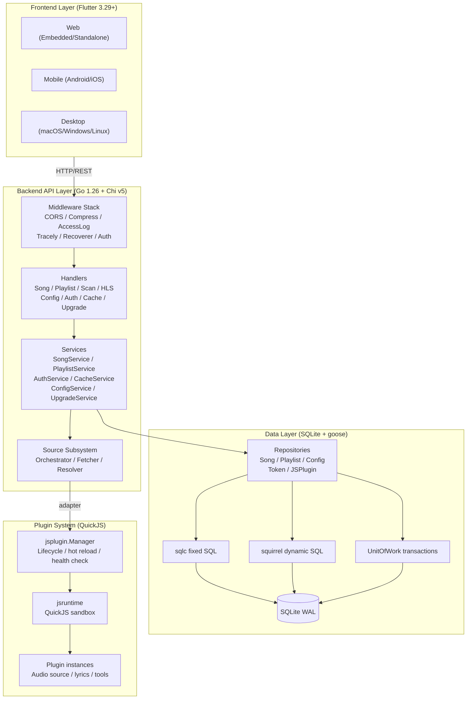
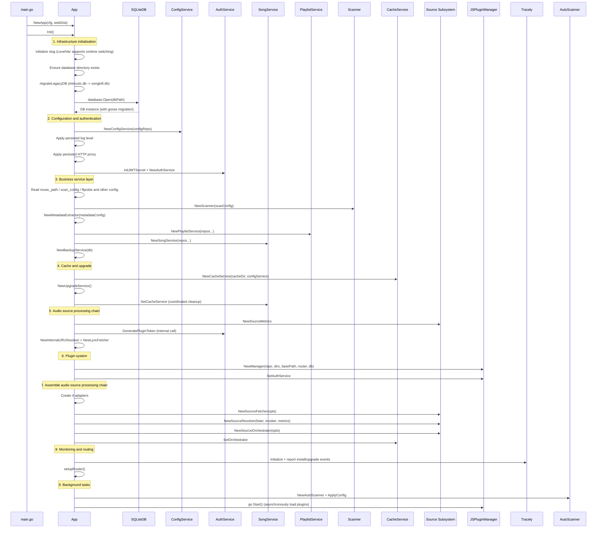
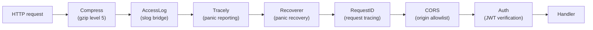
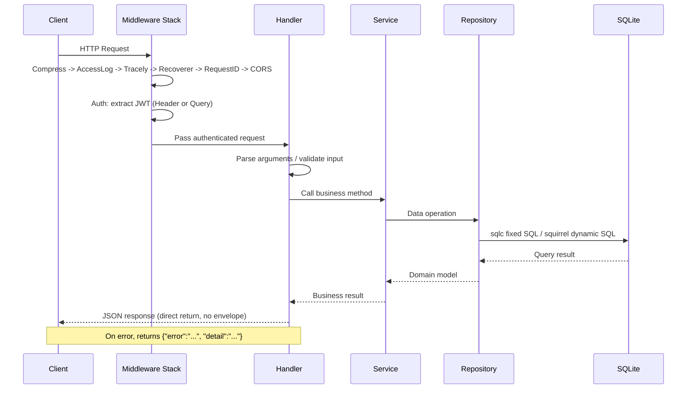
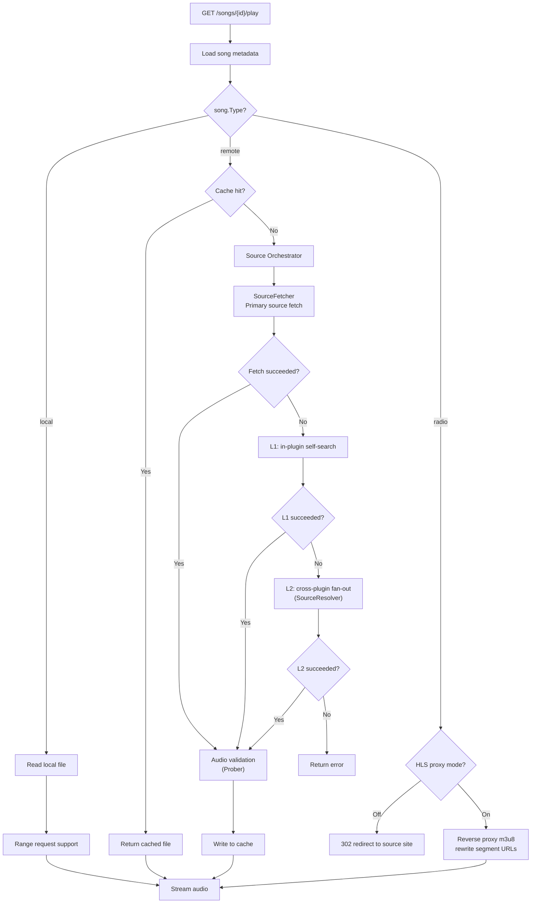
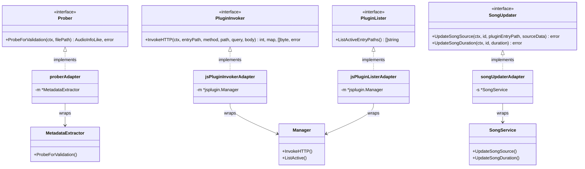
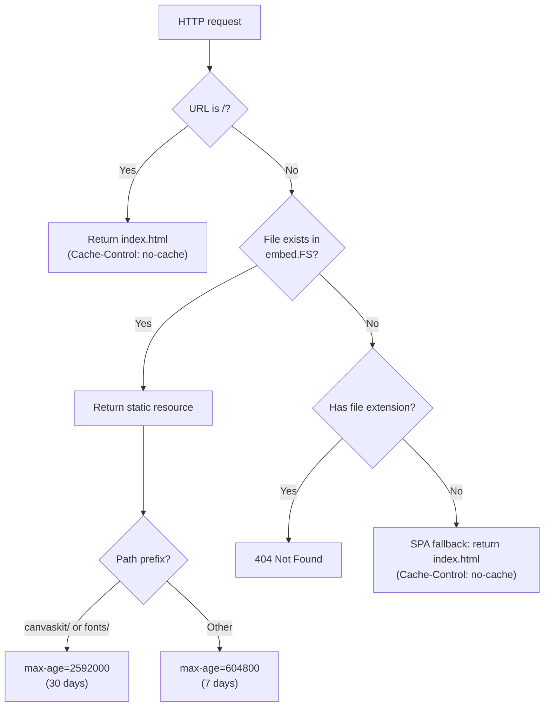
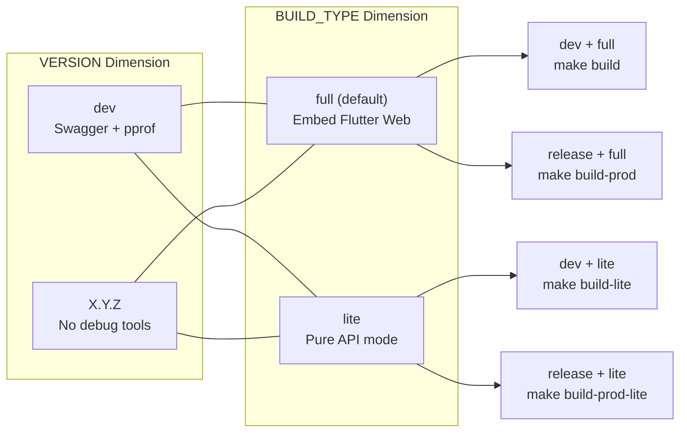

# System Architecture Design

This document is based on the following source files:

- `internal/app/app.go` -- Main application structure and the Init startup chain
- `internal/app/routers.go` -- Route registration and the middleware stack
- `internal/app/source_adapters.go` -- Adapter pattern implementation
- `internal/app/embed.go` -- SPA static file serving and pre-compression
- `internal/app/compress.go` -- Brotli/Gzip pre-compressed file system
- `internal/app/access_log.go` -- slog access log bridge
- `internal/app/db_migration.go` -- Legacy database migration
- `internal/app/router_dev.go` -- dev build conditional compilation (Swagger)
- `internal/app/router_prod.go` -- prod build empty implementation
- `internal/app/pprof_dev.go` -- dev build pprof service
- `internal/database/database.go` -- DB interface definition
- `internal/database/sqlite.go` -- SQLite implementation and goose migration
- `internal/database/unit_of_work.go` -- UnitOfWork transaction pattern
- `internal/middleware/auth.go` -- JWT authentication middleware
- `internal/services/source/fetcher.go` -- Audio source fetcher interface
- `internal/services/source/resolver.go` -- Cross-plugin audio source resolver
- `internal/services/source/orchestrator.go` -- Audio source orchestrator
- `web_embed.go` -- Full version frontend embedding
- `web_embed_lite.go` -- Lite version empty embedding
- `Makefile` -- Build system

## Table of Contents

1. [Introduction](#1-introduction)
2. [Overall Architecture Overview](#2-overall-architecture-overview)
3. [Technical Architecture in Detail](#3-technical-architecture-in-detail)
4. [Application Startup Flow](#4-application-startup-flow)
5. [Routing Architecture](#5-routing-architecture)
6. [Data Flow Design](#6-data-flow-design)
7. [Adapter Pattern](#7-adapter-pattern)
8. [Static File Serving](#8-static-file-serving)
9. [Build Variants](#9-build-variants)
10. [Extensibility Design](#10-extensibility-design)
11. [Dependency Analysis](#11-dependency-analysis)
12. [Performance Considerations](#12-performance-considerations)
13. [Conclusion](#13-conclusion)

---

## 1. Introduction

Songloft is a self-hosted local music server, built on a technology stack of a Go 1.26 + Chi v5 + SQLite backend, a Flutter cross-platform frontend, and a QuickJS plugin system. The system design follows layered architecture principles, achieving separation of concerns through a three-tier structure of Handler -> Service -> Repository/Database, and establishing clear dependency boundaries between modules through the adapter pattern.

This document focuses on the backend system architecture, covering core design decisions such as the startup flow, routing design, data flow, build variants, and extension mechanisms.

**Section sources**: `AGENTS.md` (project overview), `internal/app/app.go` (App struct definition)

---

## 2. Overall Architecture Overview

Songloft uses a classic three-tier architecture, supplemented by a plugin system for runtime extension.



**Diagram sources**: `internal/app/app.go` (App struct field list), `internal/app/routers.go` (route grouping), `internal/database/database.go` (DB interface)

**Section sources**: `internal/app/app.go:35-58` (the App struct defines all core dependencies), `internal/app/routers.go:37-235` (route registration reflects the three-tier call relationship)

---

## 3. Technical Architecture in Detail

### 3.1 Standard Go Layout

The project follows the standard Go directory layout, with all core business logic located under `internal/`:

| Directory | Responsibility |
|------|------|
| `internal/app` | Application assembly layer (Init/routing/middleware/adapter) |
| `internal/config` | Startup configuration (AppConfig) |
| `internal/database` | Data access layer (DB interface/Repository/sqlc/squirrel/migrations) |
| `internal/handlers` | HTTP Handler layer |
| `internal/services` | Business logic layer (including the `source/` audio source subsystem and `playactivity/` playback tracking) |
| `internal/jsplugin` | JS plugin manager |
| `internal/jsruntime` | QuickJS runtime wrapper |
| `internal/middleware` | Chi middleware (Auth) |
| `internal/models` | Domain models |
| `internal/httputil` | HTTP utilities (proxy, shared Transport) |
| `pkg/tag` | Audio metadata read/write library (externally referenceable) |
| `web_embed.go` / `web_embed_lite.go` | Frontend embedding switch (controlled by build tag) |

### 3.2 internal/ Package Structure and Dependency Rules

Dependencies between packages follow strict unidirectional rules:

- `handlers` -> `services` -> `database` (standard three tiers)
- `app` serves as the assembly layer and is the only package permitted to reference `handlers`, `services`, and `jsplugin` simultaneously
- `services/source` is decoupled from `services` and `jsplugin` through interfaces (`Prober`, `PluginInvoker`, `PluginLister`, `SongUpdater`)
- The `database` package depends only on `models` and the database driver, not on any business package

### 3.3 Build Constraints

- **CGO_ENABLED=0**: Fully static compilation; the Makefile has `GO=CGO_ENABLED=0 GOAMD64=v1 go`, and SQLite uses the pure Go implementation `modernc.org/sqlite`
- **Build Tags**: `dev` (development tools) and `lite` (lightweight build) are two orthogonal dimensions
- **ldflags injection**: Version, GitCommit, BuildTime, BuildType, and Tracely configuration are all written in at compile time via `-X`

**Section sources**: `Makefile:3` (CGO_ENABLED=0), `internal/app/source_adapters.go:1-16` (adapter comments explaining the dependency rules), `Makefile:28-37` (build tags explanation)

---

## 4. Application Startup Flow

The `App.Init()` method implements a complete dependency injection chain, creating all service components in dependency order.



**Diagram sources**: `internal/app/app.go:87-392` (complete Init method flow)

Key design decisions: initialize strictly in dependency order (DB first, routing last); all persisted configuration is restored from the config table at startup; the JS plugin manager `go Start()` loads asynchronously to avoid blocking; `migrateLegacyDB` handles the one-time database rename from v1.x to v2.0.

**Section sources**: `internal/app/app.go:87-392` (Init method), `internal/app/db_migration.go:22-45` (migrateLegacyDB)

---

## 5. Routing Architecture

### 5.1 Middleware Stack

`setupBaseRouter()` registers global middleware, executed from outermost to innermost:



**Diagram sources**: `internal/app/routers.go:237-349` (setupBaseRouter middleware registration order)

Responsibilities of each middleware: Compress applies gzip level 5 compression to resources like JS/CSS/JSON/WASM; AccessLog bridges to slog controlled by the log level; Tracely captures panics, reports them, then re-panics; Recoverer captures panics and returns 500; RequestID generates a unique request ID; CORS allowlists localhost/LAN/hanxi.cc subdomains; Auth verifies the JWT Bearer Token (with query parameter fallback support).

### 5.2 Route Tree Structure

```
/                               # SPA static files (embed.go)
/swagger/*                      # Swagger UI (dev build only)
/api/v1/
├── auth/{login,refresh}        # Public endpoints (no authentication required)
├── version                     # Public endpoint
├── health                      # Public endpoint
└── [authentication-protected group]
    ├── auth/{logout,tokens}
    ├── songs/*                 # Song CRUD + playback + cover art + lyrics
    ├── playlists/*             # Playlist CRUD + song operations + import/export
    ├── settings/*              # Business config endpoints (strongly typed)
    ├── configs/*               # Generic KV config (admin)
    ├── scan/*                  # Scan management
    ├── proxy                   # CORS resource proxy
    ├── cache-manage/*          # Cache management
    ├── upgrade/*               # Upgrade management
    └── jsplugins/*             # Plugin management
/api/v1/jsplugin/{entry}/*      # Plugin API forwarding (dynamic routing)
/api/v1/jsplugin-assets/*       # Plugin common resources (CSS/JS/fonts)
```

### 5.3 Authentication Layering

Three-tier strategy: public endpoints (login/refresh/version/health) do not pass through the Auth middleware; standard authenticated routes are protected by `AuthMiddleware(authService)`; plugin routes are protected by `AuthMiddleware(authService, jsPluginManager)`, where `jsPluginManager` implements the `PublicPathChecker` interface to exempt plugin-declared publicPaths from authentication.

**Section sources**: `internal/app/routers.go:20-35` (setupRouter), `internal/app/routers.go:237-349` (setupBaseRouter), `internal/middleware/auth.go:28-88` (AuthMiddleware including PublicPathChecker)

---

## 6. Data Flow Design

### 6.1 Request Lifecycle



**Diagram sources**: `internal/app/routers.go:237-349` (middleware registration), `internal/middleware/auth.go:28-88` (authentication flow)

### 6.2 Song Playback Flow

Song playback is one of the most complex data flows in the system, splitting into three paths depending on the song type (local/remote/radio):



**Diagram sources**: `internal/app/routers.go:194-207` (playback endpoint registration), `internal/services/source/orchestrator.go:12-50` (FetchMode and fallback strategy), `internal/services/source/fetcher.go:46-53` (FetchResult struct)

**Section sources**: `internal/app/routers.go:194-227` (playback and HLS endpoints), `internal/services/source/orchestrator.go` (orchestration logic), `internal/services/source/resolver.go:54-60` (cross-plugin search)

---

## 7. Adapter Pattern

`source_adapters.go` is the core embodiment of the system's decoupled design. The `services/source` package defines 4 interfaces, and during assembly the `app` package injects the concrete implementations through adapters, preventing the source package from having a reverse dependency on `services` or `jsplugin`.



**Diagram sources**: `internal/app/source_adapters.go:17-98` (definitions of the 4 adapters), `internal/services/source/fetcher.go:18-31` (Prober/PluginInvoker interfaces), `internal/services/source/resolver.go:48-52` (PluginLister interface), `internal/services/source/orchestrator.go:27-30` (SongUpdater interface)

In addition, `reassignAdapter` (wrapping `AsyncReassign` for the cache handler) and `playActivityReassignTracker` (keeping the source package from depending directly on playactivity) provide auxiliary adaptation.

The design intent of the adapter pattern is: **the `services/source` package depends only on the interfaces it defines itself, and is unaware of the existence of `jsplugin.Manager`, `services.MetadataExtractor`, or `services.SongService`**. This allows the source subsystem to be tested independently and permits future replacement of the concrete implementations.

**Section sources**: `internal/app/source_adapters.go:1-16` (file header comment), `internal/app/source_adapters.go:76-112` (reassignAdapter and playActivityReassignTracker)

---

## 8. Static File Serving

### 8.1 SPA Fallback Mechanism

`registerWebStatic()` in `embed.go` implements complete SPA static file serving:



**Diagram sources**: `internal/app/embed.go:57-98` (registerWebStatic routing logic)

### 8.2 Base Path Handling

For sub-path deployment (e.g. `/songloft`), `App.Start()` uses `http.StripPrefix` to strip the prefix, `embed.go` replaces `<base href="/">` with `<base href="/songloft/">` at runtime, and `compress.go`'s `addCustomEntry` regenerates the Brotli/Gzip compressed versions of the modified index.html.

### 8.3 Pre-compression and the Lite Version

`compress.go` implements `precompressedFS`, which at startup loads the `.br`/`.gz` pre-compressed files generated at build time from embed.FS, preferring Brotli, then Gzip, and finally falling back to the original file. It supports ETag conditional requests. When no pre-compression is available, all requests fall back to `chi/middleware.Compress` real-time compression.

In the lite version (`lite` build tag), `web_embed_lite.go` provides an empty `embed.FS`, and `registerWebStatic` only mounts an informational page at the root path.

**Section sources**: `internal/app/embed.go:17-98` (registerWebStatic), `internal/app/compress.go:31-78` (newPrecompressedFS), `internal/app/embed.go:100-139` (serveLitePage), `internal/app/app.go:472-483` (BasePath handling in Start), `web_embed_lite.go` (empty embed.FS)

---

## 9. Build Variants

### 9.1 Two-Dimensional Matrix

Songloft's build is controlled by two orthogonal dimensions:

| Dimension | Values | Meaning |
|------|------|------|
| **VERSION** | `dev` / `X.Y.Z` | Whether it is a development version; `dev` automatically enables `-tags dev` |
| **BUILD_TYPE** | `lite` / empty (full) | Whether to embed the frontend resources |

The combinations produce 4 variants:



**Diagram sources**: `Makefile:28-37` (build tags explanation), `Makefile:97-134` (4 build targets)

### 9.2 Conditionally Compiled Files

| File | Build Tag | Content |
|------|-----------|------|
| `router_dev.go` | `//go:build dev` | Registers the Swagger UI route (`/swagger/*`) |
| `router_prod.go` | `//go:build !dev` | Empty implementation of `registerSwagger()` |
| `pprof_dev.go` | `//go:build dev` | Starts the pprof HTTP service (`:13060`) |
| `web_embed.go` | `//go:build !lite` | `//go:embed all:songloft-player-build/web-embedded` |
| `web_embed_lite.go` | `//go:build lite` | Empty `embed.FS` |

### 9.3 Version Information Injection

The `Makefile` injects Version, GitCommit, BuildTime, BuildType, and the Tracely monitoring configuration (AppID/AppSecret/Host) at compile time via `-ldflags -X`. The Tracely configuration is injected only in private builds; open-source builds default to empty and do not initialize the client at runtime.

**Section sources**: `internal/app/router_dev.go` (Swagger conditional compilation), `internal/app/router_prod.go` (empty implementation), `internal/app/pprof_dev.go` (pprof service), `web_embed.go` / `web_embed_lite.go` (frontend embedding switch), `Makefile:18-26` (ldflags definition)

---

## 10. Extensibility Design

### 10.1 JS Plugin System

Songloft implements runtime plugin extension through a QuickJS sandbox. The architectural layers of the plugin system:

```
jsplugin.Manager (lifecycle management)
├── Plugin loading: scan manifests from the jsplugins/ directory
├── Health check: periodic liveness probing, marking Red/Yellow/Green status
├── Hot reload: automatically reload when the file fingerprint changes
├── Route registration: RegisterStaticRoutes + RegisterAPIRoutes
└── jsruntime (QuickJS wrapper)
    ├── host bridge: http.fetch / storage / logger
    └── Permission validation: controlled by the manifest permissions field
```

### 10.2 Config-in-DB Runtime Configuration

The system uses the SQLite config table to store all runtime configuration, taking effect without a restart:

- **Log level**: dynamically switched via `slog.LevelVar`; `PUT /settings/log-level` takes effect immediately
- **HTTP proxy**: the shared Transport is updated immediately via `httputil.SetGlobalProxy`
- **Music path**: after a change, triggers the `onMusicPathConfigChanged` callback, rebuilding the Scanner and asynchronously cleaning up invalid songs
- **Automatic scanning**: after a change, rescheduled via `autoScanner.ApplyConfig`
- **Generic KV callback**: `configHandler.SetOnConfigChanged` registers key-level change callbacks (such as `music_path`, `auto_scan`), keeping the side effects of the generic `/configs/{key}` entry consistent with the business endpoints

**Section sources**: `internal/app/app.go:88-92` (LevelVar initialization), `internal/app/app.go:128-138` (HTTP proxy restoration), `internal/app/app.go:394-456` (onMusicPathConfigChanged), `internal/app/routers.go:63-71` (SetOnConfigChanged callback)

---

## 11. Dependency Analysis

### 11.1 Core External Dependencies

| Dependency | Purpose |
|------|------|
| `go-chi/chi/v5` + `go-chi/cors` | HTTP routing framework + CORS middleware |
| `modernc.org/sqlite` | Pure Go SQLite implementation, no CGO required |
| `pressly/goose/v3` | Database migration tool, embeds SQL files |
| `Masterminds/squirrel` | Dynamic SQL builder (variable-length WHERE/SET) |
| `swaggo/swag` | Swagger documentation generation (dev build only) |
| `andybalholm/brotli` | Brotli compression, used for runtime re-compression of index.html |
| `hanxi/tracely` | Application monitoring (install/upgrade/error reporting) |

### 11.2 Dependency Direction

`main.go` -> `internal/app` (assembly layer) references the standard three tiers `handlers` -> `services` -> `database` -> `models`, as well as `jsplugin` -> `jsruntime`, `middleware`, and `httputil` respectively. `services/source` depends only on the interfaces it defines itself, with no direct dependency between it and `jsplugin` or the main `services` package -- everything is connected through the adapters in the `app` package.

**Section sources**: `internal/app/app.go:3-31` (import list), `internal/app/source_adapters.go:1-16` (package comment), `internal/database/sqlite.go:1-14` (database import)

---

## 12. Performance Considerations

### 12.1 Database Optimization

The SQLite connection is optimized through DSN pragma parameters: WAL mode (read/write concurrency), busy_timeout 10s (avoiding SQLITE_BUSY), synchronous NORMAL, cache_size 10000 (~40MB page cache), foreign_keys enabled. Connection pool configuration: maximum 10 connections, 5 idle, 30-minute lifetime.

### 12.2 Static Resource Optimization

Brotli/Gzip pre-compressed files generated at build time (zero CPU overhead at runtime), tiered caching strategy (canvaskit/fonts 30 days, others 7 days), CRC32-based ETag supporting 304 responses, and fallback to chi gzip level 5 on a miss.

### 12.3 Concurrency Control

UnitOfWork transactions (`RunInTx` on the same `*sql.Tx`, avoiding SQLITE_BUSY), `playactivity.Registry` (old requests yield during rapid song switching), cache inflight deduplication (the same songID is downloaded only once), and Source fan-out timeouts (single plugin 5s, global 8s).

### 12.4 Build Artifact Optimization

CGO_ENABLED=0 pure static linking, `-s -w` ldflags to strip the symbol table, and automatic UPX `-9` compression for production builds.

**Section sources**: `internal/database/sqlite.go:28-55` (DSN configuration in the Open method), `internal/app/compress.go:32-78` (pre-compression loading), `internal/app/embed.go:84-97` (tiered caching strategy), `Makefile:3` (CGO_ENABLED=0), `Makefile:113-119` (UPX compression)

---

## 13. Conclusion

Songloft's system architecture is built around the following core design principles:

1. **Clear layering**: Handler -> Service -> Repository with strict unidirectional dependencies, and `internal/` package isolation preventing leakage
2. **Interface decoupling**: the `services/source` package interacts with external systems through 4 interfaces, with the `app` package serving as the sole assembly layer providing the adapter implementations
3. **Configuration as data**: all runtime configuration is stored in the SQLite config table and takes effect hot without a restart
4. **Flexible builds**: the two orthogonal build tags `dev`/`lite` combine into 4 variants, covering all scenarios from development debugging to production deployment
5. **Progressive extension**: the QuickJS plugin system extends audio source, lyrics, and other capabilities without modifying core code, through sandbox isolation and adapter injection
6. **Pragmatic performance**: WAL-mode SQLite, pre-compressed static resources, inflight deduplication, UPX compression, and other measures strike a balance between practicality and complexity

**Section sources**: Comprehensive analysis of the entire document
