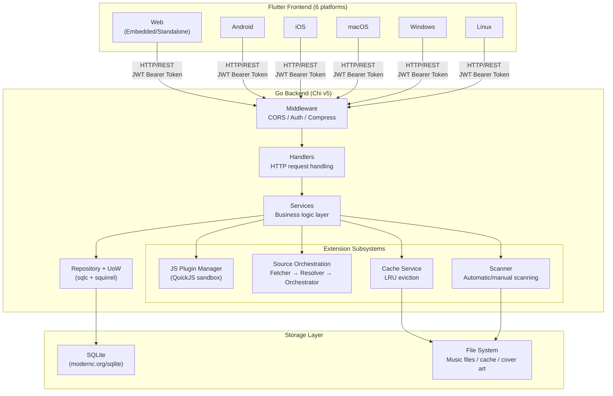
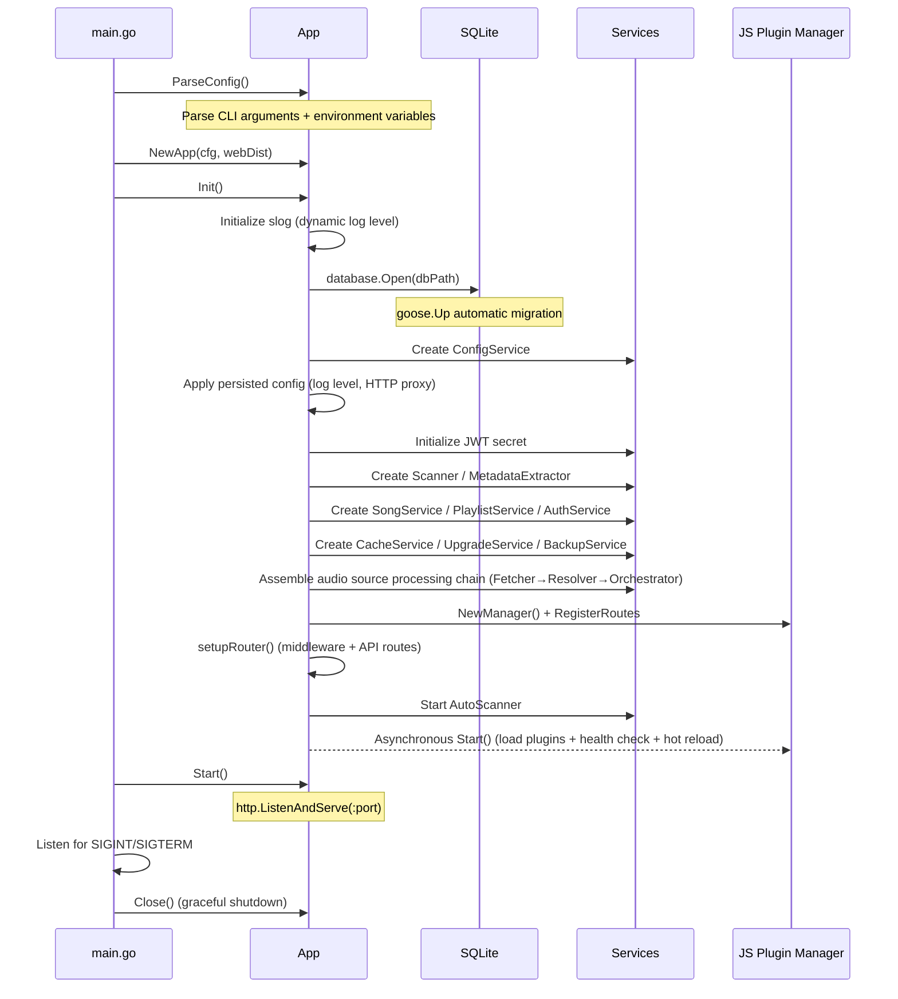

# Project Overview


This document is based on the following source files:

- [main.go](file://main.go) -- Program entry point, Swagger annotations, signal handling
- [internal/app/app.go](file://internal/app/app.go) -- Application initialization flow (`Init` / `Start` / `Close`)
- [internal/app/routers.go](file://internal/app/routers.go) -- Route registration and middleware assembly
- [internal/config/types.go](file://internal/config/types.go) -- Startup configuration structure definitions
- [internal/version/version.go](file://internal/version/version.go) -- Version number injection and output
- [go.mod](file://go.mod) -- Go module declaration and dependency list
- [Makefile](file://Makefile) -- Build, test, and deployment commands


## Table of Contents

1. [Introduction](#1-introduction)
2. [Project Structure](#2-project-structure)
3. [Core Features](#3-core-features)
4. [Technology Stack Overview](#4-technology-stack-overview)
5. [System Architecture Overview](#5-system-architecture-overview)
6. [Quick Start](#6-quick-start)
7. [Conclusion](#7-conclusion)

---

## 1. Introduction

Songloft is a **self-hosted local music server** designed to let users manage and play local music and network audio sources in a unified way on their own hardware. The current version of the project is **2.10.0**, released as open source under the Apache 2.0 license.

Core value:

- **Full control** -- Music files and metadata are stored locally by the user, with no dependency on third-party cloud services.
- **Cross-platform coverage** -- A single backend paired with a Flutter frontend deploys one codebase to Android, iOS, macOS, Windows, Linux, and Web -- 6 platforms in total.
- **Extensible** -- JS plugins run in a QuickJS sandbox, letting users develop their own audio source, lyrics, metadata, and other feature plugins.
- **Lightweight deployment** -- The backend compiles into a single binary (with the frontend optionally embedded), SQLite has zero external dependencies, and Docker starts it up in one line.

**Section sources**
- [main.go:26-38](file://main.go#L26-L38) -- Project description, version, and default port in the Swagger annotations
- [internal/version/version.go:1-24](file://internal/version/version.go#L1-L24) -- Version number definitions

---

## 2. Project Structure

Songloft uses a multi-repository structure, with each subproject having clearly defined responsibilities:

| Directory | Technology | Description |
|------|------|------|
| `/` (root) | Go 1.26 + Chi v5 + SQLite | Backend API service, default port 58091 |
| `/mobile` | Go + gomobile | Mobile binding entry point for the Go backend (used by `gomobile bind`, exports Start/Stop/IsRunning/GetPort for Bundle local mode) |
| `/songloft-player` | Flutter 3.29+ / Dart 3.7+ | Cross-platform frontend (separate repository [songloft-player](https://github.com/songloft-org/songloft-player)) |
| `/plugin-toolchain` | TypeScript + pnpm | JS plugin development toolchain: SDK, Builder, scaffolding (separate repository) |
| `/jsplugins-src` | TypeScript | Collection of JS plugin sources (submodules; each plugin distributes releases from its own repository) |
| `/pkg/tag` | Go | Audio metadata read/write library (extends the upstream tag library with MP3/FLAC writing) |
| `/addon` | HA add-on | Home Assistant add-on (thin layer reusing the Docker image) |

The backend `internal/` directory follows the standard Go layout, preventing external packages from directly referencing internal implementation:

```
internal/
├── app/            # Application entry: initialization, route registration, config parsing
├── config/         # Startup configuration structure (AppConfig)
├── database/       # Database opening, migration, Repository, UnitOfWork
├── handlers/       # HTTP handler layer
├── httputil/       # HTTP proxy, shared Transport
├── jsplugin/       # JS plugin manager (load/unload/routing/health check/hot reload)
├── jsruntime/      # QuickJS runtime bridge (host capability injection)
├── middleware/     # Authentication, logging, and other middleware
├── models/         # Data model definitions
├── services/       # Business logic layer (Song/Playlist/Cache/Scanner/Source, etc.)
├── tracelycfg/     # Tracely monitoring compile-time injection configuration
└── version/        # Version number compile-time injection
```

**Section sources**
- [go.mod:1-3](file://go.mod#L1-L3) -- Module name and Go version
- [internal/app/app.go:34-58](file://internal/app/app.go#L34-L58) -- Overview of App struct fields (showing each core component)

---

## 3. Core Features

### 3.1 Local Music Management

Automatically scans the specified music directory, extracting metadata (title, artist, album, cover art) from audio files, with support for MP3, FLAC, WAV, APE, OGG, M4A, WMA, AIF/AIFF, and other formats. Scan configuration (excluded directories, format list) is persisted in the database and can be modified dynamically at runtime.

### 3.2 Playlist Management

Two built-in system playlists, "Favorites" (id=1) and "Radio Favorites" (id=2), are provided. Users can freely create, edit, and delete custom playlists, with support for batch operations.

### 3.3 JS Plugin System

JavaScript plugins run in a QuickJS sandbox, with host capabilities such as `http.fetch`, `storage`, and `logger` provided through the `host` bridge layer. The plugin system includes:

- **Permission model** -- The manifest declares `permissions` (`net`/`storage`/`fs:music`, etc.), validated at runtime.
- **Health check and hot reload** -- File fingerprint monitoring; automatically reloads on change.
- **Common resource injection** -- `common.css` / `common.js` / fonts are automatically injected into plugin HTML pages, with theme synchronization support.
- **Standalone toolchain** -- The `npx create-songloft-plugin@latest` interactive scaffolding tool quickly creates plugins.

### 3.4 Audio Source Orchestration (Source Orchestrator)

A three-layer processing chain architecture, **Fetcher -> Resolver -> Orchestrator**, decouples audio source retrieval, resolution, and scheduling:

- **SourceResolver** -- Ranks available audio source plugins by health metrics and selects the optimal plugin to resolve the song URL.
- **SourceFetcher** -- Performs the actual HTTP request to fetch the audio stream, with support for URL validity verification.
- **SourceOrchestrator** -- Coordinates the above two, handling old-request yielding during rapid song switching (`playActivity` registry).

### 3.5 HLS Radio Proxy

An optional HLS proxy mode where the server fetches and rewrites the `.m3u8` playlist and proxies segments/keys/init segments. Supports the full set of classic HLS and LL-HLS (PART / PRELOAD-HINT / RENDITION-REPORT), with same-origin validation for SSRF protection.

### 3.6 Audio Cache

When playing remote songs, audio files are transparently cached to the server, with an LRU eviction policy (default 1 GB limit) and support for a custom cache directory. Concurrent requests for the same ID are deduplicated inflight and downloaded only once.

### 3.7 Fingerprint Deduplication

Detects duplicate songs based on audio fingerprints, automatically extracting and comparing fingerprints during scanning to avoid the same song being imported multiple times under different filenames.

### 3.8 Automatic Scanning

`AutoScanner` automatically scans the music directory at a user-configured time interval, automatically syncing added/changed/deleted files to the database. Scheduling state is restored from persisted configuration at startup.

### 3.9 Multi-Platform Frontend

The Flutter frontend covers six platforms: Android, iOS, macOS, Windows, Linux, and Web. Two deployment modes are supported:

- **Embedded mode** -- The Flutter Web build artifact is embedded in the Go binary for single-file deployment.
- **Standalone mode** -- The frontend is deployed independently and requires manually configuring the API address.

### 3.10 Bundle Local Mode (v2.9.0+)

Embeds the Go backend into the Flutter client, allowing users to use the app without deploying a separate server. Enabled at compile time with `--dart-define=HAS_BACKEND=true`.

- **Mobile (Android/iOS)** -- The Go backend is compiled into a native library (`.aar` / `.xcframework`) via `gomobile bind`, called by Flutter through a `MethodChannel` (entry point `mobile/mobile.go`).
- **Desktop (macOS/Windows/Linux)** -- The Go backend is compiled into a standalone executable `songloft-server`, launched by Flutter as a child process.
- **Web** -- Bundle mode is not supported (remote server only).
- **Run modes** -- `RunMode.local` (locally embedded backend at `127.0.0.1:<port>`, auto-logging in with admin/admin after the health check) and `RunMode.remote` (remote server) can be switched, persisted to SharedPreferences, and automatically restored at startup.

**Section sources**
- [internal/app/app.go:87-391](file://internal/app/app.go#L87-L391) -- Creation and assembly of each service in the `Init()` method
- [internal/app/app.go:291-323](file://internal/app/app.go#L291-L323) -- Audio source processing chain assembly (Fetcher/Resolver/Orchestrator)
- [internal/app/app.go:378-389](file://internal/app/app.go#L378-L389) -- Asynchronous startup of automatic scanning and JS plugins

---

## 4. Technology Stack Overview

### 4.1 Backend

| Component | Technology Choice | Purpose |
|------|---------|------|
| Language | Go 1.26 | Core language, compiled into a single CGO-free binary |
| HTTP Router | [Chi v5](https://github.com/go-chi/chi) | Lightweight router with middleware chain support |
| Database | SQLite ([modernc.org/sqlite](https://modernc.org/sqlite)) | Pure Go implementation, no CGO required, zero external dependencies |
| SQL Generation | [sqlc](https://sqlc.dev/) | Compile-time generation of type-safe code for fixed SQL |
| Dynamic SQL | [Squirrel](https://github.com/Masterminds/squirrel) | Dynamic construction of variable-length WHERE/SET |
| Database Migration | [goose v3](https://github.com/pressly/goose) | Automatically runs `goose.Up` at startup |
| Authentication | [golang-jwt v5](https://github.com/golang-jwt/jwt) | JWT dual token (access + refresh) |
| JS Runtime | [QuickJS](https://bellard.org/quickjs/) ([modernc.org/quickjs](https://modernc.org/quickjs)) | Pure Go binding, sandboxed execution of JS plugins |
| API Documentation | [swaggo/swag](https://github.com/swaggo/swag) | Generates Swagger / OpenAPI from annotations |
| WebSocket | [gorilla/websocket](https://github.com/gorilla/websocket) | Real-time communication (scan progress, etc.) |
| Compression | [andybalholm/brotli](https://github.com/andybalholm/brotli) | Brotli compression middleware |
| Monitoring | [Tracely](https://github.com/hanxi/tracely) | Heartbeat, install/upgrade statistics (optional, compile-time injected) |

### 4.2 Frontend

| Component | Technology Choice | Purpose |
|------|---------|------|
| Framework | Flutter 3.29+ / Dart 3.7+ | Cross-platform UI for 6 platforms |
| State Management | Riverpod | Declarative state management |
| Routing | GoRouter | Declarative routing |
| Audio Playback | just_audio + just_audio_media_kit | Cross-platform audio backend (Windows/Linux use libmpv) |

### 4.3 Plugin Toolchain

| Component | Technology Choice | Purpose |
|------|---------|------|
| Language | TypeScript | Plugin development language |
| Package Management | pnpm | Dependency management |
| Scaffolding | create-songloft-plugin | Interactive creation of plugin projects |

**Section sources**
- [go.mod:5-22](file://go.mod#L5-L22) -- Direct dependency list
- [go.mod:57](file://go.mod#L57) -- `pkg/tag` local replacement

---

## 5. System Architecture Overview

Songloft uses a classic three-tier architecture: the Flutter frontend communicates with the Go backend through an HTTP/REST API, and the backend operates on the SQLite database via the Repository pattern.



**Diagram sources**
- [internal/app/app.go:34-58](file://internal/app/app.go#L34-L58) -- The App struct shows the composition relationships of each subsystem
- [internal/app/routers.go:1-35](file://internal/app/routers.go#L1-L35) -- The route registration flow shows the assembly order of middleware and handlers

### 5.1 Startup Flow

Application startup goes through the following key steps:



**Diagram sources**
- [main.go:45-78](file://main.go#L45-L78) -- `main()` function: config parsing, initialization, signal handling, startup
- [internal/app/app.go:87-391](file://internal/app/app.go#L87-L391) -- Complete `Init()` initialization flow

### 5.2 Key Design Decisions

| Decision | Choice | Rationale |
|------|------|------|
| Database | SQLite (pure Go) | Zero external dependencies, single-file deployment, `modernc.org/sqlite` requires no CGO |
| ORM | Not used | Fixed SQL generated at compile time with sqlc; dynamic SQL built with squirrel; cross-table writes via `RunInTx + UnitOfWork` |
| JS Sandbox | QuickJS (pure Go) | Isolates plugin code, `modernc.org/quickjs` requires no CGO, distributed together with the binary |
| Memory Management | `GOMEMLIMIT=2GB` + `GOGC=50` | Proactively limits peak memory, trading more frequent GC for a smoother memory curve |
| Frontend Embedding | `embed.FS` | SPA files embedded in the Go binary for single-file deployment with no additional web server |
| Cross-device File Move | `moveFile` wrapper | Tries `os.Rename` first, falls back to copy + remove on EXDEV, accommodating Docker volume scenarios |

**Section sources**
- [main.go:12-24](file://main.go#L12-L24) -- Memory soft limit and GC configuration
- [internal/app/app.go:100-112](file://internal/app/app.go#L100-L112) -- Database opening and migration

---

## 6. Quick Start

### 6.1 Requirements

- Go 1.26+ (backend compilation)
- Flutter 3.29+ / Dart 3.7+ (frontend compilation, only needed when building the full version)
- SQLite needs no separate installation (pure Go implementation)

### 6.2 CLI Arguments

```
./songloft [options]

Options:
  -port        Listening port (default: 58091)
  -db          Database file path (default: data/songloft.db)
  -username    Administrator username (default: admin)
  -password    Administrator password (default: admin)
  -base-path   URL base path, for reverse proxy sub-path deployment (e.g. /songloft)
  -version     Display version information
  -help        Display help information
```

### 6.3 Environment Variables

CLI arguments take precedence, with environment variables as a fallback:

| Environment Variable | Corresponding Argument | Default |
|---------|---------|--------|
| `ADMIN_USERNAME` | `-username` | `admin` |
| `ADMIN_PASSWORD` | `-password` | `admin` |
| `LISTEN_PORT` | `-port` | `58091` |
| `DB_PATH` | `-db` | `data/songloft.db` |
| `BASE_PATH` | `-base-path` | (empty) |
| `GOMEMLIMIT` | -- | `2GB` (default in code) |
| `GOGC` | -- | `50` (default in code) |

### 6.4 Using Make Commands

```bash
# Run in dev mode (with Swagger + pprof, account admin/admin)
make run

# Build the dev version (full, with frontend embedded)
make build

# Build the dev version (lite, without frontend embedded)
make build-lite

# Build the production version
make build-prod          # Full (frontend embedded)
make build-prod-lite     # Lite (without frontend)

# Testing
make test                # All tests
make test-short          # Quick tests (skip integration tests)
make check               # fmt + vet + test

# Database-related
make sqlc                # Regenerate sqlc code
make swagger             # Regenerate API documentation
```

### 6.5 Docker Deployment

```bash
# Build and run
make docker-build
docker run -p 58091:58091 -e ADMIN_USERNAME=admin -e ADMIN_PASSWORD=admin \
  -v /path/to/music:/app/music -v /path/to/data:/app/data songloft:latest
```

### 6.6 Frontend Development

```bash
cd songloft-player && flutter run -d chrome                                    # Standalone mode
cd songloft-player && flutter run -d chrome --dart-define=DEPLOY_MODE=embedded # Embedded mode
make build-frontend-web-embedded                                               # Build embedded artifact
```

### 6.7 Accessing the Service

- **Web UI**: `http://localhost:58091/`
- **API Documentation** (dev mode only): `http://localhost:58091/swagger/index.html`
- **Default account**: `admin` / `admin`

**Section sources**
- [internal/app/app.go:547-637](file://internal/app/app.go#L547-L637) -- `ParseConfig()` function: CLI argument and environment variable parsing
- [internal/app/app.go:458-483](file://internal/app/app.go#L458-L483) -- `Start()` function: HTTP service startup and BasePath handling
- [Makefile:97-108](file://Makefile#L97-L108) -- `build` / `build-lite` targets
- [Makefile:249-252](file://Makefile#L249-L252) -- `run` target
- [Makefile:298-305](file://Makefile#L298-L305) -- `docker-build` / `docker-run` targets

---

## 7. Conclusion

Songloft is a self-hosted music server with a clear architecture and simple deployment. The backend, implemented in Go, produces a single binary with zero CGO dependencies, covering core features such as local music management, audio source orchestration, HLS proxy, and audio caching. The frontend, implemented in Flutter, covers 6 platforms and can be embedded into the backend binary for single-file distribution. The JS plugin system provides secure extension capabilities based on a QuickJS sandbox, complemented by a standalone plugin toolchain that lowers the development barrier.

For a deeper understanding of the design details of each subsystem, refer to:

- [Backend System Design](后端系统设计/后端系统设计) -- Detailed design of routing, middleware, data access, and the service layer
- [Core Feature Implementation](核心功能实现/核心功能实现) -- Implementation of scanning, caching, audio source orchestration, HLS proxy, and other features
- [Plugin System Design](插件系统设计/插件系统设计) -- JS runtime, plugin manager, permission model
- [API Reference](API%20接口参考/API%20接口参考) -- Complete RESTful API documentation

**Section sources**
- [main.go:26-28](file://main.go#L26-L28) -- Project positioning description
- [internal/app/app.go:34-58](file://internal/app/app.go#L34-L58) -- Overview of core components
