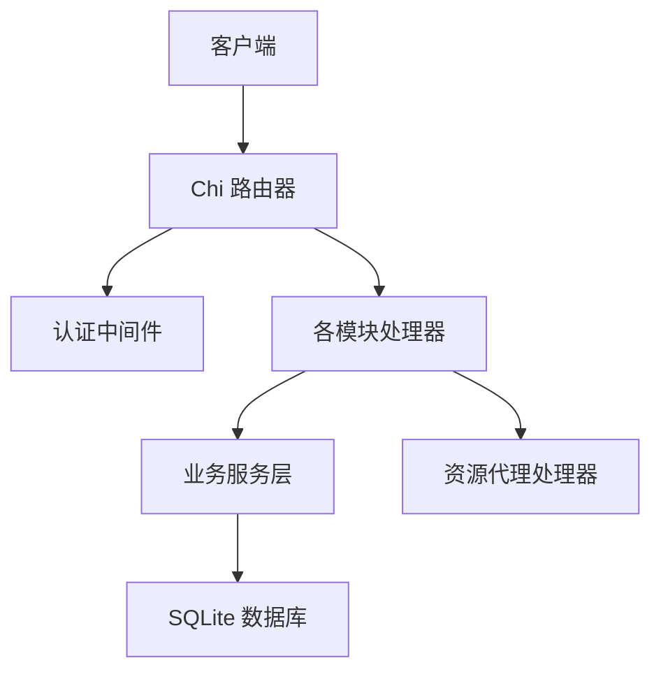
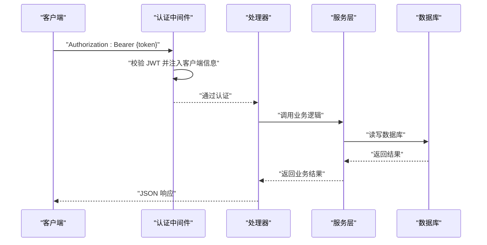
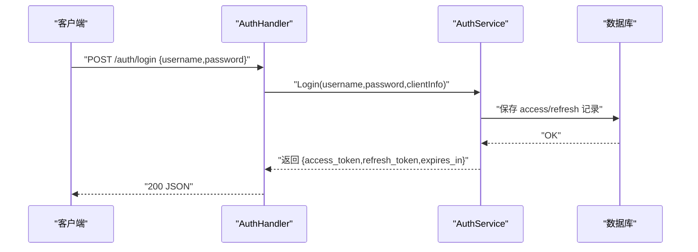
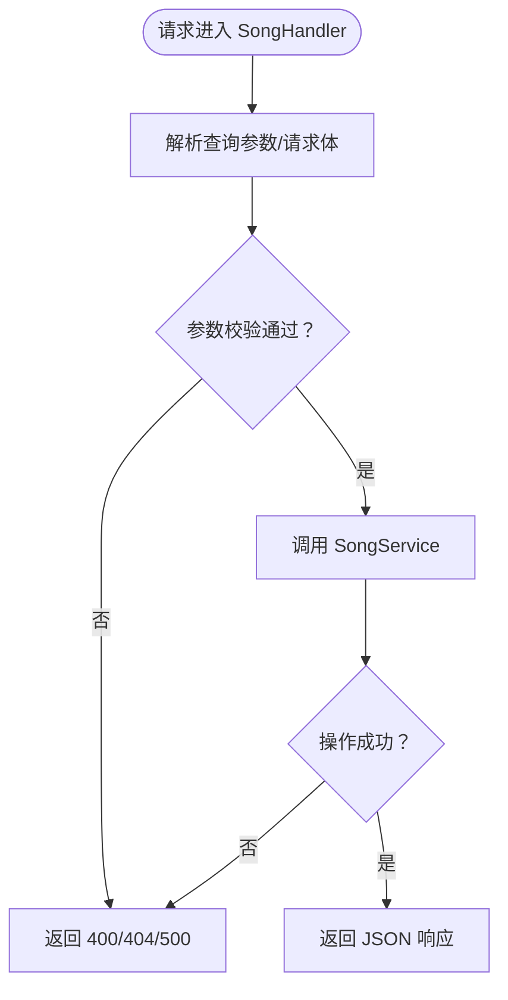
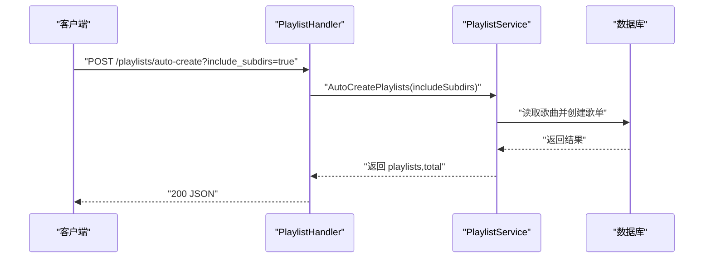
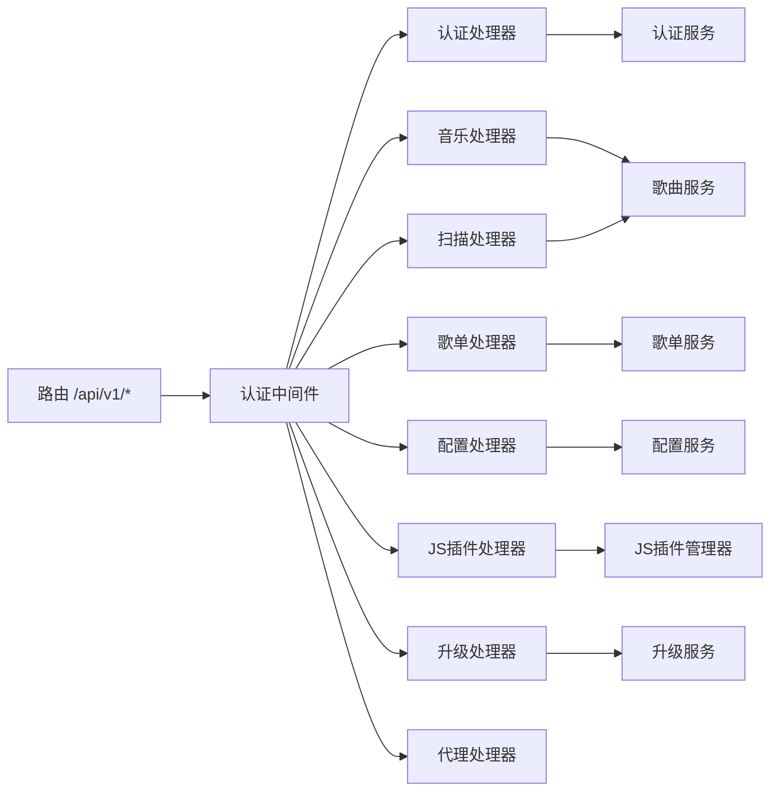

# API 接口参考

<cite>
**本文引用的文件**
- [main.go](file://main.go)
- [routers.go](file://internal/app/routers.go)
- [swagger.yaml](file://docs/swagger.yaml)
- [swagger.json](file://docs/swagger.json)
- [auth.go](file://internal/handlers/auth.go)
- [music.go](file://internal/handlers/music.go)
- [playlist.go](file://internal/handlers/playlist.go)
- [config.go](file://internal/handlers/config.go)
- [scan.go](file://internal/handlers/scan.go)
- [plugin.go](file://internal/handlers/plugin.go)
- [upgrade.go](file://internal/handlers/upgrade.go)
- [proxy.go](file://internal/handlers/proxy.go)
- [response.go](file://internal/handlers/response.go)
- [auth.go](file://internal/middleware/auth.go)
- [models.go](file://internal/models/models.go)
- [auth_service.go](file://internal/services/auth_service.go)
- [version.go](file://internal/version/version.go)
- [version.go](file://internal/handlers/version.go)
- [docs.go](file://docs/docs.go)
- [CHANGELOG.md](file://CHANGELOG.md)
- [sqlite_song.go](file://internal/database/sqlite_song.go)
- [search.go](file://plugins/mimusic-plugin-lxmusic/handlers/search.go)
- [manager.go](file://internal/plugins/manager.go)
- [host.go](file://internal/plugins/host.go)
- [plugin.go](file://internal/plugins/plugin.go)
- [api_bridge.go](file://internal/jsplugin/api_bridge.go)
- [routes.go](file://internal/jsplugin/routes.go)
- [communication.go](file://internal/jsplugin/communication.go)
- [permissions.go](file://internal/jsplugin/permissions.go)
- [service.go](file://internal/jsplugin/service.go)
- [manager.go](file://internal/jsplugin/manager.go)
- [package.go](file://internal/jsplugin/package.go)
- [jsplugin_handler.go](file://internal/handlers/jsplugin_handler.go)
- [schema.go](file://internal/database/schema.go)
- [version.json](file://build/version.json)
</cite>

## 更新摘要
**所做更改**
- API规范版本从1.3.46升级到1.3.47，反映最新的JavaScript插件系统改进
- 新增JS插件手动上传更新功能，支持更灵活的插件管理
- 修复编译警告和JS异步问题，提升系统稳定性
- 保持与代码版本同步，确保API文档准确性

## 目录
1. [简介](#简介)
2. [项目结构](#项目结构)
3. [核心组件](#核心组件)
4. [架构总览](#架构总览)
5. [详细组件分析](#详细组件分析)
6. [依赖分析](#依赖分析)
7. [性能考虑](#性能考虑)
8. [故障排查指南](#故障排查指南)
9. [结论](#结论)
10. [附录](#附录)

## 简介
本文件为 MiMusic 的完整 API 接口参考文档，覆盖认证管理、音乐管理、歌单管理、配置管理、扫描管理、插件管理、升级管理与资源代理等模块。文档基于实际代码实现，明确各接口的 HTTP 方法、URL 模式、请求/响应结构、认证方式与错误处理策略，并提供参数说明、请求示例、响应格式与最佳实践。

- 服务基地址：/api/v1
- API版本：1.3.47
- 认证方式：Bearer Token（Authorization 头或 URL 查询参数 access_token）
- 默认分页限制：常见接口默认每页 20 条，最大限制见各接口注释

**章节来源**
- [main.go:11-28](file://main.go#L11-L28)
- [routers.go:28-116](file://internal/app/routers.go#L28-L116)
- [swagger.json:15](file://docs/swagger.json#L15)
- [version.json:1-8](file://build/version.json#L1-L8)

## 项目结构
后端采用 Go Chi 路由器，按模块划分处理器与服务层，统一通过中间件进行认证与日志处理；Swagger 文档定义了接口契约与数据模型。

**图表来源**
- [routers.go:20-116](file://internal/app/routers.go#L20-L116)
- [auth.go:11-52](file://internal/middleware/auth.go#L11-L52)

**章节来源**
- [routers.go:136-249](file://internal/app/routers.go#L136-L249)

## 核心组件
- 路由注册：/api/v1 下按模块划分认证、歌曲、歌单、配置、扫描、插件、升级、代理等路由
- 认证中间件：从 Authorization 头或 URL 查询参数提取 Bearer Token，校验 JWT 并注入客户端标识
- 处理器层：封装请求解析、参数校验、调用服务层并返回 JSON 响应
- 服务层：实现业务逻辑（如 JWT 生成/校验、扫描进度、升级流程等）
- 数据模型：统一定义请求/响应结构体与枚举常量

**章节来源**
- [routers.go:28-116](file://internal/app/routers.go#L28-L116)
- [auth.go:11-52](file://internal/middleware/auth.go#L11-L52)
- [response.go:8-25](file://internal/handlers/response.go#L8-L25)
- [models.go:64-436](file://internal/models/models.go#L64-L436)

## 架构总览
以下序列图展示典型请求链路：客户端发起带 Bearer Token 的请求，经认证中间件校验后进入对应处理器，处理器调用服务层，最终返回 JSON 响应。

**图表来源**
- [auth.go:11-52](file://internal/middleware/auth.go#L11-L52)
- [auth.go:27-62](file://internal/handlers/auth.go#L27-L62)
- [auth_service.go:94-164](file://internal/services/auth_service.go#L94-L164)

## 详细组件分析

### 认证管理接口
- 登录
  - 方法与路径：POST /api/v1/auth/login
  - 请求体：用户名、密码
  - 响应体：access_token、refresh_token、expires_in、token_type
  - 错误：400（请求数据错误）、401（用户名或密码错误）、500（服务器错误）
- 刷新令牌
  - 方法与路径：POST /api/v1/auth/refresh
  - 请求体：refresh_token
  - 响应体：新的 access_token、refresh_token、expires_in、token_type
  - 错误：400（请求数据错误）、401（刷新令牌无效）、500（服务器错误）
- 登出
  - 方法与路径：POST /api/v1/auth/logout
  - 认证：Bearer
  - 响应体：成功信息
  - 错误：401（未授权）、500（服务器错误）
- 列出活跃令牌
  - 方法与路径：GET /api/v1/auth/tokens
  - 查询参数：type（access/refresh）、limit、offset
  - 认证：Bearer
  - 响应体：令牌列表、总数、limit、offset
  - 错误：401（未授权）、500（服务器错误）
- 撤销令牌
  - 方法与路径：DELETE /api/v1/auth/tokens/{token_id}
  - 路径参数：token_id
  - 请求体：reason（撤销原因）
  - 认证：Bearer
  - 响应体：成功信息
  - 错误：400（请求数据错误）、401（未授权）、500（服务器错误）

认证中间件支持两种获取 Token 的方式：
- Authorization 头：Bearer {token}
- URL 查询参数：access_token={token}

**图表来源**
- [auth.go:27-62](file://internal/handlers/auth.go#L27-L62)
- [auth_service.go:94-164](file://internal/services/auth_service.go#L94-L164)

**章节来源**
- [auth.go:27-254](file://internal/handlers/auth.go#L27-L254)
- [auth_service.go:94-324](file://internal/services/auth_service.go#L94-L324)
- [auth.go:11-52](file://internal/middleware/auth.go#L11-L52)

### 音乐管理接口
- 获取歌曲列表
  - 方法与路径：GET /api/v1/songs
  - 查询参数：type（local/remote/radio）、keyword、limit、offset
  - 认证：Bearer
  - 响应体：songs、total、limit、offset
  - 错误：500（服务器错误）
- 获取单个歌曲
  - 方法与路径：GET /api/v1/songs/{id}
  - 路径参数：id
  - 认证：Bearer
  - 响应体：歌曲详情
  - 错误：400（无效的歌曲ID）、404（歌曲不存在）、500（服务器错误）
- 更新歌曲
  - 方法与路径：PUT /api/v1/songs/{id}
  - 路径参数：id
  - 请求体：title、artist、album、url、cover_url（仅对非本地歌曲要求 url）
  - 认证：Bearer
  - 响应体：更新后的歌曲
  - 错误：400（请求数据错误）、404（歌曲不存在）、500（更新失败）
- 删除歌曲
  - 方法与路径：DELETE /api/v1/songs/{id}
  - 路径参数：id
  - 认证：Bearer
  - 响应体：成功信息
  - 错误：400（无效的歌曲ID）、500（删除失败）
- 批量删除歌曲
  - 方法与路径：POST /api/v1/songs/batch-delete
  - 请求体：ids（歌曲ID数组）
  - 认证：Bearer
  - 响应体：deleted（实际删除数量）
  - 错误：400（请求数据错误）、500（删除失败）
- 添加网络歌曲
  - 方法与路径：POST /api/v1/songs/remote
  - 请求体：url、title、artist、album、duration
  - 认证：Bearer
  - 响应体：新增歌曲
  - 错误：400（请求数据错误）、500（添加失败）
- 添加电台/广播
  - 方法与路径：POST /api/v1/songs/radio
  - 请求体：url、title、cover_url
  - 认证：Bearer
  - 响应体：新增歌曲
  - 错误：400（请求数据错误）、500（添加失败）
- 清理不存在的本地歌曲
  - 方法与路径：POST /api/v1/songs/clean
  - 认证：Bearer
  - 响应体：message、count
  - 错误：500（清理失败）

**更新** 新增 cache_hash 字段，用于远程歌曲的去重和缓存管理；歌词源枚举新增 'url' 和 'cached' 选项

**图表来源**
- [music.go:29-450](file://internal/handlers/music.go#L29-L450)

**章节来源**
- [music.go:29-450](file://internal/handlers/music.go#L29-L450)
- [models.go:64-122](file://internal/models/models.go#L64-L122)

### 歌单管理接口
- 获取歌单列表
  - 方法与路径：GET /api/v1/playlists
  - 查询参数：type（normal/radio）、limit、offset
  - 认证：Bearer
  - 响应体：playlists、limit、offset
  - 错误：500（服务器错误）
- 获取单个歌单
  - 方法与路径：GET /api/v1/playlists/{id}
  - 路径参数：id
  - 认证：Bearer
  - 响应体：歌单详情
  - 错误：400（无效的歌单ID）、404（歌单不存在）、500（服务器错误）
- 创建歌单
  - 方法与路径：POST /api/v1/playlists
  - 请求体：歌单信息（name、type、description、labels 等）
  - 认证：Bearer
  - 响应体：新建歌单
  - 错误：400（请求数据错误）、500（创建失败）
- 更新歌单
  - 方法与路径：PUT /api/v1/playlists/{id}
  - 路径参数：id
  - 请求体：歌单信息（name 等）
  - 认证：Bearer
  - 响应体：更新后的歌单
  - 错误：400（请求数据错误）、500（更新失败）
- 删除歌单
  - 方法与路径：DELETE /api/v1/playlists/{id}
  - 路径参数：id
  - 认证：Bearer
  - 响应体：成功信息
  - 错误：400（无效的歌单ID）、500（删除失败）
- 更新歌单最后播放时间
  - 方法与路径：POST /api/v1/playlists/{id}/touch
  - 路径参数：id
  - 认证：Bearer
  - 响应体：成功信息
  - 错误：400（无效的歌单ID）、500（更新失败）
- 获取歌单中的歌曲
  - 方法与路径：GET /api/v1/playlists/{id}/songs
  - 路径参数：id
  - 查询参数：limit、offset
  - 认证：Bearer
  - 响应体：songs、total、limit、offset
  - 错误：400（无效的歌单ID）、500（获取失败）
- 批量添加歌曲到歌单
  - 方法与路径：POST /api/v1/playlists/{id}/songs
  - 路径参数：id
  - 请求体：song_ids（歌曲ID数组）
  - 认证：Bearer
  - 响应体：message、added、skipped
  - 错误：400（请求数据错误）、500（添加失败）
- 从歌单移除歌曲
  - 方法与路径：DELETE /api/v1/playlists/{id}/songs/{songId}
  - 路径参数：id、songId
  - 认证：Bearer
  - 响应体：成功信息
  - 错误：400（请求数据错误）、500（移除失败）
- 重新排序歌单中的歌曲
  - 方法与路径：PUT /api/v1/playlists/{id}/songs/reorder
  - 路径参数：id
  - 请求体：song_ids（按新顺序排列的歌曲ID数组）
  - 认证：Bearer
  - 响应体：成功信息
  - 错误：400（请求数据错误）、500（排序失败）
- 自动创建歌单
  - 方法与路径：POST /api/v1/playlists/auto-create
  - 查询参数：include_subdirs（是否包含子目录）
  - 认证：Bearer
  - 响应体：playlists（歌单列表）、total（总数）
  - 错误：500（创建失败）

**图表来源**
- [playlist.go:443-473](file://internal/handlers/playlist.go#L443-L473)

**章节来源**
- [playlist.go:27-473](file://internal/handlers/playlist.go#L27-L473)
- [models.go:124-174](file://internal/models/models.go#L124-L174)

### 配置管理接口
- 获取配置列表
  - 方法与路径：GET /api/v1/configs
  - 查询参数：keyword、limit、offset
  - 认证：Bearer
  - 响应体：configs、total、limit、offset
  - 错误：500（服务器错误）
- 获取单个配置
  - 方法与路径：GET /api/v1/configs/{key}
  - 路径参数：key
  - 认证：Bearer
  - 响应体：配置详情
  - 错误：404（配置不存在）、500（服务器错误）
- 创建配置
  - 方法与路径：POST /api/v1/configs
  - 请求体：key、value（JSON 字符串）
  - 认证：Bearer
  - 响应体：配置详情
  - 错误：400（请求数据错误）、500（创建失败）
- 更新配置
  - 方法与路径：PUT /api/v1/configs/{key}
  - 路径参数：key
  - 请求体：value（JSON 字符串）
  - 认证：Bearer
  - 响应体：配置详情
  - 错误：400（请求数据错误）、404（配置不存在）、500（更新失败）
- 删除配置
  - 方法与路径：DELETE /api/v1/configs/{key}
  - 路径参数：key
  - 认证：Bearer
  - 响应体：成功信息
  - 错误：400（无效的配置键）、500（删除失败）

**章节来源**
- [config.go:27-253](file://internal/handlers/config.go#L27-L253)
- [models.go:199-216](file://internal/models/models.go#L199-L216)

### 扫描管理接口
- 扫描并导入本地音乐（异步）
  - 方法与路径：POST /api/v1/scan
  - 请求体：reimport（是否重新导入）
  - 认证：Bearer
  - 响应体：message（扫描任务已启动）
  - 错误：409（扫描正在进行中）、500（启动扫描失败）
- 获取扫描进度
  - 方法与路径：GET /api/v1/scan/progress
  - 认证：Bearer
  - 响应体：扫描进度信息（包含状态、已处理/总数、错误等）
- 取消扫描
  - 方法与路径：POST /api/v1/scan/cancel
  - 认证：Bearer
  - 响应体：message（扫描任务已取消）
  - 错误：400（没有正在进行的扫描任务）

**章节来源**
- [scan.go:27-94](file://internal/handlers/scan.go#L27-L94)

### JavaScript插件管理接口
- 列出所有JS插件
  - 方法与路径：GET /api/v1/jsplugins
  - 认证：Bearer
  - 响应体：plugins（插件列表）
  - 错误：500（服务器错误）
- 获取JS插件详情
  - 方法与路径：GET /api/v1/jsplugins/{id}
  - 路径参数：id
  - 认证：Bearer
  - 响应体：plugin（插件信息）
  - 错误：404（插件不存在）、500（服务器错误）
- 上传JS插件
  - 方法与路径：POST /api/v1/jsplugins/upload
  - 表单字段：file（.jsplugin.zip）
  - 认证：Bearer
  - 响应体：plugin（新安装的插件）
  - 错误：400（请求数据错误、只支持 .jsplugin.zip）、500（服务器错误）
- 更新JS插件
  - 方法与路径：PUT /api/v1/jsplugins/{id}
  - 路径参数：id
  - 表单字段：file（.jsplugin.zip）
  - 认证：Bearer
  - 响应体：plugin（更新后的插件）
  - 错误：400（请求数据错误）、404（插件不存在）、500（更新失败）
- 删除JS插件
  - 方法与路径：DELETE /api/v1/jsplugins/{id}
  - 路径参数：id
  - 认证：Bearer
  - 响应体：message（插件已删除）
  - 错误：404（插件不存在）、500（删除失败）
- 启用JS插件
  - 方法与路径：POST /api/v1/jsplugins/{id}/enable
  - 路径参数：id
  - 认证：Bearer
  - 响应体：plugin（启用后的插件）
  - 错误：404（插件不存在）、500（启用失败）
- 禁用JS插件
  - 方法与路径：POST /api/v1/jsplugins/{id}/disable
  - 路径参数：id
  - 认证：Bearer
  - 响应体：plugin（禁用后的插件）
  - 错误：404（插件不存在）、500（禁用失败）
- 检查JS插件更新
  - 方法与路径：GET /api/v1/jsplugins/{id}/check-update
  - 路径参数：id
  - 查询参数：proxy（可选代理地址）
  - 认证：Bearer
  - 响应体：更新信息（包含当前版本、最新版本、是否有更新等）
  - 错误：500（检查更新失败）
- 下载JS插件更新
  - 方法与路径：POST /api/v1/jsplugins/{id}/update
  - 路径参数：id
  - 查询参数：proxy（可选代理地址）
  - 认证：Bearer
  - 响应体：plugin（更新后的插件）
  - 错误：500（下载更新失败）

**更新** 新增JS插件手动上传更新功能，支持更灵活的插件管理；修复JS异步问题，提升插件运行稳定性

**章节来源**
- [jsplugin_handler.go:31-307](file://internal/handlers/jsplugin_handler.go#L31-L307)
- [models.go:461-483](file://internal/models/models.go#L461-L483)

### JavaScript插件API接口
- 插件静态页面访问
  - 方法与路径：GET /api/v1/jsplugin/{entryPath}
  - 路径参数：entryPath（插件入口路径）
  - 响应体：插件的index.html（注入base标签和认证桥接脚本）
  - 错误：404（插件不存在或未就绪）、500（服务器错误）
- 插件静态资源服务
  - 方法与路径：GET /api/v1/jsplugin/{entryPath}/static/*
  - 路径参数：entryPath（插件入口路径）、子路径（静态资源路径）
  - 响应体：静态文件内容（支持SPA回退到index.html）
  - 错误：404（文件不存在或无index.html回退）
- 插件API路由转发
  - 方法与路径：GET/POST/PUT/DELETE /api/v1/jsplugin/{entryPath}/*
  - 路径参数：entryPath（插件入口路径）、子路径（API路由）
  - 响应体：插件返回的HTTP响应
  - 错误：404（插件不存在或未就绪）、504（网关超时）

**更新** 新增JavaScript插件API路由系统，支持静态资源服务和API转发

**章节来源**
- [routes.go:20-36](file://internal/jsplugin/routes.go#L20-L36)
- [routes.go:64-107](file://internal/jsplugin/routes.go#L64-L107)
- [routes.go:109-163](file://internal/jsplugin/routes.go#L109-L163)

### JavaScript插件桥接接口
- 存储API
  - 方法与路径：mimusic.storage.get/set/delete/keys
  - 权限：storage
  - 功能：读取/写入/删除插件私有存储，列出存储键
- 歌曲API
  - 方法与路径：mimusic.songs.list/getById/search
  - 权限：songs.read
  - 功能：获取歌曲列表、按ID获取歌曲、搜索歌曲
- 歌单API
  - 方法与路径：mimusic.playlists.list/getById/getSongs
  - 权限：playlists.read
  - 功能：获取歌单列表、按ID获取歌单、获取歌单歌曲
- 插件间通信API
  - 方法与路径：mimusic.comm.send/call/onMessage
  - 权限：inter-plugin
  - 功能：异步发送消息、同步调用其他插件、注册消息处理器

**更新** 新增JavaScript插件桥接接口，提供完整的JS插件开发框架

**章节来源**
- [api_bridge.go:15-87](file://internal/jsplugin/api_bridge.go#L15-L87)
- [api_bridge.go:107-132](file://internal/jsplugin/api_bridge.go#L107-L132)
- [api_bridge.go:170-243](file://internal/jsplugin/api_bridge.go#L170-L243)
- [api_bridge.go:256-333](file://internal/jsplugin/api_bridge.go#L256-L333)
- [api_bridge.go:335-406](file://internal/jsplugin/api_bridge.go#L335-L406)
- [communication.go:91-139](file://internal/jsplugin/communication.go#L91-L139)

### JavaScript插件权限系统
- 权限类型
  - storage：持久化存储权限
  - songs.read/songs.write：歌曲读写权限
  - playlists.read/playlists.write：歌单读写权限
  - inter-plugin：插件间通信权限
  - command：执行命令权限
- 权限验证
  - 支持通配符匹配：如 "playlists.*" 匹配 "playlists.read"
  - 运行时权限映射：action到具体权限的映射
  - 声明层白名单：所有合法权限的集合

**更新** 新增JavaScript插件权限系统，支持细粒度权限控制

**章节来源**
- [permissions.go:8-21](file://internal/jsplugin/permissions.go#L8-L21)
- [permissions.go:23-35](file://internal/jsplugin/permissions.go#L23-L35)
- [permissions.go:37-53](file://internal/jsplugin/permissions.go#L37-L53)

### JavaScript插件服务管理
- 插件生命周期
  - 加载：读取ZIP、校验hash、创建JS环境
  - 初始化：调用onInit()生命周期回调
  - 运行：处理HTTP请求和插件间通信
  - 停止：调用onDeinit()并销毁JS环境
- 插件状态
  - ready：就绪状态
  - running：处理中状态
  - frozen：冻结状态（热更新期间）
  - stopped：已停止状态
- 插件调度
  - 基于消息队列的异步处理
  - 支持插件间消息传递
  - 健康检查和自动恢复

**更新** 新增JavaScript插件服务管理系统，提供完整的插件运行时环境

**章节来源**
- [service.go:17-41](file://internal/jsplugin/service.go#L17-L41)
- [service.go:59-69](file://internal/jsplugin/service.go#L59-L69)
- [service.go:82-212](file://internal/jsplugin/service.go#L82-L212)
- [service.go:214-248](file://internal/jsplugin/service.go#L214-L248)
- [service.go:250-278](file://internal/jsplugin/service.go#L250-L278)

### 插件包管理
- 插件安装
  - 解析ZIP文件和plugin.json
  - 验证权限声明和hash校验
  - 保存ZIP文件到data/jsplugins/
  - 写入数据库记录
- 插件更新
  - 覆盖旧ZIP文件
  - 更新数据库中的hash信息
  - 支持热重载
- 插件同步
  - 从本地目录重建插件记录
  - 处理孤儿插件和版本冲突
  - 规范化hash计算

**更新** 新增JavaScript插件包管理功能，支持插件的完整生命周期管理

**章节来源**
- [package.go:25-39](file://internal/jsplugin/package.go#L25-L39)
- [package.go:41-143](file://internal/jsplugin/package.go#L41-L143)
- [package.go:154-200](file://internal/jsplugin/package.go#L154-L200)

### 升级管理接口
- 获取可用版本信息
  - 方法与路径：GET /api/v1/upgrade/versions
  - 认证：Bearer
  - 响应体：current（当前版本信息）、stable（稳定版信息或错误）、dev（开发版信息或错误）
  - 错误：403（非 Docker 环境不支持升级）、500（获取版本信息失败）
- 检查更新
  - 方法与路径：GET /api/v1/upgrade/check
  - 认证：Bearer
  - 响应体：has_update、current、updates
  - 错误：403（非 Docker 环境不支持升级）、500（检查更新失败）
- 开始升级
  - 方法与路径：POST /api/v1/upgrade/start
  - 请求体：version_type（stable 或 dev）
  - 认证：Bearer
  - 响应体：message（升级已开始）
  - 错误：400（请求参数错误）、403（非 Docker 环境不支持升级）、500（升级失败）
- 获取升级进度
  - 方法与路径：GET /api/v1/upgrade/progress
  - 认证：Bearer
  - 响应体：状态、进度百分比、当前步骤、错误信息
  - 错误：403（非 Docker 环境不支持升级）

**章节来源**
- [upgrade.go:25-185](file://internal/handlers/upgrade.go#L25-L185)

### 资源代理接口
- 代理外部资源（解决 CORS 问题）
  - 方法与路径：GET /api/v1/proxy
  - 查询参数：url（目标资源 URL，需 URL 编码）
  - 功能：仅允许已知音乐相关 CDN 域名，透传 Range、Content-Type 等头部，支持流式转发
  - 错误：400（缺少/无效 url）、403（域名不允许代理）、502（上游请求失败）

**章节来源**
- [proxy.go:72-192](file://internal/handlers/proxy.go#L72-L192)

## 依赖分析
- 路由与中间件
  - 路由在 /api/v1 下注册，认证中间件对受保护路由生效
  - CORS 允许特定来源（localhost/127.0.0.1、局域网段、hanxi.cc 及其子域）
- 处理器与服务
  - 处理器负责参数解析与响应封装，服务层负责业务逻辑与数据访问
- 数据模型
  - 统一的请求/响应结构体与枚举常量，便于前后端协作与文档生成
- API版本管理
  - Swagger/OpenAPI 文档版本为 1.3.47，与系统版本保持一致

**图表来源**
- [routers.go:28-116](file://internal/app/routers.go#L28-L116)
- [auth.go:11-52](file://internal/middleware/auth.go#L11-L52)

**章节来源**
- [routers.go:28-116](file://internal/app/routers.go#L28-L116)
- [swagger.json:15](file://docs/swagger.json#L15)

## 性能考虑
- 分页与限制：多数列表接口限制最大分页大小，避免过大查询导致性能问题
- 压缩传输：启用 gzip 压缩（JS/WASM/CSS/JSON 等），降低带宽占用
- 缓存策略：封面图片与代理图片设置合理缓存头，提升重复访问性能
- 异步任务：扫描与升级采用异步方式，立即返回状态，通过进度接口轮询
- 插件优化：JavaScript插件支持字节码缓存和热重载，提升运行时性能

**章节来源**
- [music.go:52-64](file://internal/handlers/music.go#L52-L64)
- [routers.go:137-148](file://internal/app/routers.go#L137-L148)
- [proxy.go:184-191](file://internal/handlers/proxy.go#L184-L191)
- [service.go:196-206](file://internal/jsplugin/service.go#L196-L206)

## 故障排查指南
- 认证失败
  - 检查 Authorization 头是否为 Bearer {token}，或 URL 是否携带 access_token
  - 确认 Token 未过期、未被撤销
- 请求参数错误
  - 检查必填字段（如歌曲 url、标题、歌单 name、配置 key/value）
- 服务器错误
  - 查看响应中的 detail 字段获取详细错误信息
  - 关注 500 错误，结合服务端日志定位问题
- 插件相关问题
  - 检查插件权限声明是否正确
  - 验证插件hash是否匹配
  - 查看插件状态是否为active

**章节来源**
- [response.go:15-25](file://internal/handlers/response.go#L15-L25)
- [auth.go:11-52](file://internal/middleware/auth.go#L11-L52)
- [permissions.go:55-67](file://internal/jsplugin/permissions.go#L55-L67)

## 结论
本接口参考文档基于实际代码实现，覆盖了 MiMusic 的主要功能模块。通过统一的认证机制、清晰的路由设计与完善的错误处理，系统提供了稳定可靠的 RESTful API。API版本现已升级至1.3.47，反映了JavaScript插件系统的重大增强，包括完整的插件生命周期管理、细粒度权限控制、插件间通信机制、优化的运行时环境以及手动插件更新功能。建议在生产环境中配合 CORS 白名单、限流与监控策略，确保安全与性能。

## 附录
- 认证设置指南
  - 使用 /api/v1/auth/login 获取 access_token 与 refresh_token
  - 在后续请求中通过 Authorization: Bearer {access_token} 或 ?access_token={token} 传递
  - 使用 /api/v1/auth/refresh 刷新过期的 access_token
- API 测试方法
  - 使用 curl 或 Postman 调用接口，注意设置 Content-Type 为 application/json
  - 对于需要认证的接口，务必在请求头或查询参数中提供有效的 Bearer Token
- 最佳实践
  - 合理使用分页参数 limit/offset
  - 对于大文件上传（如插件），关注内存与磁盘空间
  - 使用代理接口访问外部资源时，确保目标域名在白名单内
  - JavaScript插件应正确声明权限，避免权限不足导致的功能异常
- 版本管理
  - API版本：1.3.47
  - 应用版本：可通过 /api/v1/version 接口获取详细版本信息
  - 版本历史：最新版本为 1.3.47（2026-05-22）
- JavaScript插件开发指南
  - 使用mimusic全局对象访问系统功能
  - 正确声明插件权限，避免安全风险
  - 实现必要的生命周期回调（onInit、onDeinit）
  - 使用插件间通信机制实现功能扩展
  - 遵循插件路由约定，提供静态资源和API接口
- 数据模型更新
  - **新增** JavaScript插件模型：包含插件元数据、权限列表、状态管理等
  - **新增** 插件权限系统：支持细粒度权限控制和通配符匹配
  - **新增** 插件桥接接口：提供存储、歌曲、歌单和通信API
  - **新增** 插件路由系统：支持静态资源服务和API转发
  - **新增** 插件包管理：支持插件的安装、更新和同步
  - **增强** 插件服务管理：提供完整的插件运行时环境和生命周期管理
  - **更新** 插件更新机制：支持手动上传更新，提升插件管理灵活性

**章节来源**
- [sqlite_song.go:443-499](file://internal/database/sqlite_song.go#L443-L499)
- [CHANGELOG.md:1-10](file://CHANGELOG.md#L1-L10)
- [models.go:79](file://internal/models/models.go#L79)
- [swagger.json:15](file://docs/swagger.json#L15)
- [version.json:1-8](file://build/version.json#L1-L8)
- [search.go:465-474](file://plugins/mimusic-plugin-lxmusic/handlers/search.go#L465-L474)
- [manager.go:26-32](file://internal/plugins/manager.go#L26-L32)
- [host.go:83-181](file://internal/plugins/host.go#L83-L181)
- [schema.go:152-185](file://internal/database/schema.go#L152-L185)