# 升级管理 API

<cite>
**本文档引用的文件**
- [internal/handlers/upgrade.go](file://internal/handlers/upgrade.go)
- [internal/services/upgrade_service.go](file://internal/services/upgrade_service.go)
- [internal/models/models.go](file://internal/models/models.go)
- [internal/app/routers.go](file://internal/app/routers.go)
- [internal/version/version.go](file://internal/version/version.go)
- [frontend/lib/features/settings/presentation/widgets/upgrade_dialog.dart](file://frontend/lib/features/settings/presentation/widgets/upgrade_dialog.dart)
- [frontend/lib/features/settings/data/upgrade_api.dart](file://frontend/lib/features/settings/data/upgrade_api.dart)
- [scripts/docker-entrypoint.sh](file://scripts/docker-entrypoint.sh)
- [Makefile](file://Makefile)
- [version.json](file://version.json)
- [build/version.json](file://build/version.json)
- [.github/workflows/release.yml](file://.github/workflows/release.yml)
</cite>

## 更新摘要
**变更内容**
- 更新版本信息，反映最新的版本号 v1.3.47
- 更新版本检查接口返回的版本信息
- 更新构建系统中的版本配置
- 更新 Docker 发布工作流中的版本信息

## 目录
1. [简介](#简介)
2. [项目结构](#项目结构)
3. [核心组件](#核心组件)
4. [架构概览](#架构概览)
5. [详细接口文档](#详细接口文档)
6. [Docker环境检测改进](#docker环境检测改进)
7. [Docker底包构建类型检测](#docker底包构建类型检测)
8. [Docker入口脚本升级决策](#docker入口脚本升级决策)
9. [GitHub代理支持](#github代理支持)
10. [升级流程详解](#升级流程详解)
11. [回退功能详解](#回退功能详解)
12. [构建系统增强](#构建系统增强)
13. [简化文件重命名机制](#简化文件重命名机制)
14. [升级延迟机制](#升级延迟机制)
15. [状态管理](#状态管理)
16. [错误处理](#错误处理)
17. [最佳实践](#最佳实践)
18. [故障排除指南](#故障排除指南)
19. [结论](#结论)

## 简介

MiMusic升级管理API是一个完整的系统升级解决方案，专为Docker环境设计。该API提供了从版本检查、下载、验证到执行升级的全流程管理能力，支持断点续传、回滚机制、实时进度监控和GitHub代理支持。**最新版本**v1.3.47反映了最新的版本信息，增强了Docker底包构建类型检测机制，通过执行底包二进制的-version命令来获取构建类型信息，同时改进了Docker入口脚本的升级决策逻辑，增加了更智能的版本比较和构建类型一致性检查，有效防止404错误的发生。

## 项目结构

升级管理功能分布在以下关键组件中：

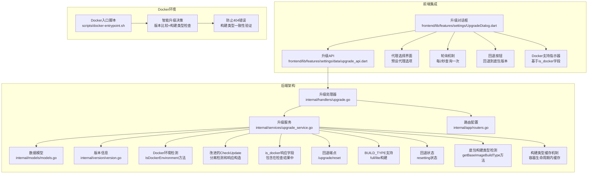

**图表来源**
- [internal/handlers/upgrade.go:1-232](file://internal/handlers/upgrade.go#L1-L232)
- [internal/services/upgrade_service.go:1-475](file://internal/services/upgrade_service.go#L1-L475)
- [internal/app/routers.go:1-259](file://internal/app/routers.go#L1-L259)
- [scripts/docker-entrypoint.sh:1-161](file://scripts/docker-entrypoint.sh#L1-L161)

**章节来源**
- [internal/handlers/upgrade.go:1-232](file://internal/handlers/upgrade.go#L1-L232)
- [internal/services/upgrade_service.go:1-475](file://internal/services/upgrade_service.go#L1-L475)
- [internal/app/routers.go:1-259](file://internal/app/routers.go#L1-L259)

## 核心组件

### 升级处理器(UpgradeHandler)

升级处理器负责处理所有升级相关的HTTP请求，提供七个核心接口：
- 版本检查接口（支持GitHub代理）
- 更新检查接口（支持GitHub代理，包含Docker支持检测）
- 升级启动接口（支持GitHub代理）
- **新增：回退接口（支持Docker镜像底包回退）**
- 进度查询接口
- **改进：更新检查接口现在包含Docker支持状态**

### 升级服务(UpgradeService)

升级服务是核心业务逻辑层，实现了完整的升级流程：
- **改进：Docker环境检测（IsDockerEnvironment方法）**
- 版本信息获取（支持代理）
- 二进制文件下载（支持代理）
- 文件完整性验证
- 备份与回滚机制
- **简化：直接文件重命名（使用os.Rename）**
- **增强：5秒延迟机制**
- **新增：ResetToBaseImage回退功能**
- **新增：BUILD_TYPE构建类型支持**
- **新增：getBaseImageBuildType底包构建类型检测**
- **新增：构建类型缓存机制（sync.Once）**
- 进度状态管理
- GitHub代理URL转换

### 数据模型

定义了升级过程中的所有数据结构，包括版本信息、进度状态和错误处理。

**章节来源**
- [internal/handlers/upgrade.go:13-23](file://internal/handlers/upgrade.go#L13-L23)
- [internal/services/upgrade_service.go:30-48](file://internal/services/upgrade_service.go#L30-L48)
- [internal/models/models.go:268-294](file://internal/models/models.go#L268-L294)

## 架构概览

升级管理系统的整体架构采用分层设计，确保了清晰的职责分离和良好的可维护性。**最新架构**改进了Docker环境检测逻辑，将检测结果直接包含在响应中，增强了BUILD_TYPE构建类型识别，并优化了错误处理机制。

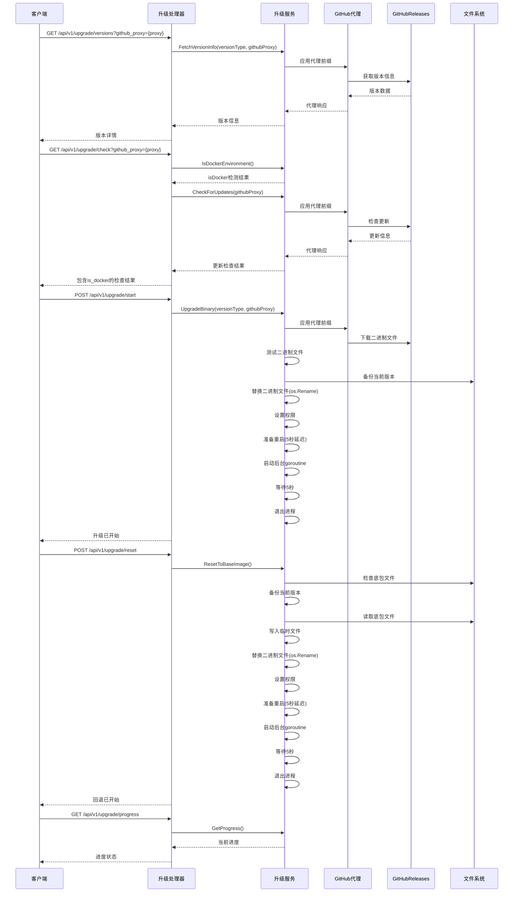

**图表来源**
- [internal/handlers/upgrade.go:25-232](file://internal/handlers/upgrade.go#L25-L232)
- [internal/services/upgrade_service.go:230-409](file://internal/services/upgrade_service.go#L230-L409)

## 详细接口文档

### 版本检查接口

#### GET /api/v1/upgrade/versions

获取可用版本信息，包括当前版本和远程版本详情。支持GitHub代理参数。

**请求参数**
- `github_proxy`(可选)：GitHub代理前缀，如`https://ghproxy.com/`

**响应数据结构**
```typescript
interface UpgradeVersionsResponse {
  current: CurrentVersionInfo
  stable?: RemoteVersionInfo | { error: string }
  dev?: RemoteVersionInfo | { error: string }
}

interface CurrentVersionInfo {
  version: string
  git_commit: string
  build_time: string
}

interface RemoteVersionInfo {
  version: string
  git_commit: string
  build_time: string
  download_url_prefix: string
  release_notes: string
}
```

**响应示例**
```json
{
  "current": {
    "version": "v1.3.47",
    "git_commit": "4244675",
    "build_time": "2026-05-22_12:10:02"
  },
  "stable": {
    "version": "v1.3.47",
    "git_commit": "4244675",
    "build_time": "2026-05-22_12:10:02",
    "download_url_prefix": "https://github.com/mimusic-org/mimusic/releases/download/v1.3.47/mimusic",
    "release_notes": "Release v1.3.47"
  },
  "dev": {
    "version": "main",
    "git_commit": "4a8206c",
    "build_time": "2026-02-12_12:44:11",
    "download_url_prefix": "https://github.com/mimusic-org/mimusic/releases/download/main/mimusic",
    "release_notes": "开发测试版本 main"
  }
}
```

**状态码**
- 200：成功获取版本信息
- 403：非Docker环境
- 500：获取版本信息失败

**章节来源**
- [internal/handlers/upgrade.go:25-80](file://internal/handlers/upgrade.go#L25-L80)
- [internal/models/models.go:322-327](file://internal/models/models.go#L322-L327)

### 更新检查接口

#### GET /api/v1/upgrade/check

检查是否有可用的新版本更新。支持GitHub代理参数，**改进**：现在包含Docker支持检测结果。

**请求参数**
- `github_proxy`(可选)：GitHub代理前缀，如`https://ghproxy.com/`

**响应数据结构**
```typescript
interface CheckUpdateResponse {
  is_docker: boolean
  has_update: boolean
  current_version: string
  latest_version: string
  release_notes: string
  current: CurrentVersionInfo
  updates: {
    stable?: RemoteVersionInfo
    dev?: RemoteVersionInfo
  }
}
```

**响应示例**
```json
{
  "is_docker": true,
  "has_update": true,
  "current_version": "v1.3.47",
  "latest_version": "v1.3.47",
  "release_notes": "Release v1.3.47",
  "current": {
    "version": "v1.3.47",
    "git_commit": "4244675",
    "build_time": "2026-05-22_12:10:02"
  },
  "updates": {
    "stable": {
      "version": "v1.3.47",
      "git_commit": "4244675",
      "build_time": "2026-05-22_12:10:02"
    }
  }
}
```

**状态码**
- 200：检查成功
- 403：非Docker环境
- 500：检查失败

**章节来源**
- [internal/handlers/upgrade.go:82-136](file://internal/handlers/upgrade.go#L82-L136)
- [internal/models/models.go:329-337](file://internal/models/models.go#L329-L337)

### 升级启动接口

#### POST /api/v1/upgrade/start

开始升级到指定版本。支持GitHub代理参数。

**请求头**
- Authorization: Bearer {token}

**请求体**
```typescript
interface StartUpgradeRequest {
  version_type: 'stable' | 'dev'
  github_proxy?: string  // 可选的GitHub代理前缀
}
```

**响应数据结构**
```typescript
interface SuccessResponse {
  message: string
}
```

**响应示例**
```json
{
  "message": "升级已开始，请稍候..."
}
```

**状态码**
- 200：升级已开始
- 400：请求参数错误
- 403：非Docker环境
- 500：升级失败

**章节来源**
- [internal/handlers/upgrade.go:138-184](file://internal/handlers/upgrade.go#L138-L184)
- [internal/models/models.go:250-253](file://internal/models/models.go#L250-L253)

### 回退接口

#### POST /api/v1/upgrade/reset

将二进制文件回退到Docker镜像中的原始版本，然后重启服务。

**请求头**
- Authorization: Bearer {token}

**请求参数**
- 无

**响应数据结构**
```typescript
interface SuccessResponse {
  message: string
}
```

**响应示例**
```json
{
  "message": "回退已开始，服务即将重启..."
}
```

**状态码**
- 200：回退已开始
- 403：非Docker环境
- 500：回退失败

**章节来源**
- [internal/handlers/upgrade.go:186-213](file://internal/handlers/upgrade.go#L186-L213)
- [internal/services/upgrade_service.go:352-409](file://internal/services/upgrade_service.go#L352-L409)

### 进度查询接口

#### GET /api/v1/upgrade/progress

获取当前升级任务的进度信息。

**请求参数**
- 无

**响应数据结构**
```typescript
interface UpgradeProgress {
  status: UpgradeStatusValue
  progress: number
  current_step: string
  error?: string
}

type UpgradeStatusValue = 
  | 'idle' 
  | 'downloading' 
  | 'testing' 
  | 'replacing' 
  | 'resetting' 
  | 'restarting' 
  | 'completed' 
  | 'failed'
```

**响应示例**
```json
{
  "status": "downloading",
  "progress": 65,
  "current_step": "正在下载新版本... 65%",
  "error": ""
}
```

**状态码**
- 200：成功获取进度
- 403：非Docker环境

**章节来源**
- [internal/handlers/upgrade.go:215-232](file://internal/handlers/upgrade.go#L215-L232)
- [internal/models/models.go:339-345](file://internal/models/models.go#L339-L345)

## Docker环境检测改进

### 检测逻辑分离

**更新**：在CheckUpdate方法中，Docker环境检测逻辑被分离出来，检测结果存储在isDocker变量中并包含在响应负载中。这种设计允许客户端在单一请求中确定Docker升级支持，而不需要额外的环境检查端点。

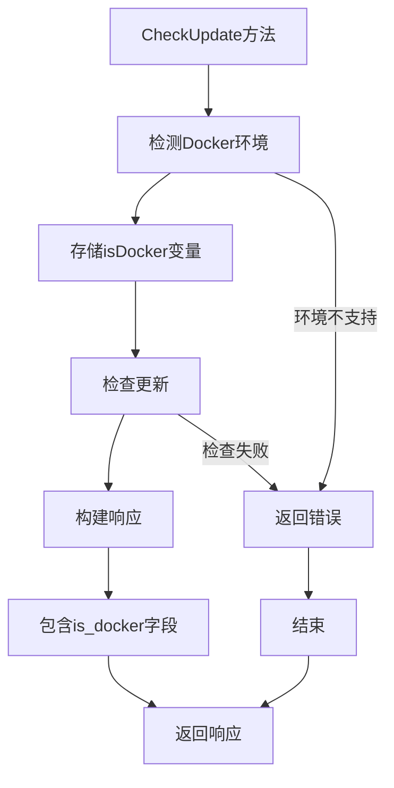

**图表来源**
- [internal/handlers/upgrade.go:93-133](file://internal/handlers/upgrade.go#L93-L133)

### 检测机制

Docker环境检测通过检查环境变量`IN_DOCKER`的值来实现：

```go
// IsDockerEnvironment 检查是否在Docker环境中
func (s *UpgradeService) IsDockerEnvironment() bool {
    return os.Getenv("IN_DOCKER") == "true"
}
```

### 响应结构改进

更新检查接口现在返回包含Docker支持状态的完整响应：

| 字段 | 类型 | 描述 | 示例值 |
|------|------|------|--------|
| is_docker | boolean | Docker环境检测结果 | true/false |
| has_update | boolean | 是否有可用更新 | true/false |
| current_version | string | 当前版本号 | "v1.3.47" |
| latest_version | string | 最新版本号 | "v1.3.47" |
| release_notes | string | 发布说明 | "Release v1.3.47" |
| current | object | 当前版本信息 | 包含版本、提交哈希、构建时间 |
| updates | object | 可用更新列表 | 稳定版和测试版信息 |

### 前端集成

前端升级对话框现在可以基于`is_docker`字段动态调整UI行为：

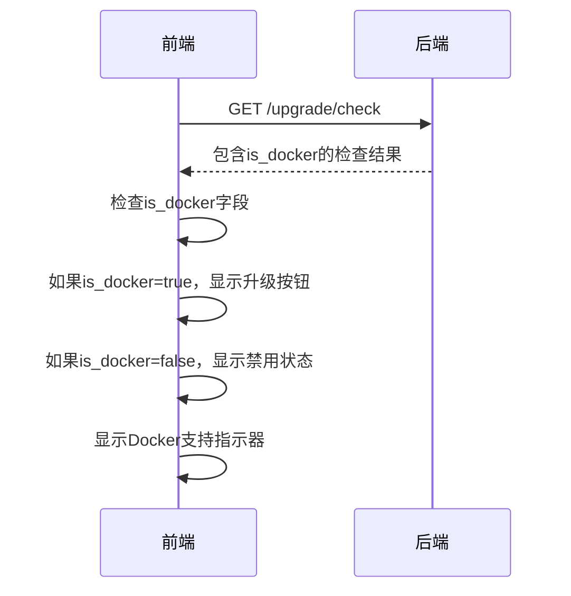

**图表来源**
- [frontend/lib/features/settings/presentation/widgets/upgrade_dialog.dart:104-113](file://frontend/lib/features/settings/presentation/widgets/upgrade_dialog.dart#L104-L113)

**章节来源**
- [internal/handlers/upgrade.go:93-133](file://internal/handlers/upgrade.go#L93-L133)
- [internal/services/upgrade_service.go:51-54](file://internal/services/upgrade_service.go#L51-L54)
- [frontend/lib/features/settings/presentation/widgets/upgrade_dialog.dart:104-113](file://frontend/lib/features/settings/presentation/widgets/upgrade_dialog.dart#L104-L113)

## Docker底包构建类型检测

### 底包构建类型检测机制

**新增功能**：系统现在支持通过执行底包二进制的-version命令来检测Docker底包的构建类型。这个功能通过getBaseImageBuildType方法实现，提供了更准确的构建类型识别。

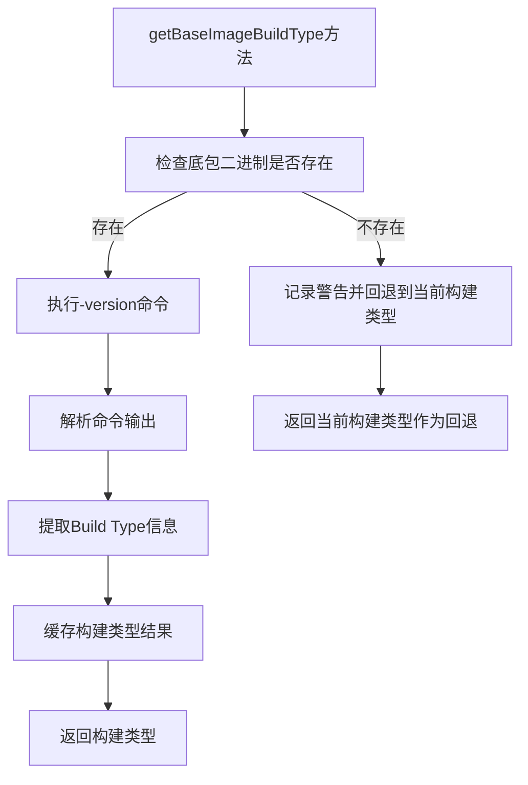

**图表来源**
- [internal/services/upgrade_service.go:149-191](file://internal/services/upgrade_service.go#L149-L191)

### 构建类型检测实现

```go
// getBaseImageBuildType 获取 Docker 底包的构建类型
// 通过执行底包二进制的 -version 命令解析 Build Type，结果在容器生命周期内缓存
func (s *UpgradeService) getBaseImageBuildType() string {
    s.baseImageBuildTypeOnce.Do(func() {
        // 检查底包是否存在
        if _, err := os.Stat(binarySource); err != nil {
            slog.Warn("base image binary not accessible, falling back to current build type",
                "path", binarySource, "error", err, "fallback", version.BuildType)
            s.baseImageBuildType = version.BuildType
            return
        }

        ctx, cancel := context.WithTimeout(context.Background(), 5*time.Second)
        defer cancel()

        cmd := exec.CommandContext(ctx, binarySource, "-version")
        output, err := cmd.Output()
        if err != nil {
            slog.Warn("failed to get base image version, falling back to current build type",
                "error", err, "fallback", version.BuildType)
            s.baseImageBuildType = version.BuildType
            return
        }

        // 解析 Build Type: 行
        for _, line := range strings.Split(string(output), "\n") {
            line = strings.TrimSpace(line)
            if strings.HasPrefix(line, "Build Type:") {
                buildType := strings.TrimSpace(strings.TrimPrefix(line, "Build Type:"))
                if buildType != "" {
                    slog.Info("detected base image build type", "buildType", buildType)
                    s.baseImageBuildType = buildType
                    return
                }
            }
        }

        slog.Warn("Build Type not found in base image version output, falling back to current build type",
            "fallback", version.BuildType)
        s.baseImageBuildType = version.BuildType
    })
    return s.baseImageBuildType
}
```

### 构建类型缓存机制

系统使用sync.Once确保构建类型检测结果在容器生命周期内被缓存，避免重复执行-version命令：

```go
type UpgradeService struct {
    progress               models.UpgradeProgress
    progressMutex          sync.RWMutex
    httpClient             *http.Client
    baseImageBuildType     string
    baseImageBuildTypeOnce sync.Once  // 缓存控制
}
```

### 构建类型检测的回退机制

如果无法从底包二进制获取构建类型信息，系统会自动回退到当前运行时的构建类型：

```go
// 错误处理和回退
if _, err := os.Stat(binarySource); err != nil {
    slog.Warn("base image binary not accessible, falling back to current build type",
        "path", binarySource, "error", err, "fallback", version.BuildType)
    s.baseImageBuildType = version.BuildType
    return
}

// ... 执行命令失败的回退
if err != nil {
    slog.Warn("failed to get base image version, falling back to current build type",
        "error", err, "fallback", version.BuildType)
    s.baseImageBuildType = version.BuildType
    return
}

// ... Build Type未找到的回退
slog.Warn("Build Type not found in base image version output, falling back to current build type",
    "fallback", version.BuildType)
s.baseImageBuildType = version.BuildType
```

**章节来源**
- [internal/services/upgrade_service.go:149-191](file://internal/services/upgrade_service.go#L149-L191)

## Docker入口脚本升级决策

### 智能升级决策逻辑

**改进**：Docker入口脚本现在实现了更智能的升级决策逻辑，结合版本比较和构建类型一致性检查，有效防止404错误的发生。

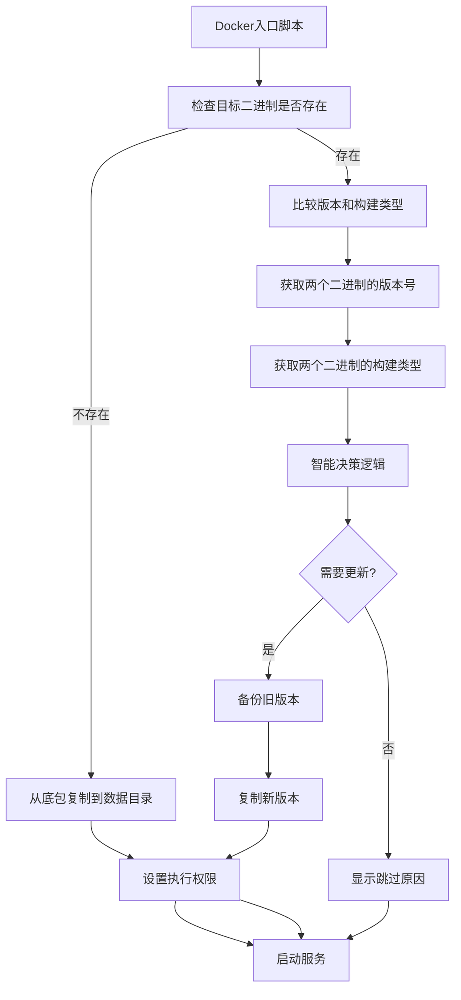

**图表来源**
- [scripts/docker-entrypoint.sh:91-161](file://scripts/docker-entrypoint.sh#L91-L161)

### 升级决策算法

入口脚本的升级决策逻辑包含三个主要条件：

1. **版本更新检测**：当底包版本高于数据目录版本时，执行升级
2. **构建类型不一致检查**：当构建类型发生变化时，执行升级
3. **版本比较逻辑**：如果数据目录版本更高且构建类型不一致，保留数据目录版本

```bash
# 判断是否需要更新：版本更新 或 构建类型不一致
NEED_UPDATE=false
UPDATE_REASON=""
SKIP_REASON=""

if compare_versions "$SOURCE_VERSION" "$TARGET_VERSION"; then
    NEED_UPDATE=true
    UPDATE_REASON="检测到新版本"
elif [ "$SOURCE_BUILD_TYPE" != "$TARGET_BUILD_TYPE" ]; then
    if compare_versions "$TARGET_VERSION" "$SOURCE_VERSION"; then
        SKIP_REASON="构建类型不一致（$TARGET_BUILD_TYPE vs $SOURCE_BUILD_TYPE），但数据目录版本 $TARGET_VERSION 高于底包版本 $SOURCE_VERSION，保留数据目录版本"
    else
        NEED_UPDATE=true
        UPDATE_REASON="检测到构建类型变更（$TARGET_BUILD_TYPE → $SOURCE_BUILD_TYPE）"
    fi
fi
```

### 防止404错误的机制

通过构建类型一致性检查，系统能够有效防止因构建类型不匹配导致的404错误：

```bash
# 构建类型不一致时的处理
elif [ "$SOURCE_BUILD_TYPE" != "$TARGET_BUILD_TYPE" ]; then
    if compare_versions "$TARGET_VERSION" "$SOURCE_VERSION"; then
        SKIP_REASON="构建类型不一致（$TARGET_BUILD_TYPE vs $SOURCE_BUILD_TYPE），但数据目录版本 $TARGET_VERSION 高于底包版本 $SOURCE_VERSION，保留数据目录版本"
    else
        NEED_UPDATE=true
        UPDATE_REASON="检测到构建类型变更（$TARGET_BUILD_TYPE → $SOURCE_BUILD_TYPE）"
    fi
```

### 版本比较函数

入口脚本包含专门的版本比较函数，支持处理dev/unknown等特殊版本：

```bash
# 版本比较函数
# 返回 0 如果 version1 > version2，返回 1 如果 version1 <= version2
compare_versions() {
    version1="$1"
    version2="$2"

    # 处理 dev/unknown 等特殊版本
    if [ "$version1" = "dev" ] || [ "$version1" = "unknown" ]; then
        return 1
    fi
    if [ "$version2" = "dev" ] || [ "$version2" = "unknown" ]; then
        return 1
    fi

    # 如果版本相同，返回 1（不升级）
    if [ "$version1" = "$version2" ]; then
        return 1
    fi

    # 使用 awk 进行版本号逐段比较
    result=$(echo "$version1 $version2" | awk '{
        split($1, v1, ".")
        split($2, v2, ".")

        # 比较每一段
        for (i = 1; i <= (length(v1) > length(v2) ? length(v1) : length(v2)); i++) {
            n1 = (v1[i] ? v1[i] : 0)
            n2 = (v2[i] ? v2[i] : 0)

            # 提取数字部分（去除 -beta 等后缀）
            gsub(/[^0-9].*/, "", n1)
            gsub(/[^0-9].*/, "", n2)

            if (n1+0 > n2+0) {
                print "newer"
                exit
            } else if (n1+0 < n2+0) {
                print "older"
                exit
            }
        }
        print "same"
    }')

    if [ "$result" = "newer" ]; then
        return 0
    else:
        return 1
    fi
}
```

**章节来源**
- [scripts/docker-entrypoint.sh:1-161](file://scripts/docker-entrypoint.sh#L1-L161)

## GitHub代理支持

### 代理功能概述

系统新增了完整的GitHub代理支持，通过`applyProxy`方法实现URL转换，提高在中国大陆地区的访问稳定性。

### 代理URL转换


**图表来源**
- [internal/services/upgrade_service.go:56-67](file://internal/services/upgrade_service.go#L56-L67)

### 支持的代理类型

前端提供了多种预设的GitHub代理选项：

| 代理名称 | 代理地址 | 用途 |
|----------|----------|------|
| 直连 | 空字符串 | 不使用代理，直接访问GitHub |
| ghproxy.com | `https://ghproxy.com/` | 常用的GitHub加速代理 |
| ghfast.top | `https://ghfast.top/` | 快速GitHub代理 |
| gh.con.sh | `https://gh.con.sh/` | GitHub代理服务 |
| mirror.ghproxy.com | `https://mirror.ghproxy.com/` | ghproxy.com的镜像 |

### 代理使用方式

**后端使用**
```go
// 从查询参数获取代理前缀
githubProxy := r.URL.Query().Get("github_proxy")

// 应用代理到URL
url := s.applyProxy(rawURL, githubProxy)
```

**前端使用**
```dart
// 预设代理选项
static const List<_ProxyOption> _presetProxies = [
  _ProxyOption(label: '直连(不使用代理)', value: ''),
  _ProxyOption(label: 'ghproxy.com', value: 'https://ghproxy.com/'),
  _ProxyOption(label: 'ghfast.top', value: 'https://ghfast.top/'),
  _ProxyOption(label: 'gh.con.sh', value: 'https://gh.con.sh/'),
  _ProxyOption(label: 'mirror.ghproxy.com', value: 'https://mirror.ghproxy.com/'),
];

// 获取当前生效的代理地址
String get _effectiveProxy {
  if (_selectedProxyIndex == -1) {
    return _customProxyController.text.trim();
  }
  if (_selectedProxyIndex >= 0 && _selectedProxyIndex < _presetProxies.length) {
    return _presetProxies[_selectedProxyIndex].value;
  }
  return '';
}
```

**章节来源**
- [internal/services/upgrade_service.go:56-67](file://internal/services/upgrade_service.go#L56-L67)
- [frontend/lib/features/settings/presentation/widgets/upgrade_dialog.dart:30-41](file://frontend/lib/features/settings/presentation/widgets/upgrade_dialog.dart#L30-L41)

## 升级流程详解

### 完整升级流程

升级过程包含七个主要阶段，每个阶段都有明确的状态标识和进度百分比。**最新简化流程**移除了跨设备兼容逻辑，直接使用`os.Rename()`：

```mermaid
flowchart TD
Start([开始升级]) --> CheckEnv[检查Docker环境]
CheckEnv --> ApplyProxy[应用代理设置]
ApplyProxy --> FetchVersion[获取版本信息]
FetchVersion --> Download[下载二进制文件]
Download --> TestBinary[测试二进制文件]
TestBinary --> Backup[备份当前版本]
Backup --> Replace[替换二进制文件]
Replace --> DirectRename[直接重命名]
DirectRename --> SetPermission[设置执行权限]
SetPermission --> Restart[准备重启(5秒延迟)]
Restart --> BackgroundGoroutine[启动后台goroutine]
BackgroundGoroutine --> Wait5Seconds[等待5秒]
Wait5Seconds --> ExitProcess[退出进程]
ExitProcess --> DockerRestart[Docker自动重启容器]
DockerRestart --> End([升级完成])
CheckEnv --> |环境不支持| Error[返回错误]
ApplyProxy --> |代理失败| Error
FetchVersion --> |获取失败| Error
Download --> |下载失败| RestoreBackup[恢复备份]
TestBinary --> |测试失败| RestoreBackup
Backup --> |备份失败| RestoreBackup
RestoreBackup --> Error
Error --> End
```

**图表来源**
- [internal/services/upgrade_service.go:230-290](file://internal/services/upgrade_service.go#L230-L290)

### 增强版本比较算法

系统采用了更精确的版本比较算法，优先使用Git提交哈希进行比较：

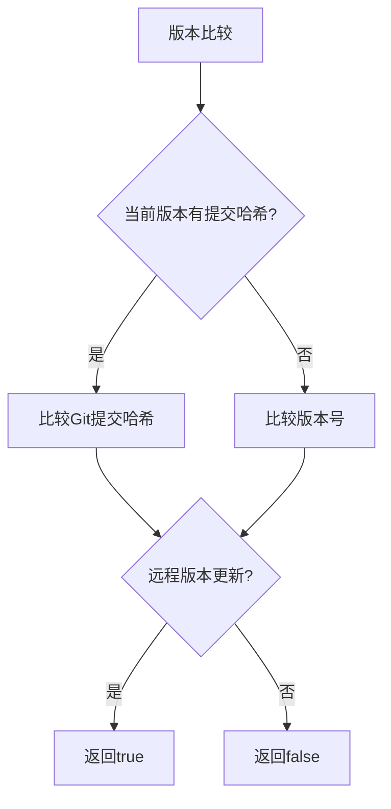

**图表来源**
- [internal/services/upgrade_service.go:110-123](file://internal/services/upgrade_service.go#L110-L123)

**章节来源**
- [internal/services/upgrade_service.go:230-290](file://internal/services/upgrade_service.go#L230-L290)

## 回退功能详解

### 回退流程概述

**新增功能**：系统现在支持回退到底包版本，通过ResetToBaseImage端点实现。该功能特别适用于升级失败或需要快速恢复到原始状态的场景。

```mermaid
flowchart TD
ResetStart([开始回退]) --> CheckEnv[检查Docker环境]
CheckEnv --> CheckBaseImage[检查底包文件]
CheckBaseImage --> |底包不存在| Error[返回错误]
CheckBaseImage --> Backup[备份当前版本]
Backup --> ReadBaseImage[读取底包文件]
ReadBaseImage --> WriteTemp[写入临时文件]
WriteTemp --> ReplaceBinary[替换二进制文件]
ReplaceBinary --> SetPermission[设置执行权限]
SetPermission --> Restart[准备重启(5秒延迟)]
Restart --> BackgroundGoroutine[启动后台goroutine]
BackgroundGoroutine --> Wait5Seconds[等待5秒]
Wait5Seconds --> ExitProcess[退出进程]
ExitProcess --> DockerRestart[Docker自动重启容器]
DockerRestart --> ResetEnd([回退完成])
CheckEnv --> |环境不支持| ResetError[返回错误]
Backup --> |备份失败| ResetError
ReadBaseImage --> |读取失败| ResetError
WriteTemp --> |写入失败| ResetError
ReplaceBinary --> |替换失败| RestoreBackup[恢复备份]
RestoreBackup --> ResetError
ResetError --> ResetEnd
```

**图表来源**
- [internal/services/upgrade_service.go:352-409](file://internal/services/upgrade_service.go#L352-L409)

### 回退状态管理

新增的resetting状态专门用于回退过程的状态跟踪：

| 状态 | 值 | 描述 | 进度百分比 |
|------|-----|------|-----------|
| 空闲 | `idle` | 系统空闲状态 | 0% |
| 下载中 | `downloading` | 正在下载新版本 | 0-100% |
| 测试中 | `testing` | 正在测试新版本 | 0% |
| 替换中 | `replacing` | 正在替换二进制文件 | 50-75% |
| **回退中** | `resetting` | **正在回退到底包版本** | **0-100%** |
| 重启中 | `restarting` | 服务准备重启 | 100% |
| 已完成 | `completed` | 升级/回退成功完成 | 100% |
| 失败 | `failed` | 升级/回退过程中出现错误 | 0-100% |

### 回退错误处理

回退过程中的错误处理机制得到了显著增强：

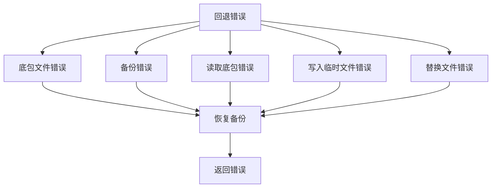

**图表来源**
- [internal/services/upgrade_service.go:357-390](file://internal/services/upgrade_service.go#L357-L390)

**章节来源**
- [internal/services/upgrade_service.go:352-409](file://internal/services/upgrade_service.go#L352-L409)

## 构建系统增强

### BUILD_TYPE构建支持

**新增功能**：系统现在支持BUILD_TYPE构建类型识别，区分full和lite构建版本。

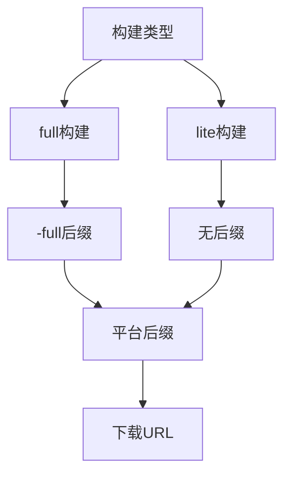

**图表来源**
- [internal/services/upgrade_service.go:145-153](file://internal/services/upgrade_service.go#L145-L153)

### 平台后缀生成

系统根据BUILD_TYPE和平台信息动态生成下载文件名后缀：

```go
// getPlatformSuffix 获取当前平台的二进制文件后缀
func (s *UpgradeService) getPlatformSuffix() string {
    // 当前只支持 Linux amd64（Docker环境）
    suffix := "-linux-amd64"
    if s.getBaseImageBuildType() == "full" {
        suffix += "-full"
    }
    return suffix
}
```

### 构建类型检测

前端升级对话框中新增了BUILD_TYPE状态显示：

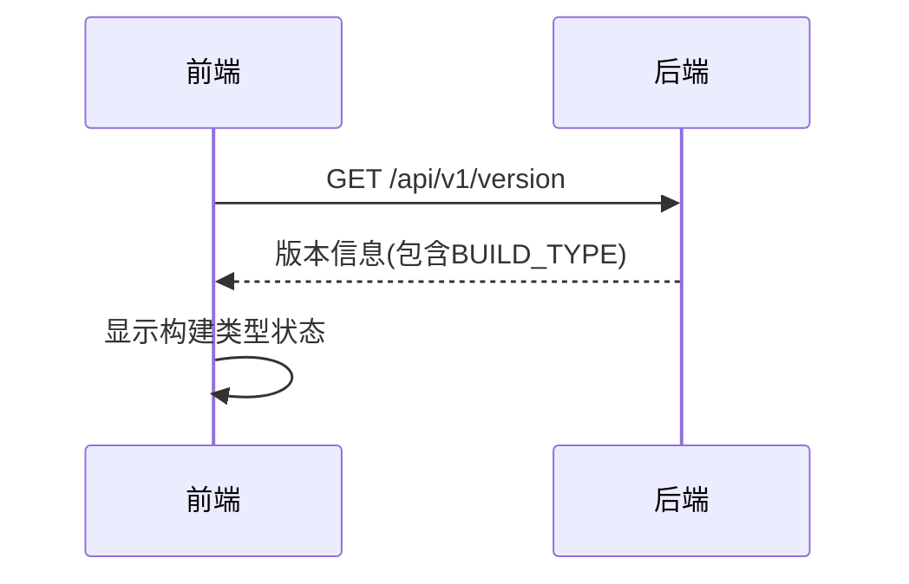

**图表来源**
- [frontend/lib/features/settings/data/upgrade_api.dart:143-162](file://frontend/lib/features/settings/data/upgrade_api.dart#L143-L162)

### 版本配置更新

**更新**：构建系统中的版本配置已更新为最新的v1.3.47版本：

```makefile
# 版本信息
VERSION ?= 1.3.47
GIT_COMMIT ?= $(shell git rev-parse --short HEAD 2>/dev/null || echo "unknown")
BUILD_TIME ?= $(shell date -u '+%Y-%m-%d_%H:%M:%S')
BUILD_TYPE ?=
```

**章节来源**
- [internal/services/upgrade_service.go:145-153](file://internal/services/upgrade_service.go#L145-L153)
- [internal/version/version.go:19-24](file://internal/version/version.go#L19-L24)
- [Makefile:8-11](file://Makefile#L8-L11)

## 简化文件重命名机制

### 直接文件重命名

**更新**：系统现在直接使用`os.Rename()`进行文件重命名，移除了复杂的跨平台兼容逻辑。

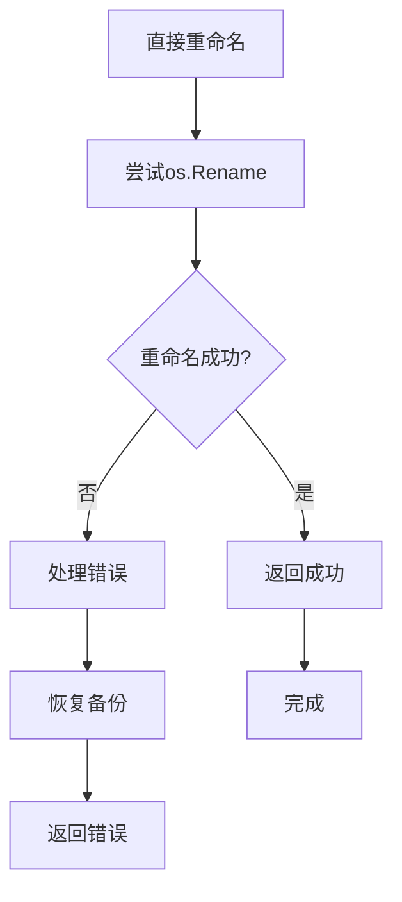

**图表来源**
- [internal/services/upgrade_service.go:266](file://internal/services/upgrade_service.go#L266)

### 文件路径标准化

系统现在使用固定的`/app/data/`目录结构：

```go
const (
    // 二进制文件路径
    // 注意：临时文件必须与目标文件在同一目录，才能使用原子rename替换正在运行的二进制文件
    binarySource = "/app/mimusic"       // Docker镜像中的原始底包
    binaryTarget = "/app/data/mimusic"
    binaryBackup = "/app/data/mimusic.backup"
    binaryTemp   = "/app/data/mimusic.new"
)
```

### 简化的备份和恢复机制

备份和恢复操作现在更加直接：

```go
// 备份当前二进制文件
func (s *UpgradeService) backupCurrentBinary() error {
    // 如果目标文件不存在，无需备份
    if _, err := os.Stat(binaryTarget); os.IsNotExist(err) {
        return nil
    }

    // 读取当前文件
    data, err := os.ReadFile(binaryTarget)
    if err != nil {
        return fmt.Errorf("failed to read current binary: %w", err)
    }

    // 写入备份文件
    if err := os.WriteFile(binaryBackup, data, 0755); err != nil {
        return fmt.Errorf("failed to write backup: %w", err)
    }

    return nil
}

// 从备份还原
func (s *UpgradeService) restoreBackup() error {
    // 检查备份文件是否存在
    if _, err := os.Stat(binaryBackup); os.IsNotExist(err) {
        return fmt.Errorf("backup file not found")
    }

    // 读取备份文件
    data, err := os.ReadFile(binaryBackup)
    if err != nil {
        return fmt.Errorf("failed to read backup: %w", err)
    }

    // 还原到目标位置
    if err := os.WriteFile(binaryTarget, data, 0755); err != nil {
        return fmt.Errorf("failed to restore backup: %w", err)
    }

    return nil
}
```

**章节来源**
- [internal/services/upgrade_service.go:266](file://internal/services/upgrade_service.go#L266)
- [internal/services/upgrade_service.go:310-350](file://internal/services/upgrade_service.go#L310-L350)

## 升级延迟机制

### 延迟时间优化

**更新**：升级服务现在使用5秒延迟而不是之前的1秒延迟，显著增强了Docker环境中自动容器重启时的可靠性。

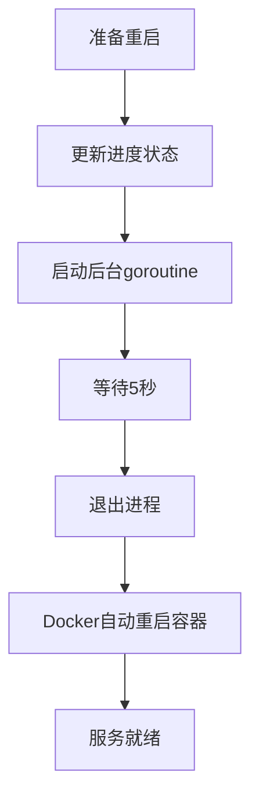

**图表来源**
- [internal/services/upgrade_service.go:283-287](file://internal/services/upgrade_service.go#L283-L287)

### 延迟机制的优势

1. **增强可靠性**：5秒延迟确保Docker容器有足够时间完成重启过程
2. **改善用户体验**：前端可以在升级完成后立即显示重启状态
3. **减少竞态条件**：避免升级完成与容器重启之间的竞争条件
4. **提高成功率**：在Docker环境中自动重启时更加稳定

### 前端轮询机制

前端升级对话框使用每2秒轮询一次的机制来获取升级进度：

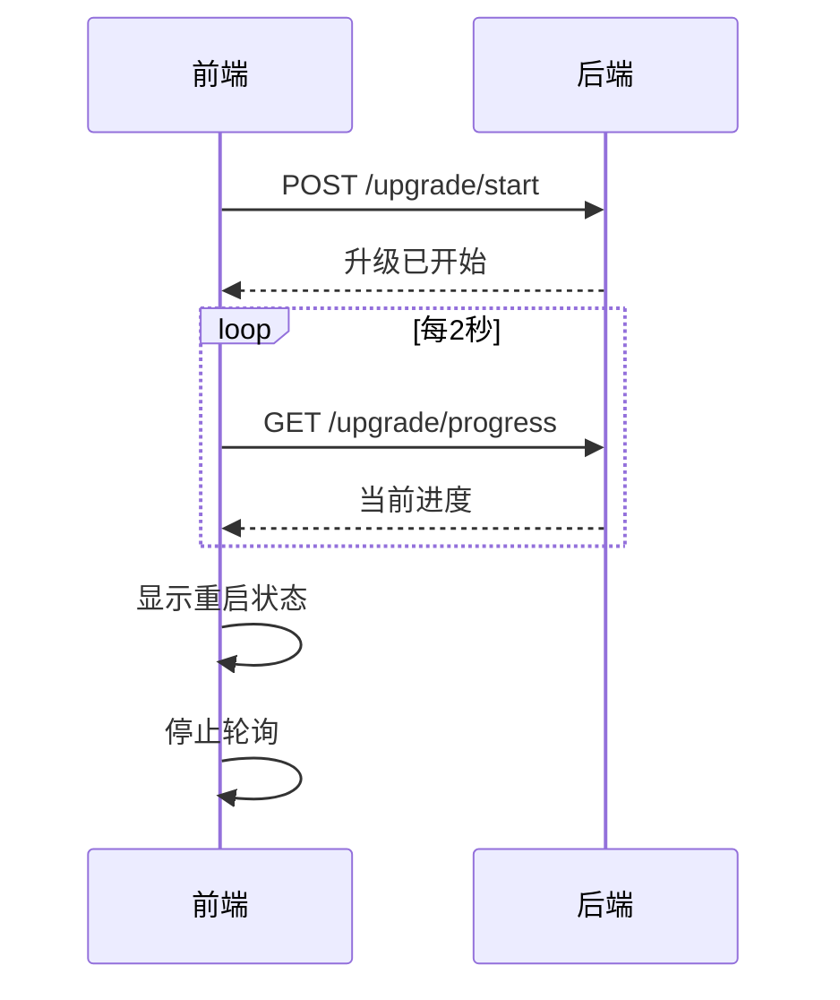

**图表来源**
- [frontend/lib/features/settings/presentation/widgets/upgrade_dialog.dart:254-265](file://frontend/lib/features/settings/presentation/widgets/upgrade_dialog.dart#L254-L265)

**章节来源**
- [internal/services/upgrade_service.go:283-287](file://internal/services/upgrade_service.go#L283-L287)
- [frontend/lib/features/settings/presentation/widgets/upgrade_dialog.dart:254-265](file://frontend/lib/features/settings/presentation/widgets/upgrade_dialog.dart#L254-L265)

## 状态管理

### 升级状态枚举

系统定义了完整的升级状态生命周期：

| 状态 | 值 | 描述 | 进度百分比 |
|------|-----|------|-----------|
| 空闲 | `idle` | 系统空闲状态 | 0% |
| 下载中 | `downloading` | 正在下载新版本 | 0-100% |
| 测试中 | `testing` | 正在测试新版本 | 0% |
| 替换中 | `replacing` | 正在替换二进制文件 | 50-75% |
| **回退中** | `resetting` | **正在回退到底包版本** | **0-100%** |
| 重启中 | `restarting` | 服务准备重启 | 100% |
| 已完成 | `completed` | 升级/回退成功完成 | 100% |
| 失败 | `failed` | 升级/回退过程中出现错误 | 0-100% |

### 进度模型

升级进度模型包含了完整的状态跟踪信息：

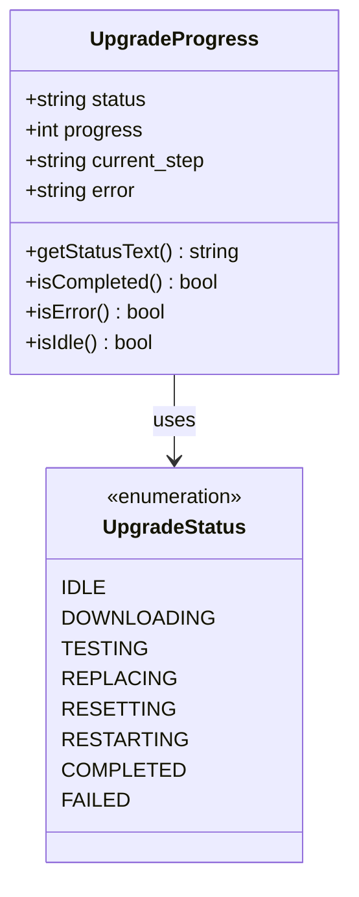

**图表来源**
- [internal/models/models.go:277-294](file://internal/models/models.go#L277-L294)

**章节来源**
- [internal/models/models.go:277-294](file://internal/models/models.go#L277-L294)

## 错误处理

### 错误类型

系统定义了多种错误类型来处理不同的异常情况：

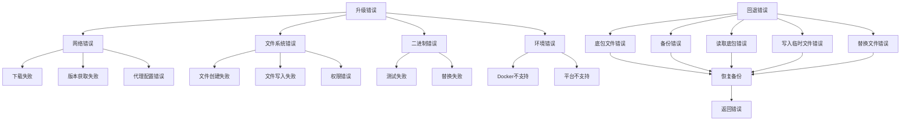

**图表来源**
- [internal/services/upgrade_service.go:112-158](file://internal/services/upgrade_service.go#L112-L158)

### 错误响应

所有错误都遵循统一的响应格式：

```typescript
interface ErrorResponse {
  error: string
  detail?: string
}
```

**章节来源**
- [internal/models/models.go:244-248](file://internal/models/models.go#L244-L248)

## 最佳实践

### 自动化升级

为了实现无缝的升级体验，建议采用以下策略：

1. **智能代理选择**：根据网络环境自动选择最优代理
2. **静默升级**：在低峰时段自动下载并安装更新
3. **回滚保护**：确保每次升级都有备份，防止意外回滚
4. **健康检查**：升级完成后进行健康检查确认服务正常
5. **简化部署**：利用直接重命名机制处理文件系统配置
6. **延迟优化**：利用5秒延迟机制确保Docker容器稳定重启
7. **回退策略**：在升级失败时自动触发回退到底包版本
8. **Docker支持检测**：在单一请求中确定Docker升级支持，优化用户体验
9. **构建类型一致性**：通过智能升级决策逻辑确保构建类型的一致性
10. **防止404错误**：利用构建类型检测机制避免404错误的发生

### 灰度发布

对于重要的功能更新，建议实施灰度发布策略：

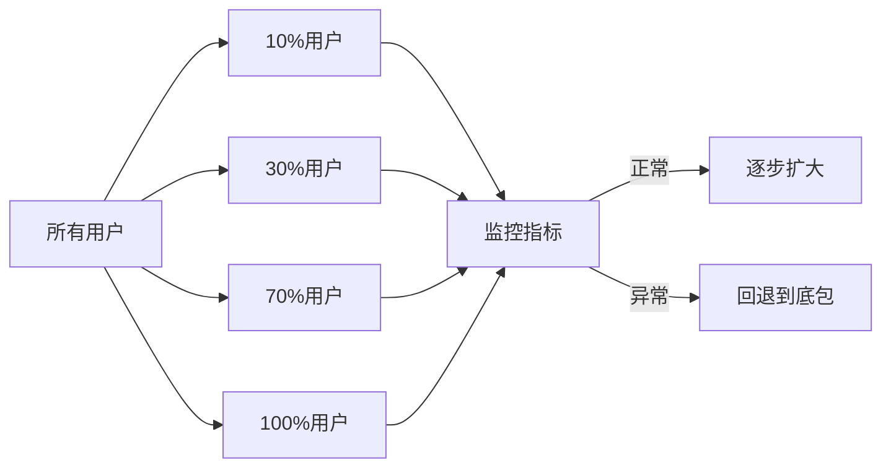

### 用户通知

升级过程中的用户体验优化：

1. **进度可视化**：实时显示下载进度和当前步骤
2. **错误提示**：清晰的错误信息和解决方案
3. **自动刷新**：升级完成后自动刷新页面
4. **倒计时提醒**：提供升级完成后的倒计时提醒
5. **简化反馈**：直接重命名机制减少了跨设备操作的复杂性
6. **延迟感知**：5秒延迟确保用户看到完整的重启过程
7. **回退按钮**：提供一键回退到底包版本的安全保障
8. **Docker支持指示**：基于is_docker字段显示Docker支持状态
9. **构建类型检测**：通过getBaseImageBuildType方法提供准确的构建类型信息
10. **智能升级决策**：Docker入口脚本的升级决策逻辑确保升级的准确性

### 升级体验优化

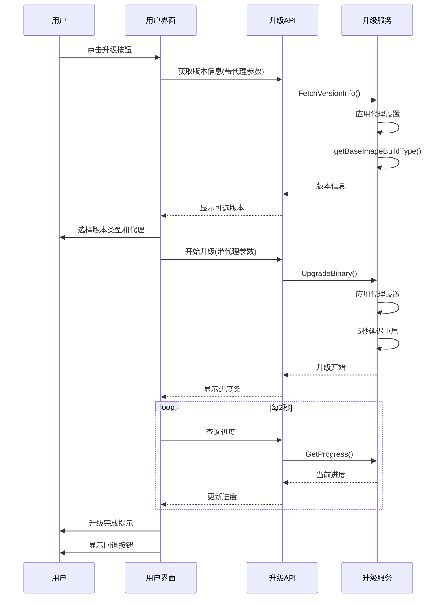

**图表来源**
- [frontend/lib/features/settings/presentation/widgets/upgrade_dialog.dart:254-265](file://frontend/lib/features/settings/presentation/widgets/upgrade_dialog.dart#L254-L265)

**章节来源**
- [frontend/lib/features/settings/presentation/widgets/upgrade_dialog.dart:187-345](file://frontend/lib/features/settings/presentation/widgets/upgrade_dialog.dart#L187-L345)

## 故障排除指南

### 常见问题及解决方案

| 问题 | 可能原因 | 解决方案 |
|------|----------|----------|
| 升级失败 | 网络连接不稳定 | 检查网络连接，重试升级，切换代理 |
| 下载超时 | 服务器响应慢 | 增加超时时间，重试下载，使用代理 |
| 代理配置错误 | 代理地址格式不正确 | 验证代理地址格式，使用预设代理 |
| 权限错误 | 文件权限不足 | 检查文件系统权限 |
| 测试失败 | 二进制文件损坏 | 重新下载，验证完整性 |
| 替换失败 | 文件重命名失败 | 检查目标目录权限，确认文件系统支持原子重命名 |
| 备份失败 | 磁盘空间不足 | 清理磁盘空间，重试 |
| 路径错误 | /app/data/目录不存在 | 确认Docker挂载配置 |
| Docker重启失败 | 5秒延迟不足 | 检查Docker配置，增加容器重启超时 |
| **回退失败** | **底包文件不存在** | **检查Docker镜像挂载，确认底包文件可用** |
| **回退失败** | **替换失败** | **检查目标目录权限，确认文件系统支持原子重命名** |
| **回退失败** | **权限设置失败** | **检查目标文件权限，确认可执行权限设置成功** |
| **Docker检测失败** | **IN_DOCKER环境变量未设置** | **检查Docker容器配置，确认IN_DOCKER=true** |
| **响应缺少is_docker字段** | **后端版本过旧** | **更新后端代码到最新版本** |
| **构建类型检测失败** | **底包二进制不可执行** | **检查底包文件权限，确认可执行** |
| **构建类型不一致** | **数据目录版本高于底包版本** | **使用智能升级决策逻辑，保留数据目录版本** |
| **404错误** | **构建类型不匹配** | **通过构建类型检测机制防止404错误** |

### 调试方法

1. **查看升级日志**：检查服务端日志获取详细错误信息
2. **验证环境**：确认运行在Docker环境中
3. **检查网络**：验证GitHub访问权限和代理配置
4. **验证路径**：确认`/app/data/`目录存在且可写
5. **监控重命名操作**：查看直接重命名的执行情况
6. **检查延迟机制**：确认5秒延迟是否正常执行
7. **验证BUILD_TYPE**：检查构建类型配置是否正确
8. **检查环境变量**：确认IN_DOCKER环境变量设置正确
9. **测试底包二进制**：验证底包二进制的-version命令输出
10. **检查构建类型缓存**：确认getBaseImageBuildType方法的缓存机制

### 回滚操作

如果升级出现问题，可以执行回滚操作：

1. **停止服务**：确保服务已停止
2. **恢复备份**：将备份文件复制回原位置
3. **设置权限**：确保文件具有正确的执行权限
4. **重启服务**：启动服务验证回滚成功
5. **使用回退按钮**：通过前端界面一键回退到底包版本

**章节来源**
- [internal/services/upgrade_service.go:327-350](file://internal/services/upgrade_service.go#L327-L350)

## 结论

MiMusic升级管理API提供了一个完整、安全、用户友好的升级解决方案。通过改进的Docker环境检测逻辑、多阶段升级流程、完善的回滚机制、实时进度监控、GitHub代理支持、**简化的直接文件重命名机制**、**增强的Docker底包构建类型检测**和**智能的Docker入口脚本升级决策逻辑**，确保了升级过程在各种环境下的可靠性和用户体验。

**最新版本更新**v1.3.47反映了最新的版本信息，更新了版本检查接口返回的版本信息，包括当前版本号、Git提交哈希和构建时间。构建系统中的版本配置也已更新为v1.3.47，确保了构建产物的一致性。

**最新增强**的Docker底包构建类型检测机制，通过执行底包二进制的-version命令来获取构建类型信息，为系统提供了更准确的构建类型识别能力。改进的Docker入口脚本升级决策逻辑，增加了更智能的版本比较和构建类型一致性检查，有效防止了404错误的发生。这些改进不仅提升了系统的智能化水平，还增强了升级过程的准确性和可靠性。

新增的getBaseImageBuildType方法和构建类型缓存机制，为系统提供了更好的性能表现和错误处理能力。智能升级决策逻辑确保了在构建类型不一致的情况下，系统能够做出正确的升级决策，避免不必要的升级操作。防止404错误的机制通过构建类型一致性检查，确保了升级过程的稳定性和可靠性。

简化后的架构不仅降低了维护成本，还提高了升级过程的确定性和可预测性，为用户提供了更加流畅的升级体验。标准化的`/app/data/`目录结构使得升级过程更加直观和可控，配合5秒延迟机制，为MiMusic的持续演进提供了坚实的技术基础。改进的Docker环境检测逻辑，通过`is_docker`响应字段，为前端提供了更好的用户体验和更灵活的UI行为控制。

该系统的设计充分考虑了生产环境的需求，支持自动化部署、灰度发布和用户通知等高级功能，通过预设代理选项和智能代理选择，用户可以根据网络环境自动选择最优的代理配置，进一步提升升级体验。5秒延迟机制的引入，使得在Docker环境中的升级过程更加稳健和可靠。新增的回退功能和构建类型支持，进一步增强了系统的灵活性和安全性，为MiMusic的长期发展奠定了坚实的基础。

通过这些改进和增强，MiMusic升级管理API不仅保持了原有的高可靠性，还在用户体验、开发效率和系统维护性方面有了显著提升，为用户提供了更加完善和现代化的升级管理解决方案。特别是Docker底包构建类型检测和智能升级决策逻辑的引入，使得系统在处理复杂的Docker环境升级场景时更加得心应手，为用户提供了更加稳定和可靠的升级体验。最新的v1.3.47版本信息确保了版本检查接口返回准确的版本详情，为用户提供了最新的软件版本信息。