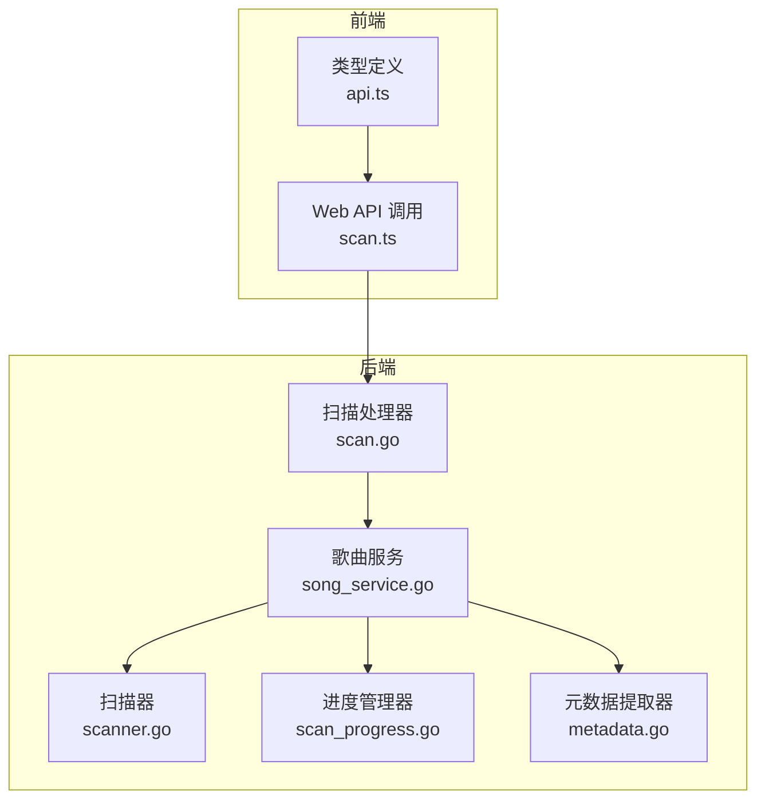
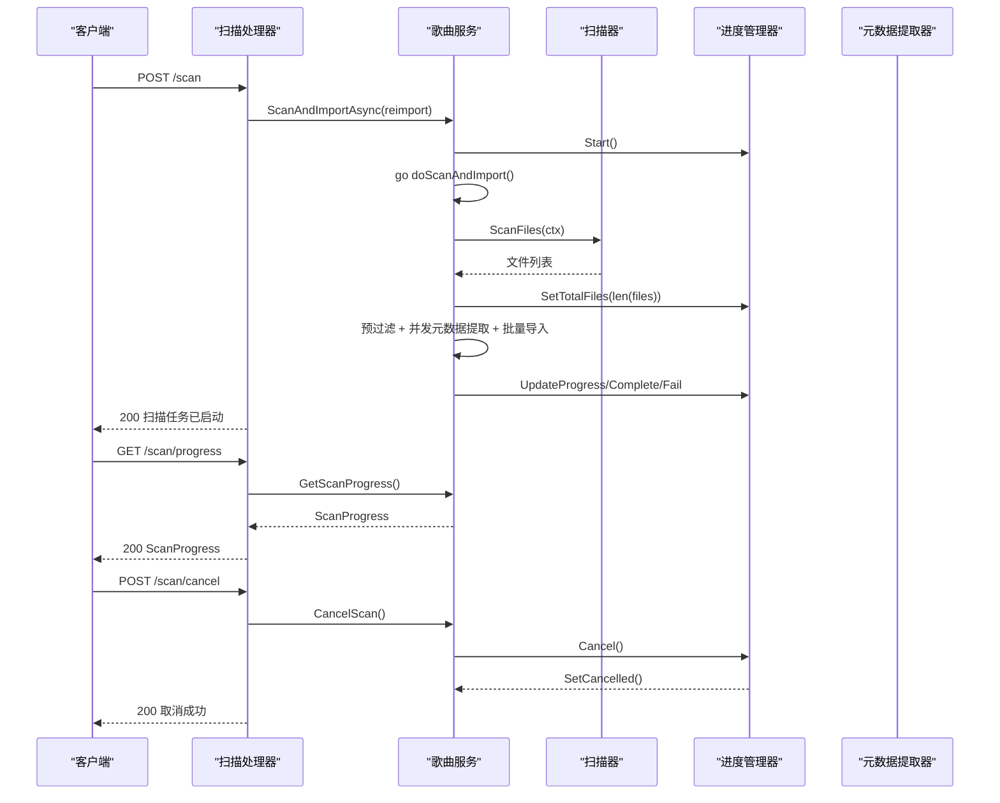
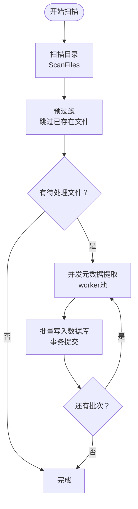
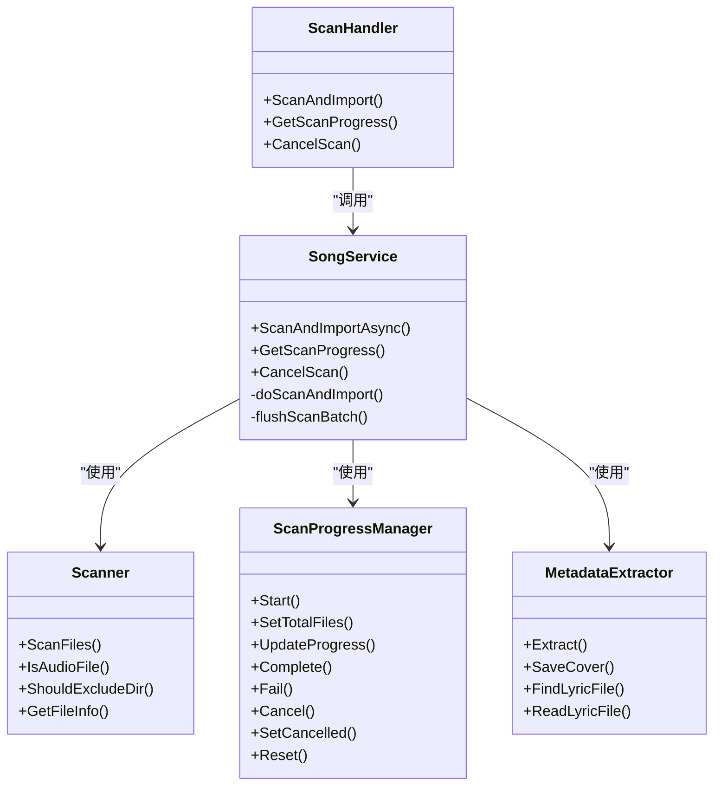

# 扫描管理 API

<cite>
**本文档引用的文件**
- [scan.go](file://internal/handlers/scan.go)
- [scanner.go](file://internal/services/scanner.go)
- [scan_progress.go](file://internal/services/scan_progress.go)
- [song_service.go](file://internal/services/song_service.go)
- [metadata.go](file://internal/services/metadata.go)
- [scan.ts](file://web/src/api/scan.ts)
- [api.ts](file://web/src/types/api.ts)
- [scan_test.go](file://internal/handlers/scan_test.go)
- [scanner_test.go](file://internal/services/scanner_test.go)
- [swagger.json](file://docs/swagger.json)
</cite>

## 目录
1. [简介](#简介)
2. [项目结构](#项目结构)
3. [核心组件](#核心组件)
4. [架构概览](#架构概览)
5. [详细组件分析](#详细组件分析)
6. [依赖关系分析](#依赖关系分析)
7. [性能考虑](#性能考虑)
8. [故障排查指南](#故障排查指南)
9. [结论](#结论)

## 简介
本文件为 MiMusic 音乐扫描管理 API 的详细接口文档，覆盖以下能力：
- 启动扫描任务（异步）、停止扫描、重新导入音乐
- 实时查询扫描进度（状态、处理进度、错误信息、统计信息）
- 扫描配置（扫描路径、文件过滤规则、元数据提取选项）
- 扫描统计（扫描历史、成功率、处理时间等指标）
- 扫描状态枚举、进度模型、错误处理与性能优化
- 大音乐库处理、增量扫描、并发控制与故障恢复最佳实践

## 项目结构
扫描管理 API 由后端 Go 服务与前端 Web 前端组成，核心模块如下：
- 后端处理器：负责接收请求、调用服务层
- 服务层：封装扫描逻辑、进度管理、元数据提取
- 扫描器：遍历目录、过滤文件、识别音频格式
- 进度管理器：维护扫描状态与统计数据
- 前端 API：提供扫描接口调用方法

图表来源
- [scan.go:1-94](file://internal/handlers/scan.go#L1-L94)
- [song_service.go:1-552](file://internal/services/song_service.go#L1-L552)
- [scanner.go:1-177](file://internal/services/scanner.go#L1-L177)
- [scan_progress.go:1-209](file://internal/services/scan_progress.go#L1-L209)
- [metadata.go:1-416](file://internal/services/metadata.go#L1-L416)
- [scan.ts:1-18](file://web/src/api/scan.ts#L1-L18)
- [api.ts:357-382](file://web/src/types/api.ts#L357-L382)

章节来源
- [scan.go:1-94](file://internal/handlers/scan.go#L1-L94)
- [song_service.go:1-552](file://internal/services/song_service.go#L1-L552)
- [scanner.go:1-177](file://internal/services/scanner.go#L1-L177)
- [scan_progress.go:1-209](file://internal/services/scan_progress.go#L1-L209)
- [metadata.go:1-416](file://internal/services/metadata.go#L1-L416)
- [scan.ts:1-18](file://web/src/api/scan.ts#L1-L18)
- [api.ts:357-382](file://web/src/types/api.ts#L357-L382)

## 核心组件
- 扫描处理器（ScanHandler）：提供启动扫描、查询进度、取消扫描的 HTTP 接口
- 歌曲服务（SongService）：协调扫描与导入流程，管理进度与并发
- 扫描器（Scanner）：遍历目录、过滤目录与文件、识别音频格式
- 进度管理器（ScanProgressManager）：维护扫描状态、统计信息与取消信号
- 元数据提取器（MetadataExtractor）：使用 tag 库与 ffprobe 提取音频元数据与技术参数

章节来源
- [scan.go:10-94](file://internal/handlers/scan.go#L10-L94)
- [song_service.go:16-32](file://internal/services/song_service.go#L16-L32)
- [scanner.go:11-28](file://internal/services/scanner.go#L11-L28)
- [scan_progress.go:8-49](file://internal/services/scan_progress.go#L8-L49)
- [metadata.go:19-45](file://internal/services/metadata.go#L19-L45)

## 架构概览
扫描管理采用“异步启动 + 进度查询”的设计，前端发起扫描请求后立即返回，随后通过轮询进度接口获取实时状态。

图表来源
- [scan.go:39-93](file://internal/handlers/scan.go#L39-L93)
- [song_service.go:181-376](file://internal/services/song_service.go#L181-L376)
- [scanner.go:30-48](file://internal/services/scanner.go#L30-L48)
- [scan_progress.go:74-193](file://internal/services/scan_progress.go#L74-L193)
- [metadata.go:76-184](file://internal/services/metadata.go#L76-L184)

## 详细组件分析

### 扫描接口定义
- 启动扫描（异步）
  - 方法：POST /scan
  - 请求体：可选 reimport（布尔，是否重新导入）
  - 响应：200 成功，消息“扫描任务已启动”
  - 错误：409 扫描已在进行中；500 启动失败
- 查询进度
  - 方法：GET /scan/progress
  - 响应：200 ScanProgress（见下节“进度模型”）
- 取消扫描
  - 方法：POST /scan/cancel
  - 响应：200 取消成功
  - 错误：400 无进行中的扫描任务

章节来源
- [scan.go:27-93](file://internal/handlers/scan.go#L27-L93)
- [swagger.json:1676-1722](file://docs/swagger.json#L1676-L1722)

### 进度模型
- 状态（status）：idle、scanning、importing、completed、failed、cancelling、cancelled
- 统计字段：
  - total_files：总文件数
  - scanned_files：已扫描文件数
  - imported_files：已导入文件数
  - skipped_files：跳过的文件数（已存在）
  - failed_files：失败的文件数
- 当前处理：
  - current_file：当前处理的文件路径
  - start_time/end_time：开始/结束时间
  - error：错误信息

章节来源
- [scan_progress.go:30-42](file://internal/services/scan_progress.go#L30-L42)
- [api.ts:370-382](file://web/src/types/api.ts#L370-L382)

### 扫描配置
- 扫描路径：MusicPath（字符串）
- 排除目录：ExcludeDirs（字符串数组）
- 支持格式：SupportedFormats（字符串数组）
- 元数据提取配置：
  - FFProbePath：ffprobe 可执行文件路径
  - CoverStoragePath：封面存储根目录

章节来源
- [scanner.go:11-16](file://internal/services/scanner.go#L11-L16)
- [metadata.go:19-23](file://internal/services/metadata.go#L19-L23)

### 扫描流程与并发控制
- 异步启动：ScanAndImportAsync 返回后立即在后台 goroutine 执行
- 预过滤：根据现有本地歌曲路径快速跳过已存在文件
- 并发元数据提取：固定 worker 数量（默认 4）并行提取
- 批量导入：固定批次大小（默认 50）通过事务批量写入数据库
- 取消机制：通过取消通道传播取消信号，确保及时终止

图表来源
- [song_service.go:215-376](file://internal/services/song_service.go#L215-L376)

章节来源
- [song_service.go:181-485](file://internal/services/song_service.go#L181-L485)

### 错误处理与状态枚举
- 状态枚举：idle、scanning、importing、completed、failed、cancelling、cancelled
- 错误来源：
  - 目录不存在或不可访问
  - 元数据提取失败（回退为文件名+默认格式）
  - 数据库事务失败
  - 取消扫描
- 前端错误提示：根据状态与错误信息展示

章节来源
- [scan_progress.go:8-19](file://internal/services/scan_progress.go#L8-L19)
- [song_service.go:220-228](file://internal/services/song_service.go#L220-L228)
- [metadata.go:76-184](file://internal/services/metadata.go#L76-L184)

### 前端集成
- Web 前端提供三个 API 方法：
  - scanAndImport(data)：POST /scan
  - getScanProgress()：GET /scan/progress
  - cancelScan()：POST /scan/cancel
- 类型定义：ScanRequest、ScanProgressInfo

章节来源
- [scan.ts:4-17](file://web/src/api/scan.ts#L4-L17)
- [api.ts:390-395](file://web/src/types/api.ts#L390-L395)
- [api.ts:370-382](file://web/src/types/api.ts#L370-L382)

## 依赖关系分析
- 扫描处理器依赖歌曲服务
- 歌曲服务依赖扫描器、进度管理器、元数据提取器
- 扫描器依赖系统文件系统 API
- 元数据提取器依赖 tag 库与 ffprobe

图表来源
- [scan.go:10-20](file://internal/handlers/scan.go#L10-L20)
- [song_service.go:16-32](file://internal/services/song_service.go#L16-L32)
- [scanner.go:18-28](file://internal/services/scanner.go#L18-L28)
- [scan_progress.go:44-49](file://internal/services/scan_progress.go#L44-L49)
- [metadata.go:25-28](file://internal/services/metadata.go#L25-L28)

章节来源
- [scan.go:1-94](file://internal/handlers/scan.go#L1-L94)
- [song_service.go:1-552](file://internal/services/song_service.go#L1-L552)
- [scanner.go:1-177](file://internal/services/scanner.go#L1-L177)
- [scan_progress.go:1-209](file://internal/services/scan_progress.go#L1-L209)
- [metadata.go:1-416](file://internal/services/metadata.go#L1-L416)

## 性能考虑
- 大音乐库处理
  - 预过滤：通过现有本地歌曲路径快速跳过已存在文件，减少后续处理
  - 并发提取：固定 worker 数量（默认 4）并行提取元数据
  - 批量写入：固定批次大小（默认 50）通过事务批量提交，降低磁盘 IO 与锁竞争
- 增量扫描
  - 通过预过滤实现增量效果（默认跳过已存在文件）
  - 重新导入模式（reimport=true）可覆盖更新已有歌曲元数据
- 并发控制
  - 使用 channel 与 WaitGroup 控制 worker 生命周期
  - 取消通道确保在扫描中途可中断
- 故障恢复
  - 元数据提取失败时回退为文件名+默认格式，保证导入继续
  - 事务失败时记录失败文件并继续处理队列

章节来源
- [song_service.go:215-485](file://internal/services/song_service.go#L215-L485)

## 故障排查指南
- 启动扫描返回 409
  - 原因：扫描已在进行中
  - 处理：等待当前扫描完成或调用取消接口
- 启动扫描返回 500
  - 原因：启动失败（如路径不存在）
  - 处理：检查 MusicPath 配置与权限
- 查询进度显示 failed
  - 原因：扫描过程中出现错误
  - 处理：查看 error 字段定位具体文件与原因
- 取消扫描无效
  - 原因：无进行中的扫描任务
  - 处理：确认扫描状态为 scanning/importing
- 前端轮询建议
  - 建议每 500ms 轮询一次进度接口，完成后停止轮询

章节来源
- [scan.go:39-93](file://internal/handlers/scan.go#L39-L93)
- [scan_progress.go:136-154](file://internal/services/scan_progress.go#L136-L154)
- [scan_test.go:39-106](file://internal/handlers/scan_test.go#L39-L106)

## 结论
MiMusic 的扫描管理 API 以异步启动、实时进度查询为核心，结合预过滤、并发提取与批量导入等优化策略，能够高效处理大规模音乐库。通过清晰的状态模型与错误处理机制，配合前端轮询与取消控制，为用户提供了稳定可靠的扫描体验。建议在生产环境中合理配置扫描路径与并发参数，并在大库扫描时启用重新导入模式以确保元数据一致性。