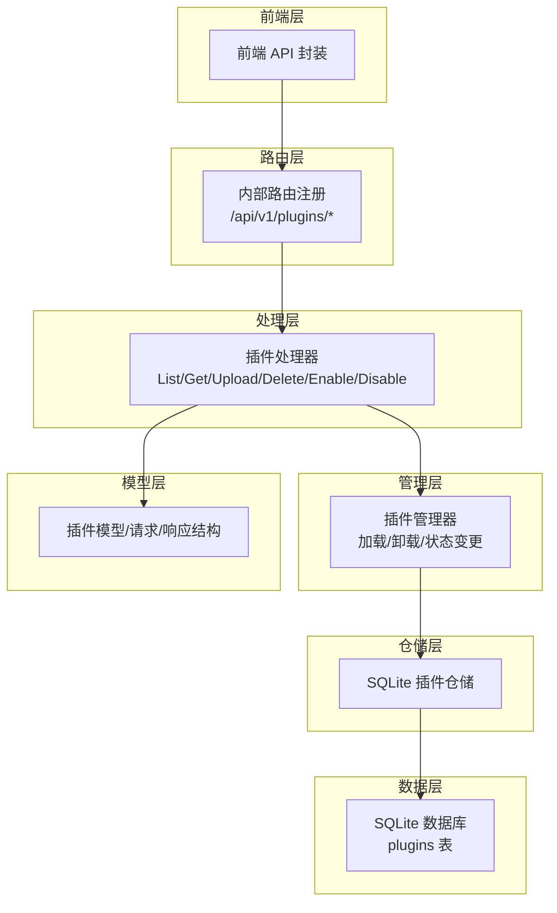
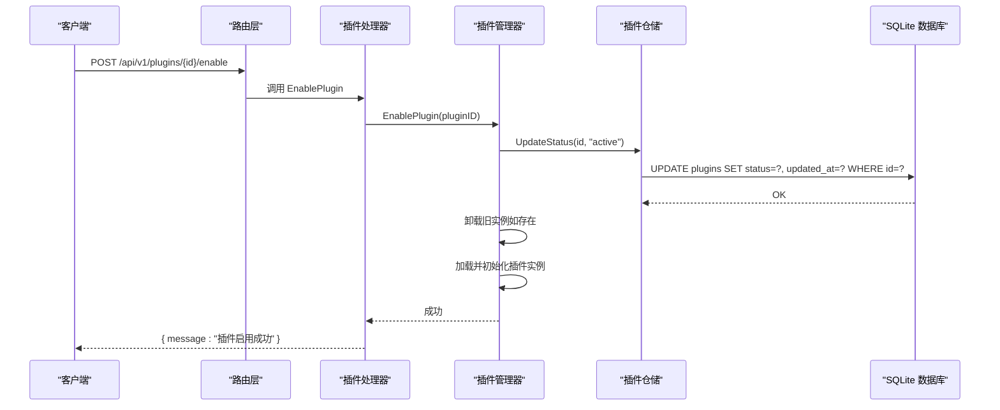
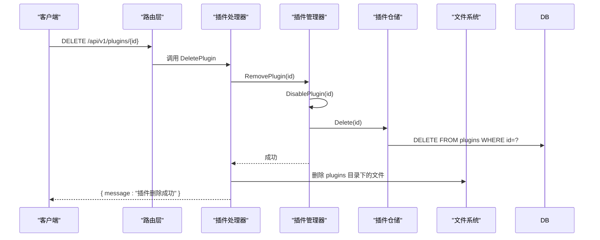
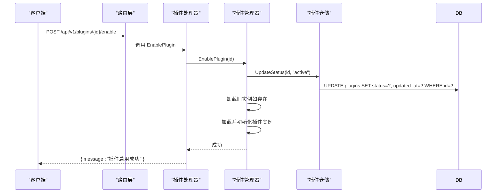
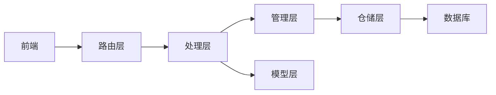

# 插件 CRUD 操作

<cite>
**本文引用的文件**
- [internal/handlers/plugin.go](file://internal/handlers/plugin.go)
- [internal/plugins/manager.go](file://internal/plugins/manager.go)
- [internal/plugins/repository.go](file://internal/plugins/repository.go)
- [internal/plugins/plugin.go](file://internal/plugins/plugin.go)
- [internal/database/sqlite_plugin.go](file://internal/database/sqlite_plugin.go)
- [internal/database/schema.go](file://internal/database/schema.go)
- [internal/models/models.go](file://internal/models/models.go)
- [internal/app/routers.go](file://internal/app/routers.go)
- [web/src/api/plugins.ts](file://web/src/api/plugins.ts)
</cite>

## 目录
1. [简介](#简介)
2. [项目结构](#项目结构)
3. [核心组件](#核心组件)
4. [架构总览](#架构总览)
5. [详细组件分析](#详细组件分析)
6. [依赖关系分析](#依赖关系分析)
7. [性能考量](#性能考量)
8. [故障排查指南](#故障排查指南)
9. [结论](#结论)
10. [附录](#附录)

## 简介
本文件面向 MiMusic 插件系统的 CRUD 操作，提供完整的 API 文档与实现细节说明。重点覆盖：
- 插件列表查询接口：支持获取所有插件信息、分页查询与过滤条件
- 插件详情查询接口：支持通过 ID 获取特定插件的完整信息
- 插件删除接口：包含插件卸载、实例清理和文件删除的完整流程
- 插件状态管理接口：支持启用和禁用插件操作
- 插件模型定义、字段说明、数据验证规则与错误处理机制
- 请求示例、响应格式与状态码说明

## 项目结构
MiMusic 插件系统采用分层架构：
- 路由层：在应用路由中注册插件相关 API
- 处理层：HTTP 处理器负责参数解析、鉴权与响应封装
- 管理层：插件管理器负责插件生命周期、实例化与状态变更
- 仓储层：SQLite 仓储实现对插件数据的持久化
- 数据层：SQLite 数据库提供表结构与索引
- 模型层：定义插件模型、请求/响应结构与验证规则
- 前端层：提供插件管理界面与 API 调用封装

图表来源
- [internal/app/routers.go:98-104](file://internal/app/routers.go#L98-L104)
- [internal/handlers/plugin.go:35-606](file://internal/handlers/plugin.go#L35-L606)
- [internal/plugins/manager.go:34-574](file://internal/plugins/manager.go#L34-L574)
- [internal/plugins/repository.go:10-129](file://internal/plugins/repository.go#L10-L129)
- [internal/database/sqlite_plugin.go:13-188](file://internal/database/sqlite_plugin.go#L13-L188)
- [internal/models/models.go:218-344](file://internal/models/models.go#L218-L344)
- [web/src/api/plugins.ts:10-53](file://web/src/api/plugins.ts#L10-L53)

章节来源
- [internal/app/routers.go:98-104](file://internal/app/routers.go#L98-L104)
- [internal/handlers/plugin.go:35-606](file://internal/handlers/plugin.go#L35-L606)

## 核心组件
- 插件处理器（PluginHandler）：封装 HTTP 接口，负责参数解析、鉴权、调用管理器与响应封装
- 插件管理器（Manager）：负责插件生命周期管理（加载/卸载）、状态变更、实例健康检查与资源清理
- 插件仓储（SQLitePluginRepository）：实现插件的增删改查与状态更新
- 数据库（SQLiteDB）：提供 plugins 表的 SQL 操作
- 模型（Plugin、PluginInfo、PluginUploadResponse 等）：定义数据结构与验证规则
- 前端 API 封装：提供插件管理的前端调用方法

章节来源
- [internal/handlers/plugin.go:21-33](file://internal/handlers/plugin.go#L21-L33)
- [internal/plugins/manager.go:34-44](file://internal/plugins/manager.go#L34-L44)
- [internal/plugins/repository.go:10-18](file://internal/plugins/repository.go#L10-L18)
- [internal/database/sqlite_plugin.go:13-188](file://internal/database/sqlite_plugin.go#L13-L188)
- [internal/models/models.go:218-344](file://internal/models/models.go#L218-L344)
- [web/src/api/plugins.ts:10-53](file://web/src/api/plugins.ts#L10-L53)

## 架构总览
以下序列图展示“启用插件”的完整流程，其他操作（禁用、删除、上传、列表、详情）遵循类似模式。

图表来源
- [internal/app/routers.go:103-103](file://internal/app/routers.go#L103-L103)
- [internal/handlers/plugin.go:540-572](file://internal/handlers/plugin.go#L540-L572)
- [internal/plugins/manager.go:488-511](file://internal/plugins/manager.go#L488-L511)
- [internal/plugins/repository.go:124-128](file://internal/plugins/repository.go#L124-L128)
- [internal/database/sqlite_plugin.go:166-187](file://internal/database/sqlite_plugin.go#L166-L187)

## 详细组件分析

### 插件列表查询接口
- 方法与路径
  - GET /api/v1/plugins
- 功能
  - 获取所有插件信息，按创建时间倒序排列
- 参数
  - 支持分页查询（前端封装了 limit/offset 参数）
- 响应
  - 返回包含 plugins 数组的对象
- 错误
  - 401 未授权
  - 500 服务器错误

请求示例（前端封装）
- GET /api/v1/plugins?limit=20&offset=0

响应示例
- {
  "plugins": [
    {
      "id": 1,
      "name": "示例插件",
      "version": "1.0.0",
      "description": "插件描述",
      "author": "作者",
      "homepage": "https://example.com",
      "entry_path": "/example",
      "file_path": "example.wasm",
      "status": "inactive",
      "created_at": "2024-01-01T12:00:00Z",
      "updated_at": "2024-01-01T12:00:00Z"
    }
  ]
}

章节来源
- [internal/handlers/plugin.go:35-57](file://internal/handlers/plugin.go#L35-L57)
- [web/src/api/plugins.ts:10-16](file://web/src/api/plugins.ts#L10-L16)
- [internal/database/sqlite_plugin.go:132-164](file://internal/database/sqlite_plugin.go#L132-L164)

### 插件详情查询接口
- 方法与路径
  - GET /api/v1/plugins/{id}
- 功能
  - 通过插件 ID 获取插件的完整信息
- 参数
  - id：插件 ID（整数）
- 响应
  - 返回包含 plugin 对象的对象
- 错误
  - 400 无效的插件 ID
  - 404 插件不存在
  - 401 未授权
  - 500 服务器错误

请求示例（前端封装）
- GET /api/v1/plugins/1

响应示例
- {
  "plugin": {
    "id": 1,
    "name": "示例插件",
    "version": "1.0.0",
    "description": "插件描述",
    "author": "作者",
    "homepage": "https://example.com",
    "entry_path": "/example",
    "file_path": "example.wasm",
    "status": "inactive",
    "created_at": "2024-01-01T12:00:00Z",
    "updated_at": "2024-01-01T12:00:00Z"
  }
}

章节来源
- [internal/handlers/plugin.go:59-90](file://internal/handlers/plugin.go#L59-L90)
- [web/src/api/plugins.ts:18-21](file://web/src/api/plugins.ts#L18-L21)

### 插件上传接口（支持 .wasm 单文件与 .zip 批量导入）
- 方法与路径
  - POST /api/v1/plugins
- 功能
  - 支持上传 .wasm 单文件或 .zip 压缩包批量导入
- 参数
  - file：multipart/form-data，文件类型必须为 .wasm 或 .zip
- 响应
  - 返回 PluginUploadResponse，包含 total、success、failed、results、message
- 错误
  - 400 请求数据错误（解析表单失败、文件类型不支持、zip 中无 .wasm）
  - 401 未授权
  - 500 服务器错误

请求示例（前端封装）
- POST /api/v1/plugins
- Content-Type: multipart/form-data
- Body: file=<选择 .wasm 或 .zip>

响应示例
- {
  "total": 3,
  "success": 2,
  "failed": 1,
  "results": [
    {
      "file_name": "plugin1.wasm",
      "plugin": {
        "id": 1,
        "name": "插件1",
        "version": "1.0.0",
        "description": "描述",
        "author": "作者",
        "homepage": "https://example.com",
        "entry_path": "/example",
        "file_path": "plugin1.wasm",
        "status": "inactive"
      },
      "error": null,
      "success": true
    }
  ],
  "message": "上传完成，成功2个，失败1个"
}

章节来源
- [internal/handlers/plugin.go:92-134](file://internal/handlers/plugin.go#L92-L134)
- [internal/handlers/plugin.go:219-289](file://internal/handlers/plugin.go#L219-L289)
- [internal/handlers/plugin.go:358-381](file://internal/handlers/plugin.go#L358-L381)
- [internal/handlers/plugin.go:383-480](file://internal/handlers/plugin.go#L383-L480)
- [web/src/api/plugins.ts:23-33](file://web/src/api/plugins.ts#L23-L33)

### 插件删除接口
- 方法与路径
  - DELETE /api/v1/plugins/{id}
- 功能
  - 删除指定插件：先禁用并卸载插件实例，再从数据库删除记录，最后删除插件文件
- 参数
  - id：插件 ID（整数）
- 响应
  - 返回 SuccessResponse
- 错误
  - 400 无效的插件 ID
  - 404 插件不存在
  - 401 未授权
  - 500 服务器错误

删除流程（序列图）

图表来源
- [internal/handlers/plugin.go:492-538](file://internal/handlers/plugin.go#L492-L538)
- [internal/plugins/manager.go:526-539](file://internal/plugins/manager.go#L526-L539)
- [internal/plugins/repository.go:118-122](file://internal/plugins/repository.go#L118-L122)
- [internal/database/sqlite_plugin.go:112-130](file://internal/database/sqlite_plugin.go#L112-L130)

章节来源
- [internal/handlers/plugin.go:492-538](file://internal/handlers/plugin.go#L492-L538)
- [internal/plugins/manager.go:526-539](file://internal/plugins/manager.go#L526-L539)
- [internal/plugins/repository.go:118-122](file://internal/plugins/repository.go#L118-L122)
- [internal/database/sqlite_plugin.go:112-130](file://internal/database/sqlite_plugin.go#L112-L130)

### 插件状态管理接口
- 启用插件
  - 方法与路径：POST /api/v1/plugins/{id}/enable
  - 功能：启用指定插件，若已加载则先卸载旧实例，再重新加载并初始化
  - 响应：SuccessResponse
  - 错误：400/401/404/500
- 禁用插件
  - 方法与路径：POST /api/v1/plugins/{id}/disable
  - 功能：禁用指定插件，更新状态并卸载实例
  - 响应：SuccessResponse
  - 错误：400/401/404/500

启用流程（序列图）

图表来源
- [internal/handlers/plugin.go:540-572](file://internal/handlers/plugin.go#L540-L572)
- [internal/plugins/manager.go:488-511](file://internal/plugins/manager.go#L488-L511)
- [internal/plugins/repository.go:124-128](file://internal/plugins/repository.go#L124-L128)
- [internal/database/sqlite_plugin.go:166-187](file://internal/database/sqlite_plugin.go#L166-L187)

章节来源
- [internal/handlers/plugin.go:540-606](file://internal/handlers/plugin.go#L540-L606)
- [internal/plugins/manager.go:488-524](file://internal/plugins/manager.go#L488-L524)

### 插件模型定义与数据验证
- 插件模型（Plugin）
  - 字段：id、name、version、description、author、homepage、entry_path、file_path、status、created_at、updated_at
  - 状态：active、inactive、error
  - 验证：Validate() 校验 file_path 与 status
- 插件信息（PluginInfo）
  - 用于响应的简化结构，包含 id、name、version、description、author、homepage、entry_path、file_path、status
- 插件上传响应（PluginUploadResponse）
  - 字段：total、success、failed、results、message
- 插件上传结果（PluginUploadResult）
  - 字段：file_name、plugin、error、success

数据验证规则
- 插件状态必须为 active、inactive 或 error
- 插件上传时要求 file_path 存在（仓储层 Create 逻辑）

章节来源
- [internal/models/models.go:218-242](file://internal/models/models.go#L218-L242)
- [internal/models/models.go:324-344](file://internal/models/models.go#L324-L344)
- [internal/models/models.go:316-322](file://internal/models/models.go#L316-L322)
- [internal/plugins/repository.go:74-98](file://internal/plugins/repository.go#L74-L98)

### 数据库表结构与索引
- plugins 表
  - 字段：id、name、version、description、author、homepage、entry_path、file_path、status、created_at、updated_at
  - 约束：status 必须在 ('active','inactive','error')，file_path 非空
  - 索引：idx_plugins_status
- 触发器：update_plugins_updated_at 自动更新 updated_at

章节来源
- [internal/database/schema.go:74-87](file://internal/database/schema.go#L74-L87)
- [internal/database/schema.go:127-132](file://internal/database/schema.go#L127-L132)

## 依赖关系分析
- 路由层依赖处理层：在 /api/v1 路由组中注册插件相关路由
- 处理层依赖管理器：处理 HTTP 请求并调用管理器执行业务逻辑
- 管理器依赖仓储：进行插件状态与数据的持久化
- 仓储依赖数据库：执行 SQL 操作
- 模型层为各层提供数据结构与验证
- 前端 API 封装依赖后端路由

图表来源
- [internal/app/routers.go:98-104](file://internal/app/routers.go#L98-L104)
- [internal/handlers/plugin.go:35-606](file://internal/handlers/plugin.go#L35-L606)
- [internal/plugins/manager.go:34-574](file://internal/plugins/manager.go#L34-L574)
- [internal/plugins/repository.go:10-129](file://internal/plugins/repository.go#L10-L129)
- [internal/database/sqlite_plugin.go:13-188](file://internal/database/sqlite_plugin.go#L13-L188)
- [internal/models/models.go:218-344](file://internal/models/models.go#L218-L344)
- [web/src/api/plugins.ts:10-53](file://web/src/api/plugins.ts#L10-L53)

章节来源
- [internal/app/routers.go:98-104](file://internal/app/routers.go#L98-L104)
- [internal/handlers/plugin.go:35-606](file://internal/handlers/plugin.go#L35-L606)
- [internal/plugins/manager.go:34-574](file://internal/plugins/manager.go#L34-L574)
- [internal/plugins/repository.go:10-129](file://internal/plugins/repository.go#L10-L129)
- [internal/database/sqlite_plugin.go:13-188](file://internal/database/sqlite_plugin.go#L13-L188)
- [internal/models/models.go:218-344](file://internal/models/models.go#L218-L344)
- [web/src/api/plugins.ts:10-53](file://web/src/api/plugins.ts#L10-L53)

## 性能考量
- 插件加载与初始化超时控制：初始化、回调、反初始化、关闭均设置超时，避免阻塞
- WASM 实例并发保护：使用互斥锁保护实例访问，确保线程安全
- 实例健康检查：启用/禁用时检查实例健康状态，避免对不健康实例执行敏感操作
- 资源清理：卸载插件时清理路由、JS 环境、定时器与实例，防止资源泄漏
- 前端分页：前端提供 limit/offset 参数，后端按 created_at 倒序查询，利于大数据集分页

章节来源
- [internal/plugins/manager.go:26-32](file://internal/plugins/manager.go#L26-L32)
- [internal/plugins/manager.go:63-71](file://internal/plugins/manager.go#L63-L71)
- [internal/plugins/manager.go:86-135](file://internal/plugins/manager.go#L86-L135)
- [internal/handlers/plugin.go:35-57](file://internal/handlers/plugin.go#L35-L57)
- [internal/database/sqlite_plugin.go:132-164](file://internal/database/sqlite_plugin.go#L132-L164)

## 故障排查指南
常见错误与处理建议
- 400 无效的插件 ID
  - 检查 URL 参数 id 是否为整数
- 401 未授权
  - 确认已登录并携带有效 Bearer Token
- 404 插件不存在
  - 确认插件 ID 是否正确；若已删除，需重新上传
- 500 服务器错误
  - 查看后端日志定位具体错误（如加载插件失败、初始化超时、文件写入失败等）
- 插件上传失败
  - 确认文件类型为 .wasm 或 .zip；检查 zip 中是否包含 .wasm 文件；查看 results 中的 error 字段
- 插件启用失败
  - 检查插件文件是否损坏；确认插件初始化是否超时；查看管理器日志

章节来源
- [internal/handlers/plugin.go:74-84](file://internal/handlers/plugin.go#L74-L84)
- [internal/handlers/plugin.go:107-126](file://internal/handlers/plugin.go#L107-L126)
- [internal/handlers/plugin.go:247-262](file://internal/handlers/plugin.go#L247-L262)
- [internal/handlers/plugin.go:430-437](file://internal/handlers/plugin.go#L430-L437)
- [internal/plugins/manager.go:438-447](file://internal/plugins/manager.go#L438-L447)

## 结论
MiMusic 插件系统提供了完善的 CRUD 操作能力，结合分层架构与严格的错误处理机制，能够稳定地管理插件的生命周期。通过启用/禁用接口与删除流程，系统实现了从文件到实例再到数据库的全链路清理，确保资源不泄漏。前端 API 封装与后端路由清晰分离，便于扩展与维护。

## 附录

### API 定义与状态码
- 列表查询
  - GET /api/v1/plugins
  - 200：成功
  - 401：未授权
  - 500：服务器错误
- 详情查询
  - GET /api/v1/plugins/{id}
  - 200：成功
  - 400：无效的插件 ID
  - 404：插件不存在
  - 401：未授权
  - 500：服务器错误
- 上传插件
  - POST /api/v1/plugins
  - 200：成功
  - 400：请求数据错误（解析失败、文件类型不支持、zip 无 .wasm）
  - 401：未授权
  - 500：服务器错误
- 删除插件
  - DELETE /api/v1/plugins/{id}
  - 200：成功
  - 400：无效的插件 ID
  - 404：插件不存在
  - 401：未授权
  - 500：服务器错误
- 启用插件
  - POST /api/v1/plugins/{id}/enable
  - 200：成功
  - 400：无效的插件 ID
  - 404：插件不存在
  - 401：未授权
  - 500：服务器错误
- 禁用插件
  - POST /api/v1/plugins/{id}/disable
  - 200：成功
  - 400：无效的插件 ID
  - 404：插件不存在
  - 401：未授权
  - 500：服务器错误

章节来源
- [internal/handlers/plugin.go:35-606](file://internal/handlers/plugin.go#L35-L606)
- [internal/app/routers.go:98-104](file://internal/app/routers.go#L98-L104)