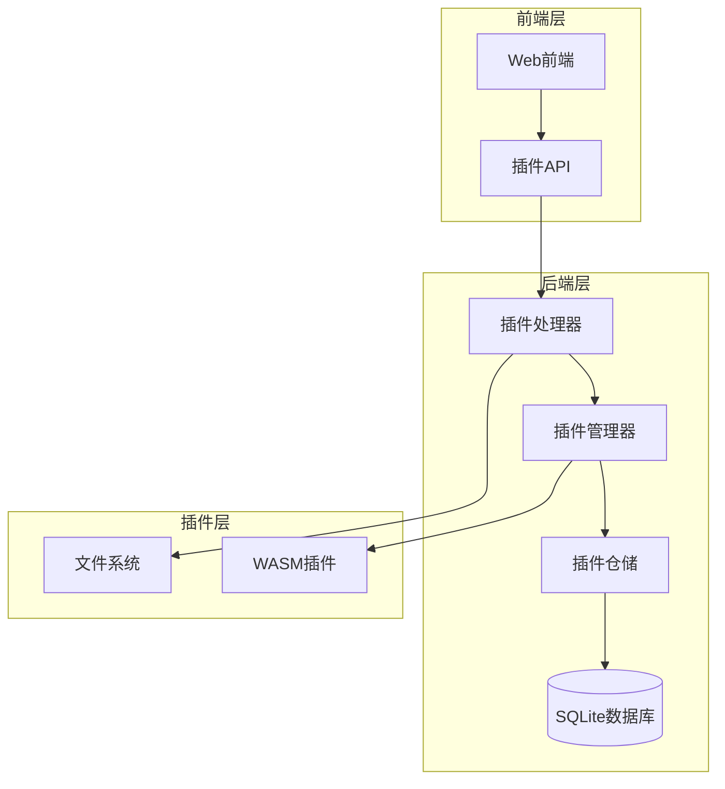
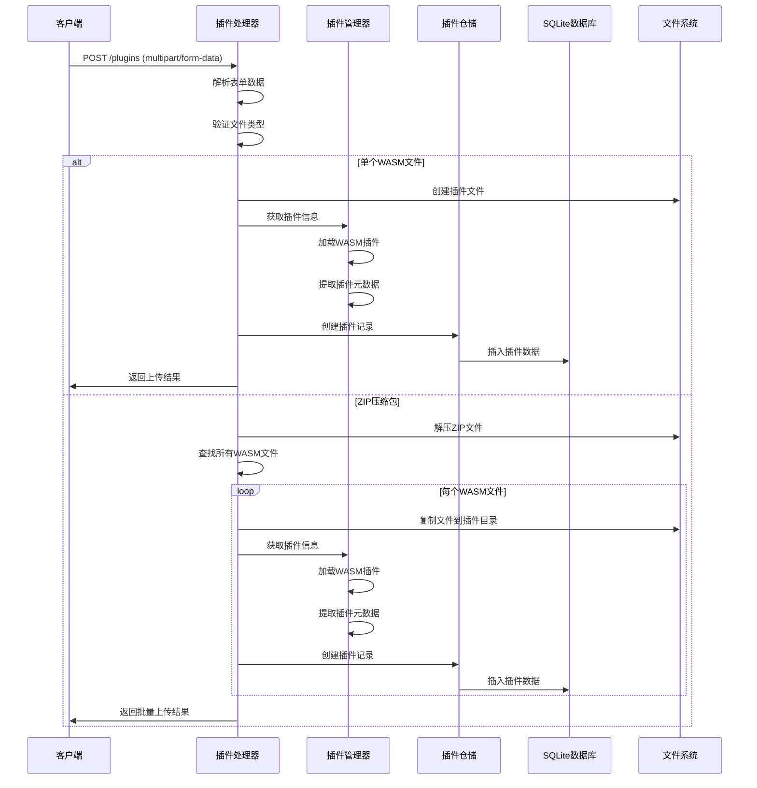
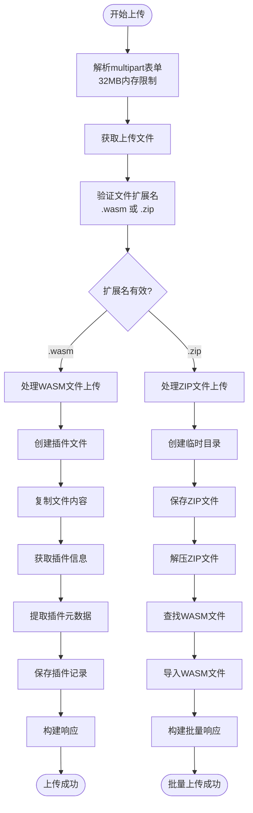
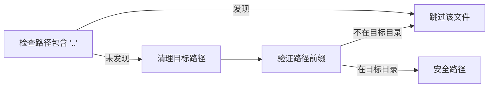
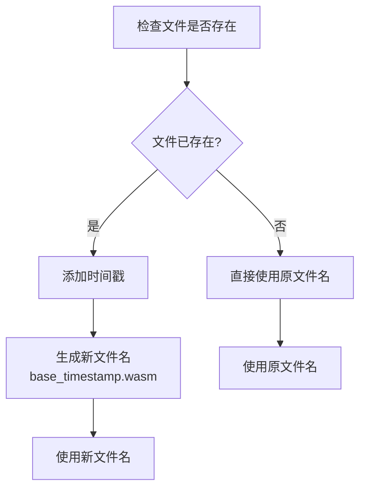
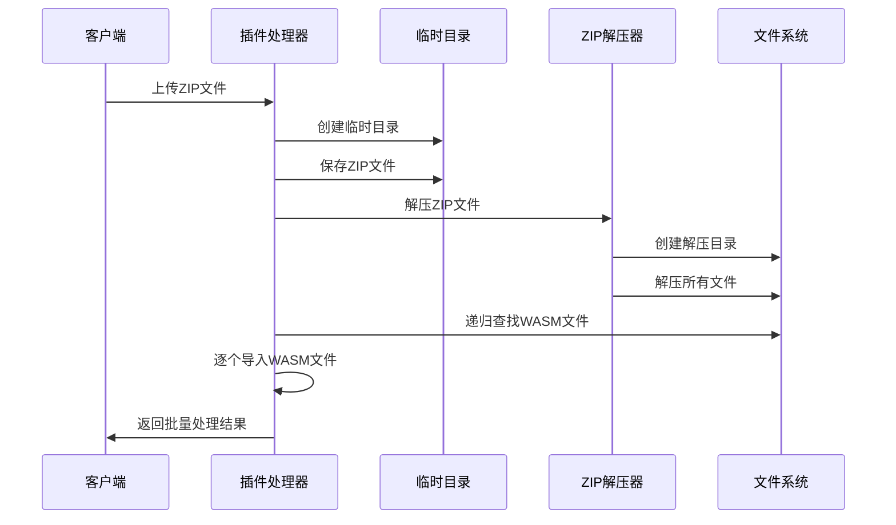
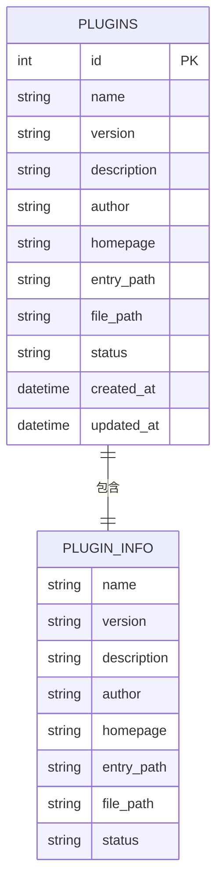
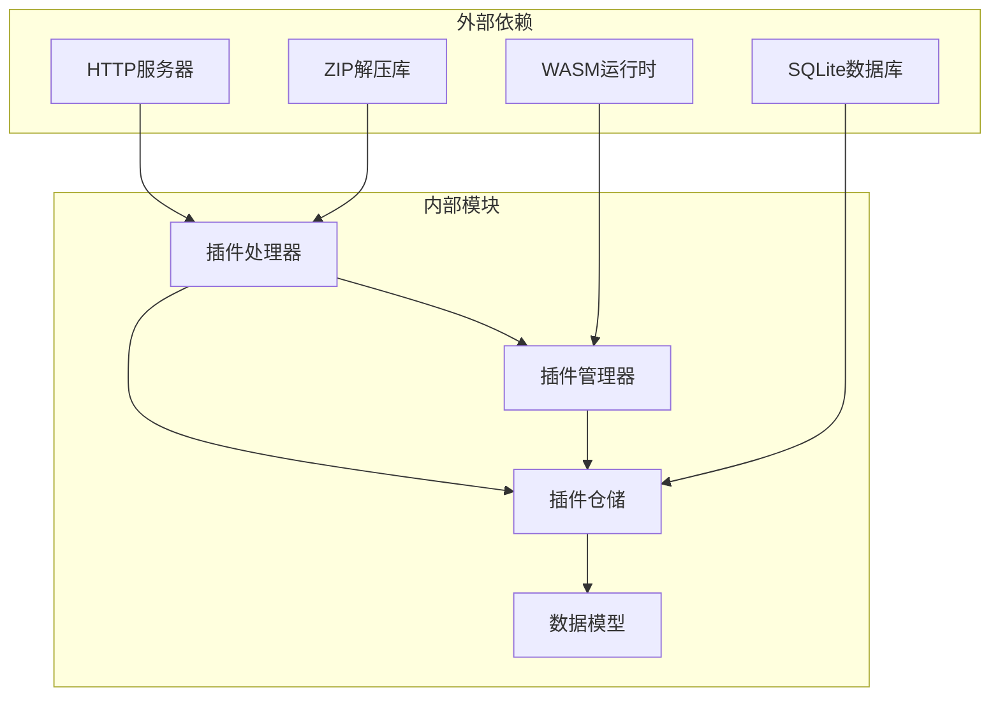

# 插件上传接口

<cite>
**本文档引用的文件**
- [plugin.go](file://internal/handlers/plugin.go)
- [manager.go](file://internal/plugins/manager.go)
- [repository.go](file://internal/plugins/repository.go)
- [sqlite_plugin.go](file://internal/database/sqlite_plugin.go)
- [models.go](file://internal/models/models.go)
- [plugin.go](file://internal/plugins/plugin.go)
- [plugins.ts](file://web/src/api/plugins.ts)
- [PluginManager.vue](file://web/src/views/Settings/components/PluginManager.vue)
</cite>

## 目录
1. [简介](#简介)
2. [项目结构](#项目结构)
3. [核心组件](#核心组件)
4. [架构概览](#架构概览)
5. [详细组件分析](#详细组件分析)
6. [依赖关系分析](#依赖关系分析)
7. [性能考虑](#性能考虑)
8. [故障排除指南](#故障排除指南)
9. [结论](#结论)

## 简介

MiMusic 插件上传接口提供了两种上传方式：
- **单个插件上传**：支持 `.wasm` 文件直接上传
- **批量插件上传**：支持 `.zip` 压缩包批量导入

该接口实现了完整的安全机制，包括文件验证、路径安全检查、重复文件处理和数据库记录创建，确保插件上传过程的安全性和可靠性。

## 项目结构

插件上传功能涉及以下关键模块：

**图表来源**
- [plugin.go:105-134](file://internal/handlers/plugin.go#L105-L134)
- [manager.go:137-156](file://internal/plugins/manager.go#L137-L156)
- [repository.go:10-18](file://internal/plugins/repository.go#L10-L18)

**章节来源**
- [plugin.go:1-607](file://internal/handlers/plugin.go#L1-L607)
- [manager.go:1-574](file://internal/plugins/manager.go#L1-L574)

## 核心组件

### 插件处理器 (PluginHandler)

负责处理 HTTP 请求和响应，实现文件上传逻辑的核心控制器。

**主要职责：**
- 解析 multipart 表单数据
- 验证文件类型和扩展名
- 处理单个 wasm 文件上传
- 处理 zip 文件批量上传
- 返回标准化的响应格式

### 插件管理器 (Manager)

负责插件的生命周期管理和业务逻辑处理。

**主要职责：**
- 从 wasm 文件中提取插件信息
- 管理插件实例的加载和卸载
- 处理插件状态变更
- 实现插件同步机制

### 插件仓储 (PluginRepository)

提供插件数据访问接口，实现与数据库的交互。

**主要职责：**
- CRUD 操作插件记录
- 查询插件信息
- 更新插件状态
- 管理插件实体

**章节来源**
- [plugin.go:21-33](file://internal/handlers/plugin.go#L21-L33)
- [manager.go:34-44](file://internal/plugins/manager.go#L34-L44)
- [repository.go:31-50](file://internal/plugins/repository.go#L31-L50)

## 架构概览

插件上传接口采用分层架构设计，确保关注点分离和代码的可维护性。

**图表来源**
- [plugin.go:105-134](file://internal/handlers/plugin.go#L105-L134)
- [plugin.go:219-289](file://internal/handlers/plugin.go#L219-L289)
- [manager.go:191-213](file://internal/plugins/manager.go#L191-L213)

## 详细组件分析

### 单个插件上传流程

单个插件上传接口支持 `.wasm` 文件的直接上传，包含完整的验证和处理流程。

**图表来源**
- [plugin.go:105-134](file://internal/handlers/plugin.go#L105-L134)
- [plugin.go:136-217](file://internal/handlers/plugin.go#L136-L217)
- [plugin.go:219-289](file://internal/handlers/plugin.go#L219-L289)

#### 文件验证机制

系统实现了多层次的文件验证机制：

1. **扩展名验证**：严格检查文件扩展名是否为 `.wasm` 或 `.zip`
2. **大小限制**：表单解析设置 32MB 内存限制
3. **类型检查**：确保上传的是有效的文件类型

#### 路径安全检查

为防止路径遍历攻击，系统实施了严格的路径验证：

**图表来源**
- [plugin.go:301-313](file://internal/handlers/plugin.go#L301-L313)

#### 重复文件处理

当检测到同名文件时，系统会自动添加时间戳以避免覆盖：

**图表来源**
- [plugin.go:389-395](file://internal/handlers/plugin.go#L389-L395)

### 批量插件上传流程

批量插件上传接口支持 `.zip` 压缩包的批量导入，提供完整的批处理能力。

#### ZIP 文件处理流程

**图表来源**
- [plugin.go:219-289](file://internal/handlers/plugin.go#L219-L289)
- [plugin.go:291-335](file://internal/handlers/plugin.go#L291-L335)

#### 多文件扫描机制

系统使用递归遍历的方式查找所有 `.wasm` 文件：

1. **深度优先遍历**：遍历 ZIP 解压后的整个目录树
2. **文件过滤**：仅匹配 `.wasm` 扩展名的文件
3. **错误处理**：忽略遍历过程中的异常情况

#### 批量处理结果统计

系统提供详细的批量处理统计信息：

- **总文件数**：ZIP 中包含的 `.wasm` 文件总数
- **成功数量**：成功导入的插件数量
- **失败数量**：导入失败的插件数量
- **详细结果**：每个文件的处理结果列表

### 数据库记录创建

插件上传完成后，系统会在数据库中创建相应的记录：

**图表来源**
- [sqlite_plugin.go:13-39](file://internal/database/sqlite_plugin.go#L13-L39)
- [models.go:218-231](file://internal/models/models.go#L218-L231)

**章节来源**
- [plugin.go:136-217](file://internal/handlers/plugin.go#L136-L217)
- [plugin.go:219-289](file://internal/handlers/plugin.go#L219-L289)
- [manager.go:191-213](file://internal/plugins/manager.go#L191-L213)

## 依赖关系分析

插件上传接口的依赖关系体现了清晰的分层架构：

**图表来源**
- [plugin.go:3-18](file://internal/handlers/plugin.go#L3-L18)
- [manager.go:3-24](file://internal/plugins/manager.go#L3-L24)

### 关键依赖关系

1. **Handler → Manager**：处理器依赖管理器进行插件信息提取
2. **Handler → Repo**：处理器依赖仓储进行数据库操作
3. **Manager → Repo**：管理器通过仓储访问数据库
4. **Repo → Models**：仓储操作数据模型实体

**章节来源**
- [plugin.go:1-20](file://internal/handlers/plugin.go#L1-L20)
- [manager.go:1-25](file://internal/plugins/manager.go#L1-L25)

## 性能考虑

### 内存管理

- **表单解析限制**：设置 32MB 内存限制，防止内存溢出
- **临时文件清理**：使用 defer 语句确保临时目录及时清理
- **流式处理**：使用 io.Copy 进行流式文件传输，减少内存占用

### 并发处理

- **异步处理**：每个插件导入都是独立的异步操作
- **资源隔离**：每个插件都有独立的文件路径和数据库记录
- **错误隔离**：单个插件失败不会影响其他插件的处理

### 缓存策略

- **插件信息缓存**：通过 WASM 运行时加载插件获取元数据
- **状态同步**：定期同步插件状态到数据库
- **实例管理**：使用 sync.Map 管理插件实例

## 故障排除指南

### 常见错误及解决方案

| 错误类型 | 错误码 | 可能原因 | 解决方案 |
|---------|--------|----------|----------|
| 文件类型错误 | 400 | 上传文件不是 .wasm 或 .zip | 确保上传正确的文件类型 |
| 文件过大 | 413 | 超过 32MB 限制 | 减小文件大小或优化插件 |
| 路径遍历攻击 | 400 | ZIP 包含恶意路径 | 检查 ZIP 文件安全性 |
| 插件加载失败 | 500 | WASM 插件损坏 | 重新编译或修复插件 |
| 数据库错误 | 500 | 数据库连接问题 | 检查数据库状态 |

### 调试建议

1. **启用详细日志**：检查服务器日志获取详细错误信息
2. **验证文件完整性**：确认上传的文件没有损坏
3. **检查权限设置**：确保插件目录具有写入权限
4. **监控资源使用**：观察内存和磁盘空间使用情况

**章节来源**
- [plugin.go:107-126](file://internal/handlers/plugin.go#L107-L126)
- [plugin.go:222-243](file://internal/handlers/plugin.go#L222-L243)

## 结论

MiMusic 插件上传接口提供了安全、可靠的插件管理功能。通过实现多层次的安全验证、完善的错误处理和优雅的用户体验，该接口能够满足各种插件上传需求。

### 主要优势

1. **安全性**：多重验证机制防止恶意文件上传
2. **可靠性**：完整的错误处理和恢复机制
3. **易用性**：简洁的 API 设计和清晰的错误信息
4. **可扩展性**：模块化的架构便于功能扩展

### 最佳实践建议

1. **文件准备**：确保插件文件符合规范要求
2. **批量上传**：合理组织 ZIP 文件结构
3. **监控告警**：建立上传过程的监控机制
4. **备份策略**：定期备份插件文件和数据库