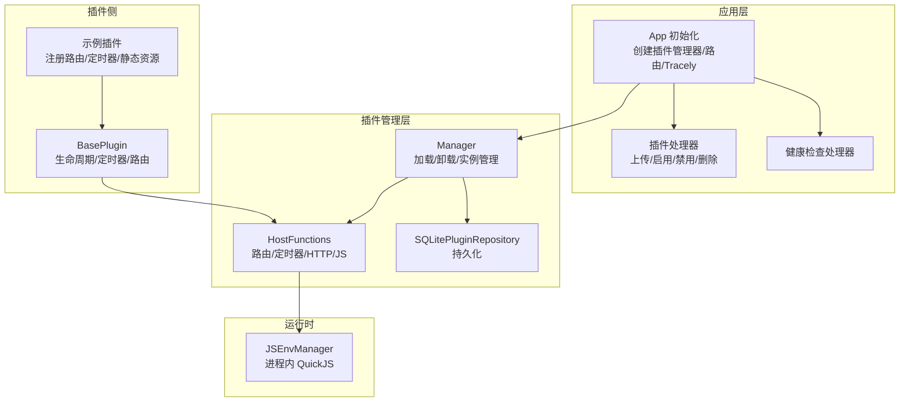
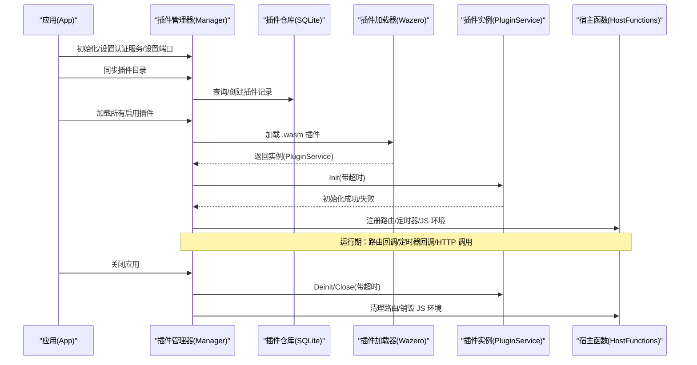
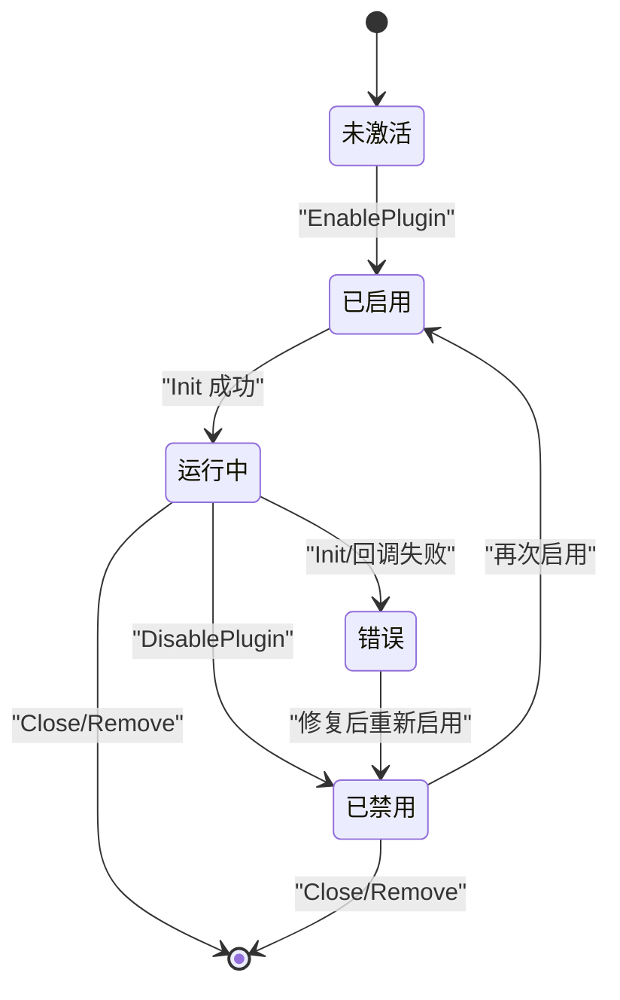
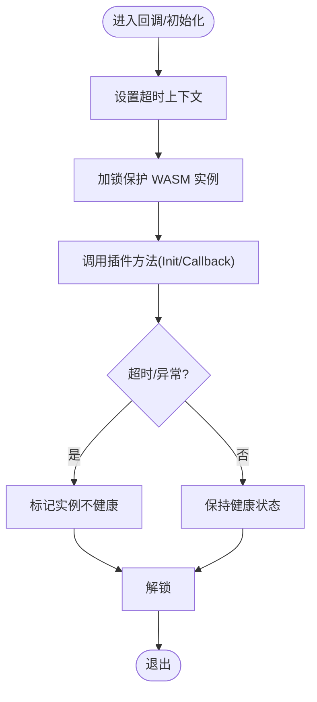
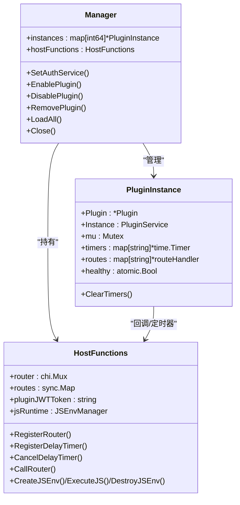
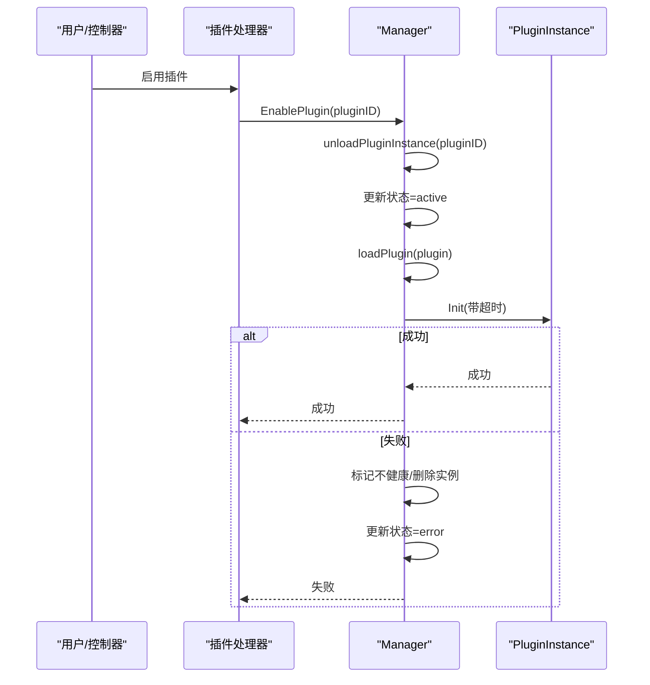
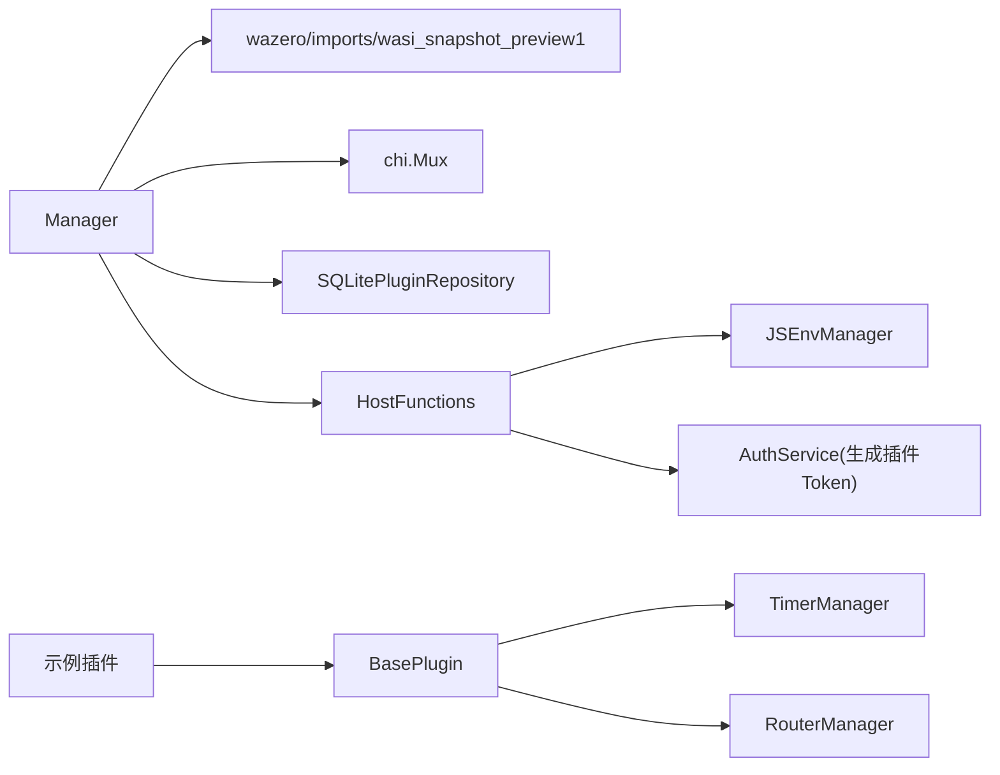

# 插件状态管理

<cite>
**本文引用的文件**
- [internal/plugins/manager.go](file://internal/plugins/manager.go)
- [internal/plugins/host.go](file://internal/plugins/host.go)
- [internal/plugins/plugin.go](file://internal/plugins/plugin.go)
- [internal/plugins/repository.go](file://internal/plugins/repository.go)
- [internal/handlers/plugin.go](file://internal/handlers/plugin.go)
- [internal/handlers/health.go](file://internal/handlers/health.go)
- [internal/app/app.go](file://internal/app/app.go)
- [internal/jsruntime/runtime.go](file://internal/jsruntime/runtime.go)
- [plugin/api/plugin/base.go](file://plugin/api/plugin/base.go)
- [plugins/mimusic-plugin-lxmusic/main.go](file://plugins/mimusic-plugin-lxmusic/main.go)
</cite>

## 目录
1. [简介](#简介)
2. [项目结构](#项目结构)
3. [核心组件](#核心组件)
4. [架构总览](#架构总览)
5. [详细组件分析](#详细组件分析)
6. [依赖关系分析](#依赖关系分析)
7. [性能考量](#性能考量)
8. [故障排查指南](#故障排查指南)
9. [结论](#结论)
10. [附录](#附录)

## 简介
本文件面向 MiMusic 插件系统，聚焦“插件状态管理”的技术文档，覆盖以下主题：
- 插件生命周期管理：加载、初始化、运行、暂停与销毁各阶段的状态转换与控制流
- 插件运行时状态监控：内存、CPU、错误日志与健康检查机制
- 插件实例管理：单实例限制、并发控制与资源隔离策略
- 插件错误处理与恢复：异常捕获、自动重启与降级策略
- 插件间通信协调、资源共享与性能优化最佳实践

## 项目结构
围绕插件状态管理的关键模块如下：
- 应用入口与初始化：负责创建插件管理器、同步插件目录、加载启用的插件
- 插件管理器：负责插件生命周期、实例管理、路由与定时器回调调度、JS 环境管理
- 主程序宿主函数：向插件暴露 API（路由注册、定时器、HTTP 调用、JS 环境）
- 插件基座框架：定义插件接口与生命周期钩子，桥接定时器与路由管理器
- 插件示例：展示如何注册路由、定时器与静态资源，体现生命周期与状态转换
- 健康检查与处理器：提供系统健康检查端点与插件管理 API

图表来源
- [internal/app/app.go:175-227](file://internal/app/app.go#L175-L227)
- [internal/plugins/manager.go:137-156](file://internal/plugins/manager.go#L137-L156)
- [internal/plugins/host.go:23-30](file://internal/plugins/host.go#L23-L30)
- [plugin/api/plugin/base.go:35-61](file://plugin/api/plugin/base.go#L35-L61)
- [plugins/mimusic-plugin-lxmusic/main.go:42-139](file://plugins/mimusic-plugin-lxmusic/main.go#L42-L139)
- [internal/jsruntime/runtime.go:54-69](file://internal/jsruntime/runtime.go#L54-L69)

章节来源
- [internal/app/app.go:175-227](file://internal/app/app.go#L175-L227)
- [internal/plugins/manager.go:137-156](file://internal/plugins/manager.go#L137-L156)
- [internal/plugins/host.go:23-30](file://internal/plugins/host.go#L23-L30)
- [plugin/api/plugin/base.go:35-61](file://plugin/api/plugin/base.go#L35-L61)
- [plugins/mimusic-plugin-lxmusic/main.go:42-139](file://plugins/mimusic-plugin-lxmusic/main.go#L42-L139)
- [internal/jsruntime/runtime.go:54-69](file://internal/jsruntime/runtime.go#L54-L69)

## 核心组件
- 插件管理器（Manager）：负责插件加载、实例管理、路由与定时器注册、Deinit/Close 清理、健康状态标记
- 主程序宿主函数（HostFunctions）：向插件暴露路由注册、HTTP 调用、定时器、JS 环境等能力；负责路由鉴权与回调调度
- 插件基座框架（BasePlugin）：定义插件接口与生命周期钩子（GetPluginInfo/Init/Deinit），并封装定时器与路由管理器
- 插件仓库（SQLitePluginRepository）：提供插件的增删改查与状态更新
- 插件处理器（PluginHandler）：提供上传、启用、禁用、删除插件的 HTTP 接口
- JS 运行时管理器（JSEnvManager）：进程内 QuickJS 环境管理，支持事件收集与超时控制
- 健康检查处理器（HealthHandler）：提供系统健康状态查询

章节来源
- [internal/plugins/manager.go:34-71](file://internal/plugins/manager.go#L34-L71)
- [internal/plugins/host.go:23-30](file://internal/plugins/host.go#L23-L30)
- [plugin/api/plugin/base.go:17-33](file://plugin/api/plugin/base.go#L17-L33)
- [internal/plugins/repository.go:10-129](file://internal/plugins/repository.go#L10-L129)
- [internal/handlers/plugin.go:21-607](file://internal/handlers/plugin.go#L21-L607)
- [internal/jsruntime/runtime.go:54-69](file://internal/jsruntime/runtime.go#L54-L69)
- [internal/handlers/health.go:7-28](file://internal/handlers/health.go#L7-L28)

## 架构总览
插件状态管理贯穿“应用初始化—插件加载—运行期调度—卸载清理”全流程。应用启动时创建插件管理器与路由，扫描插件目录并加载启用的插件；插件通过基座框架注册路由与定时器，宿主函数负责鉴权、回调调度与资源回收。

图表来源
- [internal/app/app.go:175-227](file://internal/app/app.go#L175-L227)
- [internal/plugins/manager.go:391-451](file://internal/plugins/manager.go#L391-L451)
- [internal/plugins/host.go:156-197](file://internal/plugins/host.go#L156-L197)

章节来源
- [internal/app/app.go:175-227](file://internal/app/app.go#L175-L227)
- [internal/plugins/manager.go:391-451](file://internal/plugins/manager.go#L391-L451)
- [internal/plugins/host.go:156-197](file://internal/plugins/host.go#L156-L197)

## 详细组件分析

### 插件生命周期管理
- 加载阶段：扫描插件目录，创建/更新插件记录，加载 .wasm 并调用 Init，设置健康状态
- 运行阶段：插件注册路由与定时器，宿主函数进行鉴权与回调调度
- 暂停/禁用阶段：更新状态为非激活，卸载实例（清理路由、JS 环境、定时器）
- 销毁阶段：Deinit/Close 资源回收，从内存移除实例

图表来源
- [internal/plugins/manager.go:488-524](file://internal/plugins/manager.go#L488-L524)
- [internal/plugins/manager.go:556-574](file://internal/plugins/manager.go#L556-L574)
- [internal/plugins/plugin.go:7-14](file://internal/plugins/plugin.go#L7-L14)

章节来源
- [internal/plugins/manager.go:488-524](file://internal/plugins/manager.go#L488-L524)
- [internal/plugins/manager.go:556-574](file://internal/plugins/manager.go#L556-L574)
- [internal/plugins/plugin.go:7-14](file://internal/plugins/plugin.go#L7-L14)

### 插件运行时状态监控
- 健康状态：通过原子布尔位标记实例健康，不健康实例跳过 Deinit，避免未知行为
- 超时控制：初始化/回调/反初始化/关闭均设置超时，WASI 上下文取消触发模块中断
- 日志与追踪：全局日志输出与 Tracely 心跳监控，便于定位问题
- 健康检查端点：提供系统健康状态查询

图表来源
- [internal/plugins/manager.go:26-32](file://internal/plugins/manager.go#L26-L32)
- [internal/plugins/manager.go:429-447](file://internal/plugins/manager.go#L429-L447)
- [internal/plugins/host.go:561-582](file://internal/plugins/host.go#L561-L582)
- [internal/app/app.go:206-217](file://internal/app/app.go#L206-L217)

章节来源
- [internal/plugins/manager.go:26-32](file://internal/plugins/manager.go#L26-L32)
- [internal/plugins/manager.go:429-447](file://internal/plugins/manager.go#L429-L447)
- [internal/plugins/host.go:561-582](file://internal/plugins/host.go#L561-L582)
- [internal/app/app.go:206-217](file://internal/app/app.go#L206-L217)

### 插件实例管理
- 单实例限制：同一插件 ID 仅保留一个实例，启用前先卸载旧实例，避免资源泄漏
- 并发控制：WASM 实例非线程安全，使用互斥锁保护回调与定时器注册
- 资源隔离：路由按插件维度注册与清理；JS 环境按插件维度销毁；定时器独立管理
- 端口与路由前缀：宿主函数统一注入端口与前缀，避免冲突

图表来源
- [internal/plugins/manager.go:34-71](file://internal/plugins/manager.go#L34-L71)
- [internal/plugins/host.go:23-30](file://internal/plugins/host.go#L23-L30)

章节来源
- [internal/plugins/manager.go:34-71](file://internal/plugins/manager.go#L34-L71)
- [internal/plugins/host.go:23-30](file://internal/plugins/host.go#L23-L30)

### 插件错误处理与恢复
- 异常捕获：回调/初始化/反初始化均在带超时上下文中执行，超时或异常标记实例不健康
- 自动重启：启用流程先卸载再加载，失败回滚状态为错误
- 降级策略：不健康实例跳过 Deinit；路由鉴权失败返回 401；HTTP 调用失败返回错误信息
- 资源回收：卸载时清理路由、销毁 JS 环境、停止定时器、调用 Close

图表来源
- [internal/handlers/plugin.go:540-572](file://internal/handlers/plugin.go#L540-L572)
- [internal/plugins/manager.go:488-511](file://internal/plugins/manager.go#L488-L511)
- [internal/plugins/manager.go:86-135](file://internal/plugins/manager.go#L86-L135)

章节来源
- [internal/handlers/plugin.go:540-572](file://internal/handlers/plugin.go#L540-L572)
- [internal/plugins/manager.go:488-511](file://internal/plugins/manager.go#L488-L511)
- [internal/plugins/manager.go:86-135](file://internal/plugins/manager.go#L86-L135)

### 插件间通信协调与资源共享
- 路由隔离：路由统一前缀与插件维度注册，访问时按键校验与鉴权
- 定时器隔离：定时器按插件维度存储与清理，避免互相影响
- JS 环境隔离：按插件维度创建/销毁 JS 环境，事件通道独立
- HTTP 调用：宿主函数统一构造本地 HTTP 请求，注入插件专用 Token，设置超时

章节来源
- [internal/plugins/host.go:156-197](file://internal/plugins/host.go#L156-L197)
- [internal/plugins/host.go:217-310](file://internal/plugins/host.go#L217-L310)
- [internal/plugins/host.go:361-401](file://internal/plugins/host.go#L361-L401)
- [internal/plugins/host.go:462-559](file://internal/plugins/host.go#L462-L559)
- [internal/jsruntime/runtime.go:290-316](file://internal/jsruntime/runtime.go#L290-L316)

## 依赖关系分析
- 插件管理器依赖：wazero 运行时、WASI、HTTP 库注入、Chi 路由、SQLite 仓储
- 宿主函数依赖：JS 运行时管理器、认证服务（生成插件 JWT）、路由注册与回调
- 插件基座依赖：定时器/路由管理器单例、日志
- 示例插件依赖：静态资源、音源管理、搜索器、URL 映射与运行时管理器

图表来源
- [internal/plugins/manager.go:137-189](file://internal/plugins/manager.go#L137-L189)
- [internal/plugins/host.go:23-30](file://internal/plugins/host.go#L23-L30)
- [plugin/api/plugin/base.go:35-61](file://plugin/api/plugin/base.go#L35-L61)
- [plugins/mimusic-plugin-lxmusic/main.go:42-139](file://plugins/mimusic-plugin-lxmusic/main.go#L42-L139)

章节来源
- [internal/plugins/manager.go:137-189](file://internal/plugins/manager.go#L137-L189)
- [internal/plugins/host.go:23-30](file://internal/plugins/host.go#L23-L30)
- [plugin/api/plugin/base.go:35-61](file://plugin/api/plugin/base.go#L35-L61)
- [plugins/mimusic-plugin-lxmusic/main.go:42-139](file://plugins/mimusic-plugin-lxmusic/main.go#L42-L139)

## 性能考量
- 超时与中断：初始化/回调/JS 执行均设置超时，wazero 在上下文取消时中断模块，避免卡死
- 并发保护：WASM 实例互斥锁保护，防止并发访问导致栈溢出
- 资源回收：卸载时停止定时器、销毁 JS 环境、调用 Close，减少内存与句柄泄漏
- 路由鉴权：按需鉴权，避免不必要的 Token 校验
- JS 事件收集：事件通道缓冲与轮询等待，降低阻塞风险

章节来源
- [internal/plugins/manager.go:26-32](file://internal/plugins/manager.go#L26-L32)
- [internal/plugins/host.go:284-297](file://internal/plugins/host.go#L284-L297)
- [internal/jsruntime/runtime.go:128-258](file://internal/jsruntime/runtime.go#L128-L258)

## 故障排查指南
- 健康检查：访问健康端点确认系统运行状态
- 日志定位：关注初始化/回调/卸载过程的日志输出，结合超时与异常信息
- 状态回滚：启用失败会回滚状态为错误，可重新启用或修复后再次启用
- 资源泄漏：若出现路由/定时器/JS 环境未清理，检查卸载流程与错误分支
- 认证问题：路由鉴权失败返回 401，检查 Token 注入与验证流程

章节来源
- [internal/handlers/health.go:15-27](file://internal/handlers/health.go#L15-L27)
- [internal/plugins/manager.go:488-511](file://internal/plugins/manager.go#L488-L511)
- [internal/plugins/host.go:238-271](file://internal/plugins/host.go#L238-L271)

## 结论
MiMusic 的插件状态管理通过“管理器-宿主函数-基座框架-示例插件”的分层设计，实现了清晰的生命周期控制、严格的超时与并发保护、完善的资源回收与隔离策略，并提供了健康检查与日志追踪能力。遵循本文的最佳实践，可在保证稳定性的同时提升插件系统的可维护性与性能表现。

## 附录
- 插件上传与管理：支持单文件与压缩包批量导入，提供启用/禁用/删除接口
- 示例插件：演示路由注册、定时器、静态资源与搜索器集成

章节来源
- [internal/handlers/plugin.go:92-289](file://internal/handlers/plugin.go#L92-L289)
- [plugins/mimusic-plugin-lxmusic/main.go:111-139](file://plugins/mimusic-plugin-lxmusic/main.go#L111-L139)