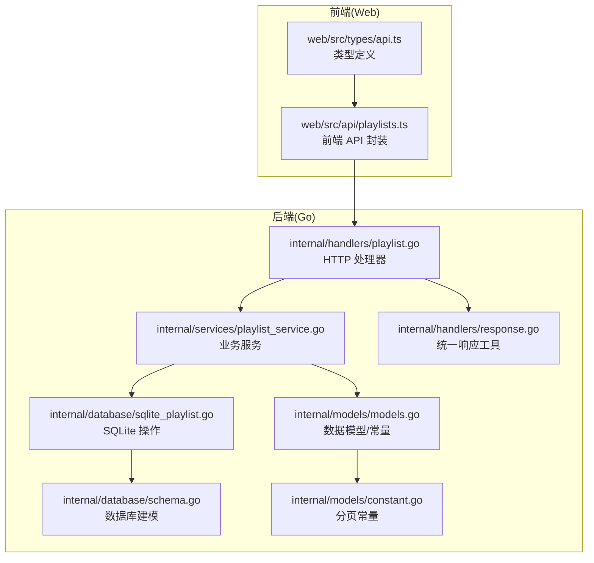
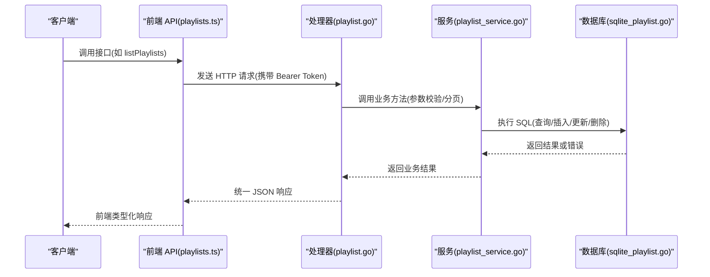
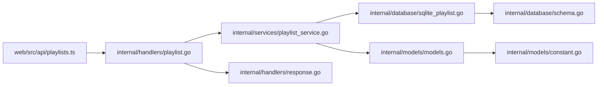

# 歌单 CRUD 操作

<cite>
**本文引用的文件**
- [playlist.go](file://internal/handlers/playlist.go)
- [playlist_service.go](file://internal/services/playlist_service.go)
- [models.go](file://internal/models/models.go)
- [sqlite_playlist.go](file://internal/database/sqlite_playlist.go)
- [schema.go](file://internal/database/schema.go)
- [constant.go](file://internal/models/constant.go)
- [response.go](file://internal/handlers/response.go)
- [playlists.ts](file://web/src/api/playlists.ts)
- [api.ts](file://web/src/types/api.ts)
- [playlist_test.go](file://internal/handlers/playlist_test.go)
- [playlist_service_test.go](file://internal/services/playlist_service_test.go)
</cite>

## 目录
1. [简介](#简介)
2. [项目结构](#项目结构)
3. [核心组件](#核心组件)
4. [架构总览](#架构总览)
5. [详细组件分析](#详细组件分析)
6. [依赖分析](#依赖分析)
7. [性能考量](#性能考量)
8. [故障排查指南](#故障排查指南)
9. [结论](#结论)
10. [附录](#附录)

## 简介
本文档面向 MiMusic 的“歌单 CRUD 操作”，系统性梳理以下接口与模型：
- ListPlaylists：获取歌单列表（支持类型过滤、分页）
- GetPlaylist：获取单个歌单详情
- CreatePlaylist：创建歌单
- UpdatePlaylist：更新歌单
- DeletePlaylist：删除歌单
- GetPlaylistSongs：获取歌单中的歌曲（分页）
- AddSongToPlaylist：批量添加歌曲到歌单
- RemoveSongFromPlaylist：从歌单移除歌曲
- ReorderPlaylistSongs：重新排序歌单中的歌曲
- TouchPlaylist：仅更新歌单的最后播放时间
- AutoCreatePlaylists：根据目录结构自动创建歌单

同时，文档给出每个接口的 HTTP 方法、URL、请求参数、响应格式、错误处理、分页参数使用方式、权限与安全要求，并对歌单模型进行数据结构说明与最佳实践建议。

## 项目结构
围绕歌单 CRUD 的核心代码位于后端 Go 侧，前端 Web 侧提供调用封装；数据库层基于 SQLite 并通过结构化 SQL 管理歌单、歌曲与关联关系。

图表来源
- [playlist.go:1-473](file://internal/handlers/playlist.go#L1-L473)
- [playlist_service.go:1-213](file://internal/services/playlist_service.go#L1-L213)
- [models.go:1-436](file://internal/models/models.go#L1-L436)
- [sqlite_playlist.go:1-487](file://internal/database/sqlite_playlist.go#L1-L487)
- [schema.go:1-149](file://internal/database/schema.go#L1-L149)
- [constant.go:1-15](file://internal/models/constant.go#L1-L15)
- [response.go:1-25](file://internal/handlers/response.go#L1-L25)
- [playlists.ts:1-99](file://web/src/api/playlists.ts#L1-L99)
- [api.ts:108-119](file://web/src/types/api.ts#L108-L119)

章节来源
- [playlist.go:1-473](file://internal/handlers/playlist.go#L1-L473)
- [playlist_service.go:1-213](file://internal/services/playlist_service.go#L1-L213)
- [models.go:1-436](file://internal/models/models.go#L1-L436)
- [sqlite_playlist.go:1-487](file://internal/database/sqlite_playlist.go#L1-L487)
- [schema.go:28-51](file://internal/database/schema.go#L28-L51)
- [constant.go:1-15](file://internal/models/constant.go#L1-L15)
- [response.go:1-25](file://internal/handlers/response.go#L1-L25)
- [playlists.ts:1-99](file://web/src/api/playlists.ts#L1-L99)
- [api.ts:108-119](file://web/src/types/api.ts#L108-L119)

## 核心组件
- HTTP 处理器：负责路由、参数解析、鉴权、调用服务层、统一响应输出。
- 业务服务：封装歌单增删改查、类型约束、内置歌单保护、自动创建逻辑等。
- 数据模型：定义歌单结构、类型枚举、校验规则、分页常量。
- 数据库层：SQLite 建表、查询、事务、批量插入、触发器维护 updated_at。
- 前端封装：统一的 API 调用函数、类型定义、封面 URL 转换。

章节来源
- [playlist.go:15-25](file://internal/handlers/playlist.go#L15-L25)
- [playlist_service.go:11-21](file://internal/services/playlist_service.go#L11-L21)
- [models.go:124-135](file://internal/models/models.go#L124-L135)
- [sqlite_playlist.go:17-47](file://internal/database/sqlite_playlist.go#L17-L47)
- [schema.go:28-51](file://internal/database/schema.go#L28-L51)
- [playlists.ts:1-99](file://web/src/api/playlists.ts#L1-L99)

## 架构总览
后端采用“处理器-服务-数据库”三层结构，前端通过统一的 API 封装调用后端接口。鉴权采用 Bearer Token，所有歌单接口均需认证。

图表来源
- [playlist.go:27-81](file://internal/handlers/playlist.go#L27-L81)
- [playlist_service.go:94-102](file://internal/services/playlist_service.go#L94-L102)
- [sqlite_playlist.go:167-260](file://internal/database/sqlite_playlist.go#L167-L260)
- [playlists.ts:22-33](file://web/src/api/playlists.ts#L22-L33)

## 详细组件分析

### 歌单模型与数据结构
- 歌单字段
  - id：整数，主键
  - type：字符串，枚举 normal/radio
  - name：字符串，必填
  - description：字符串，可选
  - cover_path：字符串，本地封面路径
  - cover_url：字符串，远程封面 URL
  - labels：字符串数组，如 ["built_in"]
  - created_at/updated_at：时间戳
- 校验规则
  - 创建时必须校验 name 与 type
  - 更新时仅校验 name，type 不允许修改
  - 歌单类型与歌曲类型存在约束：normal 只能添加 local/remote；radio 只能添加 radio
- 分页常量
  - 默认分页大小 DefaultPaginationLimit = 20
  - 最大分页 MaxPaginationLimit = 100000（用于批量场景）

章节来源
- [models.go:124-174](file://internal/models/models.go#L124-L174)
- [models.go:137-160](file://internal/models/models.go#L137-L160)
- [constant.go:4-14](file://internal/models/constant.go#L4-L14)

### ListPlaylists（获取歌单列表）
- HTTP 方法与路径
  - GET /playlists
- 查询参数
  - type：过滤类型 normal/radio
  - limit：每页数量，默认 20
  - offset：偏移量，默认 0
- 响应
  - 200：返回 playlists 数组、limit、offset
  - 500：服务器错误
- 分页行为
  - limit/offset 传入服务层，最终由数据库层拼接 LIMIT/OFFSET
- 错误处理
  - 服务层异常统一转为 500

章节来源
- [playlist.go:27-81](file://internal/handlers/playlist.go#L27-L81)
- [playlist_service.go:94-102](file://internal/services/playlist_service.go#L94-L102)
- [sqlite_playlist.go:167-260](file://internal/database/sqlite_playlist.go#L167-L260)
- [constant.go:4-14](file://internal/models/constant.go#L4-L14)

### GetPlaylist（获取单个歌单）
- HTTP 方法与路径
  - GET /playlists/{id}
- 路径参数
  - id：歌单 ID（整数）
- 响应
  - 200：返回歌单详情
  - 400：无效的歌单 ID
  - 404：歌单不存在
- 错误处理
  - ID 解析失败返回 400
  - 服务层找不到返回 404

章节来源
- [playlist.go:83-112](file://internal/handlers/playlist.go#L83-L112)
- [playlist_service.go:38-46](file://internal/services/playlist_service.go#L38-L46)

### CreatePlaylist（创建歌单）
- HTTP 方法与路径
  - POST /playlists
- 请求体
  - name：必填
  - type：可选，默认 normal
  - description/cover_url：可选
- 响应
  - 201：返回新建歌单
  - 400：请求数据错误
  - 500：创建失败
- 校验
  - 服务层 Validate() 校验 name/type

章节来源
- [playlist.go:114-141](file://internal/handlers/playlist.go#L114-L141)
- [playlist_service.go:23-36](file://internal/services/playlist_service.go#L23-L36)
- [models.go:137-150](file://internal/models/models.go#L137-L150)

### UpdatePlaylist（更新歌单）
- HTTP 方法与路径
  - PUT /playlists/{id}
- 路径参数
  - id：歌单 ID（整数）
- 请求体
  - name/description/cover_url：可选
- 响应
  - 200：返回更新后的歌单
  - 400：请求数据错误
  - 500：更新失败
- 校验
  - 服务层 ValidateForUpdate() 校验 name（type 不允许修改）

章节来源
- [playlist.go:143-180](file://internal/handlers/playlist.go#L143-L180)
- [playlist_service.go:48-61](file://internal/services/playlist_service.go#L48-L61)
- [models.go:152-160](file://internal/models/models.go#L152-L160)

### DeletePlaylist（删除歌单）
- HTTP 方法与路径
  - DELETE /playlists/{id}
- 路径参数
  - id：歌单 ID（整数）
- 响应
  - 200：返回成功消息
  - 400：无效的歌单 ID
  - 500：删除失败
- 安全与约束
  - 服务层检测内置标签 built_in，禁止删除内置歌单

章节来源
- [playlist.go:214-244](file://internal/handlers/playlist.go#L214-L244)
- [playlist_service.go:71-92](file://internal/services/playlist_service.go#L71-L92)

### GetPlaylistSongs（获取歌单中的歌曲）
- HTTP 方法与路径
  - GET /playlists/{id}/songs
- 路径参数
  - id：歌单 ID（整数）
- 查询参数
  - limit：每页数量，默认 20
  - offset：偏移量，默认 0
- 响应
  - 200：返回 songs 数组、total、limit、offset
  - 400：无效的歌单 ID
  - 500：获取失败
- 分页行为
  - limit/offset 传入服务层，最终由数据库层分页查询

章节来源
- [playlist.go:246-309](file://internal/handlers/playlist.go#L246-L309)
- [playlist_service.go:160-178](file://internal/services/playlist_service.go#L160-L178)
- [sqlite_playlist.go:167-260](file://internal/database/sqlite_playlist.go#L167-L260)

### AddSongToPlaylist（批量添加歌曲到歌单）
- HTTP 方法与路径
  - POST /playlists/{id}/songs
- 路径参数
  - id：歌单 ID（整数）
- 请求体
  - song_ids：整数数组，至少包含一个 ID
- 响应
  - 200：返回添加统计（added/skipped）
  - 400：请求数据错误
  - 500：添加失败
- 类型约束
  - 服务层校验歌单类型与歌曲类型是否匹配

章节来源
- [playlist.go:311-359](file://internal/handlers/playlist.go#L311-L359)
- [playlist_service.go:104-149](file://internal/services/playlist_service.go#L104-L149)

### RemoveSongFromPlaylist（从歌单移除歌曲）
- HTTP 方法与路径
  - DELETE /playlists/{id}/songs/{songId}
- 路径参数
  - id：歌单 ID（整数）
  - songId：歌曲 ID（整数）
- 响应
  - 200：返回成功消息
  - 400：请求数据错误
  - 500：移除失败

章节来源
- [playlist.go:361-399](file://internal/handlers/playlist.go#L361-L399)
- [playlist_service.go:151-158](file://internal/services/playlist_service.go#L151-L158)

### ReorderPlaylistSongs（重新排序歌单中的歌曲）
- HTTP 方法与路径
  - PUT /playlists/{id}/songs/reorder
- 路径参数
  - id：歌单 ID（整数）
- 请求体
  - song_ids：整数数组，必须与现有歌曲数量一致
- 响应
  - 200：返回成功消息
  - 400：请求数据错误
  - 500：排序失败
- 校验
  - 服务层校验 song_ids 数量与歌单中歌曲数量一致

章节来源
- [playlist.go:401-441](file://internal/handlers/playlist.go#L401-L441)
- [playlist_service.go:180-201](file://internal/services/playlist_service.go#L180-L201)

### TouchPlaylist（仅更新歌单最后播放时间）
- HTTP 方法与路径
  - POST /playlists/{id}/touch
- 路径参数
  - id：歌单 ID（整数）
- 响应
  - 200：返回成功消息
  - 400：无效的歌单 ID
  - 500：更新失败
- 用途
  - 仅更新 updated_at，用于记录最后播放时间

章节来源
- [playlist.go:182-212](file://internal/handlers/playlist.go#L182-L212)
- [playlist_service.go:63-69](file://internal/services/playlist_service.go#L63-L69)

### AutoCreatePlaylists（根据目录结构自动创建歌单）
- HTTP 方法与路径
  - POST /playlists/auto-create
- 查询参数
  - include_subdirs：是否包含子目录，默认 false
- 响应
  - 200：返回 playlists 列表与 total
  - 500：创建失败
- 行为
  - 事务内批量删除旧的 auto_created 歌单
  - 依据本地歌曲目录结构批量创建新歌单
  - 为每个歌单随机挑选一张封面

章节来源
- [playlist.go:443-472](file://internal/handlers/playlist.go#L443-L472)
- [playlist_service.go:203-212](file://internal/services/playlist_service.go#L203-L212)
- [sqlite_playlist.go:299-463](file://internal/database/sqlite_playlist.go#L299-L463)

### 权限验证与安全
- 鉴权方式
  - 所有歌单接口均标注 Security BearerAuth
  - 前端调用时需在请求头携带 Authorization: Bearer <token>
- 内置歌单保护
  - 删除歌单时若包含 built_in 标签则拒绝
- 输入校验
  - ID 必须为整数；请求体 JSON 必须合法
  - 歌单类型与歌曲类型存在约束

章节来源
- [playlist.go:38-38](file://internal/handlers/playlist.go#L38-L38)
- [playlist.go:93-93](file://internal/handlers/playlist.go#L93-L93)
- [playlist.go:124-124](file://internal/handlers/playlist.go#L124-L124)
- [playlist.go:154-154](file://internal/handlers/playlist.go#L154-L154)
- [playlist.go:192-192](file://internal/handlers/playlist.go#L192-L192)
- [playlist.go:224-224](file://internal/handlers/playlist.go#L224-L224)
- [playlist.go:258-258](file://internal/handlers/playlist.go#L258-L258)
- [playlist.go:322-322](file://internal/handlers/playlist.go#L322-L322)
- [playlist.go:372-372](file://internal/handlers/playlist.go#L372-L372)
- [playlist.go:412-412](file://internal/handlers/playlist.go#L412-L412)
- [playlist_service.go:73-84](file://internal/services/playlist_service.go#L73-L84)

### 分页参数使用
- 默认值
  - limit 默认 20（DefaultPaginationLimit）
  - offset 默认 0
- 最大限制
  - MaxPaginationLimit = 100000（用于批量场景）
- 前端使用
  - 前端封装提供分页参数转换与页码计算

章节来源
- [constant.go:4-14](file://internal/models/constant.go#L4-L14)
- [playlist.go:47-60](file://internal/handlers/playlist.go#L47-L60)
- [playlist.go:274-287](file://internal/handlers/playlist.go#L274-L287)
- [playlists.ts:22-33](file://web/src/api/playlists.ts#L22-L33)

### 请求与响应示例（说明性）
- ListPlaylists
  - 请求：GET /playlists?type=normal&limit=20&offset=0
  - 成功响应：包含 playlists 数组、limit、offset
  - 失败响应：500，包含错误信息
- GetPlaylist
  - 请求：GET /playlists/1
  - 成功响应：歌单对象
  - 失败响应：404 或 400
- CreatePlaylist
  - 请求体：{ name, type?, description?, cover_url? }
  - 成功响应：新建歌单对象
  - 失败响应：400 或 500
- UpdatePlaylist
  - 请求体：{ name?, description?, cover_url? }
  - 成功响应：更新后的歌单对象
  - 失败响应：400 或 500
- DeletePlaylist
  - 请求：DELETE /playlists/1
  - 成功响应：{"message":"歌单已删除"}
  - 失败响应：400 或 500
- GetPlaylistSongs
  - 请求：GET /playlists/1/songs?limit=20&offset=0
  - 成功响应：包含 songs、total、limit、offset
  - 失败响应：400 或 500
- AddSongToPlaylist
  - 请求体：{ song_ids: [1,2,3] }
  - 成功响应：{"message","added","skipped"}
  - 失败响应：400 或 500
- RemoveSongFromPlaylist
  - 请求：DELETE /playlists/1/songs/2
  - 成功响应：{"message":"歌曲已从歌单移除"}
  - 失败响应：400 或 500
- ReorderPlaylistSongs
  - 请求体：{ song_ids: [3,1,2] }
  - 成功响应：{"message":"歌单歌曲已重新排序"}
  - 失败响应：400 或 500
- TouchPlaylist
  - 请求：POST /playlists/1/touch
  - 成功响应：{"message":"歌单播放时间已更新"}
  - 失败响应：400 或 500
- AutoCreatePlaylists
  - 请求：POST /playlists/auto-create?include_subdirs=false
  - 成功响应：包含 playlists 数组与 total
  - 失败响应：500

章节来源
- [playlist.go:27-81](file://internal/handlers/playlist.go#L27-L81)
- [playlist.go:83-112](file://internal/handlers/playlist.go#L83-L112)
- [playlist.go:114-141](file://internal/handlers/playlist.go#L114-L141)
- [playlist.go:143-180](file://internal/handlers/playlist.go#L143-L180)
- [playlist.go:214-244](file://internal/handlers/playlist.go#L214-L244)
- [playlist.go:246-309](file://internal/handlers/playlist.go#L246-L309)
- [playlist.go:311-359](file://internal/handlers/playlist.go#L311-L359)
- [playlist.go:361-399](file://internal/handlers/playlist.go#L361-L399)
- [playlist.go:401-441](file://internal/handlers/playlist.go#L401-L441)
- [playlist.go:182-212](file://internal/handlers/playlist.go#L182-L212)
- [playlist.go:443-472](file://internal/handlers/playlist.go#L443-L472)

## 依赖分析
- 处理器依赖服务层，服务层依赖数据库层
- 模型定义贯穿处理器与服务层，确保前后端一致性
- 数据库层通过 SQLite 建模与索引提升查询性能
- 前端通过统一 API 封装与类型定义对接后端

图表来源
- [playlist.go:1-473](file://internal/handlers/playlist.go#L1-L473)
- [playlist_service.go:1-213](file://internal/services/playlist_service.go#L1-L213)
- [models.go:1-436](file://internal/models/models.go#L1-L436)
- [sqlite_playlist.go:1-487](file://internal/database/sqlite_playlist.go#L1-L487)
- [schema.go:1-149](file://internal/database/schema.go#L1-L149)
- [constant.go:1-15](file://internal/models/constant.go#L1-L15)
- [response.go:1-25](file://internal/handlers/response.go#L1-L25)
- [playlists.ts:1-99](file://web/src/api/playlists.ts#L1-L99)

章节来源
- [playlist.go:1-473](file://internal/handlers/playlist.go#L1-L473)
- [playlist_service.go:1-213](file://internal/services/playlist_service.go#L1-L213)
- [models.go:1-436](file://internal/models/models.go#L1-L436)
- [sqlite_playlist.go:1-487](file://internal/database/sqlite_playlist.go#L1-L487)
- [schema.go:1-149](file://internal/database/schema.go#L1-L149)
- [constant.go:1-15](file://internal/models/constant.go#L1-L15)
- [response.go:1-25](file://internal/handlers/response.go#L1-L25)
- [playlists.ts:1-99](file://web/src/api/playlists.ts#L1-L99)

## 性能考量
- 分页与索引
  - 数据库为 playlists、playlist_songs 等表建立索引，提升查询效率
  - 分页参数 limit/offset 控制返回规模，避免一次性加载过多数据
- 事务与批量
  - 自动创建歌单使用单一事务包裹，批量删除旧歌单与批量插入新歌单，减少多次往返
- 触发器
  - playlists 表的更新触发器自动维护 updated_at，避免重复逻辑

章节来源
- [schema.go:89-132](file://internal/database/schema.go#L89-L132)
- [sqlite_playlist.go:352-463](file://internal/database/sqlite_playlist.go#L352-L463)

## 故障排查指南
- 常见错误与定位
  - 400：请求参数无效（如非法 ID、JSON 解析失败）
  - 404：资源不存在（如歌单不存在）
  - 500：服务内部错误（数据库异常、事务失败等）
- 建议排查步骤
  - 检查请求头 Authorization 是否正确
  - 校验请求体 JSON 结构与字段类型
  - 确认歌单类型与歌曲类型约束是否满足
  - 查看服务日志定位具体 SQL 异常
- 单元测试参考
  - 后端提供了针对各接口的测试用例，可作为行为参考与回归验证

章节来源
- [playlist.go:70-74](file://internal/handlers/playlist.go#L70-L74)
- [playlist.go:100-108](file://internal/handlers/playlist.go#L100-L108)
- [playlist.go:135-138](file://internal/handlers/playlist.go#L135-L138)
- [playlist.go:167-176](file://internal/handlers/playlist.go#L167-L176)
- [playlist.go:236-239](file://internal/handlers/playlist.go#L236-L239)
- [playlist.go:291-293](file://internal/handlers/playlist.go#L291-L293)
- [playlist.go:349-352](file://internal/handlers/playlist.go#L349-L352)
- [playlist.go:391-394](file://internal/handlers/playlist.go#L391-L394)
- [playlist.go:433-436](file://internal/handlers/playlist.go#L433-L436)
- [playlist_test.go:328-366](file://internal/handlers/playlist_test.go#L328-L366)
- [playlist_test.go:368-402](file://internal/handlers/playlist_test.go#L368-L402)
- [playlist_test.go:404-430](file://internal/handlers/playlist_test.go#L404-L430)
- [playlist_test.go:432-458](file://internal/handlers/playlist_test.go#L432-L458)
- [playlist_test.go:460-498](file://internal/handlers/playlist_test.go#L460-L498)
- [playlist_test.go:500-527](file://internal/handlers/playlist_test.go#L500-L527)
- [playlist_test.go:564-612](file://internal/handlers/playlist_test.go#L564-L612)
- [playlist_test.go:685-703](file://internal/handlers/playlist_test.go#L685-L703)
- [playlist_test.go:705-727](file://internal/handlers/playlist_test.go#L705-L727)
- [playlist_test.go:729-748](file://internal/handlers/playlist_test.go#L729-L748)
- [playlist_test.go:750-782](file://internal/handlers/playlist_test.go#L750-L782)
- [playlist_test.go:785-800](file://internal/handlers/playlist_test.go#L785-L800)

## 结论
MiMusic 的歌单 CRUD 操作具备清晰的分层设计与完善的校验机制，支持类型约束、分页、批量操作与自动创建等功能。通过统一的鉴权与响应格式，前后端协作顺畅。建议在生产环境中：
- 严格遵循分页参数使用规范
- 注意内置歌单保护策略
- 在前端做好错误提示与重试策略
- 对批量操作（如自动创建）关注事务与性能

## 附录
- 前端类型定义与 API 封装
  - 歌单类型、请求/响应类型与分页响应类型定义
  - 前端 API 函数封装，包含分页参数转换与封面 URL 处理

章节来源
- [api.ts:108-119](file://web/src/types/api.ts#L108-L119)
- [api.ts:268-291](file://web/src/types/api.ts#L268-L291)
- [playlists.ts:1-99](file://web/src/api/playlists.ts#L1-L99)