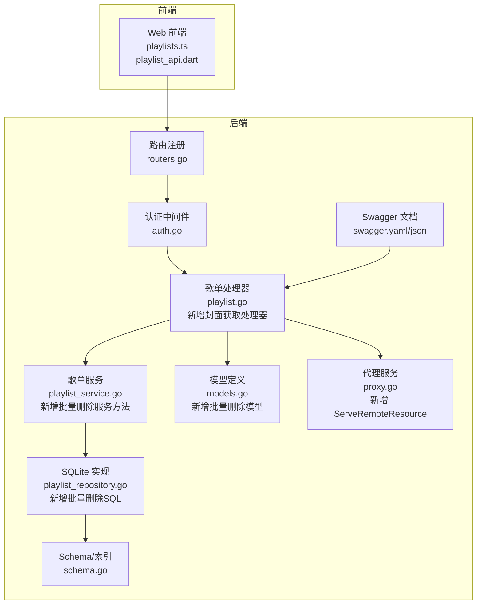
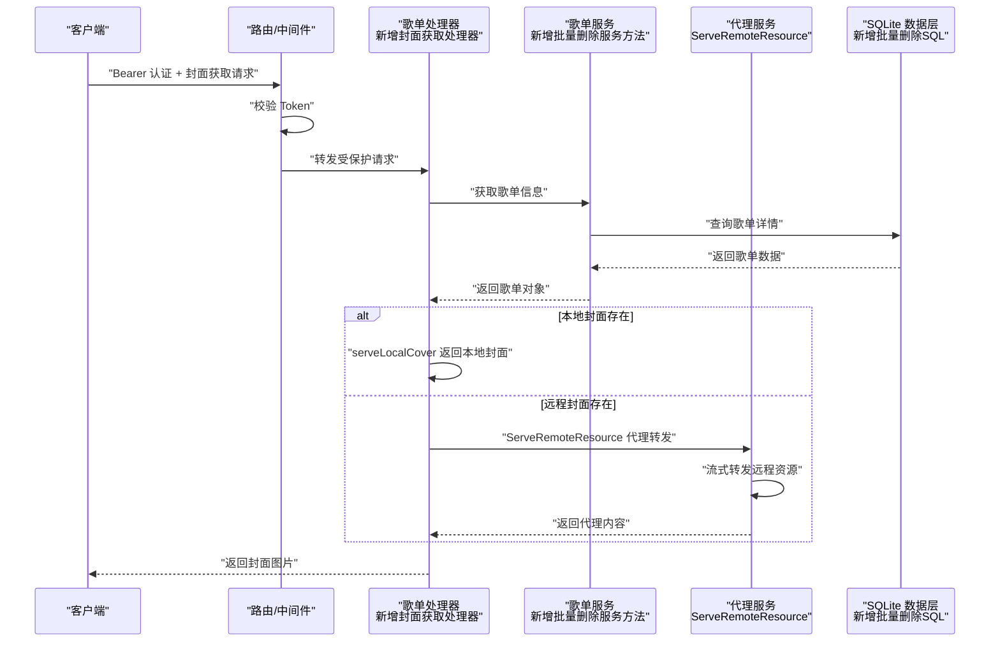
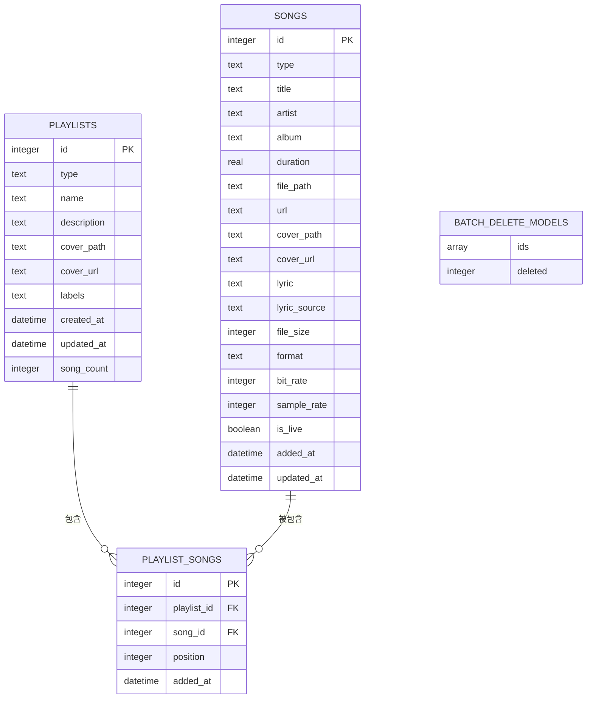
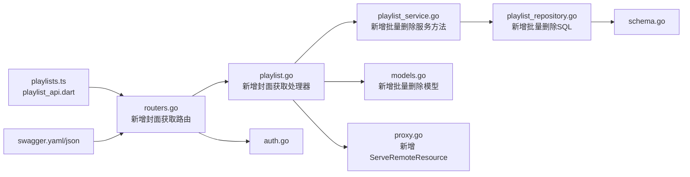

# 歌单管理 API

<cite>
**本文引用的文件**
- [playlist.go](file://internal/handlers/playlist.go)
- [playlist_service.go](file://internal/services/playlist_service.go)
- [playlist_repository.go](file://internal/database/playlist_repository.go)
- [models.go](file://internal/models/models.go)
- [routers.go](file://internal/app/routers.go)
- [auth.go](file://internal/middleware/auth.go)
- [proxy.go](file://internal/handlers/proxy.go)
- [music.go](file://internal/handlers/music.go)
- [playlists.ts](file://web/src/api/playlists.ts)
- [playlist_test.go](file://internal/handlers/playlist_test.go)
- [swagger.yaml](file://docs/swagger.yaml)
- [swagger.json](file://docs/swagger.json)
- [playlist_api.dart](file://frontend/lib/features/playlist/data/playlist_api.dart)
- [docs.go](file://docs/docs.go)
</cite>

## 更新摘要
**变更内容**
- 移除了自动歌单创建相关的API端点：删除了 /playlists/auto-create POST 和 /playlists/auto-created DELETE 端点
- 移除了相关的响应模型定义：AutoCreatePlaylistsRequest、AutoCreatePlaylistsResponse 及相关常量
- 更新了API参考章节，移除了自动创建歌单的功能描述
- 保留了现有的歌单管理功能，包括CRUD操作、歌曲操作、封面管理等

## 目录
1. [简介](#简介)
2. [项目结构](#项目结构)
3. [核心组件](#核心组件)
4. [架构概览](#架构概览)
5. [详细组件分析](#详细组件分析)
6. [依赖关系分析](#依赖关系分析)
7. [性能考虑](#性能考虑)
8. [故障排查指南](#故障排查指南)
9. [结论](#结论)
10. [附录](#附录)

## 简介
本文件为 MiMusic 歌单管理 API 的权威技术文档，覆盖以下主题：
- 歌单 CRUD：创建、获取列表、获取详情、更新、删除
- **新增** 歌单封面获取：统一的歌单封面访问端点，支持本地封面和远程封面
- **新增** 统一代理服务：ServeRemoteResource 函数，支持流式转发和 Range 请求
- 歌曲操作：添加歌曲、移除歌曲、批量添加、重新排序
- 歌单封面上传：支持本地图片上传、格式验证、大小限制
- **移除** 自动创建歌单：已完全移除自动歌单创建功能
- 统计信息：歌曲数量、封面图片等
- 模型定义、歌曲关联关系、权限控制与性能优化建议
- 分类与标签管理、用户体验优化最佳实践

## 项目结构
围绕歌单管理的关键代码分布在如下层次：
- 路由与鉴权：API 路由注册、认证中间件
- 控制器层：歌单 API 的请求处理逻辑，包含封面上传处理器、封面获取处理器和批量删除处理器
- 服务层：业务规则与流程编排，包含封面上传服务方法和批量删除服务方法
- 数据层：SQLite 持久化与 SQL 实现，包含批量删除查询
- 模型层：数据结构与校验规则，包含批量删除请求/响应模型
- 前端调用：Web 端对歌单 API 的封装，包含封面上传调用和批量删除调用
- 代理服务：统一的远程资源代理服务，支持流式转发

**图表来源**
- [routers.go:110-127](file://internal/app/routers.go#L110-L127)
- [auth.go:11-51](file://internal/middleware/auth.go#L11-L51)
- [playlist.go:608-686](file://internal/handlers/playlist.go#L608-L686)
- [playlist_service.go:138-169](file://internal/services/playlist_service.go#L138-L169)
- [playlist_repository.go:210-237](file://internal/database/playlist_repository.go#L210-L237)
- [models.go:458-466](file://internal/models/models.go#L458-L466)
- [proxy.go:110-167](file://internal/handlers/proxy.go#L110-L167)

**章节来源**
- [routers.go:110-127](file://internal/app/routers.go#L110-L127)
- [auth.go:11-51](file://internal/middleware/auth.go#L11-L51)
- [playlist.go:608-686](file://internal/handlers/playlist.go#L608-L686)
- [playlist_service.go:138-169](file://internal/services/playlist_service.go#L138-L169)
- [playlist_repository.go:210-237](file://internal/database/playlist_repository.go#L210-L237)
- [models.go:458-466](file://internal/models/models.go#L458-L466)
- [proxy.go:110-167](file://internal/handlers/proxy.go#L110-L167)

## 核心组件
- 路由与鉴权
  - API v1 路由组集中注册歌单相关端点，包含批量删除路由和封面获取路由
  - 认证中间件统一校验 Bearer Token
- 歌单处理器
  - 提供歌单 CRUD、歌曲操作、**批量删除**、**封面获取**等接口
- 歌单服务
  - 校验输入、类型约束、批量操作、重排逻辑、**批量删除逻辑**
- 数据层
  - SQLite 表结构、索引、触发器、批量插入优化，**包含批量删除查询**
- 模型层
  - 歌单、歌曲、歌单-歌曲关联、标签、常量与错误定义，**包含批量删除请求/响应模型**
- 代理服务
  - **新增** ServeRemoteResource 函数，支持流式转发、Range 请求透传、统一代理服务
- Swagger 文档
  - 完整的 API 文档定义，包含批量删除接口和封面获取接口

**章节来源**
- [routers.go:110-127](file://internal/app/routers.go#L110-L127)
- [auth.go:11-51](file://internal/middleware/auth.go#L11-L51)
- [playlist.go:608-686](file://internal/handlers/playlist.go#L608-L686)
- [playlist_service.go:138-169](file://internal/services/playlist_service.go#L138-L169)
- [playlist_repository.go:210-237](file://internal/database/playlist_repository.go#L210-L237)
- [models.go:458-466](file://internal/models/models.go#L458-L466)
- [proxy.go:110-167](file://internal/handlers/proxy.go#L110-L167)

## 架构概览
歌单管理采用经典的三层架构：控制器负责请求解析与响应封装，服务层承载业务规则，数据层负责持久化与查询优化。鉴权中间件贯穿受保护路由，确保 API 的安全性。**新增的歌单封面获取接口通过统一的 /playlists/{id}/cover 端点，支持本地封面直接返回和远程封面代理转发。统一代理服务 ServeRemoteResource 提供流式转发和 Range 请求透传功能。**

**图表来源**
- [routers.go:110-127](file://internal/app/routers.go#L110-L127)
- [auth.go:11-51](file://internal/middleware/auth.go#L11-L51)
- [playlist.go:620-647](file://internal/handlers/playlist.go#L620-L647)
- [playlist_service.go:148-169](file://internal/services/playlist_service.go#L148-L169)
- [playlist_repository.go:228-237](file://internal/database/playlist_repository.go#L228-237)
- [proxy.go:110-167](file://internal/handlers/proxy.go#L110-L167)

## 详细组件分析

### 歌单 CRUD 接口
- 列表查询
  - 方法：GET /api/v1/playlists
  - 查询参数：type、limit、offset
  - 响应：歌单数组、分页信息，包含song_count字段
  - 过滤：类型、标签、关键词、排序、分页
- 获取详情
  - 方法：GET /api/v1/playlists/{id}
  - 响应：单个歌单对象，包含song_count字段
- 创建歌单
  - 方法：POST /api/v1/playlists
  - 请求体：歌单对象（名称必填，类型必填）
  - 响应：创建后的歌单对象
- 更新歌单
  - 方法：PUT /api/v1/playlists/{id}
  - 请求体：歌单对象（名称必填，类型不允许变更）
  - 响应：更新后的歌单对象
- 删除歌单
  - 方法：DELETE /api/v1/playlists/{id}
  - 限制：内置歌单标签（built_in）不可删除
  - 响应：成功消息

**章节来源**
- [playlist.go:32-266](file://internal/handlers/playlist.go#L32-L266)
- [playlist_service.go:53-136](file://internal/services/playlist_service.go#L53-L136)
- [playlist_repository.go:36-155](file://internal/database/playlist_repository.go#L36-L155)
- [models.go:212-224](file://internal/models/models.go#L212-L224)

### **新增** 歌单封面获取接口
- 获取歌单封面
  - 方法：GET /api/v1/playlists/{id}/cover
  - 功能：统一的歌单封面访问端点
  - 行为：优先返回本地封面文件，不存在时代理转发远程封面URL
  - 响应：二进制图片文件（支持多种格式：JPEG、PNG、GIF、BMP、WEBP）
  - 错误处理：封面不存在返回 404，读取失败返回 500
- 本地封面处理
  - 从 playlist.CoverPath 读取本地封面文件
  - 根据文件扩展名设置合适的 Content-Type
  - 设置一年缓存策略（Cache-Control: public, max-age=31536000）
- 远程封面处理
  - 当 playlist.CoverURL 存在时，使用 ServeRemoteResource 代理转发
  - 支持流式转发和 Range 请求透传
  - 透传上游响应头，包括 Content-Type、Content-Length、Cache-Control 等

**章节来源**
- [playlist.go:608-686](file://internal/handlers/playlist.go#L608-L686)
- [playlist_service.go:148-169](file://internal/services/playlist_service.go#L148-L169)
- [playlist_repository.go:228-237](file://internal/database/playlist_repository.go#L228-237)
- [proxy.go:110-167](file://internal/handlers/proxy.go#L110-L167)

### **新增** 统一代理服务
- ServeRemoteResource 函数
  - 功能：通用远程资源代理服务，支持流式转发和 Range 请求透传
  - 参数：w（HTTP 响应写入器）、r（HTTP 请求）、resourceURL（目标资源 URL）
  - 特性：不需要域名校验，支持断点续传，透传关键响应头
  - 应用场景：封面代理、歌词代理、其他远程资源代理
- 代理处理流程
  - 构建上游请求，透传 Range 和 Accept 头
  - 设置合理的 User-Agent 避免被上游 CDN 拒绝
  - 流式转发响应体，透传关键响应头
  - 支持 200 和 206 状态码（支持断点续传）

**章节来源**
- [proxy.go:110-167](file://internal/handlers/proxy.go#L110-L167)

### **新增** 简化歌曲封面URL逻辑
- 统一封面URL生成
  - Song.CoverURLPath() 返回统一的 /api/v1/songs/{id}/cover 端点
  - 所有封面（无论本地或远程）统一通过服务端端点访问
  - 后端自动判断本地/远程并进行相应处理
- 歌曲封面处理
  - 本地封面：直接返回文件内容，支持多种图片格式
  - 远程封面：使用 ServeRemoteResource 代理转发
  - 歌词处理：Song.LyricURLPath() 返回统一的歌词端点
- 前端集成优势
  - 客户端只需使用统一的 URL 模板
  - 无需关心内部封面路径和类型差异
  - 简化了前端封面显示逻辑

**章节来源**
- [models.go:107-132](file://internal/models/models.go#L107-L132)
- [models.go:188-210](file://internal/models/models.go#L188-L210)
- [music.go:488-494](file://internal/handlers/music.go#L488-L494)

### **新增** 批量删除歌单接口
- 批量删除歌单
  - 方法：POST /api/v1/playlists/batch-delete
  - 请求体：ids 数组（歌单 ID 列表）
  - 行为：根据 ID 列表批量删除歌单，内置歌单会被跳过
  - 响应：deleted 整数（实际删除的歌单数量）
  - 错误处理：ID 列表为空时返回 400 错误
- 内置歌单保护
  - 批量删除会自动跳过带有 built_in 标签的歌单
  - 确保系统核心功能不受影响

**章节来源**
- [playlist.go:268-303](file://internal/handlers/playlist.go#L268-L303)
- [playlist_service.go:138-169](file://internal/services/playlist_service.go#L138-L169)
- [playlist_repository.go:210-237](file://internal/database/playlist_repository.go#L210-L237)
- [models.go:458-466](file://internal/models/models.go#L458-L466)

### 歌曲操作接口
- 获取歌单歌曲
  - 方法：GET /api/v1/playlists/{id}/songs
  - 查询参数：limit、offset
  - 响应：歌曲数组、总数、分页信息
- 添加歌曲到歌单
  - 方法：POST /api/v1/playlists/{id}/songs
  - 请求体：song_ids 数组
  - 行为：批量添加，跳过已存在歌曲
- 移除歌曲
  - 方法：DELETE /api/v1/playlists/{id}/songs/{songId}
- 重新排序
  - 方法：PUT /api/v1/playlists/{id}/songs/reorder
  - 请求体：song_ids（必须与现有歌曲集合完全一致）
- 触碰更新
  - 方法：POST /api/v1/playlists/{id}/touch
  - 作用：仅更新 updated_at，用于记录最后播放时间

**章节来源**
- [playlist.go:305-539](file://internal/handlers/playlist.go#L305-L539)
- [playlist_service.go:185-279](file://internal/services/playlist_service.go#L185-L279)
- [playlist_repository.go:268-421](file://internal/database/playlist_repository.go#L268-L421)

### 歌单封面上传接口
- 上传封面图片
  - 方法：POST /api/v1/playlists/{id}/cover
  - 请求格式：multipart/form-data
  - 参数：file（必需，封面图片文件）
  - 支持格式：JPG、JPEG、PNG、GIF、BMP、WEBP
  - 大小限制：10MB
  - 响应：更新后的歌单对象（包含封面路径）
  - 错误处理：格式不支持、文件过大、解析失败等

**章节来源**
- [playlist.go:541-606](file://internal/handlers/playlist.go#L541-L606)
- [playlist_service.go:281-304](file://internal/services/playlist_service.go#L281-L304)
- [swagger.yaml:133-177](file://docs/swagger.yaml#L133-L177)
- [swagger.json:1116-1156](file://docs/swagger.json#L1116-L1156)

### **移除** 自动创建歌单相关接口
- **已移除** 自动创建歌单
  - 原方法：POST /api/v1/playlists/auto-create
  - 原行为：基于本地歌曲目录结构批量创建歌单，使用事务与批量插入优化性能
  - 原响应：创建的歌单列表与总数
- **已移除** 删除所有自动创建的歌单
  - 原方法：DELETE /api/v1/playlists/auto-created
  - 原行为：删除所有带 auto_created 标签的歌单
  - 原响应：成功消息

**章节来源**
- [playlist.go:506-602](file://internal/handlers/playlist.go#L506-L602)
- [playlist_service.go:133-139](file://internal/services/playlist_service.go#L133-L139)
- [playlist_repository.go:239-421](file://internal/database/playlist_repository.go#L239-L421)

### 统计信息接口
- 歌单歌曲数量
  - 通过 GetPlaylistByID 和 ListPlaylists 接口的响应中的 song_count 字段获取
  - 数据库使用 LEFT JOIN 和 COUNT 函数计算歌曲数量
  - 对于没有歌曲的歌单，song_count 返回 0
- 封面图片
  - 歌单封面支持本地路径与远程 URL，前端在渲染时统一转换为可访问的 URL
  - 上传的封面图片存储在本地路径，支持直接访问
  - **新增** 统一通过 /api/v1/playlists/{id}/cover 端点访问
- 总时长
  - 当前 API 未直接提供总时长统计；可通过前端聚合歌曲时长实现或扩展后端接口

**章节来源**
- [playlist.go:296-308](file://internal/handlers/playlist.go#L296-L308)
- [playlists.ts:13-20](file://web/src/api/playlists.ts#L13-L20)
- [playlist_service.go:239-267](file://internal/services/playlist_service.go#L239-L267)
- [playlist_repository.go:490-521](file://internal/database/playlist_repository.go#L490-L521)
- [models.go:188-210](file://internal/models/models.go#L188-L210)

### 权限控制
- 鉴权中间件
  - 从 Authorization 头提取 Bearer Token，若为空则回退到 URL 查询参数 access_token
  - 校验失败返回 401
- 受保护路由
  - 歌单相关 API 均位于受保护路由组中，需携带有效 Token

**章节来源**
- [auth.go:11-51](file://internal/middleware/auth.go#L11-L51)
- [routers.go:89-175](file://internal/app/routers.go#L89-L175)

### 数据模型与关联关系
- 歌单（playlists）
  - 字段：id、type、name、description、cover_path、cover_url、labels、created_at、updated_at、song_count
  - 标签：支持 built_in、auto_created 等
  - **新增** song_count 字段用于统计歌单中的歌曲数量
  - **新增** CoverURLPath() 方法返回统一的封面访问端点
- 歌曲（songs）
  - 字段：id、type、title、artist、album、duration、file_path、url、cover_path、cover_url、歌词等
  - **新增** CoverURLPath() 方法返回统一的封面访问端点
- 歌单-歌曲关联（playlist_songs）
  - 字段：id、playlist_id、song_id、position、added_at
  - 约束：唯一性约束（playlist_id, song_id），外键级联删除
- **新增** 批量删除模型
  - BatchDeletePlaylistsRequest：包含 ids 数组（要删除的歌单 ID 列表）
  - BatchDeletePlaylistsResponse：包含 deleted 整数（实际删除数量）
- 类型与校验
  - 歌单类型：normal、radio
  - 歌曲类型：local、remote、radio
  - 歌单 CanAddSong 校验：normal 只能添加 local/remote，radio 只能添加 radio

**图表来源**
- [playlist_repository.go:461-506](file://internal/database/playlist_repository.go#L461-L506)
- [models.go:212-224](file://internal/models/models.go#L212-L224)
- [models.go:212-224](file://internal/models/models.go#L212-L224)
- [models.go:458-466](file://internal/models/models.go#L458-L466)

**章节来源**
- [playlist_repository.go:461-506](file://internal/database/playlist_repository.go#L461-L506)
- [models.go:212-224](file://internal/models/models.go#L212-L224)
- [models.go:212-224](file://internal/models/models.go#L212-L224)
- [models.go:458-466](file://internal/models/models.go#L458-L466)

### API 请求与响应示例（路径引用）
- 列表查询
  - [playlist.go:32-95](file://internal/handlers/playlist.go#L32-L95)
- 获取详情
  - [playlist.go:97-126](file://internal/handlers/playlist.go#L97-L126)
- 创建歌单
  - [playlist.go:128-159](file://internal/handlers/playlist.go#L128-L159)
- 更新歌单
  - [playlist.go:161-202](file://internal/handlers/playlist.go#L161-L202)
- 删除歌单
  - [playlist.go:236-266](file://internal/handlers/playlist.go#L236-L266)
- **新增** 批量删除歌单
  - [playlist.go:268-303](file://internal/handlers/playlist.go#L268-L303)
- 获取歌单歌曲
  - [playlist.go:305-368](file://internal/handlers/playlist.go#L305-L368)
- 添加歌曲到歌单
  - [playlist.go:370-418](file://internal/handlers/playlist.go#L370-L418)
- 移除歌曲
  - [playlist.go:420-458](file://internal/handlers/playlist.go#L420-L458)
- 重新排序
  - [playlist.go:460-500](file://internal/handlers/playlist.go#L460-L500)
- 触碰更新
  - [playlist.go:204-234](file://internal/handlers/playlist.go#L204-L234)
- 上传歌单封面
  - [playlist.go:541-606](file://internal/handlers/playlist.go#L541-L606)
- **新增** 获取歌单封面
  - [playlist.go:608-686](file://internal/handlers/playlist.go#L608-L686)

## 依赖关系分析
- 控制器依赖服务层，服务层依赖数据层接口，数据层依赖 SQLite 实现
- 路由注册集中于 API v1 组，受保护路由统一走认证中间件
- **新增** 代理服务 ServeRemoteResource 为封面获取提供统一的远程资源代理能力
- 前端通过 playlists.ts 封装调用后端歌单 API
- Swagger 文档定义完整的 API 接口规范

**图表来源**
- [playlist.go:608-686](file://internal/handlers/playlist.go#L608-L686)
- [playlist_service.go:138-169](file://internal/services/playlist_service.go#L138-L169)
- [playlist_repository.go:210-237](file://internal/database/playlist_repository.go#L210-L237)
- [playlist_repository.go:461-506](file://internal/database/playlist_repository.go#L461-L506)
- [models.go:458-466](file://internal/models/models.go#L458-L466)
- [routers.go:110-127](file://internal/app/routers.go#L110-L127)
- [auth.go:11-51](file://internal/middleware/auth.go#L11-L51)
- [proxy.go:110-167](file://internal/handlers/proxy.go#L110-L167)
- [playlist_api.dart:185-193](file://frontend/lib/features/playlist/data/playlist_api.dart#L185-L193)

**章节来源**
- [playlist.go:608-686](file://internal/handlers/playlist.go#L608-L686)
- [playlist_service.go:138-169](file://internal/services/playlist_service.go#L138-L169)
- [playlist_repository.go:210-237](file://internal/database/playlist_repository.go#L210-L237)
- [playlist_repository.go:461-506](file://internal/database/playlist_repository.go#L461-L506)
- [models.go:458-466](file://internal/models/models.go#L458-L466)
- [routers.go:110-127](file://internal/app/routers.go#L110-L127)
- [auth.go:11-51](file://internal/middleware/auth.go#L11-L51)
- [proxy.go:110-167](file://internal/handlers/proxy.go#L110-L167)
- [playlist_api.dart:185-193](file://frontend/lib/features/playlist/data/playlist_api.dart#L185-L193)

## 性能考虑
- SQLite 优化
  - WAL 模式、busy_timeout、synchronous、cache_size、foreign_keys 等参数优化
  - 连接池：最大打开连接数、空闲连接数、连接生命周期
- 批量操作
  - 批量添加歌曲：循环调用，内部统计 added/skipped
  - **新增** 批量删除歌单：使用 IN 子查询和 JSON 函数，避免逐个删除的开销
- 查询优化
  - 索引：playlists.labels、playlist_songs.playlist_id、playlist_songs.position
  - 分页：limit/offset，避免一次性加载大量数据
  - 歌曲计数查询：使用 LEFT JOIN 和子查询优化，避免 N+1 查询问题
- 前端优化
  - **新增** 统一封面URL：减少重复计算，简化前端逻辑
  - 封面缓存：本地封面设置一年缓存，减少重复请求
  - 列表与详情页面按需加载，避免不必要的请求
- 封面上传优化
  - 10MB 大小限制，防止过大文件占用存储空间
  - 支持多种图片格式，满足不同用户需求
  - 异步处理，不影响主业务流程
- **新增** 代理服务优化
  - 流式转发：避免内存占用过高
  - Range 请求透传：支持断点续传和分段加载
  - 缓存头透传：保持上游资源的缓存策略

**章节来源**
- [playlist_repository.go:210-237](file://internal/database/playlist_repository.go#L210-L237)
- [playlist_repository.go:490-521](file://internal/database/playlist_repository.go#L490-L521)
- [playlist_service.go:138-169](file://internal/services/playlist_service.go#L138-L169)
- [models.go:458-466](file://internal/models/models.go#L458-L466)
- [routers.go:110-127](file://internal/app/routers.go#L110-L127)
- [playlist.go:541-606](file://internal/handlers/playlist.go#L541-L606)
- [proxy.go:110-167](file://internal/handlers/proxy.go#L110-L167)

## 故障排查指南
- 常见错误与处理
  - 无效歌单 ID：解析失败返回 400
  - 歌单不存在：查询失败返回 404
  - 服务器内部错误：统一返回 500
  - 令牌缺失或无效：返回 401
- **新增** 封面获取错误处理
  - 无效的 ID：解析失败返回 400
  - 歌单不存在：查询失败返回 404
  - 服务器内部错误：统一返回 500
  - 封面文件不存在：返回 404
  - 读取封面文件失败：返回 500
  - 远程封面代理失败：返回 500
- **新增** 代理服务错误处理
  - 上游请求创建失败：返回 500
  - 上游请求失败：返回 502（Bad Gateway）
  - Range 请求透传失败：保持原状态码透传
- **新增** 批量删除错误处理
  - 请求数据错误：JSON 解码失败返回 400
  - ID 列表为空：返回 400 错误
  - 数据库连接失败：返回 500
  - SQL 查询语法错误：返回 500
  - 内置歌单保护：跳过 built_in 歌单，不计入删除数量
- 封面上传错误处理
  - 解析 multipart 表单失败：返回 400
  - 获取上传文件失败：返回 400
  - 不支持的图片格式：返回 400（仅支持 JPG、JPEG、PNG、GIF、BMP、WEBP）
  - 文件过大（超过 10MB）：返回 400
  - 读取文件失败：返回 500
  - 上传封面失败：返回 500
- **移除** 自动创建歌单相关错误处理
  - 已移除自动创建歌单功能，不再提供相关错误处理
- 歌单删除失败
  - 确认歌单是否带有 built_in 标签（内置歌单不可删除）

**章节来源**
- [playlist.go:620-686](file://internal/handlers/playlist.go#L620-L686)
- [playlist.go:280-303](file://internal/handlers/playlist.go#L280-L303)
- [playlist.go:32-95](file://internal/handlers/playlist.go#L32-L95)
- [playlist.go:97-126](file://internal/handlers/playlist.go#L97-L126)
- [playlist.go:236-266](file://internal/handlers/playlist.go#L236-L266)
- [playlist.go:541-606](file://internal/handlers/playlist.go#L541-L606)
- [auth.go:32-42](file://internal/middleware/auth.go#L32-L42)
- [playlist_service.go:53-136](file://internal/services/playlist_service.go#L53-L136)
- [playlist_test.go:529-562](file://internal/handlers/playlist_test.go#L529-L562)
- [proxy.go:110-167](file://internal/handlers/proxy.go#L110-L167)

## 结论
MiMusic 的歌单管理 API 采用清晰的分层设计与完善的鉴权机制，结合 SQLite 的批量与索引优化，能够高效支撑歌单 CRUD、歌曲操作等核心功能。**新增的歌单封面获取接口通过统一的 /playlists/{id}/cover 端点，简化了前端封面访问逻辑，支持本地封面直接返回和远程封面代理转发。统一代理服务 ServeRemoteResource 提供了强大的流式转发能力，支持 Range 请求透传和断点续传。这些改进显著提升了系统的易用性和性能表现。** 

**重要变更**：自动歌单创建功能已完全移除，包括 /playlists/auto-create POST 和 /playlists/auto-created DELETE 端点。现有用户可以通过手动创建歌单或使用其他方式管理音乐库。建议在后续迭代中补充总时长统计与跨设备同步能力，进一步完善歌单生态。

## 附录

### API 定义与参数
- 列表查询
  - 方法：GET /api/v1/playlists
  - 查询参数：type（normal/radio）、limit（默认 20）、offset（默认 0）
  - 响应：playlists（数组）、limit、offset，包含song_count字段
- 获取详情
  - 方法：GET /api/v1/playlists/{id}
  - 路径参数：id（整数）
  - 响应：歌单对象，包含song_count字段
- 创建歌单
  - 方法：POST /api/v1/playlists
  - 请求体：歌单对象（name、type 必填）
  - 响应：创建后的歌单对象
- 更新歌单
  - 方法：PUT /api/v1/playlists/{id}
  - 请求体：歌单对象（name 必填，type 不允许修改）
  - 响应：更新后的歌单对象
- 删除歌单
  - 方法：DELETE /api/v1/playlists/{id}
  - 响应：成功消息
- **新增** 获取歌单封面
  - 方法：GET /api/v1/playlists/{id}/cover
  - 路径参数：id（整数）
  - 响应：二进制图片文件（支持多种格式）
  - 错误：封面不存在返回 404，读取失败返回 500
- **新增** 批量删除歌单
  - 方法：POST /api/v1/playlists/batch-delete
  - 请求体：ids（整数数组，歌单 ID 列表）
  - 响应：deleted（整数，实际删除数量）
- 获取歌单歌曲
  - 方法：GET /api/v1/playlists/{id}/songs
  - 查询参数：limit、offset
  - 响应：songs（数组）、total、limit、offset
- 添加歌曲到歌单
  - 方法：POST /api/v1/playlists/{id}/songs
  - 请求体：song_ids（数组）
  - 响应：added、skipped
- 移除歌曲
  - 方法：DELETE /api/v1/playlists/{id}/songs/{songId}
- 重新排序
  - 方法：PUT /api/v1/playlists/{id}/songs/reorder
  - 请求体：song_ids（与现有集合一致）
- 触碰更新
  - 方法：POST /api/v1/playlists/{id}/touch
- 上传歌单封面
  - 方法：POST /api/v1/playlists/{id}/cover
  - 请求格式：multipart/form-data
  - 参数：file（必需，封面图片文件）
  - 支持格式：JPG、JPEG、PNG、GIF、BMP、WEBP
  - 大小限制：10MB
  - 响应：更新后的歌单对象

**章节来源**
- [playlist.go:32-686](file://internal/handlers/playlist.go#L32-L686)
- [routers.go:110-127](file://internal/app/routers.go#L110-L127)
- [swagger.yaml:133-177](file://docs/swagger.yaml#L133-L177)
- [swagger.json:1116-1156](file://docs/swagger.json#L1116-L1156)

### 权限与安全
- 鉴权方式：Bearer Token（Authorization 头或 URL 查询参数）
- 受保护路由：歌单相关 API 均在受保护路由组中
- 内置歌单保护：built_in 标签的歌单不可删除
- **新增** 代理服务安全：ServeRemoteResource 不进行域名白名单校验，但保持安全的请求处理

**章节来源**
- [auth.go:11-51](file://internal/middleware/auth.go#L11-L51)
- [routers.go:89-175](file://internal/app/routers.go#L89-L175)
- [playlist_service.go:53-136](file://internal/services/playlist_service.go#L53-L136)
- [proxy.go:110-167](file://internal/handlers/proxy.go#L110-L167)

### 数据模型与约束
- 歌单类型：normal、radio
- 歌曲类型：local、remote、radio
- 歌单-歌曲关联：唯一性约束（playlist_id, song_id），外键级联删除
- 标签：built_in、auto_created
- **新增** 封面字段：cover_path（本地路径）、cover_url（远程URL）
- **新增** 歌曲计数字段：song_count（整数，默认为0）
- **新增** 批量删除模型：
  - BatchDeletePlaylistsRequest：包含 ids 数组（要删除的歌单 ID 列表）
  - BatchDeletePlaylistsResponse：包含 deleted 整数（实际删除数量）
- **新增** 图片格式：JPG、JPEG、PNG、GIF、BMP、WEBP
- **新增** 大小限制：10MB
- **新增** 统一封面URL：CoverURLPath() 返回 /api/v1/playlists/{id}/cover 端点

**章节来源**
- [models.go:17-21](file://internal/models/models.go#L17-L21)
- [models.go:212-224](file://internal/models/models.go#L212-L224)
- [models.go:458-466](file://internal/models/models.go#L458-L466)
- [playlist_repository.go:461-506](file://internal/database/playlist_repository.go#L461-L506)
- [playlist.go:541-606](file://internal/handlers/playlist.go#L541-L606)
- [models.go:188-210](file://internal/models/models.go#L188-L210)

### 前端集成指南
- Web 平台
  - 使用 MultipartFile.fromBytes 上传字节数组
  - 支持文件名参数，确保正确的文件扩展名
- 原生平台
  - 使用 MultipartFile.fromFile 上传本地文件路径
  - 支持文件名参数，确保正确的文件扩展名
- **新增** 封面访问统一化
  - 使用统一的 URL 模板：/api/v1/playlists/{id}/cover
  - 无需区分本地封面和远程封面
  - 支持多种图片格式的自动识别
- **新增** 批量删除错误处理
  - 检查请求数据格式和 ID 列表
  - 处理网络异常和服务器错误
  - 更新 UI 状态，显示删除进度和结果
- **新增** 歌单计数显示
  - 在歌单列表中显示歌曲数量
  - 支持动态更新计数显示

**章节来源**
- [playlist_api.dart:185-193](file://frontend/lib/features/playlist/data/playlist_api.dart#L185-L193)

### 数据库查询优化
- 歌单计数查询
  - 使用 LEFT JOIN 和子查询统计每个歌单的歌曲数量
  - 子查询按 playlist_id 分组并使用 COUNT(*) 计算数量
  - 使用 COALESCE 函数确保没有歌曲的歌单返回 0
- **新增** 批量删除查询
  - 使用 IN 子查询和 JSON 函数实现批量删除
  - 通过 NOT EXISTS 子查询跳过内置歌单（labels 中包含 "built_in"）
  - 使用占位符参数避免 SQL 注入攻击
- **新增** 封面获取查询
  - 直接查询歌单的 cover_path 和 cover_url 字段
  - 支持快速判断本地封面是否存在
- 性能优化策略
  - 在 playlists 表上建立适当的索引
  - 使用预编译语句避免 SQL 注入
  - 限制查询结果集大小，支持分页

**章节来源**
- [playlist_repository.go:490-521](file://internal/database/playlist_repository.go#L490-L521)
- [playlist_repository.go:210-237](file://internal/database/playlist_repository.go#L210-L237)
- [playlist.go:620-647](file://internal/handlers/playlist.go#L620-L647)

### 代理服务使用指南
- **新增** ServeRemoteResource 函数使用
  - 参数：w（HTTP 响应写入器）、r（HTTP 请求）、resourceURL（目标资源 URL）
  - 返回：流式转发远程资源内容
  - 特性：支持 Range 请求透传、断点续传、流式转发
- **应用场景**
  - 歌单封面代理：当 cover_url 存在时，代理转发远程封面
  - 歌词代理：当歌词来自远程 URL 时，代理转发歌词内容
  - 其他远程资源：统一的资源代理入口
- **配置与限制**
  - 超时时间：60 秒
  - 重定向限制：最多 10 次重定向
  - User-Agent：设置为 "MiMusic/1.0"

**章节来源**
- [proxy.go:110-167](file://internal/handlers/proxy.go#L110-L167)