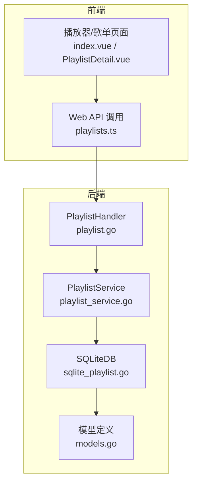
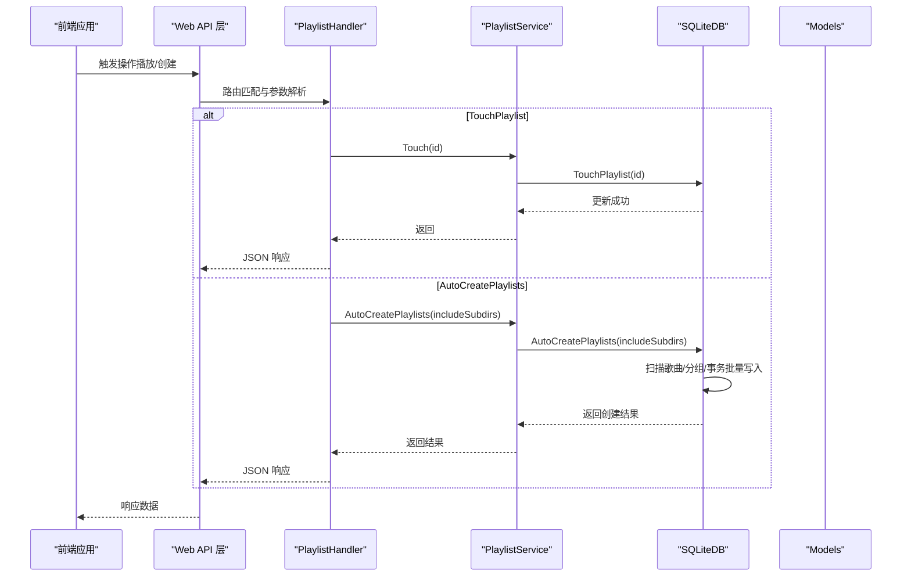
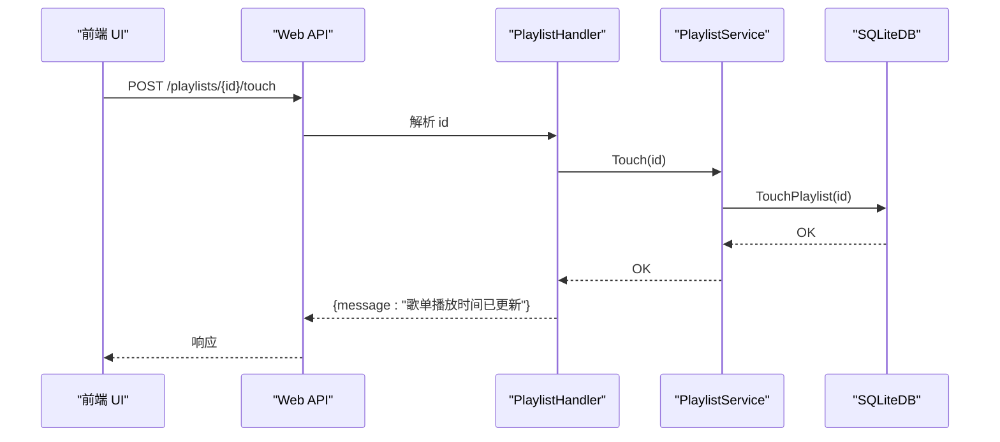
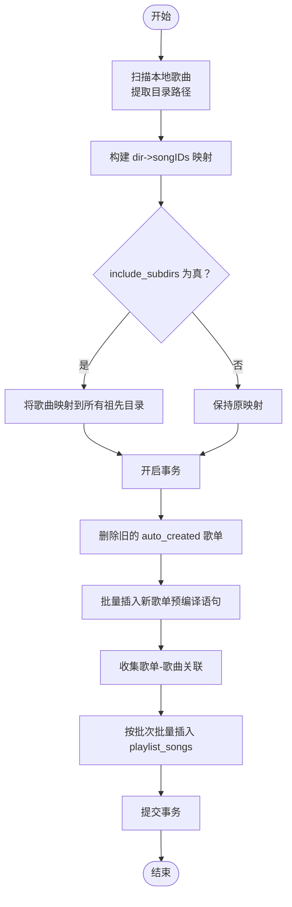

# 歌单管理功能

<cite>
**本文引用的文件**
- [playlist.go](file://internal/handlers/playlist.go)
- [playlist_service.go](file://internal/services/playlist_service.go)
- [sqlite_playlist.go](file://internal/database/sqlite_playlist.go)
- [models.go](file://internal/models/models.go)
- [playlists.ts](file://web/src/api/playlists.ts)
- [index.vue](file://web/src/views/Playlists/index.vue)
- [PlaylistDetail.vue](file://web/src/views/Playlists/PlaylistDetail.vue)
- [player_provider.dart](file://frontend/lib/features/player/presentation/providers/player_provider.dart)
- [swagger.json](file://docs/swagger.json)
</cite>

## 目录
1. [简介](#简介)
2. [项目结构](#项目结构)
3. [核心组件](#核心组件)
4. [架构总览](#架构总览)
5. [详细组件分析](#详细组件分析)
6. [依赖关系分析](#依赖关系分析)
7. [性能考量](#性能考量)
8. [故障排查指南](#故障排查指南)
9. [结论](#结论)
10. [附录](#附录)

## 简介
本文件面向 MiMusic 的歌单管理功能，重点覆盖以下高级特性：
- TouchPlaylist：仅更新歌单的 updated_at 字段以记录最后播放时间，用于提升用户体验与歌单排序。
- AutoCreatePlaylists：根据歌曲文件路径自动创建歌单，支持 include_subdirs 参数控制是否包含子目录，实现智能歌单组织。

文档将从架构、数据流、处理逻辑、集成关系、性能与最佳实践等维度进行系统化说明，并提供可视化图示帮助理解。

## 项目结构
歌单管理功能涉及三层结构：
- 处理器层（Handlers）：负责路由、参数解析与响应封装。
- 服务层（Services）：封装业务规则与流程控制。
- 数据访问层（Database）：负责与 SQLite 的交互与事务控制。

图表来源
- [playlist.go:15-25](file://internal/handlers/playlist.go#L15-L25)
- [playlist_service.go:11-21](file://internal/services/playlist_service.go#L11-L21)
- [sqlite_playlist.go:17-47](file://internal/database/sqlite_playlist.go#L17-L47)
- [models.go:124-135](file://internal/models/models.go#L124-L135)

章节来源
- [playlist.go:15-25](file://internal/handlers/playlist.go#L15-L25)
- [playlist_service.go:11-21](file://internal/services/playlist_service.go#L11-L21)
- [sqlite_playlist.go:17-47](file://internal/database/sqlite_playlist.go#L17-L47)
- [models.go:124-135](file://internal/models/models.go#L124-L135)

## 核心组件
- TouchPlaylist：通过处理器调用服务层，服务层再调用数据库层，仅执行 updated_at 的更新，不改变其他字段。
- AutoCreatePlaylists：通过处理器解析 include_subdirs 查询参数，服务层调用数据库层，数据库层执行全量扫描、分组、事务批量写入与清理旧歌单。

章节来源
- [playlist.go:182-212](file://internal/handlers/playlist.go#L182-L212)
- [playlist_service.go:63-69](file://internal/services/playlist_service.go#L63-L69)
- [sqlite_playlist.go:126-145](file://internal/database/sqlite_playlist.go#L126-L145)
- [playlist.go:443-472](file://internal/handlers/playlist.go#L443-L472)
- [playlist_service.go:203-212](file://internal/services/playlist_service.go#L203-L212)
- [sqlite_playlist.go:299-463](file://internal/database/sqlite_playlist.go#L299-L463)

## 架构总览
下图展示从 Web 前端到后端各层的调用链路与职责分工。

图表来源
- [playlist.go:182-212](file://internal/handlers/playlist.go#L182-L212)
- [playlist_service.go:63-69](file://internal/services/playlist_service.go#L63-L69)
- [sqlite_playlist.go:126-145](file://internal/database/sqlite_playlist.go#L126-L145)
- [playlist.go:443-472](file://internal/handlers/playlist.go#L443-L472)
- [playlist_service.go:203-212](file://internal/services/playlist_service.go#L203-L212)
- [sqlite_playlist.go:299-463](file://internal/database/sqlite_playlist.go#L299-L463)

## 详细组件分析

### TouchPlaylist：仅更新最后播放时间
- 功能目标：记录歌单最近一次被播放的时间，用于排序与用户体验优化。
- 请求流程：
  - 前端调用接口：POST /playlists/{id}/touch
  - 处理器解析路径参数 id 并调用服务层 Touch 方法
  - 服务层调用数据库层 TouchPlaylist，仅更新 updated_at
  - 返回成功消息
- 数据一致性：仅更新时间戳，不涉及歌单内容变更；若歌单不存在，返回错误。
- 用户体验：播放完成后触发，确保“最近播放”的歌单排在前面。

图表来源
- [playlist.go:182-212](file://internal/handlers/playlist.go#L182-L212)
- [playlist_service.go:63-69](file://internal/services/playlist_service.go#L63-L69)
- [sqlite_playlist.go:126-145](file://internal/database/sqlite_playlist.go#L126-L145)
- [playlists.ts:53-56](file://web/src/api/playlists.ts#L53-L56)

章节来源
- [playlist.go:182-212](file://internal/handlers/playlist.go#L182-L212)
- [playlist_service.go:63-69](file://internal/services/playlist_service.go#L63-L69)
- [sqlite_playlist.go:126-145](file://internal/database/sqlite_playlist.go#L126-L145)
- [playlists.ts:53-56](file://web/src/api/playlists.ts#L53-L56)
- [PlaylistDetail.vue:448-451](file://web/src/views/Playlists/PlaylistDetail.vue#L448-L451)
- [player_provider.dart:450-451](file://frontend/lib/features/player/presentation/providers/player_provider.dart#L450-L451)

### AutoCreatePlaylists：智能歌单创建
- 功能目标：根据歌曲文件路径自动创建歌单，支持是否包含子目录的选项。
- 请求流程：
  - 前端调用接口：POST /playlists/auto-create?include_subdirs=true/false
  - 处理器解析 include_subdirs 查询参数并调用服务层
  - 服务层调用数据库层执行自动创建
  - 数据库层：
    - 全量扫描本地歌曲，提取目录并建立 dir->songIDs 映射
    - 若 include_subdirs 为真，则将歌曲同时映射到所有祖先目录
    - 在单一事务中：
      - 删除所有带 auto_created 标签的旧歌单（级联删除 playlist_songs）
      - 预编译插入语句，批量创建歌单（名称为目录路径，标签为 auto_created）
      - 收集所有歌单-歌曲关联，按批次批量插入（每批最多 500 条）
    - 返回创建结果（每个歌单的 playlist_id、name、song_count 与总数）
- include_subdirs 参数影响：
  - false：仅按歌曲所在目录创建歌单
  - true：将歌曲映射到其目录及其所有祖先目录，形成更细粒度的分组
- 数据一致性：
  - 使用事务保证原子性
  - 通过标签 auto_created 识别自动创建的歌单，便于后续清理
  - 清理策略：删除所有带 auto_created 标签的歌单，避免重复与冗余

图表来源
- [playlist.go:443-472](file://internal/handlers/playlist.go#L443-L472)
- [playlist_service.go:203-212](file://internal/services/playlist_service.go#L203-L212)
- [sqlite_playlist.go:299-463](file://internal/database/sqlite_playlist.go#L299-L463)

章节来源
- [playlist.go:443-472](file://internal/handlers/playlist.go#L443-L472)
- [playlist_service.go:203-212](file://internal/services/playlist_service.go#L203-L212)
- [sqlite_playlist.go:299-463](file://internal/database/sqlite_playlist.go#L299-L463)
- [models.go:404-425](file://internal/models/models.go#L404-L425)
- [playlists.ts:86-98](file://web/src/api/playlists.ts#L86-L98)
- [index.vue:214-238](file://web/src/views/Playlists/index.vue#L214-L238)

## 依赖关系分析
- 处理器依赖服务层：处理器仅负责参数解析与响应封装，具体业务逻辑委托给服务层。
- 服务层依赖数据库层：服务层封装业务规则，数据库层负责与 SQLite 的交互。
- 数据模型：统一使用 models 中的结构体，确保前后端一致的数据契约。
- 前端依赖：Web 前端通过 playlists.ts 调用后端接口，页面组件在播放或创建场景触发相应请求。

图表来源
- [playlists.ts:1-99](file://web/src/api/playlists.ts#L1-L99)
- [playlist.go:15-25](file://internal/handlers/playlist.go#L15-L25)
- [playlist_service.go:11-21](file://internal/services/playlist_service.go#L11-L21)
- [sqlite_playlist.go:17-47](file://internal/database/sqlite_playlist.go#L17-L47)
- [models.go:124-135](file://internal/models/models.go#L124-L135)

章节来源
- [playlists.ts:1-99](file://web/src/api/playlists.ts#L1-L99)
- [playlist.go:15-25](file://internal/handlers/playlist.go#L15-L25)
- [playlist_service.go:11-21](file://internal/services/playlist_service.go#L11-L21)
- [sqlite_playlist.go:17-47](file://internal/database/sqlite_playlist.go#L17-L47)
- [models.go:124-135](file://internal/models/models.go#L124-L135)

## 性能考量
- AutoCreatePlaylists：
  - 单一事务包裹所有写操作，减少锁竞争与回滚成本。
  - 预编译插入语句与批量插入 playlist_songs，降低 SQL 解析与往返次数。
  - 通过标签 auto_created 快速定位并删除旧歌单，避免全表扫描。
  - include_subdirs 为真时，映射到祖先目录可能增加映射规模，需权衡创建数量与存储空间。
- TouchPlaylist：
  - 仅更新 updated_at，写入开销极小，适合高频调用（如播放结束时）。

章节来源
- [sqlite_playlist.go:352-376](file://internal/database/sqlite_playlist.go#L352-L376)
- [sqlite_playlist.go:431-454](file://internal/database/sqlite_playlist.go#L431-L454)
- [sqlite_playlist.go:126-145](file://internal/database/sqlite_playlist.go#L126-L145)

## 故障排查指南
- TouchPlaylist 返回错误
  - 可能原因：歌单不存在或数据库更新失败。
  - 建议：确认歌单 ID 有效；检查数据库连接与权限。
- AutoCreatePlaylists 返回错误
  - 可能原因：扫描歌曲失败、事务提交失败、批量插入异常。
  - 建议：查看日志定位具体步骤；确认磁盘路径可读且歌曲文件存在。
- 前端调用失败
  - 检查网络请求与认证头；确认 Swagger 文档中的参数与响应结构。
- 数据一致性问题
  - 确认事务是否正常提交；检查标签 auto_created 的使用是否正确。

章节来源
- [playlist.go:182-212](file://internal/handlers/playlist.go#L182-L212)
- [playlist.go:443-472](file://internal/handlers/playlist.go#L443-L472)
- [sqlite_playlist.go:126-145](file://internal/database/sqlite_playlist.go#L126-L145)
- [sqlite_playlist.go:299-463](file://internal/database/sqlite_playlist.go#L299-L463)
- [swagger.json:766-813](file://docs/swagger.json#L766-L813)

## 结论
- TouchPlaylist 提供轻量级的“最后播放时间”记录能力，有助于提升用户体验与歌单排序的合理性。
- AutoCreatePlaylists 通过目录分组与事务批量写入，实现了高效、可扩展的智能歌单创建，支持灵活的 include_subdirs 控制。
- 建议在播放结束后自动调用 TouchPlaylist；在音乐库结构稳定后定期运行 AutoCreatePlaylists 以优化组织结构。

## 附录

### API 定义与使用场景

- TouchPlaylist
  - 方法：POST
  - 路径：/playlists/{id}/touch
  - 用途：仅更新歌单的 updated_at 字段，记录最后播放时间
  - 响应：成功返回消息
  - 前端调用：playlists.ts 中的 touchPlaylist
  - 使用场景：播放完成后触发，确保“最近播放”的歌单排在前面

- AutoCreatePlaylists
  - 方法：POST
  - 路径：/playlists/auto-create
  - 查询参数：
    - include_subdirs：是否包含子目录（默认 false）
  - 用途：根据歌曲文件路径自动创建歌单
  - 响应：包含创建的歌单列表与总数
  - 前端调用：playlists.ts 中的 autoCreatePlaylists
  - 使用场景：首次整理音乐库、目录结构调整后重建组织

章节来源
- [playlist.go:182-212](file://internal/handlers/playlist.go#L182-L212)
- [playlist.go:443-472](file://internal/handlers/playlist.go#L443-L472)
- [playlists.ts:53-56](file://web/src/api/playlists.ts#L53-L56)
- [playlists.ts:86-98](file://web/src/api/playlists.ts#L86-L98)
- [swagger.json:766-813](file://docs/swagger.json#L766-L813)

### 最佳实践建议
- 使用场景选择
  - TouchPlaylist：在播放结束或播放列表切换时调用，频率较高但开销很小。
  - AutoCreatePlaylists：在音乐库结构稳定后运行；若启用 include_subdirs，建议定期运行以保持分组粒度合理。
- 组织结构优化
  - 建议将音乐按艺术家/专辑/年份等层级存放，便于 AutoCreatePlaylists 自然分组。
  - 如需更细粒度分组，可启用 include_subdirs，但需关注歌单数量增长。
- 数据一致性
  - AutoCreatePlaylists 通过标签 auto_created 与事务保证一致性，避免重复与冗余。
  - 若手动创建的歌单与自动创建冲突，建议保留手动创建的歌单并删除自动创建的同名歌单。