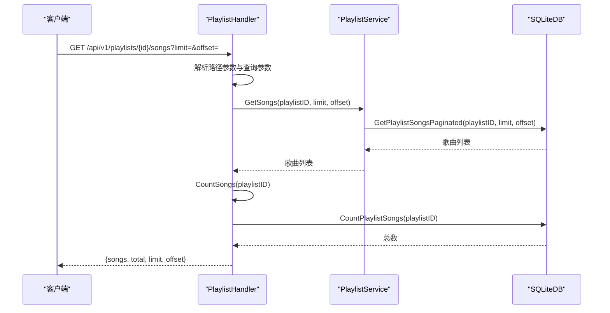
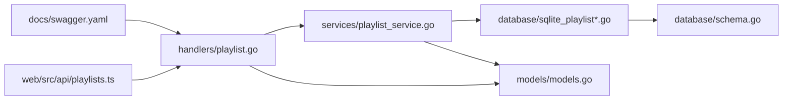

# 歌曲与歌单操作

<cite>
**本文引用的文件**
- [playlist.go](file://internal/handlers/playlist.go)
- [playlist_service.go](file://internal/services/playlist_service.go)
- [sqlite_playlist.go](file://internal/database/sqlite_playlist.go)
- [sqlite_playlist_song.go](file://internal/database/sqlite_playlist_song.go)
- [schema.go](file://internal/database/schema.go)
- [swagger.yaml](file://docs/swagger.yaml)
- [models.go](file://internal/models/models.go)
- [constant.go](file://internal/models/constant.go)
- [playlists.ts](file://web/src/api/playlists.ts)
- [api.ts](file://web/src/types/api.ts)
- [playlist_test.go](file://internal/handlers/playlist_test.go)
</cite>

## 目录
1. [简介](#简介)
2. [项目结构](#项目结构)
3. [核心组件](#核心组件)
4. [架构总览](#架构总览)
5. [详细组件分析](#详细组件分析)
6. [依赖关系分析](#依赖关系分析)
7. [性能考量](#性能考量)
8. [故障排查指南](#故障排查指南)
9. [结论](#结论)
10. [附录](#附录)

## 简介
本文件面向 MiMusic 的“歌曲与歌单操作”API，系统性梳理以下能力：
- 获取歌单中的歌曲（分页）
- 批量添加歌曲到歌单（自动跳过重复）
- 从歌单移除歌曲
- 重新排序歌单中的歌曲
- 歌单内歌曲类型约束与去重机制
- 分页查询参数与性能优化建议
- 完整的请求/响应示例与常见场景说明

## 项目结构
围绕歌单与歌曲操作的关键代码位于如下模块：
- 路由与处理器：internal/handlers/playlist.go
- 业务服务：internal/services/playlist_service.go
- 数据访问层（SQLite）：internal/database/sqlite_playlist*.go
- 数据库模式：internal/database/schema.go
- API 文档：docs/swagger.yaml
- 模型与常量：internal/models/*.go
- 前端调用封装：web/src/api/playlists.ts、web/src/types/api.ts
- 单元测试：internal/handlers/playlist_test.go

```mermaid
graph TB
subgraph "前端"
FE_API["web/src/api/playlists.ts<br/>前端 API 封装"]
FE_TYPES["web/src/types/api.ts<br/>类型定义"]
end
subgraph "后端"
H["handlers/playlist.go<br/>路由与HTTP处理器"]
S["services/playlist_service.go<br/>业务服务"]
DB_SQLITE["database/sqlite_playlist*.go<br/>SQLite 数据访问"]
DB_SCHEMA["database/schema.go<br/>数据库模式"]
MODELS["models/models.go<br/>模型与常量"]
SWAGGER["docs/swagger.yaml<br/>OpenAPI 文档"]
end
FE_API --> H
FE_TYPES --> FE_API
H --> S
S --> DB_SQLITE
DB_SQLITE --> DB_SCHEMA
MODELS --> H
MODELS --> S
SWAGGER --> H
```

图表来源
- [playlist.go:1-473](file://internal/handlers/playlist.go#L1-L473)
- [playlist_service.go:1-213](file://internal/services/playlist_service.go#L1-L213)
- [sqlite_playlist.go:1-487](file://internal/database/sqlite_playlist.go#L1-L487)
- [sqlite_playlist_song.go:1-169](file://internal/database/sqlite_playlist_song.go#L1-L169)
- [schema.go:1-149](file://internal/database/schema.go#L1-L149)
- [swagger.yaml:1117-1300](file://docs/swagger.yaml#L1117-L1300)
- [models.go:1-436](file://internal/models/models.go#L1-L436)

章节来源
- [playlist.go:1-473](file://internal/handlers/playlist.go#L1-L473)
- [playlist_service.go:1-213](file://internal/services/playlist_service.go#L1-L213)
- [sqlite_playlist.go:1-487](file://internal/database/sqlite_playlist.go#L1-L487)
- [sqlite_playlist_song.go:1-169](file://internal/database/sqlite_playlist_song.go#L1-L169)
- [schema.go:1-149](file://internal/database/schema.go#L1-L149)
- [swagger.yaml:1117-1300](file://docs/swagger.yaml#L1117-L1300)
- [models.go:1-436](file://internal/models/models.go#L1-L436)

## 核心组件
- 歌单处理器（PlaylistHandler）：负责接收 HTTP 请求、解析参数、调用服务层，并返回统一格式的响应。
- 歌单服务（PlaylistService）：封装业务逻辑，包括类型约束校验、批量添加去重、重新排序等。
- SQLite 数据层：提供增删改查、分页、统计、位置更新等底层操作。
- OpenAPI 文档：定义接口规范、参数、响应结构与鉴权要求。
- 前端 API 封装：提供与后端一致的请求/响应类型与调用方式。

章节来源
- [playlist.go:15-25](file://internal/handlers/playlist.go#L15-L25)
- [playlist_service.go:11-21](file://internal/services/playlist_service.go#L11-L21)
- [swagger.yaml:1117-1300](file://docs/swagger.yaml#L1117-L1300)
- [playlists.ts:1-99](file://web/src/api/playlists.ts#L1-L99)
- [api.ts:108-129](file://web/src/types/api.ts#L108-L129)

## 架构总览
下图展示“获取歌单歌曲”的典型调用链路，其他接口遵循相同分层与职责划分。

图表来源
- [playlist.go:246-309](file://internal/handlers/playlist.go#L246-L309)
- [playlist_service.go:160-178](file://internal/services/playlist_service.go#L160-L178)
- [sqlite_playlist_song.go:87-128](file://internal/database/sqlite_playlist_song.go#L87-L128)

章节来源
- [playlist.go:246-309](file://internal/handlers/playlist.go#L246-L309)
- [playlist_service.go:160-178](file://internal/services/playlist_service.go#L160-L178)
- [sqlite_playlist_song.go:87-128](file://internal/database/sqlite_playlist_song.go#L87-L128)

## 详细组件分析

### GetPlaylistSongs（获取歌单中的歌曲）
- HTTP 方法与路径
  - 方法：GET
  - 路径：/api/v1/playlists/{id}/songs
- 路径参数
  - id：歌单 ID（整数）
- 查询参数
  - limit：每页数量，默认 20；最大 100000（用于特殊场景）
  - offset：偏移量，默认 0
- 请求示例
  - GET /api/v1/playlists/1/songs?limit=20&offset=0
- 响应结构
  - songs：歌曲数组（按歌单内顺序）
  - total：该歌单歌曲总数
  - limit、offset：分页参数
- 错误场景
  - 无效的歌单 ID：返回 400
  - 服务器内部错误：返回 500
- 性能要点
  - 使用数据库索引与 LIMIT/OFFSET 实现分页
  - 建议前端按需加载，避免一次性拉取过多

章节来源
- [playlist.go:246-309](file://internal/handlers/playlist.go#L246-L309)
- [swagger.yaml:1117-1162](file://docs/swagger.yaml#L1117-L1162)
- [sqlite_playlist_song.go:87-128](file://internal/database/sqlite_playlist_song.go#L87-L128)
- [constant.go:4-14](file://internal/models/constant.go#L4-L14)

### AddSongToPlaylist（批量添加歌曲到歌单）
- HTTP 方法与路径
  - 方法：POST
  - 路径：/api/v1/playlists/{id}/songs
- 路径参数
  - id：歌单 ID（整数）
- 请求体
  - song_ids：整数数组，待添加的歌曲 ID 列表
- 响应结构
  - message：操作提示
  - added：新增成功的歌曲数量
  - skipped：因重复而跳过的歌曲数量
- 业务规则
  - 自动跳过已存在于歌单中的歌曲（基于唯一约束）
  - 严格遵守歌单类型约束：普通歌单仅允许 local/remote；电台歌单仅允许 radio
  - 新增位置为当前末尾（追加）
- 请求示例
  - POST /api/v1/playlists/1/songs
  - Body: {"song_ids":[101,102,103]}
- 响应示例
  - 成功：{"message":"歌曲已添加到歌单","added":2,"skipped":1}
  - 跳过重复：added=2, skipped=1 表示 3 个请求中有 1 个重复
- 错误场景
  - 无效的歌单 ID：返回 400
  - 请求体缺失或格式错误：返回 400
  - 服务器内部错误：返回 500

章节来源
- [playlist.go:311-359](file://internal/handlers/playlist.go#L311-L359)
- [swagger.yaml:1163-1210](file://docs/swagger.yaml#L1163-L1210)
- [playlist_service.go:139-149](file://internal/services/playlist_service.go#L139-L149)
- [playlist_service.go:104-137](file://internal/services/playlist_service.go#L104-L137)
- [sqlite_playlist.go:49-90](file://internal/database/sqlite_playlist.go#L49-L90)
- [sqlite_playlist_song.go:10-23](file://internal/database/sqlite_playlist_song.go#L10-L23)
- [models.go:162-174](file://internal/models/models.go#L162-L174)

### RemoveSongFromPlaylist（从歌单移除歌曲）
- HTTP 方法与路径
  - 方法：DELETE
  - 路径：/api/v1/playlists/{id}/songs/{songId}
- 路径参数
  - id：歌单 ID（整数）
  - songId：歌曲 ID（整数）
- 响应结构
  - message：移除成功提示
- 错误场景
  - 无效的歌单 ID 或歌曲 ID：返回 400
  - 歌曲不在歌单中：返回 500（底层返回“未找到”）

章节来源
- [playlist.go:361-399](file://internal/handlers/playlist.go#L361-L399)
- [swagger.yaml:1210-1251](file://docs/swagger.yaml#L1210-L1251)
- [sqlite_playlist_song.go:25-43](file://internal/database/sqlite_playlist_song.go#L25-L43)

### ReorderPlaylistSongs（重新排序歌单中的歌曲）
- HTTP 方法与路径
  - 方法：PUT
  - 路径：/api/v1/playlists/{id}/songs/reorder
- 路径参数
  - id：歌单 ID（整数）
- 请求体
  - song_ids：整数数组，按新顺序排列的歌曲 ID 列表
- 业务规则
  - 必须包含歌单中全部歌曲（数量一致）
  - 逐一更新每首歌曲在歌单中的 position
- 响应结构
  - message：排序成功提示
- 错误场景
  - 无效的歌单 ID：返回 400
  - 请求体格式错误：返回 400
  - 歌曲数量不匹配：返回 500
  - 服务器内部错误：返回 500

章节来源
- [playlist.go:401-441](file://internal/handlers/playlist.go#L401-L441)
- [swagger.yaml:1252-1300](file://docs/swagger.yaml#L1252-L1300)
- [playlist_service.go:180-201](file://internal/services/playlist_service.go#L180-L201)
- [sqlite_playlist_song.go:147-168](file://internal/database/sqlite_playlist_song.go#L147-L168)

### 歌单类型约束与去重机制
- 类型约束
  - 普通歌单（normal）：仅允许 local 与 remote 歌曲
  - 电台歌单（radio）：仅允许 radio 歌曲
- 去重机制
  - 关联表 playlist_songs 对 (playlist_id, song_id) 建有唯一约束
  - 重复添加不会报错，但会被计入 skipped
- 位置策略
  - 单次添加：追加到末尾
  - 批量添加：按传入顺序依次追加
  - 重新排序：根据 song_ids 数组逐项更新 position

章节来源
- [models.go:162-174](file://internal/models/models.go#L162-L174)
- [schema.go:42-51](file://internal/database/schema.go#L42-L51)
- [playlist_service.go:139-149](file://internal/services/playlist_service.go#L139-L149)
- [sqlite_playlist_song.go:10-23](file://internal/database/sqlite_playlist_song.go#L10-L23)

### 分页查询参数与性能优化
- 分页参数
  - limit：每页数量，默认 20；最大 100000（用于“获取全部”类场景）
  - offset：偏移量，默认 0
- 建议
  - 前端采用“懒加载/滚动加载”策略，按需增量拉取
  - 合理设置 limit（如 50/100），避免过大影响响应时间
  - 使用 total 与 limit/offset 计算页码与“加载更多”
- 数据库层面
  - 歌单歌曲查询使用索引列（playlist_id, position）进行排序与分页
  - 统计总数使用 COUNT(*) 聚合查询

章节来源
- [playlist.go:270-287](file://internal/handlers/playlist.go#L270-L287)
- [playlist_service.go:160-178](file://internal/services/playlist_service.go#L160-L178)
- [sqlite_playlist_song.go:87-128](file://internal/database/sqlite_playlist_song.go#L87-L128)
- [constant.go:4-14](file://internal/models/constant.go#L4-L14)

### 前端调用参考
- 前端封装了常用操作（获取歌单歌曲、添加歌曲、移除歌曲、重新排序），类型与后端保持一致
- 前端示例
  - 获取歌单歌曲：getPlaylistSongs(id, {limit, offset})
  - 批量添加：addSongToPlaylist(id, {song_ids})
  - 移除歌曲：removeSongFromPlaylist(id, songId)
  - 重新排序：reorderPlaylistSongs(id, {song_ids})

章节来源
- [playlists.ts:63-84](file://web/src/api/playlists.ts#L63-L84)
- [api.ts:283-291](file://web/src/types/api.ts#L283-L291)

## 依赖关系分析
- 处理器依赖服务层，服务层依赖数据库层
- OpenAPI 文档定义了接口契约，前后端通过文档对齐
- 模型与常量为跨层共享的数据结构与默认值

图表来源
- [playlist.go:1-473](file://internal/handlers/playlist.go#L1-L473)
- [playlist_service.go:1-213](file://internal/services/playlist_service.go#L1-L213)
- [sqlite_playlist.go:1-487](file://internal/database/sqlite_playlist.go#L1-L487)
- [sqlite_playlist_song.go:1-169](file://internal/database/sqlite_playlist_song.go#L1-L169)
- [schema.go:1-149](file://internal/database/schema.go#L1-L149)
- [swagger.yaml:1117-1300](file://docs/swagger.yaml#L1117-L1300)
- [models.go:1-436](file://internal/models/models.go#L1-L436)
- [playlists.ts:1-99](file://web/src/api/playlists.ts#L1-L99)

章节来源
- [playlist.go:1-473](file://internal/handlers/playlist.go#L1-L473)
- [playlist_service.go:1-213](file://internal/services/playlist_service.go#L1-L213)
- [swagger.yaml:1117-1300](file://docs/swagger.yaml#L1117-L1300)

## 性能考量
- 分页与索引
  - 使用 LIMIT/OFFSET 与索引 (playlist_id, position) 控制查询范围
- 批量操作
  - 批量添加采用循环逐条尝试，重复项被跳过；若需更高吞吐，可在服务层引入更高效的去重与批量插入策略
- 重新排序
  - 逐项更新 position，适合中小规模歌单；大规模歌单可考虑一次性批量更新（需谨慎处理并发与一致性）
- 前端体验
  - 按需加载、缓存分页结果、避免重复请求

## 故障排查指南
- 常见错误与定位
  - 400 无效 ID：检查路径参数 id 与 songId 是否为合法整数
  - 400 请求体错误：确认请求体为 JSON，且包含正确的字段（如 song_ids）
  - 500 服务器错误：关注服务层与数据库层日志，定位具体 SQL 执行异常
- 单元测试参考
  - 可参考测试文件中的断言与场景构造，帮助定位边界情况（如无效 ID、无效 JSON、重复添加等）

章节来源
- [playlist_test.go:529-783](file://internal/handlers/playlist_test.go#L529-L783)

## 结论
MiMusic 的歌单与歌曲操作接口设计清晰、职责分明：处理器负责协议与参数解析，服务层承载业务规则（类型约束、去重、排序），数据层提供高效查询与更新。结合 OpenAPI 文档与前端封装，开发者可快速集成“获取歌曲列表、批量添加、移除、重新排序”等核心能力。建议在生产环境中配合合理的分页策略与前端懒加载，确保良好的用户体验与系统性能。

## 附录

### API 定义速览（HTTP 方法、路径、参数、响应）
- 获取歌单中的歌曲
  - GET /api/v1/playlists/{id}/songs?limit=&offset=
  - 响应：songs、total、limit、offset
- 批量添加歌曲到歌单
  - POST /api/v1/playlists/{id}/songs
  - 请求体：{song_ids: [int64...]}
  - 响应：{message, added, skipped}
- 从歌单移除歌曲
  - DELETE /api/v1/playlists/{id}/songs/{songId}
  - 响应：{message}
- 重新排序歌单中的歌曲
  - PUT /api/v1/playlists/{id}/songs/reorder
  - 请求体：{song_ids: [int64...]}
  - 响应：{message}

章节来源
- [swagger.yaml:1117-1300](file://docs/swagger.yaml#L1117-L1300)
- [playlist.go:246-441](file://internal/handlers/playlist.go#L246-L441)