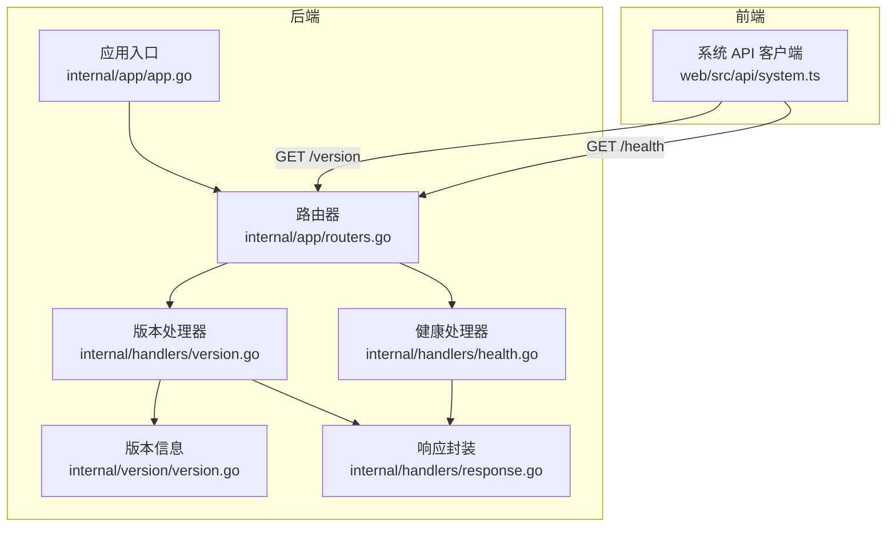
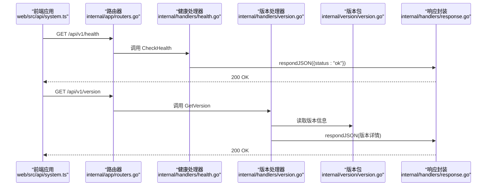
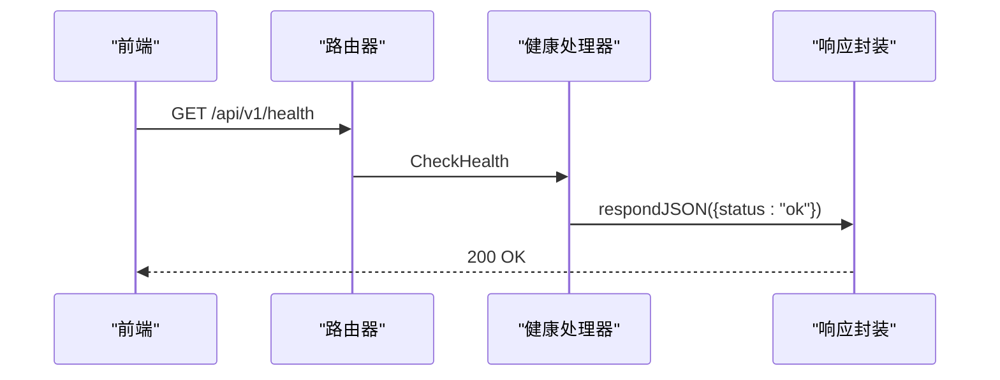
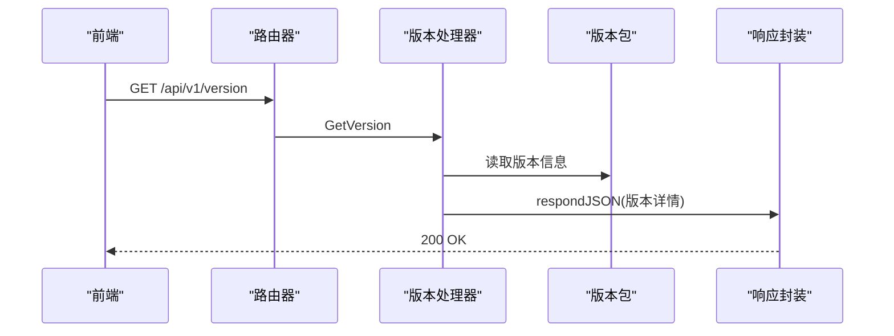
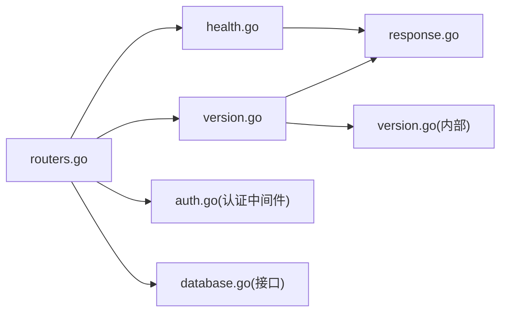
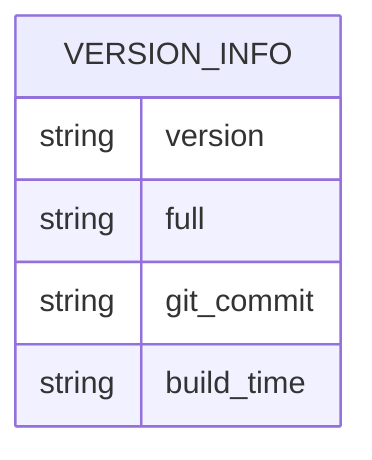

# 系统健康 API

<cite>
**本文引用的文件**
- [internal/handlers/health.go](file://internal/handlers/health.go)
- [internal/handlers/version.go](file://internal/handlers/version.go)
- [internal/app/routers.go](file://internal/app/routers.go)
- [internal/version/version.go](file://internal/version/version.go)
- [internal/app/app.go](file://internal/app/app.go)
- [internal/handlers/response.go](file://internal/handlers/response.go)
- [web/src/api/system.ts](file://web/src/api/system.ts)
- [internal/middleware/auth.go](file://internal/middleware/auth.go)
- [internal/database/database.go](file://internal/database/database.go)
- [internal/services/scan_progress.go](file://internal/services/scan_progress.go)
</cite>

## 目录
1. [简介](#简介)
2. [项目结构](#项目结构)
3. [核心组件](#核心组件)
4. [架构总览](#架构总览)
5. [详细组件分析](#详细组件分析)
6. [依赖关系分析](#依赖关系分析)
7. [性能考量](#性能考量)
8. [故障排查指南](#故障排查指南)
9. [结论](#结论)
10. [附录](#附录)

## 简介
本文件面向 MiMusic 系统的“健康 API”，聚焦以下能力：
- 健康检查接口：用于服务可用性检测，快速判断服务是否正常运行。
- 版本查询接口：返回当前版本号、完整版本信息、Git 提交哈希、构建时间等。
- 系统状态接口：当前实现为健康检查，后续可扩展为内存、CPU、网络连接数等性能指标。
- 日志接口：当前未提供专用日志接口，但系统具备统一日志记录与错误上报能力。

说明：
- 文档严格基于仓库现有实现进行梳理与说明，不臆造不存在的功能。
- 对于“系统状态”“日志接口”等当前未实现的功能，将以“待扩展”的形式给出建议与最佳实践。

## 项目结构
围绕健康 API 的关键文件组织如下：
- 路由注册：在 API v1 路由组中注册 /health 与 /version。
- 处理器：分别实现健康检查与版本查询。
- 版本信息：通过内部 version 包注入版本元数据。
- 响应封装：统一 JSON 响应与错误响应格式。
- 前端调用：前端通过 system.ts 统一发起 /health 与 /version 请求。

图示来源
- [internal/app/routers.go:28-49](file://internal/app/routers.go#L28-L49)
- [internal/handlers/health.go:15-27](file://internal/handlers/health.go#L15-L27)
- [internal/handlers/version.go:17-34](file://internal/handlers/version.go#L17-L34)
- [internal/version/version.go:10-18](file://internal/version/version.go#L10-L18)
- [internal/handlers/response.go:8-24](file://internal/handlers/response.go#L8-L24)
- [web/src/api/system.ts:5-12](file://web/src/api/system.ts#L5-L12)

章节来源
- [internal/app/routers.go:28-49](file://internal/app/routers.go#L28-L49)
- [internal/handlers/health.go:15-27](file://internal/handlers/health.go#L15-L27)
- [internal/handlers/version.go:17-34](file://internal/handlers/version.go#L17-L34)
- [internal/version/version.go:10-18](file://internal/version/version.go#L10-L18)
- [internal/handlers/response.go:8-24](file://internal/handlers/response.go#L8-L24)
- [web/src/api/system.ts:5-12](file://web/src/api/system.ts#L5-L12)

## 核心组件
- 健康检查处理器
  - 路由：/api/v1/health（GET）
  - 功能：返回服务健康状态，当前为简单“ok”标记。
  - 实现位置：[internal/handlers/health.go:15-27](file://internal/handlers/health.go#L15-L27)
- 版本查询处理器
  - 路由：/api/v1/version（GET）
  - 功能：返回版本号、完整版本信息、Git 提交哈希、构建时间。
  - 实现位置：[internal/handlers/version.go:17-34](file://internal/handlers/version.go#L17-L34)
- 路由注册
  - 在 API v1 路由组中注册上述两个接口。
  - 实现位置：[internal/app/routers.go:28-49](file://internal/app/routers.go#L28-L49)
- 响应封装
  - 统一 JSON Content-Type 与编码，简化响应构造。
  - 实现位置：[internal/handlers/response.go:8-24](file://internal/handlers/response.go#L8-L24)
- 版本信息来源
  - 通过内部 version 包提供版本元数据，编译时注入。
  - 实现位置：[internal/version/version.go:10-18](file://internal/version/version.go#L10-L18)

章节来源
- [internal/handlers/health.go:15-27](file://internal/handlers/health.go#L15-L27)
- [internal/handlers/version.go:17-34](file://internal/handlers/version.go#L17-L34)
- [internal/app/routers.go:28-49](file://internal/app/routers.go#L28-L49)
- [internal/handlers/response.go:8-24](file://internal/handlers/response.go#L8-L24)
- [internal/version/version.go:10-18](file://internal/version/version.go#L10-L18)

## 架构总览
健康 API 的调用链路如下：

图示来源
- [internal/app/routers.go:28-49](file://internal/app/routers.go#L28-L49)
- [internal/handlers/health.go:15-27](file://internal/handlers/health.go#L15-L27)
- [internal/handlers/version.go:17-34](file://internal/handlers/version.go#L17-L34)
- [internal/version/version.go:10-18](file://internal/version/version.go#L10-L18)
- [internal/handlers/response.go:8-24](file://internal/handlers/response.go#L8-L24)
- [web/src/api/system.ts:5-12](file://web/src/api/system.ts#L5-L12)

## 详细组件分析

### 健康检查接口
- 接口定义
  - 方法：GET
  - 路径：/api/v1/health
  - 认证：无需认证
  - 成功响应：返回状态码 200，主体包含健康状态字段
- 处理流程
  - 路由注册后，直接调用处理器的 CheckHealth 方法
  - 处理器构造固定结构的响应并返回
- 前端调用
  - 通过 system.ts 的 checkHealth 方法发起请求
- 适用场景
  - 健康探针、容器编排健康检查、负载均衡器探测
- 可扩展方向
  - 增加数据库连通性检查、磁盘空间监控、外部依赖可用性检查
  - 返回更丰富的指标（如 uptime、进程 PID、线程数等）

图示来源
- [internal/app/routers.go:48-49](file://internal/app/routers.go#L48-L49)
- [internal/handlers/health.go:15-27](file://internal/handlers/health.go#L15-L27)
- [internal/handlers/response.go:8-24](file://internal/handlers/response.go#L8-L24)
- [web/src/api/system.ts:9-12](file://web/src/api/system.ts#L9-L12)

章节来源
- [internal/app/routers.go:48-49](file://internal/app/routers.go#L48-L49)
- [internal/handlers/health.go:15-27](file://internal/handlers/health.go#L15-L27)
- [internal/handlers/response.go:8-24](file://internal/handlers/response.go#L8-L24)
- [web/src/api/system.ts:9-12](file://web/src/api/system.ts#L9-L12)

### 版本查询接口
- 接口定义
  - 方法：GET
  - 路径：/api/v1/version
  - 认证：无需认证
  - 成功响应：返回状态码 200，主体包含版本相关信息
- 处理流程
  - 路由注册后，调用处理器的 GetVersion 方法
  - 处理器从 version 包读取版本信息并返回
- 前端调用
  - 通过 system.ts 的 getVersion 方法发起请求
- 版本信息来源
  - 编译时通过链接标志注入版本、提交哈希、构建时间
  - 运行时通过 version 包提供的方法读取

图示来源
- [internal/app/routers.go:45-46](file://internal/app/routers.go#L45-L46)
- [internal/handlers/version.go:17-34](file://internal/handlers/version.go#L17-L34)
- [internal/version/version.go:10-18](file://internal/version/version.go#L10-L18)
- [internal/handlers/response.go:8-24](file://internal/handlers/response.go#L8-L24)
- [web/src/api/system.ts:4-7](file://web/src/api/system.ts#L4-L7)

章节来源
- [internal/app/routers.go:45-46](file://internal/app/routers.go#L45-L46)
- [internal/handlers/version.go:17-34](file://internal/handlers/version.go#L17-L34)
- [internal/version/version.go:10-18](file://internal/version/version.go#L10-L18)
- [internal/handlers/response.go:8-24](file://internal/handlers/response.go#L8-L24)
- [web/src/api/system.ts:4-7](file://web/src/api/system.ts#L4-L7)

### 系统状态接口（当前实现与扩展建议）
- 当前实现
  - 仅提供健康检查接口，返回服务可用性标记
- 扩展建议（待实现）
  - 内存使用：RSS、堆内存、GC 统计
  - CPU 占用：系统平均负载、进程 CPU 百分比
  - 磁盘空间：可用空间、inode 使用率
  - 网络连接：活跃连接数、连接状态分布
  - 数据库连接池：活跃/空闲连接数、等待队列长度
  - 扫描任务：扫描状态、进度、错误统计
- 设计要点
  - 新增 /api/v1/status（GET），返回聚合指标
  - 采用分层指标：系统级、应用级、业务级
  - 支持按指标维度筛选与时间窗口聚合

[本节为概念性扩展说明，不涉及具体文件分析，故无章节来源]

### 日志接口（当前实现与扩展建议）
- 当前实现
  - 未提供专用日志接口；系统通过统一日志记录中间件输出访问日志
  - 错误通过 Recoverer 中间件捕获并上报至 Tracely
- 扩展建议（待实现）
  - 提供 /api/v1/logs（GET）：返回系统日志、错误日志、访问日志片段
  - 支持过滤：时间范围、级别、关键词
  - 支持导出：CSV/JSON 下载
- 设计要点
  - 日志采集：集中式日志收集器（如 Loki、ELK）
  - 权限控制：仅允许授权用户访问日志接口
  - 安全考虑：脱敏敏感信息、限制日志粒度

[本节为概念性扩展说明，不涉及具体文件分析，故无章节来源]

## 依赖关系分析
- 路由到处理器
  - 路由器在 API v1 组中注册健康与版本处理器
- 处理器到版本包
  - 版本处理器依赖 version 包读取版本元数据
- 处理器到响应封装
  - 两者均依赖统一 JSON 响应封装
- 认证与安全
  - 路由器配置了 CORS、panic 捕获、恢复中间件
  - 认证中间件用于受保护接口，健康与版本接口无需认证

图示来源
- [internal/app/routers.go:28-49](file://internal/app/routers.go#L28-L49)
- [internal/handlers/health.go:15-27](file://internal/handlers/health.go#L15-L27)
- [internal/handlers/version.go:17-34](file://internal/handlers/version.go#L17-L34)
- [internal/version/version.go:10-18](file://internal/version/version.go#L10-L18)
- [internal/handlers/response.go:8-24](file://internal/handlers/response.go#L8-L24)
- [internal/middleware/auth.go:11-51](file://internal/middleware/auth.go#L11-L51)
- [internal/database/database.go:8-64](file://internal/database/database.go#L8-L64)

章节来源
- [internal/app/routers.go:28-49](file://internal/app/routers.go#L28-L49)
- [internal/handlers/health.go:15-27](file://internal/handlers/health.go#L15-L27)
- [internal/handlers/version.go:17-34](file://internal/handlers/version.go#L17-L34)
- [internal/version/version.go:10-18](file://internal/version/version.go#L10-L18)
- [internal/handlers/response.go:8-24](file://internal/handlers/response.go#L8-L24)
- [internal/middleware/auth.go:11-51](file://internal/middleware/auth.go#L11-L51)
- [internal/database/database.go:8-64](file://internal/database/database.go#L8-L64)

## 性能考量
- 健康检查开销
  - 当前实现为纯内存操作，延迟极低，适合高频探测
- 版本查询开销
  - 仅读取内存中的版本变量，几乎无性能影响
- 建议
  - 将健康检查加入容器编排的存活/就绪探针，探测间隔建议 10–30 秒
  - 版本查询适合在前端首次加载或手动触发，避免频繁轮询

[本节提供通用指导，不涉及具体文件分析，故无章节来源]

## 故障排查指南
- 健康检查失败
  - 现象：/api/v1/health 返回非 200 或异常
  - 排查步骤
    - 检查服务进程是否正常运行
    - 查看访问日志与错误日志（见下文）
    - 确认路由注册是否正确
- 版本查询异常
  - 现象：/api/v1/version 返回异常或缺失字段
  - 排查步骤
    - 确认编译时版本信息注入是否生效
    - 检查处理器与响应封装逻辑
- 日志与错误上报
  - 系统在启动时初始化统一日志记录器
  - panic 会被捕获并通过 Tracely 上报
  - 前端可通过工具函数主动上报错误
- 建议的健康检查标准
  - 响应时间：<100ms
  - 状态码：200
  - 响应体：包含明确的健康状态字段
- 建议的监控指标定义
  - 健康状态：ok / fail
  - 响应时间：p50/p95
  - 错误率：非 2xx 比例
- 告警机制
  - 健康检查连续失败阈值（如 3 次）
  - 响应时间超阈值（如 >500ms）
  - 错误率超阈值（如 >1%）

章节来源
- [internal/app/app.go:64-67](file://internal/app/app.go#L64-L67)
- [internal/app/app.go:155-172](file://internal/app/app.go#L155-L172)
- [web/src/utils/error.ts:6-11](file://web/src/utils/error.ts#L6-L11)

## 结论
- 当前健康 API 已具备基础能力：健康检查与版本查询，满足服务可用性与版本透明化需求。
- 系统具备完善的日志与错误上报基础设施，为后续扩展系统状态与日志接口提供了良好基础。
- 建议优先实现系统状态接口（内存/CPU/磁盘/网络），再扩展日志接口，以形成闭环的可观测性体系。

[本节为总结性内容，不涉及具体文件分析，故无章节来源]

## 附录

### API 规范概览
- 健康检查
  - 方法：GET
  - 路径：/api/v1/health
  - 认证：否
  - 成功响应：200，主体包含健康状态字段
- 版本查询
  - 方法：GET
  - 路径：/api/v1/version
  - 认证：否
  - 成功响应：200，主体包含版本号、完整版本信息、Git 提交哈希、构建时间

章节来源
- [internal/app/routers.go:45-49](file://internal/app/routers.go#L45-L49)
- [internal/handlers/health.go:15-27](file://internal/handlers/health.go#L15-L27)
- [internal/handlers/version.go:17-34](file://internal/handlers/version.go#L17-L34)

### 数据模型（版本信息）

图示来源
- [internal/handlers/version.go:26-31](file://internal/handlers/version.go#L26-L31)
- [internal/version/version.go:10-18](file://internal/version/version.go#L10-L18)