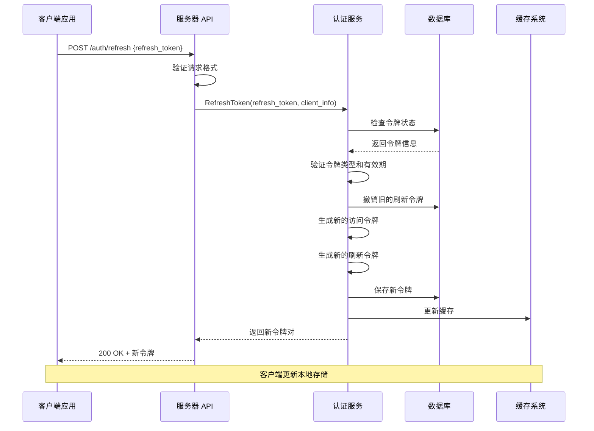
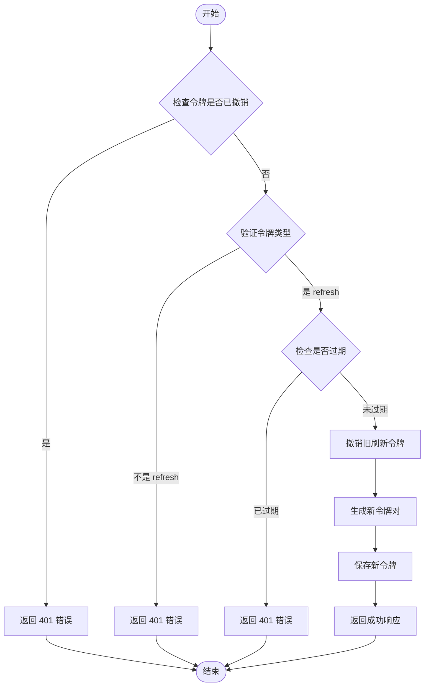
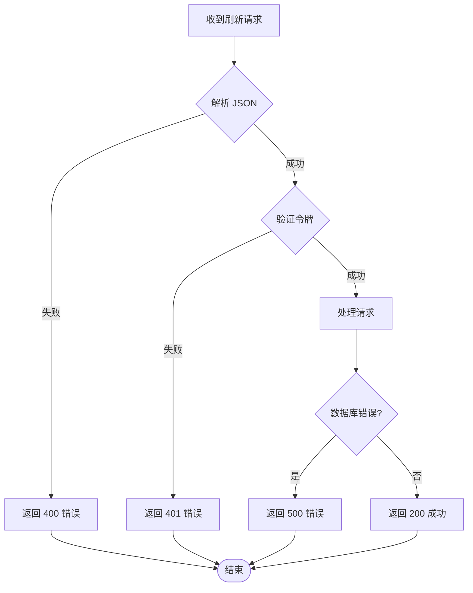
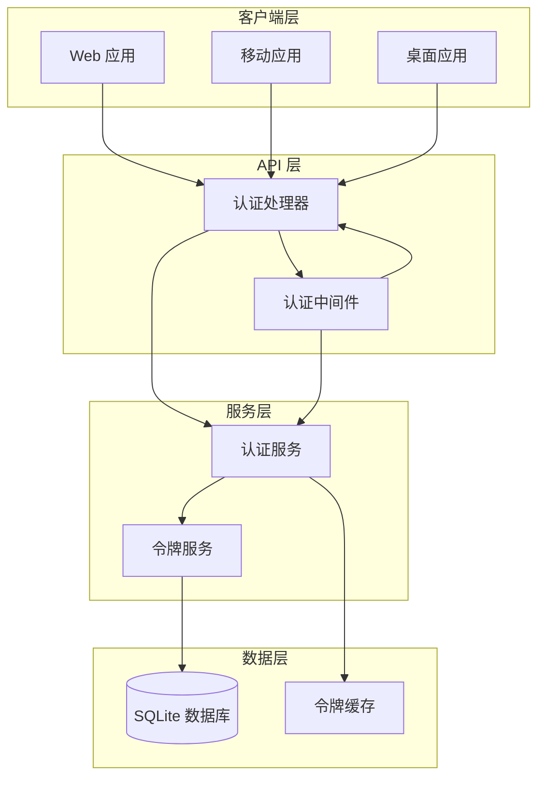
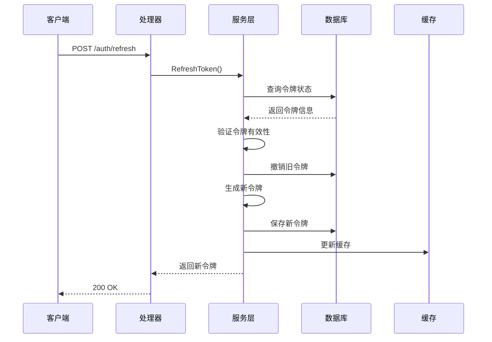

# 令牌刷新接口

<cite>
**本文档引用的文件**
- [auth.go](file://internal/handlers/auth.go)
- [auth_service.go](file://internal/services/auth_service.go)
- [auth.go](file://internal/middleware/auth.go)
- [models.go](file://internal/models/models.go)
- [sqlite_token.go](file://internal/database/sqlite_token.go)
- [auth_api.dart](file://frontend/lib/core/network/auth_interceptor.dart)
- [auth_api.dart](file://frontend/lib/features/auth/data/auth_api.dart)
- [auth_interceptor.dart](file://frontend/lib/core/network/auth_interceptor.dart)
- [auth_test.go](file://internal/handlers/auth_test.go)
</cite>

## 目录
1. [简介](#简介)
2. [接口概述](#接口概述)
3. [请求参数](#请求参数)
4. [响应数据结构](#响应数据结构)
5. [错误码说明](#错误码说明)
6. [令牌刷新流程](#令牌刷新流程)
7. [令牌轮换机制](#令牌轮换机制)
8. [安全最佳实践](#安全最佳实践)
9. [实际使用示例](#实际使用示例)
10. [异常处理与降级策略](#异常处理与降级策略)
11. [架构设计](#架构设计)
12. [性能考虑](#性能考虑)
13. [故障排除指南](#故障排除指南)
14. [总结](#总结)

## 简介

MiMusic 的令牌刷新接口是一个关键的安全组件，负责使用刷新令牌（Refresh Token）获取新的访问令牌（Access Token）。该接口实现了 OAuth 2.0 标准的令牌刷新流程，确保用户会话的连续性和安全性。

## 接口概述

### 基本信息
- **接口地址**: `/auth/refresh`
- **HTTP 方法**: POST
- **内容类型**: application/json
- **认证要求**: 无需认证
- **功能描述**: 使用刷新令牌获取新的访问令牌

### 接口特性
- 支持标准的 OAuth 2.0 令牌刷新流程
- 实现令牌撤销检查和过期验证
- 提供客户端信息更新功能
- 支持并发刷新保护
- 实现智能错误处理和降级策略

## 请求参数

### 请求体结构

| 参数名 | 类型 | 必填 | 描述 | 示例值 |
|--------|------|------|------|--------|
| refresh_token | string | 是 | 用于刷新访问令牌的刷新令牌 | `"eyJhbGciOiJIUzI1NiIsInR5cCI6IkpXVCJ9..."` |

### 请求示例

```json
{
  "refresh_token": "eyJhbGciOiJIUzI1NiIsInR5cCI6IkpXVCJ9..."
}
```

### 参数验证规则

- **必填性**: refresh_token 字段必须存在且非空
- **格式**: 必须是有效的 JWT 令牌格式
- **长度**: 令牌长度应在合理范围内
- **编码**: 必须是 Base64 编码的有效字符串

## 响应数据结构

### 成功响应

| 字段名 | 类型 | 描述 | 示例值 |
|--------|------|------|--------|
| access_token | string | 新生成的访问令牌 | `"eyJhbGciOiJIUzI1NiIsInR5cCI6IkpXVCJ9..."` |
| refresh_token | string | 新生成的刷新令牌 | `"eyJhbGciOiJIUzI1NiIsInR5cCI6IkpXVCJ9..."` |
| expires_in | integer | 访问令牌过期时间（秒） | `604800` |
| token_type | string | 令牌类型标识 | `"Bearer"` |

### 响应示例

```json
{
  "access_token": "eyJhbGciOiJIUzI1NiIsInR5cCI6IkpXVCJ9...",
  "refresh_token": "eyJhbGciOiJIUzI1NiIsInR5cCI6IkpXVCJ9...",
  "expires_in": 604800,
  "token_type": "Bearer"
}
```

### 响应字段说明

- **access_token**: 用于 API 认证的短期访问令牌，有效期 7 天
- **refresh_token**: 用于获取新访问令牌的长期刷新令牌，有效期 30 天
- **expires_in**: 访问令牌剩余有效期（秒），用于客户端本地缓存
- **token_type**: 令牌类型标识，通常为 "Bearer"

## 错误码说明

### HTTP 状态码

| 状态码 | 错误类型 | 描述 | 处理建议 |
|--------|----------|------|----------|
| 200 | 成功 | 令牌刷新成功 | 验证新令牌并更新本地存储 |
| 400 | 请求错误 | 无效的请求数据或参数 | 检查请求格式和必需字段 |
| 401 | 认证错误 | 刷新令牌无效或已撤销 | 引导用户重新登录 |
| 500 | 服务器错误 | 服务器内部错误 | 重试请求或联系管理员 |

### 错误响应结构

```json
{
  "error": "错误描述信息",
  "detail": "详细错误信息（可选）"
}
```

### 常见错误场景

1. **无效的 JSON 格式**: 请求体不是有效的 JSON
2. **缺失 refresh_token**: 请求中缺少必要的令牌字段
3. **无效的令牌格式**: refresh_token 不是有效的 JWT 令牌
4. **令牌已被撤销**: 刷新令牌已被手动撤销
5. **令牌已过期**: 刷新令牌超过 30 天有效期
6. **数据库连接失败**: 无法访问令牌存储数据库

## 令牌刷新流程

### 核心流程图



### 详细处理步骤

1. **请求接收与验证**
   - 解析 JSON 请求体
   - 验证 refresh_token 字段存在性
   - 验证 JSON 格式有效性

2. **令牌状态检查**
   - 检查刷新令牌是否已被撤销
   - 验证令牌类型是否为 "refresh"
   - 检查令牌是否仍在有效期内

3. **旧令牌处理**
   - 撤销旧的刷新令牌
   - 清除相关的缓存条目
   - 确保安全的令牌轮换

4. **新令牌生成**
   - 生成新的访问令牌（7天有效期）
   - 生成新的刷新令牌（30天有效期）
   - 保持相同的客户端信息

5. **存储与响应**
   - 将新令牌对保存到数据库
   - 返回给客户端新的令牌组合
   - 更新内存缓存

## 令牌轮换机制

### 令牌生命周期



### 安全特性

1. **单次使用原则**: 旧的刷新令牌在成功刷新后立即失效
2. **时间窗口限制**: 刷新令牌有效期为 30 天
3. **客户端信息绑定**: 新令牌继承原始客户端信息
4. **原子性操作**: 令牌轮换在单个事务中完成
5. **缓存一致性**: 内存缓存与数据库状态保持同步

### 并发处理

- **并发刷新保护**: 防止多个并发请求同时刷新令牌
- **互斥锁机制**: 使用标志位防止重复刷新
- **等待队列**: 其他请求等待第一个刷新完成
- **超时处理**: 防止无限期等待

## 安全最佳实践

### 传输安全

1. **HTTPS 强制**: 所有令牌交换必须通过 HTTPS
2. **证书验证**: 确保服务器证书有效且受信任
3. **HSTS 支持**: 启用 HTTP Strict Transport Security

### 存储安全

1. **客户端存储**: 使用安全的本地存储机制
2. **内存保护**: 敏感令牌不在磁盘上持久化
3. **加密存储**: 必要时对敏感数据进行加密

### 令牌管理

1. **最小权限原则**: 访问令牌权限范围最小化
2. **定期轮换**: 建议定期刷新令牌以降低风险
3. **撤销机制**: 支持主动撤销令牌的能力

### 错误处理

1. **信息最小化**: 错误响应不泄露敏感信息
2. **日志记录**: 记录安全相关事件但不记录令牌内容
3. **监控告警**: 监控异常的令牌刷新模式

## 实际使用示例

### 前端集成示例

```dart
// 刷新令牌的完整流程
Future<void> refreshToken() async {
  try {
    // 从安全存储获取刷新令牌
    final refreshToken = await secureStorage.getRefreshToken();
    
    if (refreshToken == null || refreshToken.isEmpty) {
      // 刷新令牌不存在，引导用户重新登录
      await handleTokenExpired();
      return;
    }
    
    // 发送刷新请求
    final response = await dio.post(
      '${AppConfig.apiPrefix}/auth/refresh',
      data: {'refresh_token': refreshToken},
      options: Options(
        extra: {'skipAuth': true}, // 跳过认证拦截器，避免循环
      ),
    );
    
    if (response.statusCode == 200 && response.data != null) {
      // 解析新令牌
      final tokens = AuthTokens.fromJson(response.data);
      
      // 更新本地存储
      await secureStorage.saveTokens(
        accessToken: tokens.accessToken,
        refreshToken: tokens.refreshToken,
        expiresIn: tokens.expiresIn,
      );
      
      // 重试原始请求
      return true;
    }
    
    // 刷新失败，处理过期
    await handleTokenExpired();
    return false;
    
  } catch (e) {
    // 处理网络错误或其他异常
    await handleTokenExpired();
    return false;
  }
}
```

### 后端处理示例

```go
// 后端处理器实现
func (h *AuthHandler) RefreshToken(w http.ResponseWriter, r *http.Request) {
    ctx := r.Context()
    
    // 解析请求体
    var req models.RefreshTokenRequest
    if err := json.NewDecoder(r.Body).Decode(&req); err != nil {
        respondError(w, http.StatusBadRequest, "无效的请求数据", err)
        return
    }
    
    // 获取客户端信息
    clientInfo := getClientInfo(r)
    
    // 执行刷新
    resp, err := h.authService.RefreshToken(ctx, req.RefreshToken, clientInfo)
    if err != nil {
        respondError(w, http.StatusUnauthorized, "刷新令牌无效", err)
        return
    }
    
    respondJSON(w, http.StatusOK, resp)
}
```

### 错误处理示例

```dart
// 错误处理和重试机制
void handleDioError(DioException error) {
  switch (error.response?.statusCode) {
    case 400:
      // 请求格式错误，可能是令牌格式问题
      showErrorDialog('请求格式错误，请重新登录');
      break;
    case 401:
      // 令牌无效，尝试刷新
      if (await refreshToken()) {
        // 刷新成功，重试原请求
        retryOriginalRequest();
      } else {
        // 刷新失败，引导用户重新登录
        navigateToLogin();
      }
      break;
    case 500:
      // 服务器错误，显示错误信息
      showErrorDialog('服务器暂时不可用，请稍后重试');
      break;
    default:
      handleError(error);
  }
}
```

## 异常处理与降级策略

### 异常分类

1. **请求级异常**
   - JSON 解析失败
   - 缺少必需参数
   - 无效的令牌格式

2. **业务级异常**
   - 令牌已被撤销
   - 令牌已过期
   - 令牌类型不正确

3. **系统级异常**
   - 数据库连接失败
   - JWT 解析错误
   - 内存缓存问题

### 降级策略



### 客户端降级策略

1. **自动重试**: 在网络波动时自动重试
2. **指数退避**: 重试间隔按指数增长
3. **最大重试次数**: 防止无限重试
4. **用户通知**: 适当时机通知用户网络状况

## 架构设计

### 系统架构图



### 组件交互

1. **请求路由**: 所有 /auth/* 请求由 AuthHandler 处理
2. **认证中间件**: 验证访问令牌的有效性
3. **服务层**: 实现业务逻辑和令牌管理
4. **数据持久化**: 使用 SQLite 存储令牌信息
5. **缓存层**: 内存缓存提高性能

### 数据流



## 性能考虑

### 性能优化

1. **内存缓存**
   - 使用 sync.Map 实现高性能缓存
   - 自动清理过期缓存条目
   - 支持并发访问

2. **数据库优化**
   - 使用预编译语句减少解析开销
   - 合理的索引设计
   - 连接池管理

3. **网络优化**
   - 压缩响应数据
   - 合理的超时设置
   - 连接复用

### 监控指标

- **请求延迟**: 令牌刷新的平均响应时间
- **错误率**: 401、500 错误的比例
- **缓存命中率**: 内存缓存的效率
- **数据库性能**: 查询和写入的性能指标

## 故障排除指南

### 常见问题诊断

1. **400 错误排查**
   - 检查请求 JSON 格式
   - 验证 refresh_token 字段存在
   - 确认 Content-Type 设置为 application/json

2. **401 错误排查**
   - 验证刷新令牌是否有效
   - 检查令牌是否已被撤销
   - 确认令牌是否仍在有效期内

3. **500 错误排查**
   - 检查数据库连接状态
   - 验证 JWT 密钥配置
   - 查看服务器日志

### 调试工具

```bash
# 使用 curl 测试接口
curl -X POST https://your-server.com/api/v1/auth/refresh \
  -H "Content-Type: application/json" \
  -d '{"refresh_token":"your_refresh_token_here"}'

# 启用详细日志
export DEBUG_AUTH=true
```

### 日志分析

- **请求日志**: 记录所有令牌刷新请求
- **错误日志**: 详细记录失败原因
- **性能日志**: 监控响应时间和资源使用
- **安全日志**: 记录可疑活动和异常行为

## 总结

MiMusic 的令牌刷新接口实现了完整的 OAuth 2.0 令牌刷新流程，具有以下特点：

1. **安全性**: 实现了严格的令牌验证和撤销检查
2. **可靠性**: 提供了完善的错误处理和降级策略
3. **性能**: 通过内存缓存和数据库优化确保高并发性能
4. **易用性**: 简洁的 API 设计和清晰的错误响应
5. **可维护性**: 模块化的架构设计便于扩展和维护

该接口为 MiMusic 提供了安全可靠的令牌管理机制，确保用户会话的连续性和系统的整体安全性。通过合理的错误处理和监控机制，能够及时发现和解决潜在问题，保障系统的稳定运行。