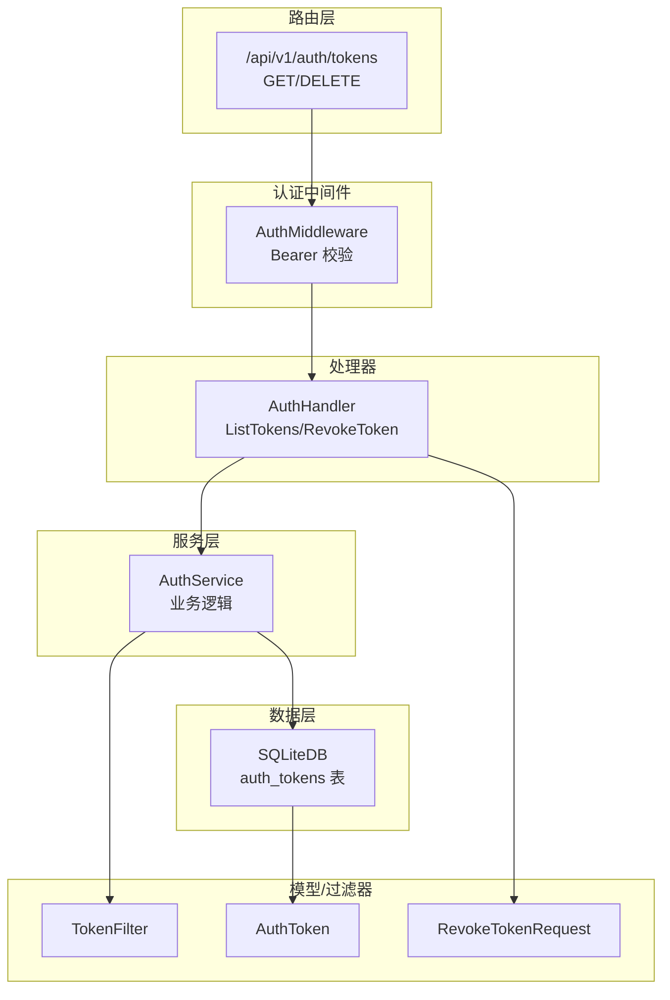
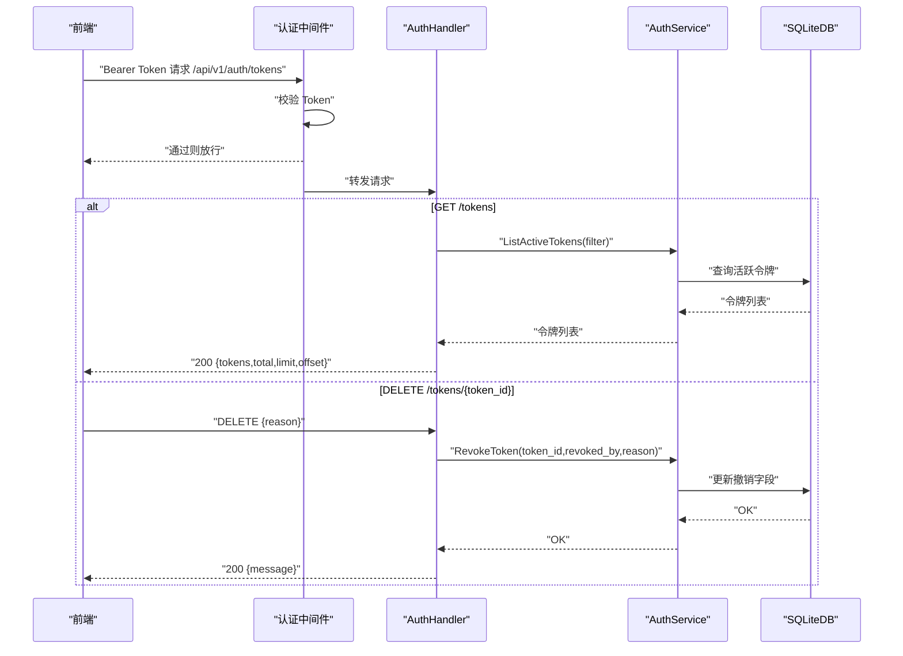
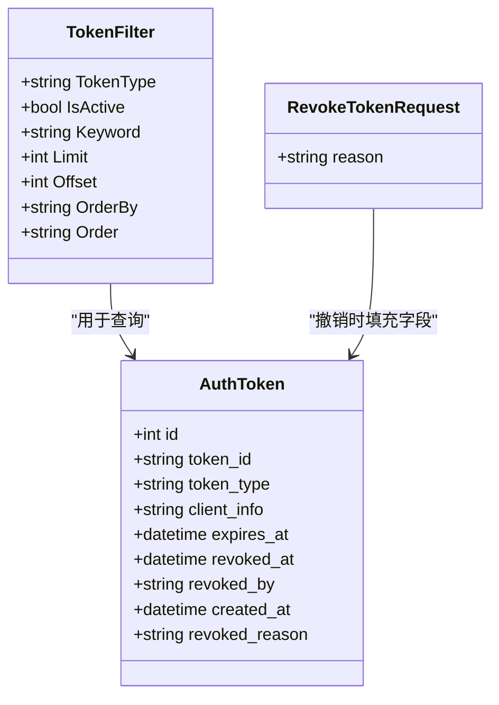
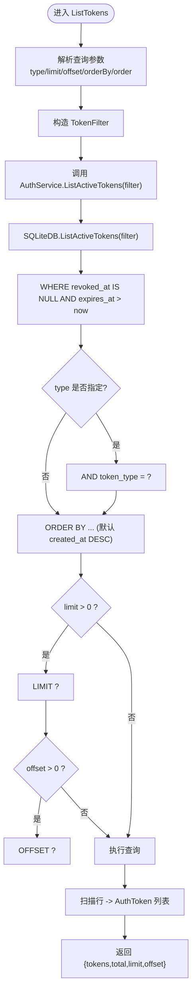
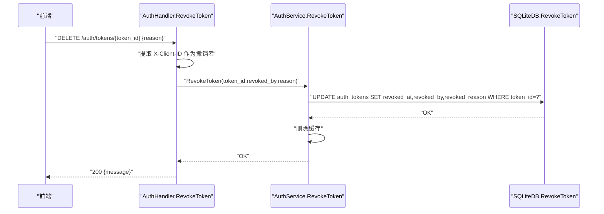
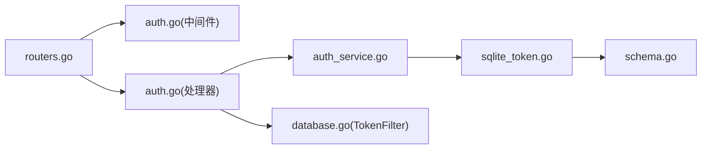

# 令牌管理接口

<cite>
**本文引用的文件**
- [internal/handlers/auth.go](file://internal/handlers/auth.go)
- [internal/services/auth_service.go](file://internal/services/auth_service.go)
- [internal/database/sqlite_token.go](file://internal/database/sqlite_token.go)
- [internal/database/database.go](file://internal/database/database.go)
- [internal/database/schema.go](file://internal/database/schema.go)
- [internal/middleware/auth.go](file://internal/middleware/auth.go)
- [internal/app/routers.go](file://internal/app/routers.go)
- [web/src/api/auth.ts](file://web/src/api/auth.ts)
- [frontend/lib/features/auth/data/auth_api.dart](file://frontend/lib/features/auth/data/auth_api.dart)
- [frontend/lib/features/auth/domain/auth_state.dart](file://frontend/lib/features/auth/domain/auth_state.dart)
- [internal/handlers/auth_test.go](file://internal/handlers/auth_test.go)
</cite>

## 目录
1. [简介](#简介)
2. [项目结构](#项目结构)
3. [核心组件](#核心组件)
4. [架构总览](#架构总览)
5. [详细组件分析](#详细组件分析)
6. [依赖分析](#依赖分析)
7. [性能考虑](#性能考虑)
8. [故障排查指南](#故障排查指南)
9. [结论](#结论)
10. [附录](#附录)

## 简介
本文件为 MiMusic 令牌管理接口的详细 API 文档，聚焦以下两个接口：
- GET /api/v1/auth/tokens：列出活跃令牌（支持类型过滤、分页与排序）
- DELETE /api/v1/auth/tokens/{token_id}：撤销指定令牌（支持撤销原因）

文档涵盖查询参数、响应结构、请求体格式、权限控制、数据库查询优化、令牌类型过滤、分页实现、撤销原因记录与批量操作最佳实践，并提供令牌管理流程图与关键调用序列图。

## 项目结构
围绕令牌管理的关键文件与职责如下：
- 路由注册：在 API v1 路由组中注册 /auth/tokens 的 GET/DELETE 路由，并受统一认证中间件保护
- 处理器：AuthHandler 提供 ListTokens 与 RevokeToken 业务入口
- 服务层：AuthService 封装业务逻辑，委托数据库层执行
- 数据层：SQLiteDB 实现令牌 CRUD、活跃令牌查询、撤销与过期清理
- 模型与过滤器：AuthToken、TokenFilter、RevokeTokenRequest 等
- 权限中间件：AuthMiddleware 校验 Bearer Token 并注入客户端标识
- 前端调用：Web/Vue 与 Flutter 前端分别封装了列表与撤销调用

图表来源
- [internal/app/routers.go:40-59](file://internal/app/routers.go#L40-L59)
- [internal/middleware/auth.go:11-51](file://internal/middleware/auth.go#L11-L51)
- [internal/handlers/auth.go:182-236](file://internal/handlers/auth.go#L182-L236)
- [internal/services/auth_service.go:373-386](file://internal/services/auth_service.go#L373-L386)
- [internal/database/sqlite_token.go:99-167](file://internal/database/sqlite_token.go#L99-L167)
- [internal/database/database.go:108-117](file://internal/database/database.go#L108-L117)

章节来源
- [internal/app/routers.go:40-59](file://internal/app/routers.go#L40-L59)
- [internal/middleware/auth.go:11-51](file://internal/middleware/auth.go#L11-L51)

## 核心组件
- 路由与权限
  - /api/v1/auth/tokens 由 AuthMiddleware 保护，要求 Bearer Token
  - GET 用于列出令牌，DELETE 用于撤销令牌
- 处理器
  - ListTokens：解析分页与过滤参数，调用服务层获取令牌列表并返回 tokens、total、limit、offset
  - RevokeToken：解析撤销原因，记录撤销者与原因，调用服务层撤销并清空缓存
- 服务层
  - ListActiveTokens：委托数据库层执行过滤、排序与分页
  - RevokeToken：执行撤销并清空缓存
- 数据层
  - ListActiveTokens：按 revoked_at IS NULL 且 expires_at > now 过滤，支持 token_type、orderBy、limit/offset
  - RevokeToken：更新 revoked_at、revoked_by、revoked_reason
  - IsTokenRevoked：用于运行时校验令牌是否撤销或过期
- 模型与过滤器
  - TokenFilter：支持 token_type、keyword、limit、offset、orderby、order
  - AuthToken：令牌记录结构
  - RevokeTokenRequest：撤销请求体（reason）

章节来源
- [internal/handlers/auth.go:182-236](file://internal/handlers/auth.go#L182-L236)
- [internal/services/auth_service.go:373-386](file://internal/services/auth_service.go#L373-L386)
- [internal/database/sqlite_token.go:99-167](file://internal/database/sqlite_token.go#L99-L167)
- [internal/database/database.go:108-117](file://internal/database/database.go#L108-L117)
- [internal/database/schema.go:61-72](file://internal/database/schema.go#L61-L72)

## 架构总览
下图展示令牌管理的端到端调用链路与数据流向：

图表来源
- [internal/middleware/auth.go:11-51](file://internal/middleware/auth.go#L11-L51)
- [internal/handlers/auth.go:182-236](file://internal/handlers/auth.go#L182-L236)
- [internal/services/auth_service.go:373-386](file://internal/services/auth_service.go#L373-L386)
- [internal/database/sqlite_token.go:75-97](file://internal/database/sqlite_token.go#L75-L97)

## 详细组件分析

### 接口定义与参数说明

- GET /api/v1/auth/tokens（列出活跃令牌）
  - 查询参数
    - type：令牌类型过滤，可选值 access、refresh
    - limit：数量限制，默认建议值见前端调用
    - offset：偏移量，用于分页
    - orderBy：排序字段，如 created_at
    - order：排序方向 ASC/DESC
  - 响应体
    - tokens：令牌数组，元素为 TokenInfo
    - total：满足条件的令牌总数
    - limit：本次请求的 limit
    - offset：本次请求的 offset
  - 示例
    - GET /api/v1/auth/tokens?type=access&limit=20&offset=0

- DELETE /api/v1/auth/tokens/{token_id}（撤销令牌）
  - 路径参数
    - token_id：令牌 ID
  - 请求体
    - reason：撤销原因（字符串）
  - 响应体
    - message：成功信息（如“令牌已撤销”）
  - 示例
    - DELETE /api/v1/auth/tokens/{token_id}，Body: {"reason":"用户主动登出"}

章节来源
- [internal/handlers/auth.go:182-236](file://internal/handlers/auth.go#L182-L236)
- [web/src/api/auth.ts:27-34](file://web/src/api/auth.ts#L27-L34)
- [frontend/lib/features/auth/data/auth_api.dart:57-75](file://frontend/lib/features/auth/data/auth_api.dart#L57-L75)
- [frontend/lib/features/auth/data/auth_api.dart:88-96](file://frontend/lib/features/auth/data/auth_api.dart#L88-L96)
- [frontend/lib/features/auth/domain/auth_state.dart:94-113](file://frontend/lib/features/auth/domain/auth_state.dart#L94-L113)

### 数据模型与过滤器

图表来源
- [internal/database/database.go:108-117](file://internal/database/database.go#L108-L117)
- [internal/models/models.go:368-379](file://internal/models/models.go#L368-L379)
- [internal/models/models.go:351-354](file://internal/models/models.go#L351-L354)

章节来源
- [internal/database/database.go:108-117](file://internal/database/database.go#L108-L117)
- [internal/models/models.go:351-379](file://internal/models/models.go#L351-L379)

### 列表查询与分页过滤流程

图表来源
- [internal/handlers/auth.go:182-195](file://internal/handlers/auth.go#L182-L195)
- [internal/services/auth_service.go:373-376](file://internal/services/auth_service.go#L373-L376)
- [internal/database/sqlite_token.go:99-167](file://internal/database/sqlite_token.go#L99-L167)

章节来源
- [internal/handlers/auth.go:182-195](file://internal/handlers/auth.go#L182-L195)
- [internal/database/sqlite_token.go:99-167](file://internal/database/sqlite_token.go#L99-L167)

### 撤销令牌流程

图表来源
- [internal/handlers/auth.go:211-236](file://internal/handlers/auth.go#L211-L236)
- [internal/services/auth_service.go:378-386](file://internal/services/auth_service.go#L378-L386)
- [internal/database/sqlite_token.go:75-97](file://internal/database/sqlite_token.go#L75-L97)

章节来源
- [internal/handlers/auth.go:211-236](file://internal/handlers/auth.go#L211-L236)
- [internal/services/auth_service.go:378-386](file://internal/services/auth_service.go#L378-L386)

### 权限控制机制
- 认证中间件
  - 从 Authorization: Bearer 取 Token，若为空回退到 URL 查询参数 access_token
  - 调用 AuthService.ValidateToken 校验并注入客户端标识到上下文
- 授权范围
  - 仅受保护路由组内的 /auth/* 接口需要认证

章节来源
- [internal/middleware/auth.go:11-51](file://internal/middleware/auth.go#L11-L51)
- [internal/app/routers.go:52-59](file://internal/app/routers.go#L52-L59)

### 数据库查询优化
- 表与索引
  - auth_tokens 表包含 token_id、token_type、expires_at、revoked_at 等关键列
  - 已建立索引：token_id、token_type、expires_at、revoked_at，有利于撤销状态与过期检查
- 查询策略
  - ListActiveTokens 使用 revoked_at IS NULL 与 expires_at > now 过滤
  - 支持动态拼接 token_type、orderBy、LIMIT/OFFSET，便于前端分页与排序
- 运行时校验
  - IsTokenRevoked 通过 EXISTS 快速判断撤销或过期状态

章节来源
- [internal/database/schema.go:61-103](file://internal/database/schema.go#L61-L103)
- [internal/database/sqlite_token.go:99-167](file://internal/database/sqlite_token.go#L99-L167)
- [internal/database/sqlite_token.go:186-202](file://internal/database/sqlite_token.go#L186-L202)

### 前端调用示例
- Web(Vue) 调用
  - 列表：listTokens({ type, limit, offset })
  - 撤销：revokeToken(tokenId, { reason })
- Flutter 调用
  - 列表：getTokens(limit: 20, offset: 0)
  - 撤销：revokeToken(tokenId)

章节来源
- [web/src/api/auth.ts:27-44](file://web/src/api/auth.ts#L27-L44)
- [frontend/lib/features/auth/data/auth_api.dart:57-96](file://frontend/lib/features/auth/data/auth_api.dart#L57-L96)
- [frontend/lib/features/auth/domain/auth_state.dart:94-113](file://frontend/lib/features/auth/domain/auth_state.dart#L94-L113)

### 实际使用示例
- 列出所有 access 类型令牌，每页 20 条，从第 0 条开始
  - GET /api/v1/auth/tokens?type=access&limit=20&offset=0
- 撤销某个令牌并记录原因
  - DELETE /api/v1/auth/tokens/{token_id}
  - Body: {"reason":"账户异常登录"}

章节来源
- [web/src/api/auth.ts:27-34](file://web/src/api/auth.ts#L27-L34)
- [frontend/lib/features/auth/data/auth_api.dart:88-96](file://frontend/lib/features/auth/data/auth_api.dart#L88-L96)

## 依赖分析
- 组件耦合
  - 路由 -> 中间件 -> 处理器 -> 服务 -> 数据库
  - 处理器与服务通过接口解耦，便于单元测试与替换
- 外部依赖
  - 认证依赖 JWT，撤销后缓存失效，确保即时生效
- 潜在循环依赖
  - 未发现循环依赖，模块边界清晰

图表来源
- [internal/app/routers.go:40-59](file://internal/app/routers.go#L40-L59)
- [internal/middleware/auth.go:11-51](file://internal/middleware/auth.go#L11-L51)
- [internal/handlers/auth.go:182-236](file://internal/handlers/auth.go#L182-L236)
- [internal/services/auth_service.go:373-386](file://internal/services/auth_service.go#L373-L386)
- [internal/database/sqlite_token.go:99-167](file://internal/database/sqlite_token.go#L99-L167)
- [internal/database/schema.go:61-103](file://internal/database/schema.go#L61-L103)
- [internal/database/database.go:108-117](file://internal/database/database.go#L108-L117)

章节来源
- [internal/app/routers.go:40-59](file://internal/app/routers.go#L40-L59)
- [internal/handlers/auth.go:182-236](file://internal/handlers/auth.go#L182-L236)
- [internal/services/auth_service.go:373-386](file://internal/services/auth_service.go#L373-L386)
- [internal/database/sqlite_token.go:99-167](file://internal/database/sqlite_token.go#L99-L167)

## 性能考虑
- 数据库层面
  - 使用 WAL 模式、合理的 busy_timeout、synchronous 与 cache_size，提升并发读写性能
  - 为 auth_tokens 建立多列索引，加速撤销状态与过期检查
- 查询层面
  - ListActiveTokens 支持 LIMIT/OFFSET 与 ORDER BY，避免一次性加载全量数据
  - 撤销后立即清理缓存，避免陈旧状态
- 前端层面
  - 建议前端采用分页参数 limit/offset 控制请求规模
  - 对撤销操作进行二次确认，减少误操作

章节来源
- [internal/database/sqlite.go:22-53](file://internal/database/sqlite.go#L22-L53)
- [internal/database/schema.go:89-103](file://internal/database/schema.go#L89-L103)
- [internal/services/auth_service.go:378-386](file://internal/services/auth_service.go#L378-L386)

## 故障排查指南
- 常见错误与定位
  - 401 未授权：检查 Authorization 头或 access_token 查询参数是否正确
  - 400 请求数据错误：DELETE /auth/tokens 的请求体 JSON 解析失败
  - 500 服务器错误：数据库查询或更新失败
- 令牌撤销后仍可用
  - 确认 AuthService.RevokeToken 已调用并清理缓存
  - 确认中间件 ValidateToken 能检测到撤销状态
- 列表为空或总数不正确
  - 检查 type 过滤、limit/offset 是否合理
  - 确认数据库索引与查询条件匹配

章节来源
- [internal/middleware/auth.go:11-51](file://internal/middleware/auth.go#L11-L51)
- [internal/handlers/auth.go:211-236](file://internal/handlers/auth.go#L211-L236)
- [internal/services/auth_service.go:326-371](file://internal/services/auth_service.go#L326-L371)

## 结论
MiMusic 的令牌管理接口通过清晰的分层设计与完善的权限控制，提供了安全可靠的令牌生命周期管理能力。列表查询支持类型过滤、排序与分页，撤销接口支持撤销原因记录与撤销者识别。配合数据库索引与缓存策略，整体具备良好的性能与可维护性。建议在生产环境中结合前端分页参数与后端索引策略，持续优化查询性能与用户体验。

## 附录

### 查询参数与响应结构对照
- GET /api/v1/auth/tokens
  - 查询参数：type、limit、offset、orderBy、order
  - 响应：tokens、total、limit、offset
- DELETE /api/v1/auth/tokens/{token_id}
  - 请求体：reason
  - 响应：message

章节来源
- [internal/handlers/auth.go:182-236](file://internal/handlers/auth.go#L182-L236)
- [web/src/api/auth.ts:27-44](file://web/src/api/auth.ts#L27-L44)
- [frontend/lib/features/auth/data/auth_api.dart:57-96](file://frontend/lib/features/auth/data/auth_api.dart#L57-L96)

### 令牌类型过滤与分页实现要点
- 类型过滤：在 WHERE 子句追加 token_type 条件
- 分页：LIMIT 与 OFFSET 动态拼接，避免全表扫描
- 排序：默认按 created_at 降序，支持 orderBy 与 order 参数

章节来源
- [internal/database/sqlite_token.go:99-167](file://internal/database/sqlite_token.go#L99-L167)

### 撤销原因记录与批量操作最佳实践
- 撤销原因：建议统一格式，便于审计与用户提示
- 批量撤销：建议后端提供批量接口，前端聚合选择后一次提交，减少请求次数
- 撤销者识别：优先使用 X-Client-ID 头，若缺失使用 unknown，便于追踪来源

章节来源
- [internal/handlers/auth.go:211-236](file://internal/handlers/auth.go#L211-L236)

### 单元测试参考
- 列表接口测试：验证 limit 默认值与响应结构
- 撤销接口测试：验证请求体解析与错误处理

章节来源
- [internal/handlers/auth_test.go:330-380](file://internal/handlers/auth_test.go#L330-L380)