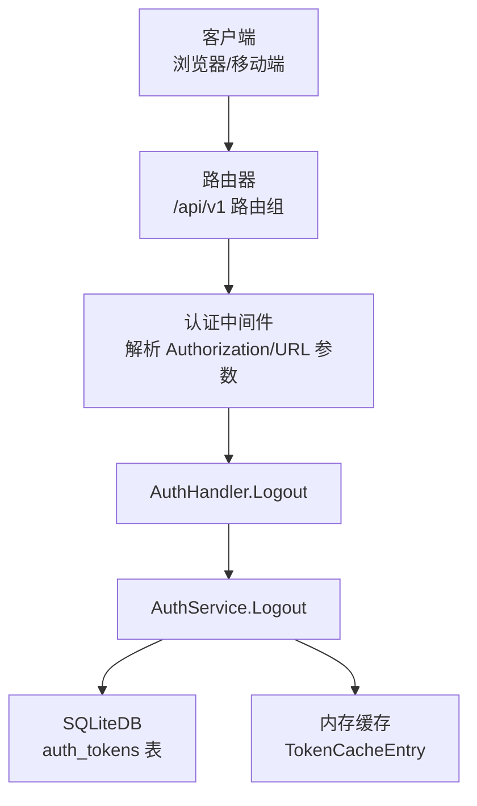
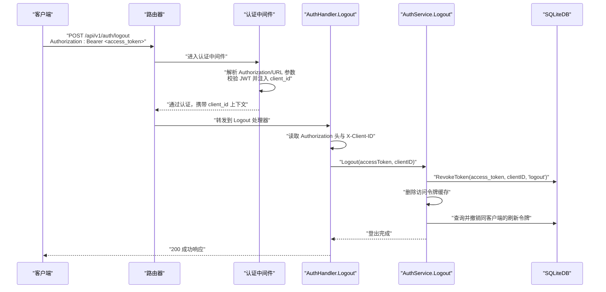
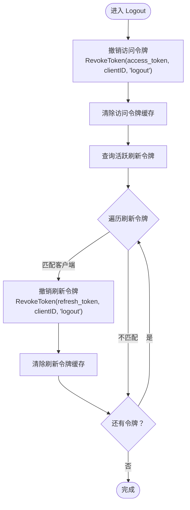
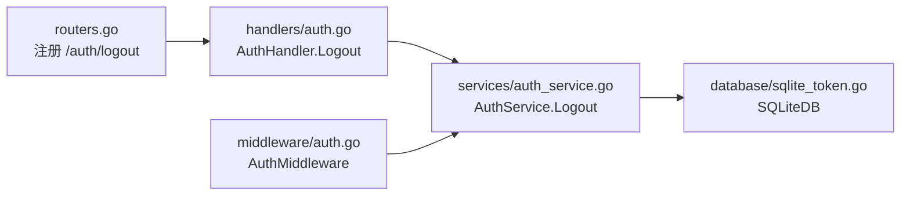
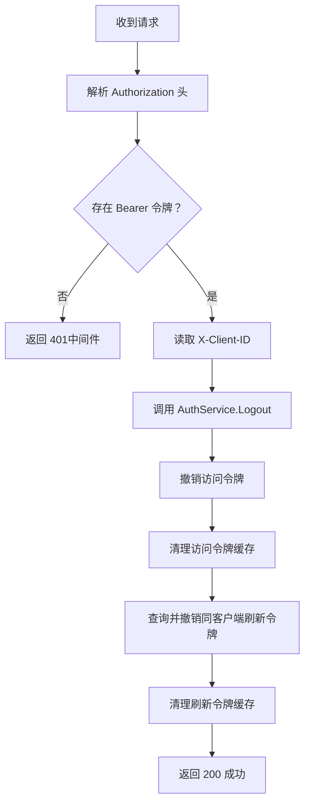

# 用户登出接口

<cite>
**本文引用的文件**
- [internal/handlers/auth.go](file://internal/handlers/auth.go)
- [internal/services/auth_service.go](file://internal/services/auth_service.go)
- [internal/middleware/auth.go](file://internal/middleware/auth.go)
- [internal/database/sqlite_token.go](file://internal/database/sqlite_token.go)
- [internal/database/schema.go](file://internal/database/schema.go)
- [internal/app/routers.go](file://internal/app/routers.go)
- [internal/handlers/auth_test.go](file://internal/handlers/auth_test.go)
- [web/src/api/auth.ts](file://web/src/api/auth.ts)
- [web/src/stores/auth.ts](file://web/src/stores/auth.ts)
</cite>

## 目录
1. [简介](#简介)
2. [项目结构](#项目结构)
3. [核心组件](#核心组件)
4. [架构总览](#架构总览)
5. [详细组件分析](#详细组件分析)
6. [依赖分析](#依赖分析)
7. [性能考量](#性能考量)
8. [故障排查指南](#故障排查指南)
9. [结论](#结论)
10. [附录](#附录)

## 简介
本文档面向 MiMusic 的用户登出接口，系统性阐述 POST /auth/logout 的实现与使用方法。内容涵盖：
- 请求处理流程：从 Authorization 头提取访问令牌、调用登出服务、返回成功响应
- 错误码说明：401 未授权、500 服务器错误
- 安全考虑：令牌撤销、会话清理、客户端标识（Client ID）处理
- 登出流程图、令牌撤销机制、会话清理策略
- 客户端 ID 的获取方式、多设备登出策略
- 实际使用示例与最佳实践

## 项目结构
围绕用户登出接口的关键代码分布在以下层次：
- 路由层：注册 /api/v1/auth/logout，并应用认证中间件
- 处理器层：AuthHandler.Logout 负责解析请求头、调用服务层
- 服务层：AuthService.Logout 负责撤销访问令牌、清理缓存、按客户端撤销刷新令牌
- 数据层：SQLiteDB 提供令牌的持久化存储与状态变更
- 中间件：认证中间件负责从请求头或 URL 查询参数提取令牌并注入上下文
- 前端：提供登录与登出 API 调用封装

图表来源
- [internal/app/routers.go:52-59](file://internal/app/routers.go#L52-L59)
- [internal/middleware/auth.go:12-51](file://internal/middleware/auth.go#L12-L51)
- [internal/handlers/auth.go:75-97](file://internal/handlers/auth.go#L75-L97)
- [internal/services/auth_service.go:212-243](file://internal/services/auth_service.go#L212-L243)
- [internal/database/sqlite_token.go:75-97](file://internal/database/sqlite_token.go#L75-L97)

章节来源
- [internal/app/routers.go:40-116](file://internal/app/routers.go#L40-L116)

## 核心组件
- 路由与中间件
  - /api/v1/auth/logout 在认证中间件保护下生效，要求携带有效的 Bearer 令牌
- 处理器
  - AuthHandler.Logout 从 Authorization 头提取访问令牌，读取 X-Client-ID，调用服务层执行登出
- 服务层
  - AuthService.Logout 撤销访问令牌，清理内存缓存；查找并撤销同客户端的刷新令牌
- 数据层
  - SQLiteDB.RevokeToken 更新 auth_tokens 表中的撤销状态；IsTokenRevoked 用于验证撤销状态
- 前端
  - 提供 /auth/logout 的 API 调用封装，配合 Pinia 存储管理令牌

章节来源
- [internal/handlers/auth.go:64-97](file://internal/handlers/auth.go#L64-L97)
- [internal/services/auth_service.go:212-243](file://internal/services/auth_service.go#L212-L243)
- [internal/middleware/auth.go:12-51](file://internal/middleware/auth.go#L12-L51)
- [internal/database/sqlite_token.go:75-97](file://internal/database/sqlite_token.go#L75-L97)
- [web/src/api/auth.ts:17-20](file://web/src/api/auth.ts#L17-L20)

## 架构总览
POST /auth/logout 的端到端交互如下：

图表来源
- [internal/app/routers.go:52-59](file://internal/app/routers.go#L52-L59)
- [internal/middleware/auth.go:12-51](file://internal/middleware/auth.go#L12-L51)
- [internal/handlers/auth.go:75-97](file://internal/handlers/auth.go#L75-L97)
- [internal/services/auth_service.go:212-243](file://internal/services/auth_service.go#L212-L243)
- [internal/database/sqlite_token.go:75-97](file://internal/database/sqlite_token.go#L75-L97)

## 详细组件分析

### 处理器：AuthHandler.Logout
- 功能职责
  - 从 Authorization 头提取访问令牌
  - 从请求头 X-Client-ID 获取客户端标识
  - 调用服务层执行登出
  - 返回统一的成功响应
- 错误处理
  - 服务层返回错误时返回 500 服务器错误
  - 未携带有效令牌时由中间件拦截（此处不触发 401）

章节来源
- [internal/handlers/auth.go:64-97](file://internal/handlers/auth.go#L64-L97)

### 服务层：AuthService.Logout
- 令牌撤销
  - 撤销当前访问令牌，记录撤销原因与撤销者
  - 清理内存缓存中的访问令牌条目
- 刷新令牌处理
  - 查询所有活跃刷新令牌
  - 遍历并撤销与当前客户端标识一致的刷新令牌
  - 清理对应刷新令牌的内存缓存
- 缓存策略
  - 使用内存缓存加速令牌验证与撤销状态判断
  - 启动定时清理协程，定期移除过期或已撤销的缓存项

图表来源
- [internal/services/auth_service.go:212-243](file://internal/services/auth_service.go#L212-L243)
- [internal/database/sqlite_token.go:75-97](file://internal/database/sqlite_token.go#L75-L97)

章节来源
- [internal/services/auth_service.go:212-243](file://internal/services/auth_service.go#L212-L243)

### 数据层：SQLiteDB 与 auth_tokens 表
- 表结构要点
  - token_id：唯一标识
  - token_type：access 或 refresh
  - client_info：客户端标识
  - expires_at：过期时间
  - revoked_at/revoked_by/revoked_reason：撤销相关字段
- 关键操作
  - RevokeToken：将撤销时间、撤销者与撤销原因写入表
  - IsTokenRevoked：判断令牌是否已撤销或过期
  - ListActiveTokens：查询未撤销且未过期的令牌

章节来源
- [internal/database/schema.go:61-72](file://internal/database/schema.go#L61-L72)
- [internal/database/sqlite_token.go:75-202](file://internal/database/sqlite_token.go#L75-L202)

### 认证中间件：从请求提取令牌
- 优先从 Authorization 头解析 Bearer 令牌
- 回退到 URL 查询参数 access_token（用于图片/音频等无法自定义 Header 的场景）
- 验证通过后将 client_id 注入请求上下文，供处理器读取

章节来源
- [internal/middleware/auth.go:12-51](file://internal/middleware/auth.go#L12-L51)

### 客户端标识（Client ID）的获取与使用
- 来源
  - 处理器从请求头 X-Client-ID 读取
  - 中间件在认证通过后将 claims 中的 client_id 注入上下文
- 作用
  - 登出时用于撤销与该客户端相关的所有令牌
  - 作为撤销者标识记录在数据库中

章节来源
- [internal/handlers/auth.go:80-82](file://internal/handlers/auth.go#L80-L82)
- [internal/middleware/auth.go:44-48](file://internal/middleware/auth.go#L44-L48)

### 多设备登出策略
- 当前实现
  - 登出时撤销与当前客户端标识一致的所有令牌（包括刷新令牌）
- 影响范围
  - 同一客户端标识下的所有设备会同时失效
- 建议
  - 若需细粒度控制，可在客户端侧生成独立的 client_id 并在登出时传入

章节来源
- [internal/services/auth_service.go:221-240](file://internal/services/auth_service.go#L221-L240)

### 前端集成与使用示例
- 登出 API 调用
  - 通过封装的 logout 方法向 /api/v1/auth/logout 发起 POST 请求
- 令牌管理
  - 使用 Pinia 存储管理 access_token、refresh_token 与过期时间
  - 登出成功后清空本地存储的令牌信息

章节来源
- [web/src/api/auth.ts:17-20](file://web/src/api/auth.ts#L17-L20)
- [web/src/stores/auth.ts:22-27](file://web/src/stores/auth.ts#L22-L27)

## 依赖分析
- 路由到处理器
  - /api/v1/auth/logout -> AuthHandler.Logout
- 处理器到服务层
  - AuthHandler.Logout -> AuthService.Logout
- 服务层到数据层
  - AuthService.Logout -> SQLiteDB.RevokeToken / ListActiveTokens
- 中间件到服务层
  - 认证中间件 -> AuthService.ValidateToken

图表来源
- [internal/app/routers.go:52-59](file://internal/app/routers.go#L52-L59)
- [internal/handlers/auth.go:75-97](file://internal/handlers/auth.go#L75-L97)
- [internal/services/auth_service.go:212-243](file://internal/services/auth_service.go#L212-L243)
- [internal/database/sqlite_token.go:75-97](file://internal/database/sqlite_token.go#L75-L97)
- [internal/middleware/auth.go:12-51](file://internal/middleware/auth.go#L12-L51)

章节来源
- [internal/app/routers.go:40-116](file://internal/app/routers.go#L40-L116)

## 性能考量
- 内存缓存
  - 通过 sync.Map 缓存令牌验证结果，避免重复数据库查询
  - 启动定时清理协程，降低内存占用
- 数据库索引
  - auth_tokens 表包含 token_id、token_type、expires_at、revoked_at 等索引，提升撤销与查询效率
- 并发安全
  - 缓存访问使用并发安全的数据结构，避免竞态

章节来源
- [internal/services/auth_service.go:17-32](file://internal/services/auth_service.go#L17-L32)
- [internal/database/schema.go:89-103](file://internal/database/schema.go#L89-L103)

## 故障排查指南
- 常见错误与定位
  - 401 未授权
    - 可能原因：缺少 Authorization 头或令牌无效
    - 定位依据：认证中间件在解析不到有效令牌时返回 401
  - 500 服务器错误
    - 可能原因：数据库撤销失败、服务内部异常
    - 定位依据：处理器捕获服务层错误并返回 500
- 关键检查点
  - 确认 Authorization 头格式为 Bearer <access_token>
  - 确认 X-Client-ID 与服务端生成的一致
  - 检查 auth_tokens 表中对应令牌的撤销状态
- 单元测试参考
  - 测试用例展示了使用真实 access_token 调用登出并期望 200 响应

章节来源
- [internal/middleware/auth.go:32-42](file://internal/middleware/auth.go#L32-L42)
- [internal/handlers/auth.go:88-91](file://internal/handlers/auth.go#L88-L91)
- [internal/handlers/auth_test.go:317-328](file://internal/handlers/auth_test.go#L317-L328)

## 结论
POST /auth/logout 接口通过“撤销访问令牌 + 清理缓存 + 撤销同客户端刷新令牌”的策略，实现了对当前会话的彻底清理。结合认证中间件与数据库的撤销状态管理，确保了登出后的安全与一致性。建议在多设备场景下为不同设备分配独立的客户端标识，以实现更精细的登出控制。

## 附录

### API 定义
- 路径
  - POST /api/v1/auth/logout
- 安全
  - Bearer 令牌：Authorization: Bearer <access_token>
  - 客户端标识：X-Client-ID（由中间件注入）
- 成功响应
  - 200 OK：返回统一成功响应对象
- 错误响应
  - 401 未授权：缺少或无效的认证信息（由中间件拦截）
  - 500 服务器错误：服务内部异常或数据库操作失败

章节来源
- [internal/handlers/auth.go:64-74](file://internal/handlers/auth.go#L64-L74)
- [internal/middleware/auth.go:12-51](file://internal/middleware/auth.go#L12-L51)

### 登出流程图（代码级映射）

图表来源
- [internal/handlers/auth.go:75-97](file://internal/handlers/auth.go#L75-L97)
- [internal/services/auth_service.go:212-243](file://internal/services/auth_service.go#L212-L243)