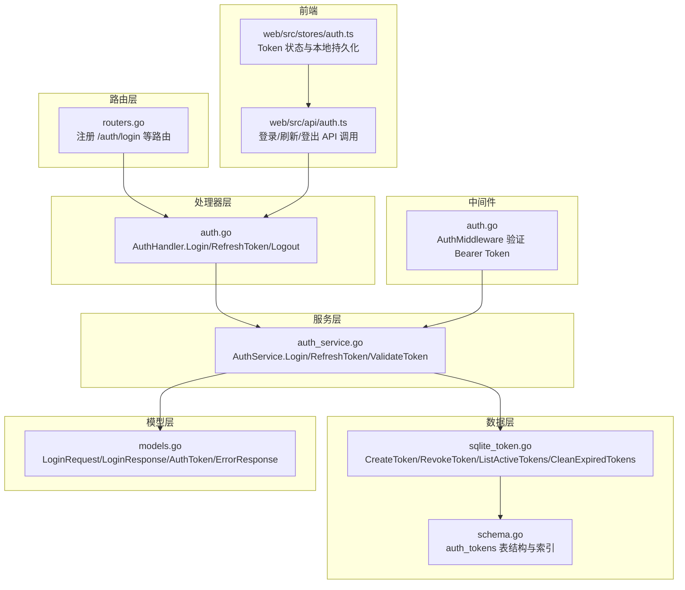
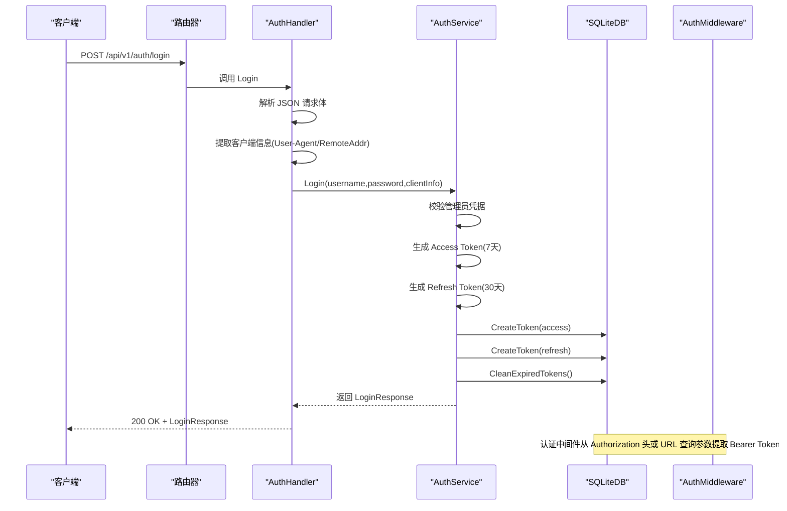
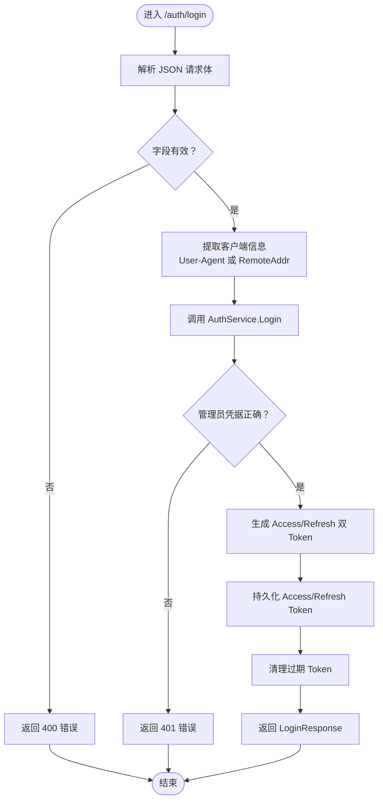
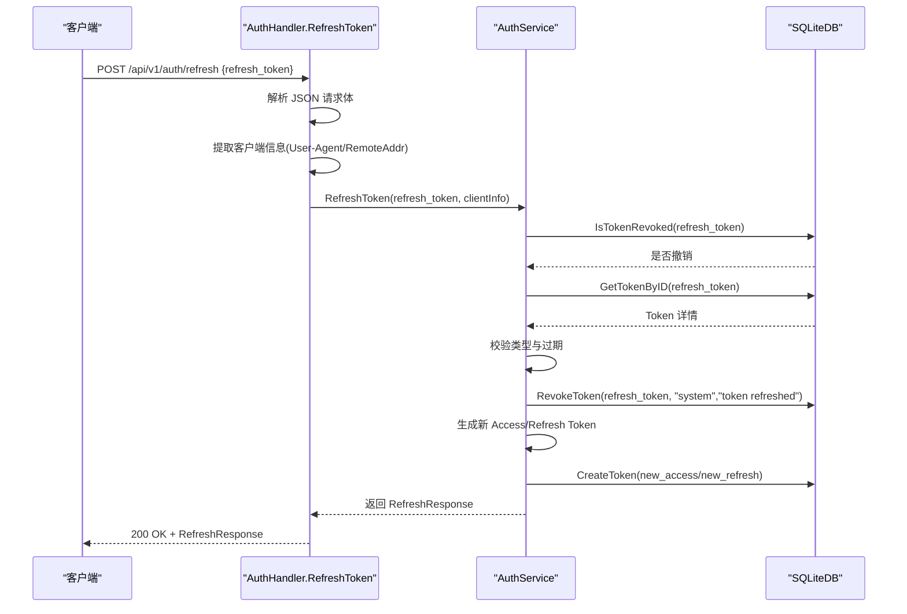
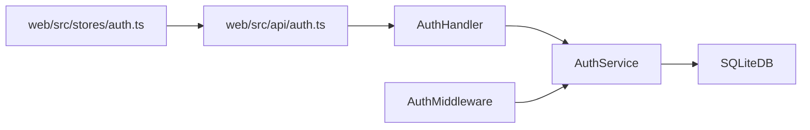

# 用户登录接口

<cite>
**本文引用的文件**
- [internal/handlers/auth.go](file://internal/handlers/auth.go)
- [internal/services/auth_service.go](file://internal/services/auth_service.go)
- [internal/middleware/auth.go](file://internal/middleware/auth.go)
- [internal/models/models.go](file://internal/models/models.go)
- [internal/database/sqlite_token.go](file://internal/database/sqlite_token.go)
- [internal/database/schema.go](file://internal/database/schema.go)
- [internal/app/routers.go](file://internal/app/routers.go)
- [web/src/api/auth.ts](file://web/src/api/auth.ts)
- [web/src/stores/auth.ts](file://web/src/stores/auth.ts)
- [docs/swagger.json](file://docs/swagger.json)
</cite>

## 目录
1. [简介](#简介)
2. [项目结构](#项目结构)
3. [核心组件](#核心组件)
4. [架构总览](#架构总览)
5. [详细组件分析](#详细组件分析)
6. [依赖关系分析](#依赖关系分析)
7. [性能考量](#性能考量)
8. [故障排查指南](#故障排查指南)
9. [结论](#结论)
10. [附录](#附录)

## 简介
本文件为 MiMusic 用户登录接口的详细 API 文档，聚焦于 POST /auth/login 接口的实现与使用。文档涵盖以下要点：
- 用户名密码认证流程
- JWT 双 Token 生成机制（Access Token 与 Refresh Token）
- 客户端信息记录功能
- 请求参数与响应数据结构
- 错误码说明（400、401、500）
- 登录流程图、令牌生成算法、安全考虑与实际使用示例
- 客户端标识获取方式（User-Agent 或 RemoteAddr）与登录成功后的状态管理

## 项目结构
围绕登录接口的关键代码分布在如下模块：
- 路由层：注册 /auth/login、/auth/refresh 等路由，并应用认证中间件
- 处理器层：解析请求、提取客户端信息、调用服务层执行登录/刷新
- 服务层：执行用户名密码校验、生成双 Token、持久化 Token、缓存与撤销检查
- 数据层：SQLite 存储 Token、索引与清理过期 Token
- 模型层：定义 LoginRequest/LoginResponse、Token 结构体与错误响应
- 前端集成：API 调用封装、Pinia 状态管理与本地存储

图表来源
- [internal/app/routers.go:40-60](file://internal/app/routers.go#L40-L60)
- [internal/handlers/auth.go:27-62](file://internal/handlers/auth.go#L27-L62)
- [internal/services/auth_service.go:94-164](file://internal/services/auth_service.go#L94-L164)
- [internal/database/sqlite_token.go:14-44](file://internal/database/sqlite_token.go#L14-L44)
- [internal/database/schema.go:61-72](file://internal/database/schema.go#L61-L72)
- [internal/models/models.go:390-402](file://internal/models/models.go#L390-L402)
- [internal/middleware/auth.go:11-51](file://internal/middleware/auth.go#L11-L51)
- [web/src/api/auth.ts:12-25](file://web/src/api/auth.ts#L12-L25)
- [web/src/stores/auth.ts:15-27](file://web/src/stores/auth.ts#L15-L27)

章节来源
- [internal/app/routers.go:28-60](file://internal/app/routers.go#L28-L60)
- [internal/handlers/auth.go:27-62](file://internal/handlers/auth.go#L27-L62)
- [internal/services/auth_service.go:94-164](file://internal/services/auth_service.go#L94-L164)
- [internal/database/sqlite_token.go:14-44](file://internal/database/sqlite_token.go#L14-L44)
- [internal/database/schema.go:61-72](file://internal/database/schema.go#L61-L72)
- [internal/models/models.go:390-402](file://internal/models/models.go#L390-L402)
- [internal/middleware/auth.go:11-51](file://internal/middleware/auth.go#L11-L51)
- [web/src/api/auth.ts:12-25](file://web/src/api/auth.ts#L12-L25)
- [web/src/stores/auth.ts:15-27](file://web/src/stores/auth.ts#L15-L27)

## 核心组件
- 路由与中间件
  - 路由注册：/api/v1/auth/login、/api/v1/auth/refresh、/api/v1/auth/logout 等
  - 认证中间件：从 Authorization 头或 URL 查询参数提取 Bearer Token，验证并注入上下文
- 处理器
  - Login：解析 JSON 请求体，提取客户端信息（User-Agent 或 RemoteAddr），调用服务层登录
  - RefreshToken：解析刷新请求，提取客户端信息，调用服务层刷新
  - Logout：从 Header 获取 Bearer Token 与 X-Client-ID，调用服务层登出
- 服务层
  - Login：校验管理员凭据，生成 Access/Refresh 双 Token（7 天与 30 天过期），持久化并清理过期 Token
  - RefreshToken：校验刷新 Token 状态与类型、过期时间，撤销旧 Token 对，生成新的 Access/Refresh Token
  - ValidateToken：JWT 解析与缓存命中，插件系统 Token 特殊处理，数据库撤销检查
- 数据层
  - auth_tokens 表：存储 token_id、token_type、client_info、expires_at、revoked_* 等字段
  - 支持创建、撤销、列出活跃 Token、清理过期 Token、检查是否撤销
- 模型层
  - LoginRequest：username、password
  - LoginResponse：access_token、refresh_token、expires_in、token_type
  - AuthToken：Token 记录结构体
  - ErrorResponse：统一错误响应

章节来源
- [internal/app/routers.go:40-60](file://internal/app/routers.go#L40-L60)
- [internal/middleware/auth.go:11-51](file://internal/middleware/auth.go#L11-L51)
- [internal/handlers/auth.go:27-62](file://internal/handlers/auth.go#L27-L62)
- [internal/services/auth_service.go:94-164](file://internal/services/auth_service.go#L94-L164)
- [internal/database/sqlite_token.go:14-44](file://internal/database/sqlite_token.go#L14-L44)
- [internal/database/schema.go:61-72](file://internal/database/schema.go#L61-L72)
- [internal/models/models.go:390-402](file://internal/models/models.go#L390-L402)

## 架构总览
登录接口采用“路由 -> 处理器 -> 服务 -> 数据库”的分层设计，配合 JWT 双 Token 与内存缓存提升性能与安全性。

图表来源
- [internal/app/routers.go:40-60](file://internal/app/routers.go#L40-L60)
- [internal/handlers/auth.go:27-62](file://internal/handlers/auth.go#L27-L62)
- [internal/services/auth_service.go:94-164](file://internal/services/auth_service.go#L94-L164)
- [internal/database/sqlite_token.go:14-44](file://internal/database/sqlite_token.go#L14-L44)

## 详细组件分析

### 登录接口 POST /auth/login
- 路由与权限
  - 路由：/api/v1/auth/login
  - 方法：POST
  - 无需认证即可访问
- 请求参数
  - JSON 对象，包含：
    - username：字符串，必填
    - password：字符串，必填
- 响应数据结构
  - JSON 对象，包含：
    - access_token：字符串，JWT Access Token
    - refresh_token：字符串，JWT Refresh Token
    - expires_in：整数，Access Token 过期秒数
    - token_type：字符串，通常为 "Bearer"
- 错误码
  - 400：请求数据错误（JSON 解析失败或字段缺失）
  - 401：用户名或密码错误
  - 500：服务器内部错误（如数据库异常）

图表来源
- [internal/handlers/auth.go:39-62](file://internal/handlers/auth.go#L39-L62)
- [internal/services/auth_service.go:94-164](file://internal/services/auth_service.go#L94-L164)
- [internal/database/sqlite_token.go:14-44](file://internal/database/sqlite_token.go#L14-L44)

章节来源
- [internal/handlers/auth.go:27-62](file://internal/handlers/auth.go#L27-L62)
- [internal/models/models.go:390-402](file://internal/models/models.go#L390-L402)
- [docs/swagger.json:40-75](file://docs/swagger.json#L40-L75)

### 刷新令牌 POST /auth/refresh
- 路由与权限
  - 路由：/api/v1/auth/refresh
  - 方法：POST
  - 无需认证即可访问
- 请求参数
  - JSON 对象，包含：
    - refresh_token：字符串，必填
- 响应数据结构
  - JSON 对象，包含：
    - access_token：字符串，新的 Access Token
    - refresh_token：字符串，新的 Refresh Token
    - expires_in：整数，新的 Access Token 过期秒数
    - token_type：字符串，通常为 "Bearer"
- 错误码
  - 400：请求数据错误（JSON 解析失败或字段缺失）
  - 401：刷新令牌无效（已撤销、类型不符、已过期）
  - 500：服务器内部错误

图表来源
- [internal/handlers/auth.go:99-134](file://internal/handlers/auth.go#L99-L134)
- [internal/services/auth_service.go:245-324](file://internal/services/auth_service.go#L245-L324)
- [internal/database/sqlite_token.go:46-97](file://internal/database/sqlite_token.go#L46-L97)

章节来源
- [internal/handlers/auth.go:99-134](file://internal/handlers/auth.go#L99-L134)
- [internal/models/models.go:346-349](file://internal/models/models.go#L346-L349)
- [docs/swagger.json:72-115](file://docs/swagger.json#L72-L115)

### 登出 POST /auth/logout
- 路由与权限
  - 路由：/api/v1/auth/logout
  - 方法：POST
  - 需要 Bearer Token 认证
- 请求头
  - Authorization：Bearer <access_token>
  - X-Client-ID：由中间件设置（客户端标识）
- 响应
  - JSON 对象，包含：
    - message：字符串，例如 "登出成功"

章节来源
- [internal/handlers/auth.go:64-97](file://internal/handlers/auth.go#L64-L97)
- [internal/middleware/auth.go:11-51](file://internal/middleware/auth.go#L11-L51)

### 客户端信息记录
- 客户端信息来源
  - 优先使用请求头 User-Agent
  - 若为空，则回退使用 RemoteAddr
- 记录位置
  - 登录与刷新时均将 client_info 写入 auth_tokens 表
  - 用于后续令牌管理与审计

章节来源
- [internal/handlers/auth.go:48-52](file://internal/handlers/auth.go#L48-L52)
- [internal/handlers/auth.go:120-124](file://internal/handlers/auth.go#L120-L124)
- [internal/database/sqlite_token.go:14-44](file://internal/database/sqlite_token.go#L14-L44)

### 前端使用示例与状态管理
- 登录
  - 调用 web/src/api/auth.ts 的 login(data)
  - data 为 { username, password }
  - 成功后使用 web/src/stores/auth.ts 的 setTokens(access, refresh, expires_in)
- 登出
  - 调用 logout()，清除本地 Token
- 刷新
  - 调用 refreshToken({ refresh_token })，在 Access Token 即将过期时自动刷新
- 状态管理
  - Pinia Store 持久化到 localStorage，包含 accessToken、refreshToken、expiresAt
  - isAuthenticated 计算属性基于当前时间与 expiresAt 判断

章节来源
- [web/src/api/auth.ts:12-25](file://web/src/api/auth.ts#L12-L25)
- [web/src/stores/auth.ts:15-27](file://web/src/stores/auth.ts#L15-L27)

## 依赖关系分析
- 处理器依赖服务层，服务层依赖数据库层
- 认证中间件依赖服务层进行 Token 验证
- 前端通过 API 层与后端交互，状态通过 Store 管理

图表来源
- [internal/handlers/auth.go:27-62](file://internal/handlers/auth.go#L27-L62)
- [internal/services/auth_service.go:94-164](file://internal/services/auth_service.go#L94-L164)
- [internal/middleware/auth.go:11-51](file://internal/middleware/auth.go#L11-L51)
- [web/src/api/auth.ts:12-25](file://web/src/api/auth.ts#L12-L25)
- [web/src/stores/auth.ts:15-27](file://web/src/stores/auth.ts#L15-L27)

章节来源
- [internal/handlers/auth.go:27-62](file://internal/handlers/auth.go#L27-L62)
- [internal/services/auth_service.go:94-164](file://internal/services/auth_service.go#L94-L164)
- [internal/middleware/auth.go:11-51](file://internal/middleware/auth.go#L11-L51)
- [web/src/api/auth.ts:12-25](file://web/src/api/auth.ts#L12-L25)
- [web/src/stores/auth.ts:15-27](file://web/src/stores/auth.ts#L15-L27)

## 性能考量
- 内存缓存
  - AuthService 维护 Token 缓存，命中则跳过数据库撤销检查，降低延迟
  - 定时清理过期缓存，避免内存膨胀
- 数据库优化
  - auth_tokens 表建立多索引（token_id、token_type、expires_at、revoked_at），加速查询与清理
  - WAL 模式、连接池与超时配置提升并发与稳定性
- Token 生命周期
  - Access Token 7 天，Refresh Token 30 天，平衡安全性与用户体验
  - 登录后自动清理过期 Token，保持表规模可控

章节来源
- [internal/services/auth_service.go:166-210](file://internal/services/auth_service.go#L166-L210)
- [internal/database/schema.go:89-103](file://internal/database/schema.go#L89-L103)
- [internal/database/sqlite.go:22-53](file://internal/database/sqlite.go#L22-L53)

## 故障排查指南
- 400 请求数据错误
  - 检查请求体是否为合法 JSON，字段是否齐全
  - 参考 Swagger 定义的 LoginRequest 结构
- 401 用户名或密码错误
  - 确认用户名与密码与后台管理员凭据一致
  - 检查服务层 Login 流程中的凭据校验逻辑
- 401 刷新令牌无效
  - 检查 refresh_token 是否已撤销、类型是否为 refresh、是否过期
  - 确认服务层 RefreshToken 的撤销与校验逻辑
- 500 服务器错误
  - 检查数据库连接、建表与索引是否正常
  - 查看服务层生成与持久化 Token 的异常路径

章节来源
- [internal/handlers/auth.go:39-62](file://internal/handlers/auth.go#L39-L62)
- [internal/handlers/auth.go:111-134](file://internal/handlers/auth.go#L111-L134)
- [internal/services/auth_service.go:94-164](file://internal/services/auth_service.go#L94-L164)
- [internal/services/auth_service.go:245-324](file://internal/services/auth_service.go#L245-L324)
- [internal/database/sqlite_token.go:14-44](file://internal/database/sqlite_token.go#L14-L44)

## 结论
MiMusic 的登录接口通过清晰的分层设计与 JWT 双 Token 机制，实现了安全、可维护且高性能的认证流程。结合客户端信息记录与前端状态管理，能够为用户提供稳定的登录体验。建议在生产环境中：
- 严格管理 JWT 密钥（初始化时自动生成）
- 定期清理过期 Token，监控数据库性能
- 在前端实现自动刷新与错误重试策略

## 附录

### 请求与响应数据结构
- 请求体 LoginRequest
  - username：字符串，必填
  - password：字符串，必填
- 响应体 LoginResponse
  - access_token：字符串
  - refresh_token：字符串
  - expires_in：整数（秒）
  - token_type：字符串（通常为 "Bearer"）

章节来源
- [internal/models/models.go:390-402](file://internal/models/models.go#L390-L402)
- [docs/swagger.json:2630-2673](file://docs/swagger.json#L2630-L2673)

### 错误码对照
- 400：请求数据错误（JSON 解析失败或字段缺失）
- 401：用户名或密码错误 / 刷新令牌无效
- 500：服务器内部错误（数据库异常、密钥读取失败等）

章节来源
- [internal/handlers/auth.go:39-62](file://internal/handlers/auth.go#L39-L62)
- [internal/handlers/auth.go:111-134](file://internal/handlers/auth.go#L111-L134)
- [docs/swagger.json:40-75](file://docs/swagger.json#L40-L75)
- [docs/swagger.json:72-115](file://docs/swagger.json#L72-L115)

### 客户端标识获取方式
- 优先使用请求头 User-Agent
- 若为空，则使用 RemoteAddr
- 两者均用于记录到 auth_tokens.client_info 字段

章节来源
- [internal/handlers/auth.go:48-52](file://internal/handlers/auth.go#L48-L52)
- [internal/handlers/auth.go:120-124](file://internal/handlers/auth.go#L120-L124)

### 登录成功后的状态管理
- 前端 Store
  - setTokens(access, refresh, expires_in) 设置 Token 与过期时间
  - isAuthenticated 基于当前时间与 expiresAt 判断
  - isTokenExpiringSoon 提前 5 分钟触发刷新
  - 持久化到 localStorage，重启后恢复
- 登出
  - clearTokens 清空 Token
  - 调用后端 /auth/logout 撤销当前访问 Token

章节来源
- [web/src/stores/auth.ts:15-27](file://web/src/stores/auth.ts#L15-L27)
- [web/src/stores/auth.ts:39-42](file://web/src/stores/auth.ts#L39-L42)
- [web/src/api/auth.ts:17-25](file://web/src/api/auth.ts#L17-L25)