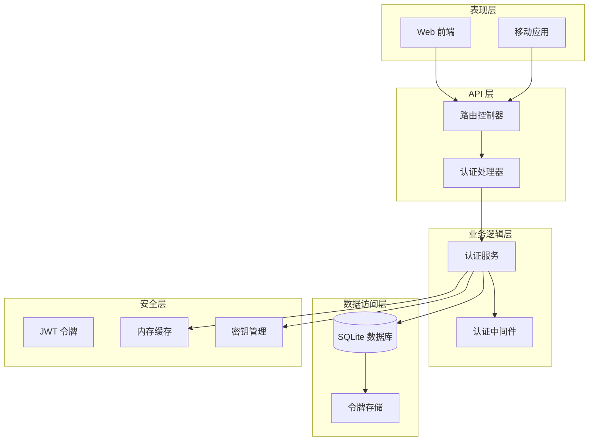
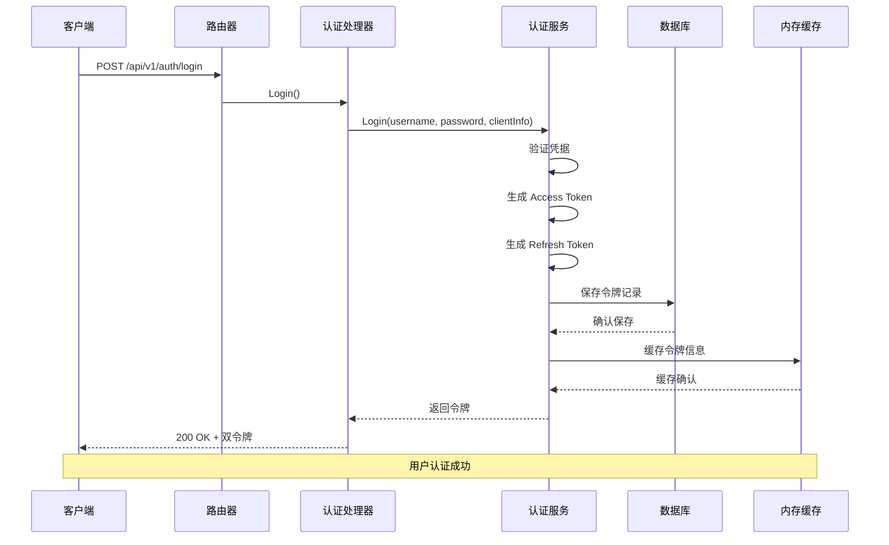
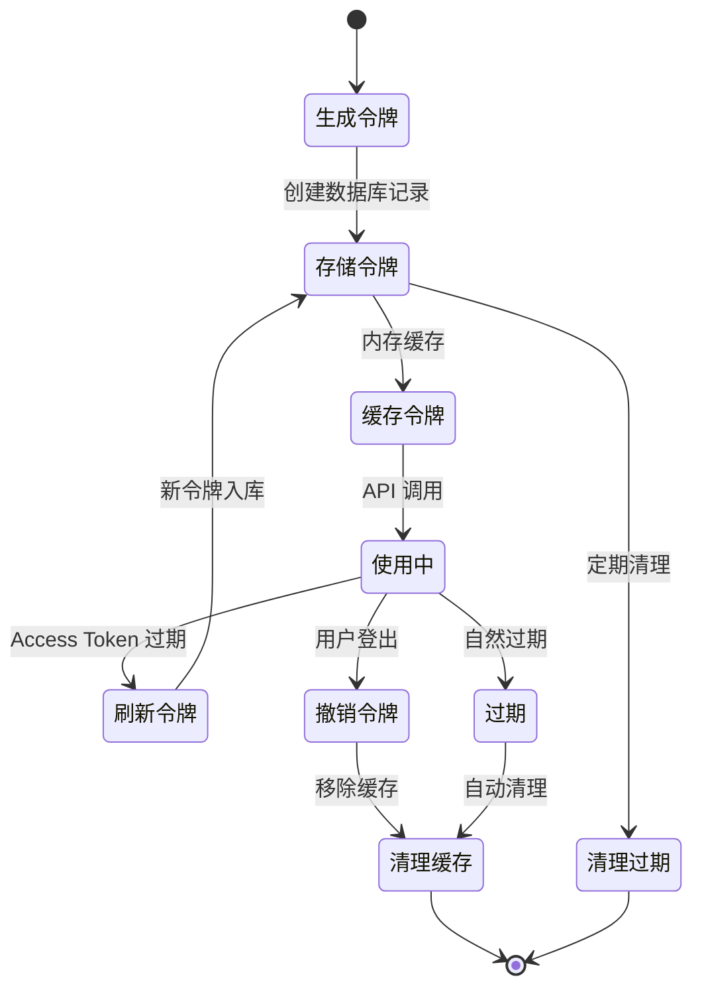
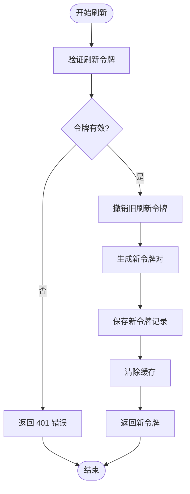
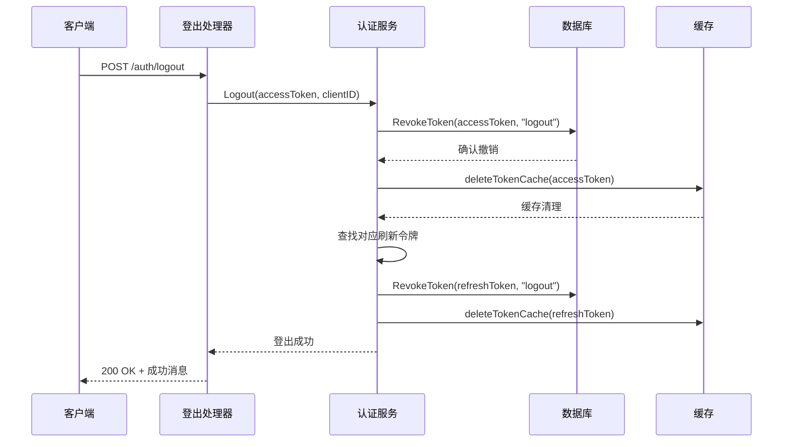
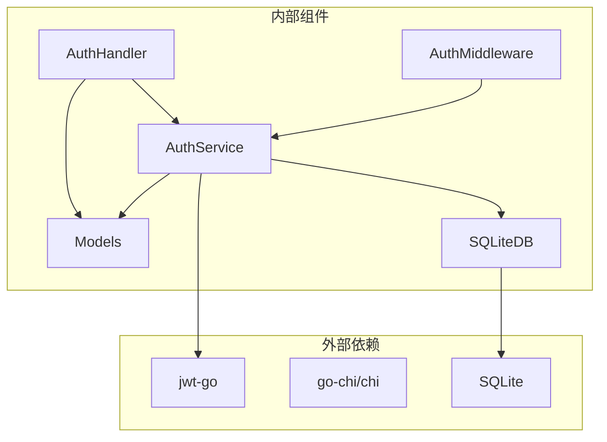
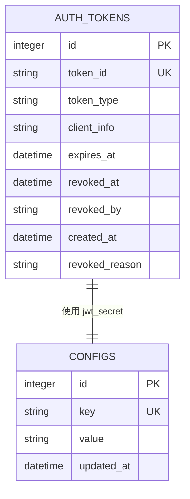
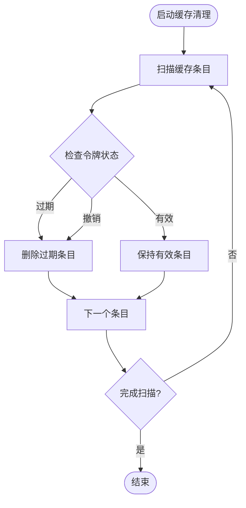

# 认证管理 API

<cite>
**本文档引用的文件**
- [auth.go](file://internal/handlers/auth.go)
- [auth_service.go](file://internal/services/auth_service.go)
- [auth.go](file://internal/middleware/auth.go)
- [sqlite_token.go](file://internal/database/sqlite_token.go)
- [models.go](file://internal/models/models.go)
- [schema.go](file://internal/database/schema.go)
- [routers.go](file://internal/app/routers.go)
- [swagger.yaml](file://docs/swagger.yaml)
- [auth.ts](file://web/src/api/auth.ts)
- [auth.ts](file://web/src/stores/auth.ts)
- [auth_test.go](file://internal/handlers/auth_test.go)
</cite>

## 目录
1. [简介](#简介)
2. [项目结构](#项目结构)
3. [核心组件](#核心组件)
4. [架构概览](#架构概览)
5. [详细组件分析](#详细组件分析)
6. [依赖关系分析](#依赖关系分析)
7. [性能考虑](#性能考虑)
8. [故障排除指南](#故障排除指南)
9. [结论](#结论)

## 简介

MiMusic 认证管理 API 提供了完整的双令牌认证系统，支持用户名密码认证、JWT 令牌管理、令牌刷新和撤销功能。该系统采用 OAuth 2.0 风格的双令牌机制，包含 Access Token（短期）和 Refresh Token（长期）两种令牌类型，确保系统的安全性和用户体验。

## 项目结构

MiMusic 认证系统采用分层架构设计，主要包含以下层次：



**图表来源**
- [routers.go:28-116](file://internal/app/routers.go#L28-L116)
- [auth.go:15-25](file://internal/handlers/auth.go#L15-L25)
- [auth_service.go:24-32](file://internal/services/auth_service.go#L24-L32)

**章节来源**
- [routers.go:28-116](file://internal/app/routers.go#L28-L116)
- [auth.go:15-25](file://internal/handlers/auth.go#L15-L25)
- [auth_service.go:24-32](file://internal/services/auth_service.go#L24-L32)

## 核心组件

### 认证处理器 (AuthHandler)

认证处理器负责处理所有认证相关的 HTTP 请求，包括登录、登出、令牌刷新和令牌管理。

### 认证服务 (AuthService)

认证服务是核心业务逻辑组件，负责：
- JWT 令牌生成和验证
- 用户身份验证
- 令牌生命周期管理
- 内存缓存管理

### 认证中间件 (AuthMiddleware)

认证中间件提供全局的请求认证拦截，确保只有经过认证的请求才能访问受保护的资源。

### 令牌存储 (SQLiteDB)

基于 SQLite 的令牌持久化存储，支持令牌的创建、查询、撤销和清理。

**章节来源**
- [auth.go:15-25](file://internal/handlers/auth.go#L15-L25)
- [auth_service.go:24-32](file://internal/services/auth_service.go#L24-L32)
- [auth.go:11-12](file://internal/middleware/auth.go#L11-L12)
- [sqlite_token.go:14-44](file://internal/database/sqlite_token.go#L14-L44)

## 架构概览

MiMusic 认证系统采用现代微服务架构，具有以下特点：



**图表来源**
- [auth.go:27-62](file://internal/handlers/auth.go#L27-L62)
- [auth_service.go:94-164](file://internal/services/auth_service.go#L94-L164)
- [sqlite_token.go:14-44](file://internal/database/sqlite_token.go#L14-L44)

### 令牌生命周期管理



**图表来源**
- [auth_service.go:194-210](file://internal/services/auth_service.go#L194-L210)
- [auth_service.go:245-324](file://internal/services/auth_service.go#L245-L324)
- [sqlite_token.go:169-184](file://internal/database/sqlite_token.go#L169-L184)

## 详细组件分析

### 用户登录接口 (/auth/login)

#### 接口定义
- **方法**: POST
- **路径**: `/api/v1/auth/login`
- **功能**: 用户使用用户名密码进行身份认证，获取访问令牌和刷新令牌

#### 请求参数
| 参数名 | 类型 | 必填 | 描述 | 示例 |
|--------|------|------|------|------|
| username | string | 是 | 用户名 | admin |
| password | string | 是 | 密码 | admin |

#### 响应格式
```json
{
  "access_token": "eyJhbGciOiJIUzI1NiIsInR5cCI6IkpXVCJ9...",
  "refresh_token": "eyJhbGciOiJIUzI1NiIsInR5cCI6IkpXVCJ9...",
  "expires_in": 604800,
  "token_type": "Bearer"
}
```

#### 响应字段说明
| 字段名 | 类型 | 描述 | 默认值 |
|--------|------|------|--------|
| access_token | string | 访问令牌，用于 API 调用 | - |
| refresh_token | string | 刷新令牌，用于获取新访问令牌 | - |
| expires_in | number | 访问令牌过期时间（秒） | 604800 |
| token_type | string | 令牌类型 | Bearer |

#### 状态码
- **200**: 登录成功
- **400**: 请求数据错误
- **401**: 用户名或密码错误
- **500**: 服务器错误

#### 使用示例
```javascript
// 前端调用示例
const loginData = {
  username: "admin",
  password: "admin"
};

fetch('/api/v1/auth/login', {
  method: 'POST',
  headers: {
    'Content-Type': 'application/json'
  },
  body: JSON.stringify(loginData)
})
.then(response => response.json())
.then(data => {
  // 存储令牌
  localStorage.setItem('access_token', data.access_token);
  localStorage.setItem('refresh_token', data.refresh_token);
});
```

**章节来源**
- [auth.go:27-62](file://internal/handlers/auth.go#L27-L62)
- [models.go:390-402](file://internal/models/models.go#L390-L402)
- [swagger.yaml:525-558](file://docs/swagger.yaml#L525-L558)

### 令牌刷新接口 (/auth/refresh)

#### 接口定义
- **方法**: POST
- **路径**: `/api/v1/auth/refresh`
- **功能**: 使用刷新令牌获取新的访问令牌

#### 请求参数
| 参数名 | 类型 | 必填 | 描述 | 示例 |
|--------|------|------|------|------|
| refresh_token | string | 是 | 刷新令牌 | 从登录响应中获得 |

#### 响应格式
```json
{
  "access_token": "eyJhbGciOiJIUzI1NiIsInR5cCI6IkpXVCJ9...",
  "refresh_token": "eyJhbGciOiJIUzI1NiIsInR5cCI6IkpXVCJ9...",
  "expires_in": 604800,
  "token_type": "Bearer"
}
```

#### 状态码
- **200**: 刷新成功
- **400**: 请求数据错误
- **401**: 刷新令牌无效
- **500**: 服务器错误

#### 刷新流程


**图表来源**
- [auth_service.go:245-324](file://internal/services/auth_service.go#L245-L324)
- [sqlite_token.go:75-97](file://internal/database/sqlite_token.go#L75-L97)

**章节来源**
- [auth.go:99-134](file://internal/handlers/auth.go#L99-L134)
- [models.go:346-349](file://internal/models/models.go#L346-L349)
- [swagger.yaml:584-617](file://docs/swagger.yaml#L584-L617)

### 用户登出接口 (/auth/logout)

#### 接口定义
- **方法**: POST
- **路径**: `/api/v1/auth/logout`
- **功能**: 用户登出，撤销当前访问令牌

#### 请求头
- **Authorization**: Bearer token (当前访问令牌)
- **X-Client-ID**: 客户端标识符

#### 响应格式
```json
{
  "message": "登出成功"
}
```

#### 状态码
- **200**: 登出成功
- **401**: 未授权
- **500**: 服务器错误

#### 登出流程


**图表来源**
- [auth.go:64-97](file://internal/handlers/auth.go#L64-L97)
- [auth_service.go:212-243](file://internal/services/auth_service.go#L212-L243)

**章节来源**
- [auth.go:64-97](file://internal/handlers/auth.go#L64-L97)
- [models.go:250-253](file://internal/models/models.go#L250-L253)
- [swagger.yaml:559-583](file://docs/swagger.yaml#L559-L583)

### 令牌管理接口 (/auth/tokens)

#### 列出活跃令牌接口 (/auth/tokens)

##### 接口定义
- **方法**: GET
- **路径**: `/api/v1/auth/tokens`
- **功能**: 获取当前用户的所有活跃令牌列表

##### 查询参数
| 参数名 | 类型 | 必填 | 描述 | 默认值 |
|--------|------|------|------|--------|
| type | string | 否 | 令牌类型 | - |
| limit | number | 否 | 每页数量 | 20 |
| offset | number | 否 | 偏移量 | 0 |

##### 响应格式
```json
{
  "tokens": [
    {
      "token_id": "abc123",
      "token_type": "access",
      "client_info": "Mozilla/5.0 AppleWebKit/605.1.15",
      "expires_at": "2024-01-08T12:00:00Z",
      "created_at": "2024-01-01T12:00:00Z",
      "revoked_at": "2024-01-01T12:00:00Z",
      "revoked_by": "user",
      "revoked_reason": "用户主动登出"
    }
  ],
  "total": 1,
  "limit": 20,
  "offset": 0
}
```

##### 状态码
- **200**: 获取成功
- **401**: 未授权
- **500**: 服务器错误

#### 获取令牌信息接口 (/auth/tokens/{token_id})

##### 接口定义
- **方法**: GET
- **路径**: `/api/v1/auth/tokens/{token_id}`
- **功能**: 获取指定令牌的详细信息

##### 路径参数
| 参数名 | 类型 | 必填 | 描述 |
|--------|------|------|------|
| token_id | string | 是 | 令牌 ID |

##### 响应格式
```json
{
  "token_id": "abc123",
  "token_type": "access",
  "client_info": "Mozilla/5.0 AppleWebKit/605.1.15",
  "expires_at": "2024-01-08T12:00:00Z",
  "created_at": "2024-01-01T12:00:00Z",
  "revoked_at": "2024-01-01T12:00:00Z",
  "revoked_by": "user",
  "revoked_reason": "用户主动登出"
}
```

##### 状态码
- **200**: 获取成功
- **401**: 未授权
- **404**: 令牌不存在
- **500**: 服务器错误

#### 撤销令牌接口 (/auth/tokens/{token_id})

##### 接口定义
- **方法**: DELETE
- **路径**: `/api/v1/auth/tokens/{token_id}`
- **功能**: 撤销指定的令牌

##### 请求参数
| 参数名 | 类型 | 必填 | 描述 | 示例 |
|--------|------|------|------|------|
| reason | string | 否 | 撤销原因 | 用户主动登出 |

##### 响应格式
```json
{
  "message": "令牌已撤销"
}
```

##### 状态码
- **200**: 撤销成功
- **400**: 请求数据错误
- **401**: 未授权
- **500**: 服务器错误

**章节来源**
- [auth.go:136-236](file://internal/handlers/auth.go#L136-L236)
- [models.go:356-379](file://internal/models/models.go#L356-L379)
- [swagger.yaml:618-732](file://docs/swagger.yaml#L618-L732)

## 依赖关系分析

### 组件依赖图



**图表来源**
- [auth.go:3-12](file://internal/handlers/auth.go#L3-L12)
- [auth_service.go:3-15](file://internal/services/auth_service.go#L3-L15)
- [auth.go:3-8](file://internal/middleware/auth.go#L3-L8)

### 数据模型关系



**图表来源**
- [schema.go:61-72](file://internal/database/schema.go#L61-L72)
- [schema.go:53-59](file://internal/database/schema.go#L53-L59)

**章节来源**
- [auth.go:3-12](file://internal/handlers/auth.go#L3-L12)
- [auth_service.go:3-15](file://internal/services/auth_service.go#L3-L15)
- [schema.go:61-72](file://internal/database/schema.go#L61-L72)

## 性能考虑

### 缓存策略

MiMusic 认证系统采用多层缓存策略来提升性能：

1. **内存缓存**: 使用 `sync.Map` 存储 JWT 令牌信息，避免频繁的数据库查询
2. **缓存清理**: 每分钟自动清理过期和撤销的令牌缓存
3. **令牌验证**: 首先检查缓存，缓存未命中时才解析 JWT 并查询数据库

### 性能优化措施

- **令牌预检**: 在中间件中快速检查令牌有效性
- **批量操作**: 支持批量撤销令牌操作
- **索引优化**: 为令牌表建立适当的索引以加速查询
- **连接池**: 使用 SQLite 连接池管理数据库连接

### 内存使用监控



**图表来源**
- [auth_service.go:194-210](file://internal/services/auth_service.go#L194-L210)

## 故障排除指南

### 常见错误及解决方案

#### 401 未授权错误
**可能原因**:
- 令牌过期
- 令牌被撤销
- 令牌格式错误
- 缺少认证头

**解决方案**:
1. 检查令牌是否过期
2. 使用刷新令牌获取新令牌
3. 确认令牌格式正确
4. 验证认证头格式

#### 400 请求数据错误
**可能原因**:
- JSON 格式错误
- 缺少必填字段
- 参数类型不正确

**解决方案**:
1. 验证 JSON 格式
2. 检查必填字段
3. 确认参数类型

#### 500 服务器错误
**可能原因**:
- 数据库连接失败
- JWT 密钥配置错误
- 内存不足

**解决方案**:
1. 检查数据库连接
2. 验证 JWT 密钥
3. 监控系统资源

### 调试工具

#### 前端调试
```typescript
// 认证状态管理
const authStore = useAuthStore();

// 检查令牌状态
console.log('访问令牌:', authStore.getAccessToken());
console.log('刷新令牌:', authStore.getRefreshToken());
console.log('是否已认证:', authStore.isAuthenticated);

// 检查令牌即将过期
if (authStore.isTokenExpiringSoon()) {
  console.log('令牌即将过期，需要刷新');
}
```

#### 后端调试
```go
// 认证中间件调试
func AuthMiddleware(authService *services.AuthService) func(http.Handler) http.Handler {
    return func(next http.Handler) http.Handler {
        return http.HandlerFunc(func(w http.ResponseWriter, r *http.Request) {
            // 添加调试日志
            log.Printf("认证请求: %s %s", r.Method, r.URL.Path)
            
            // 检查令牌
            authHeader := r.Header.Get("Authorization")
            log.Printf("认证头: %s", authHeader)
            
            // 继续处理
            next.ServeHTTP(w, r)
        })
    }
}
```

**章节来源**
- [auth_test.go:168-201](file://internal/handlers/auth_test.go#L168-L201)
- [auth.ts:40-42](file://web/src/stores/auth.ts#L40-L42)

## 结论

MiMusic 认证管理 API 提供了一个完整、安全且高效的双令牌认证系统。通过合理的架构设计和优化策略，该系统能够满足现代应用的安全需求，同时保持良好的性能表现。

### 主要优势

1. **安全性**: 采用 JWT 双令牌机制，支持令牌撤销和过期管理
2. **性能**: 多层缓存策略，减少数据库查询压力
3. **可扩展性**: 模块化设计，易于扩展和维护
4. **易用性**: 清晰的 API 设计和完整的文档

### 最佳实践建议

1. **令牌管理**: 定期清理过期令牌，监控令牌使用情况
2. **安全配置**: 定期更换 JWT 密钥，使用 HTTPS 传输
3. **错误处理**: 实现完善的错误处理和重试机制
4. **监控告警**: 建立令牌使用监控和异常告警机制

该认证系统为 MiMusic 提供了坚实的基础，支持未来的功能扩展和性能优化需求。