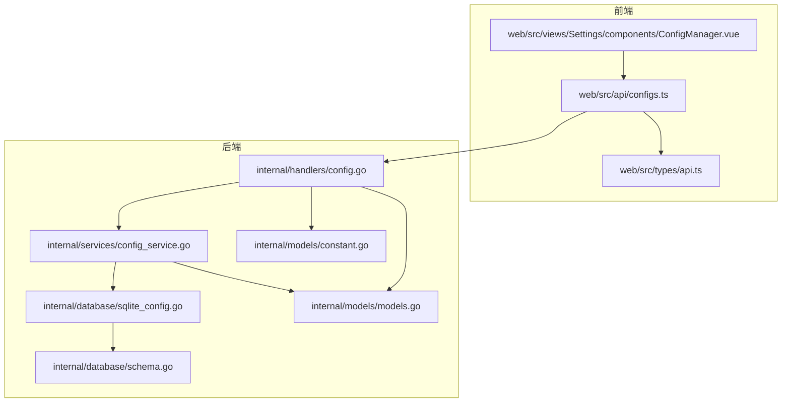
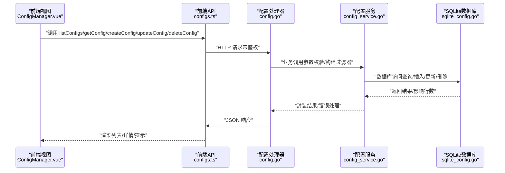
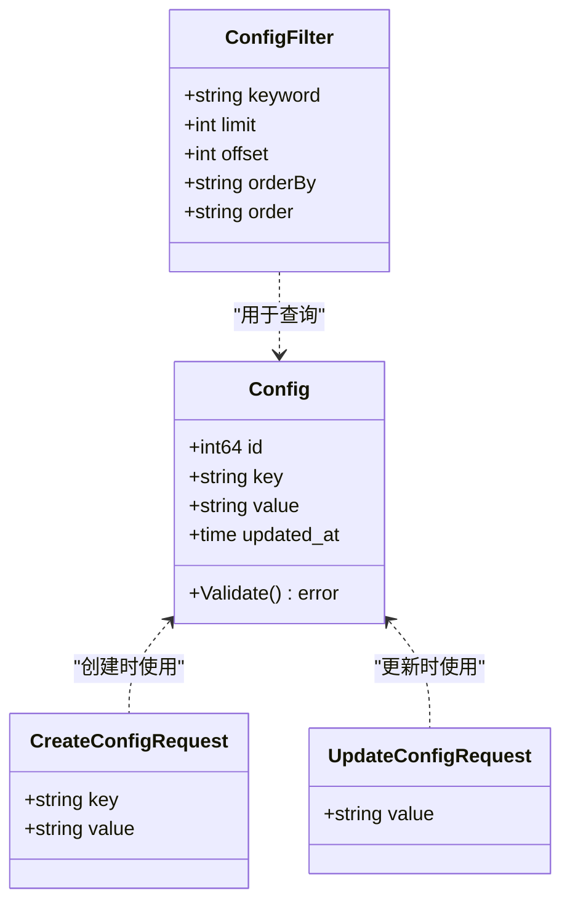
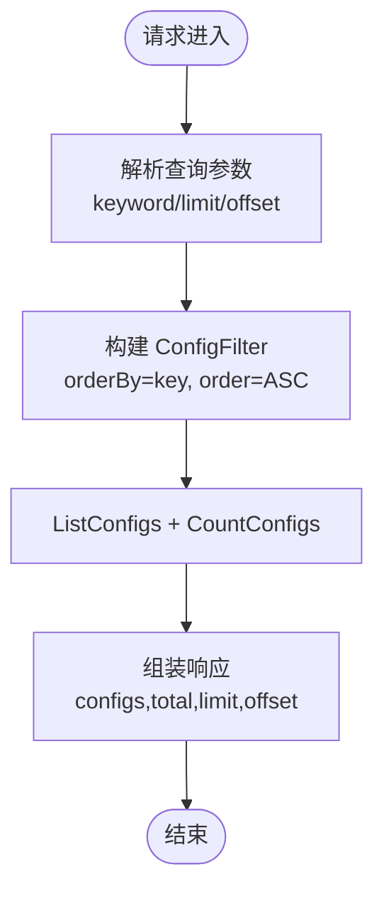
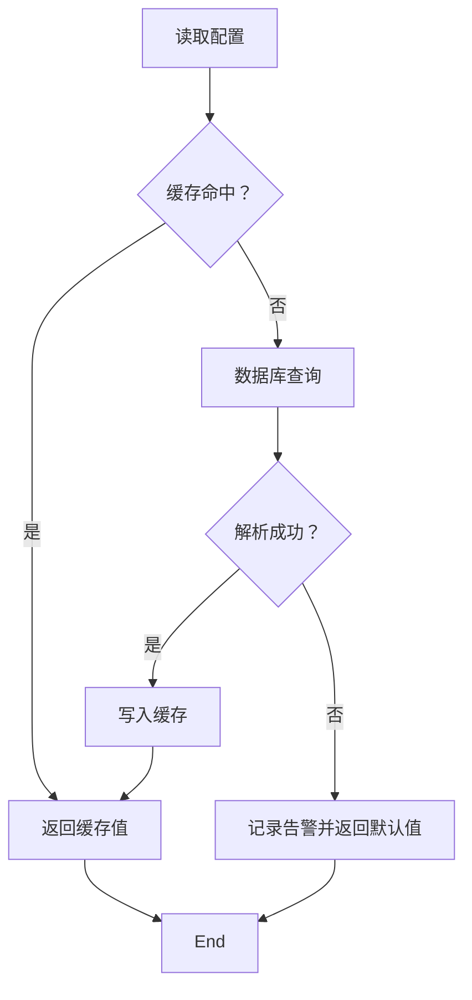
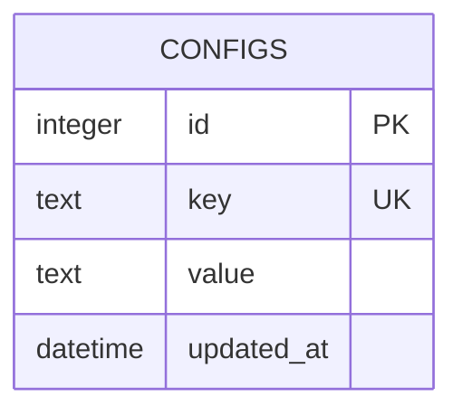
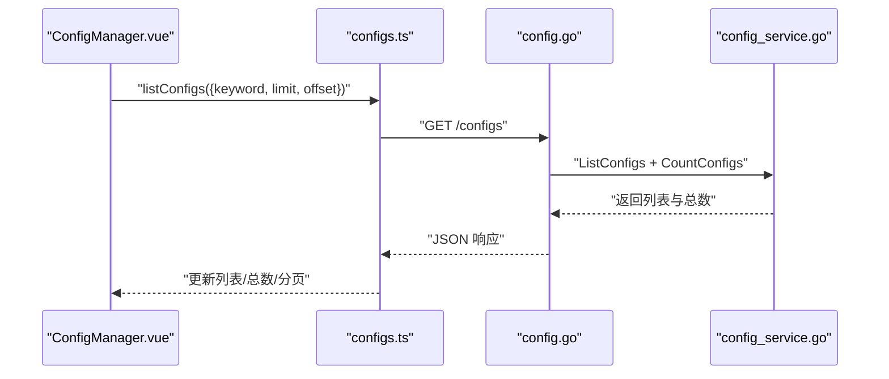
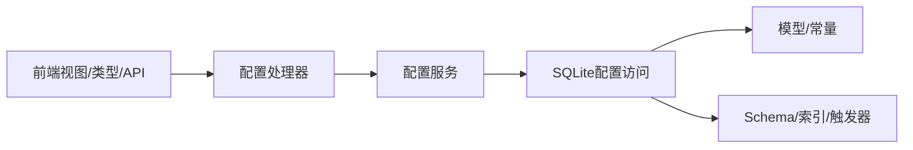

# 配置管理 API

<cite>
**本文引用的文件**
- [internal/handlers/config.go](file://internal/handlers/config.go)
- [internal/services/config_service.go](file://internal/services/config_service.go)
- [internal/database/sqlite_config.go](file://internal/database/sqlite_config.go)
- [internal/models/models.go](file://internal/models/models.go)
- [internal/models/constant.go](file://internal/models/constant.go)
- [internal/database/schema.go](file://internal/database/schema.go)
- [web/src/api/configs.ts](file://web/src/api/configs.ts)
- [web/src/types/api.ts](file://web/src/types/api.ts)
- [web/src/views/Settings/components/ConfigManager.vue](file://web/src/views/Settings/components/ConfigManager.vue)
</cite>

## 目录
1. [简介](#简介)
2. [项目结构](#项目结构)
3. [核心组件](#核心组件)
4. [架构总览](#架构总览)
5. [详细组件分析](#详细组件分析)
6. [依赖分析](#依赖分析)
7. [性能考虑](#性能考虑)
8. [故障排查指南](#故障排查指南)
9. [结论](#结论)
10. [附录](#附录)

## 简介
本文件为 MiMusic 的“配置管理 API”提供完整接口文档，覆盖配置的增删改查、搜索与分页、系统配置项（音乐路径、扫描设置、播放器配置、主题设置等）、配置验证、模型定义与默认值、迁移与版本管理建议，以及安全、备份恢复与多环境配置管理最佳实践。文档同时给出前后端交互流程图与关键实现映射，帮助开发者快速理解与集成。

## 项目结构
配置管理涉及后端处理器、服务层、数据库层与前端 API/视图组件，形成清晰的分层架构：
- 后端
  - 处理器：负责路由、参数解析、鉴权与响应封装
  - 服务层：提供配置读写、缓存与类型转换
  - 数据库层：提供 SQLite 访问、SQL 查询与索引
  - 模型与常量：定义配置数据结构、过滤器与分页常量
- 前端
  - API 层：封装 HTTP 请求
  - 类型定义：与后端模型保持一致
  - 视图组件：提供配置管理界面与交互

**图表来源**
- [internal/handlers/config.go:1-253](file://internal/handlers/config.go#L1-L253)
- [internal/services/config_service.go:1-198](file://internal/services/config_service.go#L1-L198)
- [internal/database/sqlite_config.go:1-146](file://internal/database/sqlite_config.go#L1-L146)
- [internal/models/models.go:199-301](file://internal/models/models.go#L199-L301)
- [internal/models/constant.go:1-15](file://internal/models/constant.go#L1-L15)
- [internal/database/schema.go:53-148](file://internal/database/schema.go#L53-L148)
- [web/src/api/configs.ts:1-37](file://web/src/api/configs.ts#L1-L37)
- [web/src/types/api.ts:130-226](file://web/src/types/api.ts#L130-L226)
- [web/src/views/Settings/components/ConfigManager.vue:182-266](file://web/src/views/Settings/components/ConfigManager.vue#L182-L266)

**章节来源**
- [internal/handlers/config.go:1-253](file://internal/handlers/config.go#L1-L253)
- [internal/services/config_service.go:1-198](file://internal/services/config_service.go#L1-L198)
- [internal/database/sqlite_config.go:1-146](file://internal/database/sqlite_config.go#L1-L146)
- [internal/models/models.go:199-301](file://internal/models/models.go#L199-L301)
- [internal/models/constant.go:1-15](file://internal/models/constant.go#L1-L15)
- [internal/database/schema.go:53-148](file://internal/database/schema.go#L53-L148)
- [web/src/api/configs.ts:1-37](file://web/src/api/configs.ts#L1-L37)
- [web/src/types/api.ts:130-226](file://web/src/types/api.ts#L130-L226)
- [web/src/views/Settings/components/ConfigManager.vue:182-266](file://web/src/views/Settings/components/ConfigManager.vue#L182-L266)

## 核心组件
- 配置处理器（HTTP 层）
  - 提供配置 CRUD、列表与分页、关键词搜索、按键获取详情、删除等接口
  - 参数解析与校验、错误响应封装
- 配置服务（业务层）
  - 提供字符串/整数/布尔/JSON 类型读取与设置
  - 配置缓存（sync.Map）与失效策略
  - 与数据库层交互，统一错误处理
- 数据库层（持久化层）
  - 提供配置的增删改查、关键词搜索、分页与统计
  - 基于 SQLite 的唯一键约束与冲突更新
- 模型与常量（数据契约）
  - 定义 Config、CreateConfigRequest、UpdateConfigRequest、ConfigFilter
  - 定义默认分页限制与最大分页限制常量
- 前端 API 与视图
  - 封装配置 API 调用
  - 提供配置管理界面，支持搜索、分页、创建/编辑/删除

**章节来源**
- [internal/handlers/config.go:27-252](file://internal/handlers/config.go#L27-L252)
- [internal/services/config_service.go:151-197](file://internal/services/config_service.go#L151-L197)
- [internal/database/sqlite_config.go:13-145](file://internal/database/sqlite_config.go#L13-L145)
- [internal/models/models.go:199-301](file://internal/models/models.go#L199-L301)
- [internal/models/constant.go:4-14](file://internal/models/constant.go#L4-L14)
- [web/src/api/configs.ts:10-36](file://web/src/api/configs.ts#L10-L36)
- [web/src/views/Settings/components/ConfigManager.vue:182-266](file://web/src/views/Settings/components/ConfigManager.vue#L182-L266)

## 架构总览
下图展示配置管理的端到端调用链路，从前端发起请求，经由处理器、服务层到数据库层，最终返回响应。

**图表来源**
- [web/src/views/Settings/components/ConfigManager.vue:182-266](file://web/src/views/Settings/components/ConfigManager.vue#L182-L266)
- [web/src/api/configs.ts:10-36](file://web/src/api/configs.ts#L10-L36)
- [internal/handlers/config.go:27-252](file://internal/handlers/config.go#L27-L252)
- [internal/services/config_service.go:151-197](file://internal/services/config_service.go#L151-L197)
- [internal/database/sqlite_config.go:13-145](file://internal/database/sqlite_config.go#L13-L145)

## 详细组件分析

### 配置模型与数据结构
- 配置实体
  - 字段：id、key、value、updated_at
  - 校验：key 与 value 均不可为空
- 请求结构
  - 创建：key、value（JSON 字符串）
  - 更新：value（JSON 字符串）
- 过滤器
  - 支持关键词搜索、分页（limit/offset）、排序（orderBy/order）

**图表来源**
- [internal/models/models.go:199-301](file://internal/models/models.go#L199-L301)

**章节来源**
- [internal/models/models.go:199-301](file://internal/models/models.go#L199-L301)

### 配置 CRUD 与搜索分页接口
- 列表与搜索分页
  - 方法：GET /configs
  - 查询参数：keyword（关键词）、limit（默认分页限制）、offset（偏移）
  - 返回：configs 数组、total、limit、offset
- 获取配置详情
  - 方法：GET /configs/{key}
  - 路径参数：key（配置键）
  - 返回：单个配置对象
- 创建配置
  - 方法：POST /configs
  - 请求体：CreateConfigRequest
  - 返回：新建配置对象（201）
- 更新配置
  - 方法：PUT /configs/{key}
  - 路径参数：key；请求体：UpdateConfigRequest
  - 返回：更新后的配置对象
- 删除配置
  - 方法：DELETE /configs/{key}
  - 路径参数：key
  - 返回：成功消息

**图表来源**
- [internal/handlers/config.go:40-92](file://internal/handlers/config.go#L40-L92)
- [internal/database/sqlite_config.go:66-145](file://internal/database/sqlite_config.go#L66-L145)

**章节来源**
- [internal/handlers/config.go:27-252](file://internal/handlers/config.go#L27-L252)
- [internal/database/sqlite_config.go:66-145](file://internal/database/sqlite_config.go#L66-L145)

### 配置服务与缓存机制
- 读取策略
  - 优先从缓存（sync.Map）读取；若缺失则从数据库读取并回填缓存
  - 支持 GetString/GetInt/GetBool/GetJSON 四种类型读取
- 写入策略
  - Set/SetJSON 写入数据库并更新缓存
  - Create/Update/Delete 后清理对应键的缓存
- 错误处理
  - 读取失败时记录告警并返回默认值
  - 写入失败返回包装后的错误

**图表来源**
- [internal/services/config_service.go:29-112](file://internal/services/config_service.go#L29-L112)

**章节来源**
- [internal/services/config_service.go:15-198](file://internal/services/config_service.go#L15-L198)

### 数据库层与默认配置
- 表结构
  - configs：id、key（UNIQUE）、value、updated_at
  - 索引：idx_configs_key
  - 触发器：自动更新 updated_at
- 默认配置
  - 初始化时插入若干默认配置键，如音乐路径、封面存储路径、扫描配置、ffprobe 路径、JWT 秘钥等
- 查询能力
  - 支持关键词 LIKE 搜索、ORDER BY 与 LIMIT/OFFSET 分页

**图表来源**
- [internal/database/schema.go:53-148](file://internal/database/schema.go#L53-L148)
- [internal/database/sqlite_config.go:13-145](file://internal/database/sqlite_config.go#L13-L145)

**章节来源**
- [internal/database/schema.go:53-148](file://internal/database/schema.go#L53-L148)
- [internal/database/sqlite_config.go:13-145](file://internal/database/sqlite_config.go#L13-L145)

### 前端交互与配置管理界面
- API 调用
  - listConfigs/getConfig/createConfig/updateConfig/deleteConfig
- 视图特性
  - 支持关键词搜索、分页（limit/offset）
  - 支持创建/编辑（键不可修改）/删除
  - 加载状态、空状态与错误提示

**图表来源**
- [web/src/views/Settings/components/ConfigManager.vue:182-266](file://web/src/views/Settings/components/ConfigManager.vue#L182-L266)
- [web/src/api/configs.ts:10-36](file://web/src/api/configs.ts#L10-L36)
- [internal/handlers/config.go:40-92](file://internal/handlers/config.go#L40-L92)

**章节来源**
- [web/src/views/Settings/components/ConfigManager.vue:182-266](file://web/src/views/Settings/components/ConfigManager.vue#L182-L266)
- [web/src/api/configs.ts:10-36](file://web/src/api/configs.ts#L10-L36)

## 依赖分析
- 处理器依赖服务层与数据库层，负责参数解析与响应封装
- 服务层依赖数据库层与模型定义，负责业务逻辑与缓存
- 数据库层依赖 schema 定义，负责 SQL 执行与索引
- 前端依赖类型定义与 API 封装，负责 UI 与网络交互

**图表来源**
- [internal/handlers/config.go:15-25](file://internal/handlers/config.go#L15-L25)
- [internal/services/config_service.go:15-27](file://internal/services/config_service.go#L15-L27)
- [internal/database/sqlite_config.go:13-44](file://internal/database/sqlite_config.go#L13-L44)
- [internal/models/models.go:199-301](file://internal/models/models.go#L199-L301)
- [internal/database/schema.go:53-148](file://internal/database/schema.go#L53-L148)

**章节来源**
- [internal/handlers/config.go:15-25](file://internal/handlers/config.go#L15-L25)
- [internal/services/config_service.go:15-27](file://internal/services/config_service.go#L15-L27)
- [internal/database/sqlite_config.go:13-44](file://internal/database/sqlite_config.go#L13-L44)
- [internal/models/models.go:199-301](file://internal/models/models.go#L199-L301)
- [internal/database/schema.go:53-148](file://internal/database/schema.go#L53-L148)

## 性能考虑
- 缓存策略
  - 读取优先缓存，减少数据库压力；写入后清理对应键，避免脏读
- 分页与搜索
  - 默认分页限制与最大分页限制常量用于平衡性能与可用性
  - LIKE 搜索在 key 上建立索引，提升关键词匹配效率
- 并发安全
  - 缓存使用 sync.Map，读写锁保护，适合高并发读取场景

**章节来源**
- [internal/services/config_service.go:15-27](file://internal/services/config_service.go#L15-L27)
- [internal/models/constant.go:4-14](file://internal/models/constant.go#L4-L14)
- [internal/database/schema.go:98-98](file://internal/database/schema.go#L98-L98)

## 故障排查指南
- 常见错误与定位
  - 400：请求参数缺失或非法（如 key/value 为空）
  - 404：配置不存在（获取详情或更新前需确认存在）
  - 500：内部错误（数据库异常、JSON 解析失败、缓存异常）
- 排查步骤
  - 检查前端传参（key 唯一、value 非空、分页参数合法）
  - 查看处理器日志与服务层错误包装
  - 核对数据库中 configs 表是否存在该 key，索引是否生效
  - 若 JSON 解析失败，检查 value 的 JSON 结构是否正确
- 建议
  - 在服务层记录关键错误上下文（key、默认值、原始错误）
  - 对缓存异常进行降级（直接走数据库），并清理异常缓存键

**章节来源**
- [internal/handlers/config.go:135-166](file://internal/handlers/config.go#L135-L166)
- [internal/handlers/config.go:181-221](file://internal/handlers/config.go#L181-L221)
- [internal/handlers/config.go:235-252](file://internal/handlers/config.go#L235-L252)
- [internal/services/config_service.go:84-112](file://internal/services/config_service.go#L84-L112)
- [internal/database/sqlite_config.go:13-64](file://internal/database/sqlite_config.go#L13-L64)

## 结论
配置管理 API 通过清晰的分层设计实现了稳定、可扩展的配置读写能力，结合缓存与索引优化提升了性能；前端提供了完善的管理界面与交互体验。建议在生产环境中配合安全认证、审计日志与配置备份策略，确保配置变更的可控与可追溯。

## 附录

### 接口一览（摘要）
- GET /configs
  - 功能：获取配置列表，支持关键词搜索、分页
  - 查询参数：keyword、limit、offset
  - 返回：configs、total、limit、offset
- GET /configs/{key}
  - 功能：获取配置详情
  - 返回：Config
- POST /configs
  - 功能：创建配置
  - 请求体：CreateConfigRequest
  - 返回：Config（201）
- PUT /configs/{key}
  - 功能：更新配置
  - 请求体：UpdateConfigRequest
  - 返回：Config
- DELETE /configs/{key}
  - 功能：删除配置
  - 返回：成功消息

**章节来源**
- [internal/handlers/config.go:27-252](file://internal/handlers/config.go#L27-L252)

### 系统配置项参考
- 音乐路径
  - 键：music_path
  - 示例值：包含路径与排除目录等字段的 JSON
- 封面存储路径
  - 键：cover_storage_path
- 扫描设置
  - 键：scan_config
  - 示例值：包含自动扫描开关、间隔、支持格式等
- ffprobe 路径
  - 键：ffprobe_path
- JWT 秘钥
  - 键：jwt_secret
  - 说明：初始化时随机生成，建议生产环境替换

**章节来源**
- [internal/database/schema.go:140-147](file://internal/database/schema.go#L140-L147)

### 配置验证与默认值
- 请求验证
  - CreateConfigRequest：key 与 value 必填
  - UpdateConfigRequest：value 必填
- 服务层默认值
  - GetString/GetInt/GetBool/GetJSON 提供默认值回退
- 数据库默认值
  - 初始化时插入默认配置键值

**章节来源**
- [internal/models/models.go:207-216](file://internal/models/models.go#L207-L216)
- [internal/services/config_service.go:29-81](file://internal/services/config_service.go#L29-L81)
- [internal/database/schema.go:140-147](file://internal/database/schema.go#L140-L147)

### 配置迁移与版本管理
- 建议
  - 新增配置键时在初始化 SQL 中添加 INSERT
  - 修改配置结构时提供迁移脚本或兼容解析（服务层 GetJSON 兼容旧格式）
  - 生产环境固定 jwt_secret，避免重启后密钥变更导致会话失效
- 版本跟踪
  - 通过 Schema 中的注释与提交历史维护配置演进

**章节来源**
- [internal/database/schema.go:140-147](file://internal/database/schema.go#L140-L147)

### 安全性、备份与多环境管理
- 安全性
  - 所有配置接口均受 Bearer 认证保护
  - 建议仅管理员可写配置，敏感键（如 jwt_secret）仅在初始化阶段设置
- 备份与恢复
  - 备份 SQLite 数据库即可备份配置
  - 恢复时注意键的兼容性与默认值一致性
- 多环境
  - 开发/测试/生产使用不同数据库文件或连接字符串
  - 通过环境变量或外部配置注入初始化默认值

**章节来源**
- [internal/handlers/config.go:36-38](file://internal/handlers/config.go#L36-L38)
- [internal/database/schema.go:140-147](file://internal/database/schema.go#L140-L147)