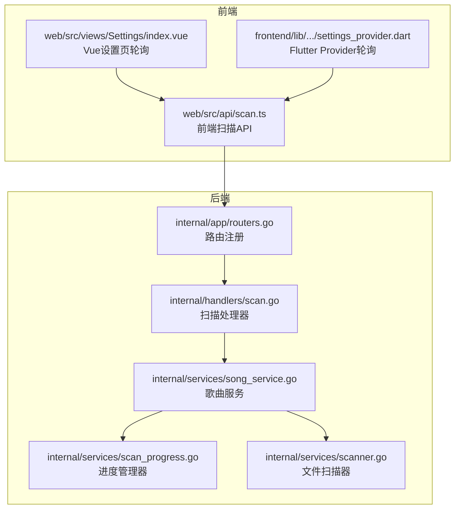
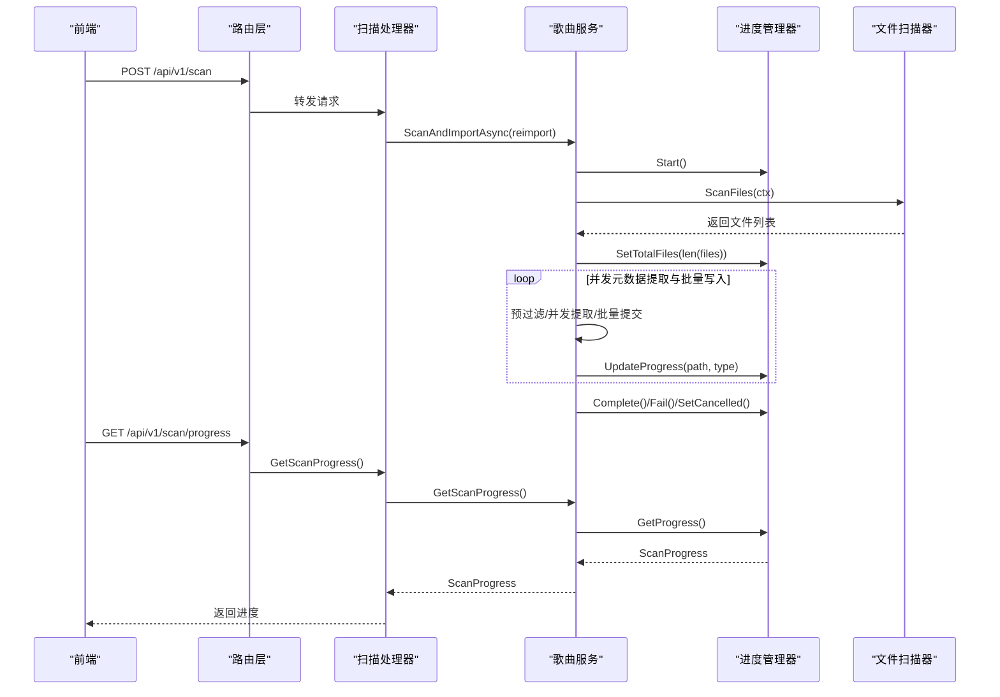
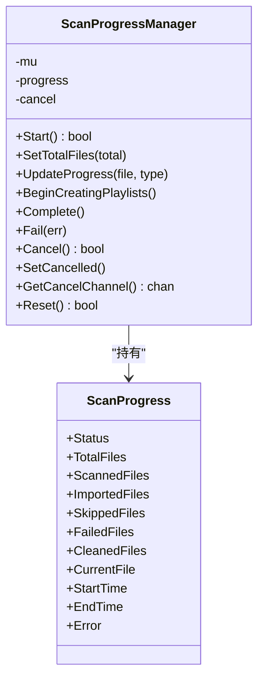
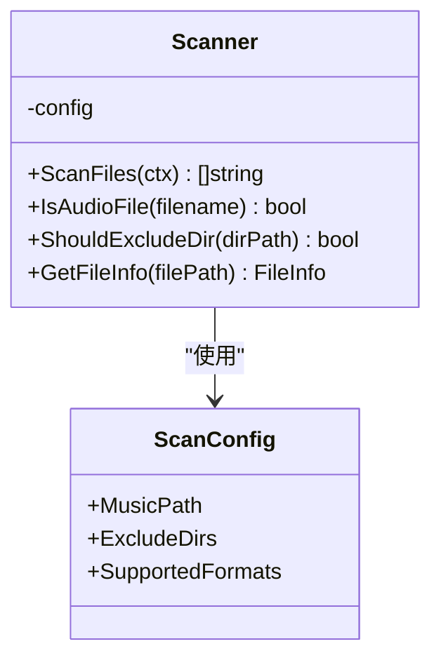
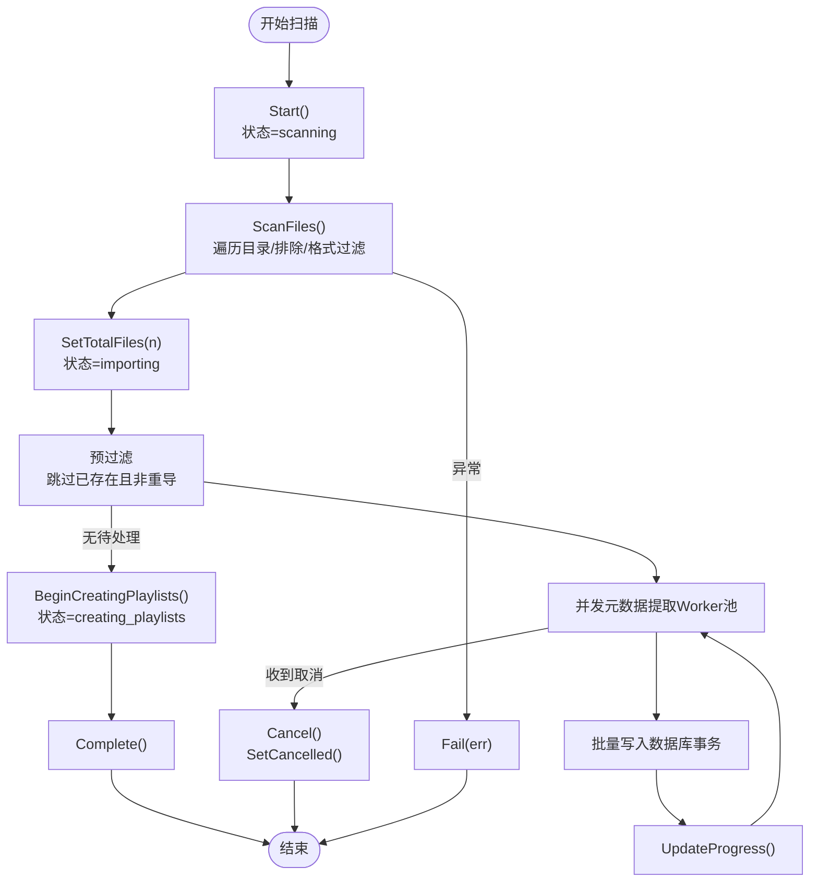
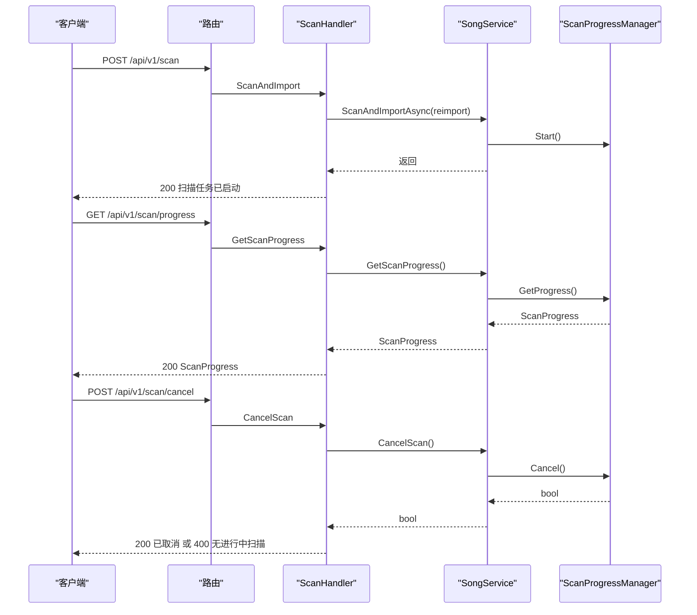
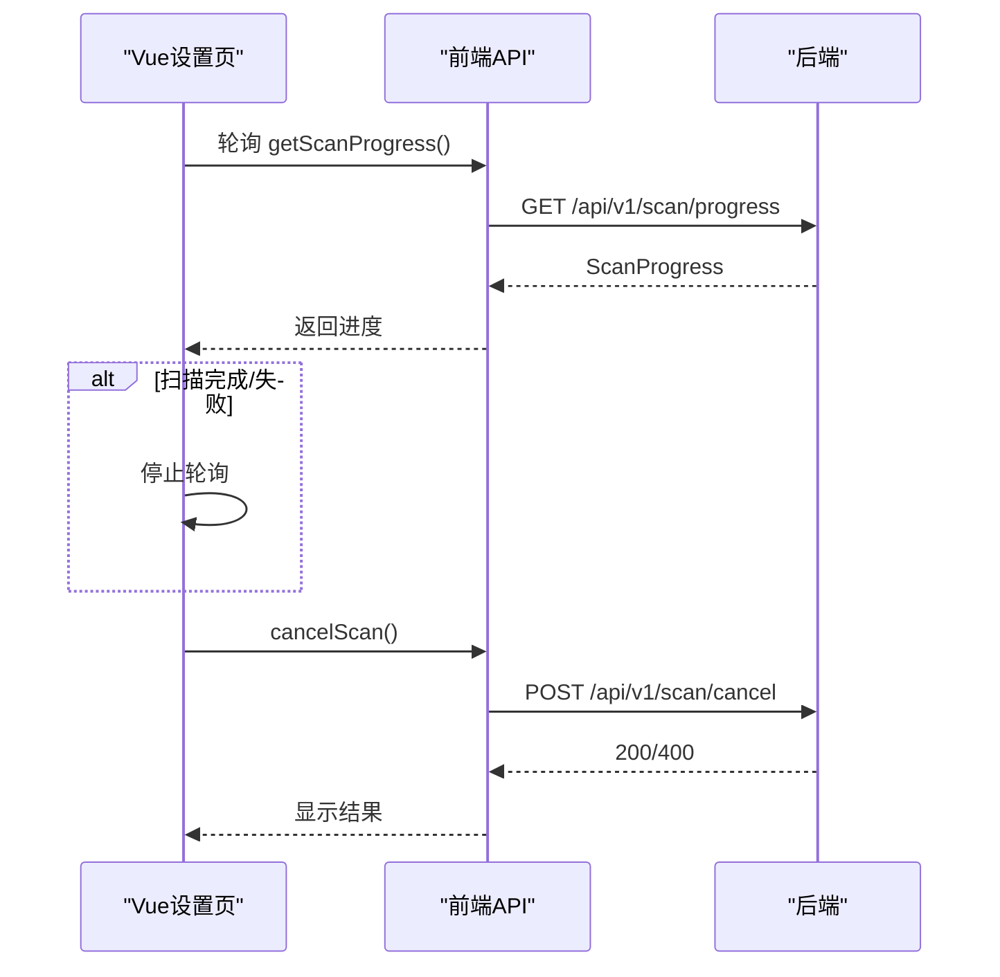
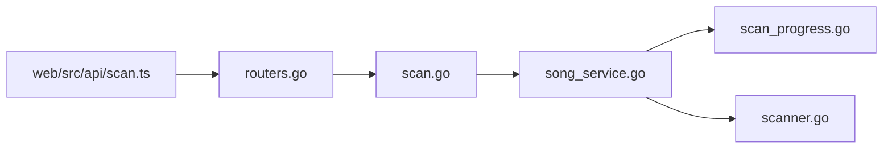

# 扫描进度监控

<cite>
**本文引用的文件**
- [internal/handlers/scan.go](file://internal/handlers/scan.go)
- [internal/services/scan_progress.go](file://internal/services/scan_progress.go)
- [internal/services/song_service.go](file://internal/services/song_service.go)
- [internal/services/scanner.go](file://internal/services/scanner.go)
- [internal/app/routers.go](file://internal/app/routers.go)
- [web/src/api/scan.ts](file://web/src/api/scan.ts)
- [web/src/types/api.ts](file://web/src/types/api.ts)
- [web/src/views/Settings/index.vue](file://web/src/views/Settings/index.vue)
- [frontend/lib/features/settings/presentation/providers/settings_provider.dart](file://frontend/lib/features/settings/presentation/providers/settings_provider.dart)
- [frontend/lib/features/settings/presentation/widgets/scan_manager.dart](file://frontend/lib/features/settings/presentation/widgets/scan_manager.dart)
- [internal/handlers/scan_test.go](file://internal/handlers/scan_test.go)
- [internal/services/scanner_test.go](file://internal/services/scanner_test.go)
</cite>

## 更新摘要
**所做更改**
- 新增 ScanStatusCreatingPlaylists 状态定义与说明
- 更新扫描进度模型，新增 CleanedFiles 字段
- 更新状态流转图，包含自动歌单创建阶段
- 更新进度管理器方法说明，新增 BeginCreatingPlaylists 方法
- 更新前端 UI 状态判断逻辑，支持新的创建歌单状态
- 更新扫描流程说明，包含自动歌单创建阶段

## 目录
1. [简介](#简介)
2. [项目结构](#项目结构)
3. [核心组件](#核心组件)
4. [架构总览](#架构总览)
5. [详细组件分析](#详细组件分析)
6. [依赖关系分析](#依赖关系分析)
7. [性能考量](#性能考量)
8. [故障排除指南](#故障排除指南)
9. [结论](#结论)
10. [附录](#附录)

## 简介
本文件面向 MiMusic 音乐扫描进度监控系统，提供完整的 API 文档与实现解析，覆盖以下关键能力：
- 扫描进度查询接口：实时获取扫描状态与进度信息
- 扫描任务生命周期：开始、暂停、恢复、取消
- 事件推送与轮询机制：前端轮询与状态变更通知
- 扫描配置参数：扫描路径、排除目录、支持格式等
- 性能优化策略：并发元数据提取、批量数据库写入、预过滤与取消通道
- 错误处理与最佳实践：异常状态、超时与回滚、大容量库优化建议

## 项目结构
扫描进度监控涉及后端 API、服务层、扫描器与前端调用四个层面：
- 后端路由与处理器：负责接收扫描请求、查询进度、取消扫描
- 服务层：封装扫描流程、并发处理、进度管理与数据库事务
- 扫描器：文件系统扫描、格式识别、排除目录与软链接处理
- 前端：发起扫描、轮询进度、展示状态与交互

**图表来源**
- [internal/app/routers.go:94-96](file://internal/app/routers.go#L94-L96)
- [internal/handlers/scan.go:39-93](file://internal/handlers/scan.go#L39-L93)
- [internal/services/song_service.go:181-376](file://internal/services/song_service.go#L181-L376)
- [internal/services/scan_progress.go:44-193](file://internal/services/scan_progress.go#L44-L193)
- [internal/services/scanner.go:30-177](file://internal/services/scanner.go#L30-L177)

**章节来源**
- [internal/app/routers.go:28-116](file://internal/app/routers.go#L28-L116)
- [internal/handlers/scan.go:10-93](file://internal/handlers/scan.go#L10-L93)

## 核心组件
- 扫描处理器（ScanHandler）：提供扫描启动、进度查询、取消扫描三个接口
- 歌曲服务（SongService）：协调扫描与导入流程，维护进度状态，执行并发与批处理
- 进度管理器（ScanProgressManager）：线程安全的状态与计数器，支持取消通道
- 文件扫描器（Scanner）：遍历目录、识别音频格式、排除指定目录、处理软链接
- 前端 API 与视图：发起扫描、轮询进度、渲染状态

**章节来源**
- [internal/handlers/scan.go:10-93](file://internal/handlers/scan.go#L10-L93)
- [internal/services/song_service.go:16-32](file://internal/services/song_service.go#L16-L32)
- [internal/services/scan_progress.go:44-193](file://internal/services/scan_progress.go#L44-L193)
- [internal/services/scanner.go:11-177](file://internal/services/scanner.go#L11-L177)
- [web/src/api/scan.ts:4-17](file://web/src/api/scan.ts#L4-L17)

## 架构总览
后端采用 MVC 分层：
- 路由层：注册 /api/v1/scan、/api/v1/scan/progress、/api/v1/scan/cancel
- 控制器层：ScanHandler 将请求委派给 SongService
- 服务层：SongService 调用 Scanner 扫描文件，使用 MetadataExtractor 提取元数据，批量写入数据库，并通过 ScanProgressManager 更新进度
- 前端层：Vue 与 Flutter 通过 API 调用与轮询实现进度可视化

**图表来源**
- [internal/app/routers.go:94-96](file://internal/app/routers.go#L94-L96)
- [internal/handlers/scan.go:39-72](file://internal/handlers/scan.go#L39-L72)
- [internal/services/song_service.go:181-376](file://internal/services/song_service.go#L181-L376)
- [internal/services/scan_progress.go:74-134](file://internal/services/scan_progress.go#L74-L134)
- [internal/services/scanner.go:30-48](file://internal/services/scanner.go#L30-L48)

## 详细组件分析

### 扫描进度模型与状态
- 状态枚举：idle、scanning、importing、creating_playlists、completed、failed、cancelling、cancelled
- 进度字段：总文件数、已扫描、已导入、已跳过、失败数、清理数、当前文件、起止时间、错误信息
- 更新类型：imported、skipped、failed

**更新** 新增 ScanStatusCreatingPlaylists 状态，用于表示自动歌单创建阶段

**图表来源**
- [internal/services/scan_progress.go:30-193](file://internal/services/scan_progress.go#L30-L193)

**章节来源**
- [internal/services/scan_progress.go:8-193](file://internal/services/scan_progress.go#L8-L193)

### 扫描配置参数
- 音乐目录路径：MusicPath
- 排除目录名称：ExcludeDirs（按路径片段匹配）
- 支持的音频格式：SupportedFormats（不区分大小写）

**图表来源**
- [internal/services/scanner.go:11-177](file://internal/services/scanner.go#L11-L177)

**章节来源**
- [internal/services/scanner.go:11-177](file://internal/services/scanner.go#L11-L177)

### 扫描任务生命周期与并发流水线
- 启动：Start() 设置状态为 scanning，创建取消通道
- 扫描阶段：ScanFiles() 递归遍历目录，解析软链接，排除指定目录，筛选音频格式
- 预过滤：基于现有本地歌曲路径快速跳过重复文件
- 并发提取：Worker 池并发调用 MetadataExtractor.Extract()，失败时降级为文件名+扩展名
- 批量写入：事务内批量插入/更新，失败时记录失败并继续
- 自动创建歌单：runAutoCreatePlaylists() 切换到 creating_playlists 状态，按目录自动创建歌单
- 完成/失败/取消：Complete()/Fail()/SetCancelled()，关闭取消通道

**更新** 新增自动歌单创建阶段，包含 BeginCreatingPlaylists 状态切换

**图表来源**
- [internal/services/song_service.go:181-485](file://internal/services/song_service.go#L181-L485)
- [internal/services/scan_progress.go:74-186](file://internal/services/scan_progress.go#L74-L186)
- [internal/services/scanner.go:30-177](file://internal/services/scanner.go#L30-L177)

**章节来源**
- [internal/services/song_service.go:181-485](file://internal/services/song_service.go#L181-L485)

### API 定义与行为

- 扫描启动
  - 方法与路径：POST /api/v1/scan
  - 请求体：ScanRequest.reimport（布尔）
  - 响应：200 成功返回"扫描任务已启动"；若扫描进行中返回 409
  - 权限：Bearer 认证
  - 行为：异步启动扫描，立即返回

- 扫描进度查询
  - 方法与路径：GET /api/v1/scan/progress
  - 响应：200 返回 ScanProgress 对象
  - 权限：Bearer 认证

- 取消扫描
  - 方法与路径：POST /api/v1/scan/cancel
  - 响应：200 成功；若无进行中扫描返回 400
  - 行为：发送取消信号，状态切换至 cancelling，最终进入 cancelled

**图表来源**
- [internal/app/routers.go:94-96](file://internal/app/routers.go#L94-L96)
- [internal/handlers/scan.go:39-93](file://internal/handlers/scan.go#L39-L93)
- [internal/services/song_service.go:34-42](file://internal/services/song_service.go#L34-L42)
- [internal/services/scan_progress.go:156-175](file://internal/services/scan_progress.go#L156-L175)

**章节来源**
- [internal/handlers/scan.go:22-93](file://internal/handlers/scan.go#L22-L93)
- [internal/app/routers.go:94-96](file://internal/app/routers.go#L94-L96)

### 前端集成与轮询策略
- Vue 设置页：每 500ms 轮询一次 /api/v1/scan/progress，当扫描完成或失败时停止轮询
- Flutter Provider：每 2 秒轮询一次 /api/v1/scan/progress，当完成/错误/取消时停止轮询
- 取消按钮：调用 /api/v1/scan/cancel，捕获异常并提示
- 状态判断：新增 isCreatingPlaylists 状态判断，显示"正在按目录自动创建歌单..."提示

**更新** 前端 UI 新增对创建歌单状态的支持，进度条显示为不确定状态

**图表来源**
- [web/src/views/Settings/index.vue:485-497](file://web/src/views/Settings/index.vue#L485-L497)
- [web/src/views/Settings/index.vue:595-604](file://web/src/views/Settings/index.vue#L595-L604)
- [frontend/lib/features/settings/presentation/providers/settings_provider.dart:158-194](file://frontend/lib/features/settings/presentation/providers/settings_provider.dart#L158-L194)
- [web/src/api/scan.ts:9-17](file://web/src/api/scan.ts#L9-L17)

**章节来源**
- [web/src/views/Settings/index.vue:485-613](file://web/src/views/Settings/index.vue#L485-L613)
- [frontend/lib/features/settings/presentation/providers/settings_provider.dart:158-194](file://frontend/lib/features/settings/presentation/providers/settings_provider.dart#L158-L194)
- [web/src/api/scan.ts:4-17](file://web/src/api/scan.ts#L4-L17)

## 依赖关系分析
- 路由层依赖处理器：/api/v1/scan、/api/v1/scan/progress、/api/v1/scan/cancel
- 处理器依赖服务层：ScanHandler -> SongService
- 服务层依赖进度管理器与扫描器：SongService -> ScanProgressManager, Scanner
- 前端依赖后端 API：web/src/api/scan.ts -> /api/v1/scan*

**图表来源**
- [internal/app/routers.go:94-96](file://internal/app/routers.go#L94-L96)
- [internal/handlers/scan.go:39-93](file://internal/handlers/scan.go#L39-L93)
- [internal/services/song_service.go:16-32](file://internal/services/song_service.go#L16-L32)
- [internal/services/scan_progress.go:44-58](file://internal/services/scan_progress.go#L44-L58)
- [internal/services/scanner.go:18-28](file://internal/services/scanner.go#L18-L28)
- [web/src/api/scan.ts:4-17](file://web/src/api/scan.ts#L4-L17)

**章节来源**
- [internal/app/routers.go:28-116](file://internal/app/routers.go#L28-L116)
- [internal/handlers/scan.go:10-93](file://internal/handlers/scan.go#L10-L93)
- [internal/services/song_service.go:16-32](file://internal/services/song_service.go#L16-L32)
- [web/src/api/scan.ts:4-17](file://web/src/api/scan.ts#L4-L17)

## 性能考量
- 并发元数据提取：默认 4 个 worker 并行提取，充分利用 CPU 与 ffprobe IO
- 批量数据库写入：默认批量大小 50，事务一次性提交，降低磁盘 fsync 次数与锁竞争
- 预过滤：扫描前先查询现有本地歌曲路径，避免重复导入
- 取消通道：在扫描、预过滤、并发提取、批量写入各阶段检查取消信号，保证快速响应
- 轮询频率：Vue 每 500ms、Flutter 每 2s 轮询，兼顾实时性与带宽
- 自动歌单创建：采用批量插入方式，支持包含子目录选项，避免单条 SQL 过长

**更新** 新增自动歌单创建阶段的性能考虑

**章节来源**
- [internal/services/song_service.go:210-213](file://internal/services/song_service.go#L210-L213)
- [internal/services/song_service.go:252-376](file://internal/services/song_service.go#L252-L376)
- [web/src/views/Settings/index.vue:499-506](file://web/src/views/Settings/index.vue#L499-L506)
- [frontend/lib/features/settings/presentation/providers/settings_provider.dart:178-187](file://frontend/lib/features/settings/presentation/providers/settings_provider.dart#L178-L187)

## 故障排除指南
- 扫描未启动或返回 409
  - 可能原因：扫描已在进行中
  - 处理建议：等待当前扫描完成，或调用取消接口后再启动

- 轮询无更新
  - 可能原因：未处于 scanning/importing/creating_playlists 状态；网络/权限问题
  - 处理建议：确认已调用扫描启动；检查认证头；调整轮询间隔

- 取消无效
  - 可能原因：状态不在 scanning/importing；取消通道未建立
  - 处理建议：确认扫描确实进行中；前端捕获 400 并提示

- 大容量库扫描缓慢
  - 优化建议：提升 worker 数量、增大批量大小、减少排除目录数量、确保磁盘 IO 能力充足

- 路径不存在或权限不足
  - 可能原因：MusicPath 不存在或不可读
  - 处理建议：修正路径；赋予读取权限；检查软链接目标可达性

- 自动歌单创建失败
  - 可能原因：数据库连接问题、权限不足、磁盘空间不足
  - 处理建议：检查数据库状态；确认有足够的磁盘空间；查看日志获取详细错误信息

**更新** 新增自动歌单创建阶段的故障排除指导

**章节来源**
- [internal/handlers/scan.go:49-57](file://internal/handlers/scan.go#L49-L57)
- [internal/services/scan_progress.go:74-91](file://internal/services/scan_progress.go#L74-L91)
- [internal/services/scan_progress.go:156-175](file://internal/services/scan_progress.go#L156-L175)
- [internal/services/scanner.go:30-48](file://internal/services/scanner.go#L30-L48)
- [internal/services/song_service.go:220-228](file://internal/services/song_service.go#L220-L228)

## 结论
MiMusic 的扫描进度监控系统通过清晰的分层设计与并发流水线，实现了高吞吐、可观测、可中断的大规模音乐库扫描。新增的自动歌单创建阶段进一步完善了扫描体验，用户可以实时掌握扫描进展并进行取消操作。针对大容量库，建议在硬件与参数上做针对性优化，以获得更佳体验。

## 附录

### API 参考摘要
- POST /api/v1/scan
  - 请求体：ScanRequest.reimport（布尔）
  - 成功：200，消息"扫描任务已启动"
  - 失败：409 扫描进行中；500 启动失败
- GET /api/v1/scan/progress
  - 成功：200，返回 ScanProgress
- POST /api/v1/scan/cancel
  - 成功：200，消息"扫描任务已取消"
  - 失败：400，无进行中扫描

**章节来源**
- [internal/handlers/scan.go:22-93](file://internal/handlers/scan.go#L22-L93)
- [internal/app/routers.go:94-96](file://internal/app/routers.go#L94-L96)

### 前端类型与调用
- 类型定义：ScanStatus、ScanProgressInfo、ScanRequest、ScanResponse
- 调用方法：scanAndImport(data)、getScanProgress()、cancelScan()

**更新** 前端类型新增 isCreatingPlaylists 状态判断属性

**章节来源**
- [web/src/types/api.ts:357-395](file://web/src/types/api.ts#L357-L395)
- [web/src/api/scan.ts:4-17](file://web/src/api/scan.ts#L4-L17)

### 测试要点
- 路由注册与处理器结构校验
- 异步扫描立即返回成功，错误在后台处理
- 扫描器对空目录、不存在目录、嵌套目录、符号链接、多种格式的正确性
- 自动歌单创建功能测试，包括包含子目录选项

**更新** 新增自动歌单创建功能的测试要点

**章节来源**
- [internal/handlers/scan_test.go:12-106](file://internal/handlers/scan_test.go#L12-L106)
- [internal/services/scanner_test.go:43-363](file://internal/services/scanner_test.go#L43-L363)