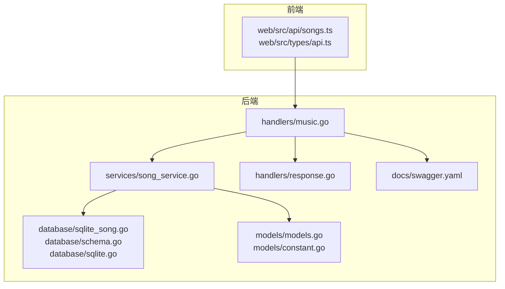
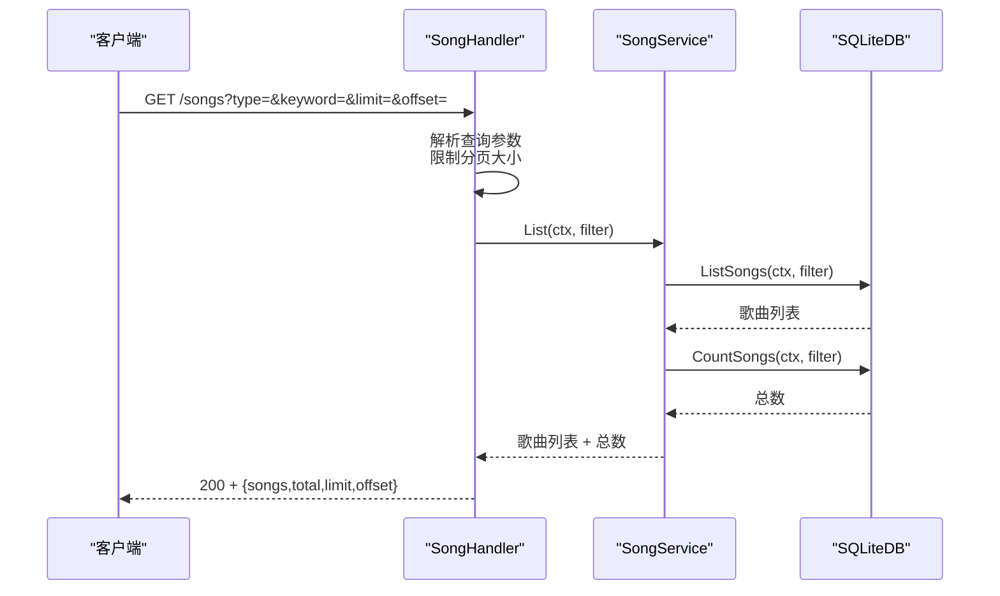
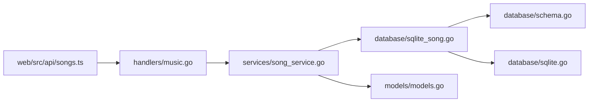

# 歌曲 CRUD 操作

<cite>
**本文引用的文件**
- [music.go](file://internal/handlers/music.go)
- [song_service.go](file://internal/services/song_service.go)
- [models.go](file://internal/models/models.go)
- [sqlite_song.go](file://internal/database/sqlite_song.go)
- [schema.go](file://internal/database/schema.go)
- [sqlite.go](file://internal/database/sqlite.go)
- [response.go](file://internal/handlers/response.go)
- [swagger.yaml](file://docs/swagger.yaml)
- [songs.ts](file://web/src/api/songs.ts)
- [api.ts](file://web/src/types/api.ts)
- [music_test.go](file://internal/handlers/music_test.go)
- [constant.go](file://internal/models/constant.go)
</cite>

## 更新摘要
**所做更改**
- 新增 cache_hash 字段的详细说明和使用场景
- 更新歌曲模型定义，包含 cache_hash 字段的完整说明
- 增强网络歌曲导入的去重机制说明
- 更新数据库迁移和索引策略
- 完善 Swagger 文档中 cache_hash 字段的描述

## 目录
1. [简介](#简介)
2. [项目结构](#项目结构)
3. [核心组件](#核心组件)
4. [架构总览](#架构总览)
5. [详细组件分析](#详细组件分析)
6. [依赖分析](#依赖分析)
7. [性能考虑](#性能考虑)
8. [故障排查指南](#故障排查指南)
9. [结论](#结论)
10. [附录](#附录)

## 简介
本文档面向 MiMusic 的"歌曲 CRUD 操作"接口，系统性地梳理了以下能力：
- 获取歌曲列表（支持按类型过滤、关键词搜索、分页）
- 获取单个歌曲详情
- 创建歌曲（本地、网络、电台）
- 更新歌曲信息（网络歌曲与电台）
- 删除歌曲（单个与批量）
- 清理无效本地歌曲
- 歌曲模型定义、字段说明与验证规则
- 本地歌曲、网络歌曲与电台在 CRUD 中的差异与最佳实践
- **新增** cache_hash 唯一标识符机制及其在去重和缓存中的作用

文档同时提供请求与响应示例、错误处理机制说明，并给出前端调用参考与后端实现映射。

## 项目结构
围绕歌曲 CRUD 的关键模块与职责如下：
- 处理器层：负责路由、参数解析、鉴权、响应封装
- 服务层：业务逻辑编排、数据校验、调用数据库
- 数据访问层：SQL 查询、事务、索引与约束
- 模型层：数据结构、验证规则、常量
- 前端 API 层：对后端接口的封装与类型定义

**图表来源**
- [music.go:1-450](file://internal/handlers/music.go#L1-L450)
- [song_service.go:1-552](file://internal/services/song_service.go#L1-L552)
- [sqlite_song.go:1-414](file://internal/database/sqlite_song.go#L1-L414)
- [schema.go:1-149](file://internal/database/schema.go#L1-L149)
- [sqlite.go:1-84](file://internal/database/sqlite.go#L1-L84)
- [models.go:1-436](file://internal/models/models.go#L1-L436)
- [response.go:1-25](file://internal/handlers/response.go#L1-L25)
- [swagger.yaml:271-358](file://docs/swagger.yaml#L271-L358)

**章节来源**
- [music.go:1-450](file://internal/handlers/music.go#L1-L450)
- [song_service.go:1-552](file://internal/services/song_service.go#L1-L552)
- [sqlite_song.go:1-414](file://internal/database/sqlite_song.go#L1-L414)
- [schema.go:1-149](file://internal/database/schema.go#L1-L149)
- [sqlite.go:1-84](file://internal/database/sqlite.go#L1-L84)
- [models.go:1-436](file://internal/models/models.go#L1-L436)
- [response.go:1-25](file://internal/handlers/response.go#L1-L25)
- [swagger.yaml:271-358](file://docs/swagger.yaml#L271-L358)

## 核心组件
- 歌曲处理器（SongHandler）：暴露 REST 接口，解析参数，调用服务层，封装响应
- 歌曲服务（SongService）：统一的业务编排，包含 CRUD、批量删除、扫描导入、清理无效本地歌曲等
- 数据库适配（SQLiteDB/SQLiteTx）：提供歌曲的增删改查、统计、批量删除（含歌单关联清理）
- 模型与常量：定义歌曲结构、类型枚举、验证规则、分页限制
- 前端 API：对后端接口进行封装，统一类型定义

**章节来源**
- [music.go:17-27](file://internal/handlers/music.go#L17-L27)
- [song_service.go:16-32](file://internal/services/song_service.go#L16-L32)
- [sqlite_song.go:14-44](file://internal/database/sqlite_song.go#L14-L44)
- [models.go:64-112](file://internal/models/models.go#L64-L112)
- [constant.go:3-14](file://internal/models/constant.go#L3-L14)
- [songs.ts:1-65](file://web/src/api/songs.ts#L1-L65)
- [api.ts:85-106](file://web/src/types/api.ts#L85-L106)

## 架构总览
下面的序列图展示了"获取歌曲列表"的典型调用链路，其他接口遵循相同模式（处理器 -> 服务 -> 数据库）。

**图表来源**
- [music.go:29-102](file://internal/handlers/music.go#L29-L102)
- [song_service.go:147-179](file://internal/services/song_service.go#L147-L179)
- [sqlite_song.go:125-196](file://internal/database/sqlite_song.go#L125-L196)

**章节来源**
- [music.go:29-102](file://internal/handlers/music.go#L29-L102)
- [song_service.go:147-179](file://internal/services/song_service.go#L147-L179)
- [sqlite_song.go:125-196](file://internal/database/sqlite_song.go#L125-L196)

## 详细组件分析

### 歌曲模型与验证规则
- 模型字段与含义参见"歌曲结构体"定义
- **新增** cache_hash 字段：用于网络歌曲导入的去重和缓存标识，确保相同内容不会重复导入
- 验证规则：
  - 标题必填
  - 类型必须为 local/remote/radio
  - 本地歌曲需提供文件路径；网络歌曲与电台需提供 URL
- 分页限制：
  - 默认分页大小：20
  - 最大分页限制：100000（用于批量场景）

**章节来源**
- [models.go:64-112](file://internal/models/models.go#L64-L112)
- [models.go:87-112](file://internal/models/models.go#L87-L112)
- [constant.go:3-14](file://internal/models/constant.go#L3-L14)

### cache_hash 字段详解
**新增** cache_hash 是 MiMusic 的核心去重机制，具有以下特性：

- **唯一性约束**：数据库层面通过唯一索引确保每个 cache_hash 只能对应一条歌曲记录
- **去重机制**：网络歌曲导入时使用 cache_hash 进行去重判断，避免重复导入相同内容
- **缓存标识**：作为歌曲的稳定标识符，便于跨会话识别和缓存管理
- **向后兼容**：未提供 cache_hash 的导入将直接插入，不影响现有流程
- **索引优化**：建立唯一索引 `idx_songs_cache_hash` 提升查询性能

**数据库实现**：
- 表结构：`cache_hash TEXT DEFAULT NULL`
- 唯一索引：`CREATE UNIQUE INDEX IF NOT EXISTS idx_songs_cache_hash ON songs(cache_hash) WHERE cache_hash IS NOT NULL AND cache_hash != ''`
- 查询方法：提供 `GetSongByCacheHash` 和 `UpdateDurationByCacheHash` 辅助方法

**章节来源**
- [models.go:83](file://internal/models/models.go#L83)
- [schema.go:24](file://internal/database/schema.go#L24)
- [sqlite.go:54](file://internal/database/sqlite.go#L54)
- [sqlite_song.go:444-499](file://internal/database/sqlite_song.go#L444-L499)
- [sqlite_song.go:501-533](file://internal/database/sqlite_song.go#L501-L533)

### 获取歌曲列表（支持类型过滤、关键词搜索、分页）
- 路由：GET /songs
- 查询参数
  - type：local/remote/radio（可选）
  - keyword：关键词（可选，模糊匹配标题/艺术家/专辑）
  - limit：每页数量，默认 20，最大 100000
  - offset：偏移量，默认 0
- 响应
  - songs：歌曲数组
  - total：总数
  - limit/offset：当前分页参数
- 处理流程
  - 解析参数并限制 limit
  - 构造过滤条件（类型、关键词、排序、分页）
  - 查询列表与总数，返回统一结构

**章节来源**
- [music.go:29-102](file://internal/handlers/music.go#L29-L102)
- [sqlite_song.go:125-196](file://internal/database/sqlite_song.go#L125-L196)
- [song_service.go:147-179](file://internal/services/song_service.go#L147-L179)

### 获取单个歌曲详情
- 路由：GET /songs/{id}
- 参数
  - id：歌曲 ID（整数）
- 响应
  - 成功：歌曲对象
  - 失败：400（无效 ID），404（不存在）
- 处理流程
  - 解析并校验 ID
  - 通过服务层按 ID 查询
  - 返回歌曲对象

**章节来源**
- [music.go:104-133](file://internal/handlers/music.go#L104-L133)
- [song_service.go:59-67](file://internal/services/song_service.go#L59-L67)

### 创建歌曲（本地、网络、电台）
- 本地歌曲
  - 路由：POST /songs（内部通过扫描导入，非直接创建）
  - 说明：本地歌曲通过扫描导入，服务层提供异步扫描与导入流程
- 网络歌曲
  - 路由：POST /songs/remote
  - 请求体字段：url、title、artist、album、duration、**cache_hash**（可选）
  - 校验：url 与 title 必填
  - **新增** 去重机制：当提供 cache_hash 时，系统会根据该标识符进行去重判断
- 电台/广播
  - 路由：POST /songs/radio
  - 请求体字段：url、title、cover_url
  - 校验：url 与 title 必填
- 响应
  - 成功：201 + 歌曲对象
  - 失败：400（请求数据错误），500（添加失败）

**章节来源**
- [music.go:275-355](file://internal/handlers/music.go#L275-L355)
- [song_service.go:487-524](file://internal/services/song_service.go#L487-L524)
- [models.go:87-112](file://internal/models/models.go#L87-L112)

### 更新歌曲信息（网络歌曲与电台）
- 路由：PUT /songs/{id}
- 适用范围：仅网络歌曲与电台（本地歌曲不支持通过此接口更新 URL）
- 请求体字段：title、artist、album、url、cover_url
- 校验
  - title 必填
  - 非本地歌曲若更新 url，url 必填
- 响应
  - 成功：200 + 更新后的歌曲对象
  - 失败：400（请求数据错误）、404（不存在）、500（更新失败）

**章节来源**
- [music.go:204-273](file://internal/handlers/music.go#L204-L273)
- [song_service.go:69-82](file://internal/services/song_service.go#L69-L82)
- [models.go:87-112](file://internal/models/models.go#L87-L112)

### 删除歌曲（单个与批量）
- 单个删除
  - 路由：DELETE /songs/{id}
  - 响应：200 + {message: "歌曲已删除"}
- 批量删除
  - 路由：POST /songs/batch-delete
  - 请求体：{ ids: [1,2,3,...] }
  - 响应：200 + { deleted: N }
  - 说明：删除时会清理歌单关联与封面文件（若存在）

**章节来源**
- [music.go:135-202](file://internal/handlers/music.go#L135-L202)
- [song_service.go:84-145](file://internal/services/song_service.go#L84-L145)
- [sqlite_song.go:334-413](file://internal/database/sqlite_song.go#L334-L413)

### 清理无效本地歌曲
- 路由：POST /songs/clean
- 功能：遍历本地歌曲，检测文件是否仍存在，不存在则删除记录与封面文件
- 响应：200 + { message: "...", count: N }

**章节来源**
- [music.go:426-449](file://internal/handlers/music.go#L426-L449)
- [song_service.go:526-551](file://internal/services/song_service.go#L526-L551)

### 歌曲模型定义与字段说明
**更新** 歌曲模型现已包含 cache_hash 字段：

- 字段清单与含义
  - id：自增主键
  - type：local/remote/radio
  - title、artist、album：标题、艺人、专辑
  - duration：时长（秒）
  - file_path：本地文件路径（本地歌曲）
  - url：网络地址（网络/电台）
  - cover_path、cover_url：封面本地路径与 URL
  - lyric、lyric_source：歌词内容与来源（file/embedded）
  - file_size、format、bit_rate、sample_rate：文件大小、格式、比特率、采样率
  - is_live：是否为直播流（电台）
  - **cache_hash**：缓存文件 hash（唯一标识符，用于去重和缓存）
  - added_at、updated_at：创建与更新时间
- 验证规则
  - 标题必填
  - 类型合法
  - 本地歌曲需 file_path；网络/电台需 url
  - **cache_hash 为可选字段，用于网络歌曲导入的去重标识**

**章节来源**
- [models.go:64-112](file://internal/models/models.go#L64-L112)

### 本地歌曲、网络歌曲与电台的 CRUD 差异
- 本地歌曲
  - 通过扫描导入，不直接对外提供创建接口
  - 支持封面文件存储与清理
- 网络歌曲
  - 通过 /songs/remote 创建
  - 支持更新标题、艺人、专辑、URL、封面 URL
  - **新增** 支持 cache_hash 去重机制，避免重复导入相同内容
- 电台/广播
  - 通过 /songs/radio 创建
  - is_live 标记为 true
  - 支持更新标题、URL、封面 URL

**章节来源**
- [music.go:275-355](file://internal/handlers/music.go#L275-L355)
- [song_service.go:487-524](file://internal/services/song_service.go#L487-L524)
- [models.go:114-122](file://internal/models/models.go#L114-L122)

### 前端调用参考
- 列表：listSongs({ limit, offset, type })
- 详情：getSong(id)
- 添加网络歌曲：addRemoteSong({ url, title, artist?, album?, duration?, **cache_hash?** })
- 添加电台：addRadio({ url, title, cover_url? })
- 删除：deleteSong(id)
- 更新：updateSong(id, { title, artist?, album?, url, cover_url? })
- 清理：cleanInvalidSongs()

**章节来源**
- [songs.ts:21-65](file://web/src/api/songs.ts#L21-L65)
- [api.ts:228-251](file://web/src/types/api.ts#L228-L251)

## 依赖分析
- 处理器依赖服务层，服务层依赖数据库层与模型层
- 数据库层基于 SQLite，包含索引与触发器，确保查询与更新性能
- 前端通过统一的 API 封装与类型定义对接后端
- **新增** cache_hash 机制依赖数据库唯一索引和专门的查询方法

**图表来源**
- [music.go:1-15](file://internal/handlers/music.go#L1-L15)
- [song_service.go:1-14](file://internal/services/song_service.go#L1-L14)
- [sqlite_song.go:1-12](file://internal/database/sqlite_song.go#L1-L12)
- [schema.go:1-4](file://internal/database/schema.go#L1-L4)
- [sqlite.go:1-4](file://internal/database/sqlite.go#L1-L4)
- [models.go:1-6](file://internal/models/models.go#L1-L6)

**章节来源**
- [music.go:1-15](file://internal/handlers/music.go#L1-L15)
- [song_service.go:1-14](file://internal/services/song_service.go#L1-L14)
- [sqlite_song.go:1-12](file://internal/database/sqlite_song.go#L1-L12)
- [schema.go:1-4](file://internal/database/schema.go#L1-L4)
- [sqlite.go:1-4](file://internal/database/sqlite.go#L1-L4)
- [models.go:1-6](file://internal/models/models.go#L1-L6)

## 性能考虑
- 分页限制
  - 默认 20，最大 100000，避免过大查询导致性能问题
- 查询优化
  - 数据库包含针对 type、title、artist、added_at 的索引
  - **新增** cache_hash 唯一索引，提升去重和查询性能
  - 列表查询默认按 added_at 降序
- 批量删除
  - 使用事务一次性删除歌单关联与歌曲记录，减少多次往返
- 扫描导入
  - 并发元数据提取、批量写入、事务提交，提升本地歌曲导入吞吐
- **新增** cache_hash 优化
  - 唯一索引确保去重操作 O(1) 复杂度
  - 支持快速查找和更新操作

**章节来源**
- [constant.go:3-14](file://internal/models/constant.go#L3-L14)
- [schema.go:89-103](file://internal/database/schema.go#L89-L103)
- [sqlite_song.go:334-413](file://internal/database/sqlite_song.go#L334-L413)
- [song_service.go:215-376](file://internal/services/song_service.go#L215-L376)
- [sqlite.go:54](file://internal/database/sqlite.go#L54)

## 故障排查指南
- 常见错误响应
  - 400：无效 ID、请求数据错误（如缺少必填字段）
  - 404：歌曲不存在
  - 500：服务器内部错误（数据库异常、文件读取失败等）
- 错误响应结构
  - { error: "...", detail?: "..." }
- 常见问题定位
  - 列表/详情：确认 ID 是否为整数、数据库中是否存在
  - 创建/更新：确认必填字段是否满足类型要求（本地/网络/电台）
  - 删除：确认 ID 是否存在，批量删除时检查 ids 数组
  - 清理：确认本地文件路径是否有效
  - **新增** cache_hash：确认去重机制正常工作，检查唯一索引是否创建成功

**章节来源**
- [response.go:15-24](file://internal/handlers/response.go#L15-L24)
- [music.go:116-165](file://internal/handlers/music.go#L116-L165)
- [music_test.go:309-347](file://internal/handlers/music_test.go#L309-L347)

## 结论
MiMusic 的歌曲 CRUD 接口设计清晰，职责分离明确，支持本地、网络与电台三类歌曲的差异化操作。通过严格的模型验证、分页限制与数据库索引，保证了查询与导入的性能与稳定性。

**新增** cache_hash 机制进一步增强了系统的健壮性和性能：
- 通过唯一索引确保数据完整性
- 支持高效的去重和缓存查找
- 保持向后兼容性，不影响现有功能

建议在生产环境中：
- 对外暴露的接口严格遵循验证规则
- 批量操作时注意 limit 控制与幂等性
- 定期执行"清理无效本地歌曲"，维护数据一致性
- **新增** 在网络歌曲导入时提供 cache_hash，充分利用去重机制

## 附录

### API 定义与示例

- 获取歌曲列表
  - 方法：GET /songs
  - 查询参数：type、keyword、limit、offset
  - 响应：{ songs, total, limit, offset }
  - 示例：/songs?type=local&keyword=夜曲&limit=20&offset=0

- 获取单个歌曲
  - 方法：GET /songs/{id}
  - 响应：歌曲对象
  - 示例：/songs/123

- 创建网络歌曲
  - 方法：POST /songs/remote
  - 请求体：{ url, title, artist?, album?, duration?, **cache_hash?** }
  - 响应：歌曲对象（201）

- 创建电台
  - 方法：POST /songs/radio
  - 请求体：{ url, title, cover_url? }
  - 响应：歌曲对象（201）

- 更新歌曲（网络/电台）
  - 方法：PUT /songs/{id}
  - 请求体：{ title, artist?, album?, url, cover_url? }
  - 响应：更新后的歌曲对象

- 删除歌曲
  - 方法：DELETE /songs/{id}
  - 响应：{ message: "歌曲已删除" }

- 批量删除
  - 方法：POST /songs/batch-delete
  - 请求体：{ ids: [1,2,3,...] }
  - 响应：{ deleted: N }

- 清理无效本地歌曲
  - 方法：POST /songs/clean
  - 响应：{ message: "...", count: N }

**章节来源**
- [music.go:29-449](file://internal/handlers/music.go#L29-L449)
- [songs.ts:21-65](file://web/src/api/songs.ts#L21-L65)
- [api.ts:228-251](file://web/src/types/api.ts#L228-L251)

### 数据模型与约束
**更新** 数据模型现已包含 cache_hash 字段：

- 表结构与索引
  - songs：包含类型、标题、艺人、专辑、时长、文件路径/URL、封面、歌词、采样率、比特率、直播标记、**cache_hash**、时间戳等
  - playlists：歌单表
  - playlist_songs：歌单-歌曲关联表（唯一约束、级联删除）
  - **新增** idx_songs_cache_hash：唯一索引，用于 cache_hash 字段的快速查询
- 约束
  - type 与 lyric_source 的 CHECK 约束
  - **新增** cache_hash 唯一约束（非空且非空字符串）
  - 触发器自动更新 updated_at

**章节来源**
- [schema.go:4-149](file://internal/database/schema.go#L4-L149)
- [sqlite.go:54](file://internal/database/sqlite.go#L54)

### cache_hash 字段详细说明

**Swagger 文档中的字段定义**：
- cache_hash：缓存文件 hash（唯一）
- 类型：string
- 示例：`"a1b2c3d4e5f6"`

**数据库实现细节**：
- 字段类型：TEXT
- 默认值：NULL
- 约束：唯一索引（非空且非空字符串）
- 查询方法：
  - `UpsertRemoteSong`：基于 cache_hash 的插入或更新
  - `GetSongByCacheHash`：根据 cache_hash 获取歌曲
  - `UpdateDurationByCacheHash`：根据 cache_hash 更新时长

**使用场景**：
- 网络歌曲导入去重
- 跨会话歌曲识别
- 缓存管理
- 性能优化查询

**章节来源**
- [swagger.yaml:289-291](file://docs/swagger.yaml#L289-L291)
- [sqlite_song.go:444-499](file://internal/database/sqlite_song.go#L444-L499)
- [sqlite_song.go:501-533](file://internal/database/sqlite_song.go#L501-L533)