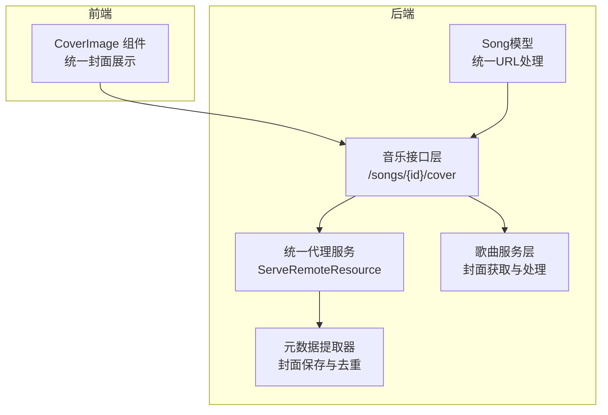
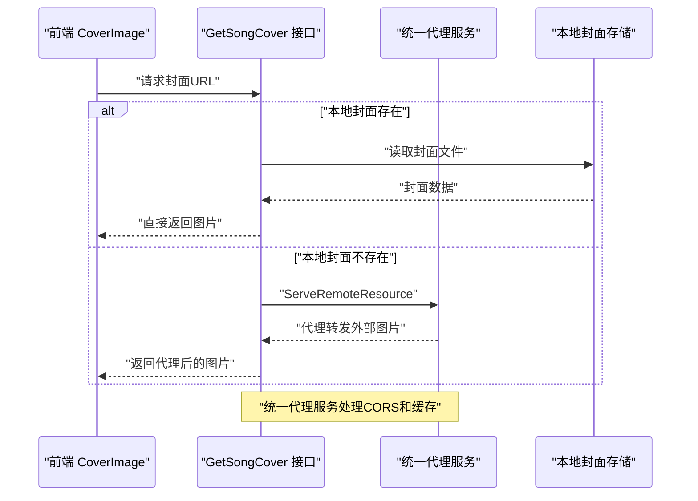
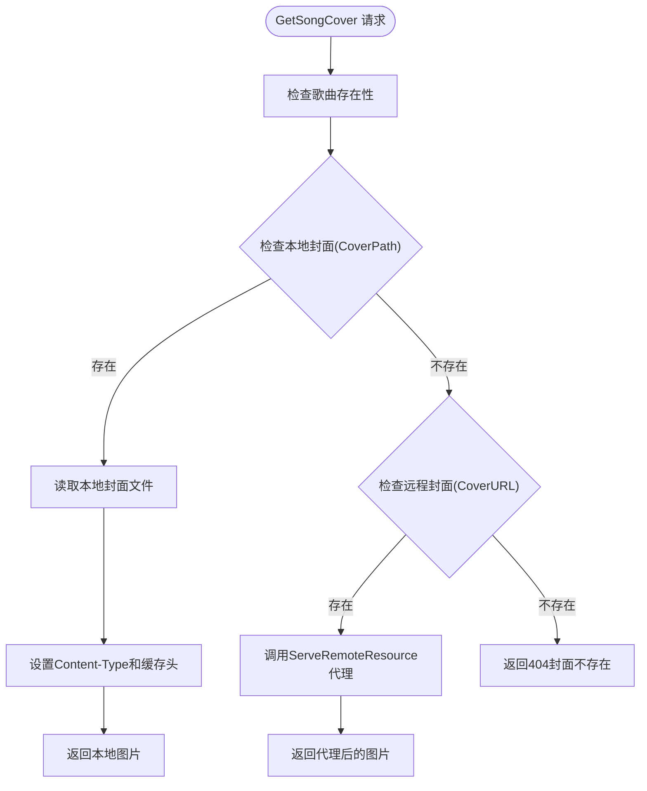
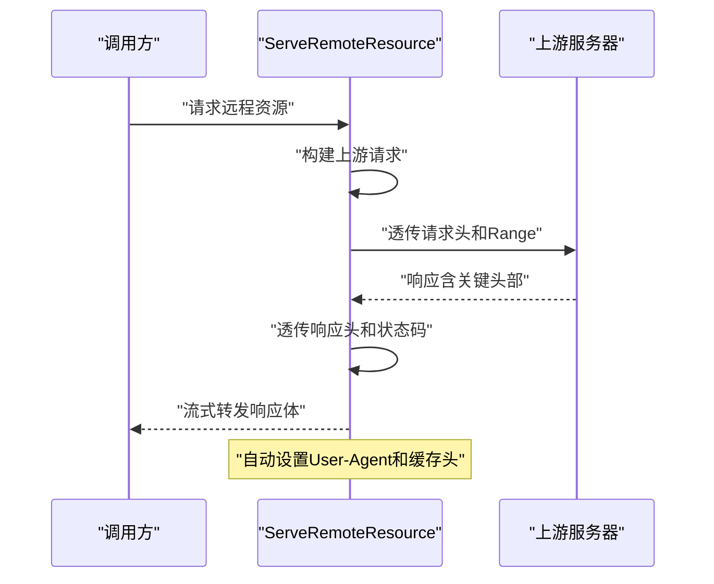
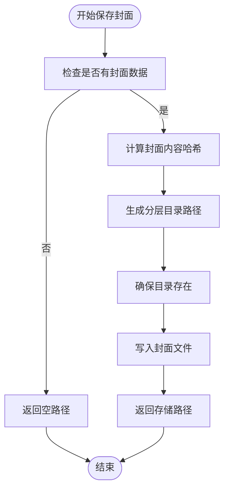
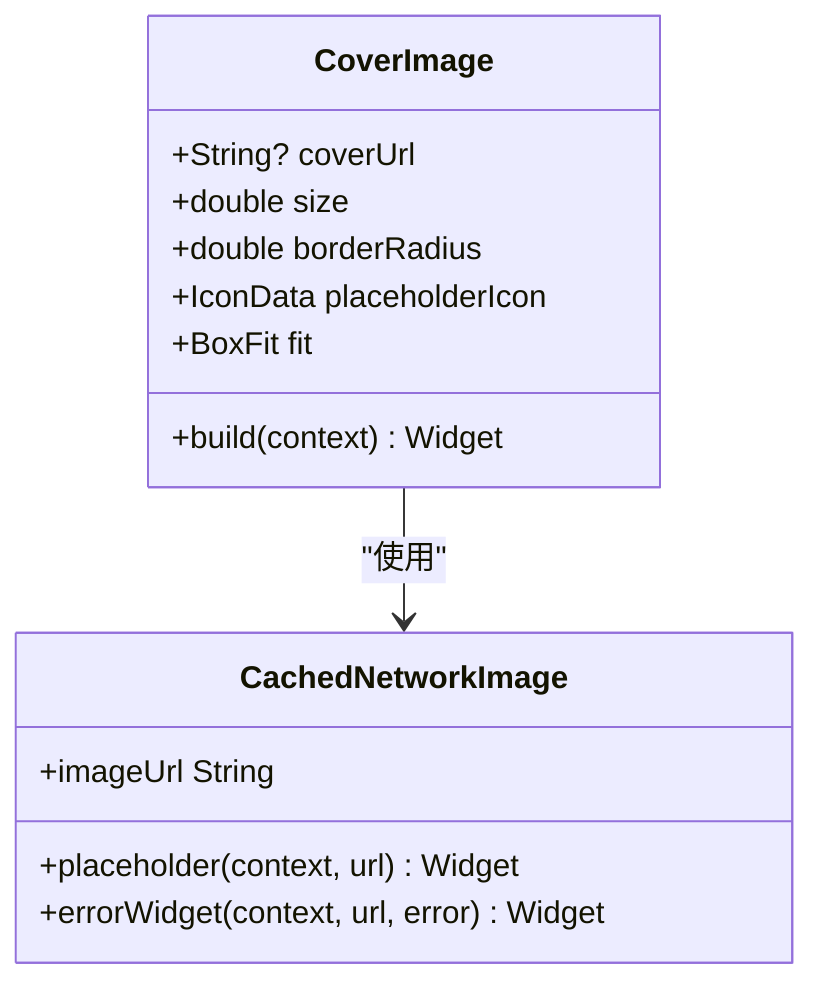
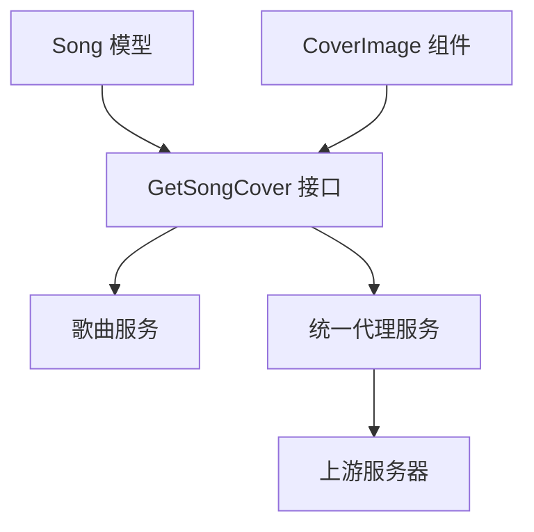

# 歌曲封面管理

<cite>
**本文引用的文件**
- [internal/handlers/music.go](file://internal/handlers/music.go)
- [internal/handlers/proxy.go](file://internal/handlers/proxy.go)
- [internal/models/models.go](file://internal/models/models.go)
- [frontend/lib/shared/widgets/cover_image.dart](file://frontend/lib/shared/widgets/cover_image.dart)
- [todo.md](file://todo.md)
- [AGENTS.md](file://AGENTS.md)
</cite>

## 更新摘要
**所做更改**
- 更新封面获取接口逻辑，简化本地与远程封面源的回退机制
- 新增统一代理服务处理封面URL的基础歌词
- 移除客户端Base62编码需求，实现前后端一体化封面处理
- 优化封面URL构建策略，消除CORS相关问题

## 目录
1. [简介](#简介)
2. [项目结构](#项目结构)
3. [核心组件](#核心组件)
4. [架构概览](#架构概览)
5. [详细组件分析](#详细组件分析)
6. [依赖分析](#依赖分析)
7. [性能考虑](#性能考虑)
8. [故障排除指南](#故障排除指南)
9. [结论](#结论)
10. [附录](#附录)

## 简介
本文件为 MiMusic 歌曲封面管理功能的详细 API 文档，覆盖以下方面：
- 获取歌曲封面图片接口：支持本地歌曲的封面文件读取和网络封面 URL 处理
- 封面图片的缓存机制与性能优化策略
- 封面文件的存储管理：文件路径、命名规则与清理策略
- 封面图片格式支持、尺寸调整与质量优化
- 封面管理最佳实践：针对大量歌曲的处理与存储优化方案

**更新** 本版本重点介绍了新的统一代理服务架构，消除了客户端复杂的封面URL处理逻辑，实现了更简洁高效的封面管理方案。

## 项目结构
围绕封面管理的相关模块分布如下：
- 后端接口层：提供封面图片获取接口与统一代理服务
- 服务层：负责歌曲生命周期管理、封面文件清理与元数据提取
- 元数据提取器：负责封面图片的保存、去重与分层目录组织
- 前端工具层：统一的封面组件，支持缓存和占位符显示
- 代理层：统一的远程资源代理服务，解决跨域问题

**图表来源**
- [internal/handlers/music.go:452-494](file://internal/handlers/music.go#L452-L494)
- [internal/handlers/proxy.go:110-167](file://internal/handlers/proxy.go#L110-L167)
- [internal/models/models.go:127-142](file://internal/models/models.go#L127-L142)
- [frontend/lib/shared/widgets/cover_image.dart:6-65](file://frontend/lib/shared/widgets/cover_image.dart#L6-L65)

## 核心组件
- **统一封面获取接口**：根据歌曲 ID 返回封面图片，支持本地封面文件读取与网络封面 URL 代理
- **智能回退机制**：优先使用本地封面，不存在时自动代理转发外部封面URL
- **统一代理服务**：新的 ServeRemoteResource 函数，专门处理封面、歌词等远程资源
- **封面存储与去重**：基于封面内容哈希生成分层目录，相同封面仅保存一次
- **前端统一组件**：简化的 CoverImage 组件，支持缓存和占位符显示
- **URL统一处理**：Song 模型的 MarshalJSON 方法统一处理所有 URL 字段

**更新** 新增统一代理服务架构，消除了客户端复杂的Base62编码需求，实现了前后端一体化的封面处理方案。

**章节来源**
- [internal/handlers/music.go:452-494](file://internal/handlers/music.go#L452-L494)
- [internal/handlers/proxy.go:110-167](file://internal/handlers/proxy.go#L110-L167)
- [internal/models/models.go:127-142](file://internal/models/models.go#L127-L142)
- [frontend/lib/shared/widgets/cover_image.dart:6-65](file://frontend/lib/shared/widgets/cover_image.dart#L6-L65)

## 架构概览
封面管理的整体流程如下：
- 前端使用统一的 CoverImage 组件展示封面
- 后端 GetSongCover 接口优先检查本地封面路径
- 本地封面存在：直接读取文件并返回
- 本地封面不存在：自动通过统一代理服务转发外部封面URL
- Song 模型的 MarshalJSON 方法统一处理所有 URL 字段
- 统一代理服务支持 Range 请求、流式转发和缓存控制

**图表来源**
- [internal/handlers/music.go:452-494](file://internal/handlers/music.go#L452-L494)
- [internal/handlers/proxy.go:110-167](file://internal/handlers/proxy.go#L110-L167)

## 详细组件分析

### 统一封面获取接口（/songs/{id}/cover）
- **功能概述**：根据歌曲 ID 返回封面图片，支持本地封面文件与网络封面 URL
- **输入参数**：
  - 路径参数：id（歌曲 ID）
- **处理流程**：
  - 校验歌曲存在性
  - 优先检查本地封面路径（CoverPath）
  - 本地封面存在：直接读取文件并返回对应图片类型
  - 本地封面不存在：自动代理转发外部 CoverURL
  - 无任何封面：返回"封面不存在"
- **响应**：
  - 成功：200 OK，Content-Type 根据扩展名设置，返回图片二进制
  - 失败：400/404/500，错误信息

**更新** 简化了封面获取逻辑，移除了复杂的客户端Base62编码需求，实现了智能回退机制。

**图表来源**
- [internal/handlers/music.go:452-494](file://internal/handlers/music.go#L452-L494)

**章节来源**
- [internal/handlers/music.go:452-494](file://internal/handlers/music.go#L452-L494)

### 统一代理服务（ServeRemoteResource）
- **功能概述**：新的统一代理服务，专门处理封面、歌词等远程资源
- **特性**：
  - 流式转发（支持大文件）
  - 透传 Range 请求（支持音频播放 seek）
  - 透传关键响应头（Content-Type、Cache-Control 等）
  - 自动设置合理的 User-Agent
  - 支持 Accept 头透传
- **缓存优化**：对图片资源设置较长缓存时间
- **错误处理**：统一的错误响应和超时控制

**更新** 新增的统一代理服务消除了CORS问题，提供了更稳定的远程资源访问能力。

**图表来源**
- [internal/handlers/proxy.go:110-167](file://internal/handlers/proxy.go#L110-L167)

**章节来源**
- [internal/handlers/proxy.go:110-167](file://internal/handlers/proxy.go#L110-L167)

### 封面存储与去重（元数据提取器）
- **存储策略**：
  - 基于封面内容哈希生成分层目录，避免单目录文件过多
  - 相同封面内容仅保存一次，实现自动去重
- **路径规则**：
  - 目录结构：{存储根目录}/{hash前两位}/{hash第3-4位}/{完整内容哈希}.{扩展名}
  - 扩展名：优先使用提取到的封面扩展名，否则默认 .jpg
- **保存流程**：
  - 从元数据中提取封面数据与扩展名
  - 生成分层路径并确保目录存在
  - 写入封面文件

**图表来源**
- [internal/models/models.go:127-142](file://internal/models/models.go#L127-L142)

**章节来源**
- [internal/models/models.go:127-142](file://internal/models/models.go#L127-L142)

### 前端封面组件（CoverImage）
- **组件设计**：统一的封面展示组件，支持缓存和占位符
- **功能特性**：
  - 使用 CachedNetworkImage 实现智能缓存
  - 支持占位符图标显示
  - 可配置尺寸、圆角半径和填充方式
  - 自动处理加载失败和错误情况
- **使用方式**：直接传入完整的封面URL，无需关心本地或远程

**更新** 简化了前端使用方式，不再需要复杂的URL构建逻辑。

**图表来源**
- [frontend/lib/shared/widgets/cover_image.dart:6-65](file://frontend/lib/shared/widgets/cover_image.dart#L6-L65)

**章节来源**
- [frontend/lib/shared/widgets/cover_image.dart:6-65](file://frontend/lib/shared/widgets/cover_image.dart#L6-L65)

### URL统一处理机制
- **Song 模型的 MarshalJSON 方法**：
  - 统一处理所有 URL 字段（URL、CoverURL、LyricURL）
  - 本地歌曲的 cover_url 返回 /api/v1/songs/{id}/cover 端点
  - 网络歌曲保留原始 CoverURL
  - 有歌词时 lyric_url 返回 /api/v1/songs/{id}/lyric
- **客户端透明化**：客户端无需关心内部实现细节
- **安全性**：原始URL保留在后端数据库，不暴露给客户端

**更新** 新的URL处理机制消除了客户端复杂的Base62编码需求，实现了前后端一体化的封面处理。

**章节来源**
- [internal/models/models.go:127-142](file://internal/models/models.go#L127-L142)

## 依赖分析
- **接口层依赖服务层**：GetSongCover 调用歌曲服务获取歌曲信息
- **代理服务独立运行**：ServeRemoteResource 作为独立函数被多个接口调用
- **模型层统一处理**：Song 模型负责所有 URL 字段的统一处理
- **前端组件解耦**：CoverImage 组件只依赖完整的URL，不关心实现细节
- **缓存机制**：前端使用 CachedNetworkImage，后端设置适当的缓存头

**图表来源**
- [internal/handlers/music.go:452-494](file://internal/handlers/music.go#L452-L494)
- [internal/handlers/proxy.go:110-167](file://internal/handlers/proxy.go#L110-L167)
- [internal/models/models.go:127-142](file://internal/models/models.go#L127-L142)
- [frontend/lib/shared/widgets/cover_image.dart:6-65](file://frontend/lib/shared/widgets/cover_image.dart#L6-L65)

## 性能考虑
- **智能回退机制**：
  - 优先使用本地封面，避免网络请求
  - 本地封面不存在时才进行代理转发
  - 减少不必要的网络开销
- **统一代理服务优化**：
  - 流式转发外部资源，避免一次性加载大文件
  - 透传 Range 请求，支持音频播放的 seek 操作
  - 自动设置合理的缓存头
- **前端缓存**：
  - 使用 CachedNetworkImage 实现智能缓存
  - 支持占位符和错误处理
  - 减少重复请求
- **存储优化**：
  - 基于内容哈希的去重机制
  - 分层目录结构提升文件系统性能
  - 长期缓存头减少重复传输

**更新** 新的统一代理服务架构显著提升了性能和可靠性。

**章节来源**
- [internal/handlers/music.go:452-494](file://internal/handlers/music.go#L452-L494)
- [internal/handlers/proxy.go:110-167](file://internal/handlers/proxy.go#L110-L167)
- [frontend/lib/shared/widgets/cover_image.dart:6-65](file://frontend/lib/shared/widgets/cover_image.dart#L6-L65)

## 故障排除指南
- **封面获取失败**：
  - 检查歌曲对象的 CoverPath 和 CoverURL 字段
  - 确认本地封面文件是否存在
  - 验证统一代理服务是否正常运行
- **代理服务错误**：
  - 检查上游服务器可达性和响应状态
  - 验证网络连接和防火墙设置
  - 查看代理服务的日志输出
- **CORS 问题**：
  - 现有架构已通过统一代理服务解决CORS问题
  - 如仍有问题，检查代理服务的配置
- **缓存问题**：
  - 前端使用 CachedNetworkImage 自动处理缓存
  - 后端设置适当的 Cache-Control 头
  - 清理浏览器缓存测试

**更新** 新架构大幅减少了故障排查的复杂性。

**章节来源**
- [internal/handlers/music.go:452-494](file://internal/handlers/music.go#L452-L494)
- [internal/handlers/proxy.go:110-167](file://internal/handlers/proxy.go#L110-L167)

## 结论
MiMusic 的封面管理通过"统一代理服务 + 智能回退机制 + URL统一处理"的新架构，实现了更加高效、稳定且易于维护的封面处理方案。新的 ServeRemoteResource 代理服务消除了CORS问题，简化了客户端逻辑，实现了前后端一体化的封面管理。配合智能回退机制和统一的URL处理，能够在各种场景下提供优质的用户体验。

**更新** 新的统一代理服务架构显著提升了系统的可靠性和可维护性。

## 附录

### API 定义
- **获取歌曲封面图片**
  - 方法：GET
  - 路径：/api/v1/songs/{id}/cover
  - 认证：Bearer Token
  - **更新**：支持本地封面优先获取和远程代理回退
  - 成功响应：200 OK，Content-Type 根据扩展名设置，返回图片二进制
  - 失败响应：400/404/500，错误信息

**章节来源**
- [internal/handlers/music.go:452-494](file://internal/handlers/music.go#L452-L494)

### 封面存储配置与规则
- **存储根目录**：由元数据提取器配置决定
- **目录结构**：{存储根目录}/{hash前两位}/{hash第3-4位}/{完整内容哈希}.{扩展名}
- **扩展名策略**：优先使用提取到的扩展名，否则默认 .jpg
- **去重机制**：相同内容哈希仅保存一次

**章节来源**
- [internal/models/models.go:127-142](file://internal/models/models.go#L127-L142)

### 前端使用指南
- **组件使用**：直接传入完整的封面URL给 CoverImage 组件
- **无需关心实现**：组件自动处理本地和远程封面的差异
- **缓存优化**：内置智能缓存机制，提升加载性能
- **错误处理**：自动显示占位符和错误状态

**更新** 前端使用方式大幅简化，消除了复杂的URL处理逻辑。

**章节来源**
- [frontend/lib/shared/widgets/cover_image.dart:6-65](file://frontend/lib/shared/widgets/cover_image.dart#L6-L65)

### 技术路线图
- **已完成**：统一代理服务架构，消除CORS问题
- **已完成**：简化客户端封面URL处理逻辑
- **进行中**：继续优化封面加载性能和缓存策略
- **未来计划**：探索更多封面格式支持和质量优化方案

**更新** 技术路线图反映了最新的架构演进。

**章节来源**
- [todo.md:1-2](file://todo.md#L1-L2)
- [AGENTS.md:204-212](file://AGENTS.md#L204-L212)