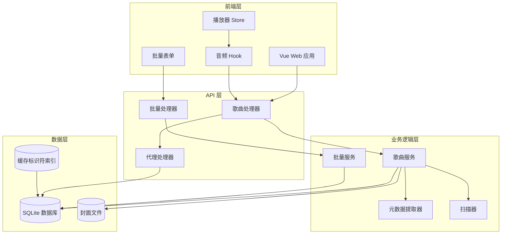
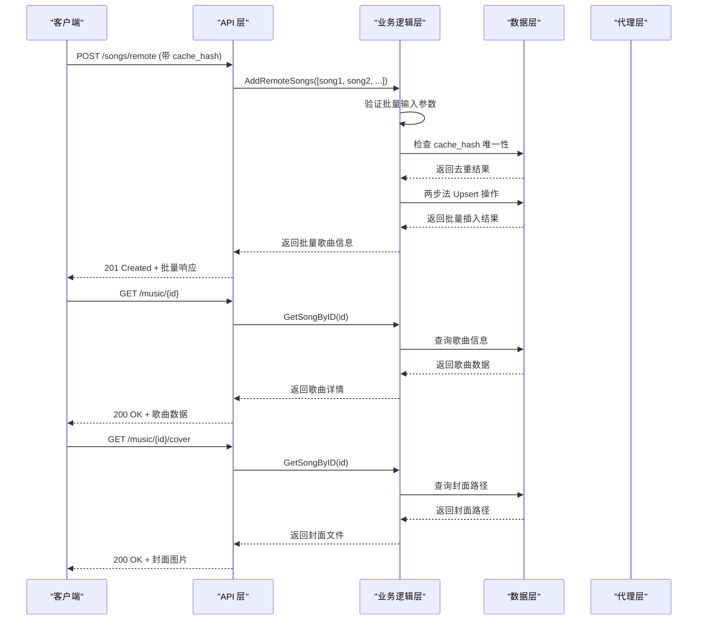

# 网络歌曲管理

<cite>
**本文引用的文件**
- [music.go](file://internal/handlers/music.go)
- [song_service.go](file://internal/services/song_service.go)
- [models.go](file://internal/models/models.go)
- [sqlite_song.go](file://internal/database/sqlite_song.go)
- [sqlite.go](file://internal/database/sqlite.go)
- [schema.go](file://internal/database/schema.go)
- [proxy.go](file://internal/handlers/proxy.go)
- [swagger.yaml](file://docs/swagger.yaml)
- [swagger.json](file://docs/swagger.json)
</cite>

## 更新摘要
**所做更改**
- 更新了 UpsertRemoteSong 方法重构的详细说明，从单一 SQL UPSERT 改为两步法检查
- 增强了缓存标识符去重机制的技术实现细节
- 新增了 BackfillDuration 功能的完整说明
- 更新了数据库迁移和索引创建的相关内容
- 增强了批量操作的去重和冲突处理机制说明

## 目录
1. [简介](#简介)
2. [项目结构](#项目结构)
3. [核心组件](#核心组件)
4. [架构概览](#架构概览)
5. [详细组件分析](#详细组件分析)
6. [批量管理功能](#批量管理功能)
7. [缓存标识符去重机制](#缓存标识符去重机制)
8. [依赖关系分析](#依赖关系分析)
9. [性能考虑](#性能考虑)
10. [故障排除指南](#故障排除指南)
11. [结论](#结论)
12. [附录](#附录)

## 简介
本文档详细描述了 MiMusic 的网络歌曲管理接口，包括批量添加网络歌曲接口、批量添加电台/广播接口、播放 URL 获取机制以及播放状态管理。文档涵盖了请求参数验证、错误处理、响应格式，并提供了实际使用示例和集成指南，帮助开发者理解网络歌曲的生命周期管理和最佳实践。

**更新** MiMusic 现已支持基于缓存标识符的智能去重功能，网络歌曲添加 API 现在包含可选的 cache_hash 字段，支持通过缓存标识符避免重复添加相同的音频内容，显著提升了批量导入的效率和数据一致性。**最新更新** UpsertRemoteSong 方法已重构为两步法检查，增强了错误处理和数据一致性保障。

## 项目结构
MiMusic 采用分层架构设计，主要分为以下层次：
- Web 层：前端 Vue 应用负责用户界面和交互
- API 层：Go 语言编写的后端服务，提供 RESTful API
- 业务逻辑层：歌曲服务处理业务规则和数据验证
- 数据访问层：SQLite 数据库存储歌曲信息
- 工具层：代理服务处理外部资源访问



**图表来源**
- [music.go:17-27](file://internal/handlers/music.go#L17-L27)
- [song_service.go:16-32](file://internal/services/song_service.go#L16-L32)
- [proxy.go:13-18](file://internal/handlers/proxy.go#L13-L18)
- [sqlite.go:51-53](file://internal/database/sqlite.go#L51-L53)

**章节来源**
- [music.go:1-545](file://internal/handlers/music.go#L1-L545)
- [song_service.go:1-623](file://internal/services/song_service.go#L1-L623)

## 核心组件
系统的核心组件包括：

### 歌曲模型
歌曲模型定义了网络歌曲和电台的基本结构，支持本地、远程和电台三种类型。**新增**：现在包含可选的 CacheHash 字段，用于缓存标识符去重。

### 歌曲处理器
处理 HTTP 请求，提供歌曲 CRUD 操作和相关功能，现已支持批量操作和缓存标识符处理。

### 歌曲服务
实现业务逻辑，包括数据验证、批量持久化、元数据处理和缓存标识符去重。

### 数据库层
使用 SQLite 存储歌曲信息，支持复杂的查询、批量事务操作和缓存标识符索引。

**章节来源**
- [models.go:64-86](file://internal/models/models.go#L64-L86)
- [music.go:17-27](file://internal/handlers/music.go#L17-L27)
- [song_service.go:16-32](file://internal/services/song_service.go#L16-L32)

## 架构概览
系统采用典型的三层架构，前后端分离的设计模式：



**图表来源**
- [music.go:291-346](file://internal/handlers/music.go#L291-L346)
- [music.go:120-137](file://internal/handlers/music.go#L120-L137)
- [music.go:416-471](file://internal/handlers/music.go#L416-L471)

## 详细组件分析

### 批量添加网络歌曲接口
批量添加网络歌曲接口支持批量远程音频 URL、标题、艺术家、专辑、时长和缓存标识符信息。

#### 接口定义
- **方法**: POST
- **路径**: `/songs/remote`
- **认证**: 需要 Bearer Token
- **请求体**: JSON 数组格式，包含多个歌曲对象，每个对象包含 URL、标题、艺术家、专辑、封面 URL、时长、缓存标识符等字段

#### 请求参数验证
接口对批量请求参数进行严格验证：
- 每个歌曲对象的 URL 和标题为必填字段
- 时长为可选的浮点数参数
- 支持空字符串的艺术家和专辑字段
- **新增**：cache_hash 为可选字段，用于缓存标识符去重
- **新增**：批量处理支持数组输入，单个验证失败会返回具体错误位置

#### 缓存标识符支持
**新增**：cache_hash 字段提供智能去重功能：
- 作为可选参数，不提供时使用传统插入方式
- 提供时使用两步法 Upsert 机制避免重复添加
- 基于唯一索引确保数据一致性
- 支持后续时长回填和状态更新

#### 响应格式
成功时返回 201 Created，包含批量操作结果：
- `count`: 成功添加的歌曲数量
- `songs`: 包含所有新添加歌曲的数组
- 每个歌曲包含完整的歌曲信息，如 ID、类型、标题、艺术家、专辑、时长、URL、封面路径、缓存标识符等

#### 错误处理
接口支持多种批量错误情况：
- 400 Bad Request：请求数据无效或缺少必要字段，包含具体的错误位置信息
- 500 Internal Server Error：服务器内部错误，可能发生在批量事务处理中

**更新** 新增批量添加网络歌曲功能，支持数组输入、缓存标识符去重和批量事务处理，显著提升了大规模数据导入的效率和数据一致性。

**章节来源**
- [music.go:291-346](file://internal/handlers/music.go#L291-L346)
- [song_service.go:494-523](file://internal/services/song_service.go#L494-L523)
- [models.go:85](file://internal/models/models.go#L85)

### 批量添加电台/广播接口
批量添加电台/广播接口专门处理批量直播流 URL 和封面图片。

#### 接口定义
- **方法**: POST
- **路径**: `/songs/radio`
- **认证**: 需要 Bearer Token
- **请求体**: JSON 数组格式，包含多个电台对象，每个对象包含 URL、标题、封面 URL 等字段

#### 特殊属性
批量电台/广播具有以下特殊属性：
- `is_live`: 始终设置为 true
- 支持批量直播流的实时播放
- 封面 URL 用于显示电台图标

#### 响应格式
返回标准的批量歌曲信息，包含电台特有的直播标识和批量操作统计。

**章节来源**
- [music.go:360-402](file://internal/handlers/music.go#L360-L402)
- [song_service.go:525-546](file://internal/services/song_service.go#L525-L546)

### 播放 URL 获取机制
系统提供了多种方式获取音频播放 URL：

#### 本地歌曲 URL
本地歌曲使用特殊的 URL 格式：
- 路径格式：`/music/{base62编码的路径}{扩展名}?access_token=xxx`
- 通过 Base62 编码确保 URL 安全性
- 需要有效的访问令牌进行身份验证

#### 远程歌曲 URL
远程歌曲直接使用原始 URL：
- 网络歌曲和电台都使用 `song.url` 字段
- 支持各种音频格式和直播流
- 可能需要代理服务绕过 CORS 限制

#### 代理服务
系统内置代理服务处理外部资源：
- 支持 HTTP/HTTPS 协议
- 域名白名单机制防止滥用
- 流式转发支持大文件下载
- Range 请求透传支持音频跳转

**章节来源**
- [useAudio.ts:154-172](file://web/src/composables/useAudio.ts#L154-L172)
- [proxy.go:72-145](file://internal/handlers/proxy.go#L72-L145)

### 播放状态管理
播放状态管理通过 Vue Store 实现，支持多种播放模式：

#### 播放器状态
- 当前播放歌曲：`currentSong`
- 播放列表：`playlist`
- 当前索引：`currentIndex`
- 播放状态：`isPlaying`
- 音量控制：`volume`
- 播放进度：`currentTime`
- 总时长：`duration`
- 播放模式：`playMode`

#### 播放模式
支持四种播放模式：
- **顺序播放** (`order`)：按添加顺序播放
- **列表循环** (`loop`)：循环播放整个列表
- **单曲循环** (`single`)：重复播放当前歌曲
- **随机播放** (`random`)：随机选择歌曲

#### 播放控制
- 播放/暂停：`togglePlay()`
- 下一首：`playNext()`
- 上一首：`playPrev()`
- 跳转到指定时间：`seekTo(time)`
- 设置音量：`setVolume(val)`

**章节来源**
- [player.ts:5-30](file://web/src/stores/player.ts#L5-L30)
- [player.ts:64-78](file://web/src/stores/player.ts#L64-L78)
- [player.ts:97-128](file://web/src/stores/player.ts#L97-L128)

### 封面图片管理
系统支持本地和远程两种封面图片管理方式：

#### 本地封面
- 封面文件存储在本地文件系统
- 通过 `/cover/{encodedPath}` 路径访问
- 自动缓存一年，提升加载性能

#### 远程封面
- 直接使用远程 URL
- 通过代理服务绕过 CORS 限制
- 支持多种图片格式（JPEG、PNG、GIF、BMP）

#### 封面转换
前端提供工具函数自动转换封面路径：
- 检测本地封面路径并转换为可访问 URL
- 自动附加访问令牌进行身份验证

**章节来源**
- [music.go:416-471](file://internal/handlers/music.go#L416-L471)
- [cover.ts:8-16](file://web/src/utils/cover.ts#L8-L16)

## 批量管理功能

### 批量事务处理
批量网络歌曲管理采用了事务性处理机制，确保数据的一致性和完整性：

#### 事务特性
- **原子性**：批量操作要么全部成功，要么全部失败
- **一致性**：批量操作不会破坏数据库约束
- **隔离性**：批量操作与其他并发操作相互隔离
- **持久性**：成功的批量操作会被永久保存

#### 错误恢复机制
- 单个歌曲添加失败时，系统会回滚整个批量事务
- 提供详细的错误位置信息，便于定位问题
- 支持部分成功的情况，返回成功和失败的混合结果

### 批量操作最佳实践

#### 数据准备
- 确保所有歌曲对象都包含必要的字段
- 验证 URL 的可达性和有效性
- 准备高质量的封面图片 URL
- **新增**：为相同内容生成一致的缓存标识符

#### 错误处理
- 实现重试机制，处理临时性的网络错误
- 分批处理大量数据，避免超时
- 监控批量操作的进度和状态

#### 性能优化
- 合理设置批量大小，平衡内存使用和处理效率
- 使用异步处理，避免阻塞主线程
- 实现进度反馈，提升用户体验

**章节来源**
- [music.go:291-346](file://internal/handlers/music.go#L291-L346)
- [music.go:360-402](file://internal/handlers/music.go#L360-L402)
- [song_service.go:494-546](file://internal/services/song_service.go#L494-L546)

## 缓存标识符去重机制

### 去重原理
系统引入了基于缓存标识符的智能去重机制，通过 cache_hash 字段实现：

#### 去重策略
- **无标识符**：传统插入方式，不进行去重检查
- **有标识符**：使用两步法 Upsert 机制，基于 cache_hash 唯一性检查
- **冲突处理**：相同标识符的内容只保留一条记录
- **数据更新**：后续添加相同标识符的内容会更新现有记录

#### 数据库支持
- **字段添加**：向 songs 表添加 cache_hash 字段
- **唯一索引**：创建基于 cache_hash 的唯一索引
- **迁移兼容**：向后兼容无标识符的历史数据

#### 业务流程
1. 接收包含 cache_hash 的歌曲请求
2. 检查数据库中是否存在相同标识符的歌曲
3. 不存在则插入新记录
4. 存在则根据业务需求决定更新或跳过
5. 返回处理结果给客户端

### 技术实现

#### 数据库层
- **UpsertRemoteSong**：支持 cache_hash 的插入或更新操作，采用两步法检查
- **GetSongByCacheHash**：根据标识符查询歌曲信息
- **UpdateDurationByCacheHash**：基于标识符更新歌曲时长

#### 服务层
- **AddRemoteSongs**：批量处理包含 cache_hash 的歌曲
- **BackfillDuration**：缓存下载完成后回填时长信息

#### API 层
- **AddRemoteSongs**：接收和验证包含 cache_hash 的请求
- **批量处理**：支持混合包含和不包含标识符的批量请求

### 两步法 Upsert 机制

**更新** UpsertRemoteSong 方法已重构为两步法检查，增强了错误处理和数据一致性：

#### 两步法检查流程
1. **第一步**：查询是否存在相同 cache_hash 的记录
2. **第二步**：根据查询结果决定 INSERT 或 UPDATE 操作
3. **第三步**：回填 ID 和时间戳信息

#### 错误处理增强
- **查询错误**：明确区分 "记录不存在" 和 "查询失败"
- **插入失败**：提供详细的插入错误信息
- **更新失败**：提供详细的更新错误信息
- **回填失败**：确保 ID 和时间戳正确回填

#### 数据一致性保障
- **原子性**：两步法检查确保数据一致性
- **完整性**：唯一索引防止重复数据
- **可靠性**：详细的错误处理和回滚机制

### 使用场景

#### 批量导入优化
- 避免重复导入相同内容
- 提升导入效率和数据质量
- 支持增量更新现有内容

#### 缓存管理
- 基于内容生成稳定的缓存标识符
- 支持缓存失效和重新生成
- 优化存储空间和查询性能

**章节来源**
- [sqlite_song.go:454-538](file://internal/database/sqlite_song.go#L454-L538)
- [sqlite_song.go:540-572](file://internal/database/sqlite_song.go#L540-L572)
- [song_service.go:592-623](file://internal/services/song_service.go#L592-L623)
- [sqlite.go:51-53](file://internal/database/sqlite.go#L51-L53)
- [schema.go:105](file://internal/database/schema.go#L105)

## 依赖关系分析

```mermaid
classDiagram
class SongHandler {
+ListSongs(w, r)
+GetSong(w, r)
+DeleteSong(w, r)
+BatchDeleteSongs(w, r)
+UpdateSong(w, r)
+AddRemoteSongs(w, r)
+AddRadios(w, r)
+GetSongCover(w, r)
+CleanInvalidSongs(w, r)
}
class SongService {
+Create(ctx, song)
+GetByID(ctx, id)
+Update(ctx, song)
+Delete(ctx, id)
+BatchDelete(ctx, ids)
+List(ctx, filter)
+Search(ctx, keyword, type, limit, offset)
+Count(ctx, filter)
+AddRemoteSongs(ctx, inputs)
+AddRadios(ctx, inputs)
+CleanInvalidSongs(ctx)
+BackfillDuration(hash, filePath)
}
class Song {
+int64 ID
+string Type
+string Title
+string Artist
+string Album
+float64 Duration
+string FilePath
+string URL
+string CoverPath
+string CoverURL
+string Lyric
+string LyricSource
+int64 FileSize
+string Format
+int BitRate
+int SampleRate
+bool IsLive
+string CacheHash
+time AddedAt
+time UpdatedAt
+Validate() error
}
class ProxyHandler {
+Proxy(w, r)
-client *http.Client
-allowedHostnames map[string]struct{}
}
class SQLiteDB {
+UpsertRemoteSong(ctx, song)
+GetSongByCacheHash(ctx, hash)
+UpdateDurationByCacheHash(ctx, hash, duration)
}
SongHandler --> SongService : "依赖"
SongService --> Song : "创建/更新"
SongService --> SQLiteDB : "使用"
SongHandler --> ProxyHandler : "使用"
```

**图表来源**
- [music.go:17-27](file://internal/handlers/music.go#L17-L27)
- [song_service.go:16-32](file://internal/services/song_service.go#L16-L32)
- [models.go:64-86](file://internal/models/models.go#L64-L86)
- [proxy.go:13-18](file://internal/handlers/proxy.go#L13-L18)
- [sqlite_song.go:454-538](file://internal/database/sqlite_song.go#L454-L538)

**章节来源**
- [music.go:1-545](file://internal/handlers/music.go#L1-L545)
- [song_service.go:1-623](file://internal/services/song_service.go#L1-L623)

## 性能考虑
系统在多个层面进行了性能优化：

### 数据库优化
- 使用事务批量提交，减少磁盘 I/O 操作
- 并发元数据提取，利用多核 CPU 提高处理速度
- 预过滤机制，跳过已存在的文件
- **新增**：缓存标识符索引优化去重查询性能
- **新增**：两步法 Upsert 机制减少锁竞争

### 批量处理优化
- **批量事务**：所有批量操作在一个事务中执行，确保原子性
- **批量插入**：使用批量插入语句，减少数据库往返次数
- **内存管理**：合理控制批量大小，避免内存溢出
- **智能去重**：通过缓存标识符避免重复处理相同内容

### 缓存策略
- 封面图片缓存一年，减少重复请求
- 代理服务缓存图片资源，提升加载速度
- 播放器状态持久化，避免页面刷新丢失状态
- **新增**：缓存标识符去重减少数据库查询

### 网络优化
- 代理服务支持流式转发，适合大文件下载
- Range 请求透传，支持音频跳转功能
- 域名白名单机制，防止资源滥用

## 故障排除指南

### 常见错误及解决方案

#### 400 Bad Request
- **原因**：请求参数无效或缺少必要字段
- **解决方案**：检查 URL 和标题是否为空，确认时长参数格式正确，查看具体的错误位置信息

#### 401 Unauthorized
- **原因**：访问令牌无效或缺失
- **解决方案**：重新登录获取有效令牌，确保请求头包含正确的 Authorization 头

#### 403 Forbidden
- **原因**：代理服务拒绝访问特定域名
- **解决方案**：检查目标域名是否在允许列表中，或直接使用原始 URL

#### 500 Internal Server Error
- **原因**：服务器内部错误
- **解决方案**：查看服务器日志，检查数据库连接和文件权限

### 批量操作问题诊断

#### 部分失败
- **现象**：批量操作中部分歌曲添加成功，部分失败
- **原因**：某些歌曲对象存在验证错误或网络问题
- **解决方案**：检查失败的歌曲对象，修复验证错误后重试

#### 超时错误
- **现象**：大批量操作超时
- **原因**：单次批量操作过大或网络延迟
- **解决方案**：分批处理数据，每次处理较小的批量

#### 去重问题
- **现象**：相同内容被重复添加
- **原因**：未提供 cache_hash 或标识符不正确
- **解决方案**：为相同内容生成一致的缓存标识符，确保去重机制正常工作

#### 两步法 Upsert 错误
- **现象**：Upsert 操作失败但原因不明
- **原因**：查询阶段出现数据库错误
- **解决方案**：检查数据库连接和唯一索引状态，查看详细的错误日志

**章节来源**
- [music.go:84-93](file://internal/handlers/music.go#L84-L93)
- [useAudio.ts:196-205](file://web/src/composables/useAudio.ts#L196-L205)
- [useAudio.ts:249-259](file://web/src/composables/useAudio.ts#L249-L259)

## 结论
MiMusic 的批量网络歌曲管理接口提供了完整的音频内容管理解决方案。通过清晰的 API 设计、严格的参数验证、完善的批量事务处理、高效的性能优化和智能的缓存标识符去重机制，系统能够可靠地管理大规模的本地、远程和直播音频内容。

**更新** 新增的缓存标识符去重功能显著提升了批量导入的效率和数据一致性，原有的单个接口已升级为更强大的批量处理接口，支持数组输入、智能去重和事务性处理，满足企业级应用场景的需求。**最新更新** UpsertRemoteSong 方法的两步法重构进一步增强了系统的稳定性和数据一致性保障。

## 附录

### API 使用示例

#### 批量添加网络歌曲（带缓存标识符）
```javascript
// 前端批量调用示例
import { addRemoteSong } from '@/api/songs'

const batchRemoteSongs = [
  {
    title: "夜曲",
    artist: "周杰伦",
    album: "十一月的萧邦",
    url: "https://example.com/songs/night-song.mp3",
    duration: 253.5,
    cover_url: "https://example.com/covers/night-song.jpg",
    cache_hash: "a1b2c3d4e5f6" // 可选的缓存标识符
  },
  {
    title: "青花瓷",
    artist: "周杰伦",
    album: "我很忙",
    url: "https://example.com/songs/blue-flowers.mp3",
    duration: 215.8,
    cover_url: "https://example.com/covers/blue-flowers.jpg",
    cache_hash: "f6e5d4c3b2a1" // 可选的缓存标识符
  }
]

addRemoteSong(batchRemoteSongs)
  .then(response => {
    console.log(`成功添加 ${response.count} 首歌曲`)
    response.songs.forEach(song => {
      console.log("歌曲添加成功:", song.title)
      console.log("缓存标识符:", song.cache_hash)
    })
  })
  .catch(error => {
    console.error("批量添加失败:", error)
  })
```

#### 批量添加电台
```javascript
// 前端批量电台调用示例
import { addRadio } from '@/api/songs'

const batchRadios = [
  {
    title: "FM 101.7",
    url: "https://live.example.com/stream1",
    cover_url: "https://example.com/radio-cover1.jpg"
  },
  {
    title: "音乐台",
    url: "https://live.example.com/stream2",
    cover_url: "https://example.com/radio-cover2.jpg"
  }
]

addRadio(batchRadios)
  .then(response => {
    console.log(`成功添加 ${response.count} 个电台`)
    response.songs.forEach(song => {
      console.log("电台添加成功:", song.title)
    })
  })
  .catch(error => {
    console.error("批量添加电台失败:", error)
  })
```

#### 播放歌曲
```javascript
// 前端播放示例
import { usePlayerStore } from '@/stores/player'
import { useAudio } from '@/composables/useAudio'

const playerStore = usePlayerStore()
const audioHook = useAudio()

// 添加歌曲到播放列表
playerStore.addToPlaylist([song])

// 播放第一首歌曲
playerStore.playByIndex(0)

// 监听播放状态变化
watch(() => playerStore.isPlaying, (isPlaying) => {
  if (isPlaying) {
    audioHook.play()
  } else {
    audioHook.pause()
  }
})
```

### 最佳实践建议

#### 批量网络歌曲管理
- **批量大小控制**：建议每次批量操作不超过 100 个歌曲，避免内存压力
- **错误处理**：实现重试机制，处理网络不稳定情况
- **进度反馈**：提供批量操作进度指示，提升用户体验
- **数据验证**：在客户端进行基础验证，减少服务器端错误
- **缓存标识符**：为相同内容生成稳定的 cache_hash，提升去重效果

#### 批量电台管理
- **直播流验证**：批量添加前先验证直播流的有效性
- **封面管理**：统一管理电台封面图片，确保格式和尺寸一致
- **批量更新**：支持批量更新电台信息，如标题、封面等

#### 播放器集成
- 实现重试机制，处理网络不稳定情况
- 支持 Media Session API，提供系统级播放控制
- 优化内存使用，避免长时间播放导致的内存泄漏
- 提供用户友好的错误提示和恢复机制

#### 安全考虑
- 严格验证所有外部 URL，防止恶意链接
- 实施域名白名单机制，限制代理访问范围
- 使用访问令牌保护敏感资源
- 定期审计日志，监控异常访问行为

#### 批量操作使用建议
- **数据准备**：确保批量数据的完整性和一致性
- **错误恢复**：实现断点续传和部分重试机制
- **性能监控**：监控批量操作的性能指标，及时调整批量大小
- **回退机制**：当批量操作失败时，提供回退和恢复方案
- **缓存策略**：合理使用缓存标识符，避免重复导入相同内容

#### 缓存标识符最佳实践
- **生成策略**：基于内容特征生成稳定的标识符
- **一致性保证**：确保相同内容始终产生相同的标识符
- **冲突处理**：合理处理标识符冲突和更新逻辑
- **性能优化**：利用缓存标识符索引提升查询性能
- **两步法 Upsert**：利用两步法检查机制确保数据一致性

#### 两步法 Upsert 机制最佳实践
- **错误分类**：区分查询失败和记录不存在的不同处理方式
- **事务管理**：确保两步法操作在事务中执行
- **回滚机制**：实现完善的错误回滚和恢复机制
- **性能监控**：监控两步法操作的性能和错误率
- **日志记录**：详细记录两步法操作的执行过程和结果

**章节来源**
- [songs.ts:42-64](file://web/src/api/songs.ts#L42-L64)
- [useAudio.ts:174-206](file://web/src/composables/useAudio.ts#L174-L206)
- [player.ts:64-78](file://web/src/stores/player.ts#L64-L78)
- [sqlite.go:51-53](file://internal/database/sqlite.go#L51-L53)
- [schema.go:105](file://internal/database/schema.go#L105)