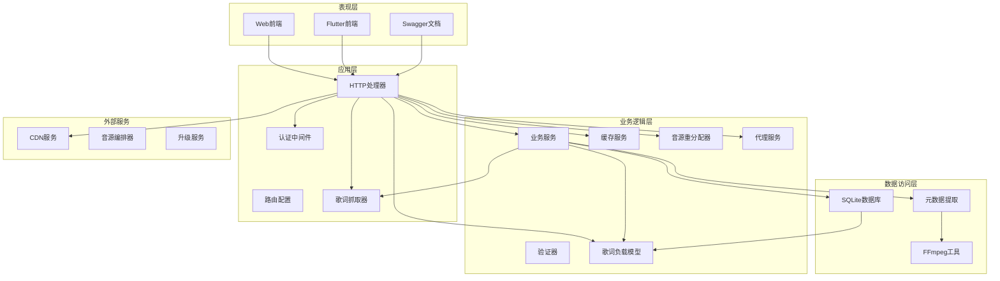
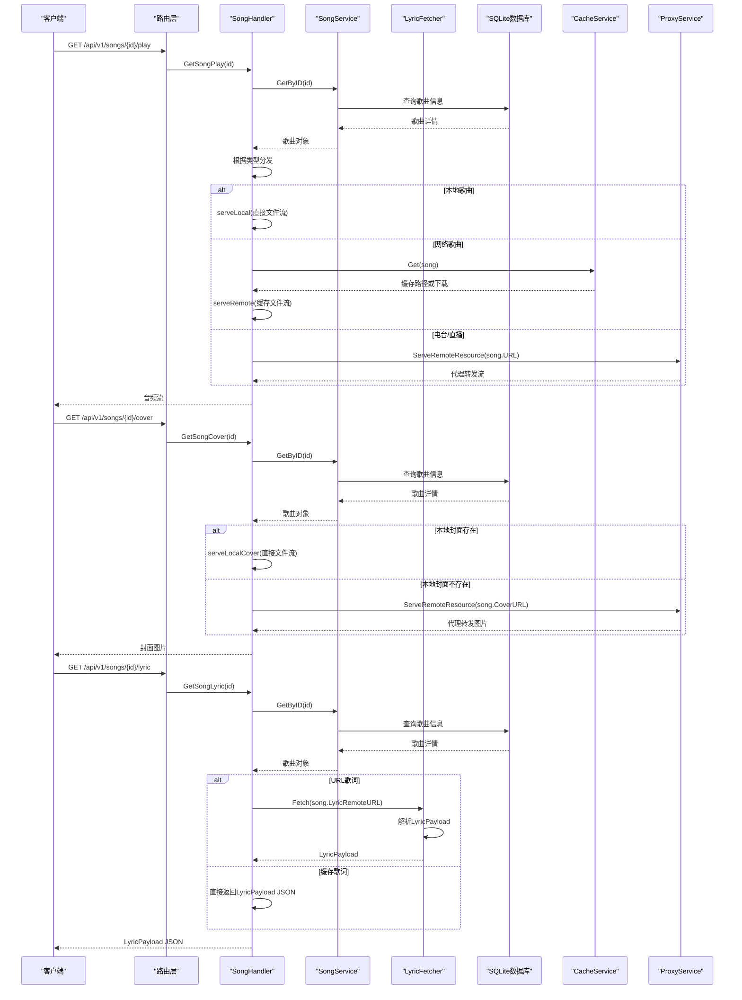
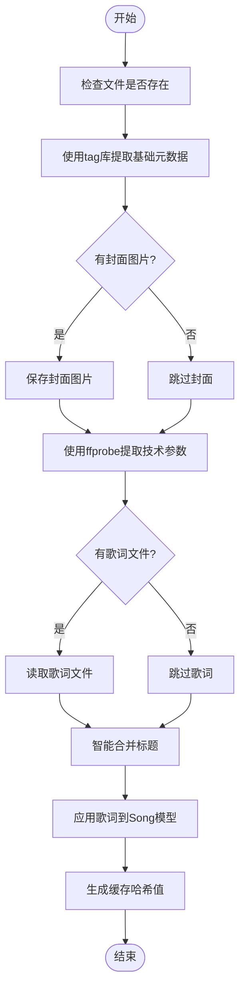
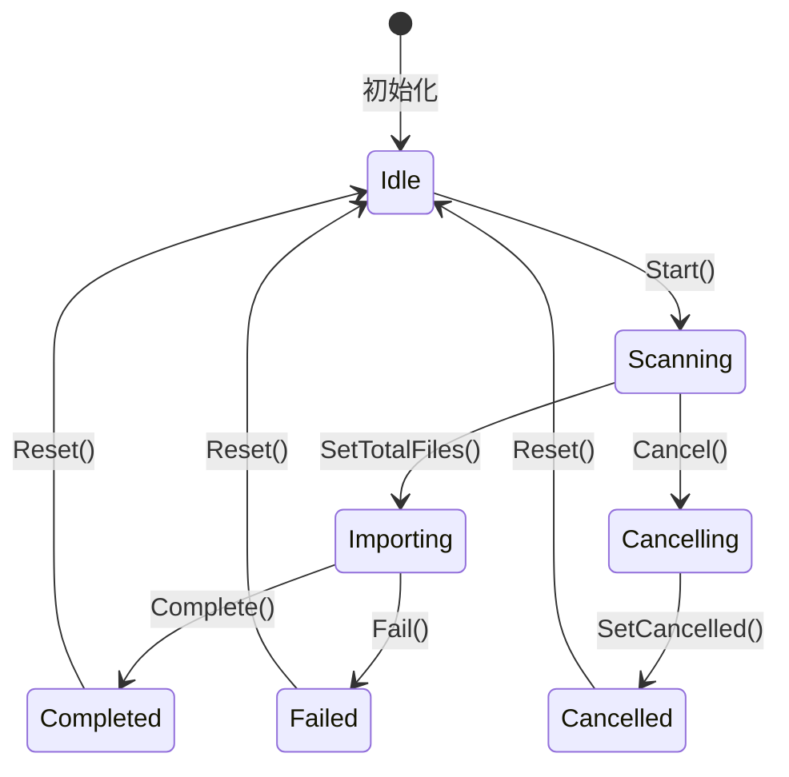
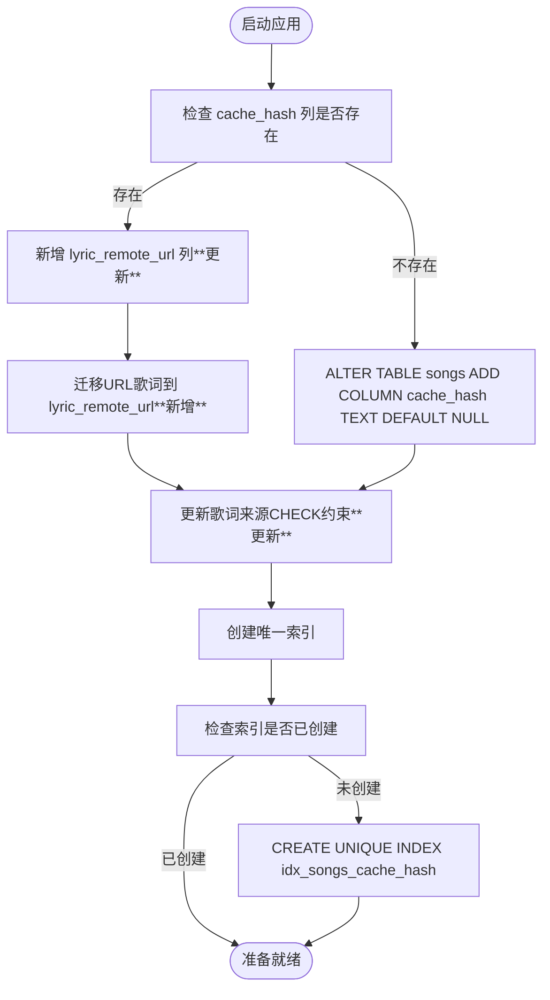
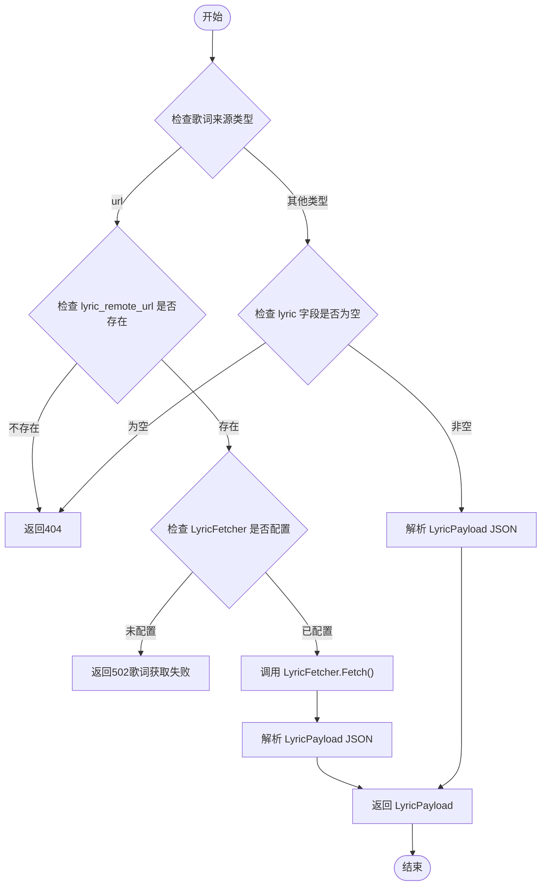
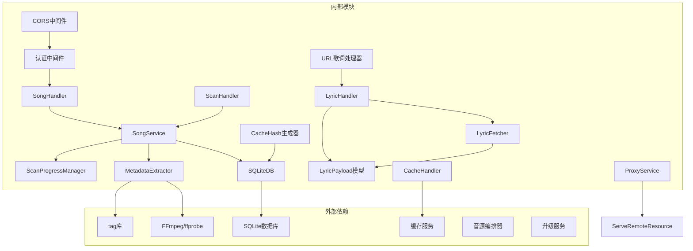

# 音乐管理 API

<cite>
**本文档引用的文件**
- [music.go](file://internal/handlers/music.go)
- [song_service.go](file://internal/services/song_service.go)
- [models.go](file://internal/models/models.go)
- [lyric.go](file://internal/models/lyric.go)
- [lyric_fetcher.go](file://internal/services/lyric_fetcher.go)
- [scan.go](file://internal/handlers/scan.go)
- [scan_progress.go](file://internal/services/scan_progress.go)
- [sqlite_song.go](file://internal/database/sqlite_song.go)
- [metadata.go](file://internal/services/metadata.go)
- [proxy.go](file://internal/handlers/proxy.go)
- [routers.go](file://internal/app/routers.go)
- [search.go](file://jsplugins-src/mimusic-jsplugin-lxmusic/handlers/search.go)
- [manager.go](file://jsplugins-src/mimusic-jsplugin-musictag/scraper/manager.go)
- [docs.go](file://docs/docs.go)
- [swagger.json](file://docs/swagger.json)
- [swagger.yaml](file://docs/swagger.yaml)
- [api_client.dart](file://frontend/lib/core/network/api_client.dart)
- [app_config.dart](file://frontend/lib/config/app_config.dart)
- [router_dev.go](file://internal/app/router_dev.go)
- [router_prod.go](file://internal/app/router_prod.go)
- [music_test.go](file://internal/handlers/music_test.go)
- [sqlite.go](file://internal/database/sqlite.go)
- [schema.go](file://internal/database/schema.go)
- [cache.go](file://internal/handlers/cache.go)
- [cache_service.go](file://internal/services/cache_service.go)
- [playlist.go](file://internal/handlers/playlist.go)
- [songs.sql.go](file://internal/database/sqlc/songs.sql.go)
</cite>

## 更新摘要
**变更内容**
- 引入 LyricPayload JSON 格式统一歌词存储和传输
- 新增 LyricFetcher 服务支持歌词远程 URL 拉取
- 扩展歌词来源类型，新增 'url' 和 'cached' 源类型
- 更新歌词管理接口，支持 LyricPayload 结构的歌词更新
- 新增歌词远程 URL 支持，实现按需加载和缓存机制
- 重构歌词存储结构，分离歌词内容和 URL 字段

## 目录
1. [简介](#简介)
2. [项目结构](#项目结构)
3. [核心组件](#核心组件)
4. [架构概览](#架构概览)
5. [详细组件分析](#详细组件分析)
6. [依赖关系分析](#依赖关系分析)
7. [性能考虑](#性能考虑)
8. [故障排除指南](#故障排除指南)
9. [结论](#结论)
10. [附录](#附录)

## 简介
MiMusic 音乐管理 API 提供了完整的音乐管理系统，包括本地音乐扫描、网络歌曲管理、音频元数据提取、扫描进度查询等功能。该系统支持多种音频格式，能够自动识别和提取音乐文件的元数据，包括标题、艺术家、专辑、时长、比特率等信息，并提供封面图片的处理和存储功能。

**重大更新** 新增歌词系统重构，引入 LyricPayload JSON 格式统一歌词存储和传输，新增 LyricFetcher 服务支持歌词远程 URL 拉取，扩展歌词来源类型，实现更灵活的歌词管理机制。

## 项目结构
项目采用分层架构设计，主要分为以下层次：



**图表来源**
- [music.go:1-775](file://internal/handlers/music.go#L1-L775)
- [song_service.go:1-712](file://internal/services/song_service.go#L1-L712)
- [models.go:1-501](file://internal/models/models.go#L1-L501)
- [lyric_fetcher.go:1-78](file://internal/services/lyric_fetcher.go#L1-L78)
- [lyric.go:1-80](file://internal/models/lyric.go#L1-L80)

## 核心组件
系统的核心组件包括：

### 歌曲管理组件
- **SongHandler**: HTTP请求处理器，负责歌曲的CRUD操作
- **SongService**: 业务服务层，处理歌曲数据的业务逻辑
- **Song模型**: 定义歌曲的数据结构和验证规则

### 歌词管理系统组件
- **LyricPayload**: 歌词负载模型，统一歌词存储和传输格式
- **LyricFetcher**: 歌词抓取器服务，支持远程歌词URL拉取
- **LyricSource 常量**: 歌词来源类型定义，包括 file、embedded、url、cached
- **ApplyLyricToSong**: 歌词应用函数，统一歌词存储形态

### 统一媒体访问组件
- **RESTful端点**: /api/v1/songs/{id}/play、/api/v1/songs/{id}/cover、/api/v1/songs/{id}/lyric
- **统一播放端点**: 所有歌曲类型通过同一端点提供播放服务
- **统一封面端点**: 本地歌曲通过端点获取封面，网络歌曲使用统一代理服务
- **统一歌词端点**: 根据歌词来源类型分发到URL下载或直接返回LyricPayload JSON

### LyricPayload JSON 格式
- **Lyric**: 主歌词（LRC格式）
- **Tlyric**: 翻译歌词（LRC格式）
- **Rlyric**: 罗马音歌词（LRC格式）
- **Lxlyric**: 逐字歌词（LRC格式）
- **统一序列化**: 支持空payload序列化为""，兼容历史数据

### LyricFetcher 服务
- **远程URL拉取**: 从插件歌词API获取LyricPayload
- **JSON格式解析**: 解析 {"code": 0, "data": {...}} 格式的响应
- **错误处理**: 网络错误、JSON解析错误、状态码错误的统一处理
- **内存保护**: 限制最大读取5MB，防止异常响应耗尽内存

### 增强封面获取组件
- **自动格式检测**: 支持jpg、png、gif、bmp、webp等多种图像格式
- **本地封面优先**: 优先使用本地封面文件，不存在时自动代理远程封面
- **Content-Type自动设置**: 根据文件扩展名自动设置正确的Content-Type
- **统一代理服务**: 使用ServeRemoteResource处理远程封面访问

### 缓存哈希管理组件
- **CacheHash**: 基于歌曲内容生成的唯一哈希值，用于去重和快速查找
- **UpsertRemoteSong**: 基于 cache_hash 的插入或更新操作
- **GetSongByCacheHash**: 根据 cache_hash 查询歌曲

### 扫描管理组件
- **ScanHandler**: 处理音乐扫描和导入任务
- **ScanProgressManager**: 管理扫描进度状态
- **Scanner**: 文件扫描器，用于发现音乐文件

### 元数据处理组件
- **MetadataExtractor**: 音频元数据提取器
- **Metadata**: 元数据结构定义
- **FFProbe**: 音频技术参数提取工具

### 缓存服务组件
- **CacheHandler**: 音乐缓存处理器，支持预加载和后台下载
- **CacheService**: 缓存服务，管理缓存文件和下载状态

**章节来源**
- [music.go:20-41](file://internal/handlers/music.go#L20-L41)
- [song_service.go:16-32](file://internal/services/song_service.go#L16-L32)
- [models.go:64-122](file://internal/models/models.go#L64-L122)
- [lyric.go:8-18](file://internal/models/lyric.go#L8-L18)
- [lyric_fetcher.go:14-23](file://internal/services/lyric_fetcher.go#L14-L23)
- [routers.go:77-182](file://internal/app/routers.go#L77-L182)

## 架构概览



**图表来源**
- [music.go:707-775](file://internal/handlers/music.go#L707-L775)
- [lyric_fetcher.go:33-77](file://internal/services/lyric_fetcher.go#L33-L77)
- [routers.go:152-160](file://internal/app/routers.go#L152-L160)

## 详细组件分析

### 歌曲 CRUD 操作接口

#### 获取歌曲列表
- **端点**: `GET /api/v1/songs`
- **功能**: 支持按类型过滤、关键词搜索和分页，**新增 cache_hash 查询参数**
- **参数**:
  - `type`: 歌曲类型 (local/remote/radio)
  - `keyword`: 搜索关键词
  - `cache_hash`: 缓存哈希值（**新增**，用于精确查询）
  - `limit`: 每页数量，默认20，最大限制
  - `offset`: 偏移量，默认0

**更新** 新增 cache_hash 查询参数，支持基于内容哈希的精确查询

**章节来源**
- [music.go:43-116](file://internal/handlers/music.go#L43-L116)
- [sqlite_song.go:125-196](file://internal/database/sqlite_song.go#L125-L196)

#### 获取单个歌曲详情
- **端点**: `GET /api/v1/songs/{id}`
- **功能**: 根据歌曲ID获取详细信息
- **参数**: `id` (路径参数)

**章节来源**
- [music.go:118-147](file://internal/handlers/music.go#L118-L147)
- [sqlite_song.go:46-71](file://internal/database/sqlite_song.go#L46-L71)

#### 创建歌曲（网络歌曲）
- **端点**: `POST /api/v1/songs/remote`
- **功能**: 添加网络歌曲到数据库，**新增歌词参数支持**
- **请求体**:
  - `url`: 网络地址 (必填)
  - `title`: 标题 (必填)
  - `artist`: 艺术家
  - `album`: 专辑
  - `duration`: 播放时长（秒）
  - `cache_hash`: 缓存哈希值（可选，用于去重）
  - `lyric`: 歌词内容或歌词URL（**新增**）
  - `lyric_source`: 歌词来源（**新增**）

**更新** 新增歌词参数支持，包括 lyric 和 lyric_source 字段

**章节来源**
- [music.go:289-364](file://internal/handlers/music.go#L289-L364)
- [song_service.go:575-605](file://internal/services/song_service.go#L575-L605)

#### 创建歌曲（电台）
- **端点**: `POST /api/v1/songs/radio`
- **功能**: 添加电台/广播到数据库
- **请求体**:
  - `url`: 网络地址 (必填)
  - `title`: 标题 (必填)
  - `cover_url`: 封面图片URL

**章节来源**
- [music.go:366-420](file://internal/handlers/music.go#L366-L420)
- [song_service.go:607-627](file://internal/services/song_service.go#L607-L627)

#### 更新歌曲信息
- **端点**: `PUT /api/v1/songs/{id}`
- **功能**: 更新歌曲信息（仅支持网络歌曲和电台）
- **请求体**:
  - `title`: 标题 (必填)
  - `artist`: 艺术家
  - `album`: 专辑
  - `url`: 网络地址（非本地歌曲必填）
  - `cover_url`: 封面图片URL

**章节来源**
- [music.go:218-287](file://internal/handlers/music.go#L218-L287)
- [song_service.go:69-82](file://internal/services/song_service.go#L69-L82)

#### 删除歌曲
- **端点**: `DELETE /api/v1/songs/{id}`
- **功能**: 根据歌曲ID删除歌曲
- **参数**: `id` (路径参数)

**章节来源**
- [music.go:149-179](file://internal/handlers/music.go#L149-L179)
- [sqlite_song.go:105-123](file://internal/database/sqlite_song.go#L105-L123)

#### 批量删除歌曲
- **端点**: `POST /api/v1/songs/batch-delete`
- **功能**: 根据歌曲ID列表批量删除歌曲
- **请求体**: `ids` (数组，必填)
- **响应**: `deleted` (实际删除数量)

**章节来源**
- [music.go:181-216](file://internal/handlers/music.go#L181-L216)
- [sqlite_song.go:302-381](file://internal/database/sqlite_song.go#L302-L381)
- [song_service.go:96-130](file://internal/services/song_service.go#L96-L130)

### 歌词管理系统

#### LyricPayload JSON 格式
**LyricPayload** 是统一的歌词存储和传输格式，支持四种歌词类型：

| 字段名 | 类型 | 必填 | 描述 | 示例 |
|--------|------|------|------|------|
| lyric | string | 否 | 主歌词（LRC格式） | `[00:00.00] 歌词内容` |
| tlyric | string | 否 | 翻译歌词（LRC格式） | `[00:00.00] translation` |
| rlyric | string | 否 | 罗马音歌词（LRC格式） | `[00:00.00] romaji` |
| lxlyric | string | 否 | 逐字歌词（LRC格式） | `[00:00.00] word-by-word` |

**更新** 新增 LyricPayload JSON 格式，统一歌词存储和传输

**章节来源**
- [lyric.go:8-18](file://internal/models/lyric.go#L8-L18)
- [lyric.go:25-36](file://internal/models/lyric.go#L25-L36)

#### LyricFetcher 服务
**LyricFetcher** 服务负责从远程URL拉取歌词：

- **功能**: 从插件歌词API获取LyricPayload
- **请求格式**: `GET {lyricURL}`，期望响应 `{"code": 0, "data": {"lyric": "...", "tlyric": "...", "rlyric": "...", "lxlyric": "..."}}`
- **错误处理**: 网络错误、JSON解析错误、状态码错误的统一处理
- **内存保护**: 限制最大读取5MB，防止异常响应耗尽内存

**更新** 新增 LyricFetcher 服务，支持歌词远程URL拉取

**章节来源**
- [lyric_fetcher.go:14-23](file://internal/services/lyric_fetcher.go#L14-L23)
- [lyric_fetcher.go:33-77](file://internal/services/lyric_fetcher.go#L33-L77)

#### 歌词来源类型
**LyricSource 常量** 定义了四种歌词来源类型：

- **file**: `.lrc` 文件（本地歌词文件）
- **embedded**: 内嵌歌词（音频文件内嵌的歌词）
- **url**: URL延迟加载（歌词URL存储在数据库中）
- **cached**: 从URL获取后缓存（歌词内容已缓存到数据库）

**更新** 新增 'url' 和 'cached' 源类型，支持远程歌词管理

**章节来源**
- [models.go:23-29](file://internal/models/models.go#L23-L29)

#### ApplyLyricToSong 函数
**ApplyLyricToSong** 函数统一歌词存储形态：

- **lyricSource == LyricSourceURL**: 将text视为待拉取的URL，存储到 LyricRemoteURL，清空 Lyric
- **其他来源**: 将text包装成 LyricPayload JSON 存储到 Lyric，清空 LyricRemoteURL

**更新** 新增 ApplyLyricToSong 函数，统一歌词存储形态

**章节来源**
- [lyric.go:63-79](file://internal/models/lyric.go#L63-L79)

#### 更新歌曲歌词
- **端点**: `PUT /api/v1/songs/{id}/lyrics`
- **功能**: 更新指定歌曲的歌词内容和来源
- **认证**: 需要 Bearer Token 认证
- **请求体**（二选一，由 lyric_source 决定）:
  - **lyric_source = "url"**: 
    - `lyric_remote_url`: 歌词URL（必填）
  - **其他来源**:
    - `lyric`: 主歌词（必填）
    - `tlyric`: 翻译歌词
    - `rlyric`: 罗马音歌词
    - `lxlyric`: 逐字歌词
- **响应**: `{"message": "歌词已更新"}`

**更新** 新增歌词更新端点，支持 LyricPayload 结构的歌词更新

**章节来源**
- [music.go:535-606](file://internal/handlers/music.go#L535-L606)
- [routers.go:107](file://internal/app/routers.go#L107)

#### 获取歌曲歌词
- **端点**: `GET /api/v1/songs/{id}/lyric`
- **功能**: 根据歌曲ID返回 LyricPayload JSON
- **参数**: `id` (路径参数)
- **响应**: `{"lyric": "...", "tlyric": "...", "rlyric": "...", "lxlyric": "..."}`
- **分发逻辑**:
  - **URL歌词**: 使用 LyricFetcher 从歌词URL拉取 LyricPayload
  - **缓存歌词**: 直接返回数据库中存储的 LyricPayload JSON

**更新** 统一使用 /api/v1/songs/{id}/lyric 端点，返回 LyricPayload JSON

**章节来源**
- [music.go:707-775](file://internal/handlers/music.go#L707-L775)
- [routers.go:159-160](file://internal/app/routers.go#L159-L160)

### 统一媒体访问接口

#### 流式播放歌曲
- **端点**: `GET /api/v1/songs/{id}/play`
- **功能**: 按歌曲ID流式返回音频，支持本地文件、网络歌曲和电台直播
- **参数**: `id` (路径参数)
- **分发逻辑**:
  - 本地歌曲: 直接ServeFile，支持Range请求和客户端seek
  - 网络歌曲: 通过CacheService获取缓存或下载，支持后台异步切源
  - 电台/直播: 使用统一代理服务处理，解决CORS限制

**更新** 统一使用 /api/v1/songs/{id}/play 端点，使用 ServeRemoteResource 处理电台直播流

**章节来源**
- [music.go:608-705](file://internal/handlers/music.go#L608-L705)
- [routers.go:152-154](file://internal/app/routers.go#L152-L154)

#### 获取歌曲封面图片
- **端点**: `GET /api/v1/songs/{id}/cover`
- **功能**: 根据歌曲ID获取封面图片，支持本地歌曲的封面文件和远程封面代理
- **参数**: `id` (路径参数)
- **分发逻辑**:
  - 本地封面存在: 直接返回本地封面文件，支持jpg、png、gif、bmp、webp格式
  - 本地封面不存在: 使用统一代理服务转发远程封面URL
  - 无封面: 返回404错误

**更新** 增强封面获取方法，自动检测WEBP图像格式支持，改进本地与远程封面源的回退机制

**章节来源**
- [music.go:422-489](file://internal/handlers/music.go#L422-L489)
- [routers.go:156-157](file://internal/app/routers.go#L156-L157)

### 通用远程资源代理服务

#### 代理外部资源
- **端点**: `GET /api/v1/proxy`
- **功能**: 代理外部资源（图片、音频、视频流等），解决浏览器CORS限制
- **参数**: `url` (查询参数，必填)
- **特性**:
  - 流式转发（适用于大文件）
  - Range请求透传（支持音频播放seek）
  - 域名白名单校验
  - 内容类型透传
  - 缓存头设置

**更新** 新增通用远程资源代理服务，支持流式转发、Range请求透传和域名白名单校验

**章节来源**
- [proxy.go:72-145](file://internal/handlers/proxy.go#L72-L145)

#### ServeRemoteResource 通用代理服务
- **功能**: 通用远程资源代理服务，支持流式转发、Range请求透传
- **参数**:
  - `w`: HTTP响应写入器
  - `r`: HTTP请求（用于context和Range/Accept头透传）
  - `resourceURL`: 目标资源URL
- **特性**:
  - 透传客户端Range请求头
  - 设置合理的User-Agent
  - 透传Accept头
  - 流式转发响应体
  - 透传关键响应头

**更新** 新增 ServeRemoteResource 函数，作为统一的远程资源代理服务

**章节来源**
- [proxy.go:110-167](file://internal/handlers/proxy.go#L110-L167)

### 批量操作接口

#### 批量添加网络歌曲
- **端点**: `POST /api/v1/songs/remote`
- **功能**: 批量添加网络歌曲到数据库，**新增歌词参数支持**
- **请求体**: 数组格式，每个元素包含以下字段
  - `url`: 网络地址 (必填)
  - `title`: 标题 (必填)
  - `artist`: 艺术家
  - `album`: 专辑
  - `cover_url`: 封面图片URL
  - `duration`: 播放时长（秒）
  - `cache_hash`: 缓存哈希值（可选，用于去重）
  - `lyric`: 歌词内容或歌词URL（**新增**）
  - `lyric_source`: 歌词来源（**新增**）
- **响应**: 包含 `songs` (新增歌曲列表) 和 `count` (数量)

**更新** 新增歌词参数支持，包括 lyric 和 lyric_source 字段

**章节来源**
- [music.go:289-364](file://internal/handlers/music.go#L289-L364)
- [music_test.go:376-408](file://internal/handlers/music_test.go#L376-L408)

#### 批量添加电台/广播
- **端点**: `POST /api/v1/songs/radio`
- **功能**: 批量添加电台/广播到数据库
- **请求体**: 数组格式，每个元素包含以下字段
  - `url`: 网络地址 (必填)
  - `title`: 标题 (必填)
  - `cover_url`: 封面图片URL
- **响应**: 包含 `songs` (新增歌曲列表) 和 `count` (数量)

**章节来源**
- [music.go:366-420](file://internal/handlers/music.go#L366-L420)

### 音频元数据提取接口

#### 元数据提取流程


**图表来源**
- [metadata.go:76-184](file://internal/services/metadata.go#L76-L184)

**章节来源**
- [metadata.go:19-45](file://internal/services/metadata.go#L19-L45)
- [metadata.go:76-184](file://internal/services/metadata.go#L76-L184)

### 扫描进度查询接口

#### 扫描进度管理


**图表来源**
- [scan_progress.go:30-42](file://internal/services/scan_progress.go#L30-L42)

**章节来源**
- [scan.go:27-93](file://internal/handlers/scan.go#L27-L93)
- [scan_progress.go:74-193](file://internal/services/scan_progress.go#L74-L193)

### 歌曲模型定义

#### Song 模型字段说明
| 字段名 | 类型 | 必填 | 描述 | 示例 |
|--------|------|------|------|------|
| id | int64 | 否 | 歌曲ID | 1 |
| type | string | 是 | 歌曲类型 | local/remote/radio |
| title | string | 是 | 标题 | 夜曲 |
| artist | string | 否 | 艺术家/歌手 | 周杰伦 |
| album | string | 否 | 专辑名称 | 十一月的萧邦 |
| duration | float64 | 否 | 播放时长（秒） | 253.5 |
| file_path | string | 否 | 本地文件路径 | /music/周杰伦/夜曲.mp3 |
| url | string | 否 | 网络地址 | https://example.com/song.mp3 |
| cover_path | string | 否 | 封面图片本地路径 | /covers/album1.jpg |
| cover_url | string | 否 | 封面图片URL | https://example.com/cover.jpg |
| lyric | string | 否 | LyricPayload JSON 文本（**更新**） | `{"lyric":"...","tlyric":"..."}` |
| lyric_source | string | 否 | 歌词来源（**更新**） | file/embedded/url/cached |
| lyric_remote_url | string | 否 | URL歌词原始URL（**新增**） | https://example.com/lyric |
| lyric_url | string | 否 | 歌词端点URL（**更新**） | /api/v1/songs/{id}/lyric |
| file_size | int64 | 否 | 文件大小（字节） | 10485760 |
| format | string | 否 | 音频格式 | mp3/flac/wav |
| bit_rate | int | 否 | 比特率（kbps） | 320 |
| sample_rate | int | 否 | 采样率（Hz） | 44100 |
| is_live | bool | 否 | 是否为直播流 | false |
| cache_hash | string | 否 | 缓存文件哈希值（唯一） | sha256哈希值 |
| added_at | time.Time | 否 | 添加时间 | 2024-01-01T12:00:00Z |
| updated_at | time.Time | 否 | 最后更新时间 | 2024-01-01T12:00:00Z |

**更新** 新增 lyric、lyric_source、lyric_remote_url 字段，更新 lyric_url 字段描述

#### LyricPayload 请求模型
| 字段名 | 类型 | 必填 | 描述 | 示例 |
|--------|------|------|------|------|
| lyric_source | string | 是 | 歌词来源类型 | file/embedded/url/cached |
| lyric_remote_url | string | 否 | URL歌词URL（当 lyric_source="url" 时必填） | https://example.com/lyric |
| lyric | string | 否 | 主歌词（LRC格式） | `[00:00.00] 歌词内容` |
| tlyric | string | 否 | 翻译歌词（LRC格式） | `[00:00.00] translation` |
| rlyric | string | 否 | 罗马音歌词（LRC格式） | `[00:00.00] romaji` |
| lxlyric | string | 否 | 逐字歌词（LRC格式） | `[00:00.00] word-by-word` |

**更新** 新增 LyricPayload 请求模型，支持两种不同的请求格式

#### 批量删除请求模型
| 字段名 | 类型 | 必填 | 描述 | 示例 |
|--------|------|------|------|------|
| ids | []int64 | 是 | 要删除的歌曲ID列表 | [1,2,3] |

#### 批量添加网络歌曲请求模型
| 字段名 | 类型 | 必填 | 描述 | 示例 |
|--------|------|------|------|------|
| url | string | 是 | 网络地址 | https://example.com/song.mp3 |
| title | string | 是 | 标题 | 夜曲 |
| artist | string | 否 | 艺术家 | 周杰伦 |
| album | string | 否 | 专辑 | 十一月的萧邦 |
| cover_url | string | 否 | 封面图片URL | https://example.com/cover.jpg |
| duration | float64 | 否 | 播放时长（秒） | 253.5 |
| cache_hash | string | 否 | 缓存哈希值（唯一） | sha256哈希值 |
| lyric | string | 否 | 歌词内容或URL（**新增**） | 歌词内容或URL |
| lyric_source | string | 否 | 歌词来源（**新增**） | file/embedded/scraped/url/cached |

**章节来源**
- [models.go:64-122](file://internal/models/models.go#L64-L122)
- [models.go:427-435](file://internal/models/models.go#L427-L435)
- [lyric.go:8-18](file://internal/models/lyric.go#L8-L18)

### 数据库迁移和索引

#### 数据库迁移流程


**图表来源**
- [sqlite.go:44-54](file://internal/database/sqlite.go#L44-L54)
- [schema.go:24](file://internal/database/schema.go#L24)

**更新** 数据库迁移中新增 lyric_remote_url 列，支持URL歌词存储；更新歌词来源CHECK约束，支持新的 'url' 和 'cached' 源类型

**章节来源**
- [sqlite.go:44-54](file://internal/database/sqlite.go#L44-L54)
- [schema.go:24](file://internal/database/schema.go#L24)

### URL歌词支持机制

#### URL歌词工作流程


**图表来源**
- [music.go:743-775](file://internal/handlers/music.go#L743-L775)
- [lyric_fetcher.go:38-77](file://internal/services/lyric_fetcher.go#L38-L77)

**更新** 新增URL歌词支持机制，支持按需加载和缓存

**章节来源**
- [music.go:743-775](file://internal/handlers/music.go#L743-L775)
- [lyric_fetcher.go:38-77](file://internal/services/lyric_fetcher.go#L38-L77)

## 依赖关系分析



**图表来源**
- [song_service.go:16-32](file://internal/services/song_service.go#L16-L32)
- [metadata.go:69-74](file://internal/services/metadata.go#L69-L74)
- [routers.go:36-182](file://internal/app/routers.go#L36-L182)

**更新** 新增LyricFetcher和LyricPayload依赖关系

**章节来源**
- [song_service.go:16-32](file://internal/services/song_service.go#L16-L32)
- [metadata.go:69-74](file://internal/services/metadata.go#L69-L74)
- [routers.go:36-182](file://internal/app/routers.go#L36-L182)

## 性能考虑

### 扫描优化策略
1. **预过滤**: 快速跳过已存在的文件，减少不必要的处理
2. **并发提取**: 使用worker池并行提取元数据，充分利用多核CPU
3. **批量写入**: 通过事务批量提交数据库操作，减少磁盘IO和锁竞争

### 元数据提取优化
- **智能标题合并**: 使用最长公共子串算法避免信息冗余
- **封面去重**: 基于内容哈希创建分层目录，相同封面只保存一份
- **流式处理**: 支持大文件的流式读取和处理
- **cache_hash 去重**: 基于内容哈希避免重复导入相同歌曲

### 歌词管理优化
- **LyricPayload 序列化优化**: 空payload序列化为""，节省存储空间
- **歌词抓取缓存**: 避免重复抓取相同歌曲的歌词
- **异步更新**: 歌词更新不影响主要的音乐管理操作
- **来源追踪**: 通过 lyric_source 字段区分歌词来源，便于后续处理
- **URL歌词延迟加载**: 仅在需要时才从平台抓取歌词，减少网络开销
- **URL歌词缓存机制**: 抓取的歌词内容缓存到数据库，支持快速访问
- **LyricFetcher 内存保护**: 限制最大读取5MB，防止异常响应耗尽内存
- **LyricPayload JSON 兼容**: 兼容历史数据格式，支持裸LRC文本

### 缓存策略
- **封面缓存**: 图片资源设置较长的缓存时间
- **响应缓存**: 对静态资源进行适当的缓存控制
- **cache_hash 缓存**: 基于内容哈希的快速查找和去重
- **URL歌词缓存**: 抓取的歌词内容缓存到数据库，支持快速访问
- **音乐文件缓存**: 支持预加载和后台下载，提升播放体验

### 数据库优化
- **唯一索引**: cache_hash 唯一索引确保数据一致性
- **批量操作**: 支持批量插入和更新，提高性能
- **事务管理**: 合理使用事务确保数据完整性
- **歌词来源约束**: 新增的CHECK约束确保数据完整性
- **LyricRemoteURL 列**: 分离URL歌词存储，优化查询性能

### 统一媒体访问优化
- **统一端点**: 所有媒体访问通过统一的RESTful端点，简化客户端逻辑
- **类型分发**: 在服务端根据歌曲类型进行智能分发，避免客户端复杂逻辑
- **缓存优化**: 播放端点支持Range请求，优化音频播放seek性能
- **异步切源**: 网络歌曲播放失败时后台异步切换音源，提升用户体验
- **代理服务优化**: 使用通用代理服务处理远程资源，支持流式转发和Range请求透传

### 代理服务性能优化
- **流式转发**: 支持大文件的流式转发，避免内存占用过高
- **Range请求透传**: 支持音频播放seek，提升用户体验
- **域名白名单**: 限制可访问的域名，提高安全性
- **响应头透传**: 保持原始响应头，确保客户端正确处理
- **缓存头设置**: 对图片资源设置较长缓存时间，减少重复请求

## 故障排除指南

### 常见错误及解决方案

#### 扫描任务冲突
- **症状**: "扫描正在进行中"
- **原因**: 扫描任务已在运行
- **解决方案**: 等待当前扫描完成或调用取消接口

#### 文件不存在
- **症状**: "文件不存在" 或 "封面文件不存在"
- **原因**: 本地文件路径错误或文件已被删除
- **解决方案**: 检查文件路径，使用清理接口删除无效记录

#### 元数据提取失败
- **症状**: 元数据提取失败
- **原因**: ffprobe不可用或音频文件损坏
- **解决方案**: 检查ffmpeg安装，确认文件完整性

#### 批量操作错误
- **症状**: 批量添加或删除失败
- **原因**: 请求数据格式错误或数据库连接问题
- **解决方案**: 验证请求格式，检查数据库状态

#### 歌词更新失败
- **症状**: "更新歌词失败" 或 "歌曲不存在"
- **原因**: 歌曲ID无效或歌曲不存在
- **解决方案**: 验证歌曲ID，检查歌曲状态

#### LyricPayload 序列化错误
- **症状**: "LyricPayload序列化失败"
- **原因**: JSON序列化错误或空payload处理异常
- **解决方案**: 检查LyricPayload字段完整性，验证LRC格式

#### LyricFetcher 拉取失败
- **症状**: "歌词获取失败" 或 "LyricFetcher未配置"
- **原因**: 网络连接问题或LyricFetcher未正确初始化
- **解决方案**: 检查网络连接，确认LyricFetcher配置

#### cache_hash 去重失败
- **症状**: "重复的歌曲" 或 "缓存哈希冲突"
- **原因**: cache_hash 重复或数据库索引问题
- **解决方案**: 检查 cache_hash 生成逻辑，验证唯一性约束

#### URL歌词加载失败
- **症状**: "歌词加载失败" 或 "URL映射不存在"
- **原因**: 歌词URL无效或平台API不可用
- **解决方案**: 检查URL格式，验证平台支持情况

#### 缓存下载失败
- **症状**: "下载缓存失败" 或 "缓存文件不存在"
- **原因**: 网络连接问题或磁盘空间不足
- **解决方案**: 检查网络连接，清理磁盘空间

#### 统一媒体访问错误
- **症状**: "404 Not Found" 或 "端点不存在"
- **原因**: 使用了旧的 /music/* 或 /cover/* 路由
- **解决方案**: 更新为新的 /api/v1/songs/{id}/play、/api/v1/songs/{id}/cover、/api/v1/songs/{id}/lyric 端点

#### 代理服务错误
- **症状**: "代理请求被拒绝" 或 "域名不在白名单中"
- **原因**: 目标域名不在允许列表中
- **解决方案**: 检查域名白名单配置，添加允许的域名

#### 封面格式识别错误
- **症状**: "封面格式不支持" 或 "Content-Type错误"
- **原因**: 封面文件扩展名不正确或格式不受支持
- **解决方案**: 确认文件扩展名，支持jpg、png、gif、bmp、webp格式

**章节来源**
- [scan.go:49-53](file://internal/handlers/scan.go#L49-L53)
- [song_service.go:526-562](file://internal/services/song_service.go#L526-L562)
- [metadata.go:261-265](file://internal/services/metadata.go#L261-L265)
- [music.go:522-529](file://internal/handlers/music.go#L522-L529)
- [lyric.go:25-36](file://internal/models/lyric.go#L25-L36)
- [lyric_fetcher.go:38-77](file://internal/services/lyric_fetcher.go#L38-L77)
- [routers.go:284-289](file://internal/app/routers.go#L284-L289)

## 结论
MiMusic 音乐管理 API 提供了完整的音乐管理系统，具有以下特点：

1. **完整的CRUD操作**: 支持本地和网络歌曲的全生命周期管理
2. **智能元数据提取**: 自动识别和提取音频文件的详细信息
3. **高效的扫描机制**: 优化的扫描和导入流程，支持并发处理
4. **灵活的进度管理**: 实时监控扫描进度，支持取消操作
5. **安全的资源代理**: 解决CORS问题，支持流式传输和范围请求
6. **批量操作支持**: 提供批量添加和删除功能，提高管理效率
7. **增强的歌词管理**: **LyricPayload JSON 格式**统一歌词存储和传输，**LyricFetcher 服务**支持歌词远程URL拉取
8. **扩展的歌词来源**: 新增 'url' 和 'cached' 源类型，支持远程歌词管理
9. **歌词系统重构**: **ApplyLyricToSong 函数**统一歌词存储形态，**LyricPayload 模型**支持多语言歌词
10. **插件化歌词抓取**: 集成多个音乐平台的歌词抓取功能
11. **cache_hash 去重机制**: 基于内容哈希的远程歌曲去重和缓存管理
12. **数据库优化**: 唯一索引和事务管理确保数据一致性和性能
13. **URL歌词支持**: 新增URL歌词机制，支持按需加载和缓存
14. **精确查询能力**: 新增cache_hash查询参数，支持基于内容哈希的精确查询
15. **统一媒体访问**: **统一媒体访问接口**提供清晰的RESTful端点结构
16. **增强封面获取**: **增强封面获取方法**自动检测WEBP图像格式支持
17. **改进代理服务**: **改进本地与远程封面源的回退机制**，统一使用 ServeRemoteResource 代理服务
18. **通用代理服务**: **新增通用远程资源代理服务**，支持流式转发、Range请求透传和域名白名单校验
19. **性能优化**: **统一媒体访问优化**支持Range请求，优化音频播放seek性能
20. **内存保护**: **LyricFetcher 内存保护**限制最大读取5MB，防止异常响应耗尽内存

该系统适合构建现代化的音乐播放器和音乐管理应用，提供了良好的扩展性和维护性。

## 附录

### API 使用示例

#### 获取歌曲列表（带cache_hash过滤）
```javascript
// 获取特定内容哈希的歌曲
const response = await listSongs({
  cache_hash: 'sha256哈希值',
  limit: 1
});
```

#### 添加网络歌曲（包含歌词参数）
```javascript
// 添加网络歌曲（包含歌词和歌词来源）
const newSong = await addRemoteSong({
  title: '夜曲',
  artist: '周杰伦',
  album: '十一月的萧邦',
  url: 'https://example.com/night-song.mp3',
  duration: 253.5,
  cache_hash: 'sha256哈希值',
  lyric: '歌词内容',
  lyric_source: 'scraped'
});
```

#### 批量添加网络歌曲（包含歌词参数）
```javascript
// 批量添加网络歌曲（包含歌词和歌词来源）
const batchSongs = [
  {
    url: 'https://example.com/song1.mp3',
    title: '歌曲1',
    artist: '艺人1',
    album: '专辑1',
    duration: 200.0,
    cache_hash: 'sha256哈希值1',
    lyric: '歌词内容1',
    lyric_source: 'scraped'
  },
  {
    url: 'https://example.com/song2.mp3',
    title: '歌曲2',
    artist: '艺人2',
    album: '专辑2',
    duration: 180.5,
    cache_hash: 'sha256哈希值2',
    lyric: '/api/v1/plugin/lxmusic/api/lyric/url/hash',
    lyric_source: 'url'
  }
];
const result = await addRemoteSongs(batchSongs);
```

#### 批量删除歌曲
```javascript
// 批量删除歌曲
const deleteResult = await batchDeleteSongs({
  ids: [1, 2, 3, 4, 5]
});
console.log(`成功删除 ${deleteResult.deleted} 首歌曲`);
```

#### 获取扫描进度
```javascript
// 获取扫描进度
const progress = await getScanProgress();
console.log(`已完成 ${progress.imported_files}/${progress.total_files}`);
```

#### 更新歌曲歌词（URL来源）
```javascript
// 更新歌曲歌词（URL来源）
const updateResult = await updateSongLyrics(1, {
  lyric_source: 'url',
  lyric_remote_url: 'https://example.com/lyric'
});
console.log(updateResult.message); // "歌词已更新"
```

#### 更新歌曲歌词（LyricPayload来源）
```javascript
// 更新歌曲歌词（LyricPayload来源）
const lyrics = {
  lyric: '[00:00.00] 歌词开始\n[00:01.50] 第一行歌词',
  tlyric: '[00:00.00] translation\n[00:01.50] first line',
  rlyric: '[00:00.00] romaji\n[00:01.50] first line',
  lxlyric: '[00:00.00] word\n[00:01.50] by'
};

const updateResult = await updateSongLyrics(1, {
  lyric_source: 'file',
  ...lyrics
});
console.log(updateResult.message); // "歌词已更新"
```

#### 获取歌曲歌词（LyricPayload格式）
```javascript
// 获取歌曲歌词（LyricPayload格式）
const lyricPayload = await getSongLyric(1);
console.log(lyricPayload.lyric); // 主歌词
console.log(lyricPayload.tlyric); // 翻译歌词
console.log(lyricPayload.rlyric); // 罗马音歌词
console.log(lyricPayload.lxlyric); // 逐字歌词
```

#### 基于 cache_hash 的歌曲查询
```javascript
// 根据 cache_hash 查询歌曲
const song = await getSongByCacheHash('sha256哈希值');
if (song) {
  console.log('找到歌曲:', song.title);
} else {
  console.log('歌曲不存在');
}
```

#### URL歌词加载
```javascript
// 通过URL歌词机制加载歌词
const urlLyric = await getUrlLyric('hash值');
// 返回歌词内容或触发平台抓取
```

#### 使用统一媒体访问端点
```javascript
// 使用统一的RESTful端点进行媒体访问
const playUrl = `/api/v1/songs/${songId}/play`;
const coverUrl = `/api/v1/songs/${songId}/cover`;
const lyricUrl = `/api/v1/songs/${songId}/lyric`;

// 替代旧的 /music/{base62} 和 /cover/{base62} 端点
```

#### 使用通用代理服务
```javascript
// 使用通用代理服务访问外部资源
const proxyUrl = `/api/v1/proxy?url=${encodeURIComponent('https://example.com/image.jpg')}`;

// 代理服务支持流式转发、Range请求透传和域名白名单校验
```

**章节来源**
- [api_client.dart:86-124](file://frontend/lib/core/network/api_client.dart#L86-L124)
- [app_config.dart:1-124](file://frontend/lib/config/app_config.dart#L1-L124)
- [music_test.go:376-408](file://internal/handlers/music_test.go#L376-L408)
- [search.go:378-403](file://jsplugins-src/mimusic-jsplugin-lxmusic/handlers/search.go#L378-L403)
- [manager.go:300-311](file://jsplugins-src/mimusic-jsplugin-musictag/scraper/manager.go#L300-L311)
- [routers.go:284-289](file://internal/app/routers.go#L284-L289)
- [lyric.go:8-18](file://internal/models/lyric.go#L8-L18)
- [lyric_fetcher.go:33-77](file://internal/services/lyric_fetcher.go#L33-L77)
- [music.go:535-606](file://internal/handlers/music.go#L535-L606)
- [music.go:707-775](file://internal/handlers/music.go#L707-L775)