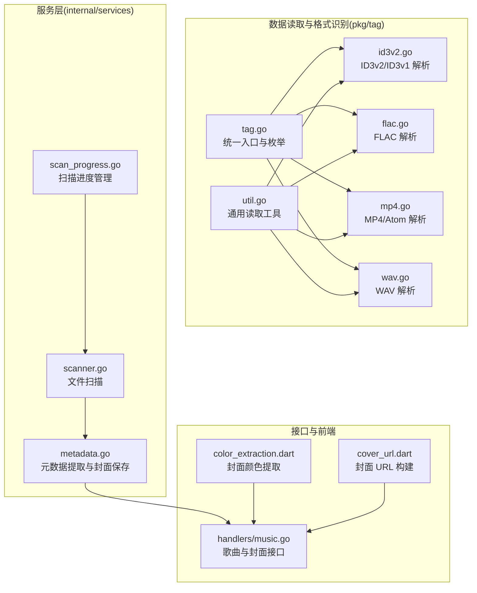
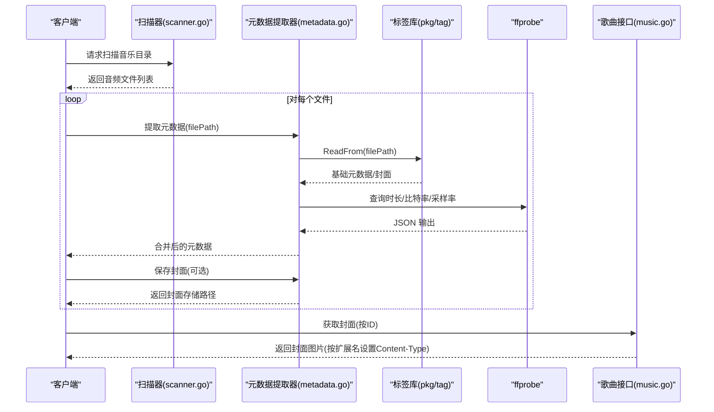
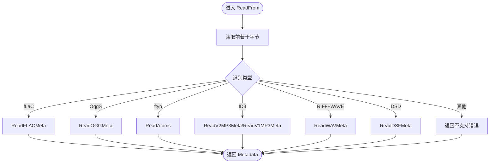
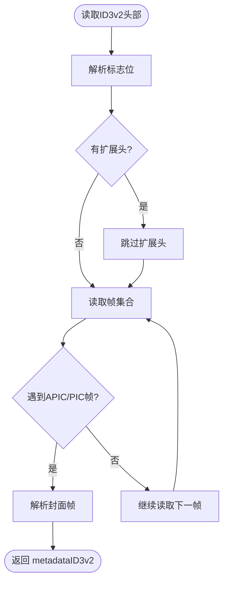
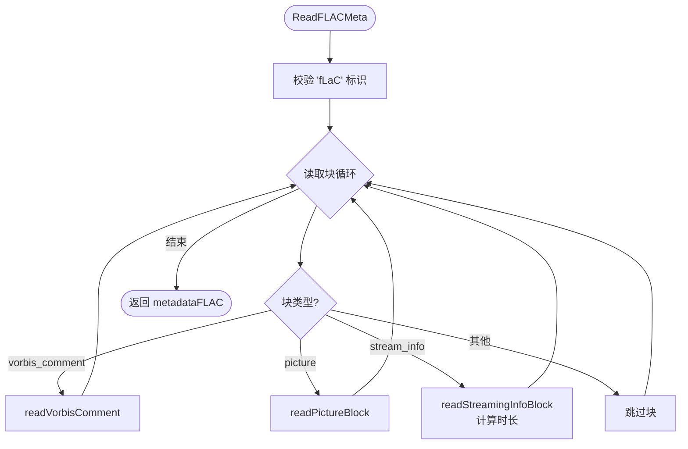
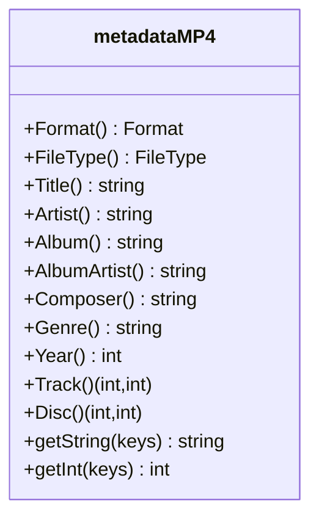
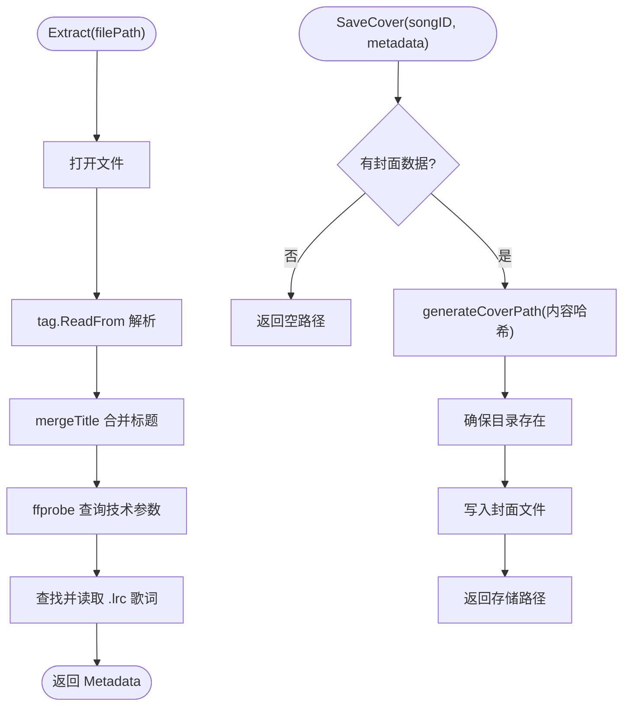
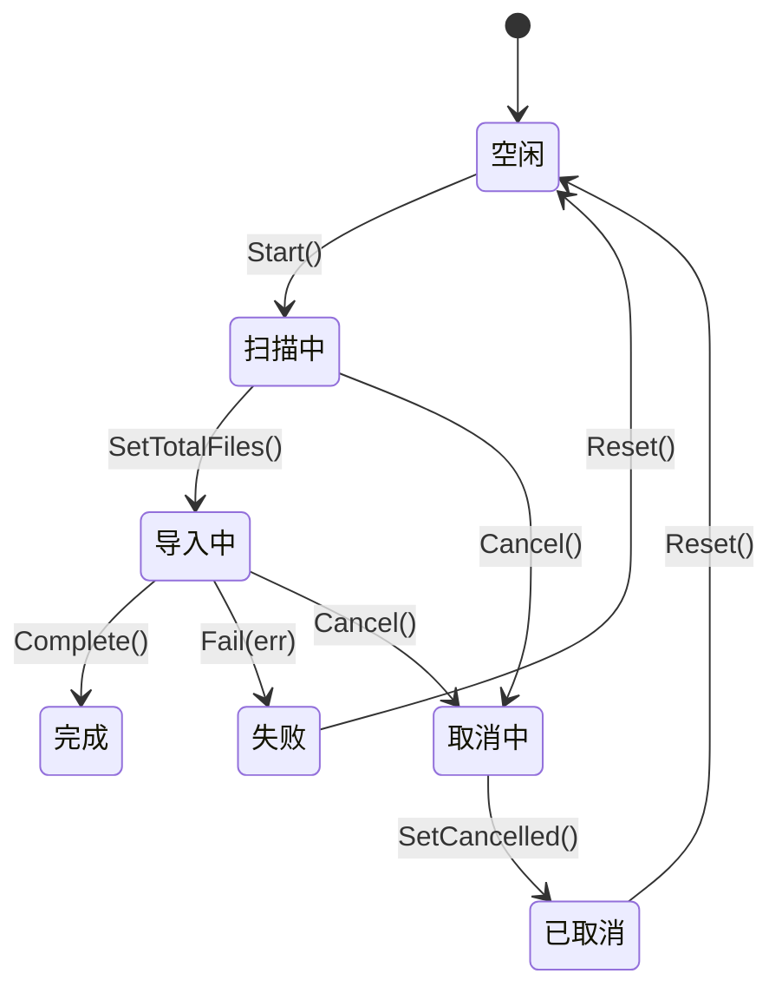
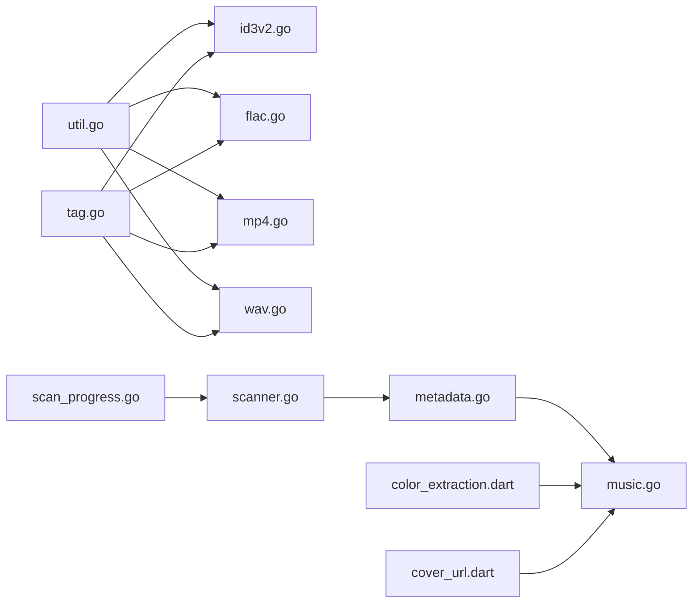

# 音频元数据提取

<cite>
**本文引用的文件**
- [pkg/tag/tag.go](file://pkg/tag/tag.go)
- [pkg/tag/id3v2.go](file://pkg/tag/id3v2.go)
- [pkg/tag/flac.go](file://pkg/tag/flac.go)
- [pkg/tag/mp4.go](file://pkg/tag/mp4.go)
- [pkg/tag/wav.go](file://pkg/tag/wav.go)
- [pkg/tag/util.go](file://pkg/tag/util.go)
- [internal/services/metadata.go](file://internal/services/metadata.go)
- [internal/services/scanner.go](file://internal/services/scanner.go)
- [internal/services/scan_progress.go](file://internal/services/scan_progress.go)
- [internal/handlers/music.go](file://internal/handlers/music.go)
- [frontend/lib/core/utils/color_extraction.dart](file://frontend/lib/core/utils/color_extraction.dart)
- [frontend/lib/core/utils/cover_url.dart](file://frontend/lib/core/utils/cover_url.dart)
</cite>

## 目录
1. [简介](#简介)
2. [项目结构](#项目结构)
3. [核心组件](#核心组件)
4. [架构总览](#架构总览)
5. [详细组件分析](#详细组件分析)
6. [依赖分析](#依赖分析)
7. [性能考虑](#性能考虑)
8. [故障排查指南](#故障排查指南)
9. [结论](#结论)
10. [附录](#附录)

## 简介
本技术文档围绕 MiMusic 的音频元数据提取能力展开，系统性说明从本地音频文件读取 ID3、FLAC、MP4 等格式标签信息的实现机制，覆盖批量处理音频文件的扫描、格式识别与标签解析流程，以及封面图片提取与处理（含多格式支持与分层存储）。文档还涵盖元数据标准化处理、编码转换与数据完整性验证，并提供音频分析工具（ffprobe）的使用方法与自定义扩展指南。

## 项目结构
MiMusic 的元数据提取由三层协作完成：
- 数据读取与格式识别层：位于 pkg/tag，负责对不同容器格式进行探测与解析。
- 服务层：位于 internal/services，负责批量扫描、元数据提取、封面保存与进度管理。
- 接口与前端展示层：接口层提供歌曲封面读取等 HTTP 能力；前端提供封面颜色提取与 URL 构建工具。

图表来源
- [pkg/tag/tag.go:29-75](file://pkg/tag/tag.go#L29-L75)
- [pkg/tag/util.go:48-154](file://pkg/tag/util.go#L48-L154)
- [pkg/tag/id3v2.go:428-449](file://pkg/tag/id3v2.go#L428-L449)
- [pkg/tag/flac.go:28-54](file://pkg/tag/flac.go#L28-L54)
- [pkg/tag/mp4.go:306-376](file://pkg/tag/mp4.go#L306-L376)
- [pkg/tag/wav.go:9-227](file://pkg/tag/wav.go#L9-L227)
- [internal/services/scanner.go:30-177](file://internal/services/scanner.go#L30-L177)
- [internal/services/scan_progress.go:30-209](file://internal/services/scan_progress.go#L30-L209)
- [internal/services/metadata.go:76-184](file://internal/services/metadata.go#L76-L184)
- [internal/handlers/music.go:357-424](file://internal/handlers/music.go#L357-L424)
- [frontend/lib/core/utils/color_extraction.dart:61-104](file://frontend/lib/core/utils/color_extraction.dart#L61-L104)
- [frontend/lib/core/utils/cover_url.dart:6-35](file://frontend/lib/core/utils/cover_url.dart#L6-L35)

章节来源
- [pkg/tag/tag.go:29-180](file://pkg/tag/tag.go#L29-L180)
- [internal/services/scanner.go:30-177](file://internal/services/scanner.go#L30-L177)
- [internal/services/metadata.go:76-184](file://internal/services/metadata.go#L76-L184)

## 核心组件
- 统一入口与格式枚举：pkg/tag/tag.go 提供 ReadFrom 作为统一入口，根据文件特征字节识别格式并委托具体解析器；定义 Format/FileType 枚举与 Metadata 接口。
- 格式解析器：
  - ID3v2/ID3v1：pkg/tag/id3v2.go 实现 ID3v2 头部、帧解析、unsynchronisation 处理，以及 APIC/PIC 封面帧解析。
  - FLAC：pkg/tag/flac.go 解析 fLaC 容器、VorbisComment 与 Picture 块，计算时长。
  - MP4：pkg/tag/mp4.go 映射常见 atom 名称到标准字段，支持 JPEG/PNG 封面。
  - WAV：pkg/tag/wav.go 解析 RIFF/WAVE 结构，提取采样率等技术参数。
- 服务层：
  - 扫描器：internal/services/scanner.go 递归扫描目录，支持软链接与排除目录，按扩展名过滤音频文件。
  - 元数据提取器：internal/services/metadata.go 优先使用 tag 库提取基础元数据与封面，再用 ffprobe 补充精确时长、比特率、采样率；支持 .lrc 歌词文件查找与读取；提供封面分层存储与去重。
  - 扫描进度管理：internal/services/scan_progress.go 提供扫描状态机与并发安全的进度更新。
- 接口与前端：
  - 歌曲与封面接口：internal/handlers/music.go 提供封面读取接口，按扩展名设置 Content-Type 并缓存一年。
  - 封面颜色提取：frontend/lib/core/utils/color_extraction.dart 使用 PaletteGenerator 提取封面主色与配色方案，LRU 缓存加速。
  - 封面 URL 构建：frontend/lib/core/utils/cover_url.dart 支持外部 URL 代理与本地封面服务器地址生成。

章节来源
- [pkg/tag/tag.go:29-180](file://pkg/tag/tag.go#L29-L180)
- [pkg/tag/id3v2.go:428-449](file://pkg/tag/id3v2.go#L428-L449)
- [pkg/tag/flac.go:28-121](file://pkg/tag/flac.go#L28-L121)
- [pkg/tag/mp4.go:18-68](file://pkg/tag/mp4.go#L18-L68)
- [pkg/tag/wav.go:9-227](file://pkg/tag/wav.go#L9-L227)
- [internal/services/scanner.go:30-177](file://internal/services/scanner.go#L30-L177)
- [internal/services/metadata.go:76-235](file://internal/services/metadata.go#L76-L235)
- [internal/services/scan_progress.go:30-209](file://internal/services/scan_progress.go#L30-L209)
- [internal/handlers/music.go:357-424](file://internal/handlers/music.go#L357-L424)
- [frontend/lib/core/utils/color_extraction.dart:61-104](file://frontend/lib/core/utils/color_extraction.dart#L61-L104)
- [frontend/lib/core/utils/cover_url.dart:6-35](file://frontend/lib/core/utils/cover_url.dart#L6-L35)

## 架构总览
下图展示从文件扫描到元数据提取、封面保存与接口返回的整体流程：

图表来源
- [internal/services/scanner.go:30-177](file://internal/services/scanner.go#L30-L177)
- [internal/services/metadata.go:76-184](file://internal/services/metadata.go#L76-L184)
- [pkg/tag/tag.go:29-75](file://pkg/tag/tag.go#L29-L75)
- [internal/handlers/music.go:357-424](file://internal/handlers/music.go#L357-L424)

## 详细组件分析

### 组件A：统一入口与格式识别（pkg/tag）
- ReadFrom 根据文件头部特征字节识别 fLaC/OggS/ftyp/ID3/RIFF/WAVE/DSF 等，分别委托对应解析函数。
- Format/FileType 枚举统一了标签格式与音频文件类型的表达，Metadata 接口定义了统一的读取方法族（标题、专辑、艺术家、年份、流派、曲目、唱片、封面、歌词、注释、原始映射、时长等）。

图表来源
- [pkg/tag/tag.go:29-75](file://pkg/tag/tag.go#L29-L75)

章节来源
- [pkg/tag/tag.go:29-180](file://pkg/tag/tag.go#L29-L180)

### 组件B：ID3v2/ID3v1 解析（pkg/tag/id3v2.go）
- 读取 ID3v2 头部，支持版本 2/3/4，处理扩展头、unsynchronisation 标志。
- 解析帧集合，特殊处理 APIC/PIC 封面帧，返回 Picture 结构体。
- 提供 unsynchroniser 过滤器以处理同步化数据。

图表来源
- [pkg/tag/id3v2.go:67-137](file://pkg/tag/id3v2.go#L67-L137)
- [pkg/tag/id3v2.go:383-402](file://pkg/tag/id3v2.go#L383-L402)
- [pkg/tag/id3v2.go:404-426](file://pkg/tag/id3v2.go#L404-L426)

章节来源
- [pkg/tag/id3v2.go:428-449](file://pkg/tag/id3v2.go#L428-L449)

### 组件C：FLAC 解析（pkg/tag/flac.go）
- 读取 fLaC 标识，遍历块（stream_info/vorbis_comment/picture），解析 VorbisComment 与 Picture 块。
- 从 stream_info 块计算时长（采样率、样本数）。

图表来源
- [pkg/tag/flac.go:28-121](file://pkg/tag/flac.go#L28-L121)

章节来源
- [pkg/tag/flac.go:28-121](file://pkg/tag/flac.go#L28-L121)

### 组件D：MP4/Atom 解析（pkg/tag/mp4.go）
- 定义 atom 类型与名称映射，支持 text/jpg/png 等类别的 atom。
- 提供 getString/getInt 辅助方法，将多个可能键名映射为标准字段（标题、艺术家、专辑、作曲、年份、流派、歌词、评论、Tempo、编曲等）。
- 通过 covr atom 提取封面数据。

图表来源
- [pkg/tag/mp4.go:18-68](file://pkg/tag/mp4.go#L18-L68)
- [pkg/tag/mp4.go:306-376](file://pkg/tag/mp4.go#L306-L376)

章节来源
- [pkg/tag/mp4.go:18-68](file://pkg/tag/mp4.go#L18-L68)
- [pkg/tag/mp4.go:306-376](file://pkg/tag/mp4.go#L306-L376)

### 组件E：WAV 解析（pkg/tag/wav.go）
- 解析 RIFF/WAVE 结构，定位 fmt 与 data 块，提取采样率、位深、声道数等参数。
- WAV 本身无标准元数据格式，Raw() 返回技术参数映射。

章节来源
- [pkg/tag/wav.go:9-227](file://pkg/tag/wav.go#L9-L227)

### 组件F：元数据提取与封面处理（internal/services/metadata.go）
- Extract：优先使用 tag 库提取标题、艺术家、专辑、封面、歌词与格式；随后用 ffprobe 补全时长、比特率、采样率；若 tag 库未提供格式，则回退到 ffprobe 的 format_name；最后尝试读取同名 .lrc 歌词文件。
- SaveCover：基于封面数据内容哈希生成分层目录路径，避免单目录文件过多，实现相同封面去重存储。
- mergeTitle：智能合并文件名与刮削标题，基于最长公共子串去重，避免冗余与乱码。

图表来源
- [internal/services/metadata.go:76-184](file://internal/services/metadata.go#L76-L184)
- [internal/services/metadata.go:186-235](file://internal/services/metadata.go#L186-L235)
- [internal/services/metadata.go:308-415](file://internal/services/metadata.go#L308-L415)

章节来源
- [internal/services/metadata.go:76-184](file://internal/services/metadata.go#L76-L184)
- [internal/services/metadata.go:186-235](file://internal/services/metadata.go#L186-L235)
- [internal/services/metadata.go:308-415](file://internal/services/metadata.go#L308-L415)

### 组件G：批量扫描与进度管理（internal/services/scanner.go、scan_progress.go）
- Scanner：递归扫描目录，解析软链接，防止循环；按配置排除目录；按扩展名过滤音频文件。
- ScanProgressManager：提供状态机（空闲/扫描中/导入中/完成/失败/取消中/已取消），并发安全地更新进度与错误信息，并提供取消通道。

图表来源
- [internal/services/scan_progress.go:30-209](file://internal/services/scan_progress.go#L30-L209)

章节来源
- [internal/services/scanner.go:30-177](file://internal/services/scanner.go#L30-L177)
- [internal/services/scan_progress.go:30-209](file://internal/services/scan_progress.go#L30-L209)

### 组件H：封面接口与前端工具（handlers/music.go、color_extraction.dart、cover_url.dart）
- GetSongCover：根据歌曲 ID 获取封面文件，按扩展名设置 Content-Type 并缓存一年。
- color_extraction.dart：从封面 URL 提取主色与配色方案，LRU 缓存加速。
- cover_url.dart：支持外部 URL 代理与本地封面服务器地址生成，iOS 平台通过 URL 参数传递认证令牌。

章节来源
- [internal/handlers/music.go:357-424](file://internal/handlers/music.go#L357-L424)
- [frontend/lib/core/utils/color_extraction.dart:61-104](file://frontend/lib/core/utils/color_extraction.dart#L61-L104)
- [frontend/lib/core/utils/cover_url.dart:6-35](file://frontend/lib/core/utils/cover_url.dart#L6-L35)

## 依赖分析
- pkg/tag 层内部通过 util.go 提供统一的二进制读取与位操作工具，减少重复实现。
- internal/services/metadata.go 依赖 pkg/tag 的 Metadata 接口，实现跨格式的统一提取逻辑。
- internal/services/scanner.go 与 scan_progress.go 协作，保证扫描过程可控与可观测。
- handlers/music.go 依赖服务层提供的封面读取能力，前端工具与接口配合实现完整的封面展示链路。

图表来源
- [pkg/tag/util.go:48-154](file://pkg/tag/util.go#L48-L154)
- [pkg/tag/tag.go:29-180](file://pkg/tag/tag.go#L29-L180)
- [internal/services/scanner.go:30-177](file://internal/services/scanner.go#L30-L177)
- [internal/services/scan_progress.go:30-209](file://internal/services/scan_progress.go#L30-L209)
- [internal/services/metadata.go:76-184](file://internal/services/metadata.go#L76-L184)
- [internal/handlers/music.go:357-424](file://internal/handlers/music.go#L357-L424)
- [frontend/lib/core/utils/color_extraction.dart:61-104](file://frontend/lib/core/utils/color_extraction.dart#L61-L104)
- [frontend/lib/core/utils/cover_url.dart:6-35](file://frontend/lib/core/utils/cover_url.dart#L6-L35)

章节来源
- [pkg/tag/util.go:48-154](file://pkg/tag/util.go#L48-L154)
- [pkg/tag/tag.go:29-180](file://pkg/tag/tag.go#L29-L180)
- [internal/services/metadata.go:76-184](file://internal/services/metadata.go#L76-L184)

## 性能考虑
- 读取策略：util.go 的 readBytes 对大块读取采用缓冲复制，避免一次性分配过大内存。
- 封面存储：metadata.go 使用内容哈希分层目录，避免单目录文件过多导致的文件系统性能退化；相同封面自动去重。
- ffprobe 使用：metadata.go 通过 JSON 输出与精确字段解析，避免文本解析误差；命令行参数最小化，仅保留必要选项。
- 前端颜色提取：color_extraction.dart 对缩略图尺寸与最大颜色数进行限制，降低 CPU 与内存占用。

章节来源
- [pkg/tag/util.go:48-63](file://pkg/tag/util.go#L48-L63)
- [internal/services/metadata.go:186-235](file://internal/services/metadata.go#L186-L235)
- [internal/services/metadata.go:267-278](file://internal/services/metadata.go#L267-L278)
- [frontend/lib/core/utils/color_extraction.dart:82-104](file://frontend/lib/core/utils/color_extraction.dart#L82-L104)

## 故障排查指南
- 无法识别格式：检查文件头部字节是否正确，确认 ReadFrom 的识别分支是否覆盖该格式。
- ID3 解析异常：确认 ID3 版本与 unsynchronisation 标志，检查扩展头长度与帧集合解析。
- FLAC 读取失败：确认 fLaC 标识与块序列，检查 stream_info 块字段完整性。
- MP4 封面缺失：确认 atom 名称映射与 covr 类型，检查图片数据是否为 JPEG/PNG。
- ffprobe 失败：确认可执行文件路径与权限，检查输出 JSON 结构是否符合预期。
- 封面保存失败：检查 CoverStoragePath 目录权限与磁盘空间，确认分层目录创建与文件写入权限。
- 歌曲封面 404：确认歌曲记录中的 CoverPath 是否存在，检查扩展名与 Content-Type 设置。

章节来源
- [pkg/tag/tag.go:29-75](file://pkg/tag/tag.go#L29-L75)
- [pkg/tag/id3v2.go:67-137](file://pkg/tag/id3v2.go#L67-L137)
- [pkg/tag/flac.go:28-54](file://pkg/tag/flac.go#L28-L54)
- [pkg/tag/mp4.go:18-68](file://pkg/tag/mp4.go#L18-L68)
- [internal/services/metadata.go:123-136](file://internal/services/metadata.go#L123-L136)
- [internal/services/metadata.go:186-210](file://internal/services/metadata.go#L186-L210)
- [internal/handlers/music.go:386-424](file://internal/handlers/music.go#L386-L424)

## 结论
MiMusic 的音频元数据提取体系以 pkg/tag 为核心，实现了对主流音频容器格式的统一识别与解析；internal/services 层提供了稳健的批量扫描、元数据提取与封面管理能力；handlers 与前端工具完善了封面展示与颜色提取体验。整体设计具备良好的扩展性与可维护性，便于后续新增格式与增强功能。

## 附录
- 自定义扩展指南
  - 新增格式支持：在 pkg/tag 下新增解析器，实现 ReadXxxMeta 函数并在 tag.go 的 ReadFrom 中增加识别分支；实现 Metadata 接口方法。
  - 新增解析细节：利用 util.go 的二进制读取与位操作工具，确保解析健壮性；注意边界检查与错误传播。
  - 服务层扩展：在 internal/services/metadata.go 中补充格式特定的字段映射与默认值；如需额外工具（如 ffmpeg/ffprobe），保持命令行参数最小化与超时控制。
  - 前端集成：如需新增封面处理能力，可在前端工具中复用 color_extraction.dart 的缓存与异步加载模式。