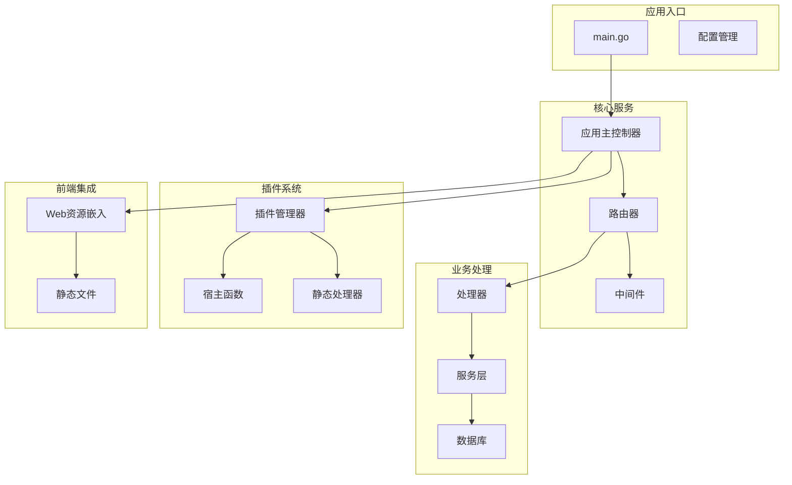
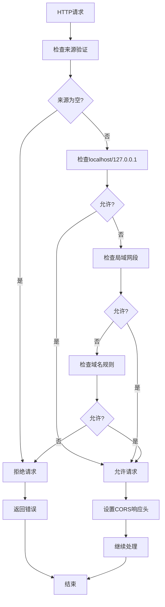
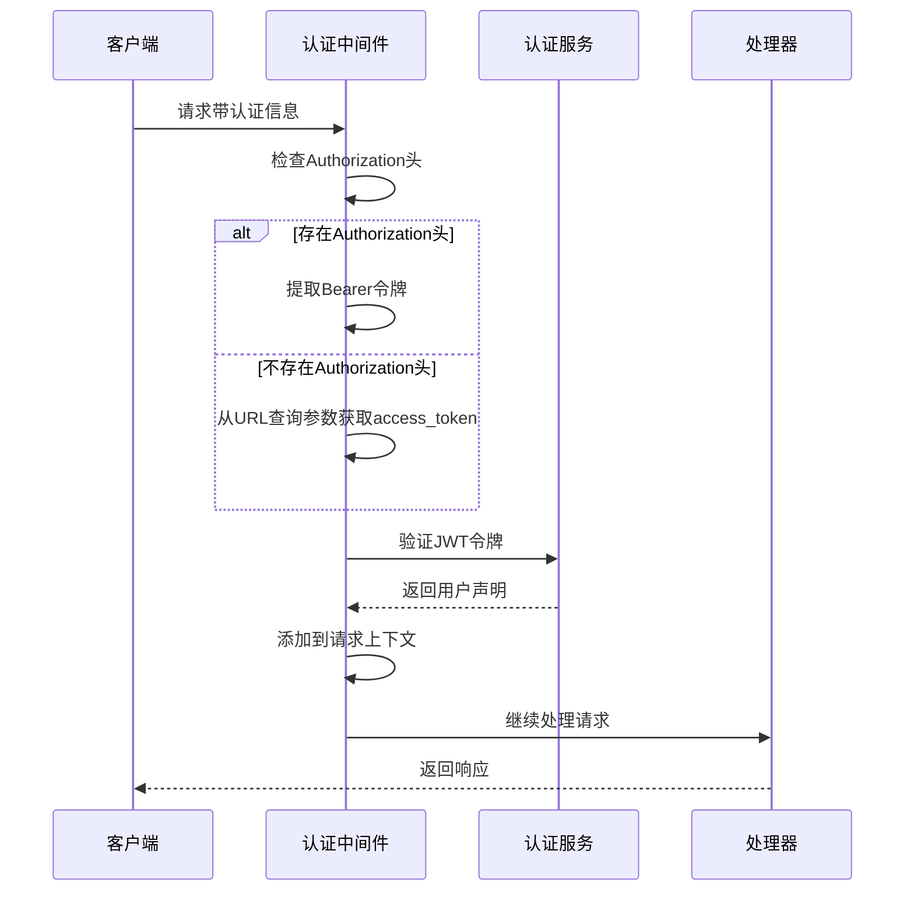
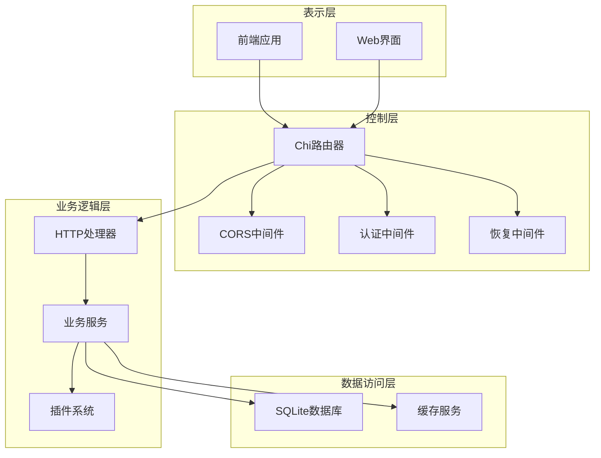
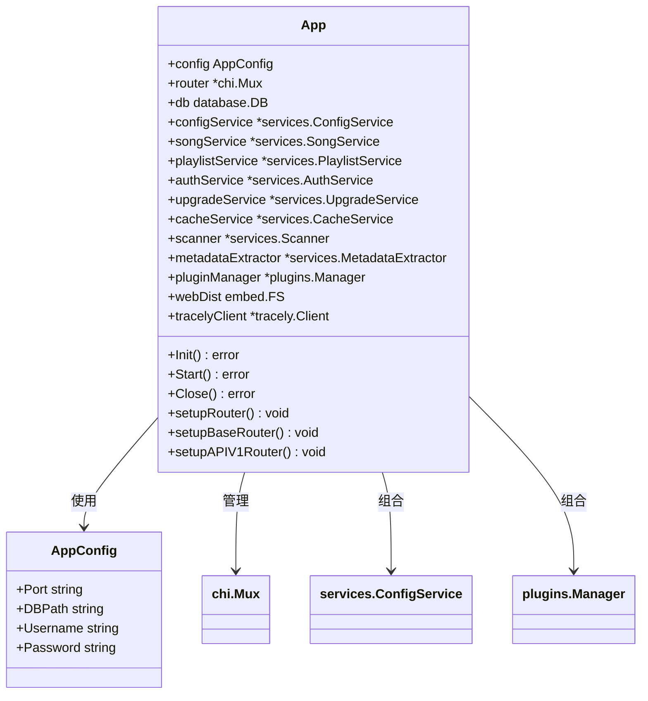
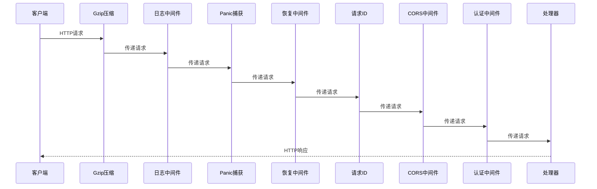
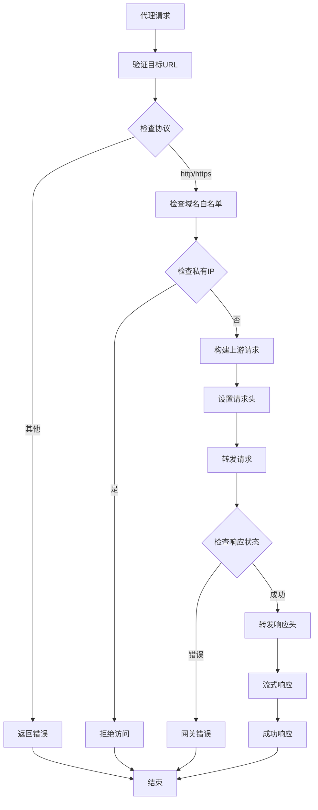
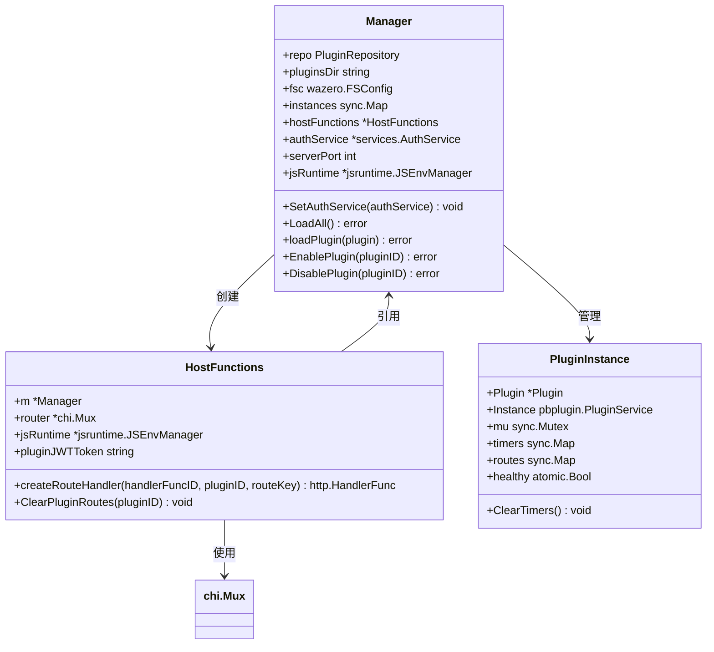
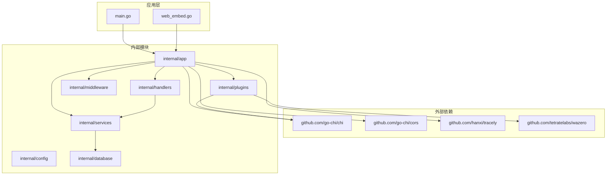

# 跨域支持增强文档

<cite>
**本文档引用的文件**
- [main.go](file://main.go)
- [app.go](file://internal/app/app.go)
- [routers.go](file://internal/app/routers.go)
- [auth.go](file://internal/middleware/auth.go)
- [proxy.go](file://internal/handlers/proxy.go)
- [types.go](file://internal/config/types.go)
- [manager.go](file://internal/plugins/manager.go)
- [host.go](file://internal/plugins/host.go)
- [whitelist.go](file://internal/services/whitelist.go)
- [web_embed.go](file://web_embed.go)
- [web_embed_full.go](file://web_embed_full.go)
- [embed_common.go](file://internal/app/embed_common.go)
</cite>

## 目录
1. [简介](#简介)
2. [项目结构](#项目结构)
3. [核心组件](#核心组件)
4. [架构概览](#架构概览)
5. [详细组件分析](#详细组件分析)
6. [依赖关系分析](#依赖关系分析)
7. [性能考虑](#性能考虑)
8. [故障排除指南](#故障排除指南)
9. [结论](#结论)

## 简介

MiMusic 是一个轻量级的音乐服务器应用，支持本地音乐管理、网络歌曲、电台和歌单功能。本文档重点介绍项目中的跨域支持增强功能，包括 CORS 中间件配置、代理机制、认证流程以及插件系统的跨域支持。

该项目采用 Go 语言开发，使用 Chi 路由器框架和多种中间件来实现完整的 Web 服务功能。跨域支持是现代 Web 应用的重要特性，特别是在音乐播放器这类需要访问外部资源的应用中。

## 项目结构

MiMusic 项目采用模块化的架构设计，主要包含以下核心模块：

**图表来源**
- [main.go:30-63](file://main.go#L30-L63)
- [app.go:46-54](file://internal/app/app.go#L46-L54)

**章节来源**
- [main.go:1-64](file://main.go#L1-L64)
- [app.go:1-358](file://internal/app/app.go#L1-L358)

## 核心组件

### CORS 中间件配置

项目实现了高度定制化的 CORS 中间件，支持灵活的来源验证和多种安全策略：

**图表来源**
- [routers.go:187-245](file://internal/app/routers.go#L187-L245)

### 认证中间件

认证中间件支持多种令牌传递方式，包括 Authorization 头和 URL 查询参数：

**图表来源**
- [auth.go:12-51](file://internal/middleware/auth.go#L12-L51)

**章节来源**
- [routers.go:186-245](file://internal/app/routers.go#L186-L245)
- [auth.go:1-52](file://internal/middleware/auth.go#L1-L52)

## 架构概览

MiMusic 的整体架构采用了分层设计，各层职责明确，便于维护和扩展：

**图表来源**
- [app.go:28-43](file://internal/app/app.go#L28-L43)
- [routers.go:20-26](file://internal/app/routers.go#L20-L26)

## 详细组件分析

### 应用主控制器

应用主控制器负责整个应用的初始化、配置管理和生命周期控制：

**图表来源**
- [app.go:28-43](file://internal/app/app.go#L28-L43)
- [types.go:4-9](file://internal/config/types.go#L4-L9)

### 路由器配置

路由器配置实现了多层次的中间件链，确保请求的安全性和正确处理：

**图表来源**
- [routers.go:145-184](file://internal/app/routers.go#L145-L184)

### 代理处理器

代理处理器解决了外部 CDN 的 CORS 问题，提供了安全的资源访问机制：

**图表来源**
- [proxy.go:45-110](file://internal/handlers/proxy.go#L45-L110)

**章节来源**
- [app.go:65-232](file://internal/app/app.go#L65-L232)
- [routers.go:145-257](file://internal/app/routers.go#L145-L257)
- [proxy.go:1-139](file://internal/handlers/proxy.go#L1-L139)

### 插件系统跨域支持

插件系统实现了完整的跨域支持，包括路由处理和认证机制：

**图表来源**
- [manager.go:35-44](file://internal/plugins/manager.go#L35-L44)
- [host.go:218-302](file://internal/plugins/host.go#L218-L302)

**章节来源**
- [manager.go:1-574](file://internal/plugins/manager.go#L1-L574)
- [host.go:208-302](file://internal/plugins/host.go#L208-L302)

## 依赖关系分析

项目的主要依赖关系如下所示：

**图表来源**
- [main.go:3-9](file://main.go#L3-L9)
- [app.go:3-25](file://internal/app/app.go#L3-L25)

**章节来源**
- [main.go:1-64](file://main.go#L1-L64)
- [app.go:1-358](file://internal/app/app.go#L1-L358)

## 性能考虑

### CORS 配置优化

项目中的 CORS 配置经过精心优化，平衡了安全性与性能：

- **来源验证缓存**：通过预定义的来源规则减少动态计算开销
- **最小权限原则**：只允许必要的 HTTP 方法和头部
- **凭证支持**：启用 AllowCredentials 以支持 Cookie 认证
- **缓存策略**：设置 MaxAge 300 秒减少预检请求频率

### 代理性能优化

代理处理器实现了多项性能优化措施：

- **流式传输**：支持大文件的流式转发，避免内存占用
- **Range 请求支持**：完全支持音频播放的 seek 功能
- **缓存头透传**：智能设置缓存策略，特别是对图片资源的长期缓存
- **超时控制**：60 秒超时限制，防止资源泄露

## 故障排除指南

### CORS 相关问题

当遇到跨域请求失败时，可以按以下步骤排查：

1. **检查来源验证**：确认请求的 Origin 是否在允许列表中
2. **验证凭证设置**：确保前端正确发送认证信息
3. **检查预检请求**：查看 OPTIONS 预检请求是否正常响应
4. **查看日志输出**：通过应用日志了解具体的拒绝原因

### 代理功能问题

代理功能出现问题时的排查步骤：

1. **URL 验证**：确认目标 URL 格式正确且协议为 http/https
2. **域名白名单**：检查目标域名是否在允许列表中
3. **网络连通性**：验证服务器能否访问目标资源
4. **超时设置**：调整代理超时时间以适应网络环境

**章节来源**
- [routers.go:187-245](file://internal/app/routers.go#L187-L245)
- [proxy.go:45-110](file://internal/handlers/proxy.go#L45-L110)
- [whitelist.go:1-54](file://internal/services/whitelist.go#L1-L54)

## 结论

MiMusic 的跨域支持增强功能体现了现代 Web 应用的最佳实践。通过精心设计的 CORS 中间件、安全的代理机制和完善的认证系统，项目为音乐播放器这类需要访问外部资源的应用提供了可靠的跨域解决方案。

主要特点包括：

- **灵活的来源验证**：支持 localhost、局域网和特定域名的精确控制
- **安全的代理机制**：防止 SSRF 攻击，支持范围请求和流式传输
- **完整的认证支持**：支持多种令牌传递方式，确保 API 安全
- **插件系统集成**：为插件提供一致的跨域访问体验
- **性能优化**：通过缓存和流式处理提升用户体验

这些特性使得 MiMusic 能够在保证安全性的前提下，为用户提供流畅的音乐播放体验，同时为开发者提供了强大的扩展能力。