# Legacy Release Automation

<cite>
**本文引用的文件**
- [release.yml](file://.github/workflows/release.yml)
- [release.sh](file://scripts/release.sh)
- [build-release.sh](file://scripts/build-release.sh)
- [Makefile](file://Makefile)
- [Dockerfile](file://Dockerfile)
- [generate-changelog.sh](file://scripts/generate-changelog.sh)
- [build-frontend.sh](file://frontend/scripts/build-frontend.sh)
- [release-frontend.sh](file://frontend/scripts/release-frontend.sh)
- [main.go](file://main.go)
- [README.md](file://README.md)
- [CHANGELOG.md](file://CHANGELOG.md)
- [frontend/README.md](file://frontend/README.md)
- [frontend/BUILD_FRONTEND_GUIDE.md](file://frontend/BUILD_FRONTEND_GUIDE.md)
</cite>

## 目录
1. [简介](#简介)
2. [项目结构](#项目结构)
3. [核心组件](#核心组件)
4. [架构概览](#架构概览)
5. [详细组件分析](#详细组件分析)
6. [依赖关系分析](#依赖关系分析)
7. [性能考虑](#性能考虑)
8. [故障排除指南](#故障排除指南)
9. [结论](#结论)
10. [附录](#附录)

## 简介

Legacy Release Automation 是 MiMusic 项目中一套完整的发布自动化系统，负责协调后端 Go 服务、Flutter 前端以及 Docker 镜像的多平台发布流程。该系统通过 GitHub Actions 和本地脚本实现了高度自动化的版本管理、构建、测试、打包和发布流程。

MiMusic 是一个基于 Go 和 Flutter 的轻量级音乐服务器，支持本地音乐文件管理、元数据提取和跨平台播放器客户端。发布自动化系统确保了代码质量、版本一致性和发布流程的标准化。

## 项目结构

项目采用模块化架构，主要分为以下几个核心部分：

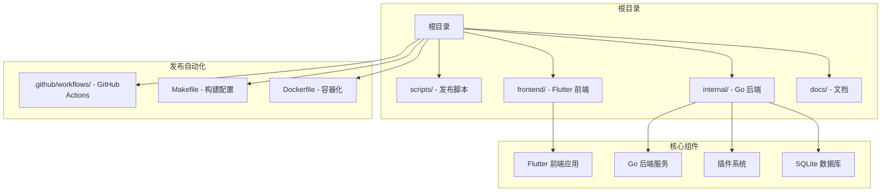

**图表来源**
- [.github/workflows/release.yml:1-525](file://.github/workflows/release.yml#L1-L525)
- [Makefile:1-339](file://Makefile#L1-L339)

**章节来源**
- [README.md:1-479](file://README.md#L1-L479)
- [frontend/README.md:1-213](file://frontend/README.md#L1-L213)

## 核心组件

### 发布工作流系统

发布自动化系统由三个主要层面组成：

1. **GitHub Actions 工作流** - CI/CD 流水线
2. **本地发布脚本** - 开发者本地发布
3. **构建配置系统** - Makefile 和 Docker 配置

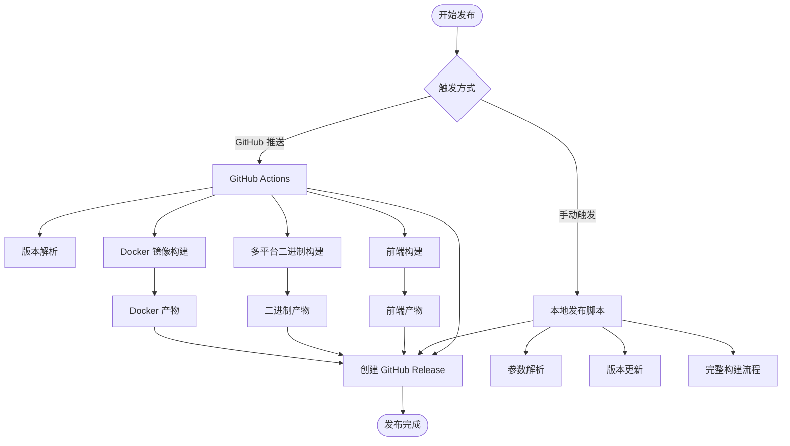

**图表来源**
- [.github/workflows/release.yml:16-525](file://.github/workflows/release.yml#L16-L525)
- [scripts/release.sh:666-805](file://scripts/release.sh#L666-L805)

### 版本管理系统

系统支持两种版本管理策略：

1. **语义化版本控制** - 通过 `major/minor/patch` 参数控制版本升级
2. **Conventional Commits** - 自动从提交信息生成发布日志

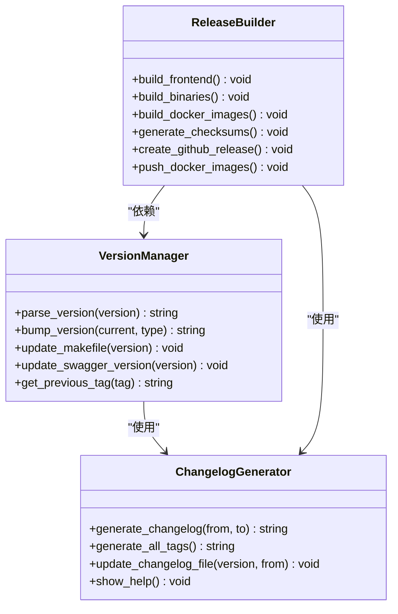

**图表来源**
- [scripts/release.sh:79-174](file://scripts/release.sh#L79-L174)
- [scripts/generate-changelog.sh:76-191](file://scripts/generate-changelog.sh#L76-L191)

**章节来源**
- [scripts/release.sh:69-174](file://scripts/release.sh#L69-L174)
- [scripts/generate-changelog.sh:76-191](file://scripts/generate-changelog.sh#L76-L191)

## 架构概览

发布自动化系统的整体架构如下：

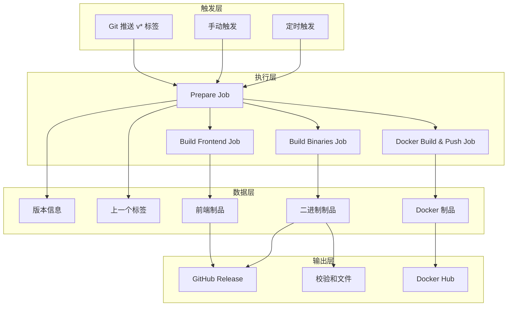

**图表来源**
- [.github/workflows/release.yml:20-525](file://.github/workflows/release.yml#L20-L525)

**章节来源**
- [.github/workflows/release.yml:1-525](file://.github/workflows/release.yml#L1-L525)

## 详细组件分析

### GitHub Actions 发布工作流

GitHub Actions 工作流是发布自动化的核心执行引擎，包含五个主要作业：

#### Prepare 作业 - 版本解析和信息收集

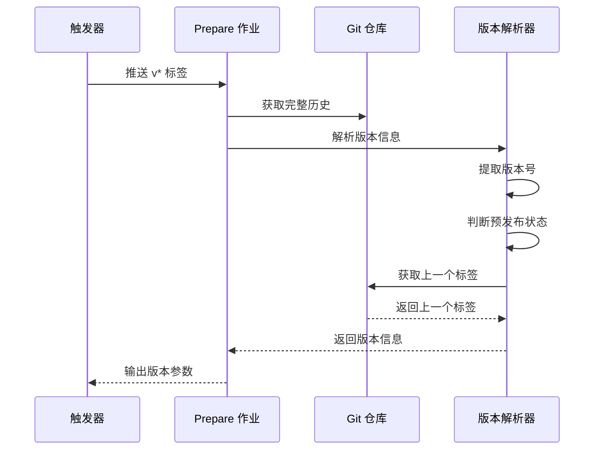

**图表来源**
- [.github/workflows/release.yml:20-82](file://.github/workflows/release.yml#L20-L82)

#### Build Frontend 作业 - Flutter 前端构建

该作业负责构建 Flutter Web 嵌入模式的前端资源：

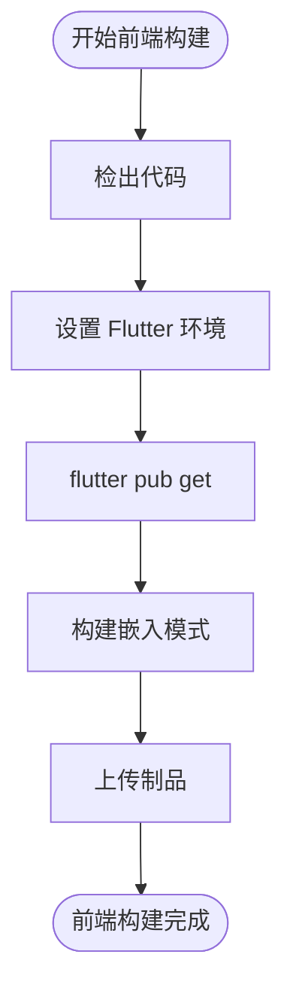

**图表来源**
- [.github/workflows/release.yml:86-117](file://.github/workflows/release.yml#L86-L117)

#### Build Binaries 作业 - 多平台二进制构建

该作业使用矩阵策略并行构建多个平台的二进制文件：

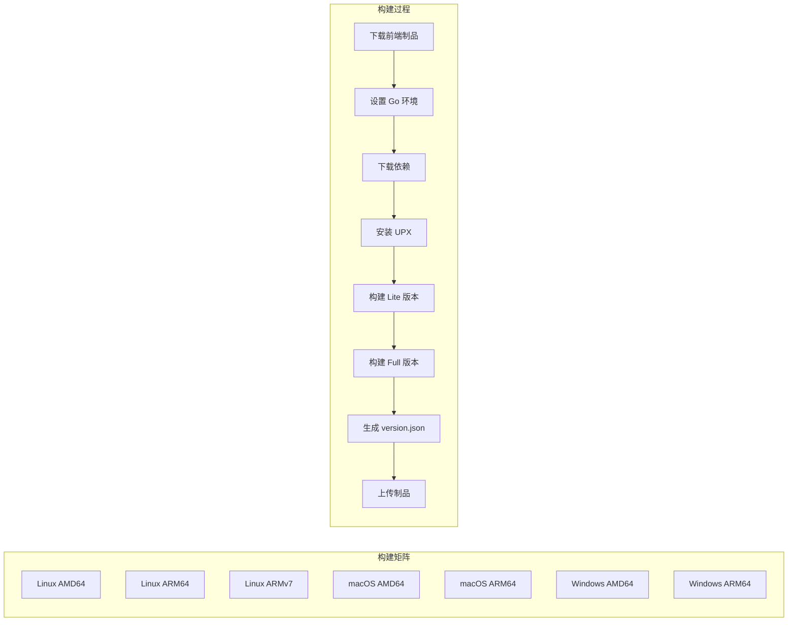

**图表来源**
- [.github/workflows/release.yml:121-227](file://.github/workflows/release.yml#L121-L227)

#### Docker Build & Push 作业 - 多架构镜像构建

该作业构建并推送多架构的 Docker 镜像：

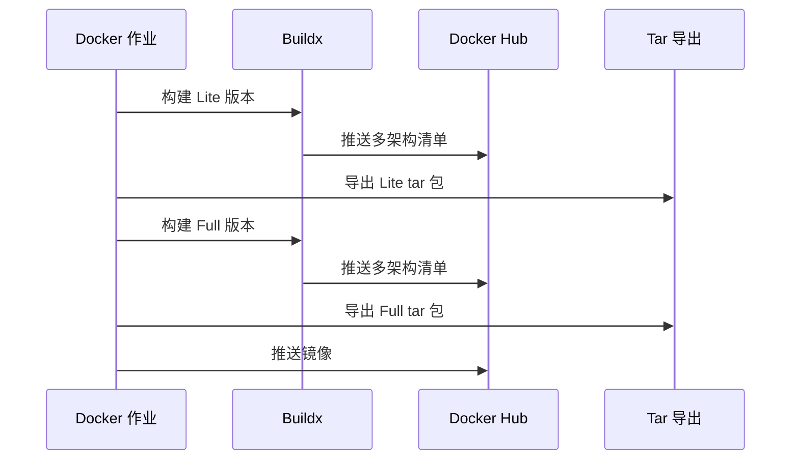

**图表来源**
- [.github/workflows/release.yml:231-424](file://.github/workflows/release.yml#L231-L424)

#### Create Release 作业 - 发布创建

该作业负责创建 GitHub Release 并上传所有制品：

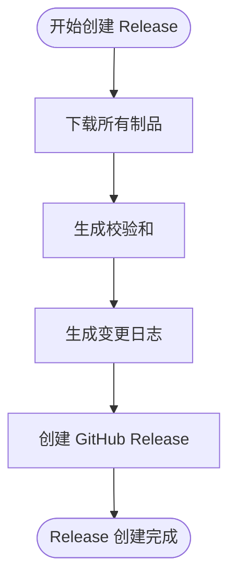

**图表来源**
- [.github/workflows/release.yml:428-525](file://.github/workflows/release.yml#L428-L525)

**章节来源**
- [.github/workflows/release.yml:16-525](file://.github/workflows/release.yml#L16-L525)

### 本地发布脚本系统

#### 主发布脚本 (release.sh)

主发布脚本提供了完整的发布流程，支持多种发布模式：

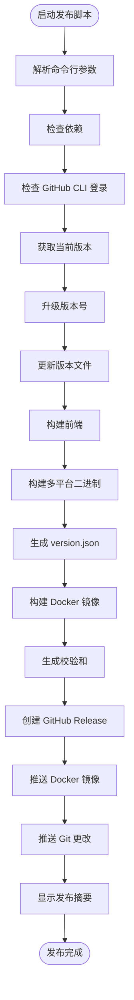

**图表来源**
- [scripts/release.sh:666-805](file://scripts/release.sh#L666-L805)

#### 构建发布脚本 (build-release.sh)

构建发布脚本专注于从现有版本号构建发布：

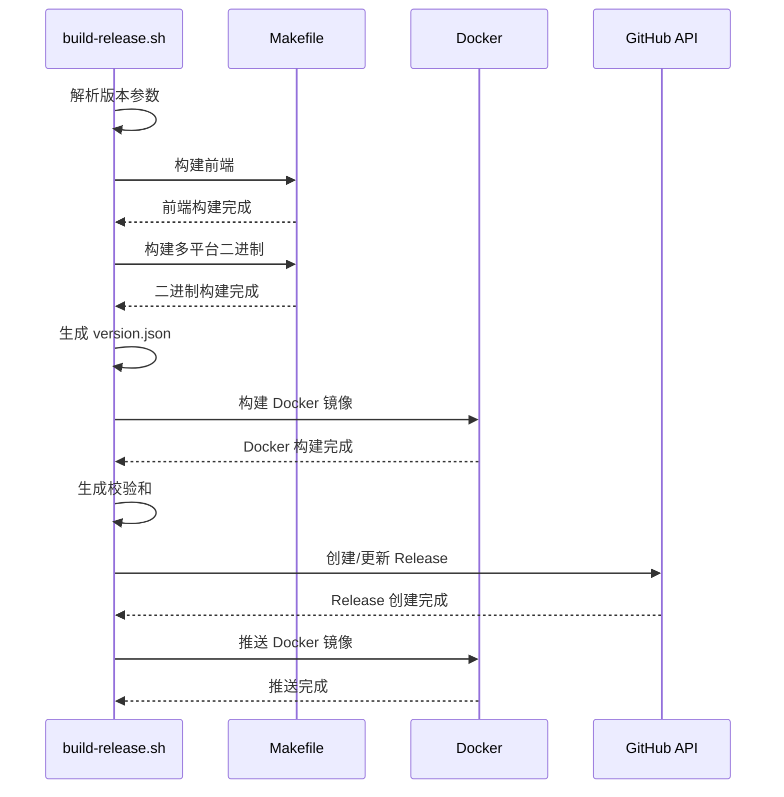

**图表来源**
- [scripts/build-release.sh:1-475](file://scripts/build-release.sh#L1-L475)

**章节来源**
- [scripts/release.sh:666-805](file://scripts/release.sh#L666-L805)
- [scripts/build-release.sh:1-475](file://scripts/build-release.sh#L1-L475)

### 构建配置系统

#### Makefile 构建系统

Makefile 提供了完整的构建配置，支持多种构建场景：

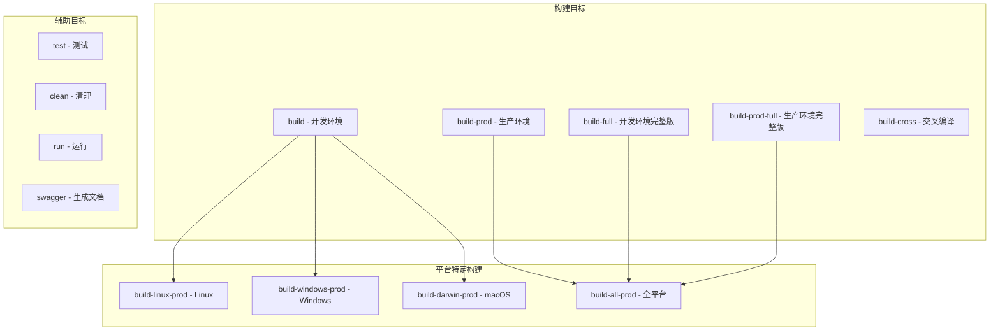

**图表来源**
- [Makefile:80-175](file://Makefile#L80-L175)

#### Docker 构建系统

Dockerfile 实现了多阶段构建，支持完整版和 Lite 版本：

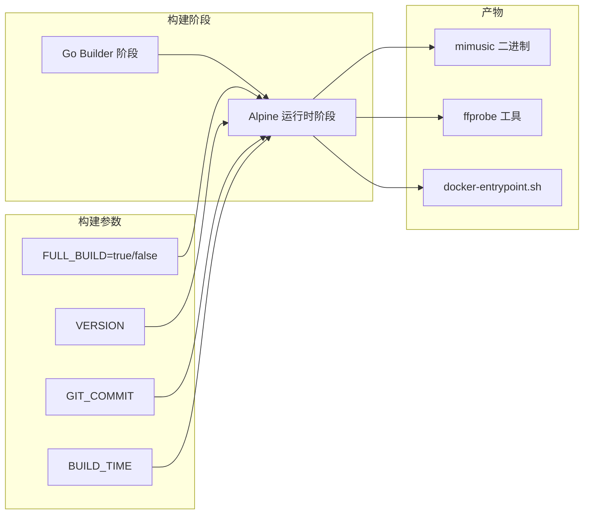

**图表来源**
- [Dockerfile:1-80](file://Dockerfile#L1-L80)

**章节来源**
- [Makefile:1-339](file://Makefile#L1-L339)
- [Dockerfile:1-80](file://Dockerfile#L1-L80)

### 前端构建系统

#### Flutter 前端构建脚本

前端构建系统支持多种部署模式和平台：

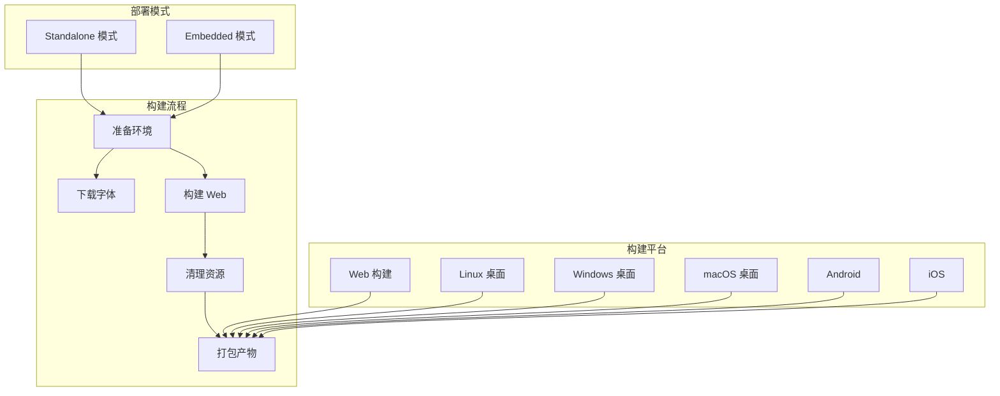

**图表来源**
- [frontend/scripts/build-frontend.sh:109-159](file://frontend/scripts/build-frontend.sh#L109-L159)

#### 前端版本发布系统

前端版本发布系统遵循语义化版本控制：

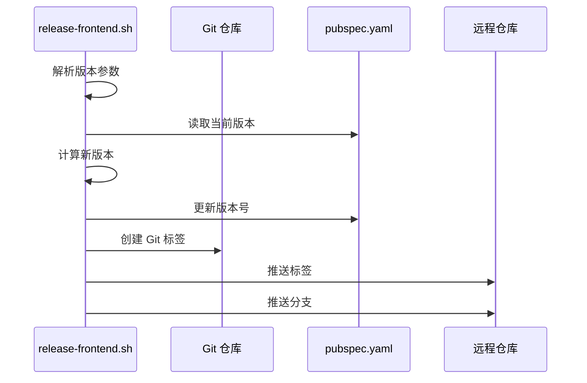

**图表来源**
- [frontend/scripts/release-frontend.sh:217-292](file://frontend/scripts/release-frontend.sh#L217-L292)

**章节来源**
- [frontend/scripts/build-frontend.sh:109-159](file://frontend/scripts/build-frontend.sh#L109-L159)
- [frontend/scripts/release-frontend.sh:217-292](file://frontend/scripts/release-frontend.sh#L217-L292)

## 依赖关系分析

发布自动化系统涉及多个层面的依赖关系：

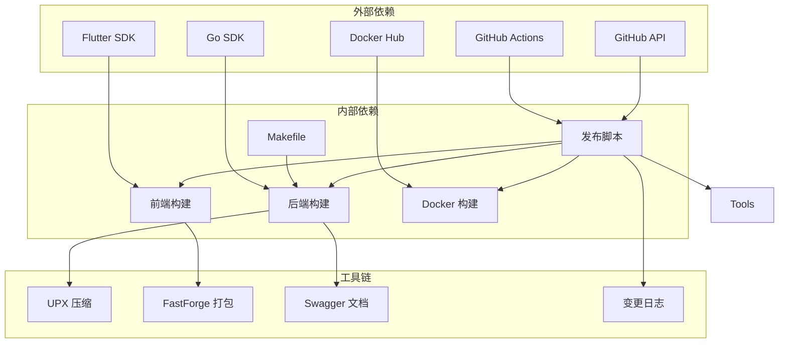

**图表来源**
- [.github/workflows/release.yml:9-14](file://.github/workflows/release.yml#L9-L14)
- [scripts/release.sh:177-221](file://scripts/release.sh#L177-L221)

**章节来源**
- [.github/workflows/release.yml:9-14](file://.github/workflows/release.yml#L9-L14)
- [scripts/release.sh:177-221](file://scripts/release.sh#L177-L221)

## 性能考虑

发布自动化系统在性能方面采用了多项优化措施：

### 并行构建优化

1. **GitHub Actions 矩阵并行** - 多平台同时构建
2. **本地脚本并行构建** - 多平台并行执行
3. **Docker Buildx 缓存** - 多架构构建缓存优化

### 构建缓存策略

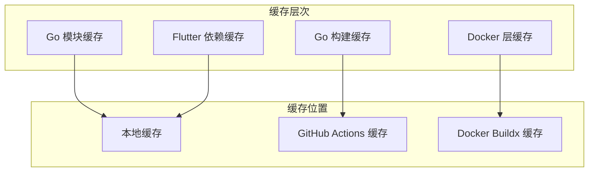

### 产物优化

1. **UPX 压缩** - 减少二进制文件大小
2. **资源清理** - 清理不必要的构建资源
3. **增量构建** - 只构建变更的平台

## 故障排除指南

### 常见问题及解决方案

#### GitHub Actions 相关问题

1. **依赖安装失败**
   - 检查网络连接和代理设置
   - 验证 GitHub Token 权限
   - 检查子模块访问权限

2. **构建超时**
   - 检查构建资源限制
   - 优化构建步骤顺序
   - 使用缓存减少重复工作

#### 本地发布脚本问题

1. **依赖缺失**
   ```bash
   # 检查必需工具
   ./scripts/release.sh --help
   ```

2. **权限问题**
   - 确保脚本具有执行权限
   - 检查 Docker 权限
   - 验证 GitHub CLI 配置

3. **版本冲突**
   - 检查 Git 标签状态
   - 验证版本号格式
   - 确认变更日志生成

#### Docker 构建问题

1. **网络问题**
   - 配置 Docker Buildx 镜像加速
   - 检查代理设置
   - 验证镜像拉取权限

2. **资源不足**
   - 增加构建资源
   - 优化镜像层大小
   - 使用多阶段构建

**章节来源**
- [scripts/release.sh:177-221](file://scripts/release.sh#L177-L221)
- [frontend/scripts/build-frontend.sh:228-269](file://frontend/scripts/build-frontend.sh#L228-L269)

## 结论

Legacy Release Automation 系统通过 GitHub Actions 和本地脚本实现了 MiMusic 项目的完整发布自动化。该系统具有以下特点：

1. **高度自动化** - 从版本解析到制品发布的全流程自动化
2. **多平台支持** - 支持 Linux、macOS、Windows 多种平台
3. **容器化部署** - 完整的 Docker 镜像构建和发布流程
4. **版本管理** - 基于 Conventional Commits 的智能版本管理
5. **质量保证** - 自动化测试和校验和生成

该系统确保了 MiMusic 项目的发布质量和效率，为开发者提供了可靠的发布基础设施。

## 附录

### 发布流程最佳实践

1. **版本控制**
   - 使用语义化版本控制
   - 遵循 Conventional Commits 规范
   - 维护详细的变更日志

2. **测试策略**
   - 在发布前运行完整测试套件
   - 验证多平台构建结果
   - 检查 Docker 镜像完整性

3. **文档维护**
   - 更新发布说明
   - 维护变更日志
   - 记录发布注意事项

4. **回滚策略**
   - 保留前一版本制品
   - 维护发布历史
   - 准备紧急回滚方案

### 相关文件索引

- **发布配置文件**: `.github/workflows/release.yml`
- **发布脚本**: `scripts/release.sh`, `scripts/build-release.sh`
- **构建配置**: `Makefile`, `Dockerfile`
- **前端构建**: `frontend/scripts/build-frontend.sh`
- **版本管理**: `scripts/generate-changelog.sh`
- **项目文档**: `README.md`, `CHANGELOG.md`