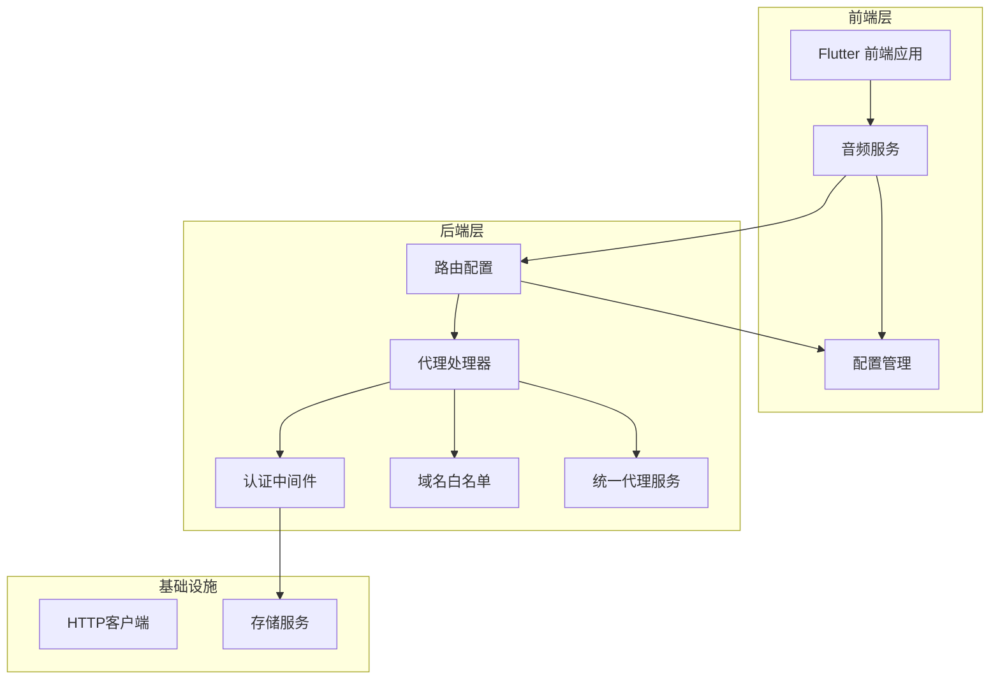
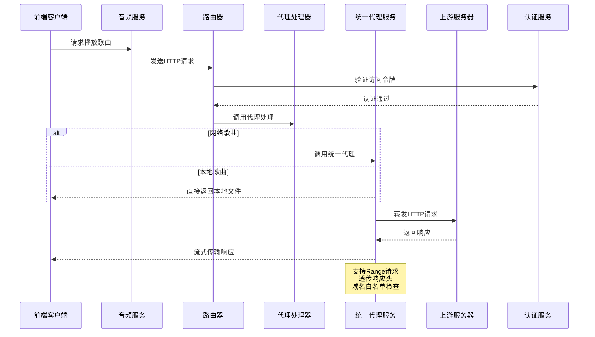
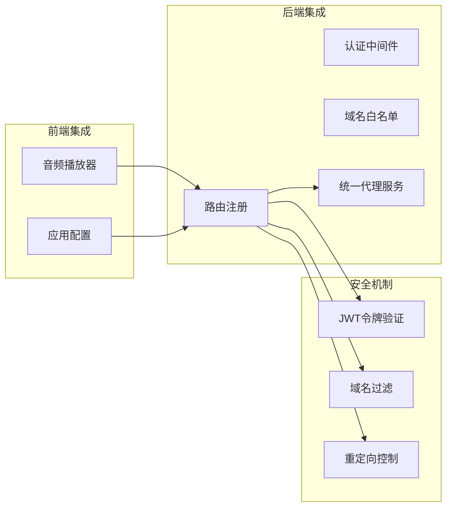
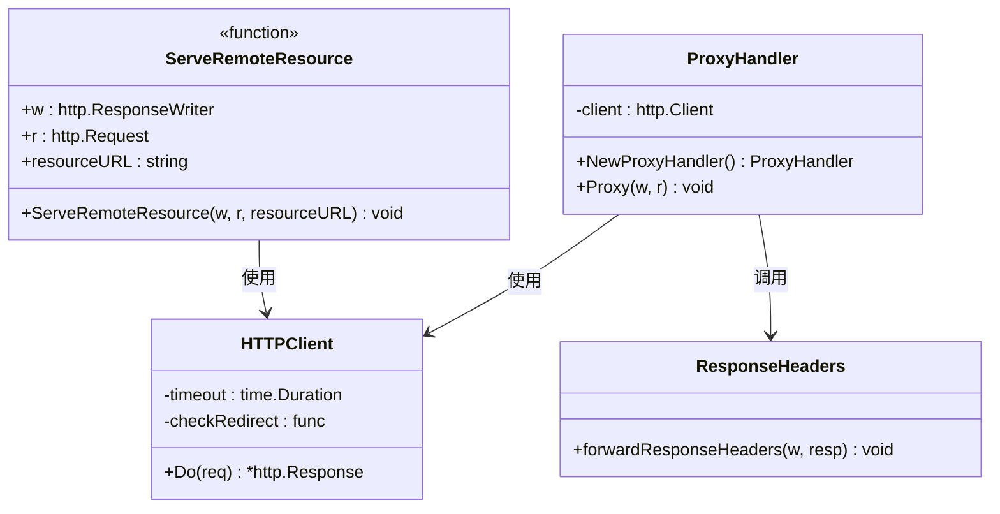
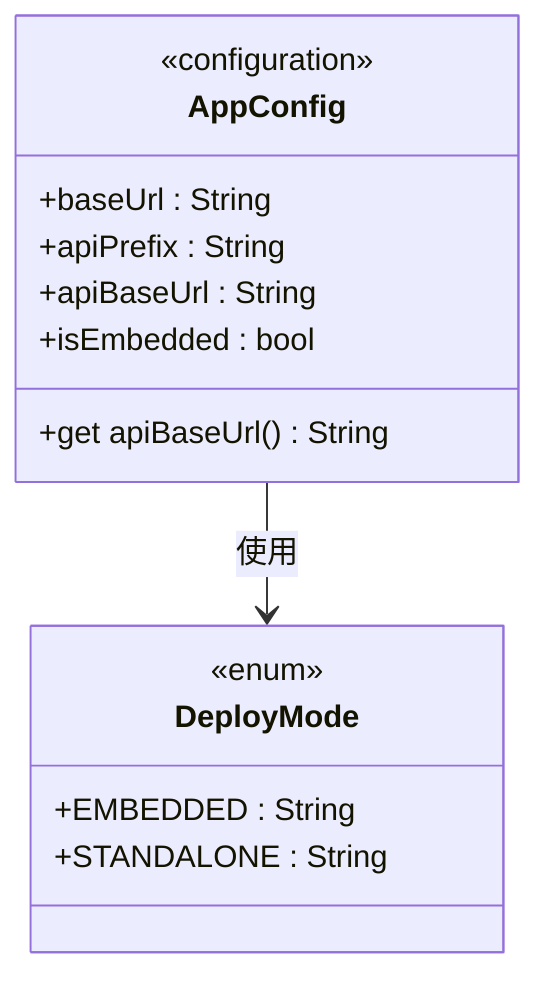
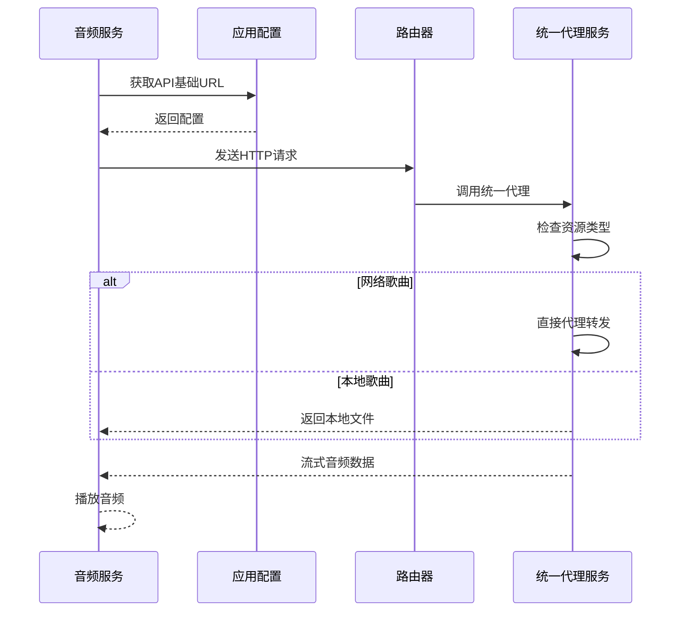
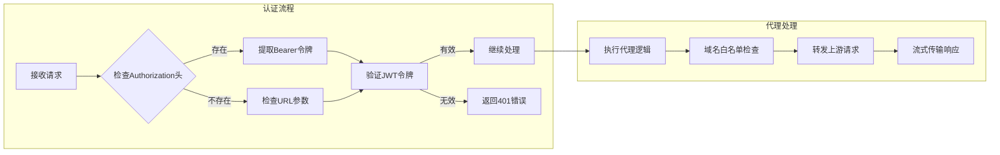
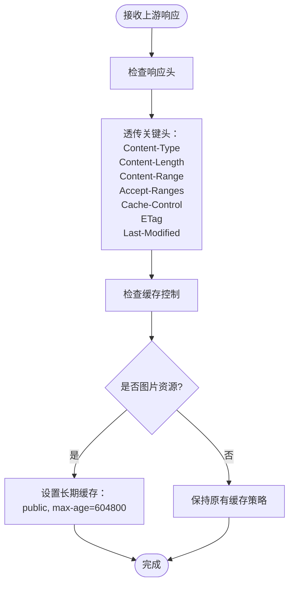
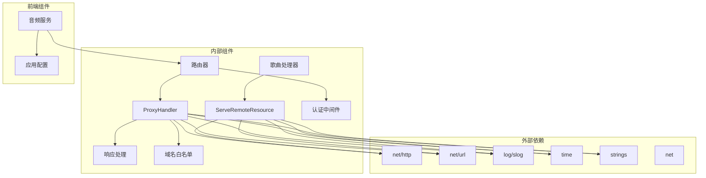
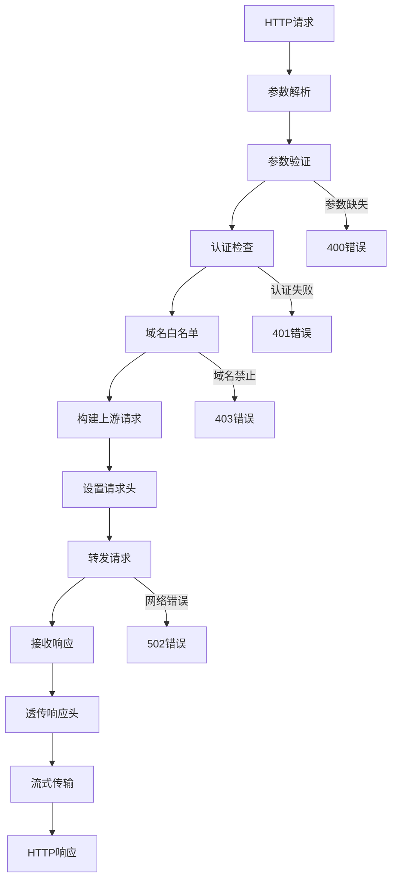

# 代理处理器

<cite>
**本文档引用的文件**
- [proxy.go](file://internal/handlers/proxy.go)
- [whitelist.go](file://internal/services/whitelist.go)
- [routers.go](file://internal/app/routers.go)
- [response.go](file://internal/handlers/response.go)
- [auth.go](file://internal/middleware/auth.go)
- [music.go](file://internal/handlers/music.go)
- [app_config.dart](file://frontend/lib/config/app_config.dart)
- [audio_service.dart](file://frontend/lib/core/audio/audio_service.dart)
</cite>

## 更新摘要
**变更内容**
- 新增统一代理服务 ServeRemoteResource，提供通用远程资源代理功能
- 增强响应头透传机制，支持缓存控制策略优化
- 扩展前端集成方式，支持多种资源类型的代理访问
- 完善错误处理和安全机制描述

## 目录
1. [简介](#简介)
2. [项目结构](#项目结构)
3. [核心组件](#核心组件)
4. [架构概览](#架构概览)
5. [详细组件分析](#详细组件分析)
6. [依赖关系分析](#依赖关系分析)
7. [性能考虑](#性能考虑)
8. [故障排除指南](#故障排除指南)
9. [结论](#结论)

## 简介

代理处理器是 MiMusic 音乐服务器中的关键组件，专门用于解决浏览器跨域资源共享（CORS）限制问题。系统现已引入新的统一代理服务 ServeRemoteResource，提供更加通用和高效的远程资源代理功能，支持 HTTP 请求流式传输、Range 头支持和适当的头部转发。

该系统采用 Go 语言开发后端服务，配合 Flutter 前端应用，实现了完整的音乐播放生态系统。代理处理器通过智能的域名白名单机制和安全的认证流程，确保资源访问的安全性和可靠性。

**更新** 新版本引入了统一代理服务 ServeRemoteResource，显著增强了系统的代理能力和性能表现。

## 项目结构

MiMusic 项目采用分层架构设计，代理处理器位于内部处理层，与路由配置、认证中间件和前端应用紧密协作：

**图表来源**
- [routers.go:38-115](file://internal/app/routers.go#L38-L115)
- [proxy.go:15-35](file://internal/handlers/proxy.go#L15-L35)

**章节来源**
- [routers.go:1-268](file://internal/app/routers.go#L1-L268)
- [proxy.go:1-167](file://internal/handlers/proxy.go#L1-L167)

## 核心组件

### 代理处理器架构

代理处理器采用简洁而高效的架构设计，主要包含以下核心组件：

#### 主要特性
- **CORS 解决方案**：通过服务器端代理绕过浏览器同源策略限制
- **流式传输**：支持大文件（如 MP3、M3U8）的流式转发
- **Range 请求支持**：完全透传音频播放的范围请求，支持播放进度跳转
- **响应头透传**：智能透传关键响应头，包括缓存控制策略
- **安全域名过滤**：内置域名白名单机制防止滥用
- **统一代理服务**：新增的 ServeRemoteResource 提供通用代理能力

#### 设计模式
- **处理器模式**：单一职责的 HTTP 处理器
- **工厂模式**：提供代理处理器的创建方法
- **中间件集成**：与认证中间件无缝协作
- **服务模式**：支持多种资源类型的统一代理

**章节来源**
- [proxy.go:15-45](file://internal/handlers/proxy.go#L15-L45)
- [proxy.go:21-35](file://internal/handlers/proxy.go#L21-L35)
- [proxy.go:110-117](file://internal/handlers/proxy.go#L110-L117)

## 架构概览

代理处理器在整个 MiMusic 系统中的位置和作用如下：

**图表来源**
- [audio_service.dart:189-210](file://frontend/lib/core/audio/audio_service.dart#L189-L210)
- [routers.go:151](file://internal/app/routers.go#L151)
- [proxy.go:78-80](file://internal/handlers/proxy.go#L78-L80)
- [music.go:679-684](file://internal/handlers/music.go#L679-L684)

### 系统集成点

代理处理器与系统的各个组件紧密集成：

**图表来源**
- [audio_service.dart:189-210](file://frontend/lib/core/audio/audio_service.dart#L189-L210)
- [routers.go:150-151](file://internal/app/routers.go#L150-L151)
- [whitelist.go:8-32](file://internal/services/whitelist.go#L8-L32)

**章节来源**
- [audio_service.dart:1-200](file://frontend/lib/core/audio/audio_service.dart#L1-L200)
- [routers.go:28-176](file://internal/app/routers.go#L28-L176)

## 详细组件分析

### 代理处理器实现

#### 核心数据结构

**图表来源**
- [proxy.go:17-19](file://internal/handlers/proxy.go#L17-L19)
- [proxy.go:22-35](file://internal/handlers/proxy.go#L22-L35)
- [proxy.go:117-166](file://internal/handlers/proxy.go#L117-L166)

#### 处理流程详解

代理处理器的核心处理流程包括以下几个关键步骤：

1. **参数验证**：检查必需的 URL 参数
2. **URL 解析**：验证并解析目标 URL
3. **协议检查**：确保只处理 HTTP/HTTPS 协议
4. **域名白名单验证**：检查目标域名是否在允许列表中
5. **请求构建**：创建上游 HTTP 请求
6. **头部透传**：复制必要的请求头
7. **响应处理**：流式传输响应数据

#### 统一代理服务

**新增** ServeRemoteResource 是系统的核心代理服务，提供以下功能：

- **通用代理**：支持任何类型的远程资源代理
- **Range 请求支持**：完全透传音频播放的范围请求
- **头部透传**：智能透传关键响应头
- **缓存优化**：对图片资源设置长期缓存策略
- **错误处理**：提供详细的错误信息和状态码

**章节来源**
- [proxy.go:37-166](file://internal/handlers/proxy.go#L37-L166)
- [whitelist.go:8-54](file://internal/services/whitelist.go#L8-L54)

### 前端集成实现

#### 应用配置

前端的配置系统支持两种部署模式：

**图表来源**
- [app_config.dart:5-36](file://frontend/lib/config/app_config.dart#L5-L36)

#### 音频播放集成

音频服务通过统一的 URL 处理机制实现外部资源的播放：

**图表来源**
- [audio_service.dart:189-210](file://frontend/lib/core/audio/audio_service.dart#L189-L210)
- [app_config.dart:8-14](file://frontend/lib/config/app_config.dart#L8-L14)

**章节来源**
- [app_config.dart:1-37](file://frontend/lib/config/app_config.dart#L1-L37)
- [audio_service.dart:185-254](file://frontend/lib/core/audio/audio_service.dart#L185-L254)

### 认证与安全机制

#### 认证中间件集成

代理处理器与认证中间件协同工作，确保只有经过身份验证的用户才能访问代理资源：

**图表来源**
- [auth.go:11-51](file://internal/middleware/auth.go#L11-L51)
- [proxy.go:65-71](file://internal/handlers/proxy.go#L65-L71)

#### 域名白名单机制

域名白名单机制采用多层防护策略：

1. **显式内网过滤**：阻止 localhost、.local 域名等
2. **DNS 解析验证**：通过 DNS 查询确认域名解析结果
3. **IP 地址检查**：检查解析出的 IP 地址是否为私有地址
4. **宽松策略**：DNS 解析失败时放行，交由后续 HTTP 请求处理

**章节来源**
- [auth.go:1-52](file://internal/middleware/auth.go#L1-L52)
- [whitelist.go:8-54](file://internal/services/whitelist.go#L8-L54)

### 响应头透传与缓存策略

#### 响应头透传机制

代理处理器实现了智能的响应头透传机制，特别针对缓存控制进行了优化：

**图表来源**
- [proxy.go:82-108](file://internal/handlers/proxy.go#L82-L108)

**更新** 新增了详细的缓存控制策略，特别是对图片资源的长期缓存优化。

**章节来源**
- [proxy.go:82-108](file://internal/handlers/proxy.go#L82-L108)

## 依赖关系分析

### 组件依赖图

**图表来源**
- [proxy.go:3-13](file://internal/handlers/proxy.go#L3-L13)
- [routers.go:3-17](file://internal/app/routers.go#L3-L17)
- [music.go:679-684](file://internal/handlers/music.go#L679-L684)

### 数据流分析

代理处理器的数据流遵循严格的处理管道：

**图表来源**
- [proxy.go:50-115](file://internal/handlers/proxy.go#L50-L115)
- [response.go:8-25](file://internal/handlers/response.go#L8-L25)

**章节来源**
- [proxy.go:1-167](file://internal/handlers/proxy.go#L1-L167)
- [response.go:1-25](file://internal/handlers/response.go#L1-L25)

## 性能考虑

### 流式传输优化

代理处理器采用流式传输机制，有效处理大文件资源：

- **内存效率**：使用 io.Copy 实现零拷贝流式传输
- **延迟优化**：立即开始传输响应体，减少首字节延迟
- **带宽利用**：充分利用网络带宽，避免缓冲区积压

### 缓存策略

针对不同类型的内容实施差异化缓存策略：

- **图片资源**：设置较长的缓存时间（7天），减少重复请求
- **音频资源**：依赖上游服务器的缓存策略
- **动态内容**：避免不必要的缓存，确保内容新鲜度

**更新** 新版本优化了缓存控制策略，特别是对图片资源的长期缓存管理。

### 超时和重定向处理

- **请求超时**：60秒超时设置，平衡响应时间和资源占用
- **重定向控制**：限制最大重定向次数（10次），防止无限循环
- **错误恢复**：优雅处理网络异常和上游服务器故障

## 故障排除指南

### 常见问题诊断

#### 400 错误（参数无效）
- **原因**：缺少必需的 url 参数或 URL 格式不正确
- **解决方案**：检查前端构建的代理 URL，确保 URL 参数正确编码

#### 401 错误（认证失败）
- **原因**：访问令牌缺失或无效
- **解决方案**：重新登录获取有效令牌，检查令牌过期时间

#### 403 错误（域名禁止）
- **原因**：目标域名不在白名单中
- **解决方案**：检查域名白名单配置，联系管理员添加允许的域名

#### 502 错误（上游服务器错误）
- **原因**：上游服务器不可达或响应异常
- **解决方案**：检查网络连接，验证目标服务器状态

### 调试技巧

1. **日志分析**：查看服务器日志中的错误信息和请求详情
2. **网络监控**：使用浏览器开发者工具监控网络请求
3. **超时调整**：根据网络状况调整代理超时设置
4. **缓存清理**：清除浏览器缓存，避免陈旧内容干扰

**章节来源**
- [proxy.go:52-54](file://internal/handlers/proxy.go#L52-L54)
- [proxy.go:100-103](file://internal/handlers/proxy.go#L100-L103)
- [whitelist.go:13-16](file://internal/services/whitelist.go#L13-L16)

## 结论

代理处理器作为 MiMusic 音乐服务器的核心组件，成功解决了跨域资源共享这一关键技术难题。通过精心设计的安全机制、高效的流式传输和完善的错误处理，该组件为用户提供了稳定可靠的音乐播放体验。

**更新** 新版本引入了统一代理服务 ServeRemoteResource，显著增强了系统的代理能力和性能表现。该服务支持 HTTP 请求流式传输、Range 头支持和适当的头部转发，为各种资源类型的代理访问提供了统一的解决方案。

系统的主要优势包括：

- **安全性**：多重安全防护机制，有效防止滥用和攻击
- **性能**：流式传输和智能缓存策略，优化资源利用率
- **兼容性**：跨平台支持，适配不同的前端框架和运行环境
- **可维护性**：清晰的架构设计和完善的文档支持
- **扩展性**：统一代理服务支持多种资源类型的代理访问

未来可以考虑的功能增强包括：更细粒度的访问控制、CDN 集成支持、性能监控和分析等功能，进一步提升系统的整体表现和用户体验。