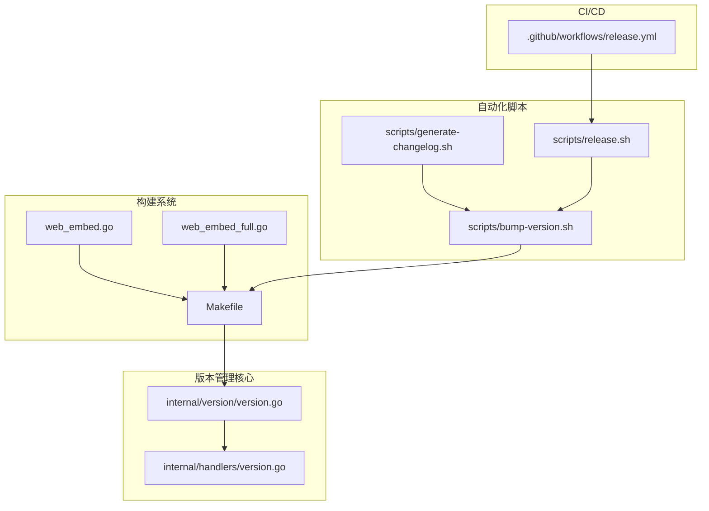
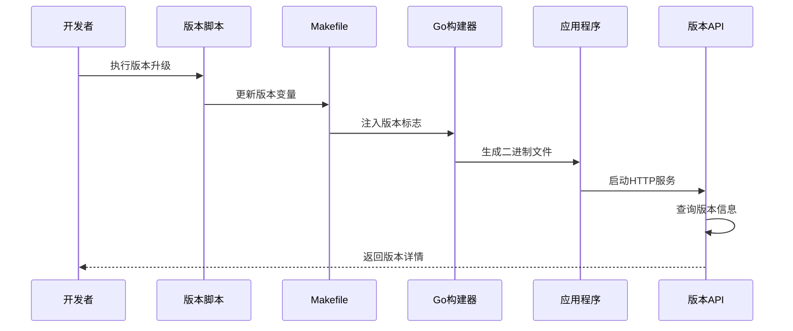
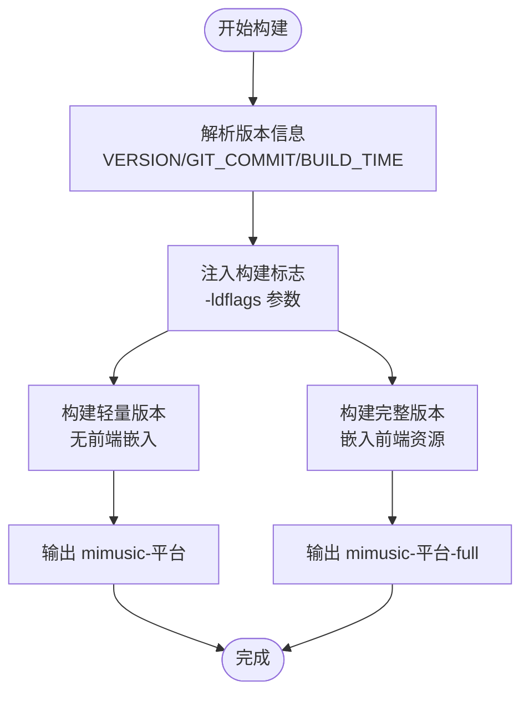
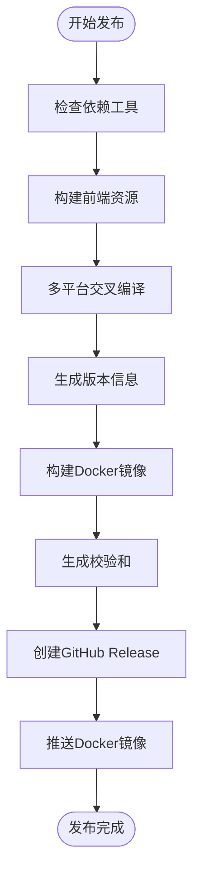
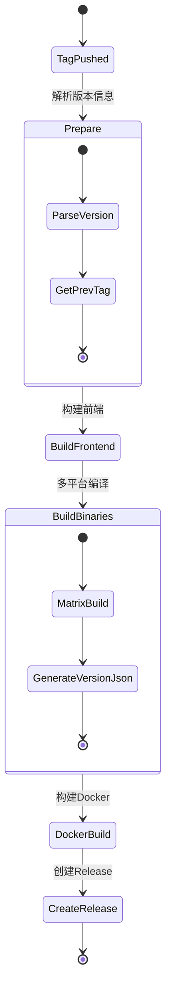
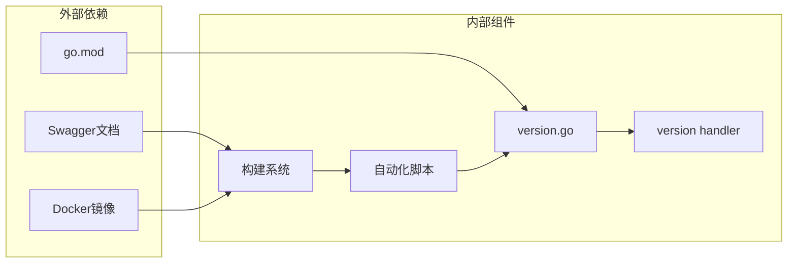

# 版本管理

<cite>
**本文档引用的文件**
- [main.go](file://main.go)
- [internal/version/version.go](file://internal/version/version.go)
- [scripts/bump-version.sh](file://scripts/bump-version.sh)
- [scripts/generate-changelog.sh](file://scripts/generate-changelog.sh)
- [scripts/release.sh](file://scripts/release.sh)
- [Makefile](file://Makefile)
- [internal/handlers/version.go](file://internal/handlers/version.go)
- [web_embed.go](file://web_embed.go)
- [web_embed_full.go](file://web_embed_full.go)
- [.github/workflows/release.yml](file://.github/workflows/release.yml)
- [CHANGELOG.md](file://CHANGELOG.md)
- [go.mod](file://go.mod)
</cite>

## 更新摘要
**所做更改**
- 更新了版本号从 1.4.0 升级到 1.4.1 的相关信息
- 更新了 Makefile 中 VERSION 变量的引用（从 1.4.0 到 1.4.1）
- 更新了 main.go 中 Swagger 文档版本号的引用（从 1.4.0 到 1.4.1）
- 更新了 CHANGELOG.md 中版本历史记录（包含 1.4.1、1.4.0、1.3.50、1.3.49、1.3.48、1.3.47、1.3.46、1.3.45、1.3.43、1.3.42、1.3.41、1.3.40、1.3.39、1.3.38、1.3.37、1.3.35、1.3.34、1.3.33、1.3.32、1.3.31、1.3.30）
- 更新了 Swagger 文档版本信息
- 更新了 GitHub Actions 工作流中的版本配置
- 改进了版本同步机制的自动化程度

## 目录
1. [简介](#简介)
2. [项目结构](#项目结构)
3. [核心组件](#核心组件)
4. [架构概览](#架构概览)
5. [详细组件分析](#详细组件分析)
6. [依赖关系分析](#依赖关系分析)
7. [性能考虑](#性能考虑)
8. [故障排除指南](#故障排除指南)
9. [结论](#结论)

## 简介

MiMusic 是一个轻量级音乐服务器应用，采用 Go 语言开发，支持本地音乐管理、网络歌曲、电台和歌单功能。本文档详细介绍了项目的版本管理系统，包括版本信息注入、版本号升级、发布流程和持续集成等方面。

**最新版本**：1.4.1

## 项目结构

项目采用模块化的架构设计，版本管理相关的组件分布在多个关键位置：

**图表来源**
- [internal/version/version.go:1-25](file://internal/version/version.go#L1-L25)
- [Makefile:1-353](file://Makefile#L1-L353)
- [scripts/bump-version.sh:1-254](file://scripts/bump-version.sh#L1-L254)

**章节来源**
- [internal/version/version.go:1-25](file://internal/version/version.go#L1-L25)
- [Makefile:1-353](file://Makefile#L1-L353)

## 核心组件

### 版本信息管理

版本信息通过 Go 的构建标签机制注入到二进制文件中，支持多种构建类型：

| 组件 | 功能描述 | 关键特性 |
|------|----------|----------|
| internal/version | 版本信息常量和查询函数 | 支持完整版本信息格式化 |
| internal/handlers/version | HTTP API 版本查询接口 | 提供 JSON 格式的版本信息 |
| Makefile | 构建系统核心 | 定义版本变量和构建标志 |
| web_embed | 轻量版本嵌入 | 空的文件系统实现 |
| web_embed_full | 完整版本嵌入 | 嵌入前端资源 |

**章节来源**
- [internal/version/version.go:1-25](file://internal/version/version.go#L1-L25)
- [internal/handlers/version.go:1-35](file://internal/handlers/version.go#L1-L35)
- [Makefile:1-353](file://Makefile#L1-L353)

## 架构概览

版本管理系统采用多层次的设计，从源码注入到运行时查询，再到自动化发布流程：

**图表来源**
- [scripts/bump-version.sh:140-251](file://scripts/bump-version.sh#L140-L251)
- [Makefile:14-18](file://Makefile#L14-L18)
- [internal/handlers/version.go:25-34](file://internal/handlers/version.go#L25-L34)

## 详细组件分析

### 版本信息注入机制

版本信息通过 Go 的 `-ldflags` 机制在编译时注入：

**图表来源**
- [Makefile:14-18](file://Makefile#L14-L18)
- [Makefile:82-118](file://Makefile#L82-L118)

**章节来源**
- [Makefile:14-18](file://Makefile#L14-L18)
- [Makefile:82-118](file://Makefile#L82-L118)

### 版本号升级自动化

提供三种级别的版本升级策略：

| 升级类型 | 作用域 | 使用场景 |
|----------|--------|----------|
| major | 主版本号 | 重大功能更新或破坏性变更 |
| minor | 次版本号 | 新功能添加但向后兼容 |
| patch | 补丁版本号 | 错误修复和小改进 |

**章节来源**
- [scripts/bump-version.sh:96-125](file://scripts/bump-version.sh#L96-L125)

### 发布流程自动化

完整的发布流程包含以下步骤：

**图表来源**
- [scripts/release.sh:667-800](file://scripts/release.sh#L667-L800)

**章节来源**
- [scripts/release.sh:667-800](file://scripts/release.sh#L667-L800)

### CI/CD 集成

GitHub Actions 工作流实现了完整的自动化发布：

**图表来源**
- [.github/workflows/release.yml:20-82](file://.github/workflows/release.yml#L20-L82)

**章节来源**
- [.github/workflows/release.yml:20-82](file://.github/workflows/release.yml#L20-L82)

### Swagger 文档版本管理

Swagger API 文档的版本信息与主版本号保持同步：

- **Swagger 版本**：1.4.1
- **版本同步机制**：通过 Makefile 的 `swagger` 目标自动更新
- **版本更新流程**：构建时自动将 `main.go` 中的版本注释更新为当前版本
- **改进的同步机制**：脚本现在更可靠地处理不同平台上的 sed 命令差异

**章节来源**
- [Makefile:314-323](file://Makefile#L314-L323)
- [main.go:27](file://main.go#L27)
- [scripts/bump-version.sh:200-211](file://scripts/bump-version.sh#L200-L211)

## 依赖关系分析

版本管理系统与其他组件的依赖关系：

**图表来源**
- [go.mod:1-57](file://go.mod#L1-L57)
- [Makefile:1-353](file://Makefile#L1-L353)

**章节来源**
- [go.mod:1-57](file://go.mod#L1-L57)
- [Makefile:1-353](file://Makefile#L1-L353)

## 性能考虑

版本管理系统的性能特点：

1. **编译时注入**：版本信息在编译时确定，运行时无需额外查询
2. **轻量级实现**：版本查询仅涉及简单的字符串拼接操作
3. **缓存友好**：版本信息作为常量存储，CPU 缓存命中率高
4. **零依赖**：版本查询不依赖外部服务或数据库

## 故障排除指南

### 常见问题及解决方案

| 问题类型 | 症状 | 解决方案 |
|----------|------|----------|
| 版本信息显示 unknown | `Version: dev`, `GitCommit: unknown` | 检查构建标志是否正确注入 |
| 构建失败 | 编译错误或链接错误 | 验证 Go 版本和依赖完整性 |
| 发布流程中断 | GitHub Release 创建失败 | 检查 GitHub Token 权限 |
| Docker 构建失败 | 镜像构建超时或失败 | 确认 Docker Buildx 配置 |
| Swagger 版本不匹配 | API 文档版本与代码版本不一致 | 运行 `make swagger` 重新生成文档 |
| 版本同步失败 | 不同平台 sed 命令不兼容 | 使用改进的跨平台 sed 命令 |

**章节来源**
- [scripts/release.sh:177-221](file://scripts/release.sh#L177-L221)

### 调试技巧

1. **验证版本注入**：使用 `strings` 命令检查二进制文件中的版本字符串
2. **检查构建标志**：确认 `-ldflags` 参数正确传递给 `go build`
3. **验证 API 接口**：通过 `/version` 端点检查运行时版本信息
4. **调试脚本执行**：使用 `set -x` 启用 Bash 调试输出
5. **检查 Swagger 同步**：确认 `main.go` 中的版本注释与 Makefile 一致
6. **验证跨平台兼容性**：测试不同操作系统上的版本同步脚本

## 版本历史

### 最新版本：1.4.1 (2026-05-27)

**主要更新内容**：
- 默认开启网络歌单自动转本地歌单
- 重构歌词接口问题
- 修复缓存歌曲冲突问题
- 修复rename文件报错问题
- 优化扫描设置开关文案

### 前一版本：1.4.0 (2026-05-27)

**主要更新内容**：
- 自动创建歌单功能简化
- 歌曲下载功能优化
- 简化歌曲歌词封面的url逻辑
- 重构url
- 优化url路径
- 移除wasm插件模块
- 网络歌曲转本地歌曲支持写入tag
- 修复 js fetch 接口问题
- 歌曲去重
- 修复歌单名重复问题
- 修复歌单名重复问题
- sqlite问题
- 修复url问题
- 修复插件接口问题
- **test**: 删除手写 mock，全切 :memory: 真实 DB
- **database**: 引入 UnitOfWork，下线 database.Tx/SQLiteTx
- **database**: playlist_songs 表切到 PlaylistSongRepository
- **database**: playlists 表切到 PlaylistRepository
- **database**: songs 表切到 SongRepository
- **database**: js_plugins 仓储改用 sqlc.Queries
- **database**: configs 表切到 ConfigRepository
- **database**: tokens 表切到 TokenRepository
- **database**: 引入 sqlc + goose + squirrel 基础设施
- **database**: 新增 DATABASE_MIGRATIONS 操作指南 + 集成 sqlc 命令到 Makefile
- **agents**: 同步数据库重构后的开发约定
- **musicsdk**: bump musicsdk v1.1.0 + lxmusic 用上 LyricFetcher.lyricParams

### 更早版本历史

**1.3.50 (2026-05-25)**：
- 支持网络歌曲转本地歌曲
- release version 1.3.50

**1.3.49 (2026-05-24)**：
- 修复js插件休眠问题
- release version 1.3.49

**1.3.48 (2026-05-22)**：
- 修复js插件导致宕机问题
- release version 1.3.48

**1.3.47 (2026-05-22)**：
- js插件支持手动上传更新
- 修复编译警告
- 修复js异步问题
- release version 1.3.47

**1.3.46 (2026-05-21)**：
- js插件改成真异步环境
- 优化插件不可用时的提示
- release version 1.3.46

**1.3.45 (2026-05-20)**：
- 自动创建的歌单默认按照数字前缀排序
- 新增js虚拟机
- 新增js api
- 新增 lxmusic 插件
- 修复关闭进程卡死问题
- release version 1.3.45

**1.3.43 (2026-05-16)**：
- release version 1.3.43

**1.3.42 (2026-05-16)**：
- js插件性能优化
- js插件支持jsc
- 新增JS插件管理
- js插件开发
- 新增js插件机制
- 插件休眠更激进
- 修复js插件相关问题
- 修复js插件问题
- JS插件问题修复
- **jsplugin**: split playlists permission into read/write
- release version 1.3.42

**1.3.41 (2026-05-11)**：
- 内存优化：空闲插件自动休眠
- 内存优化
- 内存优化
- release version 1.3.41

**1.3.40 (2026-05-07)**：
- 修复打包脚本问题
- release version 1.3.40

**1.3.39 (2026-05-06)**：
- 歌单排序功能优化
- 首页歌单数量显示优化
- 自动生成的歌单名字优化
- 新增歌单排序功能
- 添加wma格式支持
- 清理失效的本地歌曲
- 修复windows网络歌曲无法缓存的问题
- release version 1.3.39

**1.3.38 (2026-05-06)**：
- 新增歌单排序功能
- 添加wma格式支持
- 修复升级后404问题
- release version 1.3.38

**1.3.37 (2026-04-30)**：
- 修复vbr播放时长读取错误问题
- release version 1.3.37

**1.3.35 (2026-04-29)**：
- 优化插件静态资源访问
- release version 1.3.35

**1.3.34 (2026-04-27)**：
- 修复arm/v7系统无法加载插件问题
- release version 1.3.34

**1.3.33 (2026-04-26)**：
- 兼容 J3455 CPU
- release version 1.3.33

**1.3.32 (2026-04-26)**：
- 修复升级后404问题
- release version 1.3.32

**1.3.31 (2026-04-25)**：
- 兼容 J3455 CPU
- release version 1.3.31

**1.3.30 (2026-04-25)**：
- 兼容 J3455 CPU
- release version 1.3.30

**1.3.29 (2026-04-20)**：
- 插件支持更新
- 修复部分洛雪音源无法使用问题
- release version 1.3.29

**1.3.28 (2026-04-20)**：
- 新增排除目录设置
- release version 1.3.28

**1.3.24 (2026-04-19)**：
- 🔧 Chores: release version 1.3.24

**1.3.22 (2026-04-17)**：
- ✨ Features: 优化启动速度、删除 entry_path 字段
- 🔧 Chores: release version 1.3.22

**1.3.21 (2026-04-17)**：
- ✨ Features: 优化升级
- 🐛 Bug Fixes: 修复 FLAC 中的 ID3v2 信息无法解析的问题、修复导入相同插件问题
- 🔧 Chores: release version 1.3.21

**1.3.20 (2026-04-16)**：
- 🔧 Chores: release version 1.3.20

**1.3.18 (2026-04-15)**：
- ✨ Features: 新增批量删除歌单接口、缓存功能优化、服务端资源缓存优化
- 🐛 Bug Fixes: 修复从lite切换到full的问题
- 🔧 Chores: release version 1.3.18

**1.3.16 (2026-04-10)**：
- ✨ Features: 支持版本回退到底包、更新后端支持使用代理
- 🐛 Bug Fixes: 修复端内更新问题
- 🔧 Chores: release version 1.3.16

**1.3.13 (2026-04-09)**：
- ✨ Features: 新增发布内容、支持断点续传、新增异步下载接口、写入 server_platform 到数据库、新增执行命令协议、优化无参数启动方式
- 🐛 Bug Fixes: 解决文件权限问题、网络歌曲导入问题修复
- 🔧 Chores: release version 1.3.13

**1.3.12 (2026-04-08)**：
- 🔧 Chores: release version 1.3.12

**1.3.10 (2026-04-06)**：
- 🐛 Bug Fixes: sql error
- 🔧 Chores: release version 1.3.10

**1.3.9 (22026-04-03)**：
- 🔧 Chores: release version 1.3.9

**1.3.8 (2026-04-03)**：
- 🔧 Chores: release version 1.3.8

**1.3.7 (2026-04-02)**：
- 🔧 Chores: release version 1.3.7

**1.3.6 (2026-04-02)**：
- 🔧 Chores: release version 1.3.6

**1.3.5 (2026-04-02)**：
- 🔧 Chores: release version 1.3.5

**1.3.4 (2026-04-01)**：
- ✨ Features: 支持上传封面
- 🐛 Bug Fixes: 扫描歌曲宕机问题
- 🔧 Chores: release version 1.3.4

**1.3.3 (2026-03-31)**：
- ✨ Features: 尝试修复lx运行问题
- 🔧 Chores: release version 1.3.3

**1.3.2 (2026-03-30)**：
- ✨ Features: 添加网络歌曲电台接口改为批量
- 🔧 Chores: release version 1.3.2

**1.3.1 (2026-03-30)**：
- 🔧 Chores: release version 1.3.1

**1.3.0 (2026-03-30)**：
- 更新内容: 版本升级到 1.3.0

**1.2.8 (2026-03-30)**：
- 更新内容: 版本升级到 1.2.8

**章节来源**
- [CHANGELOG.md:1-200](file://CHANGELOG.md#L1-L200)

## 结论

MiMusic 的版本管理系统采用了现代化的自动化方法，通过以下关键特性确保了高效的版本控制：

1. **自动化版本升级**：提供三种升级策略，支持无交互式操作
2. **完整的发布流程**：从构建到发布的全自动化流程
3. **多平台支持**：支持 Linux、Windows、macOS 和 Docker 多架构镜像
4. **CI/CD 集成**：GitHub Actions 实现完全自动化的发布流程
5. **版本信息透明**：提供详细的版本信息查询接口
6. **Swagger 文档同步**：API 文档版本与代码版本保持实时同步
7. **跨平台兼容性**：改进的版本同步机制支持不同操作系统的 sed 命令差异

**最新版本**：1.4.1

该系统不仅提高了开发效率，还确保了版本发布的准确性和一致性，为项目的长期维护和发展奠定了坚实基础。随着版本的持续演进，系统将继续优化版本管理流程，提升用户体验和开发效率。