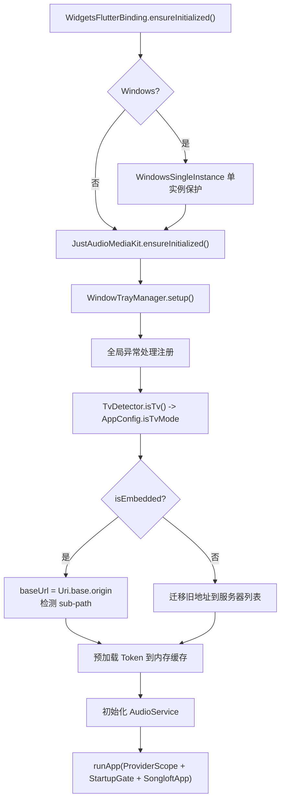
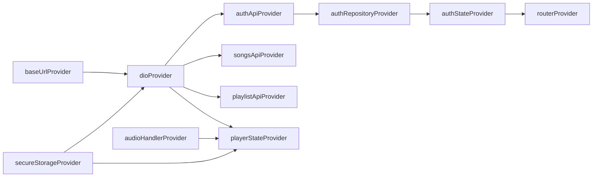
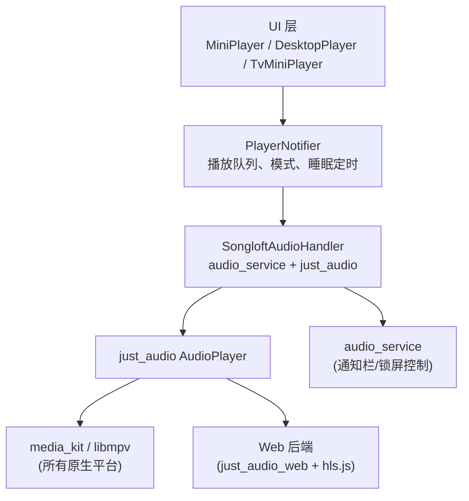
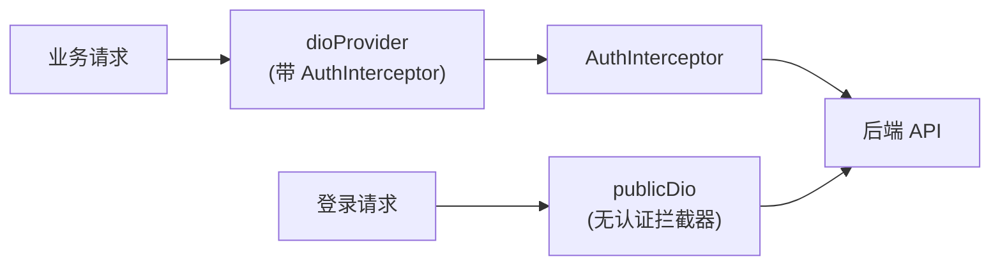

# 前端系统设计

本文档基于以下源文件编写：

- `songloft-player/pubspec.yaml` -- 依赖列表与项目配置
- `songloft-player/lib/main.dart` -- 应用入口与初始化流程
- `songloft-player/lib/config/app_config.dart` -- 部署模式与编译时常量
- `songloft-player/lib/core/router/app_router.dart` -- GoRouter 路由定义
- `songloft-player/lib/core/audio/audio_service.dart` -- 音频服务封装
- `songloft-player/lib/core/network/api_client.dart` -- Dio 网络层
- `songloft-player/lib/core/network/auth_interceptor.dart` -- 认证拦截器
- `songloft-player/lib/core/network/base_url_provider.dart` -- BaseURL 状态管理
- `songloft-player/lib/core/network/server_probe.dart` -- 服务器可达性探测
- `songloft-player/lib/core/theme/app_theme.dart` -- Material 3 主题构建
- `songloft-player/lib/core/theme/responsive.dart` -- 响应式断点与屏幕类型
- `songloft-player/lib/core/storage/secure_storage.dart` -- Token 存储
- `songloft-player/lib/core/env/tv_detector.dart` -- TV 设备检测
- `songloft-player/lib/core/utils/url_helper.dart` -- 资源 URL 拼接
- `songloft-player/lib/core/utils/platform_utils.dart` -- 平台检测工具
- `songloft-player/lib/core/utils/audio_format_helper.dart` -- 音频格式转码判定
- `songloft-player/lib/shared/layouts/shell_layout.dart` -- ShellRoute 布局
- `songloft-player/lib/shared/layouts/adaptive_scaffold.dart` -- 自适应脚手架
- `songloft-player/lib/features/startup/presentation/startup_gate.dart` -- 启动门控
- `songloft-player/lib/features/player/domain/player_state.dart` -- 播放器状态模型
- `songloft-player/lib/features/player/presentation/providers/player_provider.dart` -- 播放器 Notifier
- `songloft-player/lib/features/auth/presentation/providers/auth_provider.dart` -- 认证状态管理
- `songloft-player/lib/features/settings/presentation/providers/settings_provider.dart` -- 设置与主题
- `songloft-player/lib/features/home/presentation/plugin_webview_page.dart` -- 插件 WebView 条件导出
- `songloft-player/lib/features/home/presentation/plugin_webview_page_native.dart` -- 原生 WebView
- `songloft-player/lib/features/home/presentation/plugin_webview_page_stub.dart` -- Web 平台桩

## 目录

1. [简介](#1-简介)
2. [目录结构与分层架构](#2-目录结构与分层架构)
3. [应用启动流程](#3-应用启动流程)
4. [部署模式](#4-部署模式)
5. [状态管理](#5-状态管理)
6. [路由系统](#6-路由系统)
7. [音频播放系统](#7-音频播放系统)
8. [网络层](#8-网络层)
9. [主题系统](#9-主题系统)
10. [多平台适配](#10-多平台适配)
11. [插件集成](#11-插件集成)
12. [结论](#12-结论)

---

## 1. 简介

Songloft 前端是基于 Flutter 3.29+ / Dart 3.7+ 的跨平台音乐播放器，支持 Android、iOS、Web、macOS、Windows、Linux 六个平台，并额外适配 Android TV 模式。项目采用 feature-based 目录结构与 Riverpod 状态管理，通过 `just_audio` + `audio_service` 实现统一的音频播放体验，通过编译时常量控制 embedded/standalone 两种部署模式。

**章节来源**: `pubspec.yaml`（技术栈定义）、`AGENTS.md`（项目概述）

---

## 2. 目录结构与分层架构

### 2.1 顶层目录

```
lib/
  main.dart           # 应用入口
  config/             # 编译时配置（AppConfig）
  core/               # 基础设施层
    audio/            # 音频服务封装
    backend/          # Bundle 本地模式后端（生命周期、桌面子进程、嵌入库、运行模式）
    env/              # 环境检测（TV 模式）
    network/          # 网络层（Dio、拦截器、ServerProbe）
    platform/         # 平台特定服务（Live Activity）
    router/           # GoRouter 路由定义
    storage/          # 本地存储（Token、偏好设置、播放状态）
    theme/            # 主题与响应式断点
    tracely/          # 遥测监控
    utils/            # 工具类（URL 拼接、平台检测、格式转码）
  features/           # 业务功能模块
    auth/             # 认证（登录/登出/Token 管理）
    home/             # 首页（含插件 WebView 页面）
    jsplugin/         # JS 插件管理（商店、列表）
    library/          # 歌曲库（歌曲列表、搜索、收藏）
    player/           # 播放器（全屏/迷你/桌面播放器、歌词）
    playlist/         # 歌单（列表、详情、拖拽排序）
    settings/         # 设置（扫描、缓存、代理、升级）
    startup/          # 启动门控（Splash + 服务器探测）
  shared/             # 跨 feature 共享
    layouts/          # 布局组件（ShellLayout、AdaptiveScaffold）
    models/           # 共享数据模型（Song 等）
    utils/            # 共享工具（响应式 SnackBar）
    widgets/          # 通用 Widget
```

### 2.2 Feature 分层约定

每个 feature 模块内部遵循 data / domain / presentation 三层结构：

| 层级 | 职责 | 典型文件 |
|------|------|----------|
| `data/` | API 调用、数据序列化 | `songs_api.dart`、`auth_api.dart`、`playlist_api.dart` |
| `domain/` | 业务模型与状态定义 | `auth_state.dart`、`player_state.dart` |
| `presentation/` | UI 页面、Widget、Provider | `login_page.dart`、`player_provider.dart` |

Provider 统一放在 `presentation/providers/` 下，页面级 Widget 放在 `presentation/widgets/` 下。这种分层确保了数据流的单向性：API -> Domain Model -> Provider -> UI。

**章节来源**: `lib/` 目录结构、`lib/features/` 子目录

---

## 3. 应用启动流程

`main()` 函数按固定顺序完成平台初始化，确保各子系统在 `runApp` 之前就绪。



### 3.1 StartupGate 服务器探测

standalone 模式下，`StartupGate` 在 Splash 界面期间执行服务器可达性探测：

1. 从持久化存储读取服务器列表
2. 单服务器时直接使用，多服务器时调用 `ServerProbe.pickFirstReachable()` 并行探测 `/api/v1/health`
3. 优先选择列表索引最小的可达服务器（2.5s 超时），全失败时 fallback 到列表首项
4. 将选中的 URL 写入 `baseUrlProvider`，设置 `probeOutcomeProvider` 供首屏提示

embedded 模式直接跳过探测，`_ready = true` 后立即渲染 child。

### 3.2 AudioService 初始化

AudioService 初始化带降级保护：

- **Web 平台**: 跳过 `AudioService.init` 的 await，直接创建 `SongloftAudioHandler`，让首帧尽快渲染
- **原生平台**: 通过 `AudioService.init<SongloftAudioHandler>()` 初始化，配置 Android 通知通道；失败时降级为无通知栏模式
- `androidStopForegroundOnPause: false` 保持前台服务持续运行，防止 HyperOS3 等系统在前台服务停止后激进回收资源

**章节来源**: `lib/main.dart`、`lib/features/startup/presentation/startup_gate.dart`、`lib/core/network/server_probe.dart`

---

## 4. 部署模式

### 4.1 编译时常量

`AppConfig` 通过 `--dart-define=DEPLOY_MODE=embedded|standalone` 在构建时注入部署模式：

```dart
static const bool isEmbedded = _kDeployMode == 'embedded';
```

`isEmbedded` 是编译时常量，Dart 的 tree-shaking 会移除未使用分支的代码。

### 4.2 两种模式对比

| 维度 | embedded | standalone |
|------|----------|------------|
| 部署方式 | Flutter Web 打包进 Go 二进制 | 独立静态部署或原生 App |
| API 地址 | 自动使用 `Uri.base.origin`（同域） | 用户手动配置，支持多服务器管理 |
| 子路径 | 从 `<base href>` 自动检测 | 不涉及 |
| 服务器探测 | 跳过 | StartupGate 并行探测 |
| API 地址 UI | 隐藏（tree-shaking 移除） | 显示，支持编辑和切换 |

### 4.3 子路径部署

embedded 模式下，后端通过 `-base-path /xxx` 启动时注入子路径。前端检测 `Uri.base.path`，将非根路径写入 `AppConfig.basePath` 和 `AppConfig.apiPrefix`：

```dart
AppConfig.basePath = trimmed;       // 例如 "/music"
AppConfig.apiPrefix = '$trimmed/api/v1';  // "/music/api/v1"
```

`UrlHelper` 在拼接资源 URL 时自动加入 `basePath` 前缀，确保封面、歌曲、歌词等资源请求路径正确。

### 4.4 Bundle 本地模式（v2.9.0+）

除了 `DEPLOY_MODE=embedded|standalone`（编译时决定是否随后端同域打包）这一维度外，客户端还有正交的**运行模式**维度：Bundle 本地模式将 Go 后端直接嵌入 Flutter 客户端，用户无需单独部署服务器即可使用。通过编译参数 `--dart-define=HAS_BACKEND=true`（`AppConfig.hasEmbeddedBackend`）启用，仅在非 Web 平台（Android/iOS/macOS/Windows/Linux）成立，Web 不支持。

运行模式由 `RunMode` 枚举表示，持久化到 SharedPreferences（key `songloft_run_mode`），启动时自动恢复：

| 运行模式 | 说明 |
|----------|------|
| `RunMode.remote` | 远程模式（默认），连接用户配置的远程服务器 |
| `RunMode.local` | 本地模式，启动嵌入的 Go 后端（`127.0.0.1:<port>`），自动以 `admin/admin` 登录 |

- 非 bundle 构建（未注入 `HAS_BACKEND`）下即便历史持久化了 `local` 也强制回退 `remote`，避免误显示「本地模式」
- 相关实现集中在 `lib/core/backend/`：
  - `run_mode_provider.dart` -- `RunModeNotifier`（运行模式持久化）+ `LocalMusicDirNotifier`（本地音乐目录）
  - `backend_lifecycle.dart` -- `BackendLifecycle`（WidgetsBindingObserver，App 前台恢复时重启后端、detached 时停止）
  - `desktop_backend_service.dart` -- 桌面端将 Go 后端作为子进程启动（在可执行文件同目录查找 `songloft-server`，解析 stdout 端口）
  - `embedded_backend_service.dart` -- 移动端通过 `MethodChannel('com.songloft/backend')` 调用 gomobile 绑定的原生库
- 本地模式启动流程：申请存储权限 → 启动后端 → 健康检查轮询（最多 10 次 × 300ms）→ 自动登录

**章节来源**: `lib/config/app_config.dart`、`lib/main.dart`、`lib/core/utils/url_helper.dart`、`lib/core/backend/`

---

## 5. 状态管理

### 5.1 Riverpod Provider 体系

项目使用 `flutter_riverpod` 3.x 进行状态管理，Provider 分为以下几类：

| 类型 | 用途 | 示例 |
|------|------|------|
| `Provider` | 静态依赖注入 | `dioProvider`、`secureStorageProvider`、`apiClientProvider` |
| `NotifierProvider` | 可变业务状态 | `authStateProvider`、`playerStateProvider`、`themeModeProvider` |
| `AsyncNotifierProvider` | 异步配置读写 | `hlsProxyEnabledProvider`、`tabConfigProvider`、`autoScanProvider` |
| `FutureProvider` | 一次性异步数据 | `serverVersionProvider`、`upgradeCheckProvider`、`configsProvider` |
| `Provider.family` | 参数化依赖 | `publicDioProvider`（按 customBaseUrl 参数创建） |

### 5.2 核心 Provider 列表

**基础设施层**:

- `audioHandlerProvider` -- 全局 `SongloftAudioHandler`，在 `main()` 中通过 `overrideWithValue` 注入
- `baseUrlProvider` -- 当前生效的 API base URL，是 single source of truth；写入时同步 mirror 到 `AppConfig.baseUrl`
- `dioProvider` -- 认证 Dio 实例，`ref.watch(baseUrlProvider)` 自动重建
- `secureStorageProvider` -- Token 存储服务
- `routerProvider` -- GoRouter 实例

**认证层**:

- `authStateProvider` -- 认证状态（unknown / loading / authenticated / unauthenticated）
- `isAuthenticatedProvider` / `isAuthResolvedProvider` -- 便捷派生 Provider

**播放器层**:

- `playerStateProvider` -- 完整播放器状态（当前歌曲、播放列表、进度、音量、播放模式、睡眠定时等）
- `hasCurrentSongProvider` / `isPlayingProvider` / `currentSongProvider` / `playerProgressProvider` -- 便捷选择器，避免无关字段变化触发重建

**设置层**:

- `themeModeProvider` -- 主题模式（system / light / dark）
- `scanProgressProvider` -- 扫描进度轮询
- `tabConfigProvider` -- 底部导航栏 Tab 配置
- 各功能开关: `hlsProxyEnabledProvider`、`httpProxyProvider`、`logLevelProvider`、`autoScanProvider`

### 5.3 Provider 依赖链



`baseUrlProvider` 变化时，`dioProvider` 自动重建新的 Dio 实例，所有依赖 Dio 的 API Provider 和 Notifier 都会感知到地址切换。

**章节来源**: `lib/core/network/api_client.dart`、`lib/core/network/base_url_provider.dart`、`lib/features/auth/presentation/providers/auth_provider.dart`、`lib/features/player/presentation/providers/player_provider.dart`、`lib/features/settings/presentation/providers/settings_provider.dart`

---

## 6. 路由系统

### 6.1 GoRouter 配置

路由使用 `go_router` 17.x，通过 `routerProvider` 以 Riverpod Provider 形式提供。认证守卫通过 `_AuthChangeNotifier` 桥接 Riverpod 状态到 GoRouter 的 `refreshListenable`，避免每次 auth 变化重建 GoRouter 实例。

### 6.2 路由表

| 路径 | 页面 | 说明 |
|------|------|------|
| `/login` | `LoginPage` | 独立路由，不含 ShellLayout |
| `/plugin` | `PluginWebViewPage` | 全屏插件页面，不含导航栏 |
| `/` | `HomePage` / `TvHomePage` | 首页，TV 模式使用独立页面 |
| `/library` | `LibraryPage` | 歌曲库 |
| `/playlists` | `PlaylistsPage` | 歌单列表 |
| `/playlists/:id` | `PlaylistDetailPage` | 歌单详情 |
| `/settings` | `SettingsPage` | 设置 |
| `/settings/servers` | `ServersPage` | 服务器列表管理 |
| `/settings/tab-config` | `TabConfigPage` | 导航菜单配置 |
| `/settings/duplicate-check` | `DuplicateCheckPage` | 重复歌曲检测 |
| `/settings/plugin-registry` | `PluginRegistryPage` | 插件商店 |
| `/plugin-tab/:entryPath` | 插件 Tab | 作为底部导航 Tab 嵌入的插件 |

### 6.3 认证守卫

`redirect` 回调在每次路由变化时执行：

- 认证状态未确定（`unknown`）时不做跳转，等待 `checkAuth()` 完成
- 未认证且不在登录页时，重定向到 `/login`
- 已认证且在登录页时，重定向到 `/`

### 6.4 ShellRoute 与布局

主应用路由使用 `ShellRoute` 包裹，`ShellLayout` 作为布局容器，整合 `AdaptiveScaffold`（自适应导航）、底部播放器、播放列表抽屉。插件 Tab 页面通过 `Offstage` 实现持久化，避免 WebView/iframe 反复销毁重建。

**章节来源**: `lib/core/router/app_router.dart`、`lib/shared/layouts/shell_layout.dart`

---

## 7. 音频播放系统

### 7.1 架构分层



### 7.2 SongloftAudioHandler

`SongloftAudioHandler` 继承 `BaseAudioHandler with SeekHandler`，是 `audio_service` 与 `just_audio` 的桥接层：

- 使用 `playbackEventStream.pipe(playbackState)` 官方示例模式，直接管道连接 just_audio 事件到 audio_service 状态，无中间状态丢失
- `_transformEvent()` 将 just_audio 的 `PlaybackEvent` 映射为 audio_service 的 `PlaybackState`，包含通知栏控制按钮（上一首/播放暂停/下一首）
- `playSong()` 统一处理所有歌曲类型（local/remote/radio），URL 拼接通过 `UrlHelper` 完成
- Web 平台和电台直播流使用 `AudioSource.uri`，原生平台普通歌曲使用 `LockCachingAudioSource` 实现边播边缓存
- 切歌前主动调用 `notifySongActivated` 通知后端取消旧歌的 prefetch/transcode 工作

### 7.3 PlayerNotifier 播放队列管理

`PlayerNotifier` 是播放器的核心状态管理器，维护完整的 `PlayerState`：

**播放模式**: 顺序播放（order）、列表循环（loop）、单曲循环（single）、随机播放（random）、单曲播放（singlePlay，播完停止）

**队列管理策略**:
- `playPlaylistById()` 采用分页加载：先取首页（10 首）立即播放，后台异步加载剩余歌曲
- `_loadGeneration` 代次机制防止竞态：用户切换歌单时递增代次，旧的后台加载任务在 await 后检测到代次变化即退出
- `_playGeneration` 播放代次：用户快速切歌时，旧的 `_playCurrent` 协程在 await 后发现 gen 变化即退出，避免旧歌的 source 覆盖新歌

**播放失败重试**:
- 第一层：单首歌曲最多重试 2 次（`_maxRetryPerSong`），间隔 1s
- 第二层：重试耗尽后自动切到下一首（仅 order/loop/random 模式）
- 第三层：连续 3 首失败（`_maxConsecutiveSkips`）则停止播放

**预加载**: 播放当前歌曲时预选下一首索引（`_preSelectNextIndex`），发送 `?prefetch=1` 请求通知后端提前缓存/转码。歌曲剩余 30s 时保险再触发一次预加载。

**播放状态持久化**: 播放队列、当前索引、播放位置通过 `PlaybackStateStorage` 和 `AppPreferences` 持久化，应用重启后恢复上次播放位置。

**睡眠定时**: 支持按时长倒计时和按歌曲数两种模式，到达条件时自动暂停。

### 7.4 平台音频后端

| 平台 | 后端 | 说明 |
|------|------|------|
| Android | media_kit（libmpv） | 经 libmpv 播放 MP3/FLAC/OGG/M4A/WAV/Opus 等 |
| iOS | media_kit（libmpv） | 经 libmpv 播放 MP3/FLAC/M4A/ALAC/AIFF 等 |
| Web | HTML5 Audio | 支持 MP3/FLAC/OGG/M4A/WAV/Opus |
| Windows/Linux | media_kit（libmpv） | 通过 `just_audio_media_kit` 桥接 |
| macOS | media_kit（libmpv） | 同其它原生平台，经 libmpv 播放 |

不支持当前平台原生解码的格式（如 WMA、APE），通过 `AudioFormatHelper.getTranscodeFormat()` 判定，自动在请求 URL 中追加 `format=mp3` 参数请求服务端转码。

### 7.5 音量控制

- **移动平台**: 使用 `VolumeController` 控制系统音量，just_audio 播放器音量固定为最大
- **桌面/Web 平台**: 使用 just_audio 播放器音量控制，数值持久化到 `AppPreferences`

**章节来源**: `lib/core/audio/audio_service.dart`、`lib/features/player/presentation/providers/player_provider.dart`、`lib/features/player/domain/player_state.dart`、`lib/core/utils/audio_format_helper.dart`

---

## 8. 网络层

### 8.1 Dio 双实例架构



- `publicDioProvider`: 无认证拦截器，用于登录、版本检查等公开请求。登录场景单独缩短 `connectTimeout` 到 10s
- `dioProvider`: 带 `AuthInterceptor`，`ref.watch(baseUrlProvider)` 自动重建，所有业务请求走这里

### 8.2 AuthInterceptor Token 自动刷新

`AuthInterceptor` 实现完整的 JWT Token 生命周期管理：

1. **请求拦截**: 非公开路径自动注入 `Authorization: Bearer <token>`。优先使用 `SecureStorageService.cachedAccessToken` 内存缓存，缓存为空时才从 SharedPreferences 异步读取
2. **401 自动刷新**: 收到 401 响应时，使用 refresh token 调用 `/auth/refresh` 获取新 token 对
3. **并发保护**: 多个 401 同时到达时，只触发一次刷新（`_isRefreshing` + `Completer`），其他请求等待刷新结果
4. **重试**: 刷新成功后自动重试原请求
5. **失效处理**: refresh token 也无效时，清除本地 token 并通过 `onTokenExpired` 回调通知 `AuthNotifier` 跳转登录

公开路径白名单: `/auth/login`、`/auth/refresh`、`/version`、`/health`。

### 8.3 BaseURL 状态管理

`BaseUrlNotifier` 是 API 地址的 single source of truth：

- `dioProvider` 通过 `ref.watch(baseUrlProvider)` 监听，地址变化时自动重建 Dio 实例
- 写入时同步 mirror 到 `AppConfig.baseUrl`，供非 Riverpod 上下文（如 `UrlHelper` 字符串拼接）读取
- 所有地址修改必须经此 Notifier，禁止直接修改 `AppConfig.baseUrl`

### 8.4 资源 URL 拼接

`UrlHelper` 统一处理歌曲、封面、歌词等资源的 URL 构建：

- 相对路径（`/api/v1/...`）: 拼接 `baseUrl + basePath + url + access_token`
- 外部完整 URL（`http/https`）: 直接返回
- `buildSongUrl()` 额外检查平台格式支持，必要时追加 `format=mp3` 转码参数

Token 通过 URL query parameter（`access_token=xxx`）传递而非 Header，因为原生平台的 `just_audio` 播放器和系统通知栏封面加载无法携带自定义 Header。

**章节来源**: `lib/core/network/api_client.dart`、`lib/core/network/auth_interceptor.dart`、`lib/core/network/base_url_provider.dart`、`lib/core/utils/url_helper.dart`

---

## 9. 主题系统

### 9.1 Material 3 主题

使用 Material 3 的 `ColorScheme.fromSeed` 生成完整调色板，seed color 为 M3 Blue baseline（`#415F91`），与后端插件的 CSS 变量体系颜色一致。

主题构建通过 `AppTheme._buildTheme()` 统一处理亮色/暗色和响应式尺寸：

```dart
ThemeData(
  useMaterial3: true,
  fontFamilyFallback: const ['NotoSansSC', 'sans-serif'],
  colorScheme: ColorScheme.fromSeed(seedColor: _seedColor, brightness: brightness),
  // 响应式 SnackBar、Button 尺寸随 ScreenType 调整
)
```

### 9.2 主题模式切换

`ThemeModeNotifier` 管理三种模式：`ThemeMode.system`（默认）、`ThemeMode.light`、`ThemeMode.dark`。模式持久化到 `AppPreferences`，`SongloftApp` 的 `build` 中通过 `ref.watch(themeModeProvider)` 驱动 `MaterialApp.router` 的 `themeMode` 属性。

### 9.3 响应式断点

`ScreenType` 枚举根据屏幕宽度划分四级：

| 类型 | 断点 | 导航布局 | 播放器样式 |
|------|------|----------|------------|
| `mobile` | < 600px | 底部 `NavigationBar` | `MiniPlayer` |
| `tablet` | 600 - 899px | 左侧 `NavigationRail` | `DesktopPlayer` |
| `desktop` | 900 - 1919px | 左侧 240px 宽侧边栏 | `DesktopPlayer` |
| `tv` | >= 1920px | 顶部 Tab 导航 | `TvMiniPlayer`（Android TV）或 `DesktopPlayer` |

`SongloftApp` 在 `MaterialApp.router` 的 `builder` 中根据 `MediaQuery` 宽度获取 `ScreenType`，动态应用响应式主题（按钮尺寸、SnackBar 宽度等随屏幕类型调整）。

### 9.4 字体

内置 Noto Sans SC 字体确保中文渲染一致性，通过 `fontFamilyFallback` 配置回退链 `['NotoSansSC', 'sans-serif']`。

**章节来源**: `lib/core/theme/app_theme.dart`、`lib/core/theme/responsive.dart`、`lib/features/settings/presentation/providers/settings_provider.dart`

---

## 10. 多平台适配

### 10.1 平台适配矩阵

| 功能 | Android | iOS | Web | macOS | Windows | Linux |
|------|---------|-----|-----|-------|---------|-------|
| 通知栏控制 | AudioService 通知 | MPNowPlayingInfo | 无 | MPNowPlayingInfo | 无 | 无 |
| 音频后端 | media_kit | media_kit | HTML5 Audio | media_kit | media_kit | media_kit |
| 系统音量 | VolumeController | VolumeController | just_audio | just_audio | just_audio | just_audio |
| 窗口管理 | 无 | 无 | 无 | window_manager | window_manager + 单实例 + 系统托盘 | window_manager |
| Token 存储 | SharedPreferences | SharedPreferences | localStorage | SharedPreferences | SharedPreferences | SharedPreferences |
| 插件 WebView | InAppWebView | InAppWebView | iframe 内嵌 | InAppWebView | InAppWebView | InAppWebView |
| TV 模式 | 支持（D-Pad 焦点导航） | 不适用 | 不适用 | 不适用 | 不适用 | 不适用 |
| Live Activity | 不适用 | 灵动岛 | 不适用 | 不适用 | 不适用 | 不适用 |

### 10.2 条件编译与平台桩

项目通过 Dart 条件导出实现平台隔离，确保 Web 构建不包含原生平台代码：

```dart
// plugin_webview_page.dart
export 'plugin_webview_page_stub.dart'
    if (dart.library.io) 'plugin_webview_page_native.dart';
```

- 原生平台（`dart.library.io` 可用）: 使用 `flutter_inappwebview` 加载插件页面
- Web 平台: 使用 iframe（`HtmlElementView`）在应用内内嵌加载插件页面，通过 postMessage 桥接主题与宿主能力

### 10.3 TV 模式

TV 模式通过两层检测确定：

1. `TvDetector.isTv()`: 通过 `MethodChannel('com.songloft/tv_detector')` 调用原生代码检测 Android TV 特征，在 `main()` 中写入 `AppConfig.isTvMode`
2. `ResponsiveBreakpoints.tv >= 1920px`: 屏幕宽度断点判定

TV 模式下的差异化设计：

- 导航: 顶部 Tab 导航替代侧边栏，按钮支持 D-Pad 焦点导航（Enter/Select/GameButtonA 确认）
- 焦点反馈: 聚焦时放大（`AnimatedScale`）+ 主色边框 + 发光阴影
- 首页: 使用 `TvHomePage` 独立页面
- 播放器: Android TV 使用 `TvMiniPlayer`，桌面/Web 大屏仍用 `DesktopPlayer`
- UI 尺寸: 按钮最小 120x56、字号增大、间距加大

### 10.4 Windows 平台特殊处理

- **单实例**: `WindowsSingleInstance` 防止重复启动，第二个窗口唤起已有实例
- **系统托盘**: `WindowTrayManager` 提供最小化到托盘功能，拦截关闭事件
- **Token 存储**: 优先使用 `cachedAccessToken` 内存缓存，避免 Windows 平台 SharedPreferences 读取不稳定

### 10.5 音频格式转码

`AudioFormatHelper` 维护各平台支持的格式白名单：

- **Web**: mp3, flac, ogg, m4a, aac, wav, opus
- **iOS**: mp3, flac, m4a, aac, wav, alac, aiff
- **Android**: mp3, flac, ogg, m4a, aac, wav, opus
- **桌面平台（media_kit）**: 返回空集合，不限制格式（libmpv 支持几乎所有格式）

当歌曲格式不在当前平台白名单中时（如 WMA、APE），`getTranscodeFormat()` 返回 `'mp3'`，播放请求会自动携带 `format=mp3` 参数让服务端转码。

**章节来源**: `lib/main.dart`、`lib/core/env/tv_detector.dart`、`lib/core/utils/platform_utils.dart`、`lib/core/utils/audio_format_helper.dart`、`lib/shared/layouts/adaptive_scaffold.dart`

---

## 11. 插件集成

### 11.1 插件页面加载

JS 插件在前端以 WebView 形式嵌入，分两种使用场景：

- **全屏插件页面**（`/plugin?url=...&name=...`）: 独立路由，带 AppBar（返回/关闭/浏览器打开），不显示底部导航
- **插件 Tab 页面**（`/plugin-tab/:entryPath`）: 作为底部导航的 Tab 嵌入，通过 `ShellLayout` 中的 `Offstage` 实现持久化保活，切换 Tab 时不销毁 WebView

### 11.2 主题同步

插件页面与主应用保持主题同步，通过两种机制：

1. **URL 参数**: 首次加载时在 URL 中附加 `?theme=light|dark`，插件通过 `common.js` 的 URL 参数解析获取初始主题
2. **postMessage 实时更新**: 主题切换时通过 `window.postMessage({type:'songloft-theme', theme:'light|dark'}, '*')` 通知 WebView 内的插件页面实时切换

### 11.3 认证传递

原生 WebView 通过 `UserScript` 在页面加载前注入 JS 脚本，将 JWT Token 写入 `localStorage`：

```javascript
localStorage.setItem('songloft-auth', JSON.stringify({accessToken: '<token>'}));
```

插件内的 `common.js` 读取此 Token 用于后续 API 调用。浏览器打开时通过 URL query parameter `access_token=xxx` 传递。

### 11.4 Web 平台实现

Web 平台不使用 `flutter_inappwebview`（避免增大构建体积），改用 iframe（`HtmlElementView`）在应用内内嵌加载插件页面——全屏插件页与 Tab 插件页均通过宿主 iframe + postMessage 桥接主题与客户端 SDK（host bridge）。`PluginWebViewPage` 使用条件导出，Web 构建只包含 iframe 桩实现。用户仍可通过 AppBar 的「在浏览器中打开」按钮将插件页在独立新标签打开，此时无宿主父窗口，host bridge 不生效。

**章节来源**: `lib/features/home/presentation/plugin_webview_page.dart`、`lib/features/home/presentation/plugin_webview_page_native.dart`、`lib/features/home/presentation/plugin_webview_page_stub.dart`、`lib/shared/layouts/shell_layout.dart`

---

## 12. 结论

Songloft 前端通过 feature-based 分层架构实现了清晰的关注点分离：core 层提供基础设施（网络、音频、主题、存储），features 层按业务模块组织，shared 层提供跨模块复用。Riverpod Provider 体系以 `baseUrlProvider` 为核心串联网络层依赖链，以 `playerStateProvider` 为核心管理播放状态。

音频播放系统通过 `SongloftAudioHandler` 桥接 `just_audio` 和 `audio_service`，`PlayerNotifier` 在其上构建了完整的播放队列管理、分页加载、预加载、失败重试和播放状态持久化。多平台适配通过条件导出、`PlatformUtils` 运行时检测和 `AdaptiveScaffold` 响应式布局实现，在六个平台上提供一致的使用体验。

**图表来源**: 本文所有 Mermaid 图表均根据源码中的实际调用关系和数据流绘制
