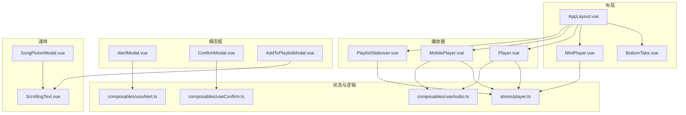
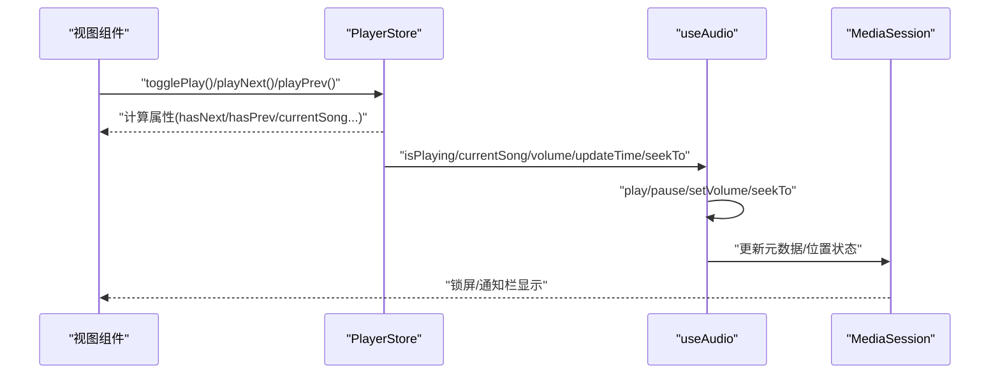
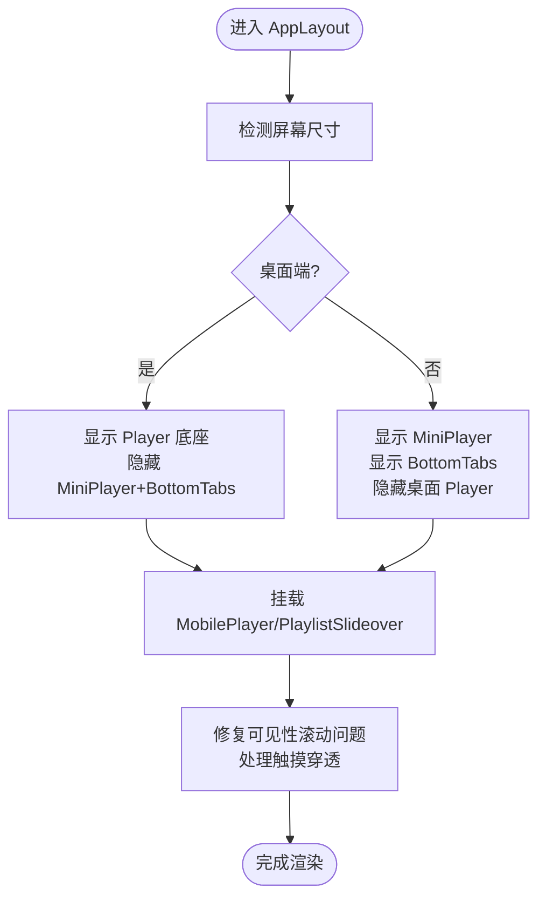
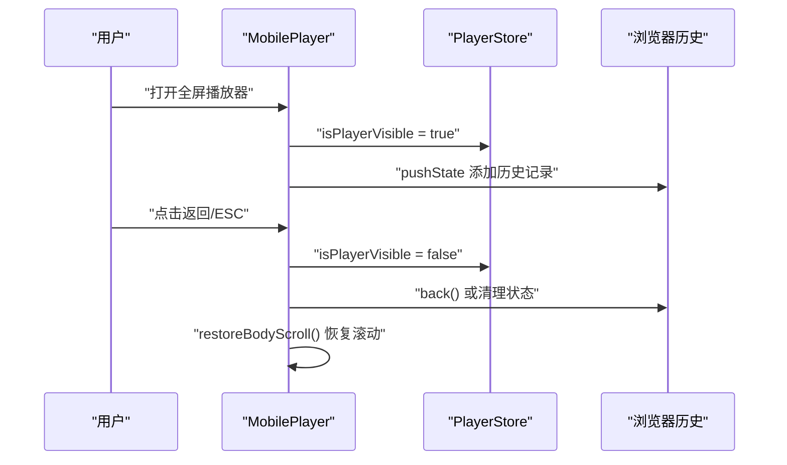
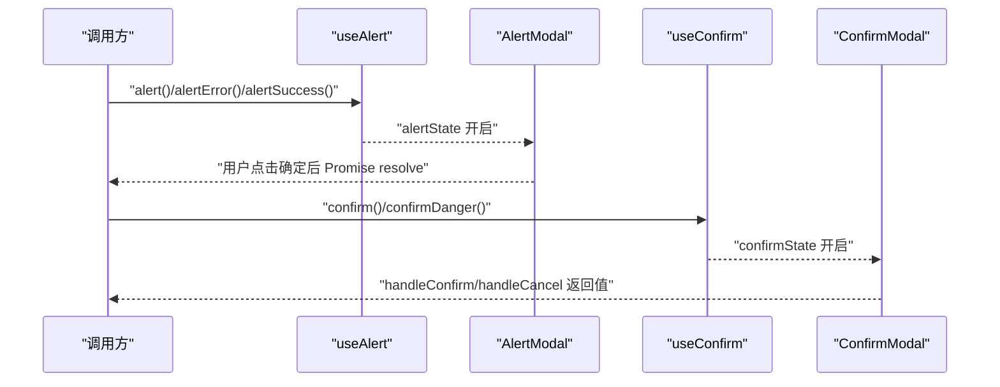
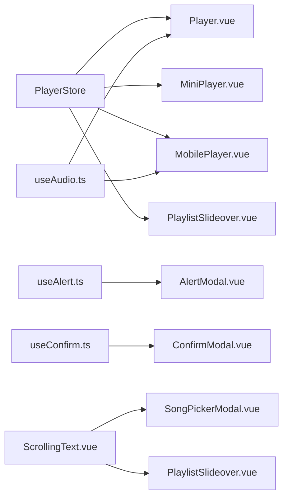

# UI 组件设计

<cite>
**本文引用的文件**
- [AppLayout.vue](file://web/src/layouts/AppLayout.vue)
- [BottomTabs.vue](file://web/src/components/layout/BottomTabs.vue)
- [MiniPlayer.vue](file://web/src/components/layout/MiniPlayer.vue)
- [Player.vue](file://web/src/components/player/Player.vue)
- [MobilePlayer.vue](file://web/src/components/player/MobilePlayer.vue)
- [PlaylistSlideover.vue](file://web/src/components/player/PlaylistSlideover.vue)
- [AlertModal.vue](file://web/src/components/AlertModal.vue)
- [ConfirmModal.vue](file://web/src/components/ConfirmModal.vue)
- [AddToPlaylistModal.vue](file://web/src/components/AddToPlaylistModal.vue)
- [ScrollingText.vue](file://web/src/components/ScrollingText.vue)
- [SongPickerModal.vue](file://web/src/components/SongPickerModal.vue)
- [player.ts](file://web/src/stores/player.ts)
- [useAudio.ts](file://web/src/composables/useAudio.ts)
- [useAlert.ts](file://web/src/composables/useAlert.ts)
- [useConfirm.ts](file://web/src/composables/useConfirm.ts)
</cite>

## 目录
1. [简介](#简介)
2. [项目结构](#项目结构)
3. [核心组件](#核心组件)
4. [架构总览](#架构总览)
5. [组件详解](#组件详解)
6. [依赖关系分析](#依赖关系分析)
7. [性能考量](#性能考量)
8. [故障排查指南](#故障排查指南)
9. [结论](#结论)
10. [附录](#附录)

## 简介
本设计文档聚焦 MiMusic Web 前端 UI 组件体系，围绕布局组件（AppLayout、BottomTabs、MiniPlayer）、播放器组件（Player、MobilePlayer、PlaylistSlideover）、模态框组件系统（AlertModal、ConfirmModal、AddToPlaylistModal）以及滚动文本与歌曲选择器组件进行深入解析。文档同时阐述响应式设计策略、组件 API、事件与样式定制、使用示例与最佳实践，帮助开发者快速理解与扩展 UI 组件。

## 项目结构
前端采用基于 Vue 3 + Vite 的单页应用，UI 组件主要位于 web/src/components 下，布局组件位于 web/src/layouts，状态管理使用 Pinia（stores），可组合逻辑通过 composables 提供。

图表来源
- [AppLayout.vue:1-212](file://web/src/layouts/AppLayout.vue#L1-L212)
- [BottomTabs.vue:1-39](file://web/src/components/layout/BottomTabs.vue#L1-L39)
- [MiniPlayer.vue:1-118](file://web/src/components/layout/MiniPlayer.vue#L1-L118)
- [Player.vue:1-328](file://web/src/components/player/Player.vue#L1-L328)
- [MobilePlayer.vue:1-460](file://web/src/components/player/MobilePlayer.vue#L1-L460)
- [PlaylistSlideover.vue:1-158](file://web/src/components/player/PlaylistSlideover.vue#L1-L158)
- [AlertModal.vue:1-70](file://web/src/components/AlertModal.vue#L1-L70)
- [ConfirmModal.vue:1-71](file://web/src/components/ConfirmModal.vue#L1-L71)
- [AddToPlaylistModal.vue:1-211](file://web/src/components/AddToPlaylistModal.vue#L1-L211)
- [ScrollingText.vue:1-201](file://web/src/components/ScrollingText.vue#L1-L201)
- [SongPickerModal.vue:1-253](file://web/src/components/SongPickerModal.vue#L1-L253)
- [player.ts:1-302](file://web/src/stores/player.ts#L1-L302)
- [useAudio.ts:1-418](file://web/src/composables/useAudio.ts#L1-L418)
- [useAlert.ts:1-113](file://web/src/composables/useAlert.ts#L1-L113)
- [useConfirm.ts:1-103](file://web/src/composables/useConfirm.ts#L1-L103)

章节来源
- [AppLayout.vue:1-212](file://web/src/layouts/AppLayout.vue#L1-L212)

## 核心组件
- AppLayout：全局布局容器，负责顶部导航、主内容区、桌面端底座播放器、移动端迷你播放器与底部标签、移动端全屏播放器、播放列表侧边栏的编排与响应式适配。
- BottomTabs：移动端底部导航栏，提供路由跳转与激活态视觉反馈。
- MiniPlayer：移动端迷你播放器，展示当前歌曲、播放控制、播放列表徽标与进度条。
- Player：桌面端底座播放器，提供完整播放控制、音量、播放模式、收藏、进度条点击跳转。
- MobilePlayer：移动端全屏播放器，提供封面、歌词面板、进度条、播放控制、播放模式与音量调节。
- PlaylistSlideover：播放列表侧边栏，支持播放指定曲目、移除、清空、移动端返回拦截。
- AlertModal/ConfirmModal：全局提示与确认对话框，统一错误/成功/警告/信息与确认流程。
- AddToPlaylistModal：添加歌曲到歌单的模态框，支持创建新歌单与批量添加。
- ScrollingText：自适应溢出滚动文本组件，支持速度、悬停暂停、渐隐边界。
- SongPickerModal：歌曲选择器，支持搜索、全选、分页加载、排除已存在歌曲。

章节来源
- [AppLayout.vue:1-212](file://web/src/layouts/AppLayout.vue#L1-L212)
- [BottomTabs.vue:1-39](file://web/src/components/layout/BottomTabs.vue#L1-L39)
- [MiniPlayer.vue:1-118](file://web/src/components/layout/MiniPlayer.vue#L1-L118)
- [Player.vue:1-328](file://web/src/components/player/Player.vue#L1-L328)
- [MobilePlayer.vue:1-460](file://web/src/components/player/MobilePlayer.vue#L1-L460)
- [PlaylistSlideover.vue:1-158](file://web/src/components/player/PlaylistSlideover.vue#L1-L158)
- [AlertModal.vue:1-70](file://web/src/components/AlertModal.vue#L1-L70)
- [ConfirmModal.vue:1-71](file://web/src/components/ConfirmModal.vue#L1-L71)
- [AddToPlaylistModal.vue:1-211](file://web/src/components/AddToPlaylistModal.vue#L1-L211)
- [ScrollingText.vue:1-201](file://web/src/components/ScrollingText.vue#L1-L201)
- [SongPickerModal.vue:1-253](file://web/src/components/SongPickerModal.vue#L1-L253)

## 架构总览
整体采用“布局容器 + 组件 + 状态/逻辑”的分层设计：
- 布局层：AppLayout 统一挂载各子组件，按断点切换桌面/移动端 UI。
- 组件层：播放器、导航、模态框、通用组件职责清晰，复用性强。
- 状态层：PlayerStore 管理播放状态、播放列表、播放模式、UI 状态；useAudio 将播放器与原生 Audio/MediaSession 对接。
- 交互层：useAlert/useConfirm 提供全局对话框能力，统一错误与确认流程。

图表来源
- [player.ts:1-302](file://web/src/stores/player.ts#L1-L302)
- [useAudio.ts:1-418](file://web/src/composables/useAudio.ts#L1-L418)

## 组件详解

### AppLayout 布局容器
- 职责：顶部导航（标题、菜单、主题切换）、主内容区、桌面端底座播放器、移动端迷你播放器+底部标签、移动端全屏播放器、播放列表侧边栏。
- 响应式：使用断点隐藏/显示对应组件；底部留白适配安全区域。
- 交互：修复移动端恢复可见性导致的滚动异常；处理触摸穿透，保证主内容可滚动。

图表来源
- [AppLayout.vue:1-212](file://web/src/layouts/AppLayout.vue#L1-L212)

章节来源
- [AppLayout.vue:1-212](file://web/src/layouts/AppLayout.vue#L1-L212)

### BottomTabs 底部导航
- 属性：items 数组，包含 label、icon、to、active 字段。
- 行为：基于路由链接高亮当前页，支持 hover/active 视觉反馈，适配安全区域底部内边距。

章节来源
- [BottomTabs.vue:1-39](file://web/src/components/layout/BottomTabs.vue#L1-L39)

### MiniPlayer 迷你播放器
- 数据：从 PlayerStore 计算 currentSong、isPlaying、playlist、hasNext、progressPercent。
- 交互：点击容器跳转至全屏播放器；播放/暂停、下一首、打开播放列表侧边栏；底部进度条。
- 样式：相对定位支撑进度条绝对定位。

章节来源
- [MiniPlayer.vue:1-118](file://web/src/components/layout/MiniPlayer.vue#L1-L118)
- [player.ts:1-302](file://web/src/stores/player.ts#L1-L302)

### Player 桌面端底座播放器
- 功能：封面、标题/艺术家、收藏、上一首/播放/下一首、播放模式、音量（桌面端）、播放列表徽标、进度条点击跳转、时间显示。
- 状态：playMode、volume、isMuted、favorite 状态；根据歌曲类型区分收藏接口。
- 事件：进度条点击计算百分比并调用 seekTo 与 store.seekTo。

章节来源
- [Player.vue:1-328](file://web/src/components/player/Player.vue#L1-L328)
- [player.ts:1-302](file://web/src/stores/player.ts#L1-L302)
- [useAudio.ts:1-418](file://web/src/composables/useAudio.ts#L1-L418)

### MobilePlayer 移动端全屏播放器
- 结构：顶部操作栏（音量、播放模式、关闭）、封面与歌曲信息、歌词面板（淡入淡出）、进度条、控制按钮、播放列表徽标。
- 行为：全屏 Modal，支持键盘 Esc 关闭歌词、浏览器返回拦截（history 状态 guard）、恢复 body 滚动。
- 交互：音量滑块（垂直）、播放模式下拉菜单、封面点击切换歌词、进度条点击跳转。

图表来源
- [MobilePlayer.vue:1-460](file://web/src/components/player/MobilePlayer.vue#L1-L460)
- [player.ts:1-302](file://web/src/stores/player.ts#L1-L302)

章节来源
- [MobilePlayer.vue:1-460](file://web/src/components/player/MobilePlayer.vue#L1-L460)

### PlaylistSlideover 播放列表侧边栏
- 功能：展示播放列表、当前播放高亮、序号/播放中动画、逐项播放、移除、清空。
- 行为：监听 showPlaylistSlideover，打开时 pushState，拦截返回事件关闭侧边栏；关闭时清理历史状态。

章节来源
- [PlaylistSlideover.vue:1-158](file://web/src/components/player/PlaylistSlideover.vue#L1-L158)
- [player.ts:1-302](file://web/src/stores/player.ts#L1-L302)

### 模态框组件系统
- AlertModal：基于 useAlert 全局状态，按 type 映射颜色与图标，用户点击“确定”关闭。
- ConfirmModal：基于 useConfirm 全局状态，按 type 映射按钮颜色与图标，提供确认/取消回调。
- AddToPlaylistModal：加载歌单列表，支持创建新歌单并添加、批量添加歌曲（静默跳过已存在），成功后触发事件。

图表来源
- [AlertModal.vue:1-70](file://web/src/components/AlertModal.vue#L1-L70)
- [ConfirmModal.vue:1-71](file://web/src/components/ConfirmModal.vue#L1-L71)
- [useAlert.ts:1-113](file://web/src/composables/useAlert.ts#L1-L113)
- [useConfirm.ts:1-103](file://web/src/composables/useConfirm.ts#L1-L103)

章节来源
- [AlertModal.vue:1-70](file://web/src/components/AlertModal.vue#L1-L70)
- [ConfirmModal.vue:1-71](file://web/src/components/ConfirmModal.vue#L1-L71)
- [AddToPlaylistModal.vue:1-211](file://web/src/components/AddToPlaylistModal.vue#L1-L211)
- [useAlert.ts:1-113](file://web/src/composables/useAlert.ts#L1-L113)
- [useConfirm.ts:1-103](file://web/src/composables/useConfirm.ts#L1-L103)

### 滚动文本组件 ScrollingText
- 属性：text、speed（px/s）、pauseOnHover、fadeWidth。
- 行为：检测溢出后启用无缝滚动，复制内容形成循环；支持鼠标悬停暂停；动态注入关键帧样式与淡入淡出遮罩；ResizeObserver 监听容器变化。
- 性能：使用 will-change 与 RAF 触发重绘，避免阻塞主线程。

章节来源
- [ScrollingText.vue:1-201](file://web/src/components/ScrollingText.vue#L1-L201)

### 歌曲选择器 SongPickerModal
- 功能：搜索歌曲、全选/反选、分页加载、排除已存在歌曲、格式化时长、确认回调。
- 交互：输入回车触发搜索；加载更多；确认后发射选中歌曲 ID 数组。

章节来源
- [SongPickerModal.vue:1-253](file://web/src/components/SongPickerModal.vue#L1-L253)
- [ScrollingText.vue:1-201](file://web/src/components/ScrollingText.vue#L1-L201)

## 依赖关系分析
- 组件耦合：播放器系列组件强依赖 PlayerStore；MobilePlayer/MiniPlayer/Player 通过 store 控制播放行为；useAudio 将 store 与原生 Audio/MediaSession 对接。
- 状态持久化：PlayerStore 使用 Pinia 持久化到 localStorage，保障刷新后状态恢复。
- 交互一致性：Alert/Confirm 通过全局 composable 提供一致的对话框体验。

图表来源
- [player.ts:1-302](file://web/src/stores/player.ts#L1-L302)
- [useAudio.ts:1-418](file://web/src/composables/useAudio.ts#L1-L418)
- [useAlert.ts:1-113](file://web/src/composables/useAlert.ts#L1-L113)
- [useConfirm.ts:1-103](file://web/src/composables/useConfirm.ts#L1-L103)
- [Player.vue:1-328](file://web/src/components/player/Player.vue#L1-L328)
- [MiniPlayer.vue:1-118](file://web/src/components/layout/MiniPlayer.vue#L1-L118)
- [MobilePlayer.vue:1-460](file://web/src/components/player/MobilePlayer.vue#L1-L460)
- [PlaylistSlideover.vue:1-158](file://web/src/components/player/PlaylistSlideover.vue#L1-L158)
- [AlertModal.vue:1-70](file://web/src/components/AlertModal.vue#L1-L70)
- [ConfirmModal.vue:1-71](file://web/src/components/ConfirmModal.vue#L1-L71)
- [ScrollingText.vue:1-201](file://web/src/components/ScrollingText.vue#L1-L201)
- [SongPickerModal.vue:1-253](file://web/src/components/SongPickerModal.vue#L1-L253)

章节来源
- [player.ts:1-302](file://web/src/stores/player.ts#L1-L302)
- [useAudio.ts:1-418](file://web/src/composables/useAudio.ts#L1-L418)

## 性能考量
- 播放器渲染：桌面端 Player 使用固定定位，移动端 MiniPlayer/Slideover 采用相对定位与绝对定位叠加，减少重排。
- 滚动优化：主内容区启用硬件加速滚动与 touch-action 限制，避免触摸穿透；修复可见性恢复后的滚动异常。
- 动画与样式：ScrollingText 注入关键帧样式，使用 will-change；歌词面板使用过渡动画，避免强制同步布局。
- 状态持久化：播放器状态持久化，减少初始化成本；useAudio 仅在必要时更新 src/load，避免重复加载。
- 网络与重试：useAudio 对 stalled/网络错误进行节流重试，避免卡顿与死循环。

[本节为通用指导，无需列出具体文件]

## 故障排查指南
- 播放器无法播放
  - 检查自动播放策略与用户交互要求；查看控制台是否有自动播放被阻止日志。
  - 确认 getAudioUrl 生成的 URL 正确，本地歌曲需携带访问令牌。
- 进度跳转无效
  - 确认 handleProgressClick 计算百分比与 seekTo 调用链路；检查 store.currentTime 与 audio.currentTime 的差异阈值。
- 移动端返回/ESC 无法关闭全屏播放器
  - 检查 history 状态 guard 逻辑与 restoreBodyScroll 调用时机。
- 歌词面板无法切换
  - 确认 toggleLyrics 状态切换与点击事件冒泡处理。
- 模态框无法关闭
  - 检查双向绑定 open 与关闭事件回调；Alert/Confirm 需要显式 close/confirm/cancel。

章节来源
- [useAudio.ts:1-418](file://web/src/composables/useAudio.ts#L1-L418)
- [MobilePlayer.vue:1-460](file://web/src/components/player/MobilePlayer.vue#L1-L460)
- [Player.vue:1-328](file://web/src/components/player/Player.vue#L1-L328)
- [AlertModal.vue:1-70](file://web/src/components/AlertModal.vue#L1-L70)
- [ConfirmModal.vue:1-71](file://web/src/components/ConfirmModal.vue#L1-L71)

## 结论
MiMusic UI 组件体系以 AppLayout 为核心布局容器，围绕播放器组件群构建完整的桌面/移动端播放体验；通过 PlayerStore 与 useAudio 实现状态与底层播放能力的解耦；模态框组件系统提供一致的全局交互体验；ScrollingText 与 SongPickerModal 提升信息密度与可用性。整体设计强调响应式适配、可维护性与用户体验，适合在多端场景稳定演进。

[本节为总结，无需列出具体文件]

## 附录

### 响应式设计策略
- 断点策略：桌面端（≥1024px）显示底座 Player；移动端（<1024px）显示 MiniPlayer 与 BottomTabs。
- 安全区域：底部导航与全屏播放器底部均使用 env(safe-area-inset-bottom) 适配刘海屏。
- 滚动与触摸：主内容区开启硬件加速滚动，限制 touch-action，避免与播放器手势冲突；修复页面可见性恢复后的滚动异常。

章节来源
- [AppLayout.vue:1-212](file://web/src/layouts/AppLayout.vue#L1-L212)
- [BottomTabs.vue:1-39](file://web/src/components/layout/BottomTabs.vue#L1-L39)
- [MobilePlayer.vue:1-460](file://web/src/components/player/MobilePlayer.vue#L1-L460)

### 组件 API 文档（概要）
- AppLayout
  - 插槽：title、right
  - 子组件：Player、MiniPlayer、BottomTabs、MobilePlayer、PlaylistSlideover
- BottomTabs
  - 属性：items: Array<{label, icon, to, active}>
- MiniPlayer
  - 事件：点击容器触发显示全屏播放器
  - 依赖：PlayerStore 计算属性 currentSong/isPlaying/playlist/hasNext
- Player
  - 事件：上一首/播放/下一首/切换收藏/切换播放模式/音量变更/进度条点击
  - 依赖：PlayerStore、useAudio、FavoriteStore
- MobilePlayer
  - 事件：音量滑块/静音/播放模式/封面点击歌词/进度条点击/关闭
  - 依赖：PlayerStore、FavoriteStore、useAudio
- PlaylistSlideover
  - 事件：播放指定索引/移除/清空
  - 依赖：PlayerStore
- AlertModal
  - 属性：title、message、type
  - 依赖：useAlert
- ConfirmModal
  - 属性：title、message、type、confirmText、cancelText
  - 依赖：useConfirm
- AddToPlaylistModal
  - 属性：open、songIds
  - 事件：update:open、success
  - 依赖：API playlists/songs
- ScrollingText
  - 属性：text、speed、pauseOnHover、fadeWidth
- SongPickerModal
  - 属性：open、excludeIds
  - 事件：update:open、confirm

章节来源
- [AppLayout.vue:1-212](file://web/src/layouts/AppLayout.vue#L1-L212)
- [BottomTabs.vue:1-39](file://web/src/components/layout/BottomTabs.vue#L1-L39)
- [MiniPlayer.vue:1-118](file://web/src/components/layout/MiniPlayer.vue#L1-L118)
- [Player.vue:1-328](file://web/src/components/player/Player.vue#L1-L328)
- [MobilePlayer.vue:1-460](file://web/src/components/player/MobilePlayer.vue#L1-L460)
- [PlaylistSlideover.vue:1-158](file://web/src/components/player/PlaylistSlideover.vue#L1-L158)
- [AlertModal.vue:1-70](file://web/src/components/AlertModal.vue#L1-L70)
- [ConfirmModal.vue:1-71](file://web/src/components/ConfirmModal.vue#L1-L71)
- [AddToPlaylistModal.vue:1-211](file://web/src/components/AddToPlaylistModal.vue#L1-L211)
- [ScrollingText.vue:1-201](file://web/src/components/ScrollingText.vue#L1-L201)
- [SongPickerModal.vue:1-253](file://web/src/components/SongPickerModal.vue#L1-L253)

### 使用示例与最佳实践
- 在 AppLayout 中引入播放器组件并按断点显示，确保底部留白适配安全区域。
- 使用 PlayerStore 的 playSong/addToPlaylist/togglePlay 等方法驱动播放器状态，避免直接操作 DOM。
- 使用 useAlert/useConfirm 统一处理错误与确认流程，避免分散的弹窗逻辑。
- 在移动端全屏播放器中，注意历史状态管理与 body 滚动恢复，防止页面“卡住”。
- 对于长标题/歌词，优先使用 ScrollingText 保证可读性；在 SongPickerModal 中结合排除逻辑避免重复添加。

[本节为通用指导，无需列出具体文件]