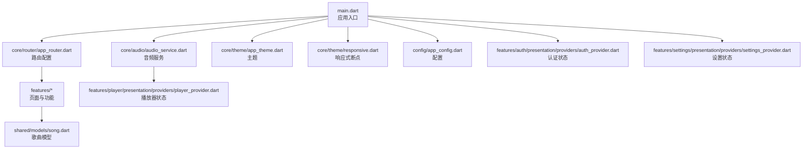
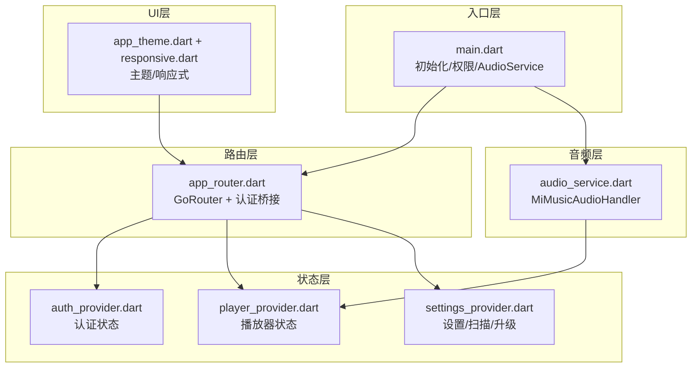
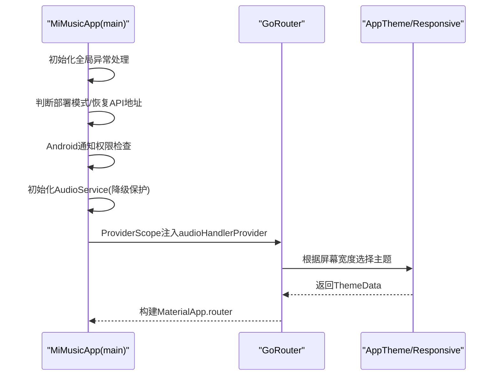
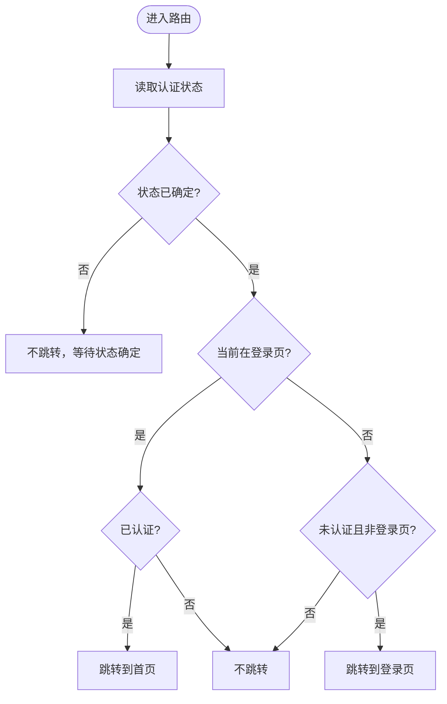
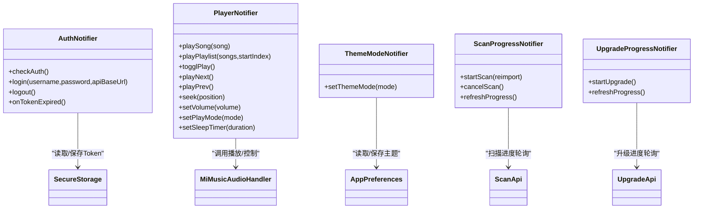
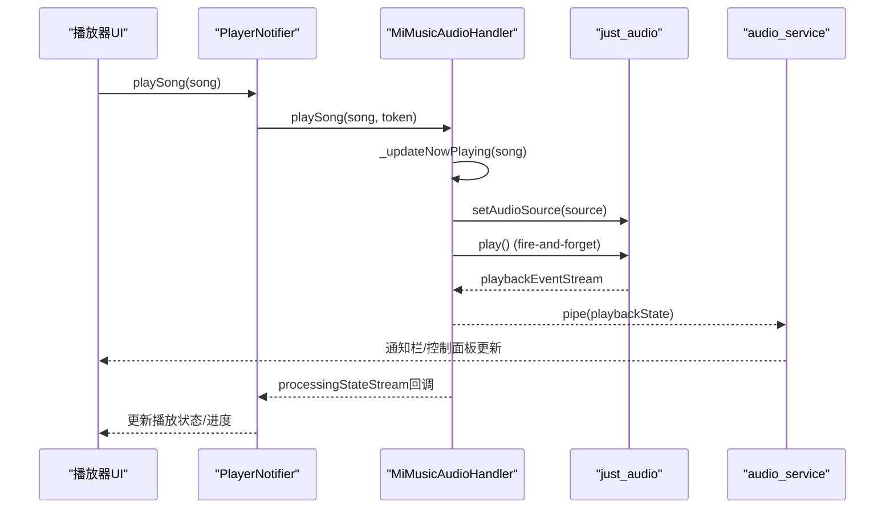
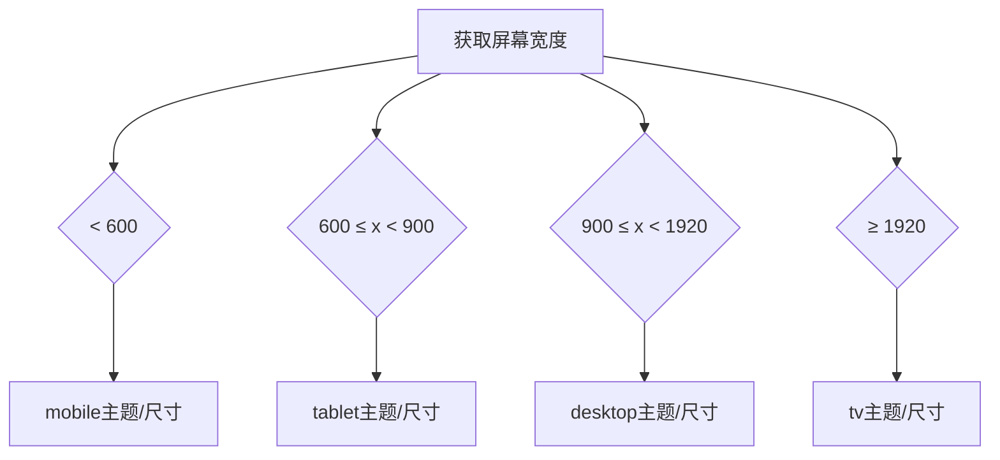
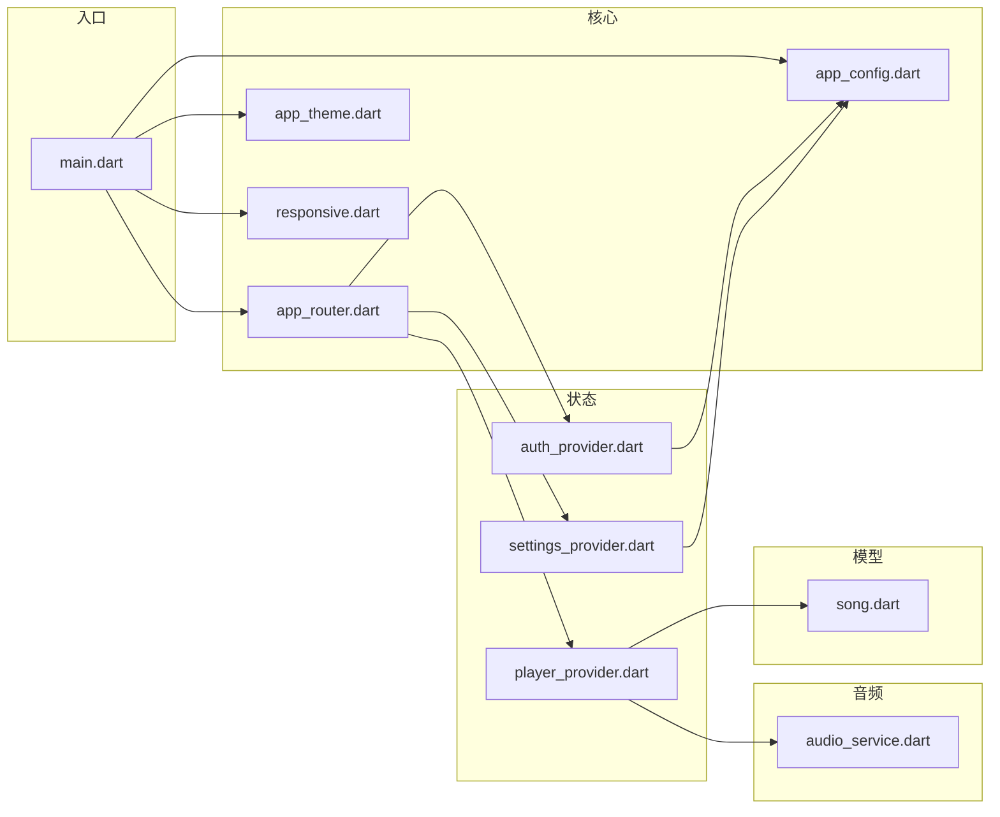

# 前端系统设计

<cite>
**本文引用的文件**
- [main.dart](file://frontend/lib/main.dart)
- [pubspec.yaml](file://frontend/pubspec.yaml)
- [app_config.dart](file://frontend/lib/config/app_config.dart)
- [audio_service.dart](file://frontend/lib/core/audio/audio_service.dart)
- [app_router.dart](file://frontend/lib/core/router/app_router.dart)
- [app_theme.dart](file://frontend/lib/core/theme/app_theme.dart)
- [responsive.dart](file://frontend/lib/core/theme/responsive.dart)
- [player_provider.dart](file://frontend/lib/features/player/presentation/providers/player_provider.dart)
- [auth_provider.dart](file://frontend/lib/features/auth/presentation/providers/auth_provider.dart)
- [settings_provider.dart](file://frontend/lib/features/settings/presentation/providers/settings_provider.dart)
- [song.dart](file://frontend/lib/shared/models/song.dart)
</cite>

## 更新摘要
**所做更改**
- 更新项目结构部分，移除Vue.js相关内容，反映Flutter单一前端架构
- 更新多平台适配策略，移除Web平台特定实现说明
- 更新依赖关系分析，移除Vue.js相关依赖
- 更新章节来源，确保所有引用文件均为当前存在的Flutter代码

## 目录
1. [简介](#简介)
2. [项目结构](#项目结构)
3. [核心组件](#核心组件)
4. [架构总览](#架构总览)
5. [详细组件分析](#详细组件分析)
6. [依赖关系分析](#依赖关系分析)
7. [性能考虑](#性能考虑)
8. [故障排除指南](#故障排除指南)
9. [结论](#结论)
10. [附录](#附录)

## 简介
本设计文档面向 MiMusic Flutter 前端系统，聚焦于跨平台架构、应用入口与路由、状态管理（Riverpod）、音频播放系统（audio_service + just_audio）、UI 组件与响应式设计、以及多平台适配策略。文档旨在帮助开发者理解系统设计思路、关键实现细节与最佳实践，并提供组件使用与自定义指南。

**更新** 移除了原有的Vue.js Web前端相关内容，现系统采用纯Flutter单一前端架构，支持Android、iOS、桌面端（Windows、macOS、Linux）和Web平台的统一实现。

## 项目结构
前端工程位于 frontend 目录，采用按功能域划分的模块化组织方式：
- config：全局配置（如 API 基础地址、部署模式）
- core：核心能力（音频服务、网络、路由、主题、存储、工具）
- features：业务功能（认证、首页、音乐库、歌单、播放器、设置）
- shared：共享模型与通用 UI 组件
- main.dart：应用入口，负责初始化、权限与音频服务、Provider 注入与主题响应式

**图表来源**
- [main.dart:23-108](file://frontend/lib/main.dart#L23-L108)
- [app_router.dart:38-170](file://frontend/lib/core/router/app_router.dart#L38-L170)
- [audio_service.dart:16-55](file://frontend/lib/core/audio/audio_service.dart#L16-L55)
- [app_theme.dart:1-117](file://frontend/lib/core/theme/app_theme.dart#L1-L117)
- [responsive.dart:1-82](file://frontend/lib/core/theme/responsive.dart#L1-L82)
- [app_config.dart:1-20](file://frontend/lib/config/app_config.dart#L1-L20)
- [player_provider.dart:18-57](file://frontend/lib/features/player/presentation/providers/player_provider.dart#L18-L57)
- [auth_provider.dart:35-70](file://frontend/lib/features/auth/presentation/providers/auth_provider.dart#L35-L70)
- [settings_provider.dart:68-101](file://frontend/lib/features/settings/presentation/providers/settings_provider.dart#L68-L101)
- [song.dart:1-172](file://frontend/lib/shared/models/song.dart#L1-L172)

**章节来源**
- [main.dart:1-147](file://frontend/lib/main.dart#L1-L147)
- [pubspec.yaml:1-60](file://frontend/pubspec.yaml#L1-L60)

## 核心组件
- 应用入口与初始化：全局异常处理、嵌入/独立部署模式、Android 通知权限、AudioService 初始化与降级保护、Provider 注入与响应式主题
- 路由系统：GoRouter + Riverpod 认证状态桥接，ShellRoute 包裹主布局，登录/插件 WebView 独立路由
- 状态管理：Riverpod Notifier/Provider 管理认证、播放器、设置、扫描/升级进度等状态
- 音频系统：MiMusicAudioHandler 集成 audio_service 与 just_audio，统一事件转换、通知栏元数据、播放源构建
- UI 与响应式：Material3 主题、响应式断点与尺寸、布局组件与播放器组件族
- 数据模型：Song 及其序列化/反序列化、播放列表与进度计算

**章节来源**
- [main.dart:23-108](file://frontend/lib/main.dart#L23-L108)
- [app_router.dart:38-170](file://frontend/lib/core/router/app_router.dart#L38-L170)
- [player_provider.dart:18-57](file://frontend/lib/features/player/presentation/providers/player_provider.dart#L18-L57)
- [auth_provider.dart:35-70](file://frontend/lib/features/auth/presentation/providers/auth_provider.dart#L35-L70)
- [settings_provider.dart:68-101](file://frontend/lib/features/settings/presentation/providers/settings_provider.dart#L68-L101)
- [audio_service.dart:16-55](file://frontend/lib/core/audio/audio_service.dart#L16-L55)
- [app_theme.dart:1-117](file://frontend/lib/core/theme/app_theme.dart#L1-L117)
- [responsive.dart:1-82](file://frontend/lib/core/theme/responsive.dart#L1-L82)
- [song.dart:1-172](file://frontend/lib/shared/models/song.dart#L1-L172)

## 架构总览
系统采用"入口初始化 + 路由 + 状态管理 + 音频服务"的分层架构。入口负责平台差异与降级保护；路由根据认证状态动态跳转；状态管理以 Riverpod 为核心，围绕播放器、认证、设置等域进行解耦；音频服务通过 audio_service 与 just_audio 协作，提供跨平台通知栏控制与稳定播放体验。

**图表来源**
- [main.dart:23-108](file://frontend/lib/main.dart#L23-L108)
- [app_router.dart:38-170](file://frontend/lib/core/router/app_router.dart#L38-L170)
- [auth_provider.dart:35-70](file://frontend/lib/features/auth/presentation/providers/auth_provider.dart#L35-L70)
- [player_provider.dart:18-57](file://frontend/lib/features/player/presentation/providers/player_provider.dart#L18-L57)
- [settings_provider.dart:68-101](file://frontend/lib/features/settings/presentation/providers/settings_provider.dart#L68-L101)
- [audio_service.dart:16-55](file://frontend/lib/core/audio/audio_service.dart#L16-L55)
- [app_theme.dart:1-117](file://frontend/lib/core/theme/app_theme.dart#L1-L117)
- [responsive.dart:1-82](file://frontend/lib/core/theme/responsive.dart#L1-L82)

## 详细组件分析

### 应用入口与初始化
- 全局异常处理：注册 FlutterError.onError 与 PlatformDispatcher.onError，避免未捕获异常导致白屏
- 部署模式判断：嵌入模式（Flutter Web 嵌入 Go 后端）与独立部署模式（从本地存储恢复 API 地址）
- Android 通知权限：Android 13+ 运行时请求通知权限，支持永久拒绝提示
- AudioService 初始化：AudioService.init + 配置通知渠道，失败时降级为本地实例并等待初始化完成
- Provider 注入：将 MiMusicAudioHandler 注入到 Riverpod，供播放器状态使用
- 响应式主题：在 MaterialApp.router builder 中根据屏幕宽度动态选择主题与尺寸

**图表来源**
- [main.dart:23-108](file://frontend/lib/main.dart#L23-L108)
- [app_theme.dart:12-20](file://frontend/lib/core/theme/app_theme.dart#L12-L20)
- [responsive.dart:12-31](file://frontend/lib/core/theme/responsive.dart#L12-L31)

**章节来源**
- [main.dart:23-108](file://frontend/lib/main.dart#L23-L108)

### 路由配置与认证桥接
- 路由表：登录页、插件 WebView、主应用 ShellRoute（包含首页、音乐库、歌单、设置）
- 认证桥接：_AuthChangeNotifier 监听 authStateProvider，避免每次状态变化重建 GoRouter 实例
- 重定向逻辑：根据认证状态与目标路径决定跳转至登录页或首页
- 错误页：统一错误页面，提供返回首页按钮

**图表来源**
- [app_router.dart:49-74](file://frontend/lib/core/router/app_router.dart#L49-L74)

**章节来源**
- [app_router.dart:38-170](file://frontend/lib/core/router/app_router.dart#L38-L170)

### 状态管理策略（Riverpod）
- 认证状态：AuthNotifier 从安全存储检查 Token，提供登录/登出/过期处理
- 播放器状态：PlayerNotifier 管理播放列表、播放模式、进度、音量、睡眠定时器，桥接 AudioHandler 事件
- 设置状态：ThemeModeNotifier、ScanProgressNotifier、UpgradeProgressNotifier 管理主题、扫描与升级进度
- Provider 注入：入口将 MiMusicAudioHandler 注入到 audioHandlerProvider，供播放器状态使用

**图表来源**
- [auth_provider.dart:35-144](file://frontend/lib/features/auth/presentation/providers/auth_provider.dart#L35-L144)
- [player_provider.dart:23-677](file://frontend/lib/features/player/presentation/providers/player_provider.dart#L23-L677)
- [settings_provider.dart:68-273](file://frontend/lib/features/settings/presentation/providers/settings_provider.dart#L68-L273)

**章节来源**
- [auth_provider.dart:35-144](file://frontend/lib/features/auth/presentation/providers/auth_provider.dart#L35-L144)
- [player_provider.dart:23-677](file://frontend/lib/features/player/presentation/providers/player_provider.dart#L23-L677)
- [settings_provider.dart:68-273](file://frontend/lib/features/settings/presentation/providers/settings_provider.dart#L68-L273)

### 音频播放系统
- 音频处理器：MiMusicAudioHandler 集成 audio_service 与 just_audio，使用 .pipe() 将 playbackEventStream 直接映射到 playbackState，避免中间状态丢失
- 事件转换：_transformEvent 将 just_audio ProcessingState 映射为 audio_service 的 AudioProcessingState，生成 controls/systemActions
- 播放源构建：本地歌曲通过服务器 URL + access_token，网络歌曲通过代理 URL（Web 平台解决 CORS），iOS 使用 query 参数绕过自定义 Header 限制
- 通知栏元数据：_updateNowPlaying 构建 MediaItem（标题/艺人/专辑/封面/时长），支持运行时 updateDuration
- 控制接口：play/pause/stop/seek/skipToNext/skipToPrevious，回调桥接到播放器状态
- 资源管理：ensureInitialized 等待 AudioSession 配置完成，dispose 释放资源

**图表来源**
- [audio_service.dart:16-307](file://frontend/lib/core/audio/audio_service.dart#L16-L307)
- [player_provider.dart:608-649](file://frontend/lib/features/player/presentation/providers/player_provider.dart#L608-L649)

**章节来源**
- [audio_service.dart:16-307](file://frontend/lib/core/audio/audio_service.dart#L16-L307)
- [player_provider.dart:608-649](file://frontend/lib/features/player/presentation/providers/player_provider.dart#L608-L649)

### UI 组件设计与响应式
- 主题系统：基于 Material3，使用 indigo 作为 seed 色，区分亮/暗主题；支持 TV/桌面/平板/移动响应式尺寸与按钮大小
- 响应式断点：mobile/tablet/desktop/tv，提供扩展方法根据屏幕类型返回不同值
- 布局：ShellLayout 包裹主应用路由，底部导航与迷你播放器在移动端可见，桌面端使用底部播放器
- 组件族：播放器组件（桌面/移动/Tv）、歌词视图、播放列表抽屉、进度条、音量控制等

**图表来源**
- [responsive.dart:5-31](file://frontend/lib/core/theme/responsive.dart#L5-L31)
- [app_theme.dart:23-115](file://frontend/lib/core/theme/app_theme.dart#L23-L115)

**章节来源**
- [app_theme.dart:1-117](file://frontend/lib/core/theme/app_theme.dart#L1-L117)
- [responsive.dart:1-82](file://frontend/lib/core/theme/responsive.dart#L1-L82)

### 多平台适配策略
- Android：通知权限（Android 13+）、前台服务通知栏控制、音频会话配置
- iOS：AVPlayer 对自定义 Header 的限制，采用 URL query 参数传递 access_token
- Web：通过后端代理解决 CORS 限制，AudioSession 初始化降级处理
- 桌面端（macOS/Windows/Linux）：响应式布局与 TV 主题适配，键盘/遥控焦点管理（TV Grid View）

**更新** 移除了原有的Vue.js Web前端相关内容，现系统采用统一的Flutter架构，通过条件导出机制支持多平台编译。

**章节来源**
- [main.dart:49-63](file://frontend/lib/main.dart#L49-L63)
- [audio_service.dart:166-188](file://frontend/lib/core/audio/audio_service.dart#L166-L188)
- [audio_service.dart:63-71](file://frontend/lib/core/audio/audio_service.dart#L63-L71)

### 组件使用示例与自定义指南
- 播放单曲：调用播放器 Provider 的 playSong(song)，内部自动去重或追加到播放列表并播放
- 切换播放模式：setPlayMode(PlayMode.order/single/loop/random/singlePlay)
- 设置音量：setVolume(百分比)，支持静音切换与恢复
- 播放列表操作：addToPlaylist、insertToPlaylist、removeFromPlaylist、reorderPlaylist、clearPlaylist
- 睡眠定时器：setSleepTimer(duration) 与 cancelSleepTimer
- 登录流程：AuthNotifier.login(username, password, 可选 apiBaseUrl)，登录成功后自动更新主题与路由

**章节来源**
- [player_provider.dart:115-140](file://frontend/lib/features/player/presentation/providers/player_provider.dart#L115-L140)
- [player_provider.dart:318-321](file://frontend/lib/features/player/presentation/providers/player_provider.dart#L318-L321)
- [player_provider.dart:298-315](file://frontend/lib/features/player/presentation/providers/player_provider.dart#L298-L315)
- [player_provider.dart:171-204](file://frontend/lib/features/player/presentation/providers/player_provider.dart#L171-L204)
- [player_provider.dart:575-605](file://frontend/lib/features/player/presentation/providers/player_provider.dart#L575-L605)
- [auth_provider.dart:73-123](file://frontend/lib/features/auth/presentation/providers/auth_provider.dart#L73-L123)

## 依赖关系分析
- 核心依赖：flutter_riverpod、go_router、dio、just_audio、audio_service、audio_session、permission_handler、shared_preferences、flutter_secure_storage、cached_network_image、palette_generator、file_picker、intl、url_launcher、flutter_inappwebview
- 入口依赖：main.dart 依赖 AppConfig、AudioService、AppTheme、Responsive、AppRouter、Settings Provider
- 播放器依赖：PlayerNotifier 依赖 AudioHandler、SecureStorage、Playlist API、Song 模型
- 认证依赖：AuthNotifier 依赖 AuthApi、SecureStorage、AppPreferences
- 设置依赖：ThemeModeNotifier、ScanProgressNotifier、UpgradeProgressNotifier 依赖对应 API

**更新** 移除了Vue.js相关的依赖项，现系统完全基于Flutter生态。

**图表来源**
- [pubspec.yaml:11-42](file://frontend/pubspec.yaml#L11-L42)
- [main.dart:10-16](file://frontend/lib/main.dart#L10-L16)
- [app_router.dart:1-15](file://frontend/lib/core/router/app_router.dart#L1-L15)
- [auth_provider.dart:1-12](file://frontend/lib/features/auth/presentation/providers/auth_provider.dart#L1-L12)
- [player_provider.dart:1-16](file://frontend/lib/features/player/presentation/providers/player_provider.dart#L1-L16)
- [settings_provider.dart:1-12](file://frontend/lib/features/settings/presentation/providers/settings_provider.dart#L1-L12)
- [audio_service.dart:1-13](file://frontend/lib/core/audio/audio_service.dart#L1-L13)
- [song.dart:1-22](file://frontend/lib/shared/models/song.dart#L1-L22)

**章节来源**
- [pubspec.yaml:11-42](file://frontend/pubspec.yaml#L11-L42)

## 性能考虑
- 播放器后台加载：playPlaylistById 使用 _loadGeneration 防止竞态，分批加载（每批 100 首），指数退避重试，避免长时间阻塞 UI
- 音频事件管道：使用 .pipe() 直接映射 playbackEventStream，减少中间状态与同步开销
- 响应式主题：按屏幕类型选择尺寸与按钮大小，降低小屏设备上的布局抖动
- 资源释放：Provider dispose 中取消订阅与定时器，避免内存泄漏

**章节来源**
- [player_provider.dart:409-458](file://frontend/lib/features/player/presentation/providers/player_provider.dart#L409-L458)
- [player_provider.dart:462-552](file://frontend/lib/features/player/presentation/providers/player_provider.dart#L462-L552)
- [audio_service.dart:28-42](file://frontend/lib/core/audio/audio_service.dart#L28-L42)

## 故障排除指南
- 未捕获异常：入口已注册全局错误处理，建议结合日志定位具体异常来源
- Android 通知权限：若被永久拒绝，引导用户前往系统设置开启
- AudioService 初始化失败：入口已提供降级方案，确保播放器基础功能可用
- 播放失败：检查歌曲类型与 URL 构建逻辑（本地/网络/电台），确认 access_token 有效
- 登录失败：确认 apiBaseUrl 配置、网络连通性与后端认证接口返回

**章节来源**
- [main.dart:27-34](file://frontend/lib/main.dart#L27-L34)
- [main.dart:91-97](file://frontend/lib/main.dart#L91-L97)
- [audio_service.dart:156-214](file://frontend/lib/core/audio/audio_service.dart#L156-L214)
- [auth_provider.dart:118-123](file://frontend/lib/features/auth/presentation/providers/auth_provider.dart#L118-L123)

## 结论
MiMusic Flutter 前端以 Riverpod 为核心实现状态管理，结合 audio_service 与 just_audio 构建稳定可靠的音频播放体验；通过响应式主题与断点适配多端；入口层提供部署模式与平台差异处理，保障在 Android/iOS/Web/桌面端的一致体验。整体架构清晰、职责明确、易于扩展与维护。

**更新** 系统现已完全移除Vue.js Web前端，采用纯Flutter单一前端架构，提供更统一的开发体验和更好的性能表现。

## 附录
- 配置项：AppConfig.baseUrl、apiPrefix、connectTimeout/receiveTimeout、isEmbedded
- 模型：Song 及 SongListResponse，覆盖本地/远程/电台类型与元数据
- 依赖清单：pubspec.yaml 中列出的依赖与版本约束

**章节来源**
- [app_config.dart:8-19](file://frontend/lib/config/app_config.dart#L8-L19)
- [song.dart:1-172](file://frontend/lib/shared/models/song.dart#L1-L172)
- [pubspec.yaml:11-42](file://frontend/pubspec.yaml#L11-L42)