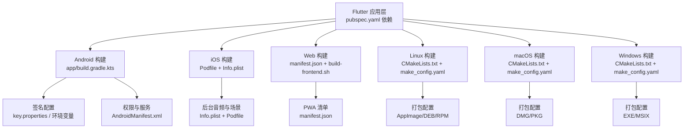
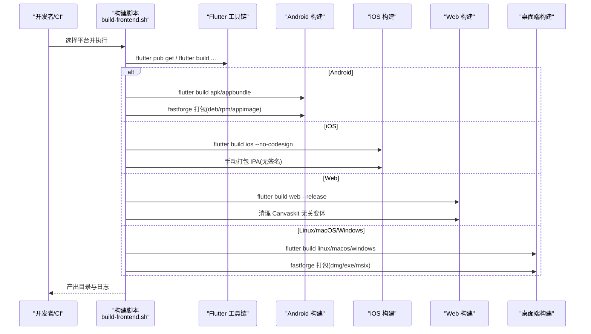
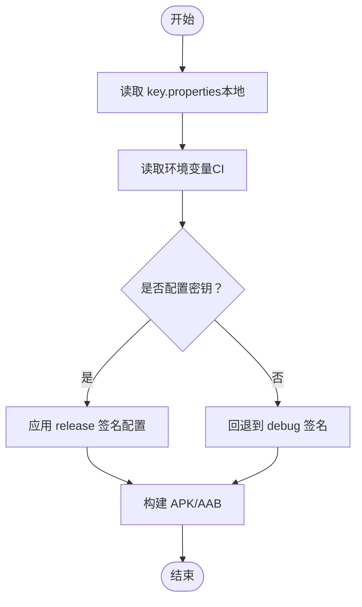
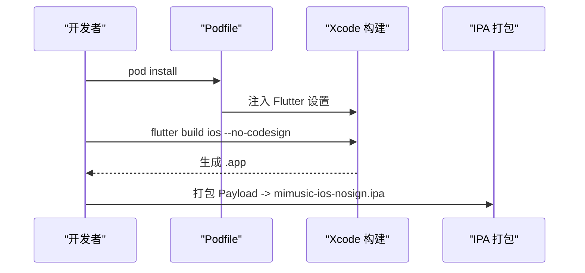
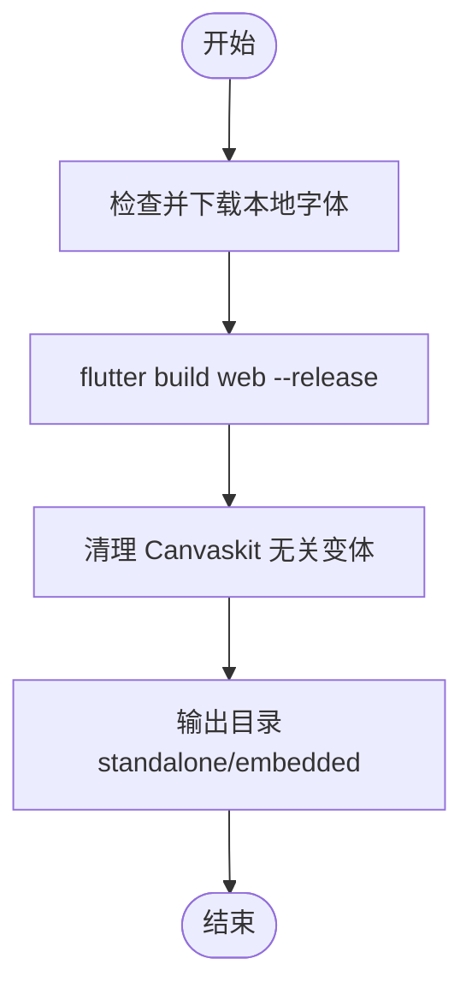
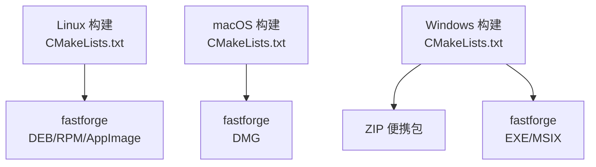
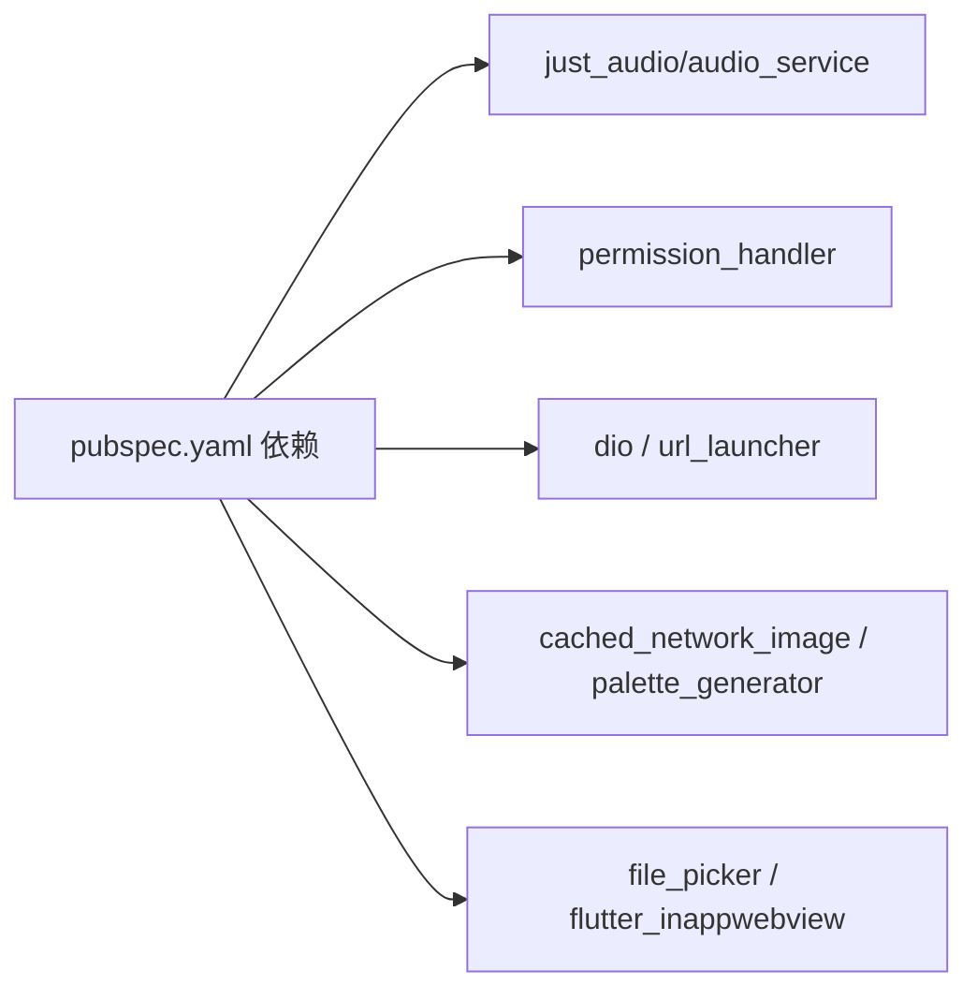

# 多平台适配

<cite>
**本文引用的文件**
- [frontend/android/build.gradle.kts](file://frontend/android/build.gradle.kts)
- [frontend/android/app/build.gradle.kts](file://frontend/android/app/build.gradle.kts)
- [frontend/android/gradle.properties](file://frontend/android/gradle.properties)
- [frontend/android/local.properties](file://frontend/android/local.properties)
- [frontend/android/app/src/main/AndroidManifest.xml](file://frontend/android/app/src/main/AndroidManifest.xml)
- [frontend/ios/Podfile](file://frontend/ios/Podfile)
- [frontend/ios/Runner/Info.plist](file://frontend/ios/Runner/Info.plist)
- [frontend/web/manifest.json](file://frontend/web/manifest.json)
- [frontend/linux/CMakeLists.txt](file://frontend/linux/CMakeLists.txt)
- [frontend/linux/packaging/appimage/make_config.yaml](file://frontend/linux/packaging/appimage/make_config.yaml)
- [frontend/macos/Runner/Info.plist](file://frontend/macos/Runner/Info.plist)
- [frontend/macos/packaging/dmg/make_config.yaml](file://frontend/macos/packaging/dmg/make_config.yaml)
- [frontend/windows/CMakeLists.txt](file://frontend/windows/CMakeLists.txt)
- [frontend/windows/packaging/exe/make_config.yaml](file://frontend/windows/packaging/exe/make_config.yaml)
- [frontend/pubspec.yaml](file://frontend/pubspec.yaml)
- [frontend/scripts/build-frontend.sh](file://frontend/scripts/build-frontend.sh)
</cite>

## 目录
1. [引言](#引言)
2. [项目结构](#项目结构)
3. [核心组件](#核心组件)
4. [架构总览](#架构总览)
5. [详细组件分析](#详细组件分析)
6. [依赖关系分析](#依赖关系分析)
7. [性能考量](#性能考量)
8. [故障排查指南](#故障排查指南)
9. [结论](#结论)
10. [附录](#附录)

## 引言
本设计文档面向 MiMusic 的多平台适配与交付，覆盖 Android、iOS、Web、Windows、macOS、Linux 六大平台。文档从构建配置、打包与发布策略、平台特性集成（通知栏、音频服务、文件系统、硬件控制）、跨平台兼容性处理（条件编译与平台特定代码组织）等方面进行系统化梳理，并提供可视化图示与实操建议，帮助开发者高效落地与维护。

## 项目结构
前端采用 Flutter 作为统一框架，平台差异通过各自工程与打包配置体现：
- Android：Gradle 工程、签名配置、权限声明、前台服务与媒体按钮广播接收器
- iOS：CocoaPods 依赖、Info.plist、后台音频模式、场景配置
- Web：PWA 清单与独立部署构建
- 桌面端（Linux/macOS/Windows）：CMake 构建与打包配置，以及各平台发行包配置

图表来源
- [frontend/pubspec.yaml:11-42](file://frontend/pubspec.yaml#L11-L42)
- [frontend/android/app/build.gradle.kts:32-70](file://frontend/android/app/build.gradle.kts#L32-L70)
- [frontend/android/app/src/main/AndroidManifest.xml:6-67](file://frontend/android/app/src/main/AndroidManifest.xml#L6-L67)
- [frontend/ios/Podfile:30-37](file://frontend/ios/Podfile#L30-L37)
- [frontend/ios/Runner/Info.plist:34-58](file://frontend/ios/Runner/Info.plist#L34-L58)
- [frontend/web/manifest.json:1-36](file://frontend/web/manifest.json#L1-L36)
- [frontend/linux/CMakeLists.txt:1-129](file://frontend/linux/CMakeLists.txt#L1-L129)
- [frontend/linux/packaging/appimage/make_config.yaml:1-13](file://frontend/linux/packaging/appimage/make_config.yaml#L1-L13)
- [frontend/macos/packaging/dmg/make_config.yaml:1-11](file://frontend/macos/packaging/dmg/make_config.yaml#L1-L11)
- [frontend/windows/packaging/exe/make_config.yaml:1-9](file://frontend/windows/packaging/exe/make_config.yaml#L1-L9)

章节来源
- [frontend/pubspec.yaml:1-60](file://frontend/pubspec.yaml#L1-L60)
- [frontend/scripts/build-frontend.sh:1-544](file://frontend/scripts/build-frontend.sh#L1-L544)

## 核心组件
- 构建与打包脚本：统一入口脚本负责按平台调用 Flutter 构建与第三方打包工具，集中输出产物并记录日志
- 平台构建配置：各平台独立的 Gradle/CMake/Podfile/Info.plist/manifest.json 等配置文件
- 依赖与能力：音频播放、权限、网络、WebView、状态管理等跨平台依赖在 pubspec.yaml 中声明

章节来源
- [frontend/scripts/build-frontend.sh:108-400](file://frontend/scripts/build-frontend.sh#L108-L400)
- [frontend/pubspec.yaml:11-42](file://frontend/pubspec.yaml#L11-L42)

## 架构总览
下图展示从源码到各平台产物的总体流程，包括本地构建与 CI 场景下的差异化配置（如 Android 签名的环境变量注入）。

图表来源
- [frontend/scripts/build-frontend.sh:108-400](file://frontend/scripts/build-frontend.sh#L108-L400)
- [frontend/android/app/build.gradle.kts:32-70](file://frontend/android/app/build.gradle.kts#L32-L70)

## 详细组件分析

### Android 平台适配
- Gradle 配置与签名
  - 顶层仓库与构建目录统一至根目录，子工程构建目录按项目名归档
  - 应用级签名配置优先使用环境变量（CI），其次使用本地 key.properties
  - release 类型使用 release 签名，否则回退到 debug
- 权限与前台服务
  - 声明网络、前台服务、唤醒锁、通知等权限
  - 注册音频服务与媒体按钮广播接收器，支持锁屏控制与通知栏控制
- 清单与 TV 支持
  - 支持 leanback 启动器与触摸屏可选
  - 网络明文流量与查询意图声明

图表来源
- [frontend/android/app/build.gradle.kts:11-70](file://frontend/android/app/build.gradle.kts#L11-L70)

章节来源
- [frontend/android/build.gradle.kts:1-25](file://frontend/android/build.gradle.kts#L1-L25)
- [frontend/android/app/build.gradle.kts:1-75](file://frontend/android/app/build.gradle.kts#L1-L75)
- [frontend/android/gradle.properties:1-3](file://frontend/android/gradle.properties#L1-L3)
- [frontend/android/local.properties:1-1](file://frontend/android/local.properties#L1-L1)
- [frontend/android/app/src/main/AndroidManifest.xml:1-80](file://frontend/android/app/src/main/AndroidManifest.xml#L1-L80)

### iOS 平台适配
- CocoaPods 与 Flutter 集成
  - 通过 podhelper 自动注入 Flutter 相关构建设置
  - 为 Runner 与 RunnerTests 目标安装依赖
- Info.plist 关键项
  - 后台音频模式开启，支持锁屏播放
  - 场景配置与最小系统版本声明
  - 禁止最小帧时长以提升动画体验
- 构建与打包
  - 使用 flutter build ios --no-codesign 生成 .app
  - 通过手动压缩 Payload 生成 IPA（无签名）

图表来源
- [frontend/ios/Podfile:13-44](file://frontend/ios/Podfile#L13-L44)
- [frontend/ios/Runner/Info.plist:34-77](file://frontend/ios/Runner/Info.plist#L34-L77)
- [frontend/scripts/build-frontend.sh:366-400](file://frontend/scripts/build-frontend.sh#L366-L400)

章节来源
- [frontend/ios/Podfile:1-44](file://frontend/ios/Podfile#L1-L44)
- [frontend/ios/Runner/Info.plist:1-80](file://frontend/ios/Runner/Info.plist#L1-L80)
- [frontend/scripts/build-frontend.sh:366-400](file://frontend/scripts/build-frontend.sh#L366-L400)

### Web 平台适配（PWA）
- PWA 清单
  - 声明名称、显示模式、主题色、图标集与用途（maskable）
- 构建流程
  - 使用 flutter build web --release 生成静态资源
  - 清理 Canvaskit 中未使用的渲染器变体，减小体积
  - 支持独立部署与嵌入式两种模式（通过 DEPLOY_MODE 区分）

图表来源
- [frontend/web/manifest.json:1-36](file://frontend/web/manifest.json#L1-L36)
- [frontend/scripts/build-frontend.sh:109-147](file://frontend/scripts/build-frontend.sh#L109-L147)

章节来源
- [frontend/web/manifest.json:1-36](file://frontend/web/manifest.json#L1-L36)
- [frontend/scripts/build-frontend.sh:109-147](file://frontend/scripts/build-frontend.sh#L109-L147)

### 桌面端适配（Linux/macOS/Windows）
- Linux
  - CMake 构建：定义二进制名、应用 ID、标准编译选项与安装规则
  - 打包：通过 fastforge 生成 DEB、RPM、AppImage；需 rpmbuild、appimagetool
- macOS
  - CMake 构建：与 Flutter 工具链集成，安装规则与资源复制
  - 打包：通过 fastforge 生成 DMG；需 appdmg
- Windows
  - CMake 构建：Unicode 宏、标准编译选项与安装规则
  - 打包：绿色便携 ZIP；fastforge 生成 EXE（需 Inno Setup）、MSIX

图表来源
- [frontend/linux/CMakeLists.txt:1-129](file://frontend/linux/CMakeLists.txt#L1-L129)
- [frontend/linux/packaging/appimage/make_config.yaml:1-13](file://frontend/linux/packaging/appimage/make_config.yaml#L1-L13)
- [frontend/macos/Runner/Info.plist:1-33](file://frontend/macos/Runner/Info.plist#L1-L33)
- [frontend/macos/packaging/dmg/make_config.yaml:1-11](file://frontend/macos/packaging/dmg/make_config.yaml#L1-L11)
- [frontend/windows/CMakeLists.txt:1-109](file://frontend/windows/CMakeLists.txt#L1-L109)
- [frontend/windows/packaging/exe/make_config.yaml:1-9](file://frontend/windows/packaging/exe/make_config.yaml#L1-L9)

章节来源
- [frontend/linux/CMakeLists.txt:1-129](file://frontend/linux/CMakeLists.txt#L1-L129)
- [frontend/linux/packaging/appimage/make_config.yaml:1-13](file://frontend/linux/packaging/appimage/make_config.yaml#L1-L13)
- [frontend/macos/Runner/Info.plist:1-33](file://frontend/macos/Runner/Info.plist#L1-L33)
- [frontend/macos/packaging/dmg/make_config.yaml:1-11](file://frontend/macos/packaging/dmg/make_config.yaml#L1-L11)
- [frontend/windows/CMakeLists.txt:1-109](file://frontend/windows/CMakeLists.txt#L1-L109)
- [frontend/windows/packaging/exe/make_config.yaml:1-9](file://frontend/windows/packaging/exe/make_config.yaml#L1-L9)

## 依赖关系分析
- 依赖来源：pubspec.yaml 统一声明 Flutter 生态与业务所需库（状态管理、路由、HTTP、音频、权限、存储、图片缓存、工具等）
- 平台差异：音频播放与后台服务在 Android 通过前台服务与广播接收器实现；iOS 通过 Info.plist 的后台模式；Web 通过浏览器能力；桌面端通过系统原生能力与打包工具

图表来源
- [frontend/pubspec.yaml:11-42](file://frontend/pubspec.yaml#L11-L42)

章节来源
- [frontend/pubspec.yaml:11-42](file://frontend/pubspec.yaml#L11-L42)

## 性能考量
- Web 构建优化：清理 Canvaskit 无关变体，降低包体大小
- 桌面端安装与运行：Linux 使用相对 RPATH 加载库；Windows/ macOS 安装路径与资源复制遵循标准规则
- Android 构建：启用 split-per-abi 生成多架构 APK，减少单包体积

章节来源
- [frontend/scripts/build-frontend.sh:136-143](file://frontend/scripts/build-frontend.sh#L136-L143)
- [frontend/linux/CMakeLists.txt:16-18](file://frontend/linux/CMakeLists.txt#L16-L18)
- [frontend/android/app/build.gradle.kts:346-361](file://frontend/android/app/build.gradle.kts#L346-L361)

## 故障排查指南
- Android 签名失败
  - 确认环境变量或 key.properties 是否正确配置
  - 若未配置，release 将回退到 debug 签名，导致无法上架
- iOS 构建报错
  - 确保已执行 flutter pub get 且 Podfile 正常
  - 无签名 IPA 可用于测试，上架需正式签名
- Web 构建体积过大
  - 检查是否下载并使用了本地字体
  - 确认已清理 Canvaskit 无关变体
- 桌面端打包缺失依赖
  - Linux：rpmbuild、appimagetool
  - Windows：Inno Setup（iscc）
  - macOS：appdmg
- 构建日志定位
  - 脚本在输出目录下生成 .build_logs，按平台查看对应日志文件

章节来源
- [frontend/scripts/build-frontend.sh:72-79](file://frontend/scripts/build-frontend.sh#L72-L79)
- [frontend/scripts/build-frontend.sh:161-219](file://frontend/scripts/build-frontend.sh#L161-L219)
- [frontend/scripts/build-frontend.sh:249-288](file://frontend/scripts/build-frontend.sh#L249-L288)
- [frontend/scripts/build-frontend.sh:312-333](file://frontend/scripts/build-frontend.sh#L312-L333)

## 结论
本设计文档基于现有配置与脚本，系统化梳理了 MiMusic 在 Android、iOS、Web、Linux、macOS、Windows 六大平台的适配要点。通过统一的构建脚本与平台特定配置，结合签名、打包与分发最佳实践，可稳定支撑多端交付。后续可在 CI 中完善环境变量注入与产物归档，进一步提升自动化与一致性。

## 附录
- 平台适配清单（建议核对）
  - Android：签名配置、权限与前台服务、Leanback TV 支持、通知栏控制
  - iOS：后台音频模式、场景配置、无签名 IPA 测试
  - Web：PWA 清单、独立/嵌入式构建、Canvaskit 优化
  - Linux：DEB/RPM/AppImage 三选一或全选、依赖工具安装
  - macOS：DMG 打包、应用图标与 Info.plist
  - Windows：EXE/MSIX 打包、ZIP 便携包、Inno Setup
- 发布策略建议
  - Android：AAB 上架 Google Play，APK 用于分发渠道
  - iOS：TestFlight/App Store，IPA 用于企业分发（需签名）
  - Web：静态托管，PWA 支持离线与安装
  - 桌面端：按生态选择安装包格式，提供便携包作为补充