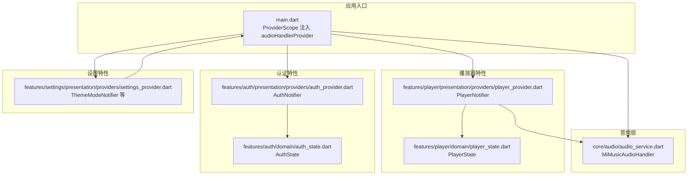
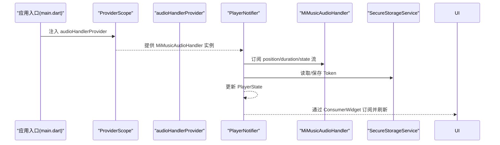
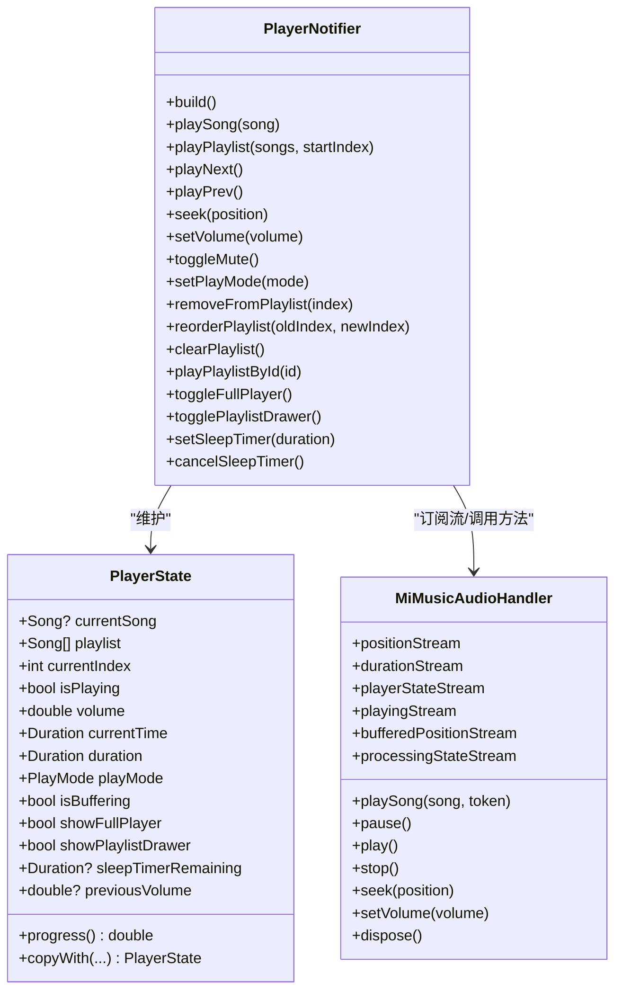
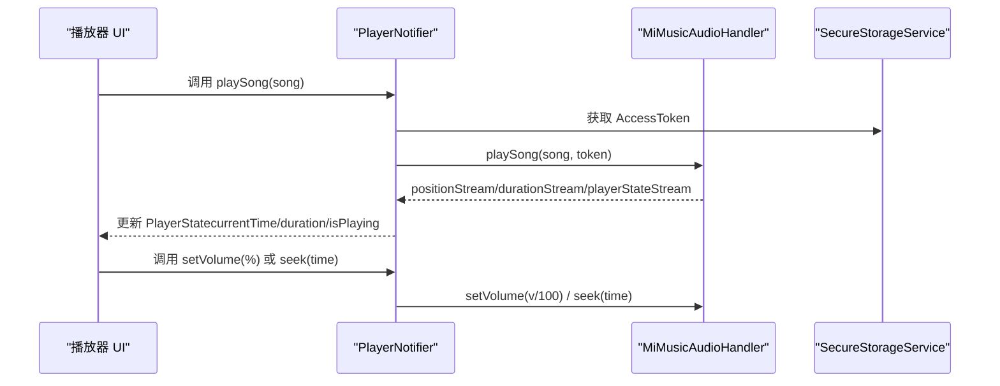
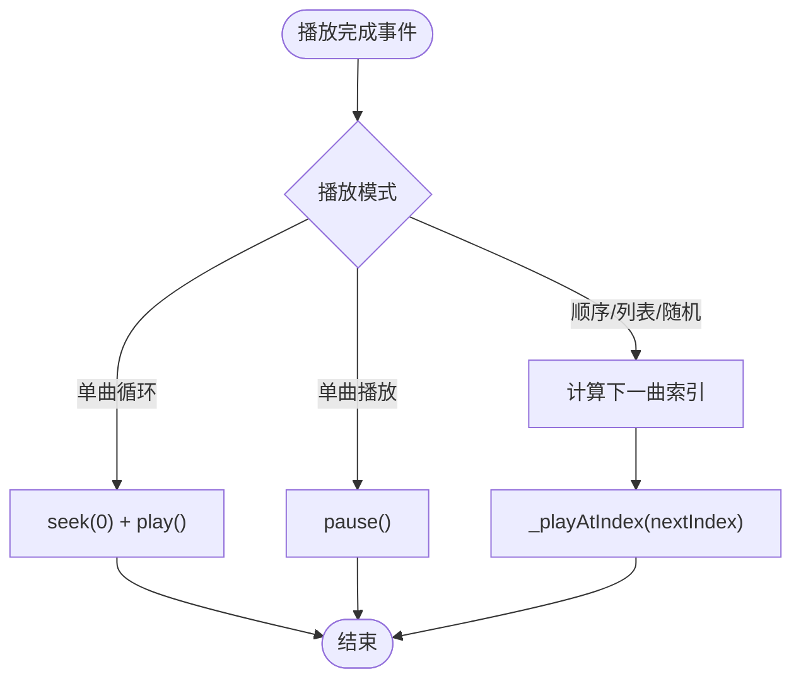
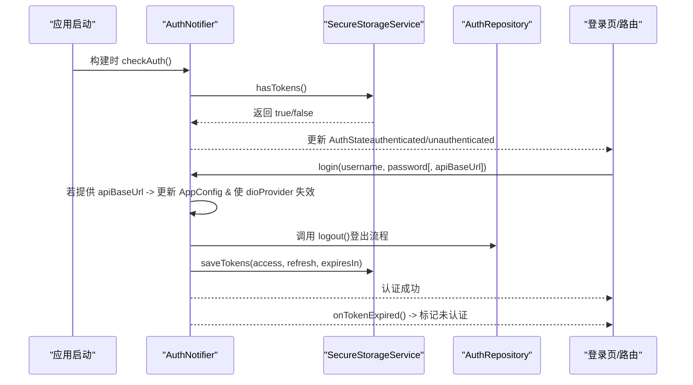
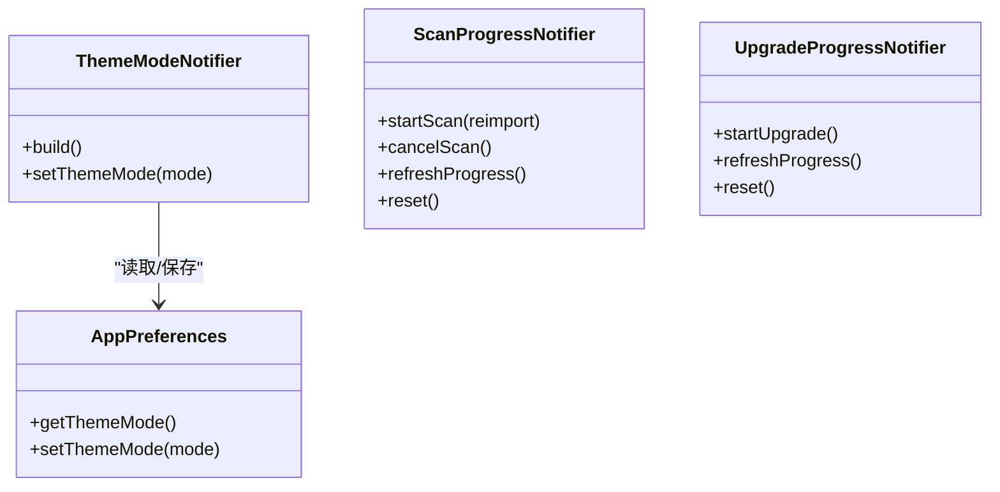
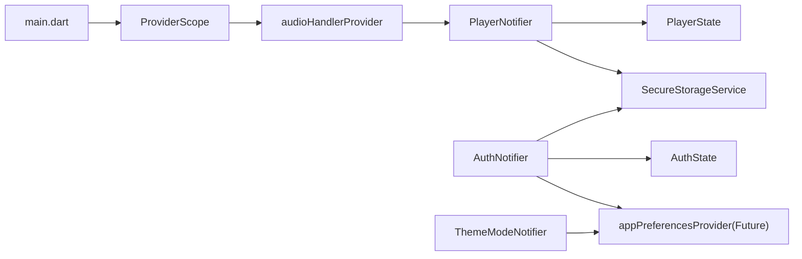

# 状态管理

<cite>
**本文引用的文件**
- [frontend/lib/main.dart](file://frontend/lib/main.dart)
- [frontend/lib/core/audio/audio_service.dart](file://frontend/lib/core/audio/audio_service.dart)
- [frontend/lib/features/player/presentation/providers/player_provider.dart](file://frontend/lib/features/player/presentation/providers/player_provider.dart)
- [frontend/lib/features/player/domain/player_state.dart](file://frontend/lib/features/player/domain/player_state.dart)
- [frontend/lib/features/auth/presentation/providers/auth_provider.dart](file://frontend/lib/features/auth/presentation/providers/auth_provider.dart)
- [frontend/lib/features/auth/domain/auth_state.dart](file://frontend/lib/features/auth/domain/auth_state.dart)
- [frontend/lib/features/settings/presentation/providers/settings_provider.dart](file://frontend/lib/features/settings/presentation/providers/settings_provider.dart)
</cite>

## 目录
1. [简介](#简介)
2. [项目结构](#项目结构)
3. [核心组件](#核心组件)
4. [架构总览](#架构总览)
5. [组件详解](#组件详解)
6. [依赖关系分析](#依赖关系分析)
7. [性能考量](#性能考量)
8. [故障排查指南](#故障排查指南)
9. [结论](#结论)
10. [附录](#附录)

## 简介
本设计文档围绕 MiMusic Flutter 的状态管理展开，重点说明基于 Riverpod 的 Provider 架构如何组织与驱动音频播放、认证与全局设置三大领域的状态。文档将详细解释 Provider 的定义、依赖注入与状态订阅机制，并给出音频状态（播放状态、播放列表、音量与进度）、认证状态（登录状态、用户信息与权限控制）以及全局状态（主题、语言与界面配置）的管理方式。最后提供最佳实践与常见问题排查建议。

## 项目结构
前端采用按特性分层的目录组织，状态相关代码主要集中在以下位置：
- 应用入口与全局注入：frontend/lib/main.dart
- 音频服务与状态桥接：frontend/lib/core/audio/audio_service.dart
- 播放器状态与业务逻辑：frontend/lib/features/player/presentation/providers/player_provider.dart 与 domain/player_state.dart
- 认证状态与权限控制：frontend/lib/features/auth/presentation/providers/auth_provider.dart 与 domain/auth_state.dart
- 全局设置与主题：frontend/lib/features/settings/presentation/providers/settings_provider.dart

图表来源
- [frontend/lib/main.dart:100-107](file://frontend/lib/main.dart#L100-L107)
- [frontend/lib/core/audio/audio_service.dart:258-306](file://frontend/lib/core/audio/audio_service.dart#L258-L306)
- [frontend/lib/features/player/presentation/providers/player_provider.dart:18-20](file://frontend/lib/features/player/presentation/providers/player_provider.dart#L18-L20)
- [frontend/lib/features/player/domain/player_state.dart:22-51](file://frontend/lib/features/player/domain/player_state.dart#L22-L51)
- [frontend/lib/features/auth/presentation/providers/auth_provider.dart:35-52](file://frontend/lib/features/auth/presentation/providers/auth_provider.dart#L35-L52)
- [frontend/lib/features/auth/domain/auth_state.dart:128-137](file://frontend/lib/features/auth/domain/auth_state.dart#L128-L137)
- [frontend/lib/features/settings/presentation/providers/settings_provider.dart:68-96](file://frontend/lib/features/settings/presentation/providers/settings_provider.dart#L68-L96)

章节来源
- [frontend/lib/main.dart:100-107](file://frontend/lib/main.dart#L100-L107)
- [frontend/lib/main.dart:110-146](file://frontend/lib/main.dart#L110-L146)

## 核心组件
- Provider 定义与类型
  - NotifierProvider：用于可变状态（播放器、认证、主题、扫描/升级进度）
  - Provider：用于无状态依赖注入（如 API 客户端、音频处理器）
  - FutureProvider：用于异步初始化（如配置、扫描/升级进度）
  - ConsumerWidget/Consumer：用于订阅 Provider 并响应状态变更
- 依赖注入
  - 在应用入口通过 ProviderScope 将 MiMusicAudioHandler 注入为 audioHandlerProvider，供播放器与其它模块使用
- 状态订阅机制
  - 通过 ref.watch 订阅 Provider；Riverpod 自动追踪依赖并在状态变化时重建对应子树

章节来源
- [frontend/lib/main.dart:18-21](file://frontend/lib/main.dart#L18-L21)
- [frontend/lib/main.dart:100-107](file://frontend/lib/main.dart#L100-L107)
- [frontend/lib/features/player/presentation/providers/player_provider.dart:18-20](file://frontend/lib/features/player/presentation/providers/player_provider.dart#L18-L20)
- [frontend/lib/features/auth/presentation/providers/auth_provider.dart:14-16](file://frontend/lib/features/auth/presentation/providers/auth_provider.dart#L14-L16)

## 架构总览
整体状态流以 Riverpod 为核心，围绕三个关键领域组织：
- 音频状态：由 MiMusicAudioHandler 提供底层 just_audio 流（播放位置、时长、状态、缓冲），PlayerNotifier 订阅并映射到 PlayerState
- 认证状态：AuthNotifier 读取安全存储，决定 AuthState 的状态与错误信息
- 全局设置：ThemeModeNotifier 管理主题模式并持久化至 AppPreferences

图表来源
- [frontend/lib/main.dart:100-107](file://frontend/lib/main.dart#L100-L107)
- [frontend/lib/features/player/presentation/providers/player_provider.dart:39-56](file://frontend/lib/features/player/presentation/providers/player_provider.dart#L39-L56)
- [frontend/lib/core/audio/audio_service.dart:258-306](file://frontend/lib/core/audio/audio_service.dart#L258-L306)

## 组件详解

### 音频状态管理（播放器）
- Provider 与 Notifier
  - playerStateProvider：基于 NotifierProvider<PlayerNotifier, PlayerState>
  - PlayerNotifier：负责订阅 AudioService 流、处理播放控制、维护播放列表与播放模式
- 状态模型
  - PlayerState：包含当前歌曲、播放列表、索引、播放/缓冲状态、音量、进度、睡眠定时器、抽屉显示等字段
- 关键流程
  - 初始化：订阅 position/duration/playerState 流，设置通知栏回调
  - 播放控制：togglePlay、playNext、playPrev、seek、setVolume、toggleMute
  - 播放列表：playPlaylist、addToPlaylist、insertToPlaylist、removeFromPlaylist、reorderPlaylist、clearPlaylist
  - 歌单播放：playPlaylistById + 后台批量加载（_loadRemainingSongsById），使用 _loadGeneration 防止竞态
  - 睡眠定时器：setSleepTimer/cancelSleepTimer，周期性更新剩余时间
- 与音频服务的桥接
  - 通过 MiMusicAudioHandler 的 positionStream/durationStream/playerStateStream 等流同步 UI
  - setVolume 与 playSong 会写入底层音量与媒体元数据

图表来源
- [frontend/lib/features/player/domain/player_state.dart:22-132](file://frontend/lib/features/player/domain/player_state.dart#L22-L132)
- [frontend/lib/features/player/presentation/providers/player_provider.dart:23-677](file://frontend/lib/features/player/presentation/providers/player_provider.dart#L23-L677)
- [frontend/lib/core/audio/audio_service.dart:258-306](file://frontend/lib/core/audio/audio_service.dart#L258-L306)

图表来源
- [frontend/lib/features/player/presentation/providers/player_provider.dart:115-140](file://frontend/lib/features/player/presentation/providers/player_provider.dart#L115-L140)
- [frontend/lib/features/player/presentation/providers/player_provider.dart:297-302](file://frontend/lib/features/player/presentation/providers/player_provider.dart#L297-L302)
- [frontend/lib/features/player/presentation/providers/player_provider.dart:292-295](file://frontend/lib/features/player/presentation/providers/player_provider.dart#L292-L295)
- [frontend/lib/features/player/presentation/providers/player_provider.dart:622-649](file://frontend/lib/features/player/presentation/providers/player_provider.dart#L622-L649)
- [frontend/lib/core/audio/audio_service.dart:258-306](file://frontend/lib/core/audio/audio_service.dart#L258-L306)

图表来源
- [frontend/lib/features/player/presentation/providers/player_provider.dart:89-112](file://frontend/lib/features/player/presentation/providers/player_provider.dart#L89-L112)

章节来源
- [frontend/lib/features/player/presentation/providers/player_provider.dart:18-20](file://frontend/lib/features/player/presentation/providers/player_provider.dart#L18-L20)
- [frontend/lib/features/player/domain/player_state.dart:22-132](file://frontend/lib/features/player/domain/player_state.dart#L22-L132)
- [frontend/lib/core/audio/audio_service.dart:258-306](file://frontend/lib/core/audio/audio_service.dart#L258-L306)

### 认证状态管理（登录/登出/权限）
- Provider 与 Notifier
  - appPreferencesProvider：FutureProvider 异步初始化 AppPreferences
  - authStateProvider：NotifierProvider<AuthNotifier, AuthState>
  - AuthNotifier：负责检查 Token、登录、登出、Token 过期处理
- 状态模型
  - AuthState：包含 status（unknown/authenticated/unauthenticated）、error、isLoading
  - AuthStatus：枚举状态
- 关键流程
  - 启动时检查 Token，避免在路由重定向阶段产生竞态
  - 登录：可选更新 API 基地址并失效 dioProvider，保存 Token
  - 登出：调用仓库登出接口（忽略错误），清理本地 Token，回到未认证状态
  - Token 过期：标记未认证并提示重新登录

图表来源
- [frontend/lib/features/auth/presentation/providers/auth_provider.dart:35-70](file://frontend/lib/features/auth/presentation/providers/auth_provider.dart#L35-L70)
- [frontend/lib/features/auth/presentation/providers/auth_provider.dart:72-138](file://frontend/lib/features/auth/presentation/providers/auth_provider.dart#L72-L138)
- [frontend/lib/features/auth/domain/auth_state.dart:128-174](file://frontend/lib/features/auth/domain/auth_state.dart#L128-L174)

章节来源
- [frontend/lib/features/auth/presentation/providers/auth_provider.dart:14-16](file://frontend/lib/features/auth/presentation/providers/auth_provider.dart#L14-L16)
- [frontend/lib/features/auth/presentation/providers/auth_provider.dart:35-144](file://frontend/lib/features/auth/presentation/providers/auth_provider.dart#L35-L144)
- [frontend/lib/features/auth/domain/auth_state.dart:115-174](file://frontend/lib/features/auth/domain/auth_state.dart#L115-L174)

### 全局状态管理（主题/扫描/升级）
- 主题模式
  - ThemeModeNotifier：从 AppPreferences 加载主题模式，支持设置并持久化
- 扫描进度
  - ScanProgressNotifier：startScan/cancelScan/refreshProgress，轮询进度并自动停止
- 升级进度
  - UpgradeProgressNotifier：startUpgrade/refreshProgress，轮询并自动停止
- Provider 类型
  - FutureProvider：configsProvider、pluginsProvider、upgradeCheckProvider
  - NotifierProvider：themeModeProvider、scanProgressProvider、upgradeProgressProvider

图表来源
- [frontend/lib/features/settings/presentation/providers/settings_provider.dart:68-96](file://frontend/lib/features/settings/presentation/providers/settings_provider.dart#L68-L96)
- [frontend/lib/features/settings/presentation/providers/settings_provider.dart:108-194](file://frontend/lib/features/settings/presentation/providers/settings_provider.dart#L108-L194)
- [frontend/lib/features/settings/presentation/providers/settings_provider.dart:207-272](file://frontend/lib/features/settings/presentation/providers/settings_provider.dart#L207-L272)

章节来源
- [frontend/lib/features/settings/presentation/providers/settings_provider.dart:46-61](file://frontend/lib/features/settings/presentation/providers/settings_provider.dart#L46-L61)
- [frontend/lib/features/settings/presentation/providers/settings_provider.dart:68-101](file://frontend/lib/features/settings/presentation/providers/settings_provider.dart#L68-L101)
- [frontend/lib/features/settings/presentation/providers/settings_provider.dart:108-200](file://frontend/lib/features/settings/presentation/providers/settings_provider.dart#L108-L200)
- [frontend/lib/features/settings/presentation/providers/settings_provider.dart:207-272](file://frontend/lib/features/settings/presentation/providers/settings_provider.dart#L207-L272)

## 依赖关系分析
- 入口依赖
  - main.dart 通过 ProviderScope 注入 audioHandlerProvider，使下游 Provider 可以依赖该音频处理器
- 播放器依赖
  - PlayerNotifier 依赖 audioHandlerProvider（来自 ProviderScope）与 SecureStorageService
  - 订阅 MiMusicAudioHandler 的多个 Stream，映射到 PlayerState
- 认证依赖
  - AuthNotifier 依赖 SecureStorageService 与 AuthRepository；appPreferencesProvider 为 FutureProvider
- 设置依赖
  - ThemeModeNotifier 依赖 appPreferencesProvider（FutureProvider）进行主题持久化

图表来源
- [frontend/lib/main.dart:100-107](file://frontend/lib/main.dart#L100-L107)
- [frontend/lib/features/player/presentation/providers/player_provider.dart:39-42](file://frontend/lib/features/player/presentation/providers/player_provider.dart#L39-L42)
- [frontend/lib/features/auth/presentation/providers/auth_provider.dart:14-16](file://frontend/lib/features/auth/presentation/providers/auth_provider.dart#L14-L16)
- [frontend/lib/features/settings/presentation/providers/settings_provider.dart:76-84](file://frontend/lib/features/settings/presentation/providers/settings_provider.dart#L76-L84)

章节来源
- [frontend/lib/main.dart:100-107](file://frontend/lib/main.dart#L100-L107)
- [frontend/lib/features/player/presentation/providers/player_provider.dart:39-56](file://frontend/lib/features/player/presentation/providers/player_provider.dart#L39-L56)
- [frontend/lib/features/auth/presentation/providers/auth_provider.dart:35-52](file://frontend/lib/features/auth/presentation/providers/auth_provider.dart#L35-L52)

## 性能考量
- 状态隔离
  - 将播放器、认证、设置拆分为独立 Notifier，避免无关状态变更引发 UI 重建
- 订阅粒度
  - 仅订阅必要的 Provider；例如播放器 UI 只订阅播放进度、播放状态等必要字段
- 资源释放
  - PlayerNotifier 在 onDispose 中取消所有 StreamSubscription 与 Timer，防止内存泄漏
- 网络与 IO
  - playPlaylistById 使用批处理与指数退避重试，_loadGeneration 防止过期后台任务竞争
- 主题与路由
  - 主题切换通过 Notifier 写入 AppPreferences，避免频繁重建

章节来源
- [frontend/lib/features/player/presentation/providers/player_provider.dart:49-55](file://frontend/lib/features/player/presentation/providers/player_provider.dart#L49-L55)
- [frontend/lib/features/player/presentation/providers/player_provider.dart:462-552](file://frontend/lib/features/player/presentation/providers/player_provider.dart#L462-L552)
- [frontend/lib/features/settings/presentation/providers/settings_provider.dart:108-118](file://frontend/lib/features/settings/presentation/providers/settings_provider.dart#L108-L118)

## 故障排查指南
- 播放器无法更新进度/状态
  - 检查 MiMusicAudioHandler 是否正确初始化与 ensureInitialized
  - 确认 positionStream/durationStream/playerStateStream 是否被订阅
- 登录后状态未生效
  - 确认 SecureStorageService 已保存 Token
  - 检查 dioProvider 是否因 API 基地址变更而失效并重新创建
- 主题切换无效
  - 确认 ThemeModeNotifier 已写入 AppPreferences
  - 检查 MaterialApp.router 的 themeMode 是否被正确读取
- 扫描/升级进度不更新
  - 确认轮询定时器是否启动与停止逻辑正确
  - 检查状态 isCompleted/isError/isCancelled 分支是否提前终止轮询

章节来源
- [frontend/lib/main.dart:65-97](file://frontend/lib/main.dart#L65-L97)
- [frontend/lib/features/auth/presentation/providers/auth_provider.dart:82-89](file://frontend/lib/features/auth/presentation/providers/auth_provider.dart#L82-L89)
- [frontend/lib/features/settings/presentation/providers/settings_provider.dart:179-193](file://frontend/lib/features/settings/presentation/providers/settings_provider.dart#L179-L193)

## 结论
MiMusic Flutter 的状态管理以 Riverpod 为核心，通过 Provider 的清晰分层实现了音频、认证与全局设置的解耦。借助 Notifier 的可变状态与 Provider 的依赖注入，系统在保证状态一致性的同时具备良好的扩展性与可维护性。配合资源释放与后台任务防竞态策略，整体性能与稳定性得到保障。

## 附录
- 代码片段路径参考
  - [音频处理器流暴露:258-306](file://frontend/lib/core/audio/audio_service.dart#L258-L306)
  - [播放器状态初始化与监听:39-87](file://frontend/lib/features/player/presentation/providers/player_provider.dart#L39-L87)
  - [播放器播放控制与列表操作:207-356](file://frontend/lib/features/player/presentation/providers/player_provider.dart#L207-L356)
  - [播放器后台加载与竞态防护:409-552](file://frontend/lib/features/player/presentation/providers/player_provider.dart#L409-L552)
  - [认证状态检查与登录流程:57-138](file://frontend/lib/features/auth/presentation/providers/auth_provider.dart#L57-L138)
  - [主题模式持久化与设置:76-95](file://frontend/lib/features/settings/presentation/providers/settings_provider.dart#L76-L95)