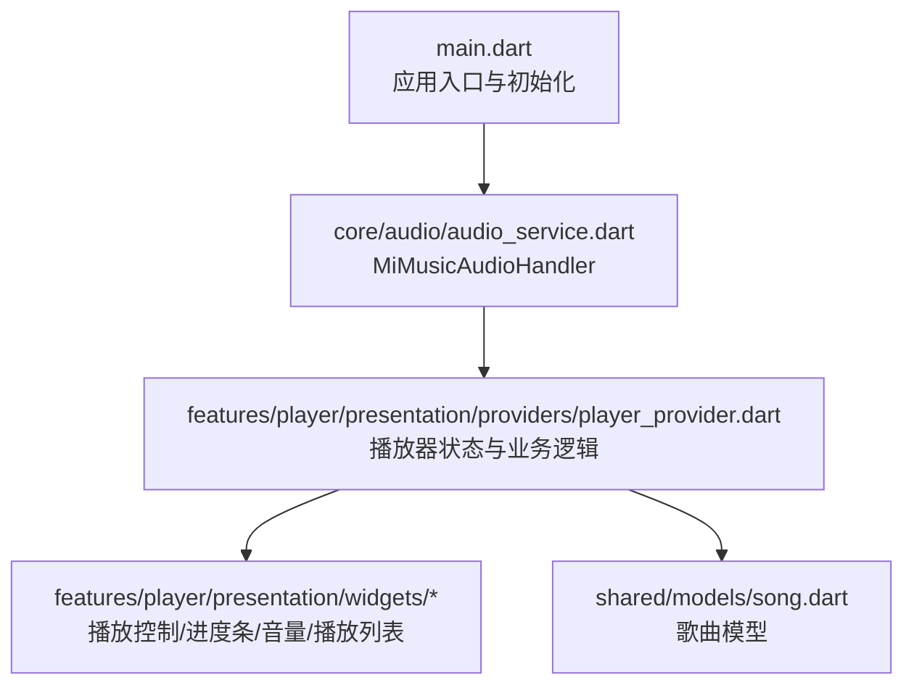
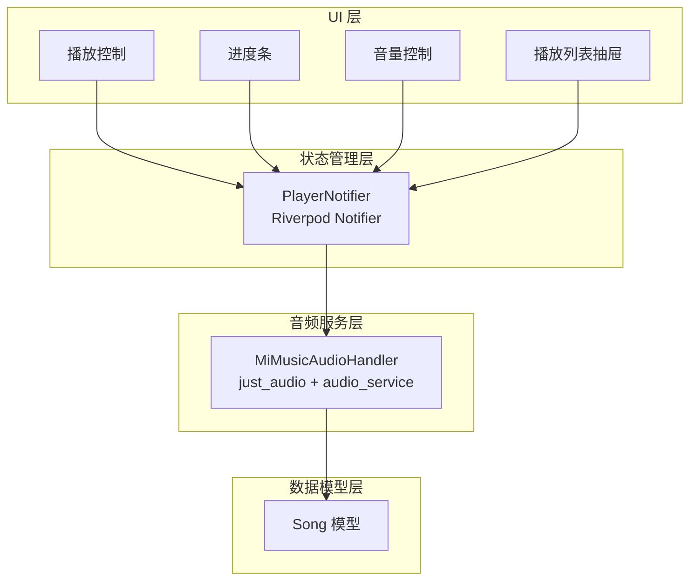
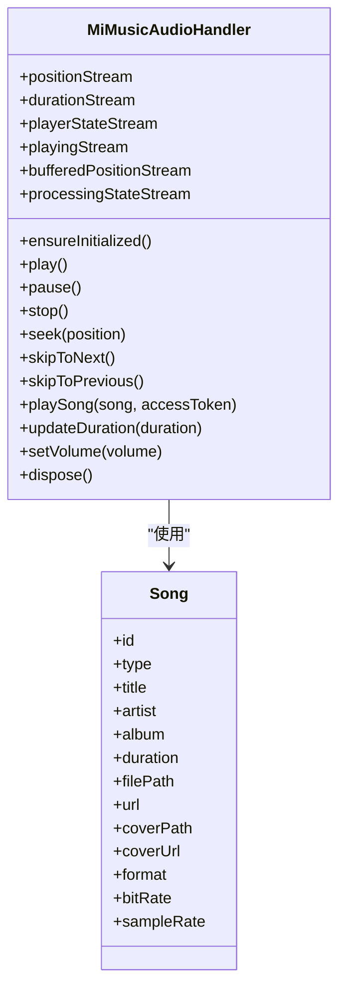
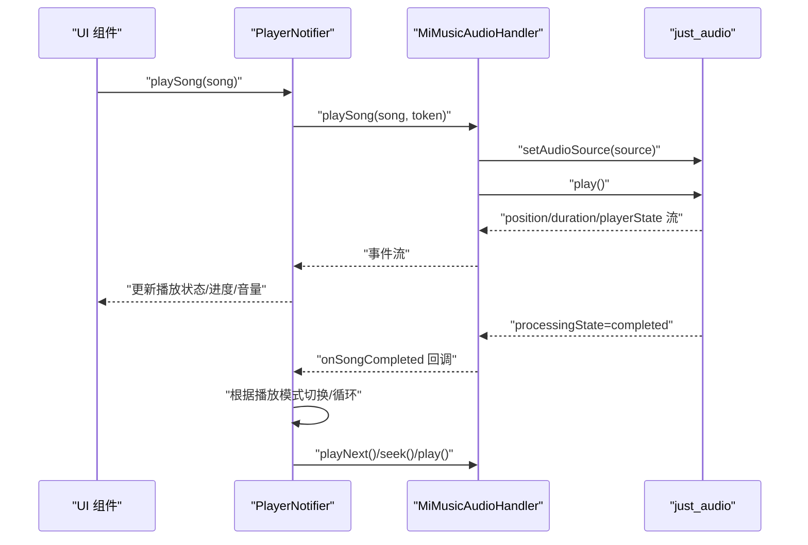
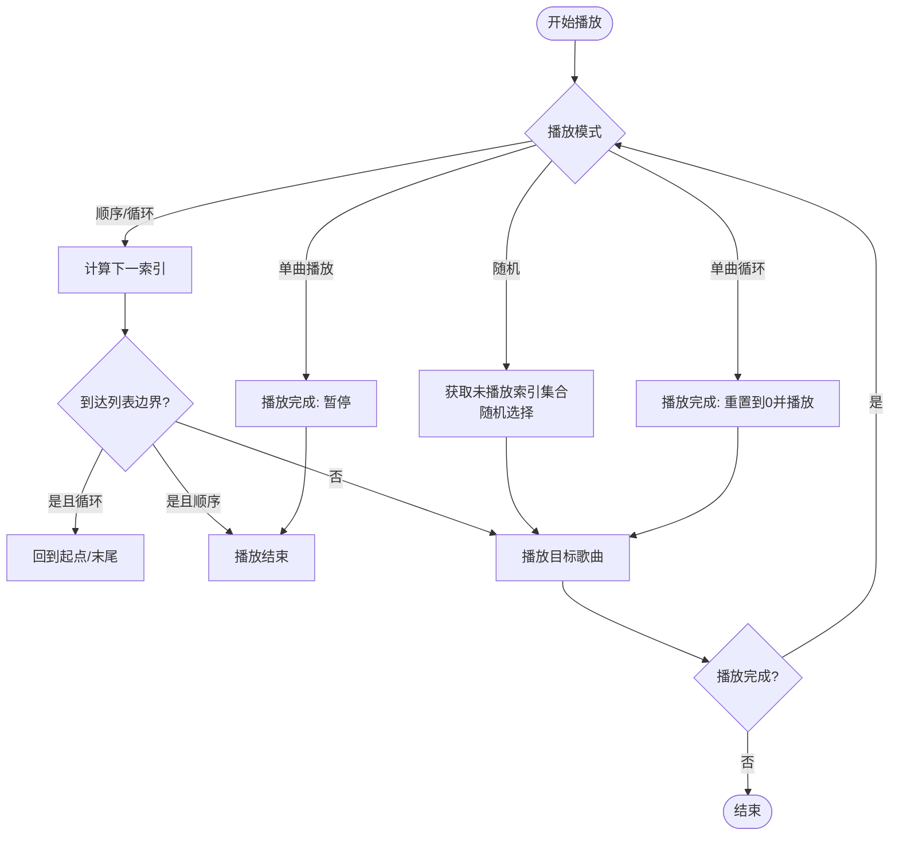
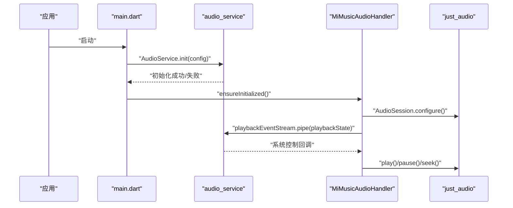
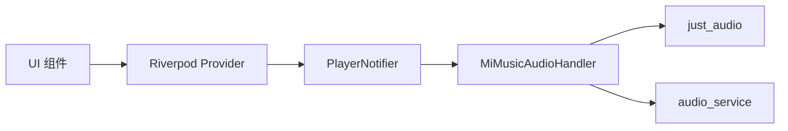

# 音频播放系统

<cite>
**本文引用的文件**
- [main.go](file://main.go)
- [frontend/lib/main.dart](file://frontend/lib/main.dart)
- [frontend/lib/core/audio/audio_service.dart](file://frontend/lib/core/audio/audio_service.dart)
- [frontend/lib/features/player/presentation/providers/player_provider.dart](file://frontend/lib/features/player/presentation/providers/player_provider.dart)
- [frontend/lib/features/player/presentation/widgets/play_controls.dart](file://frontend/lib/features/player/presentation/widgets/play_controls.dart)
- [frontend/lib/features/player/presentation/widgets/progress_bar.dart](file://frontend/lib/features/player/presentation/widgets/progress_bar.dart)
- [frontend/lib/features/player/presentation/widgets/volume_control.dart](file://frontend/lib/features/player/presentation/widgets/volume_control.dart)
- [frontend/lib/features/player/presentation/widgets/playlist_drawer.dart](file://frontend/lib/features/player/presentation/widgets/playlist_drawer.dart)
- [frontend/lib/shared/models/song.dart](file://frontend/lib/shared/models/song.dart)
</cite>

## 目录
1. [简介](#简介)
2. [项目结构](#项目结构)
3. [核心组件](#核心组件)
4. [架构总览](#架构总览)
5. [组件详解](#组件详解)
6. [依赖关系分析](#依赖关系分析)
7. [性能与内存优化](#性能与内存优化)
8. [故障排查指南](#故障排查指南)
9. [结论](#结论)
10. [附录](#附录)

## 简介
本设计文档面向 MiMusic 音频播放系统，聚焦于前端 Flutter 端的音频服务实现与播放器 UI 组件设计。系统采用 audio_service 与 just_audio 的组合方案：前者负责后台播放、通知栏控制与系统媒体控制，后者负责底层音频解码与播放控制。文档覆盖以下主题：
- 音频服务集成与播放器组件设计（播放控制、进度条、音量控制、播放列表）
- 音频队列管理（播放列表构建、歌曲切换逻辑、循环/随机策略）
- 通知栏集成（后台播放、锁屏控制、系统通知）
- 音频格式支持（MP3、FLAC、AAC 等的解码与播放）
- 播放流程图与错误处理机制
- 性能优化与内存管理策略

## 项目结构
前端 Flutter 应用位于 frontend/lib，音频服务与播放器相关代码主要集中在 core/audio 与 features/player 两个目录。入口文件 main.dart 初始化 audio_service，并注入全局 Provider；播放器状态与业务逻辑集中在 providers/player_provider.dart；UI 组件分布在 presentation/widgets 下。

图表来源
- [frontend/lib/main.dart:23-108](file://frontend/lib/main.dart#L23-L108)
- [frontend/lib/core/audio/audio_service.dart:16-307](file://frontend/lib/core/audio/audio_service.dart#L16-L307)
- [frontend/lib/features/player/presentation/providers/player_provider.dart:18-702](file://frontend/lib/features/player/presentation/providers/player_provider.dart#L18-L702)
- [frontend/lib/shared/models/song.dart:1-172](file://frontend/lib/shared/models/song.dart#L1-L172)

章节来源
- [frontend/lib/main.dart:23-108](file://frontend/lib/main.dart#L23-L108)
- [frontend/lib/core/audio/audio_service.dart:16-307](file://frontend/lib/core/audio/audio_service.dart#L16-L307)
- [frontend/lib/features/player/presentation/providers/player_provider.dart:18-702](file://frontend/lib/features/player/presentation/providers/player_provider.dart#L18-L702)
- [frontend/lib/shared/models/song.dart:1-172](file://frontend/lib/shared/models/song.dart#L1-L172)

## 核心组件
- 音频服务处理器：MiMusicAudioHandler，封装 just_audio 的 AudioPlayer，桥接 audio_service 的 PlaybackState，提供播放、暂停、跳转、下一首、上一首等控制接口，并负责通知栏元数据更新。
- 播放器状态管理：PlayerNotifier，基于 Riverpod Notifier，聚合播放位置、时长、播放状态、播放列表、当前歌曲、播放模式（顺序/单曲/单曲循环/随机）、音量与睡眠定时器等。
- 播放器 UI 组件：播放控制按钮、进度条、音量控制、播放列表抽屉，分别对应 play_controls.dart、progress_bar.dart、volume_control.dart、playlist_drawer.dart。
- 歌曲模型：Song，统一承载本地/网络/电台歌曲的元数据，包括标题、艺术家、专辑、封面、时长、文件路径/URL、格式等。

章节来源
- [frontend/lib/core/audio/audio_service.dart:16-307](file://frontend/lib/core/audio/audio_service.dart#L16-L307)
- [frontend/lib/features/player/presentation/providers/player_provider.dart:23-702](file://frontend/lib/features/player/presentation/providers/player_provider.dart#L23-L702)
- [frontend/lib/features/player/presentation/widgets/play_controls.dart:1-156](file://frontend/lib/features/player/presentation/widgets/play_controls.dart#L1-L156)
- [frontend/lib/features/player/presentation/widgets/progress_bar.dart:1-231](file://frontend/lib/features/player/presentation/widgets/progress_bar.dart#L1-L231)
- [frontend/lib/features/player/presentation/widgets/volume_control.dart:1-478](file://frontend/lib/features/player/presentation/widgets/volume_control.dart#L1-L478)
- [frontend/lib/features/player/presentation/widgets/playlist_drawer.dart:1-393](file://frontend/lib/features/player/presentation/widgets/playlist_drawer.dart#L1-L393)
- [frontend/lib/shared/models/song.dart:1-172](file://frontend/lib/shared/models/song.dart#L1-L172)

## 架构总览
系统采用“音频服务 + 播放器状态 + UI 组件”的分层架构：
- 音频服务层：MiMusicAudioHandler 通过 just_audio 播放音频，通过 audio_service 暴露系统级控制与通知栏。
- 状态管理层：PlayerNotifier 聚合播放器状态，订阅音频服务事件，驱动 UI 更新与播放逻辑。
- UI 层：播放控制、进度条、音量、播放列表等组件消费状态并触发动作。
- 数据模型层：Song 统一歌曲元数据，支撑播放列表与通知栏展示。

图表来源
- [frontend/lib/core/audio/audio_service.dart:16-307](file://frontend/lib/core/audio/audio_service.dart#L16-L307)
- [frontend/lib/features/player/presentation/providers/player_provider.dart:23-702](file://frontend/lib/features/player/presentation/providers/player_provider.dart#L23-L702)
- [frontend/lib/shared/models/song.dart:1-172](file://frontend/lib/shared/models/song.dart#L1-L172)

## 组件详解

### 音频服务与播放器核心（MiMusicAudioHandler）
- 设计要点
  - 使用 just_audio 的 AudioPlayer，并通过事件流管道映射到 audio_service 的 PlaybackState，确保通知栏与系统媒体控制实时同步。
  - 支持本地歌曲与网络歌曲两种播放源：本地歌曲通过后端 API 构造带访问令牌的 URI；网络歌曲通过代理 URL 解决跨域问题。
  - 通知栏元数据通过 MediaItem 更新，包含标题、艺术家、专辑、封面与时长。
  - 音量控制通过 setVolume 接口，范围 0.0-1.0。
- 关键行为
  - 播放/暂停/停止/跳转/下一首/上一首均委托给底层 AudioPlayer。
  - 播放完成回调触发播放模式下的下一曲或单曲循环重启。
- 错误处理
  - 播放源构造失败或播放异常时记录日志并抛出，由上层 Provider 捕获并反馈 UI。

图表来源
- [frontend/lib/core/audio/audio_service.dart:16-307](file://frontend/lib/core/audio/audio_service.dart#L16-L307)
- [frontend/lib/shared/models/song.dart:1-172](file://frontend/lib/shared/models/song.dart#L1-L172)

章节来源
- [frontend/lib/core/audio/audio_service.dart:16-307](file://frontend/lib/core/audio/audio_service.dart#L16-L307)
- [frontend/lib/shared/models/song.dart:1-172](file://frontend/lib/shared/models/song.dart#L1-L172)

### 播放器状态与业务逻辑（PlayerNotifier）
- 设计要点
  - 订阅音频服务的位置、时长、播放状态流，实时更新播放器状态。
  - 实现播放模式切换：顺序、单曲、单曲循环、随机。
  - 随机模式下维护已播放索引集合，避免短时间内重复。
  - 支持后台异步加载歌单剩余歌曲，使用代次（generation）防竞态。
  - 睡眠定时器：支持设定定时停止，倒计时更新。
- 关键流程
  - 播放单曲：若歌曲已在播放列表则跳转，否则追加到末尾并播放。
  - 播放歌单：设置当前索引与歌曲，触发播放。
  - 上一首/下一首：根据播放模式与当前索引计算目标索引，支持循环与随机。
  - 播放完成：依据播放模式决定单曲循环重启或播放下一首。
- 错误处理
  - 播放异常时清除缓冲状态并向上抛出，由 UI 层提示。

图表来源
- [frontend/lib/features/player/presentation/providers/player_provider.dart:114-140](file://frontend/lib/features/player/presentation/providers/player_provider.dart#L114-L140)
- [frontend/lib/features/player/presentation/providers/player_provider.dart:222-251](file://frontend/lib/features/player/presentation/providers/player_provider.dart#L222-L251)
- [frontend/lib/features/player/presentation/providers/player_provider.dart:89-112](file://frontend/lib/features/player/presentation/providers/player_provider.dart#L89-L112)
- [frontend/lib/core/audio/audio_service.dart:153-214](file://frontend/lib/core/audio/audio_service.dart#L153-L214)

章节来源
- [frontend/lib/features/player/presentation/providers/player_provider.dart:23-702](file://frontend/lib/features/player/presentation/providers/player_provider.dart#L23-L702)
- [frontend/lib/core/audio/audio_service.dart:16-307](file://frontend/lib/core/audio/audio_service.dart#L16-L307)

### 播放控制组件（PlayControls）
- 功能：提供上一首、播放/暂停、下一首按钮，支持缓冲指示。
- 交互：根据 isPlaying、hasPrev、hasNext 控制按钮可用性与图标。

章节来源
- [frontend/lib/features/player/presentation/widgets/play_controls.dart:1-156](file://frontend/lib/features/player/presentation/widgets/play_controls.dart#L1-L156)

### 进度条组件（PlayerProgressBar 与 ClickableProgressBar）
- 功能：显示当前播放位置与总时长，支持拖拽/点击跳转。
- 交互：拖拽开始/更新/结束触发 onSeek 回调；桌面端可点击进度条区域进行跳转。

章节来源
- [frontend/lib/features/player/presentation/widgets/progress_bar.dart:1-231](file://frontend/lib/features/player/presentation/widgets/progress_bar.dart#L1-L231)

### 音量控制组件（VolumeControl 与响应式变体）
- 功能：音量滑块、静音/恢复、移动端弹出面板。
- 交互：支持 0-100 的音量值，自动映射到底层 0.0-1.0；移动端通过弹出面板提升可用性。

章节来源
- [frontend/lib/features/player/presentation/widgets/volume_control.dart:1-478](file://frontend/lib/features/player/presentation/widgets/volume_control.dart#L1-L478)

### 播放列表组件（PlaylistDrawer）
- 功能：展示播放队列、歌曲封面、时长、当前播放指示；支持拖拽排序、移除、清空。
- 交互：点击歌曲项触发播放该曲目；滑动删除；右上角关闭抽屉。

章节来源
- [frontend/lib/features/player/presentation/widgets/playlist_drawer.dart:1-393](file://frontend/lib/features/player/presentation/widgets/playlist_drawer.dart#L1-L393)

### 音频队列管理与播放模式
- 播放列表构建
  - playSong：若歌曲已在列表则跳转，否则追加到末尾并播放。
  - playPlaylist：设置当前索引与歌曲，触发播放。
  - addToPlaylist：批量去重追加。
- 歌曲切换逻辑
  - playNext/playPrev：根据播放模式与当前索引计算目标索引，支持循环与随机。
  - 随机模式：维护已播放索引集合，避免短期内重复。
- 循环播放策略
  - 单曲循环：播放完成时 seek 到起点并继续播放。
  - 单曲播放：播放完成停止。
  - 顺序/循环：播放完成进入下一首；到达边界时按模式处理。
- 后台加载
  - playPlaylistById：先取第一页立即播放，后台异步加载剩余歌曲，使用代次（generation）防竞态与过期任务。

图表来源
- [frontend/lib/features/player/presentation/providers/player_provider.dart:222-290](file://frontend/lib/features/player/presentation/providers/player_provider.dart#L222-L290)
- [frontend/lib/features/player/presentation/providers/player_provider.dart:89-112](file://frontend/lib/features/player/presentation/providers/player_provider.dart#L89-L112)
- [frontend/lib/features/player/presentation/providers/player_provider.dart:409-458](file://frontend/lib/features/player/presentation/providers/player_provider.dart#L409-L458)

章节来源
- [frontend/lib/features/player/presentation/providers/player_provider.dart:222-290](file://frontend/lib/features/player/presentation/providers/player_provider.dart#L222-L290)
- [frontend/lib/features/player/presentation/providers/player_provider.dart:89-112](file://frontend/lib/features/player/presentation/providers/player_provider.dart#L89-L112)
- [frontend/lib/features/player/presentation/providers/player_provider.dart:409-458](file://frontend/lib/features/player/presentation/providers/player_provider.dart#L409-L458)

### 通知栏集成与后台播放
- 初始化与降级
  - main.dart 中初始化 audio_service，配置通知渠道与持续通知；若初始化失败，使用降级模式继续工作但通知栏功能受限。
- 控制与元数据
  - MiMusicAudioHandler 将 just_audio 的事件映射为 audio_service 的 PlaybackState，系统通知栏与锁屏控制按钮可直接调用 play/pause/seek/skip 等方法。
  - 通过 MediaItem 更新标题、艺术家、专辑、封面与时长，确保通知栏显示正确。
- iOS 注意
  - iOS AVPlayer 对自定义 Header 不友好，本地歌曲通过 URL 查询参数传递访问令牌。

图表来源
- [frontend/lib/main.dart:65-97](file://frontend/lib/main.dart#L65-L97)
- [frontend/lib/core/audio/audio_service.dart:27-55](file://frontend/lib/core/audio/audio_service.dart#L27-L55)
- [frontend/lib/core/audio/audio_service.dart:75-109](file://frontend/lib/core/audio/audio_service.dart#L75-L109)

章节来源
- [frontend/lib/main.dart:65-97](file://frontend/lib/main.dart#L65-L97)
- [frontend/lib/core/audio/audio_service.dart:27-55](file://frontend/lib/core/audio/audio_service.dart#L27-L55)
- [frontend/lib/core/audio/audio_service.dart:75-109](file://frontend/lib/core/audio/audio_service.dart#L75-L109)

### 音频格式支持
- 解码与播放
  - just_audio 支持多种容器与编解码格式，系统通过统一的 AudioSource.uri 播放本地与网络资源。
  - 本地歌曲通过后端 API 提供带访问令牌的 URL；网络歌曲通过代理 URL 解决跨域。
- 常见格式
  - MP3、FLAC、AAC 等常见无损/有损音频格式由底层解码器处理，上层无需感知具体格式差异。
- 时长与元数据
  - 通过 durationStream 获取总时长，首次获取到时同步更新通知栏时长。

章节来源
- [frontend/lib/core/audio/audio_service.dart:156-214](file://frontend/lib/core/audio/audio_service.dart#L156-L214)
- [frontend/lib/features/player/presentation/providers/player_provider.dart:66-73](file://frontend/lib/features/player/presentation/providers/player_provider.dart#L66-L73)

## 依赖关系分析
- 组件耦合
  - PlayerNotifier 依赖 MiMusicAudioHandler 的事件流与控制接口，耦合度低，职责清晰。
  - UI 组件通过 Provider 读取状态，不直接依赖底层音频库，便于测试与替换。
- 外部依赖
  - audio_service：系统媒体控制与通知栏。
  - just_audio：底层音频解码与播放。
  - Riverpod：状态管理与响应式更新。
- 潜在风险
  - 通知栏功能依赖系统权限与渠道配置，需在 Android/iOS 平台正确初始化。
  - 随机模式的已播放索引集合在播放列表变更时需正确维护，避免索引越界。

图表来源
- [frontend/lib/features/player/presentation/providers/player_provider.dart:18-702](file://frontend/lib/features/player/presentation/providers/player_provider.dart#L18-L702)
- [frontend/lib/core/audio/audio_service.dart:16-307](file://frontend/lib/core/audio/audio_service.dart#L16-L307)

章节来源
- [frontend/lib/features/player/presentation/providers/player_provider.dart:18-702](file://frontend/lib/features/player/presentation/providers/player_provider.dart#L18-L702)
- [frontend/lib/core/audio/audio_service.dart:16-307](file://frontend/lib/core/audio/audio_service.dart#L16-L307)

## 性能与内存优化
- 播放器初始化
  - 使用 fire-and-forget 模式触发播放，避免阻塞调用链；状态通过事件流自动同步。
- 事件流订阅
  - 在 Notifier 构建阶段订阅位置、时长、播放状态流；在 onDispose 中及时取消订阅，防止内存泄漏。
- 随机模式
  - 使用集合维护已播放索引，避免频繁查找；当集合满时重置，保证公平性。
- 后台加载
  - 使用代次（generation）标记加载批次，用户切换或清空时自动取消过期任务，减少无效网络与 UI 更新。
- 通知栏更新
  - 先更新 MediaItem，再设置音频源，最后播放，避免 Service 生命周期导致的通知栏元数据丢失。
- 内存管理
  - Provider 在组件销毁时自动清理订阅；PlayerNotifier 在 dispose 中取消定时器与订阅。
  - 音量设置采用 clamped 范围，避免异常值影响底层状态。

章节来源
- [frontend/lib/core/audio/audio_service.dart:203-210](file://frontend/lib/core/audio/audio_service.dart#L203-L210)
- [frontend/lib/features/player/presentation/providers/player_provider.dart:49-56](file://frontend/lib/features/player/presentation/providers/player_provider.dart#L49-L56)
- [frontend/lib/features/player/presentation/providers/player_provider.dart:608-649](file://frontend/lib/features/player/presentation/providers/player_provider.dart#L608-L649)
- [frontend/lib/features/player/presentation/providers/player_provider.dart:462-552](file://frontend/lib/features/player/presentation/providers/player_provider.dart#L462-L552)
- [frontend/lib/core/audio/audio_service.dart:190-197](file://frontend/lib/core/audio/audio_service.dart#L190-L197)

## 故障排查指南
- 通知栏不显示或控制无效
  - 检查 audio_service 初始化是否成功；若失败将降级为无通知栏模式。
  - 确认 Android 通知权限与渠道配置。
- 播放卡住或无法开始
  - 查看播放源构造日志：本地歌曲是否生成带访问令牌的 URL；网络歌曲是否通过代理 URL。
  - 检查 AudioSession 配置是否成功。
- 播放完成未切换
  - 确认播放模式设置与 processingState 流是否正确触发回调。
- 随机播放重复
  - 检查已播放索引集合是否正确维护与重置。
- 音量异常
  - 确认 UI 传入值在 0-100 区间，底层映射到 0.0-1.0。

章节来源
- [frontend/lib/main.dart:65-97](file://frontend/lib/main.dart#L65-L97)
- [frontend/lib/core/audio/audio_service.dart:63-71](file://frontend/lib/core/audio/audio_service.dart#L63-L71)
- [frontend/lib/core/audio/audio_service.dart:156-214](file://frontend/lib/core/audio/audio_service.dart#L156-L214)
- [frontend/lib/features/player/presentation/providers/player_provider.dart:89-112](file://frontend/lib/features/player/presentation/providers/player_provider.dart#L89-L112)
- [frontend/lib/features/player/presentation/providers/player_provider.dart:651-676](file://frontend/lib/features/player/presentation/providers/player_provider.dart#L651-L676)

## 结论
MiMusic 音频播放系统通过 audio_service 与 just_audio 的协同，实现了稳定的后台播放、系统级通知栏控制与丰富的播放器 UI。播放器状态管理采用 Riverpod Notifier，职责清晰、易于扩展。播放队列与播放模式逻辑完善，支持顺序、单曲、单曲循环与随机播放。通过事件流与管道映射，系统在性能与可靠性方面表现良好。后续可在格式支持、网络稳定性与 UI 体验方面持续优化。

## 附录
- 入口与配置
  - 应用入口 main.go 负责解析配置与启动应用；Flutter 端入口 main.dart 初始化 audio_service 并注入全局 Provider。
- 相关文件
  - [main.go:30-62](file://main.go#L30-L62)
  - [frontend/lib/main.dart:23-108](file://frontend/lib/main.dart#L23-L108)