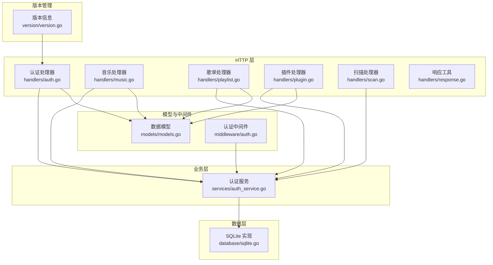
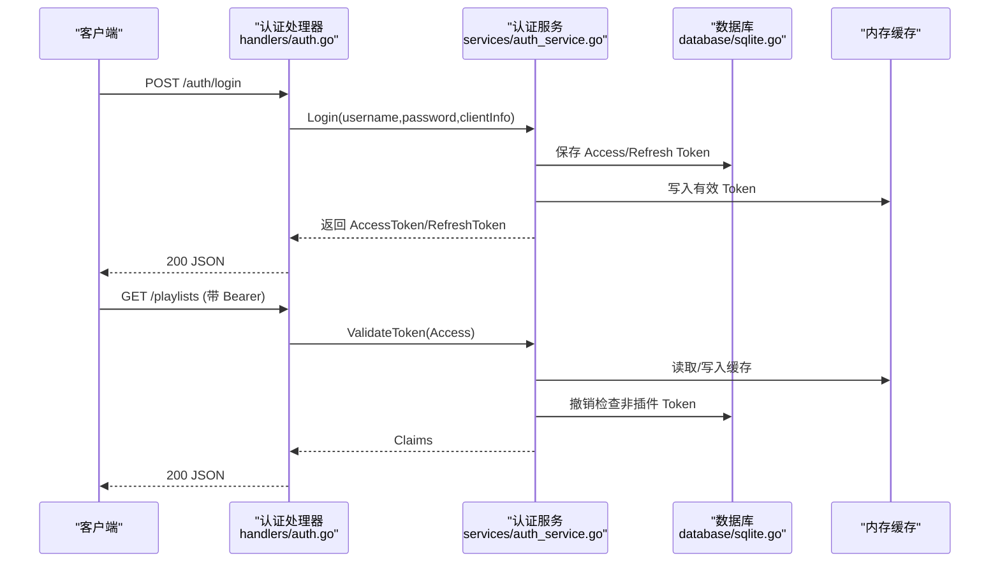
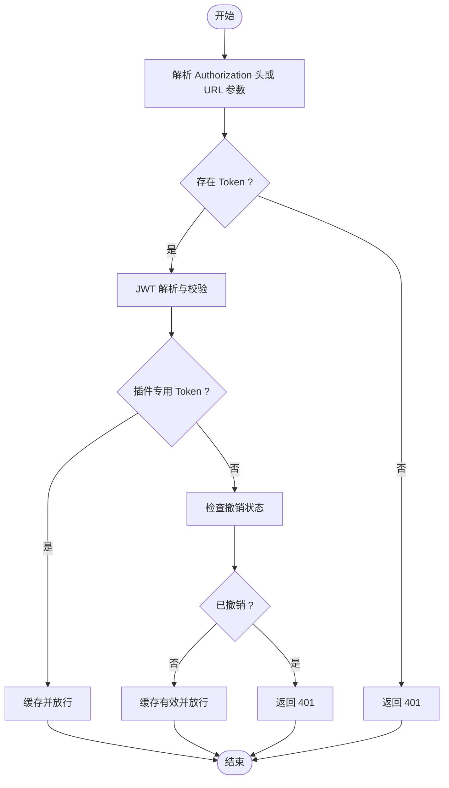
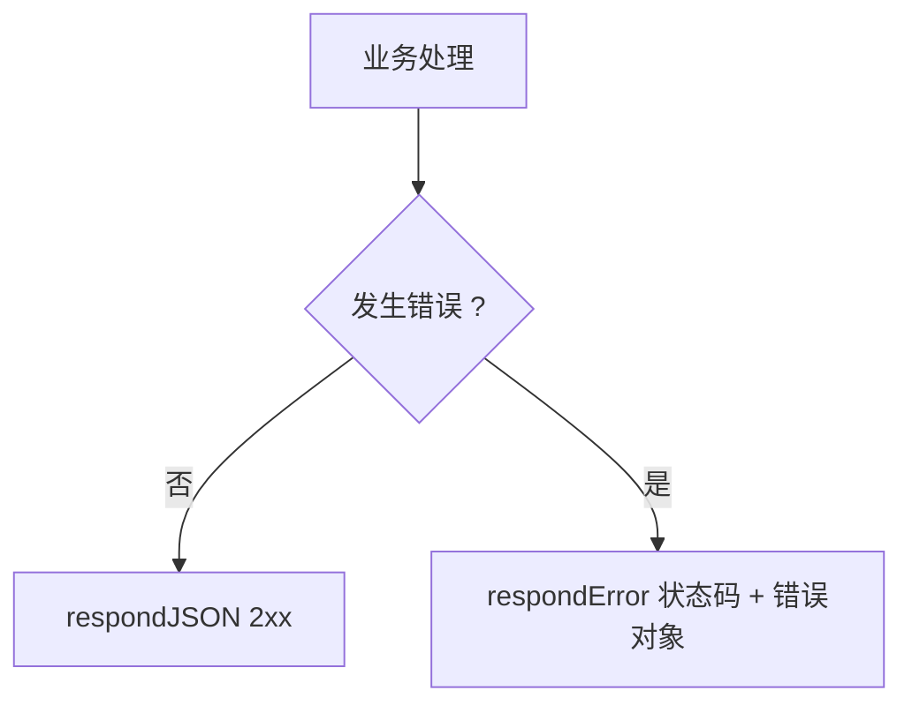
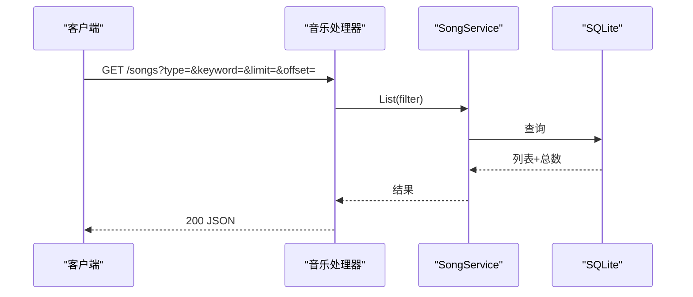
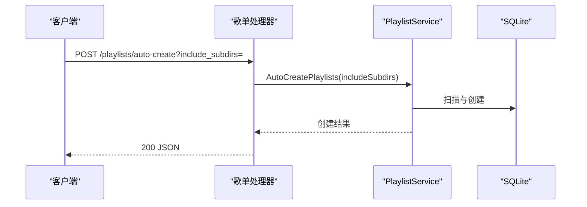
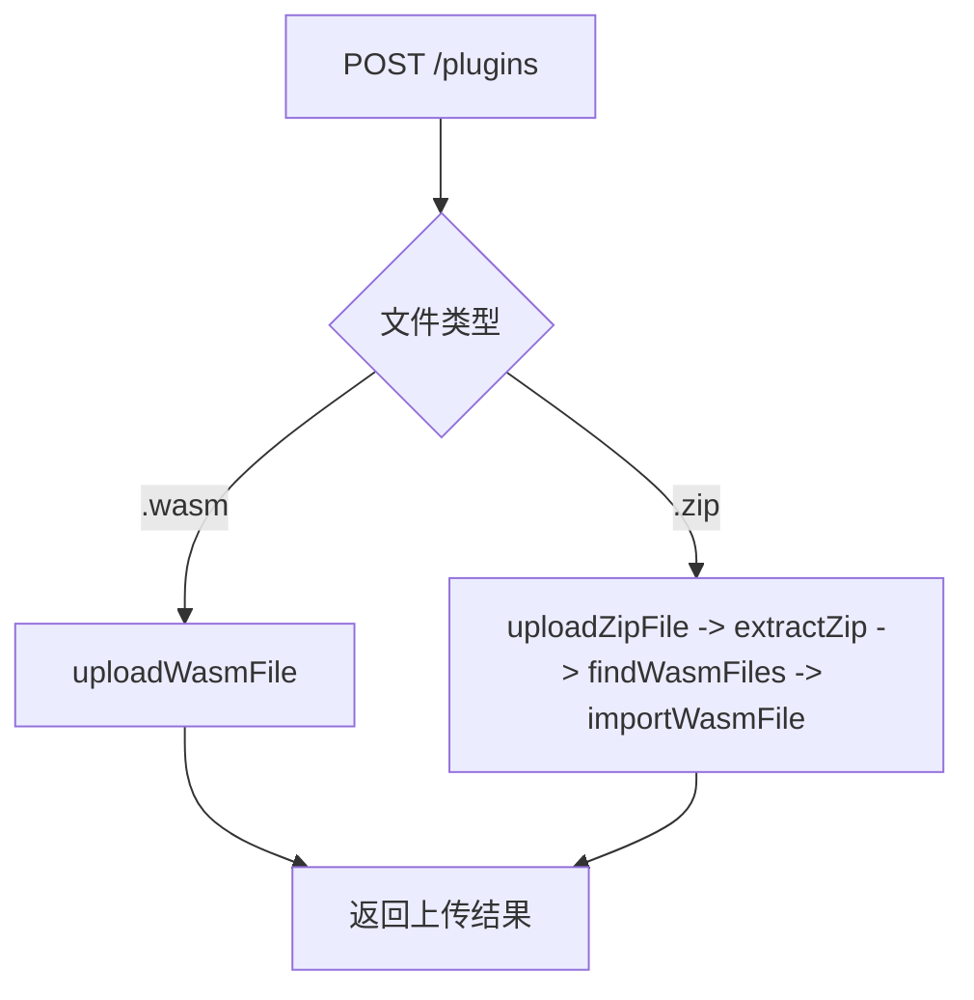
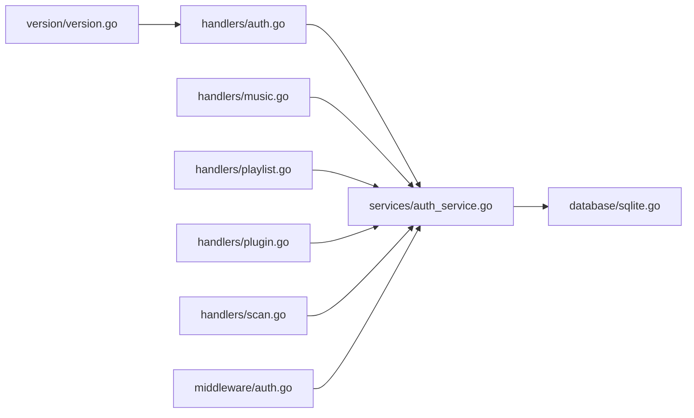

# API 接口设计

<cite>
**本文引用的文件**
- [swagger.yaml](file://docs/swagger.yaml)
- [swagger.json](file://docs/swagger.json)
- [auth.go](file://internal/handlers/auth.go)
- [music.go](file://internal/handlers/music.go)
- [playlist.go](file://internal/handlers/playlist.go)
- [plugin.go](file://internal/handlers/plugin.go)
- [response.go](file://internal/handlers/response.go)
- [models.go](file://internal/models/models.go)
- [auth_service.go](file://internal/services/auth_service.go)
- [auth.go](file://internal/middleware/auth.go)
- [scan.go](file://internal/handlers/scan.go)
- [sqlite.go](file://internal/database/sqlite.go)
- [router_dev.go](file://internal/app/router_dev.go)
- [version.go](file://internal/version/version.go)
- [main.go](file://main.go)
- [Makefile](file://Makefile)
</cite>

## 更新摘要
**变更内容**
- 更新 API 文档版本信息：从 1.3.10 升级到 1.3.12
- 同步多处版本信息的一致性（Swagger YAML/JSON、Makefile、main.go、version.go）
- 确保 OpenAPI 规范元数据的准确性

## 目录
1. [简介](#简介)
2. [项目结构](#项目结构)
3. [核心组件](#核心组件)
4. [架构总览](#架构总览)
5. [详细组件分析](#详细组件分析)
6. [依赖关系分析](#依赖关系分析)
7. [性能考虑](#性能考虑)
8. [故障排除指南](#故障排除指南)
9. [结论](#结论)
10. [附录](#附录)

## 简介
本文件基于 Swagger 规范与源码实现，系统性梳理 MiMusic 的 RESTful API 设计与实现细节。重点覆盖以下方面：
- 认证机制：基于 JWT 的双 Token（Access/Refresh）体系与安全策略
- 统一响应与错误处理：标准响应格式、错误码与异常流程
- API 端点清单：音乐管理、歌单操作、认证登录、插件管理、扫描与系统管理
- 客户端集成指南与最佳实践

**更新** API 文档版本已从 1.3.10 升级到 1.3.12，确保所有 Swagger/OpenAPI 规范元数据的准确性

## 项目结构
后端采用 Go 语言，以模块化方式组织：
- handlers：HTTP 层，负责路由、参数解析、响应封装与业务调用
- services：业务层，封装领域逻辑与外部交互
- models：数据模型与校验规则
- middleware：认证中间件
- database：SQLite 数据访问层
- docs：Swagger 文档定义
- version：版本信息管理

**图表来源**
- [auth.go:15-254](file://internal/handlers/auth.go#L15-L254)
- [music.go:17-450](file://internal/handlers/music.go#L17-L450)
- [playlist.go:15-473](file://internal/handlers/playlist.go#L15-L473)
- [plugin.go:21-607](file://internal/handlers/plugin.go#L21-L607)
- [auth_service.go:24-461](file://internal/services/auth_service.go#L24-L461)
- [models.go:64-436](file://internal/models/models.go#L64-L436)
- [auth.go:11-52](file://internal/middleware/auth.go#L11-L52)
- [sqlite.go:12-80](file://internal/database/sqlite.go#L12-L80)
- [version.go:1-19](file://internal/version/version.go#L1-L19)

**章节来源**
- [swagger.yaml:1-800](file://docs/swagger.yaml#L1-L800)
- [swagger.json:1-800](file://docs/swagger.json#L1-L800)

## 核心组件
- 认证与授权
  - 双 Token 体系：Access（短期）、Refresh（长期）
  - 中间件：统一校验 Authorization 头或 URL 查询参数
  - 服务：JWT 解析、撤销检查、缓存、插件专用 Token
- 统一响应
  - 成功：JSON 对象，按资源定义返回
  - 错误：统一 ErrorResponse，包含 error 与 detail
- 数据模型
  - Song、Playlist、Plugin、Config、Token 等结构体与校验
- 数据存储
  - SQLite，WAL 模式、连接池、外键约束与迁移
- 版本管理
  - 统一的版本信息管理，支持完整版本信息（包含 Git 提交和构建时间）

**章节来源**
- [auth_service.go:24-461](file://internal/services/auth_service.go#L24-L461)
- [auth.go:11-52](file://internal/middleware/auth.go#L11-L52)
- [response.go:8-25](file://internal/handlers/response.go#L8-L25)
- [models.go:64-436](file://internal/models/models.go#L64-L436)
- [sqlite.go:22-53](file://internal/database/sqlite.go#L22-L53)
- [version.go:1-19](file://internal/version/version.go#L1-L19)

## 架构总览
下图展示认证流程与关键组件交互：

**图表来源**
- [auth.go:27-62](file://internal/handlers/auth.go#L27-L62)
- [auth_service.go:94-164](file://internal/services/auth_service.go#L94-L164)
- [auth.go:12-51](file://internal/middleware/auth.go#L12-L51)
- [sqlite.go:12-80](file://internal/database/sqlite.go#L12-L80)

## 详细组件分析

### 认证与授权（JWT 双 Token）
- 登录
  - 输入：用户名/密码
  - 输出：AccessToken（短期）、RefreshToken（长期）、过期间隔、类型
  - 存储：将 Token 记录写入数据库，并清理过期记录
- 刷新
  - 输入：RefreshToken
  - 行为：撤销旧 RefreshToken，发放新 Access/Refresh Token
  - 校验：数据库撤销状态、类型与有效期
- 登出
  - 行为：撤销当前 Access/Refresh Token，并清除缓存
- 中间件
  - 优先从 Authorization: Bearer 获取
  - 回退到 URL 查询参数 access_token
  - 校验失败返回 401
- Token 缓存
  - 内存缓存有效/撤销状态，定期清理
- 插件专用 Token
  - 仅用于插件内部调用，不持久化，程序重启后重新生成

**图表来源**
- [auth.go:12-51](file://internal/middleware/auth.go#L12-L51)
- [auth_service.go:326-371](file://internal/services/auth_service.go#L326-L371)

**章节来源**
- [auth.go:27-134](file://internal/handlers/auth.go#L27-L134)
- [auth_service.go:94-324](file://internal/services/auth_service.go#L94-L324)
- [auth.go:12-51](file://internal/middleware/auth.go#L12-L51)
- [models.go:390-402](file://internal/models/models.go#L390-L402)

### 统一响应与错误处理
- 成功响应
  - JSON 对象，按资源定义返回
- 错误响应
  - 结构：{"error": "...", "detail"?: "..."}
  - 状态码：依据业务返回 4xx/5xx
- 响应工具
  - respondJSON：设置 Content-Type 与状态码
  - respondError：构造错误对象

**图表来源**
- [response.go:8-25](file://internal/handlers/response.go#L8-L25)

**章节来源**
- [response.go:8-25](file://internal/handlers/response.go#L8-L25)
- [models.go:244-253](file://internal/models/models.go#L244-L253)

### 音乐管理（歌曲）
- 列表：支持类型过滤、关键词搜索、分页
- 获取详情：按 ID
- 删除：按 ID
- 批量删除：传入 ID 列表
- 更新：仅允许更新远程/电台类歌曲信息
- 添加远程歌曲/电台
- 获取封面：按 ID 返回图片文件
- 清理无效本地歌曲：删除数据库记录与封面文件

**图表来源**
- [music.go:29-102](file://internal/handlers/music.go#L29-L102)

**章节来源**
- [music.go:29-450](file://internal/handlers/music.go#L29-L450)
- [models.go:64-122](file://internal/models/models.go#L64-L122)

### 歌单管理
- 列表：支持类型过滤、分页
- 获取详情：按 ID
- 创建/更新/删除：按资源定义
- 触摸更新：仅更新时间戳
- 歌单歌曲：
  - 获取：分页
  - 批量添加：去重
  - 移除：按 ID
  - 重新排序：按 ID 列表
- 自动创建：根据目录结构批量创建歌单

**图表来源**
- [playlist.go:443-472](file://internal/handlers/playlist.go#L443-L472)

**章节来源**
- [playlist.go:27-473](file://internal/handlers/playlist.go#L27-L473)
- [models.go:124-183](file://internal/models/models.go#L124-L183)

### 插件管理
- 列表/详情/删除：按 ID
- 上传：支持 .wasm 单文件或 .zip 批量导入
  - .zip：解压后递归查找 .wasm，逐个导入
  - 导入：复制文件至插件目录，读取元信息，创建记录
- 启用/禁用：按 ID

**图表来源**
- [plugin.go:92-134](file://internal/handlers/plugin.go#L92-L134)
- [plugin.go:219-289](file://internal/handlers/plugin.go#L219-L289)
- [plugin.go:358-381](file://internal/handlers/plugin.go#L358-L381)
- [plugin.go:383-490](file://internal/handlers/plugin.go#L383-L490)

**章节来源**
- [plugin.go:35-607](file://internal/handlers/plugin.go#L35-L607)
- [models.go:218-242](file://internal/models/models.go#L218-L242)

### 扫描与系统管理
- 扫描：异步扫描音乐目录，支持重新导入
- 进度：查询扫描进度
- 取消：取消进行中的扫描
- 健康检查：返回服务状态
- 版本：返回版本号、提交哈希、构建时间

**章节来源**
- [scan.go:27-94](file://internal/handlers/scan.go#L27-L94)
- [health.go:15-27](file://internal/handlers/health.go#L15-L27)
- [version.go:17-35](file://internal/handlers/version.go#L17-L35)

### 版本管理
- 版本信息：统一的版本管理机制，支持完整版本信息
- 构建信息：包含 Git 提交哈希和构建时间
- API 元数据：Swagger/OpenAPI 规范中的版本信息同步更新

**章节来源**
- [version.go:1-19](file://internal/version/version.go#L1-L19)
- [main.go:11-12](file://main.go#L11-L12)
- [Makefile:8](file://Makefile#L8)

## 依赖关系分析
- 处理器依赖服务层，服务层依赖数据库接口
- 认证中间件依赖认证服务，统一拦截未授权访问
- Swagger 文档与处理器注解保持一致，便于维护
- 版本信息在多个层面保持同步，确保一致性

**图表来源**
- [auth.go:15-254](file://internal/handlers/auth.go#L15-L254)
- [music.go:17-450](file://internal/handlers/music.go#L17-L450)
- [playlist.go:15-473](file://internal/handlers/playlist.go#L15-L473)
- [plugin.go:21-607](file://internal/handlers/plugin.go#L21-L607)
- [scan.go:10-94](file://internal/handlers/scan.go#L10-L94)
- [auth_service.go:24-461](file://internal/services/auth_service.go#L24-L461)
- [auth.go:11-52](file://internal/middleware/auth.go#L11-L52)
- [sqlite.go:12-80](file://internal/database/sqlite.go#L12-L80)
- [version.go:1-19](file://internal/version/version.go#L1-L19)

**章节来源**
- [swagger.yaml:524-800](file://docs/swagger.yaml#L524-L800)
- [swagger.json:19-800](file://docs/swagger.json#L19-L800)

## 性能考虑
- 数据库
  - WAL 模式提升并发读写性能
  - 连接池参数平衡吞吐与资源占用
  - 外键约束保障一致性
- 缓存
  - Token 内存缓存降低频繁解析与数据库查询
  - 定期清理过期缓存，避免内存膨胀
- 分页与限流
  - 处理器对分页参数进行限制，防止过大请求影响性能
- 文件上传
  - 限制表单内存与文件类型，避免大文件冲击
- 版本管理
  - 统一的版本信息管理减少重复配置，提高维护效率

**章节来源**
- [sqlite.go:22-53](file://internal/database/sqlite.go#L22-L53)
- [auth_service.go:194-210](file://internal/services/auth_service.go#L194-L210)
- [music.go:61-70](file://internal/handlers/music.go#L61-L70)
- [plugin.go:106-126](file://internal/handlers/plugin.go#L106-L126)
- [version.go:1-19](file://internal/version/version.go#L1-L19)

## 故障排除指南
- 401 未授权
  - 检查 Authorization 头或 URL 参数 access_token
  - 确认 Token 未过期且未被撤销
- 400 请求错误
  - 参数缺失或格式不正确（如歌曲/歌单/配置）
- 404 资源不存在
  - 歌曲、歌单、插件 ID 错误
- 409 扫描冲突
  - 扫描任务已在进行中
- 500 服务器错误
  - 数据库异常、文件读写失败、插件导入失败
- 版本不匹配
  - 确认客户端使用的 API 版本与服务端版本一致（1.3.12）

**章节来源**
- [response.go:15-24](file://internal/handlers/response.go#L15-L24)
- [auth.go:32-42](file://internal/middleware/auth.go#L32-L42)
- [music.go:120-124](file://internal/handlers/music.go#L120-L124)
- [scan.go:50-53](file://internal/handlers/scan.go#L50-L53)

## 结论
MiMusic 的 API 设计遵循 RESTful 原则，结合 Swagger 明确了端点、参数与响应规范。认证采用 JWT 双 Token 体系，配合中间件与内存缓存确保安全与性能。统一的响应与错误处理提升了客户端集成体验。版本管理机制确保了多层面信息的一致性。建议在生产环境进一步完善速率限制、审计日志与监控告警。

**更新** API 文档版本已升级到 1.3.12，确保了 Swagger/OpenAPI 规范元数据的准确性，为后续的客户端集成提供了可靠的版本基础。

## 附录

### API 端点一览（按模块）
- 认证管理
  - POST /auth/login：登录获取双 Token
  - POST /auth/logout：登出撤销当前会话
  - POST /auth/refresh：使用 RefreshToken 获取新 Token
  - GET /auth/tokens：列出活跃 Token（分页）
  - DELETE /auth/tokens/{token_id}：撤销指定 Token
  - GET /auth/tokens/{token_id}：获取 Token 详情（待实现）
- 配置管理
  - GET /configs：获取配置列表（关键词搜索、分页）
  - POST /configs：创建配置
  - GET /configs/{key}：获取单个配置
  - PUT /configs/{key}：更新配置
  - DELETE /configs/{key}：删除配置
- 歌曲管理
  - GET /songs：歌曲列表（类型/关键词/分页）
  - GET /songs/{id}：获取歌曲详情
  - DELETE /songs/{id}：删除歌曲
  - POST /songs/batch-delete：批量删除
  - PUT /songs/{id}：更新歌曲（远程/电台）
  - POST /songs/remote：添加远程歌曲
  - POST /songs/radio：添加电台
  - GET /songs/{id}/cover：获取封面图片
  - POST /songs/clean：清理无效本地歌曲
- 歌单管理
  - GET /playlists：歌单列表（类型/分页）
  - GET /playlists/{id}：歌单详情
  - POST /playlists：创建歌单
  - PUT /playlists/{id}：更新歌单
  - POST /playlists/{id}/touch：更新最后播放时间
  - DELETE /playlists/{id}：删除歌单
  - GET /playlists/{id}/songs：歌单歌曲（分页）
  - POST /playlists/{id}/songs：批量添加歌曲
  - DELETE /playlists/{id}/songs/{songId}：移除歌曲
  - PUT /playlists/{id}/songs/reorder：重新排序
  - POST /playlists/auto-create：根据目录结构自动创建歌单
- 插件管理
  - GET /plugins：插件列表
  - GET /plugins/{id}：插件详情
  - POST /plugins：上传插件（.wasm 或 .zip）
  - DELETE /plugins/{id}：删除插件
  - POST /plugins/{id}/enable：启用插件
  - POST /plugins/{id}/disable：禁用插件
- 扫描管理
  - POST /scan：启动扫描与导入（异步）
  - GET /scan/progress：获取扫描进度
  - POST /scan/cancel：取消扫描
- 系统管理
  - GET /health：健康检查
  - GET /version：版本信息

**章节来源**
- [swagger.yaml:524-800](file://docs/swagger.yaml#L524-L800)
- [swagger.json:19-800](file://docs/swagger.json#L19-L800)

### 客户端集成指南与最佳实践
- 认证
  - 优先使用 Authorization: Bearer 头传递 AccessToken
  - 若无法设置头（如静态资源加载），使用 URL 参数 access_token
  - AccessToken 过期后使用 RefreshToken 调用 /auth/refresh 获取新 Token
- 错误处理
  - 401：重新登录或刷新 Token
  - 400：修正请求参数
  - 404：确认资源 ID
  - 409：等待扫描任务完成
- 性能
  - 合理使用分页参数，避免一次性请求过多数据
  - 对封面等静态资源可利用浏览器缓存策略
- 安全
  - 保护好 RefreshToken，避免泄露
  - 定期撤销不必要的 Token
  - 上传插件前确保来源可信
- 版本兼容性
  - 确保客户端与服务端 API 版本兼容（1.3.12）
  - 关注版本更新日志，及时适配新特性

**章节来源**
- [auth.go:17-30](file://internal/middleware/auth.go#L17-L30)
- [auth.go:99-134](file://internal/handlers/auth.go#L99-L134)
- [response.go:15-24](file://internal/handlers/response.go#L15-L24)
- [version.go:10-18](file://internal/version/version.go#L10-L18)