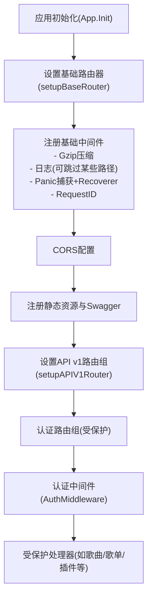
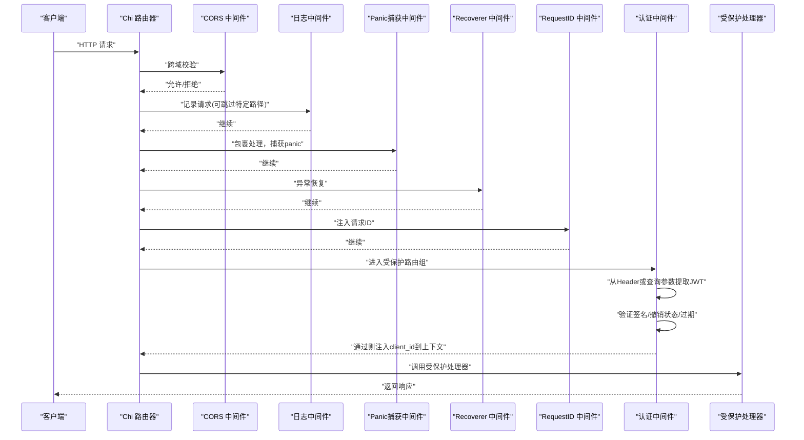
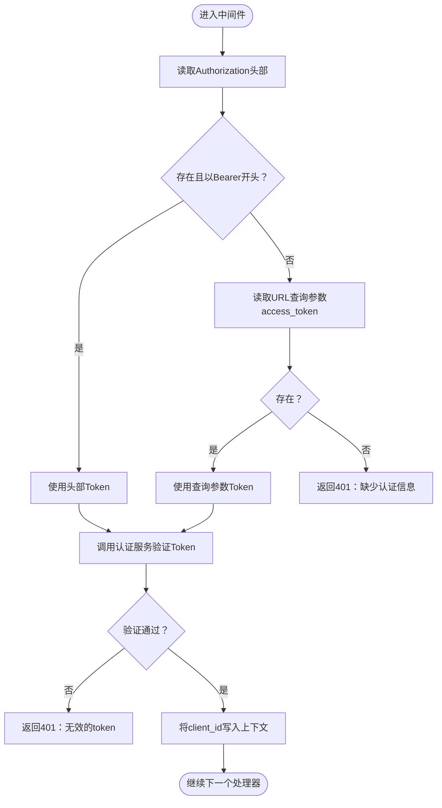
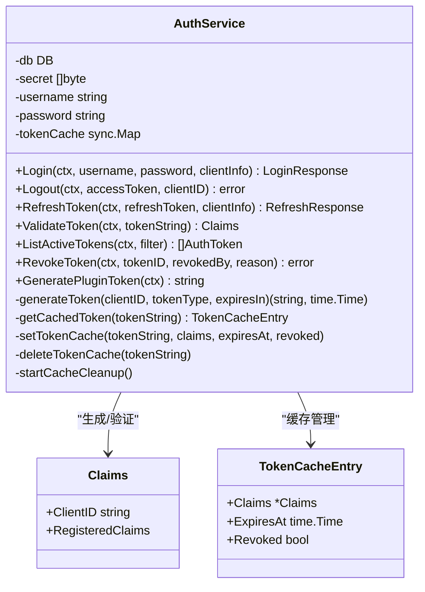
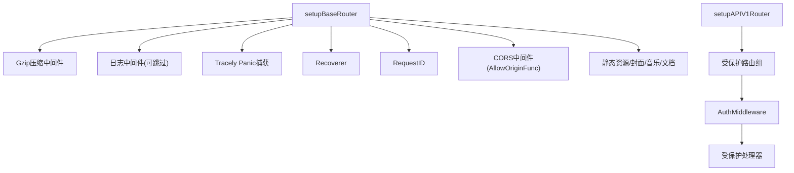
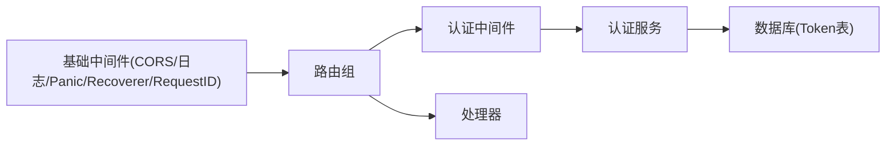

# 中间件设计

<cite>
**本文引用的文件**
- [internal/middleware/auth.go](file://internal/middleware/auth.go)
- [internal/middleware/auth_test.go](file://internal/middleware/auth_test.go)
- [internal/app/routers.go](file://internal/app/routers.go)
- [internal/app/app.go](file://internal/app/app.go)
- [internal/services/auth_service.go](file://internal/services/auth_service.go)
- [internal/database/sqlite_token.go](file://internal/database/sqlite_token.go)
- [internal/handlers/auth.go](file://internal/handlers/auth.go)
- [internal/handlers/response.go](file://internal/handlers/response.go)
- [internal/database/schema.go](file://internal/database/schema.go)
</cite>

## 目录
1. [简介](#简介)
2. [项目结构](#项目结构)
3. [核心组件](#核心组件)
4. [架构总览](#架构总览)
5. [详细组件分析](#详细组件分析)
6. [依赖分析](#依赖分析)
7. [性能考量](#性能考量)
8. [故障排查指南](#故障排查指南)
9. [结论](#结论)
10. [附录](#附录)

## 简介
本文件系统性阐述 MiMusic 的中间件设计与实现，重点覆盖认证中间件的架构模式、执行顺序、JWT 令牌验证、双 Token 机制与权限检查流程；同时说明中间件的配置与注册机制（CORS、日志、错误拦截），并提供扩展与自定义开发指南、测试与集成示例路径，以及在请求处理流水线中的作用与性能优化建议。

## 项目结构
MiMusic 的中间件与路由体系位于 Go 后端，采用 Chi 路由器进行分层组织：
- 应用初始化与路由装配集中在应用层
- 中间件以函数形式注入到路由组，形成“洋葱模型”的请求处理链
- 认证中间件对特定路由组生效，保障受保护接口的安全访问



图表来源
- [internal/app/routers.go:136-249](file://internal/app/routers.go#L136-L249)
- [internal/app/app.go:64-227](file://internal/app/app.go#L64-L227)

章节来源
- [internal/app/routers.go:136-249](file://internal/app/routers.go#L136-L249)
- [internal/app/app.go:64-227](file://internal/app/app.go#L64-L227)

## 核心组件
- 认证中间件：负责从请求头或查询参数提取 JWT，验证签名与撤销状态，并将客户端标识写入请求上下文
- 认证服务：封装 JWT 生成、解析、缓存、撤销检查与 Token 生命周期管理
- 数据层：维护 auth_tokens 表，提供 Token 创建、撤销、查询与过期清理
- 路由与处理器：定义公开与受保护接口，受保护接口统一通过认证中间件

章节来源
- [internal/middleware/auth.go:11-52](file://internal/middleware/auth.go#L11-L52)
- [internal/services/auth_service.go:24-73](file://internal/services/auth_service.go#L24-L73)
- [internal/database/sqlite_token.go:14-203](file://internal/database/sqlite_token.go#L14-L203)
- [internal/handlers/auth.go:15-254](file://internal/handlers/auth.go#L15-L254)

## 架构总览
下图展示了请求在中间件与处理器之间的流转顺序，以及认证中间件在受保护路由组中的关键位置。



图表来源
- [internal/app/routers.go:136-249](file://internal/app/routers.go#L136-L249)
- [internal/middleware/auth.go:11-52](file://internal/middleware/auth.go#L11-L52)

## 详细组件分析

### 认证中间件实现
- 输入来源优先级：Authorization 头部 Bearer，回退至 URL 查询参数 access_token（适配图片/音频等无法自定义 Header 的场景）
- 验证流程：调用认证服务解析 JWT，检查撤销状态与过期；成功后将 client_id 写入请求上下文
- 错误处理：缺失认证信息返回 401；无效 token 返回 401



图表来源
- [internal/middleware/auth.go:11-52](file://internal/middleware/auth.go#L11-L52)

章节来源
- [internal/middleware/auth.go:11-52](file://internal/middleware/auth.go#L11-L52)

### 认证服务与双 Token 机制
- 双 Token 设计：Access Token（短期，如 7 天）、Refresh Token（长期，如 30 天）
- 生成与存储：登录成功后生成并持久化两条 Token，清理过期记录
- 验证策略：先查内存缓存，再解析 JWT；对普通用户 Token 额外检查撤销状态；插件系统 Token 跳过数据库撤销检查
- 刷新流程：校验 Refresh Token 状态与类型，撤销旧 Token 对，生成新的 Access/Refresh Token
- 登出流程：撤销 Access Token 及同客户端下的 Refresh Token，并清除缓存



图表来源
- [internal/services/auth_service.go:24-73](file://internal/services/auth_service.go#L24-L73)
- [internal/services/auth_service.go:326-371](file://internal/services/auth_service.go#L326-L371)
- [internal/services/auth_service.go:388-423](file://internal/services/auth_service.go#L388-L423)

章节来源
- [internal/services/auth_service.go:94-164](file://internal/services/auth_service.go#L94-L164)
- [internal/services/auth_service.go:245-324](file://internal/services/auth_service.go#L245-L324)
- [internal/services/auth_service.go:326-371](file://internal/services/auth_service.go#L326-L371)
- [internal/services/auth_service.go:378-386](file://internal/services/auth_service.go#L378-L386)

### 数据模型与数据库交互
- 认证 Token 表结构：包含 token_id、token_type、client_info、expires_at、revoked_at、revoked_by、revoked_reason、created_at 等字段
- 关键操作：创建 Token、按 ID 查询、撤销、列出活跃 Token、清理过期、检查撤销状态
- 索引与约束：对 token_id、token_type、expires_at、revoked_at 建立索引，约束 token_type 为 access/refresh

```mermaid
erDiagram
AUTH_TOKENS {
integer id PK
text token_id UK
text token_type CK
text client_info
datetime expires_at
datetime revoked_at
text revoked_by
text revoked_reason
datetime created_at
}
CK_TOKEN_TYPE {
check (token_type in ('access','refresh'))
}
```

图表来源
- [internal/database/schema.go:61-72](file://internal/database/schema.go#L61-L72)

章节来源
- [internal/database/sqlite_token.go:14-203](file://internal/database/sqlite_token.go#L14-L203)
- [internal/database/schema.go:61-72](file://internal/database/schema.go#L61-L72)

### 路由与中间件注册机制
- 基础中间件：Gzip 压缩、日志（可跳过特定路径）、Tracely panic 捕获、Recoverer、RequestID
- CORS：自定义 AllowOriginFunc，支持本地/局域网/特定域名白名单，允许的方法与头，允许凭据
- 受保护路由组：在 /api/v1 下使用 AuthMiddleware，对认证相关与业务接口统一鉴权



图表来源
- [internal/app/routers.go:136-249](file://internal/app/routers.go#L136-L249)

章节来源
- [internal/app/routers.go:136-249](file://internal/app/routers.go#L136-L249)

### 处理器与错误响应
- 认证处理器：登录、登出、刷新 Token、列出/撤销 Token 等接口
- 统一响应：成功 JSON 与错误响应封装，便于前端一致处理

章节来源
- [internal/handlers/auth.go:15-254](file://internal/handlers/auth.go#L15-L254)
- [internal/handlers/response.go:8-25](file://internal/handlers/response.go#L8-L25)

## 依赖分析
- 认证中间件依赖认证服务进行 JWT 验证与撤销检查
- 认证服务依赖数据库层进行 Token 存取与撤销状态查询
- 路由层将认证中间件注入受保护路由组，形成安全边界
- CORS、日志、panic 捕获等基础中间件贯穿全局



图表来源
- [internal/middleware/auth.go:11-52](file://internal/middleware/auth.go#L11-L52)
- [internal/services/auth_service.go:24-73](file://internal/services/auth_service.go#L24-L73)
- [internal/database/sqlite_token.go:14-203](file://internal/database/sqlite_token.go#L14-L203)
- [internal/app/routers.go:136-249](file://internal/app/routers.go#L136-L249)

章节来源
- [internal/middleware/auth.go:11-52](file://internal/middleware/auth.go#L11-L52)
- [internal/services/auth_service.go:24-73](file://internal/services/auth_service.go#L24-L73)
- [internal/database/sqlite_token.go:14-203](file://internal/database/sqlite_token.go#L14-L203)
- [internal/app/routers.go:136-249](file://internal/app/routers.go#L136-L249)

## 性能考量
- Token 缓存：内存缓存提升验证吞吐，定期清理过期条目，避免频繁数据库查询
- Gzip 压缩：对文本/JSON/WASM 等静态资源启用压缩，降低传输体积
- 路由组隔离：仅在受保护路由组启用认证中间件，减少不必要的开销
- CORS 白名单：精确控制来源，避免不必要的预检请求
- 日志跳过：对高频健康/状态接口跳过日志，降低 I/O 压力

## 故障排查指南
- 缺少认证信息：确认请求头 Authorization 或 URL 查询参数 access_token 是否正确传递
- 无效 Token：检查签名密钥一致性、是否被撤销、是否过期
- 登出/刷新异常：核对数据库中 Token 状态与撤销记录
- CORS 拒绝：确认来源是否在白名单范围内，是否携带凭据

章节来源
- [internal/middleware/auth.go:32-42](file://internal/middleware/auth.go#L32-L42)
- [internal/services/auth_service.go:326-371](file://internal/services/auth_service.go#L326-L371)
- [internal/database/sqlite_token.go:75-97](file://internal/database/sqlite_token.go#L75-L97)
- [internal/app/routers.go:177-236](file://internal/app/routers.go#L177-L236)

## 结论
MiMusic 的中间件体系以“洋葱模型”组织，认证中间件在受保护路由组中承担统一鉴权职责。通过 JWT 双 Token 机制与内存缓存，结合数据库的撤销与过期管理，实现了高可用与高性能的认证方案。基础中间件（CORS、日志、错误恢复）确保了服务的稳定性与可观测性。整体设计清晰、扩展性强，便于后续新增中间件与自定义认证策略。

## 附录

### 中间件扩展与自定义开发指南
- 新增中间件：在路由层使用 router.Use 注入，或在受保护路由组中使用 r.Use 注入
- 认证扩展：可在认证中间件中增加额外校验（如 IP 白名单、设备指纹），并将结果写入上下文
- CORS 扩展：在 AllowOriginFunc 中加入更多域名规则或动态来源校验
- 错误拦截：结合 Recoverer 与 Tracely 捕获中间件，统一记录与上报

章节来源
- [internal/app/routers.go:136-249](file://internal/app/routers.go#L136-L249)

### 代码示例路径（测试与集成）
- 认证中间件成功与失败测试：[internal/middleware/auth_test.go:14-109](file://internal/middleware/auth_test.go#L14-L109)
- 认证处理器接口：[internal/handlers/auth.go:27-134](file://internal/handlers/auth.go#L27-L134)
- 统一响应封装：[internal/handlers/response.go:8-25](file://internal/handlers/response.go#L8-L25)
- 应用初始化与路由装配：[internal/app/app.go:64-227](file://internal/app/app.go#L64-L227)

章节来源
- [internal/middleware/auth_test.go:14-109](file://internal/middleware/auth_test.go#L14-L109)
- [internal/handlers/auth.go:27-134](file://internal/handlers/auth.go#L27-L134)
- [internal/handlers/response.go:8-25](file://internal/handlers/response.go#L8-L25)
- [internal/app/app.go:64-227](file://internal/app/app.go#L64-L227)