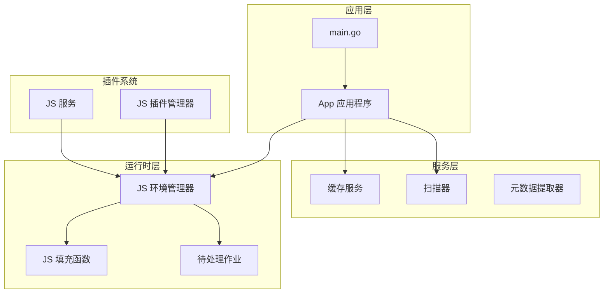
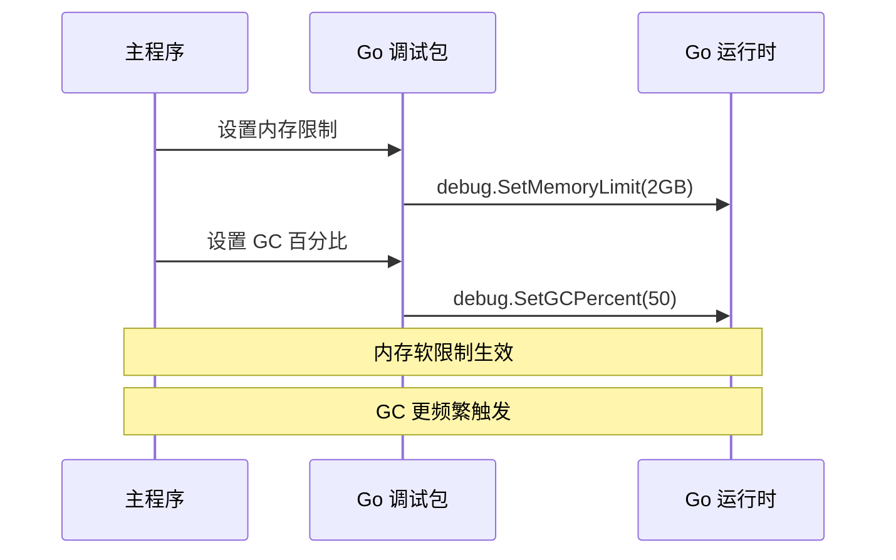
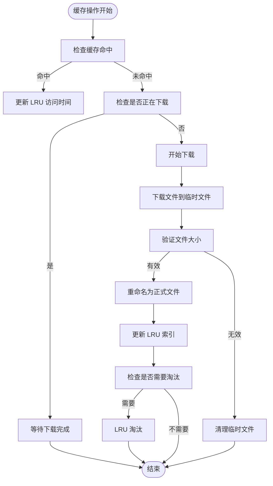
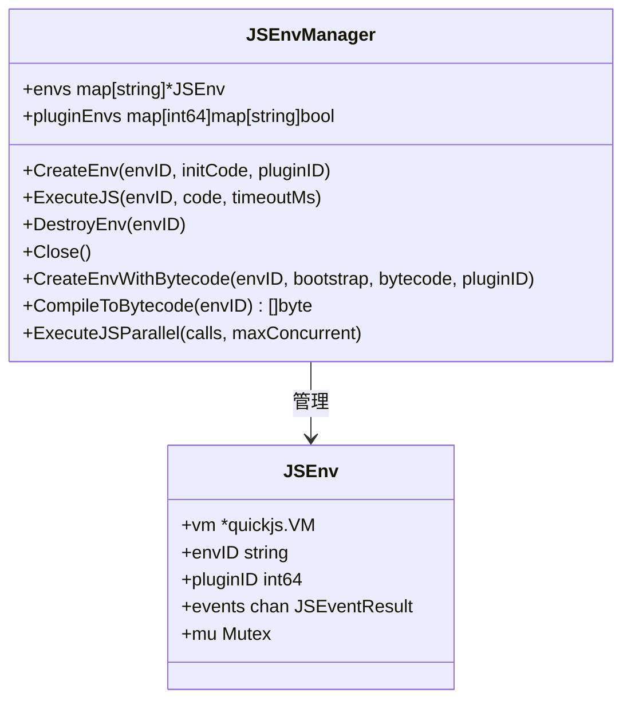
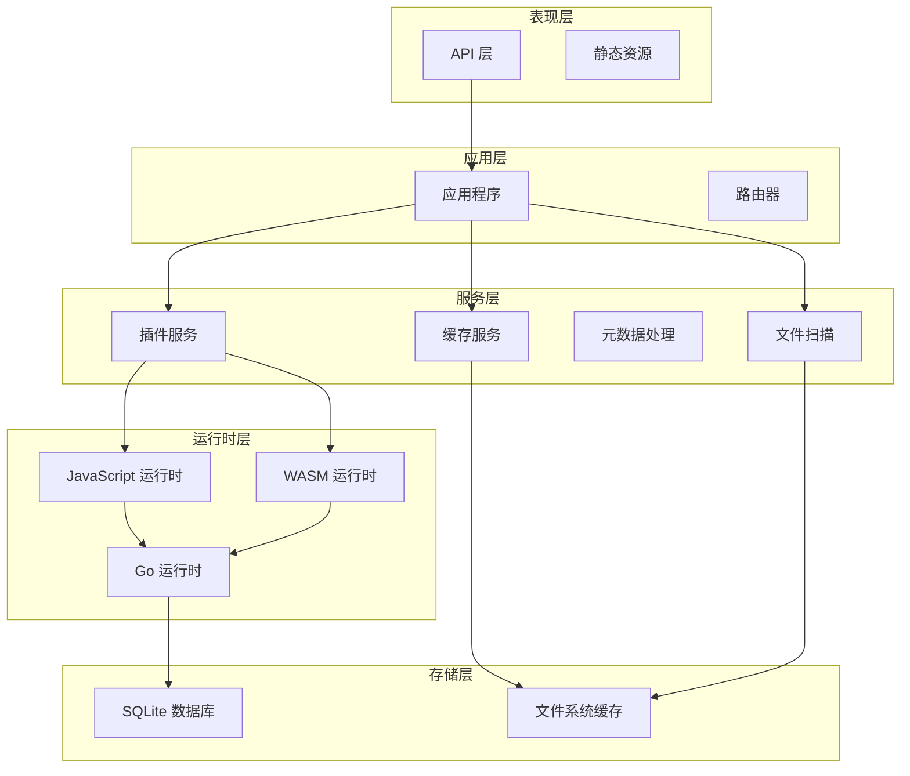
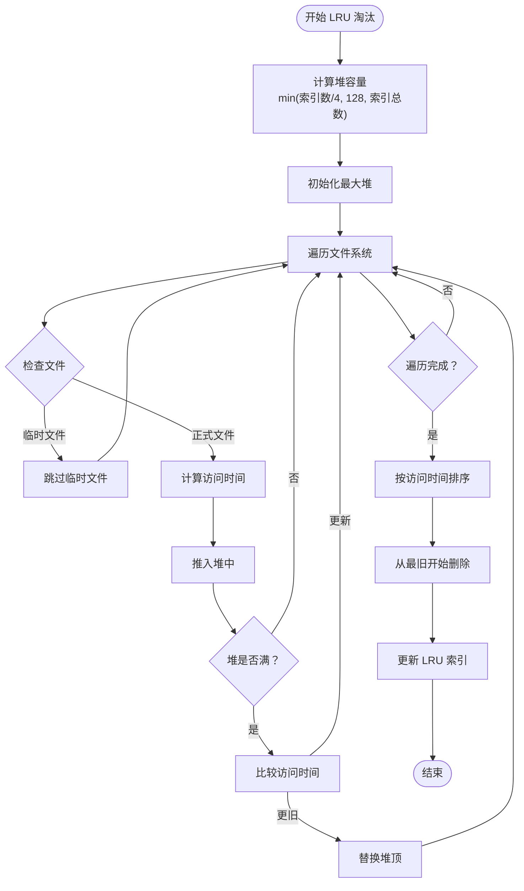
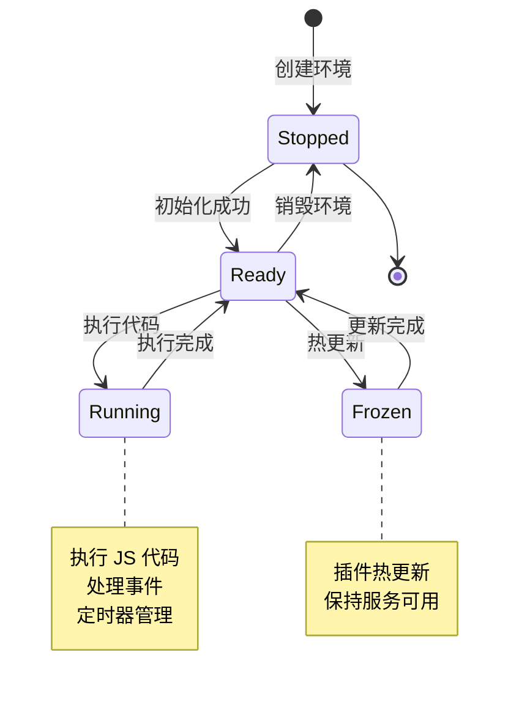
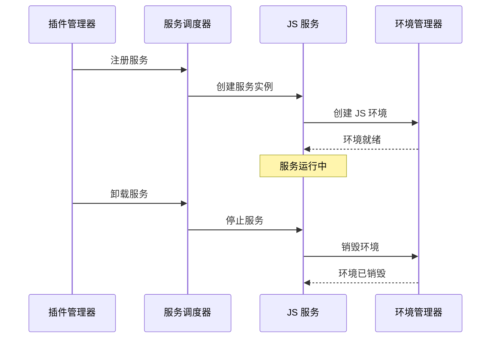
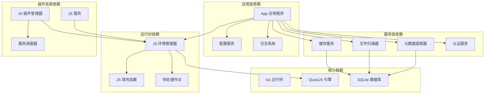

# 内存优化系统

<cite>
**本文档引用的文件**
- [main.go](file://main.go)
- [app.go](file://internal/app/app.go)
- [cache_service.go](file://internal/services/cache_service.go)
- [runtime.go](file://internal/jsruntime/runtime.go)
- [polyfill.go](file://internal/jsruntime/polyfill.go)
- [pendingjob.go](file://internal/jsruntime/pendingjob.go)
- [manager.go](file://internal/jsplugin/manager.go)
- [service.go](file://internal/jsplugin/service.go)
- [scanner.go](file://internal/services/scanner.go)
- [types.go](file://internal/config/types.go)
</cite>

## 目录
1. [简介](#简介)
2. [项目结构](#项目结构)
3. [核心组件](#核心组件)
4. [架构概览](#架构概览)
5. [详细组件分析](#详细组件分析)
6. [依赖关系分析](#依赖关系分析)
7. [性能考虑](#性能考虑)
8. [故障排除指南](#故障排除指南)
9. [结论](#结论)

## 简介

MiMusic 是一个轻量级音乐服务器，采用 Go 语言开发，具备强大的内存优化系统。该项目实现了多层次的内存管理策略，包括 Go 运行时级别的内存限制、垃圾回收优化、JavaScript 运行时的内存控制，以及缓存系统的智能淘汰机制。

系统的核心内存优化策略包括：
- Go 运行时内存软限制设置
- 垃圾回收频率调整
- JavaScript VM 内存管理
- LRU 缓存淘汰算法
- 插件环境生命周期管理
- 资源及时释放机制

## 项目结构

项目采用模块化的架构设计，主要分为以下几个核心模块：

**图表来源**
- [main.go:1-79](file://main.go#L1-L79)
- [app.go:30-48](file://internal/app/app.go#L30-L48)

**章节来源**
- [main.go:1-79](file://main.go#L1-L79)
- [app.go:1-486](file://internal/app/app.go#L1-L486)

## 核心组件

### Go 运行时内存管理

系统在启动时设置了内存软限制和垃圾回收参数，这是内存优化的基础配置。

**图表来源**
- [main.go:12-24](file://main.go#L12-L24)

### 缓存服务内存优化

缓存服务实现了智能的内存管理和淘汰策略，采用 LRU 算法优化内存使用。

**图表来源**
- [cache_service.go:149-297](file://internal/services/cache_service.go#L149-L297)
- [cache_service.go:540-644](file://internal/services/cache_service.go#L540-L644)

### JavaScript 运行时内存控制

JS 运行时管理系统提供了精细的内存控制机制，包括环境生命周期管理和资源清理。

**图表来源**
- [runtime.go:42-96](file://internal/jsruntime/runtime.go#L42-L96)
- [runtime.go:81-86](file://internal/jsruntime/runtime.go#L81-L86)

**章节来源**
- [cache_service.go:1-673](file://internal/services/cache_service.go#L1-L673)
- [runtime.go:1-800](file://internal/jsruntime/runtime.go#L1-L800)

## 架构概览

系统采用分层架构设计，每层都有专门的内存优化策略：

**图表来源**
- [app.go:30-48](file://internal/app/app.go#L30-L48)
- [manager.go:19-37](file://internal/jsplugin/manager.go#L19-L37)

## 详细组件分析

### 缓存服务优化策略

缓存服务实现了多项内存优化技术：

#### LRU 淘汰算法优化

传统的 LRU 实现需要遍历所有文件来确定最久未使用的文件，这在大量文件时会产生巨大的内存开销。系统采用了优化的 LRU 算法：

**图表来源**
- [cache_service.go:540-644](file://internal/services/cache_service.go#L540-L644)

#### 并发下载控制

系统实现了智能的并发下载控制，避免同时下载大量文件导致内存峰值：

- 使用 `inflight` 映射跟踪正在进行的下载
- 同一 hash 的重复下载会被等待而不是并发执行
- 下载完成后自动清理内存资源

#### 内存限制和超时控制

- HTTP 客户端超时设置为 120 秒
- 默认 JS 执行超时为 30 秒
- 连接池管理，限制最大空闲连接数

**章节来源**
- [cache_service.go:42-83](file://internal/services/cache_service.go#L42-L83)
- [cache_service.go:149-181](file://internal/services/cache_service.go#L149-L181)

### JavaScript 运行时优化

#### 环境生命周期管理

JS 运行时管理系统提供了完整的环境生命周期控制：

**图表来源**
- [service.go:17-41](file://internal/jsplugin/service.go#L17-L41)

#### 内存泄漏防护

系统采用了多种机制防止内存泄漏：

- 及时销毁不再使用的 JS 环境
- 自动清理定时器和事件监听器
- 监控和限制单个插件的内存使用
- 支持插件级别的资源隔离

**章节来源**
- [runtime.go:369-448](file://internal/jsruntime/runtime.go#L369-L448)
- [service.go:242-270](file://internal/jsplugin/service.go#L242-L270)

### 插件系统内存优化

#### 插件环境共享

系统实现了插件环境的共享机制，减少内存占用：

- 多个插件可以共享同一个 JS 运行时
- 插件间资源共享，避免重复加载
- 独立的内存空间隔离

#### 动态加载和卸载

**图表来源**
- [manager.go:142-185](file://internal/jsplugin/manager.go#L142-L185)

**章节来源**
- [manager.go:19-362](file://internal/jsplugin/manager.go#L19-L362)
- [service.go:82-204](file://internal/jsplugin/service.go#L82-L204)

### 文件扫描器优化

文件扫描器实现了高效的文件遍历算法，避免内存峰值：

- 使用 `visited` 映射防止循环软链接
- 支持上下文取消，及时响应停止信号
- 智能排除配置，减少不必要的文件处理

**章节来源**
- [scanner.go:27-123](file://internal/services/scanner.go#L27-L123)

## 依赖关系分析

系统各组件之间的依赖关系如下：

**图表来源**
- [app.go:3-28](file://internal/app/app.go#L3-L28)
- [types.go:3-10](file://internal/config/types.go#L3-L10)

**章节来源**
- [app.go:1-486](file://internal/app/app.go#L1-L486)
- [types.go:1-11](file://internal/config/types.go#L1-L11)

## 性能考虑

### 内存使用优化策略

1. **分层内存管理**
   - 应用层：Go 运行时内存限制
   - 服务层：缓存和数据结构优化
   - 运行时层：JS VM 内存控制

2. **垃圾回收优化**
   - 降低 GC 百分比到 50%，增加 GC 频率
   - 更积极的内存回收，减少内存峰值

3. **缓存策略优化**
   - LRU 淘汰算法，避免全量扫描
   - 智能堆容量计算，平衡内存和性能
   - 异步淘汰，不影响主线程性能

4. **资源生命周期管理**
   - 及时释放不再使用的资源
   - 插件环境的动态创建和销毁
   - 连接池管理，复用网络连接

### 性能监控和调优

系统提供了多种性能监控机制：

- 缓存统计信息（总大小、文件数量、最大限制）
- 插件内存使用情况监控
- GC 活动统计
- 内存泄漏检测

## 故障排除指南

### 常见内存问题及解决方案

#### 缓存内存不足

**问题症状**：
- 缓存目录大小超过配置限制
- LRU 淘汰频繁发生
- 系统内存使用持续增长

**解决方法**：
1. 调整缓存最大大小配置
2. 检查缓存淘汰策略是否正常工作
3. 监控缓存命中率

#### JS 运行时内存泄漏

**问题症状**：
- JS 环境数量持续增长
- 内存使用缓慢但持续上升
- 插件停止后资源未释放

**解决方法**：
1. 确保及时调用 `DestroyEnv()` 方法
2. 检查插件代码中的资源清理
3. 监控插件的内存使用情况

#### 插件冲突导致的内存问题

**问题症状**：
- 特定插件导致内存异常增长
- 插件间资源共享出现问题
- 插件热更新失败

**解决方法**：
1. 独立测试每个插件的内存使用
2. 检查插件间的依赖关系
3. 实施插件级别的资源隔离

**章节来源**
- [cache_service.go:457-509](file://internal/services/cache_service.go#L457-L509)
- [runtime.go:369-448](file://internal/jsruntime/runtime.go#L369-L448)

## 结论

MiMusic 的内存优化系统通过多层次的设计实现了高效的内存管理：

1. **基础层优化**：Go 运行时级别的内存限制和 GC 调整
2. **服务层优化**：智能缓存淘汰和资源管理
3. **运行时优化**：JS VM 内存控制和生命周期管理
4. **插件系统优化**：动态资源分配和隔离机制

这些优化策略共同作用，使得系统能够在处理大量音乐文件和复杂插件功能的同时，保持稳定的内存使用和良好的性能表现。系统的内存优化不仅关注当前的内存使用，还考虑了长期的可维护性和扩展性，为未来的功能扩展奠定了坚实的内存管理基础。

通过合理的配置和监控，用户可以根据实际需求调整内存优化策略，在性能和资源使用之间找到最佳平衡点。