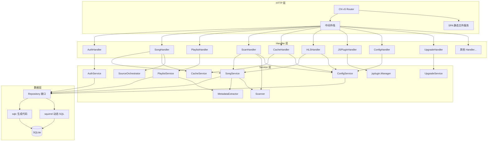
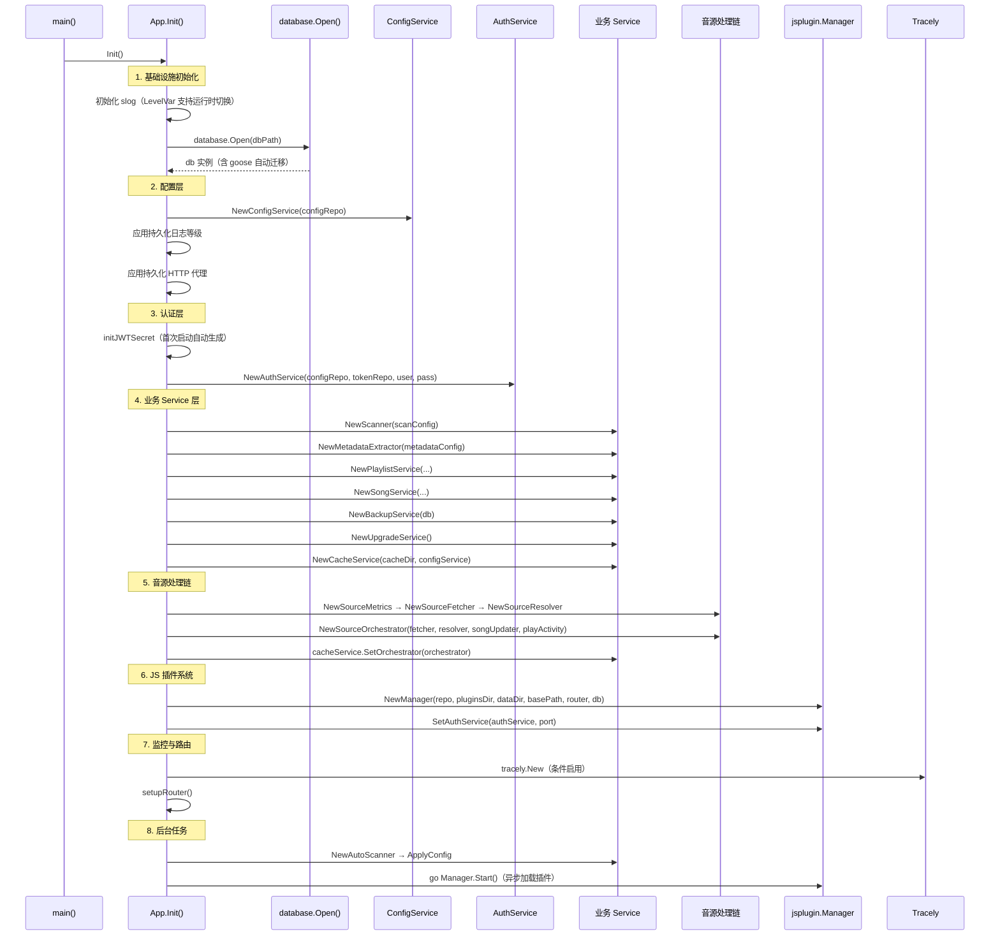
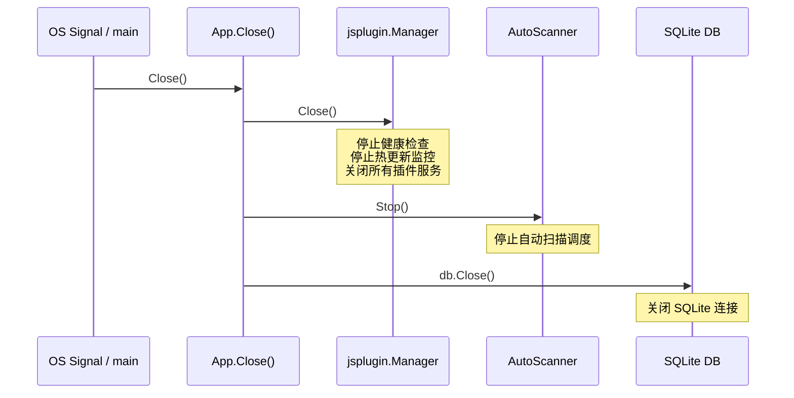
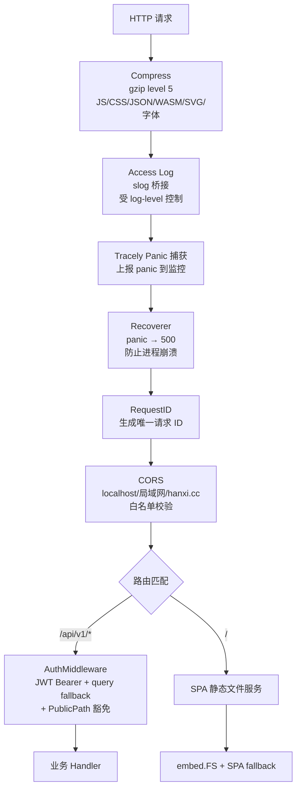
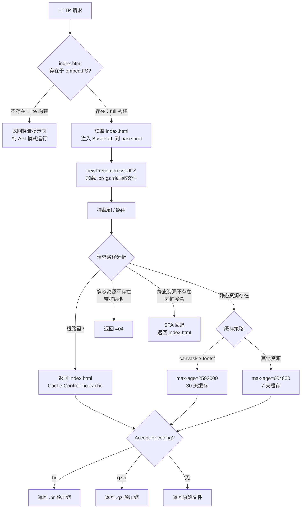

# 后端系统设计

本文档描述 Songloft 后端的整体架构、初始化序列、生命周期管理、中间件栈以及静态文件服务机制。
源码位于 <code>internal/app/</code> 和 <code>internal/config/</code>。

## 目录

1. [后端整体架构概览](#1-后端整体架构概览)
2. [App 初始化序列](#2-app-初始化序列)
3. [App 生命周期](#3-app-生命周期)
4. [中间件栈排列](#4-中间件栈排列)
5. [静态文件服务架构](#5-静态文件服务架构)

---

## 1. 后端整体架构概览

Songloft 后端采用经典的三层分层架构，以 `App` 结构体作为顶层容器完成所有依赖的装配与生命周期管理。



**图表来源**：`internal/app/app.go`（依赖注入）、`internal/app/routers.go`（路由注册）

核心设计原则：

- **依赖注入**：Service 层只接收 Repository 接口，不接收 `DB` 实例本身
- **固定 SQL + 动态 SQL 双轨**：确定查询走 sqlc 代码生成，变长 WHERE/SET 走 squirrel 构建
- **跨表写操作**：统一通过 `db.RunInTx(ctx, func(ctx, uow))` 使用同一 `*sql.Tx`，避免 SQLITE_BUSY

**章节来源**：`internal/app/app.go`、`internal/app/routers.go`

---

## 2. App 初始化序列

`App.Init()` 方法是整个后端的启动入口，按严格的依赖顺序完成所有组件的创建和装配。



**图表来源**：`internal/app/app.go` Init() 方法

初始化各阶段的关键细节：

| 阶段 | 组件 | 要点 |
|------|------|------|
| 基础设施 | slog + DB | `LevelVar` 支持运行时动态切换日志等级；DB 打开时 goose 自动执行迁移 |
| 配置层 | ConfigService | 从 `configs` 表读取所有持久化配置（日志等级、HTTP 代理、音乐路径等） |
| 认证层 | JWT + AuthService | 首次启动自动生成 `jwt_secret` 并持久化；双 Token（access + refresh）机制 |
| 业务层 | Song/Playlist/Cache 等 | 各 Service 仅注入 Repository 接口，通过 `Set*` 方法延迟注入交叉依赖 |
| 音源链 | Fetcher → Resolver → Orchestrator | 通过 adapter 接口与 `jsplugin.Manager` / `MetadataExtractor` 解耦 |
| 插件系统 | jsplugin.Manager | 异步启动（`go Manager.Start`），含插件加载 + 健康检查 + 文件指纹热更新 |
| 后台任务 | AutoScanner | 从持久化配置恢复自动扫描调度 |

**章节来源**：`internal/app/app.go` Init() 方法（L87-L391）

---

## 3. App 生命周期

### 3.1 启动流程 (Start)

`App.Start()` 在 `Init()` 完成后被调用，负责将 Chi router 挂载到 HTTP server 并开始监听。

```go
func (a *App) Start() error {
    var handler http.Handler = a.router
    if a.config.BasePath != "" {
        mux := http.NewServeMux()
        mux.Handle(a.config.BasePath+"/", http.StripPrefix(a.config.BasePath, a.router))
        handler = mux
    }
    return http.ListenAndServe(":"+a.config.Port, handler)
}
```

当配置了 `BasePath`（如 `/songloft`）时，Start 会在最外层用 `http.StripPrefix` 剥离前缀，确保 Chi router 内部的路由匹配不受子路径部署影响。同时还注册了一个精确匹配 `BasePath`（无尾斜杠）的 301 重定向，保证用户访问 `/songloft` 时自动跳转到 `/songloft/`。

### 3.2 关闭流程 (Close)

`App.Close()` 按依赖关系的逆序关闭各组件：



**图表来源**：`internal/app/app.go` Close() 方法（L72-L85）

关闭顺序遵循"先停止生产者、再关闭消费者、最后关闭存储"的原则：JS 插件管理器（可能产生 DB 写入）先关闭，AutoScanner（依赖 SongService）随后停止，最后关闭数据库连接。

**章节来源**：`internal/app/app.go` Start()（L459-L483）、Close()（L72-L85）

---

## 4. 中间件栈排列

中间件在 `setupBaseRouter()` 中按顺序注册到 Chi router，请求从上到下依次经过各中间件，响应按逆序返回。



**图表来源**：`internal/app/routers.go` setupBaseRouter()（L237-L349）

各中间件的职责说明：

| 中间件 | 来源 | 职责 |
|--------|------|------|
| **Compress** | chi middleware | 对 9 种 MIME 类型启用 gzip level 5 压缩 |
| **Access Log** | `access_log.go` slogLogFormatter | 将 chi access log 桥接到 slog，支持 `/settings/log-level` 动态控制 |
| **Tracely Panic** | 内联 defer/recover | 在 Recoverer 之前捕获 panic 并上报到 Tracely 监控，随后重新 panic |
| **Recoverer** | chi middleware | 捕获 panic 返回 500，防止单次请求导致进程崩溃 |
| **RequestID** | chi middleware | 为每个请求生成唯一 ID，供日志关联和调试 |
| **CORS** | go-chi/cors | 按来源白名单（localhost、局域网段、hanxi.cc 域）校验跨域请求 |
| **Auth** | `middleware/auth.go` | JWT Bearer token 校验，支持 `access_token` query 回退（音频/图片场景）；可选 `PublicPathChecker` 豁免插件声明的公开路径 |

Auth 中间件仅应用于 `/api/v1/*` 路由组和 JS 插件 API 路由，静态文件服务和公开端点（`/health`、`/version`、`/auth/login`、`/auth/refresh`）不经过认证。

**章节来源**：`internal/app/routers.go`（L237-L349）、`internal/app/access_log.go`、`internal/middleware/auth.go`

---

## 5. 静态文件服务架构

静态文件服务由 `embed.go` 实现，负责将 Flutter Web 前端嵌入 Go 二进制并在运行时提供 SPA 路由回退。



**图表来源**：`internal/app/embed.go`（L17-L98）、`internal/app/compress.go`（L32-L78）

### 5.1 构建模式与静态服务行为

| 构建模式 | embed.FS 状态 | 行为 |
|----------|--------------|------|
| **Full 构建**（默认） | 包含 `songloft-player-build/web-embedded/` | 完整 SPA 服务，支持预压缩 |
| **Lite 构建**（`-tags lite`） | embed.FS 为空 | 根路径返回轻量提示页，纯 API 模式 |

### 5.2 预压缩文件服务 (compress.go)

`precompressedFS` 在启动时从 embed.FS 中加载构建期生成的 `.br`（Brotli）和 `.gz`（Gzip）预压缩文件。请求到达时按 `Accept-Encoding` 优先级选择：

1. **Brotli** (`br`)：压缩率最高，现代浏览器均支持
2. **Gzip** (`gzip`)：兼容性最广的回退方案
3. **原始文件**：不支持压缩编码时从 embed.FS 读取原文件

对于 `BasePath` 注入后内容已变的 `index.html`，`addCustomEntry()` 会在运行时重新执行 Brotli/Gzip 压缩，确保预压缩缓存始终与实际内容一致。

ETag 基于 CRC32 校验和生成，配合 `If-None-Match` 实现 304 Not Modified 响应，减少传输开销。

### 5.3 SPA 路由回退规则

SPA fallback 的判定逻辑区分了静态资源请求和前端路由请求：

- **路径含扩展名**（如 `.js`、`.css`、`.png`）：在 embed.FS 中查找，未命中直接返回 404，避免前端误将 HTML 当 JS/JSON 解析
- **路径无扩展名**（如 `/settings`、`/playlists/1`）：视为前端路由，返回 `index.html` 交给 Flutter 客户端路由处理

**章节来源**：`internal/app/embed.go`、`internal/app/compress.go`
