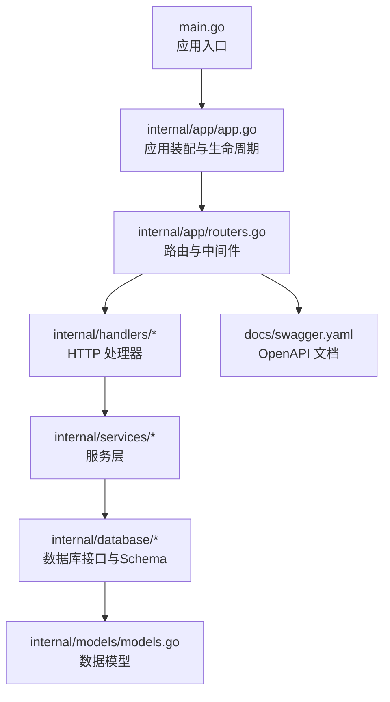
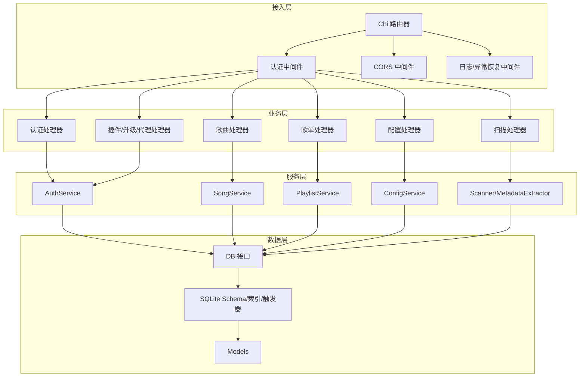
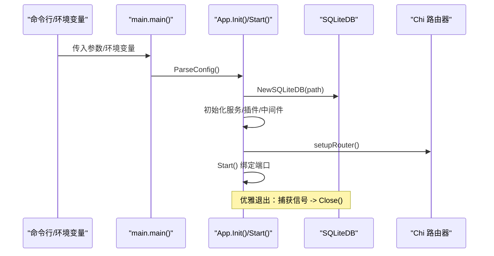
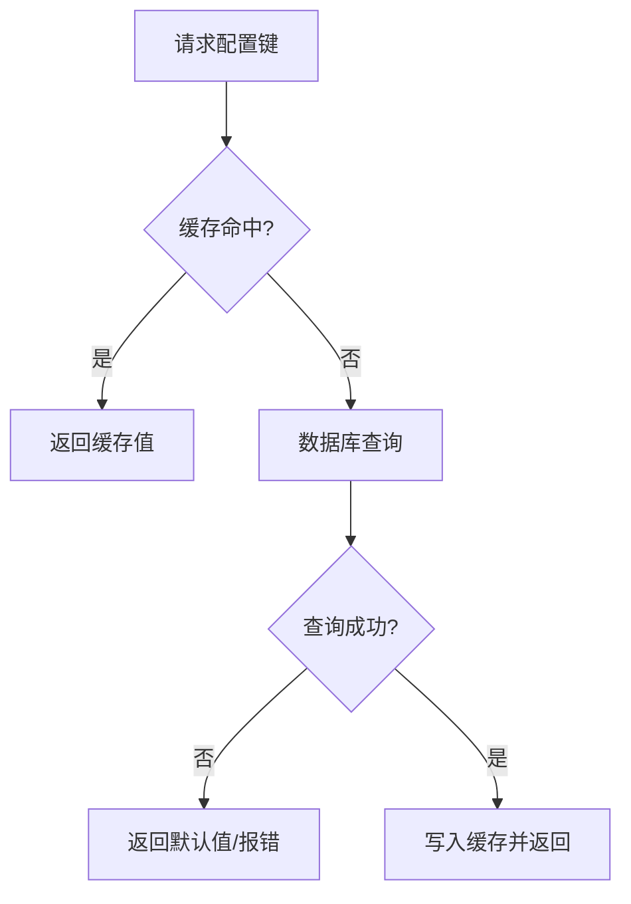
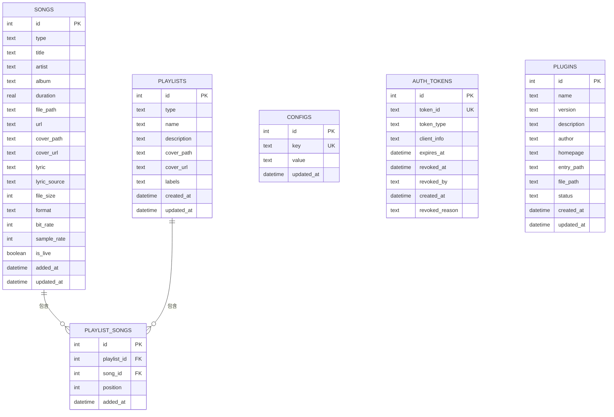
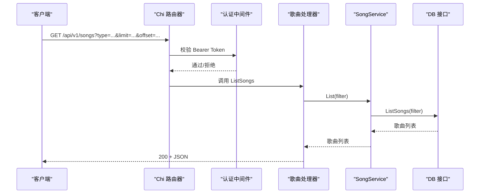
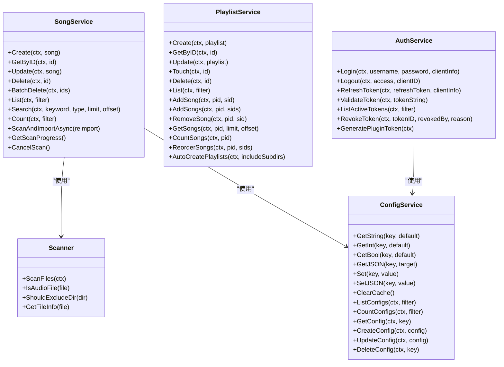
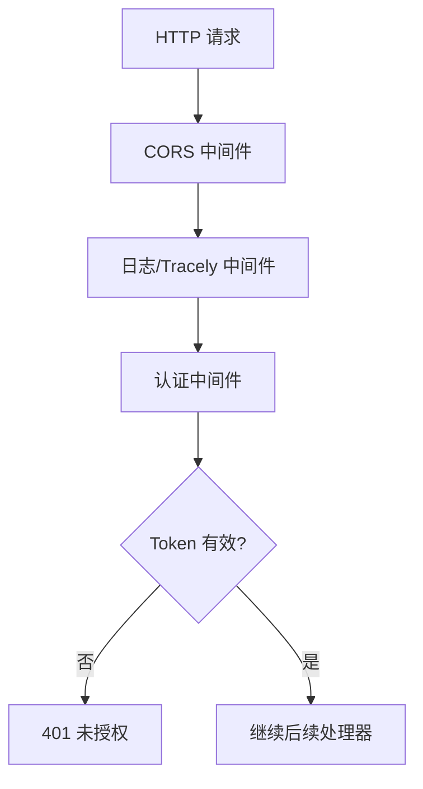
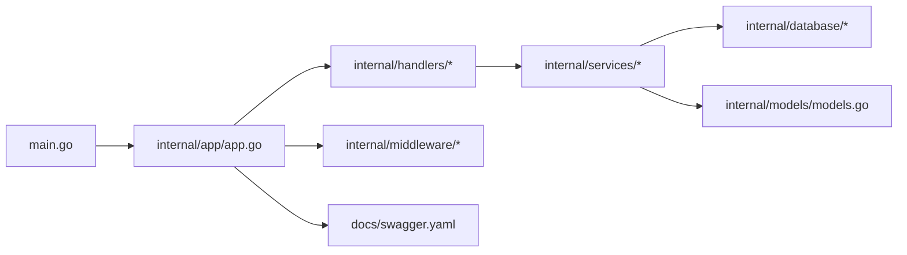

# 后端系统设计

<cite>
**本文引用的文件**
- [main.go](file://main.go)
- [app.go](file://internal/app/app.go)
- [routers.go](file://internal/app/routers.go)
- [types.go](file://internal/config/types.go)
- [database.go](file://internal/database/database.go)
- [schema.go](file://internal/database/schema.go)
- [models.go](file://internal/models/models.go)
- [song_service.go](file://internal/services/song_service.go)
- [playlist_service.go](file://internal/services/playlist_service.go)
- [auth_service.go](file://internal/services/auth_service.go)
- [scanner.go](file://internal/services/scanner.go)
- [config_service.go](file://internal/services/config_service.go)
- [music.go](file://internal/handlers/music.go)
- [auth.go](file://internal/middleware/auth.go)
- [swagger.yaml](file://docs/swagger.yaml)
</cite>

## 目录
1. [简介](#简介)
2. [项目结构](#项目结构)
3. [核心组件](#核心组件)
4. [架构总览](#架构总览)
5. [详细组件分析](#详细组件分析)
6. [依赖分析](#依赖分析)
7. [性能考虑](#性能考虑)
8. [故障排查指南](#故障排查指南)
9. [结论](#结论)
10. [附录](#附录)

## 简介
本设计文档面向 MiMusic 后端系统，聚焦应用入口、配置管理、依赖注入与生命周期管理；数据库设计（架构、表结构、索引策略、初始化与迁移）、API 接口设计（RESTful 规范、认证机制、错误处理与 Swagger 文档）、服务层设计（音乐、歌单、认证、配置、扫描等服务）、中间件设计（认证、CORS、日志与异常恢复）以及最佳实践与排障建议。文档旨在帮助开发者快速理解系统架构与实现细节，并提供可操作的参考。

## 项目结构
后端采用 Go 语言开发，遵循分层架构与模块化组织：
- 应用入口与生命周期：main.go 负责解析配置、初始化应用、启动 HTTP 服务与优雅退出。
- 应用层：internal/app 负责应用装配、路由注册、中间件与资源托管。
- 数据层：internal/database 定义数据库接口与 SQL 架构、索引与触发器。
- 模型层：internal/models 定义实体、常量、请求/响应结构与错误类型。
- 服务层：internal/services 提供业务逻辑封装（歌曲、歌单、认证、扫描、配置等）。
- 处理器层：internal/handlers 提供 HTTP 处理器，承载 RESTful API。
- 中间件层：internal/middleware 提供认证、CORS、日志与异常恢复中间件。
- 文档：docs/swagger.yaml 提供 OpenAPI/Swagger 文档。

图表来源
- [main.go:1-64](file://main.go#L1-L64)
- [app.go:1-353](file://internal/app/app.go#L1-L353)
- [routers.go:1-249](file://internal/app/routers.go#L1-L249)

章节来源
- [main.go:1-64](file://main.go#L1-L64)
- [app.go:1-353](file://internal/app/app.go#L1-L353)
- [routers.go:1-249](file://internal/app/routers.go#L1-L249)

## 核心组件
- 应用入口与生命周期
  - 解析命令行参数与环境变量，初始化日志、数据库、服务与插件管理器，注册路由，启动 HTTP 服务，并设置信号处理实现优雅退出。
- 配置管理
  - 通过 internal/config/types.go 定义 AppConfig；通过 internal/services/config_service.go 提供缓存化的配置读取与写入能力。
- 依赖注入与装配
  - internal/app/app.go 中集中创建与注入服务实例（歌曲、歌单、认证、扫描、配置、升级、插件管理器），并设置 Tracely 监控客户端。
- 中间件体系
  - 认证中间件（Bearer Token）、CORS 中间件（细粒度来源白名单）、日志与异常恢复中间件，统一在 internal/app/routers.go 中注册。
- 数据库与模型
  - database 接口抽象与 schema 定义，models 定义实体与常量，支持事务、过滤与分页。

章节来源
- [main.go:30-63](file://main.go#L30-L63)
- [app.go:64-227](file://internal/app/app.go#L64-L227)
- [types.go:1-10](file://internal/config/types.go#L1-L10)
- [config_service.go:15-198](file://internal/services/config_service.go#L15-L198)
- [routers.go:20-116](file://internal/app/routers.go#L20-L116)
- [database.go:8-118](file://internal/database/database.go#L8-L118)
- [schema.go:1-149](file://internal/database/schema.go#L1-L149)
- [models.go:1-436](file://internal/models/models.go#L1-L436)

## 架构总览
系统采用“处理器-服务-数据层”三层结构，配合中间件与路由组实现认证保护与资源托管。认证采用 JWT，Token 存储于数据库并带缓存；扫描与导入流程采用并发元数据提取与批量事务写入，提升吞吐与一致性。

图表来源
- [routers.go:20-116](file://internal/app/routers.go#L20-L116)
- [auth.go:11-52](file://internal/middleware/auth.go#L11-L52)
- [auth_service.go:24-73](file://internal/services/auth_service.go#L24-L73)
- [song_service.go:16-32](file://internal/services/song_service.go#L16-L32)
- [playlist_service.go:11-21](file://internal/services/playlist_service.go#L11-L21)
- [config_service.go:15-27](file://internal/services/config_service.go#L15-L27)
- [database.go:8-64](file://internal/database/database.go#L8-L64)
- [schema.go:3-149](file://internal/database/schema.go#L3-L149)
- [models.go:64-184](file://internal/models/models.go#L64-L184)

## 详细组件分析

### 应用入口与生命周期
- 配置解析：支持命令行参数与环境变量，覆盖端口、数据库路径、管理员账号密码。
- 应用初始化：创建数据库目录、初始化 SQLite、读取/写入配置、创建服务实例、初始化插件管理器、注册路由与中间件、启动 Tracely 监控。
- 启动与优雅退出：绑定端口启动 HTTP 服务，捕获 SIGINT/SIGTERM，调用 Close 关闭数据库连接。

图表来源
- [main.go:30-63](file://main.go#L30-L63)
- [app.go:64-241](file://internal/app/app.go#L64-L241)

章节来源
- [main.go:30-63](file://main.go#L30-L63)
- [app.go:64-241](file://internal/app/app.go#L64-L241)

### 配置管理
- AppConfig：包含端口、数据库路径、管理员用户名与密码。
- ConfigService：提供缓存化的字符串/整数/布尔/JSON 配置读取，支持设置与删除；JSON 配置自动序列化/反序列化并缓存。
- 初始化默认配置：Schema 中 INSERT OR IGNORE 初始化内置歌单与默认配置键值。

图表来源
- [config_service.go:29-112](file://internal/services/config_service.go#L29-L112)
- [schema.go:140-147](file://internal/database/schema.go#L140-L147)

章节来源
- [types.go:3-9](file://internal/config/types.go#L3-L9)
- [config_service.go:15-198](file://internal/services/config_service.go#L15-L198)
- [schema.go:140-147](file://internal/database/schema.go#L140-L147)

### 数据库设计
- 架构与表结构
  - songs：歌曲/电台，包含类型、元数据、封面、歌词、采样率、比特率、时长、文件大小等。
  - playlists：歌单，包含类型、标签、封面等。
  - playlist_songs：歌单-歌曲关联，唯一约束避免重复，外键级联删除。
  - configs：键值配置表，唯一键约束。
  - auth_tokens：JWT Token 存储，包含类型、客户端信息、过期/撤销时间等。
  - plugins：插件信息，状态枚举。
- 索引策略
  - songs：按 type/title/artist、added_at 降序索引；playlist_songs：按 playlist_id 与 (playlist_id, position) 复合索引；auth_tokens：按 token_id/token_type/expires_at/revoke_at 索引；configs：按 key；plugins：按 status。
- 触发器
  - 更新各表记录时自动更新 updated_at。
- 初始化与默认值
  - Schema 中插入内置歌单与默认配置（音乐目录、封面存储、扫描配置、ffprobe 路径、jwt_secret）。

图表来源
- [schema.go:4-87](file://internal/database/schema.go#L4-L87)
- [models.go:64-184](file://internal/models/models.go#L64-L184)

章节来源
- [database.go:8-118](file://internal/database/database.go#L8-L118)
- [schema.go:1-149](file://internal/database/schema.go#L1-L149)
- [models.go:1-436](file://internal/models/models.go#L1-L436)

### API 接口设计
- RESTful 规范
  - 路由组 /api/v1，按模块划分：认证、版本、健康、歌曲、歌单、配置、扫描、插件、代理、升级。
  - 认证保护：受保护路由组使用认证中间件，要求 Bearer Token。
- 认证机制
  - 登录生成 Access/Refresh Token，保存至数据库并清理过期 Token；支持刷新与登出撤销。
  - Token 缓存：内存缓存 Claims 与撤销状态，定期清理。
- 错误处理
  - 统一错误响应结构（错误信息与可选详细信息），处理器返回 4xx/5xx 并携带错误信息。
- Swagger 文档
  - OpenAPI 定义了认证、歌曲、歌单、配置、扫描、插件、升级等接口的请求/响应结构与示例。

图表来源
- [routers.go:40-116](file://internal/app/routers.go#L40-L116)
- [auth.go:11-52](file://internal/middleware/auth.go#L11-L52)
- [music.go:29-102](file://internal/handlers/music.go#L29-L102)
- [song_service.go:147-179](file://internal/services/song_service.go#L147-L179)
- [database.go:13-21](file://internal/database/database.go#L13-L21)

章节来源
- [swagger.yaml:524-800](file://docs/swagger.yaml#L524-L800)
- [music.go:1-450](file://internal/handlers/music.go#L1-L450)
- [auth.go:11-52](file://internal/middleware/auth.go#L11-L52)

### 服务层设计
- 歌曲服务（SongService）
  - 提供 CRUD、搜索、统计、批量删除、远程歌曲与电台添加、无效本地歌曲清理。
  - 扫描与导入：并发元数据提取（worker 池）、流式批量写入（事务）、进度管理与取消。
- 歌单服务（PlaylistService）
  - 提供 CRUD、添加/移除歌曲、分页查询、统计、重新排序、按目录结构自动创建歌单。
- 认证服务（AuthService）
  - 登录/登出/刷新/撤销/列出 Token；JWT 签名密钥来自数据库配置；Token 缓存与定期清理。
- 配置服务（ConfigService）
  - 缓存化配置读取与写入，支持 JSON 配置；提供列表与统计接口。
- 扫描服务（Scanner）
  - 递归扫描目录、排除特定目录、识别音频格式、获取文件信息；支持上下文取消。

图表来源
- [song_service.go:16-552](file://internal/services/song_service.go#L16-L552)
- [playlist_service.go:11-213](file://internal/services/playlist_service.go#L11-L213)
- [auth_service.go:24-461](file://internal/services/auth_service.go#L24-L461)
- [config_service.go:15-198](file://internal/services/config_service.go#L15-L198)
- [scanner.go:18-177](file://internal/services/scanner.go#L18-L177)

章节来源
- [song_service.go:16-552](file://internal/services/song_service.go#L16-L552)
- [playlist_service.go:11-213](file://internal/services/playlist_service.go#L11-L213)
- [auth_service.go:24-461](file://internal/services/auth_service.go#L24-L461)
- [config_service.go:15-198](file://internal/services/config_service.go#L15-L198)
- [scanner.go:18-177](file://internal/services/scanner.go#L18-L177)

### 中间件设计
- 认证中间件（AuthMiddleware）
  - 从 Authorization 头或 URL 查询参数提取 Bearer Token，调用 AuthService.ValidateToken 校验；通过后将客户端信息注入请求上下文。
- CORS 中间件
  - 自定义 AllowOriginFunc，支持 localhost/127.0.0.1、局域网段、hanxi.cc 主域名与子域名，允许指定方法与头，允许凭据，设置 MaxAge。
- 日志与异常恢复
  - 基于 chi_middleware.Logger 输出请求日志；Tracely 中间件捕获 panic 并上报；Recoverer 捕获异常并返回标准错误响应；提供 SkipLogger 包装以跳过高频路径日志。

图表来源
- [routers.go:136-248](file://internal/app/routers.go#L136-L248)
- [auth.go:11-52](file://internal/middleware/auth.go#L11-L52)

章节来源
- [auth.go:11-52](file://internal/middleware/auth.go#L11-L52)
- [routers.go:136-248](file://internal/app/routers.go#L136-L248)

## 依赖分析
- 组件耦合与内聚
  - App 负责装配与协调，服务层对数据库接口与配置服务解耦；处理器仅依赖服务层，降低耦合。
- 直接与间接依赖
  - 处理器依赖服务层；服务层依赖数据库接口与配置服务；认证服务依赖数据库与 JWT；扫描服务依赖文件系统与外部工具（ffprobe）。
- 外部依赖与集成
  - 使用 go-chi/chi 作为路由器；使用 golang-jwt/jwt 作为 JWT；Tracely SDK 用于监控与异常上报。
- 接口契约
  - database.DB 抽象屏蔽具体实现；models 包含统一的错误与响应结构，便于上层处理。

图表来源
- [main.go:1-64](file://main.go#L1-L64)
- [app.go:1-353](file://internal/app/app.go#L1-L353)
- [routers.go:1-249](file://internal/app/routers.go#L1-L249)

章节来源
- [main.go:1-64](file://main.go#L1-L64)
- [app.go:1-353](file://internal/app/app.go#L1-L353)
- [routers.go:1-249](file://internal/app/routers.go#L1-L249)

## 性能考虑
- 扫描与导入
  - 并发元数据提取（固定 worker 数量）、流式批量写入（事务提交）、进度管理与取消，显著提升吞吐与稳定性。
- 数据库访问
  - 使用索引覆盖常见查询（类型、标题、艺术家、添加时间、歌单-歌曲位置），减少全表扫描。
  - 事务批量提交减少 WAL 刷写与锁竞争。
- 缓存
  - ConfigService 与 AuthService 均采用缓存，降低数据库压力。
- 中间件
  - gzip 压缩静态资源，减少带宽；SkipLogger 跳过高频路径日志，降低 I/O。

## 故障排查指南
- 认证失败
  - 检查 Authorization 头或 URL 查询参数 access_token；确认 Token 未过期/未撤销；查看 AuthService 缓存与数据库状态。
- 扫描卡住或失败
  - 检查扫描进度接口；确认取消信号；查看日志与 Tracely 上报；确认音乐目录权限与格式支持。
- 数据库异常
  - 检查数据库路径与权限；确认 Schema 初始化与索引；查看触发器是否生效。
- CORS 问题
  - 确认来源是否在 AllowOriginFunc 白名单；检查请求头与凭据设置。

章节来源
- [auth_service.go:326-371](file://internal/services/auth_service.go#L326-L371)
- [song_service.go:181-376](file://internal/services/song_service.go#L181-L376)
- [routers.go:177-236](file://internal/app/routers.go#L177-L236)

## 结论
MiMusic 后端系统以清晰的分层架构与模块化设计实现了本地音乐管理、网络歌曲与电台、歌单、认证与配置管理等核心能力。通过并发扫描与批量事务写入、JWT 认证与 Token 缓存、CORS 与日志中间件、完善的数据库索引与触发器，系统在易用性、可维护性与性能之间取得良好平衡。Swagger 文档与统一错误响应进一步提升了 API 的可用性与可观测性。

## 附录
- API 文档
  - 参考 OpenAPI 定义了解各端点的请求/响应结构与示例。
- 最佳实践
  - 使用 Bearer Token 进行认证；合理设置扫描间隔与格式支持；利用缓存与索引优化查询；在生产环境开启必要的安全与监控中间件。

章节来源
- [swagger.yaml:1-800](file://docs/swagger.yaml#L1-L800)