# 应用程序架构

<cite>
**本文引用的文件**
- [main.go](file://main.go)
- [app.go](file://internal/app/app.go)
- [routers.go](file://internal/app/routers.go)
- [embed.go](file://internal/app/embed.go)
- [embed_common.go](file://internal/app/embed_common.go)
- [router_dev.go](file://internal/app/router_dev.go)
- [router_prod.go](file://internal/app/router_prod.go)
- [types.go](file://internal/config/types.go)
- [sqlite.go](file://internal/database/sqlite.go)
- [sqlite_config.go](file://internal/database/sqlite_config.go)
- [auth.go](file://internal/handlers/auth.go)
- [auth.go](file://internal/middleware/auth.go)
- [auth_service.go](file://internal/services/auth_service.go)
- [config_service.go](file://internal/services/config_service.go)
- [convert_service.go](file://internal/services/convert_service.go)
- [orchestrator.go](file://internal/services/source/orchestrator.go)
- [fetcher.go](file://internal/services/source/fetcher.go)
- [resolver.go](file://internal/services/source/resolver.go)
- [metrics.go](file://internal/services/source/metrics.go)
- [errors.go](file://internal/services/source/errors.go)
- [source_adapters.go](file://internal/app/source_adapters.go)
- [web_embed.go](file://web_embed.go)
- [web_embed_full.go](file://web_embed_full.go)
- [version.go](file://internal/version/version.go)
- [cache_service.go](file://internal/services/cache_service.go)
- [song_service.go](file://internal/services/song_service.go)
- [metadata.go](file://internal/services/metadata.go)
- [sqlite_song.go](file://internal/database/sqlite_song.go)
- [cache.go](file://internal/handlers/cache.go)
- [config.go](file://internal/handlers/config.go)
- [models.go](file://internal/models/models.go)
- [schema.go](file://internal/database/schema.go)
- [common.js](file://plugins/mimusic-plugin-cloudflared/static/js/common.js)
- [unit_of_work.go](file://internal/database/unit_of_work.go)
- [song_repository.go](file://internal/database/song_repository.go)
- [config_repository.go](file://internal/database/config_repository.go)
- [jsplugin_repository.go](file://internal/database/jsplugin_repository.go)
- [token_repository.go](file://internal/database/token_repository.go)
- [playlist_repository.go](file://internal/database/playlist_repository.go)
- [playlist_song_repository.go](file://internal/database/playlist_song_repository.go)
- [manager.go](file://internal/jsplugin/manager.go)
- [communication.go](file://internal/jsplugin/communication.go)
- [url.c](file://test/quickjs_polyfill/polyfill/url.c)
- [url.h](file://test/quickjs_polyfill/polyfill/url.h)
- [quickjs-libc.c](file://test/quickjs_polyfill/quickjs/quickjs-libc.c)
</cite>

## 更新摘要
**变更内容**
- 服务层现在依赖Repository接口而非直接数据库连接，引入依赖注入模式
- 新增UnitOfWork事务管理机制，支持跨表原子操作
- 引入新的URL解析系统，支持QuickJS URL API和HTTP重定向解析
- 更新了应用程序入口点的设计，包括App结构体的组成、依赖注入模式的实现和生命周期管理
- 更新了配置管理机制，包括命令行参数解析、环境变量处理和配置验证
- 更新了路由器初始化过程，包括路由注册、中间件挂载和嵌入式资源处理
- 提供了具体的代码示例展示应用程序的启动流程、资源管理和优雅关闭机制
- 包含最佳实践指导和常见问题解决方案

## 目录
1. [引言](#引言)
2. [项目结构](#项目结构)
3. [核心组件](#核心组件)
4. [架构总览](#架构总览)
5. [组件详解](#组件详解)
6. [依赖关系分析](#依赖关系分析)
7. [性能考量](#性能考量)
8. [故障排查指南](#故障排查指南)
9. [结论](#结论)
10. [附录](#附录)

## 引言
本文件系统化梳理 MiMusic 应用程序的架构设计与实现细节，重点覆盖以下方面：
- 应用程序入口点与 App 结构体组成、依赖注入模式与生命周期管理
- 配置管理机制：命令行参数解析、环境变量处理、配置验证与数据库持久化
- 路由器初始化：路由注册、中间件挂载与嵌入式资源处理
- **依赖注入模式：服务层通过Repository接口实现松耦合设计，支持单元测试和扩展**
- **UnitOfWork事务管理：跨表原子操作支持，确保数据一致性**
- **URL解析系统：QuickJS URL API实现，支持HTTP重定向解析和容错机制**
- **转换服务：网络歌曲转本地歌曲的完整流程，包括自动转换、手动批量转换和歌词处理**
- **源编排框架：Fetcher、Resolver、Orchestrator 的协作机制，实现音源发现、选择和回退**
- **配置持久化功能：监听端口写入数据库的实现机制**
- **服务器平台检测功能：自动检测并存储服务器平台信息**
- **下载完成回调机制：SetOnDownloadComplete() 方法与内部回调注册机制**
- 资源管理与优雅关闭机制
- 最佳实践与常见问题解决方案

## 项目结构
MiMusic 采用后端 Go 语言主程序 + 前端 Flutter Web 构建产物嵌入的方式运行。后端负责：
- 应用入口与生命周期控制
- 配置解析与服务初始化
- HTTP 路由与中间件
- 数据库与服务层
- 嵌入式前端静态资源服务
- **依赖注入模式：通过Repository接口实现服务层解耦**
- **UnitOfWork事务管理：支持跨表原子操作**
- **URL解析系统：QuickJS URL API和HTTP重定向解析**
- **转换服务：网络歌曲转本地歌曲的完整流程**
- **源编排框架：音源发现、选择和回退机制**
- **配置持久化与数据库配置管理**
- **服务器平台检测与存储**
- **缓存服务与下载完成回调机制**

```mermaid
graph TB
A["main.go<br/>应用入口"] --> B["internal/app/app.go<br/>App 结构体与生命周期"]
B --> C["internal/app/routers.go<br/>路由与中间件"]
C --> D["internal/app/embed.go<br/>嵌入式前端静态服务"]
C --> E["internal/app/embed_common.go<br/>静态文件与封面服务"]
C --> F["internal/app/router_dev.go / router_prod.go<br/>Swagger 条件编译"]
B --> G["internal/config/types.go<br/>配置模型"]
B --> H["internal/database/sqlite.go<br/>SQLite 数据库"]
B --> I["internal/services/auth_service.go<br/>认证服务"]
B --> J["internal/services/convert_service.go<br/>转换服务"]
B --> K["internal/services/source/<br/>源编排框架"]
K --> K1["Fetcher<br/>音源获取"]
K --> K2["Resolver<br/>音源发现"]
K --> K3["Orchestrator<br/>音源编排"]
B --> L["internal/services/cache_service.go<br/>缓存服务与回调机制"]
L --> M["internal/services/song_service.go<br/>歌曲服务"]
M --> N["internal/services/metadata.go<br/>元数据提取器"]
B --> O["internal/services/config_service.go<br/>配置服务与持久化"]
O --> P["internal/database/sqlite_config.go<br/>数据库配置操作"]
B --> Q["internal/database/unit_of_work.go<br/>UnitOfWork事务管理"]
Q --> R["internal/database/song_repository.go<br/>歌曲仓储"]
Q --> S["internal/database/config_repository.go<br/>配置仓储"]
Q --> T["internal/database/jsplugin_repository.go<br/>JS插件仓储"]
A --> U["web_embed.go / web_embed_full.go<br/>嵌入式资源开关"]
B --> V["internal/version/version.go<br/>版本信息"]
B --> W["服务器平台检测<br/>runtime.GOOS + runtime.GOARCH"]
B --> X["URL解析系统<br/>QuickJS URL API"]
X --> Y["test/quickjs_polyfill/polyfill/url.c<br/>URL解析实现"]
X --> Z["test/quickjs_polyfill/quickjs/quickjs-libc.c<br/>HTTP重定向解析"]
```

**图表来源**
- [main.go:30-63](file://main.go#L30-L63)
- [app.go:44-53](file://internal/app/app.go#L44-L53)
- [routers.go:20-26](file://internal/app/routers.go#L20-L26)
- [embed.go:10-39](file://internal/app/embed.go#L10-L39)
- [embed_common.go:70-159](file://internal/app/embed_common.go#L70-L159)
- [router_dev.go:13-18](file://internal/app/router_dev.go#L13-L18)
- [router_prod.go:6-9](file://internal/app/router_prod.go#L6-L9)
- [types.go:3-9](file://internal/config/types.go#L3-L9)
- [sqlite.go:22-53](file://internal/database/sqlite.go#L22-L53)
- [auth_service.go:48-73](file://internal/services/auth_service.go#L48-L73)
- [convert_service.go:60-84](file://internal/services/convert_service.go#L60-L84)
- [orchestrator.go:46-72](file://internal/services/source/orchestrator.go#L46-L72)
- [fetcher.go:77-95](file://internal/services/source/fetcher.go#L77-L95)
- [resolver.go:54-87](file://internal/services/source/resolver.go#L54-L87)
- [web_embed.go:9-10](file://web_embed.go#L9-L10)
- [web_embed_full.go:9-10](file://web_embed_full.go#L9-L10)
- [version.go:10-18](file://internal/version/version.go#L10-L18)
- [cache_service.go:28-40](file://internal/services/cache_service.go#L28-L40)
- [song_service.go:586-616](file://internal/services/song_service.go#L586-L616)
- [config_service.go:15-27](file://internal/services/config_service.go#L15-L27)
- [sqlite_config.go:13-44](file://internal/database/sqlite_config.go#L13-L44)
- [app.go:238-243](file://internal/app/app.go#L238-L243)
- [unit_of_work.go:1-11](file://internal/database/unit_of_work.go#L1-L11)
- [song_repository.go:16-27](file://internal/database/song_repository.go#L16-L27)
- [config_repository.go:15-25](file://internal/database/config_repository.go#L15-L25)
- [jsplugin_repository.go:14-22](file://internal/database/jsplugin_repository.go#L14-L22)
- [url.c:1-279](file://test/quickjs_polyfill/polyfill/url.c#L1-L279)
- [quickjs-libc.c:1497-1544](file://test/quickjs_polyfill/quickjs/quickjs-libc.c#L1497-L1544)

**章节来源**
- [main.go:30-63](file://main.go#L30-L63)
- [app.go:44-53](file://internal/app/app.go#L44-L53)
- [routers.go:20-26](file://internal/app/routers.go#L20-L26)

## 核心组件
- 应用入口 main：负责解析配置、创建 App 实例、初始化与启动，并设置信号处理实现优雅关闭。
- App 结构体：集中持有配置、路由器、数据库、服务层、转换服务、源编排框架与嵌入式前端资源，作为依赖注入容器。
- 配置模型：封装端口、数据库路径、管理员凭据等运行时参数。
- 路由与中间件：基于 Chi 路由器，统一挂载压缩、日志、恢复、CORS、Tracely panic 捕获等中间件，并按 API v1 分组注册业务路由。
- 嵌入式资源：将 Flutter Web 构建产物嵌入二进制，提供 SPA 路由支持与静态文件服务；同时提供音乐与封面文件的安全访问接口。
- 数据库：SQLite，启用 WAL、busy_timeout、foreign_keys 等优化参数，保证并发与一致性。
- 认证服务：基于 JWT 的登录/刷新/令牌列表/撤销能力，内置内存缓存与定期清理。
- **依赖注入模式：服务层通过Repository接口实现松耦合设计，支持单元测试和扩展**
- **UnitOfWork事务管理：跨表原子操作支持，确保数据一致性**
- **URL解析系统：QuickJS URL API实现，支持HTTP重定向解析和容错机制**
- **转换服务：提供网络歌曲转本地歌曲的完整功能，包括自动转换、手动批量转换、歌词处理和元数据写入**。
- **源编排框架：实现音源发现、选择和回退机制，包括 Fetcher（音源获取）、Resolver（音源发现）、Orchestrator（音源编排）**。
- **配置服务：提供配置的读取、设置、缓存与持久化功能，支持字符串、整数、布尔值和 JSON 格式的配置管理**。
- **数据库配置操作：实现 configs 表的 CRUD 操作，支持配置的查询、列表、统计和删除功能**。
- **配置持久化：在应用启动时将监听端口写入数据库，实现配置的持久化存储**。
- **服务器平台检测：在应用启动时自动检测服务器平台信息（GOOS-GOARCH 格式），并存储到 configs 表中**。
- **缓存服务：支持下载完成回调机制，通过 SetOnDownloadComplete() 注册回调函数，实现异步通知**。
- **歌曲服务：实现 BackfillDuration() 回调函数，用于缓存下载完成后回填音频时长**。

**章节来源**
- [main.go:30-63](file://main.go#L30-L63)
- [app.go:27-42](file://internal/app/app.go#L27-L42)
- [types.go:3-9](file://internal/config/types.go#L3-L9)
- [routers.go:20-26](file://internal/app/routers.go#L20-L26)
- [embed.go:10-39](file://internal/app/embed.go#L10-L39)
- [embed_common.go:70-159](file://internal/app/embed_common.go#L70-L159)
- [sqlite.go:22-53](file://internal/database/sqlite.go#L22-L53)
- [auth_service.go:24-73](file://internal/services/auth_service.go#L24-L73)
- [convert_service.go:60-84](file://internal/services/convert_service.go#L60-L84)
- [orchestrator.go:46-72](file://internal/services/source/orchestrator.go#L46-L72)
- [config_service.go:15-27](file://internal/services/config_service.go#L15-L27)
- [sqlite_config.go:13-44](file://internal/database/sqlite_config.go#L13-L44)
- [cache_service.go:37-40](file://internal/services/cache_service.go#L37-L40)
- [song_service.go:586-616](file://internal/services/song_service.go#L586-L616)
- [app.go:238-243](file://internal/app/app.go#L238-L243)
- [unit_of_work.go:1-11](file://internal/database/unit_of_work.go#L1-L11)
- [song_repository.go:16-27](file://internal/database/song_repository.go#L16-L27)
- [config_repository.go:15-25](file://internal/database/config_repository.go#L15-L25)
- [jsplugin_repository.go:14-22](file://internal/database/jsplugin_repository.go#L14-L22)

## 架构总览
下图展示了从入口到各子系统的交互关系与职责划分，特别突出了依赖注入模式和UnitOfWork事务管理的集成：

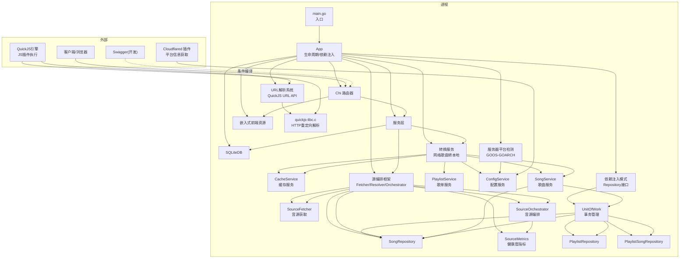

**图表来源**
- [main.go:30-63](file://main.go#L30-L63)
- [app.go:64-227](file://internal/app/app.go#L64-L227)
- [routers.go:20-26](file://internal/app/routers.go#L20-L26)
- [embed.go:10-39](file://internal/app/embed.go#L10-L39)
- [router_dev.go:13-18](file://internal/app/router_dev.go#L13-L18)
- [cache_service.go:28-40](file://internal/services/cache_service.go#L28-L40)
- [song_service.go:586-616](file://internal/services/song_service.go#L586-L616)
- [config_service.go:15-27](file://internal/services/config_service.go#L15-L27)
- [sqlite_config.go:13-44](file://internal/database/sqlite_config.go#L13-L44)
- [app.go:238-243](file://internal/app/app.go#L238-L243)
- [common.js:78-90](file://plugins/mimusic-plugin-cloudflared/static/js/common.js#L78-L90)
- [convert_service.go:60-84](file://internal/services/convert_service.go#L60-L84)
- [orchestrator.go:46-72](file://internal/services/source/orchestrator.go#L46-L72)
- [unit_of_work.go:1-11](file://internal/database/unit_of_work.go#L1-L11)
- [song_repository.go:16-27](file://internal/database/song_repository.go#L16-L27)
- [quickjs-libc.c:1497-1544](file://test/quickjs_polyfill/quickjs/quickjs-libc.c#L1497-L1544)

## 组件详解

### 应用入口与生命周期
- 入口函数解析命令行参数与环境变量，创建 App 并初始化，随后启动 HTTP 服务。
- **启动流程重大改进：HTTP 服务立即启动，插件在后台异步加载，显著降低感知延迟**。
- **配置持久化：在初始化过程中将监听端口写入数据库的 configs 表，实现配置的持久化存储**。
- **服务器平台检测：在配置持久化之后，自动检测服务器平台信息（GOOS-GOARCH 格式），并存储到 configs 表中**。
- 通过 OS 信号捕获实现优雅关闭，确保数据库连接和插件资源正确释放。
- **初始化阶段注册下载完成回调：缓存服务通过 SetOnDownloadComplete() 注册歌曲服务的 BackfillDuration() 方法**。

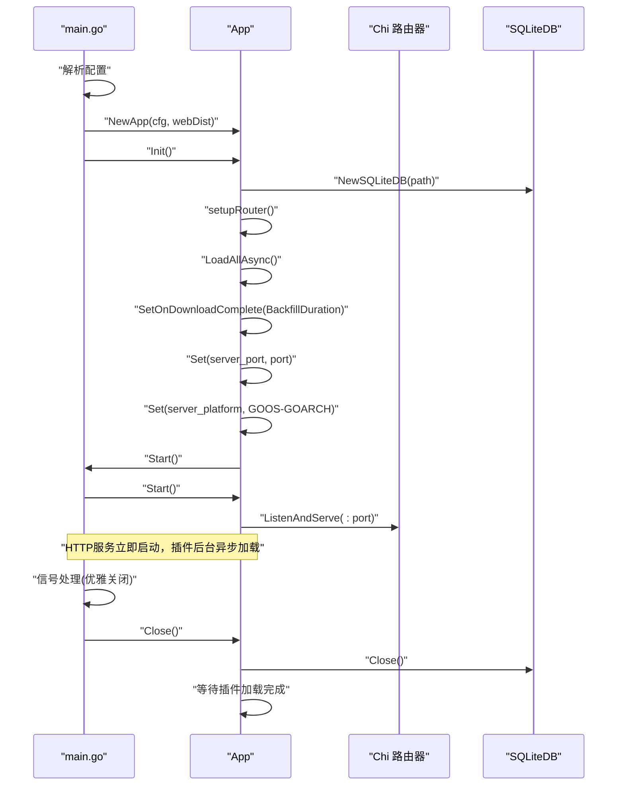

**图表来源**
- [main.go:30-63](file://main.go#L30-L63)
- [app.go:64-252](file://internal/app/app.go#L64-L252)
- [app.go:184-185](file://internal/app/app.go#L184-L185)
- [app.go:231-243](file://internal/app/app.go#L231-L243)
- [sqlite.go:22-58](file://internal/database/sqlite.go#L22-L58)

**章节来源**
- [main.go:30-63](file://main.go#L30-L63)
- [app.go:64-252](file://internal/app/app.go#L64-L252)
- [app.go:184-185](file://internal/app/app.go#L184-L185)
- [app.go:231-243](file://internal/app/app.go#L231-L243)

### 配置管理机制
- 命令行参数：支持端口、数据库路径、管理员用户名/密码、帮助与版本信息。
- 环境变量：ADMIN_USERNAME、ADMIN_PASSWORD、LISTEN_PORT、DB_PATH。
- 配置验证：要求必须提供管理员凭据；若未显式提供则尝试从环境变量读取；端口与数据库路径按优先级合并。
- **配置持久化：应用启动时将监听端口写入数据库的 configs 表，键名为 server_port，值为端口号**。
- **服务器平台检测：应用启动时自动检测服务器平台信息（GOOS-GOARCH 格式），并写入 configs 表，键名为 server_platform**。
- 版本信息：通过内部 version 包注入并可在 CLI 中查看。

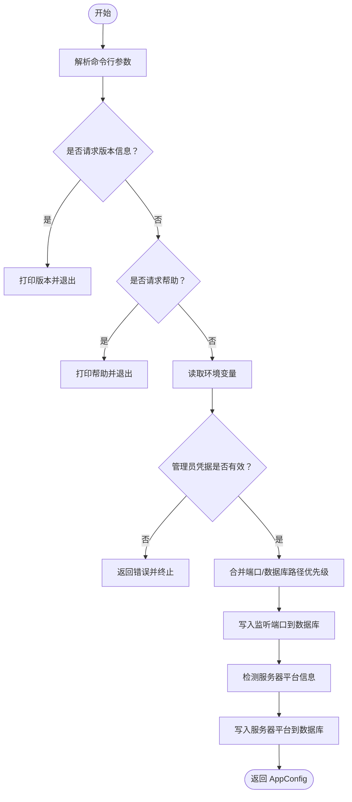

**图表来源**
- [app.go:287-352](file://internal/app/app.go#L287-L352)
- [app.go:231-243](file://internal/app/app.go#L231-L243)
- [types.go:3-9](file://internal/config/types.go#L3-L9)
- [version.go:10-18](file://internal/version/version.go#L10-L18)

**章节来源**
- [app.go:287-352](file://internal/app/app.go#L287-L352)
- [app.go:231-243](file://internal/app/app.go#L231-L243)
- [types.go:3-9](file://internal/config/types.go#L3-L9)
- [version.go:10-18](file://internal/version/version.go#L10-L18)

### 配置持久化功能
- **配置存储表：configs 表用于存储各种配置项，包括监听端口、服务器平台、音乐路径、扫描配置等**。
- **监听端口持久化：应用启动时将 server_port 键写入数据库，值为当前使用的监听端口**。
- **服务器平台持久化：应用启动时将 server_platform 键写入数据库，值为 GOOS-GOARCH 格式的平台信息**。
- **配置服务封装：ConfigService 提供统一的配置读取、设置、缓存和持久化接口**。
- **数据库操作：SQLiteConfig 实现配置的 CRUD 操作，支持查询、列表、统计和删除功能**。
- **缓存机制：配置服务使用 sync.Map 实现线程安全的配置缓存，提升读取性能**。

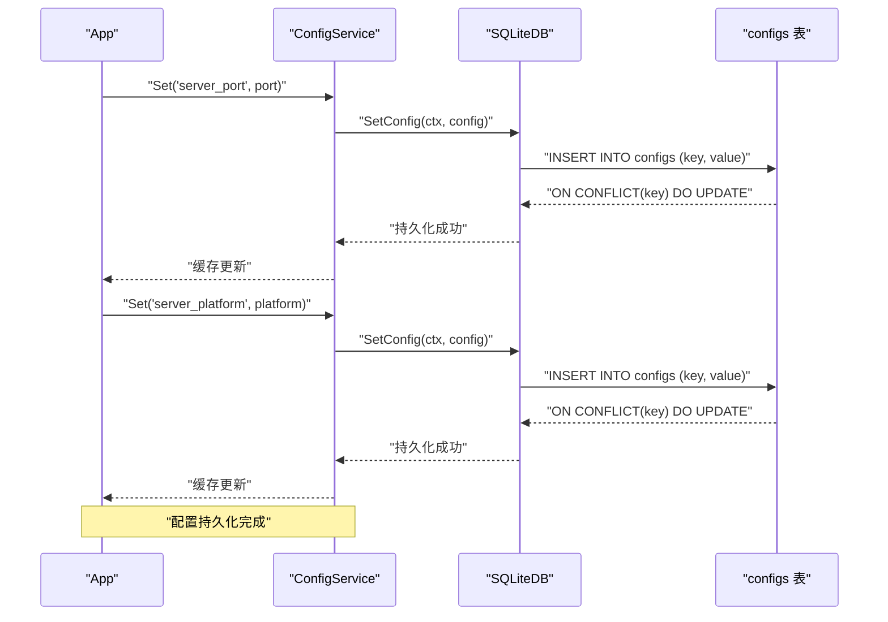

**图表来源**
- [app.go:231-243](file://internal/app/app.go#L231-L243)
- [config_service.go:114-139](file://internal/services/config_service.go#L114-L139)
- [sqlite_config.go:31-44](file://internal/database/sqlite_config.go#L31-L44)

**章节来源**
- [app.go:231-243](file://internal/app/app.go#L231-L243)
- [config_service.go:15-27](file://internal/services/config_service.go#L15-L27)
- [sqlite_config.go:13-44](file://internal/database/sqlite_config.go#L13-L44)

### 服务器平台检测功能
- **平台检测机制：应用启动时自动检测运行平台，使用 runtime.GOOS + "-" + runtime.GOARCH 组合格式**。
- **平台信息格式：返回如 linux-amd64、darwin-arm64、windows-amd64 等标准格式**。
- **前端获取：前端插件通过 /api/v1/configs/server_platform 接口获取平台信息**。
- **默认值处理：如果配置不存在或获取失败，前端使用默认平台信息**。
- **配置存储：平台信息作为配置项存储在 configs 表中，支持统一的配置管理**。

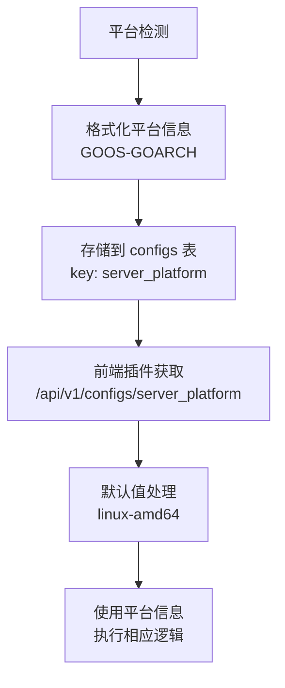

**图表来源**
- [app.go:238-243](file://internal/app/app.go#L238-L243)
- [common.js:78-90](file://plugins/mimusic-plugin-cloudflared/static/js/common.js#L78-L90)

**章节来源**
- [app.go:238-243](file://internal/app/app.go#L238-L243)
- [common.js:78-90](file://plugins/mimusic-plugin-cloudflared/static/js/common.js#L78-L90)

### 路由器初始化与中间件
- 基础中间件：gzip 压缩、带跳过的日志记录、Tracely panic 捕获、Recoverer、RequestID。
- CORS：灵活的来源校验策略，支持 localhost/127.0.0.1、局域网段、hanxi.cc 主域与子域。
- 静态资源：SPA 前端路由回退至 index.html；音乐与封面文件通过安全路由访问。
- Swagger：开发构建启用，生产构建禁用。
- **配置管理路由：注册 /api/v1/configs 相关路由，支持配置的增删改查操作**。

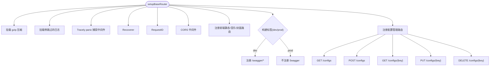

**图表来源**
- [routers.go:136-248](file://internal/app/routers.go#L136-L248)
- [embed.go:10-39](file://internal/app/embed.go#L10-L39)
- [embed_common.go:70-159](file://internal/app/embed_common.go#L70-L159)
- [router_dev.go:13-18](file://internal/app/router_dev.go#L13-L18)
- [router_prod.go:6-9](file://internal/app/router_prod.go#L6-L9)
- [routers.go:91-96](file://internal/app/routers.go#L91-L96)

**章节来源**
- [routers.go:136-248](file://internal/app/routers.go#L136-L248)
- [embed.go:10-39](file://internal/app/embed.go#L10-L39)
- [embed_common.go:70-159](file://internal/app/embed_common.go#L70-L159)
- [router_dev.go:13-18](file://internal/app/router_dev.go#L13-L18)
- [router_prod.go:6-9](file://internal/app/router_prod.go#L6-L9)
- [routers.go:91-96](file://internal/app/routers.go#L91-L96)

### 嵌入式资源与静态文件服务
- 前端静态：将 Flutter Web 构建产物嵌入二进制，提供 SPA 路由回退与 MIME 类型修正。
- 音乐与封面：通过安全路由访问，强制携带 access_token，支持 Base62 编码路径与目录边界校验，防止越权访问。

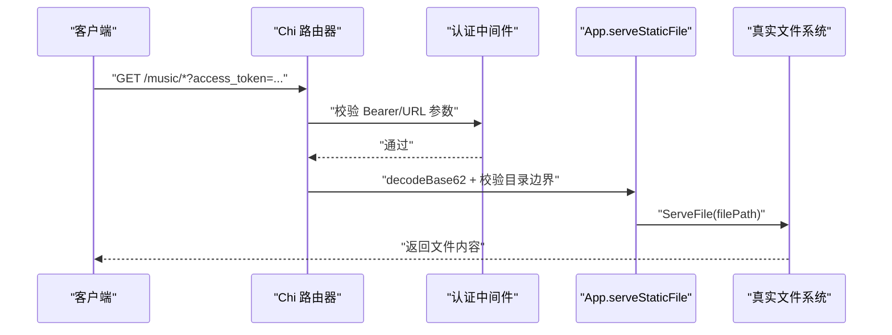

**图表来源**
- [embed.go:10-39](file://internal/app/embed.go#L10-L39)
- [embed_common.go:70-159](file://internal/app/embed_common.go#L70-L159)
- [auth.go:11-52](file://internal/middleware/auth.go#L11-52)

**章节来源**
- [embed.go:10-39](file://internal/app/embed.go#L10-L39)
- [embed_common.go:70-159](file://internal/app/embed_common.go#L70-L159)
- [auth.go:11-52](file://internal/middleware/auth.go#L11-52)

### 认证与授权
- 登录/刷新：生成短期访问令牌与长期刷新令牌，持久化并清理过期令牌。
- 中间件：优先从 Authorization 头提取 Bearer Token，回退到 URL 查询参数，校验失败返回 401。
- 令牌缓存：内存缓存 + 定时清理，提升验证性能与降低数据库压力。

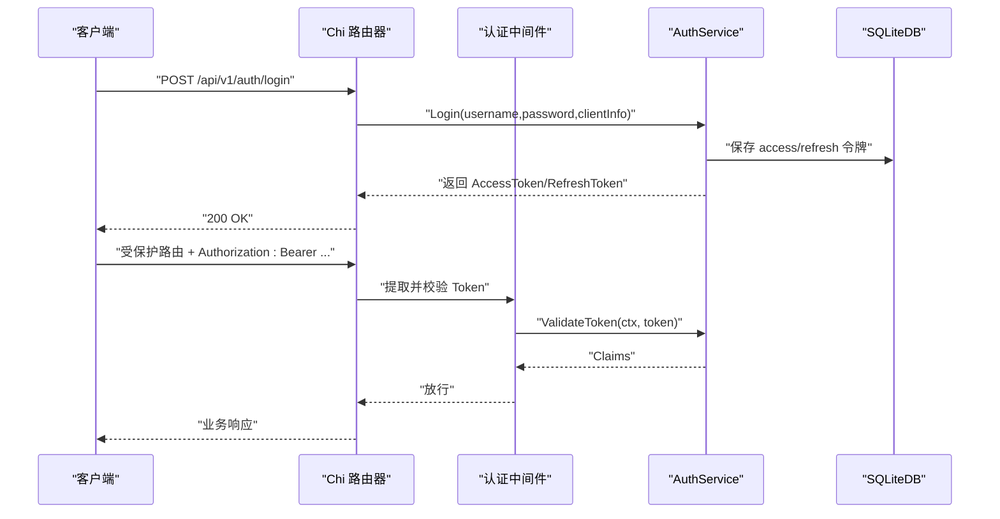

**图表来源**
- [auth.go:27-62](file://internal/handlers/auth.go#L27-62)
- [auth.go:11-52](file://internal/middleware/auth.go#L11-52)
- [auth_service.go:48-73](file://internal/services/auth_service.go#L48-L73)
- [auth_service.go:94-164](file://internal/services/auth_service.go#L94-L164)

**章节来源**
- [auth.go:27-62](file://internal/handlers/auth.go#L27-62)
- [auth.go:11-52](file://internal/middleware/auth.go#L11-52)
- [auth_service.go:48-73](file://internal/services/auth_service.go#L48-L73)
- [auth_service.go:94-164](file://internal/services/auth_service.go#L94-L164)

### 配置服务与数据库交互
- **配置缓存：使用 sync.Map 实现线程安全的配置缓存，避免频繁数据库访问**。
- **配置类型支持：支持字符串、整数、布尔值和 JSON 格式的配置读取与设置**。
- **数据库操作：通过 SQLiteDB 实现配置的持久化存储，支持 ON CONFLICT 更新策略**。
- **缓存管理：提供 ClearCache 和 ClearCacheKey 方法，支持配置缓存的清理**。
- **配置列表：支持关键词搜索、分页和排序的配置列表查询功能**。

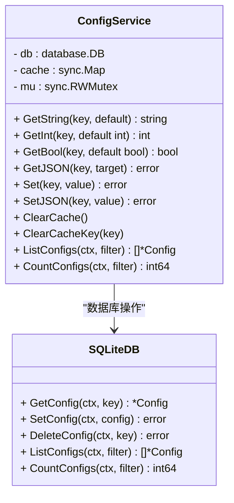

**图表来源**
- [config_service.go:15-27](file://internal/services/config_service.go#L15-L27)
- [sqlite_config.go:13-44](file://internal/database/sqlite_config.go#L13-L44)

**章节来源**
- [config_service.go:15-27](file://internal/services/config_service.go#L15-L27)
- [sqlite_config.go:13-44](file://internal/database/sqlite_config.go#L13-L44)

### 依赖注入模式与Repository接口
- **Repository接口抽象：服务层通过接口而非具体实现依赖，实现松耦合设计**。
- **UnitOfWork事务管理：跨表原子操作支持，确保数据一致性**。
- **Repository实现：SongRepository、ConfigRepository、JSPluginRepository等具体实现**。
- **依赖注入容器：App结构体作为依赖注入容器，集中管理所有服务组件**。
- **单元测试友好：通过接口模拟实现，便于单元测试和集成测试**。

```mermaid
classDiagram
class DependencyInjection {
<<interface>>
+ NewApp(cfg, webDist) *App
+ Init() error
+ Start() error
+ Close() error
}
class App {
- cfg : *types.AppConfig
- router : chi.Router
- db : database.DB
- services : map[string]interface{}
+ Init() error
+ Start() error
+ Close() error
}
class SongRepository {
<<interface>>
+ GetByID(ctx, id) *Song
+ Create(ctx, song) error
+ Update(ctx, song) error
+ Delete(ctx, id) error
+ List(ctx, filter) []*Song
+ Count(ctx, filter) int64
}
class ConcreteSongRepository {
- db : sqlc.DBTX
- queries : *sqlc.Queries
+ GetByID(ctx, id) *Song
+ Create(ctx, song) error
+ Update(ctx, song) error
+ Delete(ctx, id) error
+ List(ctx, filter) []*Song
+ Count(ctx, filter) int64
}
class UnitOfWork {
- Songs : *SongRepository
- Playlists : *PlaylistRepository
- PlaylistSongs : *PlaylistSongRepository
}
DependencyInjection <|.. App
SongRepository <|.. ConcreteSongRepository
UnitOfWork --> SongRepository
UnitOfWork --> PlaylistRepository
UnitOfWork --> PlaylistSongRepository
```

**图表来源**
- [app.go:27-42](file://internal/app/app.go#L27-L42)
- [song_repository.go:16-32](file://internal/database/song_repository.go#L16-L32)
- [config_repository.go:15-25](file://internal/database/config_repository.go#L15-L25)
- [jsplugin_repository.go:14-22](file://internal/database/jsplugin_repository.go#L14-L22)
- [unit_of_work.go:1-11](file://internal/database/unit_of_work.go#L1-L11)

**章节来源**
- [app.go:27-42](file://internal/app/app.go#L27-L42)
- [song_repository.go:16-32](file://internal/database/song_repository.go#L16-L32)
- [config_repository.go:15-25](file://internal/database/config_repository.go#L15-L25)
- [jsplugin_repository.go:14-22](file://internal/database/jsplugin_repository.go#L14-L22)
- [unit_of_work.go:1-11](file://internal/database/unit_of_work.go#L1-L11)

### UnitOfWork事务管理机制
- **跨表原子操作：UnitOfWork将多个Repository绑定到同一个事务，确保原子性**。
- **事务执行：通过Transactor.RunInTx方法执行事务，支持复杂业务逻辑**。
- **Repository绑定：Songs、Playlists、PlaylistSongs等Repository在事务内统一管理**。
- **异常处理：事务内异常自动回滚，确保数据一致性**。
- **性能优化：避免重复事务开销，提高批量操作性能**。

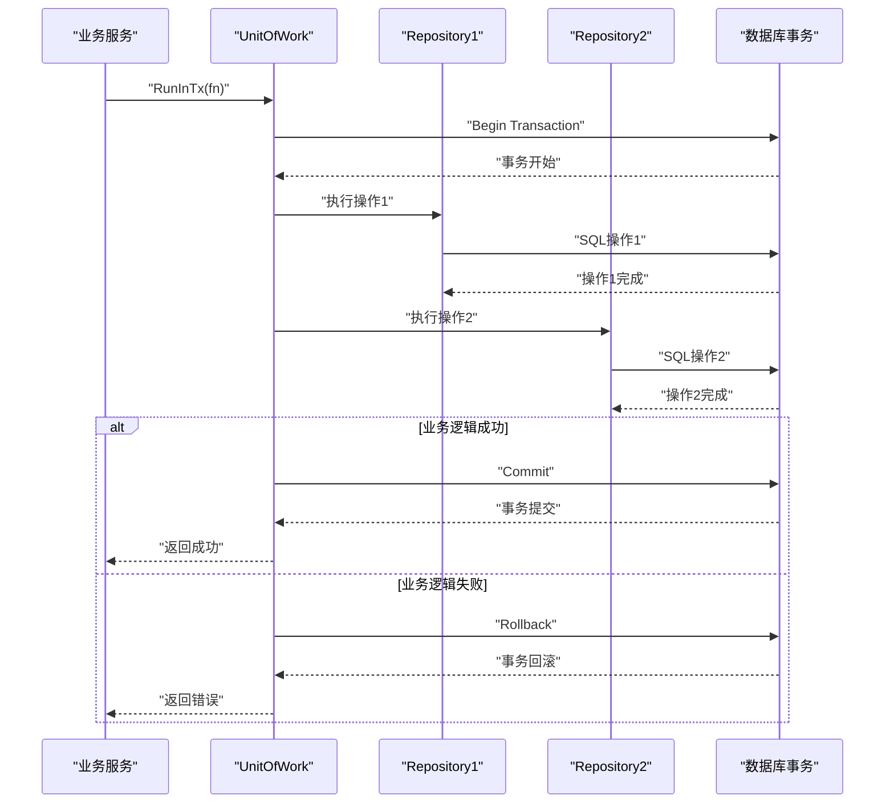

**图表来源**
- [sqlite.go:81-102](file://internal/database/sqlite.go#L81-L102)
- [unit_of_work.go:1-11](file://internal/database/unit_of_work.go#L1-L11)
- [song_service.go:34-38](file://internal/services/song_service.go#L34-L38)

**章节来源**
- [sqlite.go:81-102](file://internal/database/sqlite.go#L81-L102)
- [unit_of_work.go:1-11](file://internal/database/unit_of_work.go#L1-L11)
- [song_service.go:34-38](file://internal/services/song_service.go#L34-L38)

### URL解析系统
- **QuickJS URL API：实现标准URL对象，支持URL解析、序列化和验证**。
- **HTTP重定向解析：通过HEAD请求解析URL重定向，支持容错降级机制**。
- **容错策略：HEAD请求失败时静默降级到GET请求，兼容不支持HEAD的端点**。
- **多层重定向：最多跟随5层重定向，超限时返回最后URL**。
- **用户代理设置：使用标准浏览器User-Agent标识，提高兼容性**。

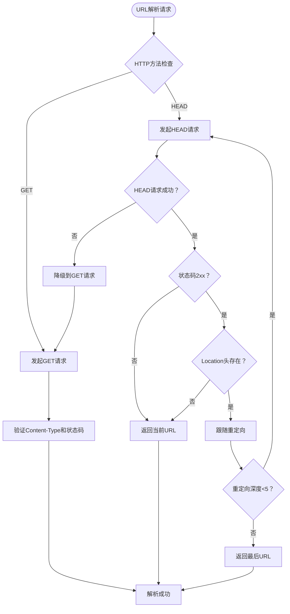

**图表来源**
- [cache_service.go:314-338](file://internal/services/cache_service.go#L314-L338)
- [url.c:169-249](file://test/quickjs_polyfill/polyfill/url.c#L169-L249)
- [quickjs-libc.c:1497-1544](file://test/quickjs_polyfill/quickjs/quickjs-libc.c#L1497-L1544)

**章节来源**
- [cache_service.go:314-338](file://internal/services/cache_service.go#L314-L338)
- [url.c:169-249](file://test/quickjs_polyfill/polyfill/url.c#L169-L249)
- [quickjs-libc.c:1497-1544](file://test/quickjs_polyfill/quickjs/quickjs-libc.c#L1497-L1544)

### 转换服务详解
- **自动转换功能：基于 SourceOrchestrator 的 OnCacheDownloaded 回调，实现网络歌曲自动转本地**。
- **手动批量转换：支持整歌单的批量转换，包含进度跟踪、取消机制和限速防风控**。
- **文件处理：支持多种音频格式（mp3、flac、wav、ape、ogg、m4a、wma、aac）的转换**。
- **歌词处理：支持从插件获取歌词并写入本地文件标签**。
- **元数据写入：使用 tag 库将标题、艺术家、专辑、歌词等元数据写入音频文件**。
- **冲突处理：自动处理文件名冲突，支持最多 100 个冲突后缀**。
- **孤儿清理：转换完成后清理不再被任何歌单引用的远程歌曲**。

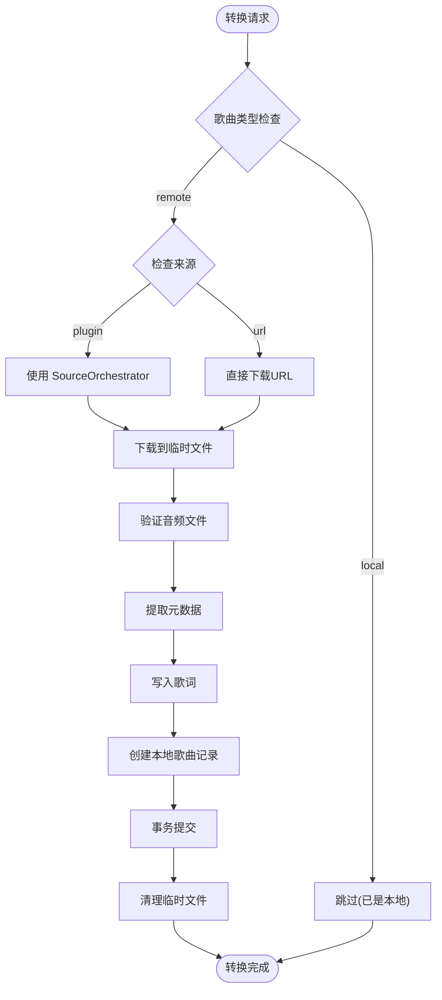

**图表来源**
- [convert_service.go:279-468](file://internal/services/convert_service.go#L279-L468)
- [convert_service.go:470-520](file://internal/services/convert_service.go#L470-L520)

**章节来源**
- [convert_service.go:60-84](file://internal/services/convert_service.go#L60-L84)
- [convert_service.go:170-201](file://internal/services/convert_service.go#L170-L201)
- [convert_service.go:279-468](file://internal/services/convert_service.go#L279-L468)
- [convert_service.go:470-520](file://internal/services/convert_service.go#L470-L520)

### 源编排框架详解
- **Fetcher（音源获取器）：通过插件的 /api/music/url 接口获取音频下载链接，支持 L1 自搜回退**。
- **Resolver（音源解析器）：跨插件搜索同名歌曲，基于相似度打分和健康度权重排序候选音源**。
- **Orchestrator（音源编排器）：协调 Fetcher 和 Resolver，实现主源 + L1 + L2 的多级回退机制**。
- **SourceMetrics（健康度指标）：收集每个插件的成功率、延迟和错误类型，用于权重计算和过滤**。
- **错误分类：InvalidAudioError、NetworkError、PluginInvocationError 等，支持智能回退决策**。

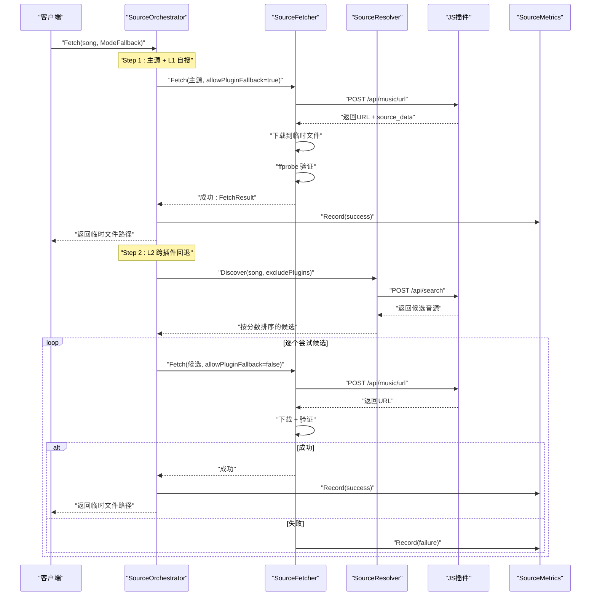

**图表来源**
- [orchestrator.go:88-142](file://internal/services/source/orchestrator.go#L88-L142)
- [fetcher.go:133-242](file://internal/services/source/fetcher.go#L133-L242)
- [resolver.go:114-207](file://internal/services/source/resolver.go#L114-L207)
- [metrics.go:123-140](file://internal/services/source/metrics.go#L123-L140)

**章节来源**
- [orchestrator.go:46-72](file://internal/services/source/orchestrator.go#L46-L72)
- [fetcher.go:77-95](file://internal/services/source/fetcher.go#L77-L95)
- [resolver.go:54-87](file://internal/services/source/resolver.go#L54-L87)
- [metrics.go:104-121](file://internal/services/source/metrics.go#L104-L121)

### 源编排框架适配器
- **proberAdapter：将 services.MetadataExtractor 适配为 source.Prober 接口**。
- **jsPluginInvokerAdapter：将 jsplugin.Manager 适配为 source.PluginInvoker 接口**。
- **jsPluginListerAdapter：将 jsplugin.Manager 适配为 source.PluginLister 接口**。
- **songUpdaterAdapter：将 services.SongService 适配为 source.SongUpdater 接口**。
- **reassignAdapter：提供 AsyncReassign(songID) 简化接口**。

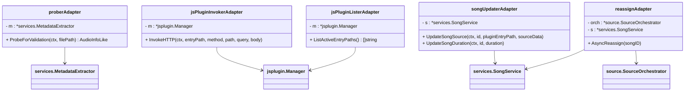

**图表来源**
- [source_adapters.go:16-98](file://internal/app/source_adapters.go#L16-L98)

**章节来源**
- [source_adapters.go:16-98](file://internal/app/source_adapters.go#L16-L98)

### 缓存服务与下载完成回调机制
- **回调注册机制：SetOnDownloadComplete() 方法允许外部组件注册下载完成后的回调函数**。
- **异步通知：下载完成后通过 goroutine 异步调用回调函数，不阻塞下载流程**。
- **并发安全：使用互斥锁保护回调函数的注册与调用，确保线程安全**。
- **应用场景：歌曲服务通过回调机制在缓存下载完成后自动回填音频时长**。

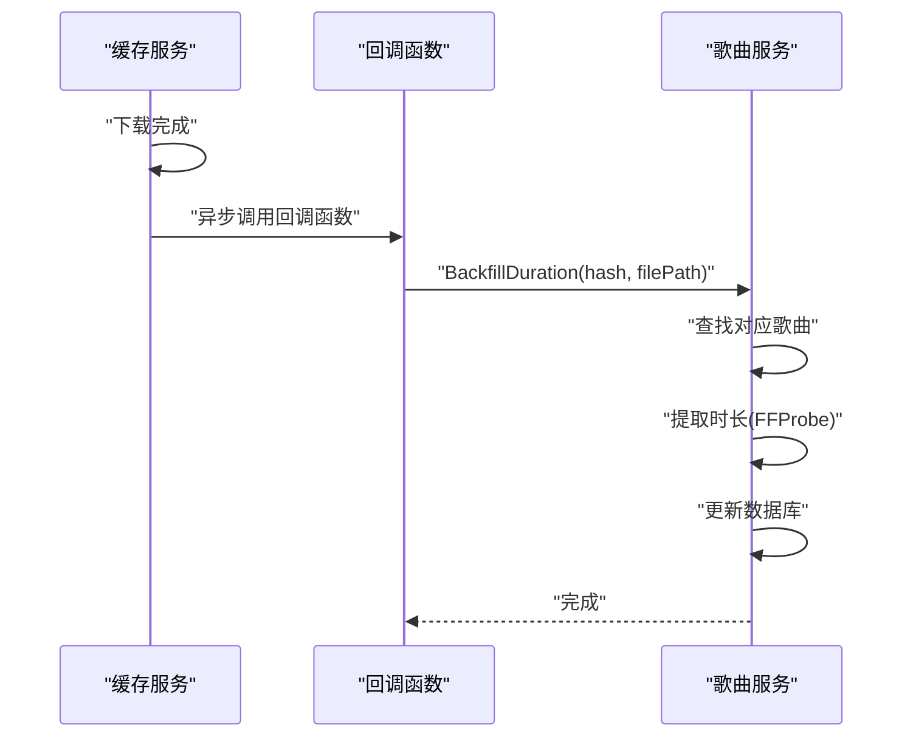

**图表来源**
- [cache_service.go:37-40](file://internal/services/cache_service.go#L37-L40)
- [cache_service.go:240-243](file://internal/services/cache_service.go#L240-L243)
- [song_service.go:586-616](file://internal/services/song_service.go#L586-L616)

**章节来源**
- [cache_service.go:37-40](file://internal/services/cache_service.go#L37-L40)
- [cache_service.go:240-243](file://internal/services/cache_service.go#L240-L243)
- [song_service.go:586-616](file://internal/services/song_service.go#L586-L616)

### 歌曲服务与回调集成
- **BackfillDuration() 方法：实现下载完成回调的核心逻辑**。
- **智能匹配：根据 cache_hash 查找对应的歌曲记录，支持插件来源的缓存文件**。
- **条件检查：只有当歌曲时长为 0 时才进行回填，避免重复处理**。
- **FFProbe 集成：使用外部工具提取精确的音频时长信息**。
- **数据库更新：原子性地更新歌曲时长，确保数据一致性**。

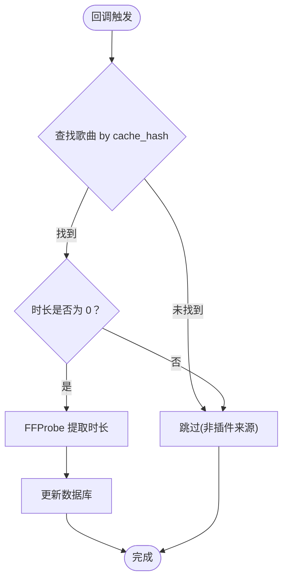

**图表来源**
- [song_service.go:586-616](file://internal/services/song_service.go#L586-L616)
- [sqlite_song.go:501-533](file://internal/database/sqlite_song.go#L501-L533)
- [metadata.go:186-212](file://internal/services/metadata.go#L186-L212)

**章节来源**
- [song_service.go:586-616](file://internal/services/song_service.go#L586-L616)
- [sqlite_song.go:501-533](file://internal/database/sqlite_song.go#L501-L533)
- [metadata.go:186-212](file://internal/services/metadata.go#L186-L212)

### JS插件管理器与通信系统
- **插件管理器：NewManager() 构造函数注入Repository接口，支持依赖注入模式**。
- **插件包管理：PackageManager负责插件的安装、更新和卸载**。
- **插件间通信：GenerateCommJS() 生成通信API代码，支持异步消息传递**。
- **JWT令牌：为插件生成专用永久JWT Token，确保安全访问**。
- **JS运行时：集成jsruntime.JSEnvManager，支持WASM插件执行**。

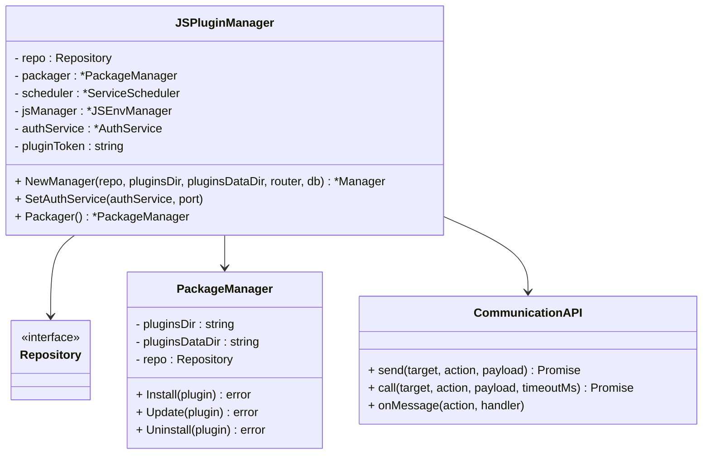

**图表来源**
- [manager.go:55-90](file://internal/jsplugin/manager.go#L55-L90)
- [communication.go:91-124](file://internal/jsplugin/communication.go#L91-L124)

**章节来源**
- [manager.go:55-90](file://internal/jsplugin/manager.go#L55-L90)
- [communication.go:91-124](file://internal/jsplugin/communication.go#L91-L124)

## 依赖关系分析
- 入口依赖 App；App 依赖配置、Chi 路由器、数据库、服务层与嵌入式资源。
- 路由层依赖处理器与中间件；处理器依赖服务层；服务层依赖数据库与外部工具（如 ffprobe）。
- **依赖注入模式：服务层通过Repository接口实现松耦合设计，支持单元测试和扩展**。
- **UnitOfWork事务管理：跨表原子操作支持，确保数据一致性**。
- **URL解析系统：QuickJS URL API实现，支持HTTP重定向解析和容错机制**。
- **转换服务依赖 CacheService、SongService、PlaylistService、ConfigService 和 SourceOrchestrator**。
- **源编排框架包含 SourceFetcher、SourceResolver、SourceOrchestrator 和 SourceMetrics 四个核心组件**。
- **配置服务与数据库之间建立持久化依赖关系，实现配置的持久化存储**。
- **缓存服务与歌曲服务之间通过回调机制建立松耦合的依赖关系**。
- **服务器平台检测功能与配置服务集成，作为配置持久化的一部分**。
- **JS插件管理器通过Repository接口实现插件生命周期管理**。

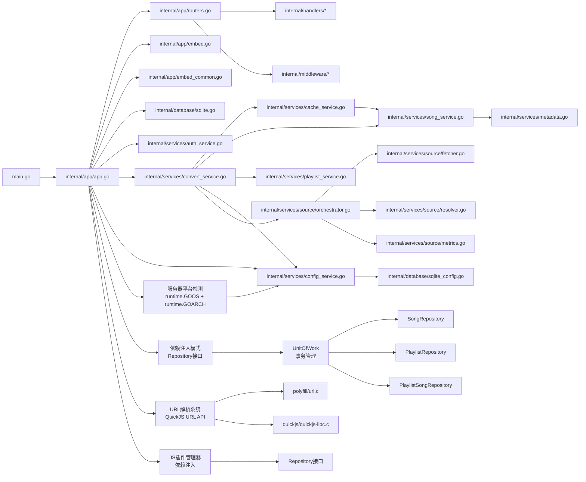

**图表来源**
- [main.go:30-63](file://main.go#L30-L63)
- [app.go:64-227](file://internal/app/app.go#L64-L227)
- [routers.go:20-26](file://internal/app/routers.go#L20-L26)
- [embed.go:10-39](file://internal/app/embed.go#L10-L39)
- [embed_common.go:70-159](file://internal/app/embed_common.go#L70-L159)
- [sqlite.go:22-53](file://internal/database/sqlite.go#L22-L53)
- [auth_service.go:24-73](file://internal/services/auth_service.go#L24-L73)
- [convert_service.go:60-84](file://internal/services/convert_service.go#L60-L84)
- [orchestrator.go:46-72](file://internal/services/source/orchestrator.go#L46-L72)
- [config_service.go:15-27](file://internal/services/config_service.go#L15-L27)
- [sqlite_config.go:13-44](file://internal/database/sqlite_config.go#L13-L44)
- [app.go:238-243](file://internal/app/app.go#L238-L243)
- [unit_of_work.go:1-11](file://internal/database/unit_of_work.go#L1-L11)
- [song_repository.go:16-27](file://internal/database/song_repository.go#L16-L27)
- [url.c:1-279](file://test/quickjs_polyfill/polyfill/url.c#L1-L279)
- [quickjs-libc.c:1497-1544](file://test/quickjs_polyfill/quickjs/quickjs-libc.c#L1497-L1544)
- [manager.go:55-90](file://internal/jsplugin/manager.go#L55-L90)

**章节来源**
- [main.go:30-63](file://main.go#L30-L63)
- [app.go:64-227](file://internal/app/app.go#L64-L227)
- [routers.go:20-26](file://internal/app/routers.go#L20-L26)

## 性能考量
- 数据库优化：WAL 模式、busy_timeout、synchronous、cache_size、foreign_keys；连接池大小与生命周期合理配置。
- 中间件优化：gzip 对 JS/WASM/CSS/JSON 等静态资源进行压缩，显著降低传输体积。
- 认证缓存：内存缓存 + 定时清理，减少频繁数据库查询。
- **依赖注入优化：通过接口抽象实现松耦合设计，支持单元测试和性能测试**。
- **UnitOfWork优化：跨表原子操作减少事务开销，提高批量操作性能**。
- **URL解析优化：QuickJS URL API实现高效解析，HTTP重定向解析支持容错降级**。
- **异步插件加载：插件在后台异步加载，HTTP 服务立即启动，显著降低用户感知延迟**。
- **回调机制优化：下载完成回调通过 goroutine 异步执行，避免阻塞主线程**。
- **优雅关闭优化：使用 WaitGroup 确保插件加载完成后再关闭，避免资源泄漏**。
- **转换服务优化：自动转换使用信号量控制并发，手动转换支持限速防风控**。
- **源编排优化：Fetcher 使用超时控制，Resolver 使用并发搜索和缓存机制**。
- **缓存并发控制：使用 inflight map 避免重复下载，提高缓存命中率**。
- **配置缓存优化：配置服务使用 sync.Map 实现线程安全缓存，减少数据库访问频率**。
- **配置持久化优化：使用 ON CONFLICT 更新策略，避免重复插入操作**。
- **服务器平台检测优化：平台信息检测仅在应用启动时执行一次，避免重复计算**。
- **JS插件管理优化：依赖注入模式支持插件生命周期管理，提高系统稳定性**。

## 故障排查指南
- 启动失败
  - 检查管理员凭据是否通过命令行或环境变量正确传入。
  - 查看数据库路径是否存在且具备写权限。
  - 确认端口未被占用。
- 静态资源 401/403
  - 确认请求携带有效的 access_token（Header 或 URL 查询参数）。
  - 检查 Base62 编码路径与目录边界校验是否通过。
- Swagger 无法访问
  - 确认构建标签为 dev，否则生产构建不会注册 Swagger 路由。
- **依赖注入问题**
  - **检查Repository接口实现是否正确注入**。
  - **验证UnitOfWork事务管理是否正常工作**。
  - **确认服务层通过接口而非具体实现依赖**。
- **URL解析问题**
  - **检查QuickJS URL API是否正确初始化**。
  - **验证HTTP重定向解析是否支持HEAD请求**。
  - **监控重定向深度限制和容错降级机制**。
- **转换服务问题**
  - **检查转换配置：确认 auto_convert_remote 配置是否正确设置**。
  - **验证插件来源：确认歌曲是否为插件来源，支持的格式是否正确**。
  - **检查磁盘空间：确认目标目录有足够的空间进行文件转换**。
  - **监控转换进度：使用 /api/v1/convert/progress 接口查看转换状态**。
  - **查看转换日志：检查转换过程中的错误信息和失败原因**。
- **源编排框架问题**
  - **检查插件健康度：使用 /api/v1/plugins/health 接口查看插件状态**。
  - **验证插件响应：确认插件的 /api/music/url 和 /api/search 接口正常工作**。
  - **监控错误分类：检查 InvalidAudioError、NetworkError、PluginInvocationError 等错误类型**。
  - **调整超时参数：根据网络状况调整 HTTPTimeout 和全局超时设置**。
- **配置持久化问题**
  - **检查 configs 表是否存在且可写：确认数据库初始化时是否正确创建 configs 表**。
  - **验证 server_port 配置是否正确写入：观察日志中"监听端口已写入配置"提示**。
  - **验证 server_platform 配置是否正确写入：观察日志中"服务器平台已写入配置"提示**。
  - **确认配置读取功能正常：测试 GET /api/v1/configs 接口是否能正确返回配置**。
  - **检查配置缓存一致性：验证配置更新后是否正确清除缓存**。
- **服务器平台检测问题**
  - **检查平台信息是否正确检测：确认 runtime.GOOS 和 runtime.GOARCH 是否正确获取**。
  - **验证平台信息格式：确认返回格式为 GOOS-GOARCH 标准格式**。
  - **检查前端平台信息获取：确认 /api/v1/configs/server_platform 接口返回正确格式**。
  - **验证默认值处理：确认前端获取失败时使用默认平台信息**。
- **下载完成回调问题**
  - **检查回调函数是否正确注册：确认 SetOnDownloadComplete() 调用是否在初始化阶段完成**。
  - **验证回调执行：观察日志中"缓存下载后回填时长成功"提示**。
  - **检查歌曲时长更新：确认数据库中对应歌曲的 duration 字段是否正确更新**。
  - **监控 FFProbe 可用性：确认外部工具是否正确安装和配置**。
- **JS插件管理问题**
  - **检查插件依赖注入：确认Repository接口正确注入到插件管理器**。
  - **验证插件通信：检查插件间通信API是否正常工作**.
  - **监控插件生命周期：确认插件安装、更新、卸载流程正常**.

## 结论
MiMusic 通过清晰的分层架构与模块化设计，实现了从入口到路由、从配置到资源、从认证到服务的完整闭环。其依赖注入模式使组件职责明确、易于测试与扩展；嵌入式前端与静态文件安全访问策略兼顾易用性与安全性；生产与开发环境的差异化配置（如 Swagger）提升了工程效率。

**依赖注入模式的引入**进一步增强了系统的可维护性和可测试性，通过Repository接口实现服务层解耦，支持单元测试和扩展。UnitOfWork事务管理机制确保了跨表操作的数据一致性，提高了系统的可靠性。

**UnitOfWork事务管理机制**的集成进一步完善了系统的数据操作能力，通过跨表原子操作支持复杂的业务逻辑，确保数据完整性和一致性。

**URL解析系统的引入**进一步增强了系统的网络处理能力，通过QuickJS URL API实现标准URL解析，支持HTTP重定向解析和容错降级机制，为插件开发和网络请求提供了强大的支持。

**转换服务的引入**进一步增强了系统的媒体处理能力，通过网络歌曲转本地歌曲的完整流程，包括自动转换、手动批量转换、歌词处理和元数据写入，为用户提供了便捷的本地音乐管理功能。

**源编排框架的集成**进一步完善了系统的音源管理能力，通过 Fetcher、Resolver、Orchestrator 的协作机制，实现了音源发现、选择和回退的智能化处理。该框架支持多级回退、健康度评估和错误分类，显著提升了音源获取的可靠性。

**配置持久化功能**的引入进一步增强了系统的配置管理能力，通过将监听端口写入数据库的 configs 表，实现了配置的持久化存储。这一机制不仅确保了应用重启后配置的一致性，还为后续的配置管理功能奠定了基础。

**服务器平台检测功能**的集成进一步完善了系统的配置管理能力，通过在应用启动时自动检测并存储服务器平台信息，为插件开发和前端适配提供了重要依据。平台信息采用 GOOS-GOARCH 标准格式，确保了跨平台兼容性和一致性。

**下载完成回调机制**的引入进一步增强了系统的事件驱动能力，通过 SetOnDownloadComplete() 方法实现了缓存服务与业务逻辑之间的松耦合集成。这种机制不仅支持歌曲时长的自动回填，还为插件开发者提供了扩展点，可以在下载完成后执行自定义的处理逻辑。

**JS插件管理器的集成**进一步增强了系统的扩展能力，通过依赖注入模式实现插件生命周期管理，支持插件间通信和安全访问。这一机制为MiMusic生态系统的发展奠定了坚实的基础。

**启动流程的重大改进**使得应用能够在更短时间内响应用户请求，插件的异步加载机制显著提升了用户体验，降低了感知延迟。插件管理器的 WaitGroup 机制确保了优雅关闭时的资源完整性。

遵循本文的最佳实践与排障建议，可进一步提升系统的稳定性与可维护性。

## 附录

### 启动流程与优雅关闭示例路径
- 入口与初始化：[main.go:30-63](file://main.go#L30-L63)、[app.go:64-252](file://internal/app/app.go#L64-L252)
- **异步插件加载**：[app.go:247-250](file://internal/app/app.go#L247-L250)、[manager.go:391-417](file://internal/plugins/manager.go#L391-L417)
- **配置持久化**：[app.go:232-243](file://internal/app/app.go#L232-L243)
- **服务器平台检测**：[app.go:238-243](file://internal/app/app.go#L238-L243)
- **回调机制注册**：[app.go:184-185](file://internal/app/app.go#L184-L185)
- 信号处理与关闭：[main.go:46-56](file://main.go#L46-L56)、[app.go:55-62](file://internal/app/app.go#L55-L62)

### 配置解析与验证示例路径
- 命令行与环境变量合并：[app.go:287-352](file://internal/app/app.go#L287-L352)
- 配置模型定义：[types.go:3-9](file://internal/config/types.go#L3-L9)

### 配置持久化与数据库操作示例路径
- **配置服务初始化**：[config_service.go:22-27](file://internal/services/config_service.go#L22-L27)
- **数据库配置操作**：[sqlite_config.go:31-44](file://internal/database/sqlite_config.go#L31-L44)
- **配置缓存机制**：[config_service.go:141-149](file://internal/services/config_service.go#L141-L149)
- **配置列表查询**：[sqlite_config.go:66-125](file://internal/database/sqlite_config.go#L66-L125)

### 服务器平台检测与前端获取示例路径
- **平台检测实现**：[app.go:238-243](file://internal/app/app.go#L238-L243)
- **前端平台信息获取**：[common.js:78-90](file://plugins/mimusic-plugin-cloudflared/static/js/common.js#L78-L90)

### 路由注册与中间件挂载示例路径
- 基础路由与中间件：[routers.go:136-248](file://internal/app/routers.go#L136-L248)
- API v1 分组与受保护路由：[routers.go:28-116](file://internal/app/routers.go#L28-L116)
- **配置管理路由**：[routers.go:91-96](file://internal/app/routers.go#L91-L96)

### 嵌入式资源与静态文件服务示例路径
- 前端静态服务（SPA 回退）：[embed.go:10-39](file://internal/app/embed.go#L10-L39)
- 音乐/封面安全访问：[embed_common.go:70-159](file://internal/app/embed_common.go#L70-L159)

### 认证与授权示例路径
- 登录/刷新处理器：[auth.go:27-62](file://internal/handlers/auth.go#L27-62)
- 认证中间件：[auth.go:11-52](file://internal/middleware/auth.go#L11-52)
- 认证服务初始化与令牌生成：[auth_service.go:48-73](file://internal/services/auth_service.go#L48-L73)、[auth_service.go:94-164](file://internal/services/auth_service.go#L94-L164)

### 依赖注入与Repository接口示例路径
- **依赖注入容器**：[app.go:27-42](file://internal/app/app.go#L27-L42)
- **Repository接口定义**：[song_service.go:16-32](file://internal/services/song_service.go#L16-L32)
- **UnitOfWork事务管理**：[sqlite.go:81-102](file://internal/database/sqlite.go#L81-L102)
- **Repository实现**：[song_repository.go:16-27](file://internal/database/song_repository.go#L16-L27)

### URL解析系统示例路径
- **URL解析实现**：[url.c:169-249](file://test/quickjs_polyfill/polyfill/url.c#L169-L249)
- **HTTP重定向解析**：[cache_service.go:314-338](file://internal/services/cache_service.go#L314-L338)
- **QuickJS集成**：[quickjs-libc.c:1497-1544](file://test/quickjs_polyfill/quickjs/quickjs-libc.c#L1497-L1544)

### 转换服务示例路径
- **转换服务初始化**：[convert_service.go:86-116](file://internal/services/convert_service.go#L86-L116)
- **自动转换实现**：[convert_service.go:470-520](file://internal/services/convert_service.go#L470-L520)
- **手动批量转换**：[convert_service.go:170-201](file://internal/services/convert_service.go#L170-L201)
- **文件处理与元数据写入**：[convert_service.go:358-468](file://internal/services/convert_service.go#L358-L468)

### 源编排框架示例路径
- **源编排器初始化**：[orchestrator.go:55-72](file://internal/services/source/orchestrator.go#L55-L72)
- **音源获取器**：[fetcher.go:133-242](file://internal/services/source/fetcher.go#L133-L242)
- **音源解析器**：[resolver.go:114-207](file://internal/services/source/resolver.go#L114-L207)
- **健康度指标收集**：[metrics.go:123-140](file://internal/services/source/metrics.go#L123-L140)

### 缓存服务与回调机制示例路径
- **回调注册方法**：[cache_service.go:37-40](file://internal/services/cache_service.go#L37-L40)
- **异步回调执行**：[cache_service.go:240-243](file://internal/services/cache_service.go#L240-L243)
- **下载完成处理**：[cache_service.go:117-149](file://internal/services/cache_service.go#L117-L149)

### 歌曲服务回调集成示例路径
- **BackfillDuration 实现**：[song_service.go:586-616](file://internal/services/song_service.go#L586-L616)
- **数据库查询**：[sqlite_song.go:501-533](file://internal/database/sqlite_song.go#L501-L533)
- **时长提取**：[metadata.go:186-212](file://internal/services/metadata.go#L186-L212)

### JS插件管理示例路径
- 插件管理器初始化与宿主注入：[manager.go:149-168](file://internal/plugins/manager.go#L149-L168)
- **异步插件加载机制**：[manager.go:391-417](file://internal/plugins/manager.go#L391-L417)
- 插件实例生命周期与资源回收：[manager.go:86-135](file://internal/plugins/manager.go#L86-L135)
- **插件间通信API**：[communication.go:91-124](file://internal/jsplugin/communication.go#L91-L124)

### HTTP 服务启动示例路径
- **立即启动 HTTP 服务**：[app.go:266](file://internal/app/app.go#L266)
- **HTTP 库实现**：[http.go:34-49](file://plugin/pkg/go-plugin-http/impl/http.go#L34-L49)

### 缓存处理器示例路径
- **缓存下载处理**：[cache.go:45-82](file://internal/handlers/cache.go#L45-L82)
- **并发下载控制**：[cache_service.go:96-149](file://internal/services/cache_service.go#L96-L149)
- **预加载机制**：[cache_service.go:315-337](file://internal/services/cache_service.go#L315-L337)

### 配置管理处理器示例路径
- **配置列表查询**：[config.go:40-92](file://internal/handlers/config.go#L40-L92)
- **获取单个配置**：[config.go:105-121](file://internal/handlers/config.go#L105-L121)
- **创建配置**：[config.go:135-166](file://internal/handlers/config.go#L135-L166)
- **更新配置**：[config.go:181-221](file://internal/handlers/config.go#L181-L221)
- **删除配置**：[config.go:235-252](file://internal/handlers/config.go#L235-L252)