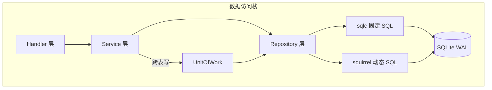
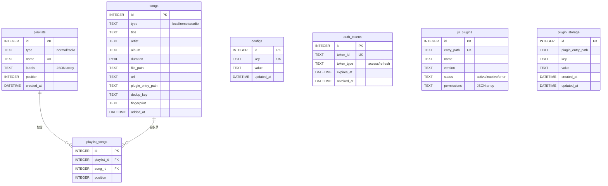

# 数据库设计

<cite>
本文档基于以下源文件编写：

- `internal/database/database.go` -- DB 接口定义
- `internal/database/sqlite.go` -- SQLiteDB 实现、连接池、goose 迁移
- `internal/database/unit_of_work.go` -- UnitOfWork 事务模式
- `internal/database/errors.go` -- 统一错误哨兵
- `internal/database/filters.go` -- 动态过滤与排序白名单
- `internal/database/song_repository.go` -- 歌曲仓储（最大的 Repository）
- `internal/database/playlist_repository.go` -- 歌单仓储
- `internal/database/playlist_song_repository.go` -- 歌单-歌曲关联仓储
- `internal/database/config_repository.go` -- 配置项仓储
- `internal/database/token_repository.go` -- 认证令牌仓储
- `internal/database/jsplugin_repository.go` -- JS 插件仓储
- `internal/database/testutil/memdb.go` -- 内存数据库测试工具
- `internal/database/migrations/0001_init.sql` -- 完整初始 schema（6 表 + 索引 + 触发器 + 预置数据）
- `internal/database/migrations/0002_*.sql` ~ `0025_*.sql` -- 增量迁移（含 0016 新增 plugin_storage 表）
- `internal/database/queries/*.sql` -- sqlc 查询定义（7 文件）
- `sqlc.yaml` -- sqlc 代码生成配置
</cite>

## 目录

1. [简介](#1-简介)
2. [数据库架构概览](#2-数据库架构概览)
3. [ER 关系图](#3-er-关系图)
4. [表结构详解](#4-表结构详解)
5. [索引与约束设计](#5-索引与约束设计)
6. [迁移系统](#6-迁移系统)
7. [sqlc 代码生成](#7-sqlc-代码生成)
8. [Repository 模式](#8-repository-模式)
9. [UnitOfWork 事务模式](#9-unitofwork-事务模式)
10. [动态 SQL 与过滤系统](#10-动态-sql-与过滤系统)
11. [测试策略](#11-测试策略)
12. [设计决策与约定](#12-设计决策与约定)

---

## 1. 简介

Songloft 的数据层基于 SQLite，采用 WAL（Write-Ahead Logging）模式实现读写并发。整个数据访问栈由四个层次组成：goose 嵌入式迁移管理 schema 演进、sqlc 从注释化 SQL 生成类型安全的 Go 代码处理固定查询、squirrel 构建动态 WHERE/ORDER 条件、Repository + UnitOfWork 封装业务级数据操作与跨表事务。

数据库驱动使用 `modernc.org/sqlite`（纯 Go 实现），无需 CGO，支持 `CGO_ENABLED=0` 静态编译，适配 Docker scratch/alpine 等极简镜像。

**章节来源**: `internal/database/sqlite.go`（Open 函数、DSN 参数）、`AGENTS.md`（数据库规范）

---

## 2. 数据库架构概览

系统包含 7 张业务表，形成以歌曲（songs）和歌单（playlists）为核心的数据模型。



连接配置（`sqlite.go` Open 函数）：

| 参数 | 值 | 说明 |
|------|-----|------|
| `journal_mode` | WAL | 读写并发，读不被写阻塞 |
| `busy_timeout` | 10000ms | 遇锁等待 10 秒，避免 SQLITE_BUSY |
| `synchronous` | NORMAL | WAL 模式下已足够安全 |
| `cache_size` | 10000 页 (~40MB) | 页缓存 |
| `foreign_keys` | 1 | 启用外键约束（CASCADE 依赖此项） |

Go 连接池：`MaxOpenConns=10`、`MaxIdleConns=5`、`ConnMaxLifetime=30min`。

**章节来源**: `internal/database/sqlite.go:28-55`

---

## 3. ER 关系图



**图表来源**: `internal/database/migrations/0001_init.sql`、`0007_*.sql` ~ `0025_*.sql`（`plugin_storage` 见 `0016_plugin_storage.sql`）

---

## 4. 表结构详解

### 4.1 songs -- 歌曲表

存储本地、远程、电台三种类型的歌曲元数据，是系统最大的表（37 列）。

| 字段 | 类型 | 说明 |
|------|------|------|
| `id` | INTEGER PK | 自增主键 |
| `type` | TEXT, CHECK | `local` / `remote` / `radio` |
| `title` / `artist` / `album` | TEXT | 基础元数据 |
| `duration` | REAL | 时长（秒） |
| `file_path` | TEXT | 本地文件路径（仅 local） |
| `url` | TEXT | 远程/电台 URL |
| `cover_path` / `cover_url` | TEXT | 封面本地路径 / 远程 URL |
| `lyric` | TEXT | 歌词 JSON（LyricPayload） |
| `lyric_source` | TEXT, CHECK | file / embedded / scraped / url / cached / manual |
| `lyric_remote_url` | TEXT | 歌词远程 URL（迁移 0003） |
| `file_size` / `format` / `bit_rate` / `sample_rate` | 混合 | 音频技术参数 |
| `is_live` | INTEGER | 是否直播流（0/1） |
| `plugin_entry_path` | TEXT | 来源插件标识 |
| `source_data` | TEXT | 插件特有的源数据 |
| `dedup_key` | TEXT | 去重键（同插件下唯一） |
| `year` / `genre` | INTEGER / TEXT | 年份 / 流派（迁移 0007） |
| `fingerprint` / `fingerprint_duration` | TEXT / REAL | 音频指纹（迁移 0008） |
| `isrc` | TEXT | 国际标准录音编码（迁移 0009） |
| `cache_path` | TEXT | 远程歌曲本地缓存路径（迁移 0014） |
| `cue_source_path` / `cue_track_index` / `cue_audio_path` | TEXT / INTEGER / TEXT | CUE 分轨来源（迁移 0018） |
| `file_modified_at` | DATETIME | 文件修改时间，扫描增量判定用（迁移 0019） |
| `track` | TEXT | 音轨号（迁移 0020） |
| `language` / `style` | TEXT | 语言 / 风格（迁移 0022） |
| `is_video` | INTEGER | 是否视频（0/1，迁移 0024） |
| `added_at` / `updated_at` | DATETIME | 入库 / 更新时间（触发器维护） |

关键设计：`(plugin_entry_path, dedup_key)` 联合唯一索引（部分索引，`WHERE dedup_key != ''`）用于远程歌曲按插件去重。`UpsertRemote` 利用此索引实现"已存在则更新、不存在则插入"。

**章节来源**: `internal/database/migrations/0001_init.sql`、`0005_lyric_source_manual.sql`（重建表）、`0007`~`0024` 增量 ALTER、`internal/database/song_repository.go`

### 4.2 playlists -- 歌单表

| 字段 | 类型 | 说明 |
|------|------|------|
| `id` | INTEGER PK | 自增主键 |
| `type` | TEXT, CHECK | `normal` / `radio` |
| `name` | TEXT, UNIQUE | 歌单名（全局唯一） |
| `description` | TEXT | 描述 |
| `cover_path` / `cover_url` | TEXT | 封面 |
| `labels` | TEXT | 标签 JSON 数组（`built_in` / `auto_created`） |
| `position` | INTEGER | 排序位置 |
| `created_at` / `updated_at` | DATETIME | 时间戳 |

预置数据：`id=1`「收藏」（labels=["built_in"]）、`id=2`「电台收藏」。`labels` 通过 `json_each()` 查询，如批量删除时跳过内置歌单。

**章节来源**: `internal/database/migrations/0001_init.sql:30-42,163-166`

### 4.3 playlist_songs -- 歌单-歌曲关联表

| 字段 | 类型 | 说明 |
|------|------|------|
| `id` | INTEGER PK | 自增主键 |
| `playlist_id` | INTEGER FK | → playlists(id) ON DELETE CASCADE |
| `song_id` | INTEGER FK | → songs(id) ON DELETE CASCADE |
| `position` | INTEGER | 歌曲在歌单内的排序位置 |
| `added_at` | DATETIME | 加入时间 |

`UNIQUE(playlist_id, song_id)` 防止重复。双向 CASCADE 确保删除歌曲/歌单时自动清理。

### 4.4 configs -- 配置表

`key` TEXT UNIQUE + `value` TEXT（通常 JSON）+ `updated_at`（触发器维护）。写入使用 UPSERT：`INSERT ... ON CONFLICT(key) DO UPDATE SET value = excluded.value`。

预置 9 条配置：迁移 0001 写入 8 条（`music_path`、`cover_storage_path`、`scan_config`、`ffprobe_path`、`jwt_secret`（随机生成）、`source_validation`/`source_fallback`/`source_metrics`），迁移 0006 追加 `plugin_registries`。

### 4.5 auth_tokens -- 认证令牌表

存储 JWT access/refresh token 记录。`token_id` UNIQUE，`revoked_at` NULLABLE（NULL 表示未撤销）。撤销判定：`revoked_at IS NOT NULL OR expires_at < NOW`。`CleanExpired` 定期清理过期记录。

### 4.6 js_plugins -- JS 插件表

存储已安装插件的元数据（23 列）。`entry_path` UNIQUE 作为路由标识。`permissions`、`public_paths`、`external_paths` 三个字段为 JSON 数组。`status` CHECK 约束 `active`/`inactive`/`error`。

**章节来源**: `internal/database/migrations/0001_init.sql`、`0010_*.sql`、`0011_*.sql`、`0013_*.sql`

### 4.7 plugin_storage -- 插件持久化 KV 表

供 JS 插件通过 `storage` Bridge API 读写的键值存储（迁移 0016 新增）。`plugin_entry_path` + `key` 组成 `UNIQUE` 约束，实现按插件隔离的命名空间。`value` TEXT（通常 JSON），`created_at` / `updated_at` 时间戳。查询定义在 `internal/database/queries/plugin_storage.sql`。

| 字段 | 类型 | 说明 |
|------|------|------|
| `id` | INTEGER PK | 自增主键 |
| `plugin_entry_path` | TEXT | 插件标识（命名空间） |
| `key` | TEXT | 键 |
| `value` | TEXT | 值（默认 `''`，通常 JSON） |
| `created_at` / `updated_at` | DATETIME | 时间戳 |

**章节来源**: `internal/database/migrations/0016_plugin_storage.sql`、`internal/database/queries/plugin_storage.sql`

---

## 5. 索引与约束设计

| 索引名 | 表 | 列 | 类型 | 说明 |
|--------|-----|-----|------|------|
| `idx_songs_type` | songs | type | 普通 | 按类型筛选 |
| `idx_songs_title` | songs | title | 普通 | 标题搜索 |
| `idx_songs_artist` | songs | artist | 普通 | 艺术家搜索 |
| `idx_songs_added_at` | songs | added_at DESC | 普通 | 默认排序优化 |
| `idx_songs_file_path` | songs | file_path | 普通 | 文件夹前缀 LIKE（迁移 0004） |
| `idx_songs_plugin_entry_path` | songs | plugin_entry_path | 部分 | WHERE != '' |
| `idx_songs_dedup_key_unique` | songs | (plugin_entry_path, dedup_key) | 唯一+部分 | 远程歌曲去重 |
| `idx_songs_fingerprint` | songs | fingerprint | 部分 | 重复检测（迁移 0008） |
| `idx_playlists_name_unique` | playlists | name | 唯一 | 歌单名全局唯一 |
| `idx_playlist_songs_position` | playlist_songs | (playlist_id, position) | 普通 | 歌单内排序 |
| `idx_auth_tokens_*` | auth_tokens | token_id/type/expires/revoked | 普通 | 各维度查询 |
| `idx_js_plugins_*` | js_plugins | status/entry_path | 普通 | 状态和路径查询 |

四张核心表（songs/playlists/configs/js_plugins）各有 `AFTER UPDATE` 触发器，自动维护 `updated_at = CURRENT_TIMESTAMP`。

**章节来源**: `internal/database/migrations/0001_init.sql:106-160`

---

## 6. 迁移系统

迁移文件通过 `//go:embed migrations/*.sql` 嵌入 Go 二进制，启动时 `goose.Up` 自动执行所有未应用的迁移，无需外部工具。

```go
//go:embed migrations/*.sql
var migrationsFS embed.FS

func runMigrations(db *sql.DB) error {
    goose.SetBaseFS(migrationsFS)
    goose.SetDialect("sqlite3")
    return goose.Up(db, "migrations")
}
```

### 迁移文件列表（25 个）

| 编号 | 说明 |
|------|------|
| 0001 | 初始 schema：6 张表 + 索引 + 触发器 + 内置歌单 + 默认配置 |
| 0002 | 新增 `scan_auto_create_include_subdirs` 配置项 |
| 0003 | 新增 `lyric_remote_url` 列，裸 LRC 迁移为 JSON |
| 0004 | 新增 `file_path` 索引（文件夹前缀查询） |
| 0005 | 放宽 `lyric_source` CHECK 约束新增 `manual`（重建表） |
| 0006 | 预置官方插件注册表 URL |
| 0007 | 新增 `year`、`genre` 字段 |
| 0008 | 新增 `fingerprint`、`fingerprint_duration` + 部分索引 |
| 0009 | 新增 `isrc` 字段 |
| 0010 | js_plugins 新增 `public_paths` JSON 数组 |
| 0011 | js_plugins 新增 `icon` 字段 |
| 0012 | 新增 `scan_auto_create_playlists` 配置项 |
| 0013 | js_plugins 新增 `external_paths` JSON 数组 |
| 0014 | songs 新增 `cache_path`（远程歌曲本地缓存路径） |
| 0015 | 新增 scan playlist 模式配置 |
| 0016 | 新增 `plugin_storage` 表（插件 KV 存储） |
| 0017 | 修正 cover 存储路径 |
| 0018 | songs 新增 CUE 支持（`cue_source_path`/`cue_track_index`/`cue_audio_path`） |
| 0019 | songs 新增 `file_modified_at` |
| 0020 | songs 新增 `track`（音轨号） |
| 0021 | 扫描支持 `.mov` 格式 |
| 0022 | songs 新增 `language`、`style` |
| 0023 | 扫描支持 `.mp4` 格式 |
| 0024 | 视频支持：songs 新增 `is_video` |
| 0025 | 新增 facet 索引 |

### 注意事项

- SQLite 不支持 `ALTER TABLE ... MODIFY COLUMN` 或修改 CHECK 约束，因此迁移 0005 采用"重建表"策略：CREATE TABLE songs_new → INSERT INTO ... SELECT → DROP TABLE songs → ALTER TABLE songs_new RENAME TO songs → 重建全部索引和触发器。
- 每条 SQL 必须独立包裹在 `-- +goose StatementBegin` / `-- +goose StatementEnd` 中，否则 SQLite 驱动在单次 Exec 里只会执行第一条 prepared statement，后续 SQL 静默丢失。
- 禁止直接 `ALTER data/songloft.db`，所有 schema 变更必须通过迁移文件完成。
- 迁移文件命名遵循 `000N_描述.sql` 格式，goose 按数字顺序执行。

**章节来源**: `internal/database/sqlite.go:16,58-67`、`internal/database/migrations/` 全部文件

---

## 7. sqlc 代码生成

`sqlc.yaml` 配置 engine=sqlite，从 `queries/` 读取 SQL、从 `migrations/` 推导 schema，生成到 `internal/database/sqlc/`。关键选项：`emit_interface: true` 生成 `DBTX` 接口使 `*sql.DB` 和 `*sql.Tx` 可互换；`emit_empty_slices: true` 空结果返回 `[]T` 而非 nil。

7 个查询文件对应 7 张表：

| 文件 | 查询数 | 代表性查询 |
|------|--------|-----------|
| `songs.sql` | 30 | GetSongByID, CreateSong, UpdateRemoteSongMutable, FindSongByDedupKey, ListDuplicateFingerprints |
| `playlists.sql` | 13 | GetPlaylistByID, CreatePlaylist, FindPlaylistByName, InsertAutoCreatedPlaylist |
| `playlist_songs.sql` | 11 | AddSongToPlaylist, GetPlaylistSongs(Paginated), AddSongToPlaylistIgnore |
| `configs.sql` | 3 | GetConfig, SetConfig (UPSERT), DeleteConfig |
| `tokens.sql` | 5 | CreateToken, RevokeToken, IsTokenRevoked, CleanExpiredTokens |
| `js_plugins.sql` | 8 | ListJSPlugins, CreateJSPlugin, UpdateJSPluginStatus, UpdateJSPluginHashes |
| `plugin_storage.sql` | 7 | 插件 KV 读写（GetPluginStorage/SetPluginStorage 等） |

sqlc 注释约定：`:one` 返回单行、`:many` 返回切片、`:exec` 只执行、`:execrows` 返回影响行数、`:execlastid` 返回 last insert ID。修改查询后须 `make sqlc` 并提交生成产物。

**章节来源**: `sqlc.yaml`、`internal/database/queries/*.sql`

---

## 8. Repository 模式

### 8.1 架构

每个 Repository 持有 `sqlc.DBTX` 接口，固定查询委托 `*sqlc.Queries`，动态查询用 squirrel。通过 `SQLiteDB` 工厂方法获取。

```go
type SongRepository struct {
    db      sqlc.DBTX      // *sql.DB 或 *sql.Tx
    queries *sqlc.Queries  // sqlc 生成的查询
}
```

### 8.2 SongRepository -- 歌曲仓储

最大的仓储，涵盖歌曲全生命周期。关键方法：

| 方法 | SQL 方式 | 说明 |
|------|----------|------|
| `GetByID` / `Create` / `Update` / `Delete` | sqlc | 基础 CRUD |
| `UpdateLyrics` / `UpdateDuration` / `UpdateFingerprint` | sqlc | 局部字段更新 |
| `UpsertRemote` | sqlc | 按 dedup_key 去重写入远程歌曲 |
| `List` / `ListIDs` / `Count` | squirrel | 动态过滤 + 排序 + 分页 |
| `BatchCreate` / `BatchDelete` | 混合 | 批量操作，自动管理事务 |
| `ListLocalPaths` | sqlc | 扫描去重用 |
| `ListDuplicateGroups` | sqlc | 指纹重复检测 |

### 8.3 PlaylistRepository -- 歌单仓储

| 方法 | SQL 方式 | 说明 |
|------|----------|------|
| `Create` / `Update` | sqlc (事务) | 含同名冲突检测 |
| `List` / `Count` | squirrel | LEFT JOIN 统计歌曲数 |
| `AutoCreate` | 混合 (事务) | 按目录结构批量生成歌单 |
| `BatchDelete` | 手工 SQL | 跳过 built_in 歌单 |
| `BatchUpdatePositions` | sqlc (事务) | 批量更新排序 |

### 8.4 PlaylistSongRepository -- 关联仓储

管理歌单与歌曲的多对多关联。

| 方法 | SQL 方式 | 说明 |
|------|----------|------|
| `AddSong` / `AddSongIgnore` | sqlc | 添加歌曲，后者已存在时静默跳过 |
| `AddSongsBatch` | sqlc (事务) | 批量追加，自动跳过已有，返回 (added, skipped) |
| `RemoveSong` | sqlc | 移除歌曲 |
| `ReplaceSong` | sqlc (事务) | 用新歌曲替换旧歌曲并保留 position |
| `GetSongs` / `GetSongsPaginated` | sqlc | 按 position 排序获取歌曲 |
| `CountSongs` / `MaxPosition` | sqlc | 统计和位置查询 |
| `BatchUpdatePositions` | sqlc (事务) | 按给定顺序重写所有 position |
| `ListPlaylistsContainingSong` | sqlc | 查找包含指定歌曲的所有歌单（转换服务用） |

### 8.5 ConfigRepository -- 配置仓储

| 方法 | SQL 方式 | 说明 |
|------|----------|------|
| `Get` | sqlc | 按 key 读取，未找到返回 `ErrNotFound` |
| `Set` | sqlc | UPSERT 写入（INSERT ON CONFLICT DO UPDATE） |
| `Delete` | sqlc | 按 key 删除 |
| `List` / `Count` | squirrel | 关键词过滤 + 白名单排序 + 分页 |

### 8.6 TokenRepository -- 令牌仓储

| 方法 | SQL 方式 | 说明 |
|------|----------|------|
| `Create` | sqlc | 写入新令牌并回填 ID |
| `GetByID` | sqlc | 按 token_id 查找 |
| `Revoke` | sqlc | 标记为已撤销（设置 revoked_at） |
| `IsRevoked` | sqlc | 判断是否撤销或过期 |
| `ListActive` | squirrel | 列出活跃令牌（动态过滤 + 排序） |
| `CleanExpired` | sqlc | 批量清理过期记录 |

### 8.7 JSPluginRepository -- 插件仓储

纯 sqlc 仓储，无动态 SQL 需求。

| 方法 | SQL 方式 | 说明 |
|------|----------|------|
| `GetAll` / `GetByID` / `GetByEntryPath` | sqlc | 查询（JSON 字段自动反序列化） |
| `Create` / `Update` | sqlc | 全字段操作（JSON 字段序列化） |
| `Delete` | sqlc | 删除 |
| `UpdateStatus` | sqlc | 仅更新 status 字段 |
| `UpdateHashes` | sqlc | 更新 zip_hash/entry_hash/file_mod_time |

### 8.8 错误语义

```go
var ErrNotFound = errors.New("database: record not found")  // sql.ErrNoRows 或 RowsAffected()==0
var ErrConflict = errors.New("database: conflict")          // UNIQUE 约束冲突
```

Service 层用 `errors.Is` 判断：`ErrNotFound` → HTTP 404，`ErrConflict` → 业务语义（如 `ErrPlaylistNameConflict`）。

**章节来源**: `internal/database/errors.go`、各 `*_repository.go`

---

## 9. UnitOfWork 事务模式

SQLite 单 writer 架构下，跨表写必须在同一 `*sql.Tx` 完成。`UnitOfWork` 将三个写密集型 Repository 绑定到同一事务：

```go
type UnitOfWork struct {
    Songs         *SongRepository
    Playlists     *PlaylistRepository
    PlaylistSongs *PlaylistSongRepository
}
```

`SQLiteDB.RunInTx` 自动管理事务生命周期，fn 返回 error 时回滚，panic 时也回滚后重新 panic：

```go
db.RunInTx(ctx, func(ctx context.Context, uow *database.UnitOfWork) error {
    if err := uow.Songs.Create(ctx, newSong); err != nil {
        return err
    }
    return uow.PlaylistSongs.ReplaceSong(ctx, playlistID, oldSongID, newSong.ID)
})
```

部分 Repository 方法内部也需事务（如 Create 的同名检查 + INSERT）。通过 `runInTx` 辅助函数实现智能嵌套：底层是 `*sql.DB` 时自启动事务，底层已是 `*sql.Tx` 时直接复用。

**章节来源**: `internal/database/unit_of_work.go`、`internal/database/sqlite.go:80-102`

---

## 10. 动态 SQL 与过滤系统

### Filter 结构体

每种实体定义对应的 Filter：`SongFilter`（Type/Keyword/PathPrefix/分页/排序）、`PlaylistFilter`（Type/Labels/Keyword）、`ConfigFilter`（Keyword）、`TokenFilter`（TokenType/IsActive）。

### 排序白名单

防止 SQL 注入，排序字段必须在白名单内，否则回退默认排序：

```go
var songOrderWhitelist = map[string]struct{}{
    "id": {}, "title": {}, "artist": {}, "album": {},
    "duration": {}, "added_at": {}, "updated_at": {},
}
```

`applyOrder` 统一处理排序逻辑，支持带表前缀的 JOIN 查询（如 `"p."` 用于 playlist 的 LEFT JOIN）。`applyPagination` 统一处理 LIMIT/OFFSET（limit<=0 视为不分页）。

### squirrel 构建流程

```go
sb := songSelectBuilder()           // 基础 SELECT
sb = applySongFilter(sb, filter)    // 动态 WHERE
sb = applyOrder(sb, ...)            // 白名单排序
sb = applyPagination(sb, ...)       // 分页
query, args, _ := sb.ToSql()        // 生成 SQL
```

`PathPrefix` 过滤使用 `escapeLikeLiteral` 转义通配符 + `ESCAPE '\'` 子句。歌单列表使用 LEFT JOIN 子查询统计歌曲数。

**章节来源**: `internal/database/filters.go`、`internal/database/song_repository.go:280-311,448-464`

---

## 11. 测试策略

`testutil.OpenMemoryDB` 提供零配置测试数据库：

```go
func OpenMemoryDB(t *testing.T) *database.SQLiteDB {
    db, err := database.Open(":memory:")  // 自动执行全部 goose 迁移
    if err != nil { t.Fatalf(...) }
    t.Cleanup(func() { _ = db.Close() })
    return db
}
```

- 真实 SQLite `:memory:`，不是 mock，schema 与生产完全一致
- 每个测试独立实例，无状态污染
- 禁止手写 mock DB，所有测试走真实 Repository
- 行数断言需扣除内置数据（2 条歌单 + 9 条 configs）

**章节来源**: `internal/database/testutil/memdb.go`、`AGENTS.md`

---

## 12. 设计决策与约定

**不使用 ORM**：固定查询 → sqlc 编译时类型检查；动态查询 → squirrel 显式构建（禁止字符串拼接）；跨表写 → RunInTx + UnitOfWork。

**JSON 字段存储**：SQLite TEXT 字段存 JSON，利用 `json_each()`/`json_extract()` 查询。Go 层在 Create/Update 时 `json.Marshal`，RowToModel 时 `json.Unmarshal`。涉及字段：`playlists.labels`、`js_plugins.permissions/public_paths/external_paths`、`configs.value`。

**CASCADE 删除**：`playlist_songs` 双向 CASCADE 是核心设计 -- 删除歌曲自动清理该歌曲在所有歌单中的记录，删除歌单自动清理该歌单下所有关联。Repository 方法的注释中明确标注这一依赖（如 `SongRepository.Delete` 注释："playlist_songs 由 FK ON DELETE CASCADE 自动清理"）。依赖 `foreign_keys=1` PRAGMA 开启。

**Service 层禁止直接操作事务**：必须通过 `DB.RunInTx` 获取 UnitOfWork，禁止自行 `BeginTx`，避免 SQLite 单 writer 下的 SQLITE_BUSY 死锁。

**封面引用计数**：封面按内容哈希共享存储，`SongRepository.CountCoverPathReferences` 统计 songs + playlists 两表中引用同一 `cover_path` 的总行数，调用方在物理删除封面文件前必须确认计数为 0。

**章节来源**: `AGENTS.md`（数据库规范）、各 Repository 源码
