# 批量歌曲创建

<cite>
**本文档引用的文件**
- [music.go](file://internal/handlers/music.go)
- [song_service.go](file://internal/services/song_service.go)
- [song_repository.go](file://internal/database/song_repository.go)
- [sqlite.go](file://internal/database/sqlite.go)
- [unit_of_work.go](file://internal/database/unit_of_work.go)
- [schema.go](file://internal/database/schema.go)
- [models.go](file://internal/models/models.go)
- [metadata.go](file://internal/services/metadata.go)
- [songs.ts](file://web/src/api/songs.ts)
- [index.vue](file://web/src/views/Library/index.vue)
- [SongPickerModal.vue](file://web/src/components/SongPickerModal.vue)
- [scanner.go](file://internal/services/scanner.go)
- [app.go](file://internal/app/app.go)
- [types.go](file://internal/config/types.go)
- [main.go](file://main.go)
- [search.go](file://jsplugins/mimusic-plugin-lxmusic/handlers/search.go)
- [store.go](file://jsplugins/mimusic-plugin-lxmusic/urlmap/store.go)
</cite>

## 更新摘要
**所做更改**
- 新增Repository模式下的批量歌曲创建实现
- 更新基于sqlc的类型安全查询机制
- 完善UnitOfWork事务管理架构
- 重构批量创建流程以支持Repository接口抽象
- 更新去重机制和数据一致性保证

## 目录
1. [简介](#简介)
2. [项目结构](#项目结构)
3. [核心组件](#核心组件)
4. [架构概览](#架构概览)
5. [详细组件分析](#详细组件分析)
6. [依赖关系分析](#依赖关系分析)
7. [性能考虑](#性能考虑)
8. [故障排除指南](#故障排除指南)
9. [结论](#结论)

## 简介

批量歌曲创建是 MiMusic 音乐管理系统中的核心功能之一，允许用户一次性添加多个网络歌曲和电台节目到音乐库中。该功能通过 RESTful API 提供，支持批量处理、数据验证、事务性数据库操作以及错误处理机制。

系统支持三种歌曲类型：本地歌曲（本地文件）、网络歌曲（在线音频流）和电台（直播流）。批量创建功能主要针对网络歌曲和电台的批量添加场景，提供了高效的数据处理和存储机制。

**更新** 本功能现已完全迁移到新的Repository模式，采用基于sqlc的类型安全查询和UnitOfWork事务管理，提供更强的数据一致性和更好的性能表现。新的实现通过接口抽象实现了更好的可测试性和可维护性。

## 项目结构

MiMusic 采用分层架构设计，主要分为以下层次：

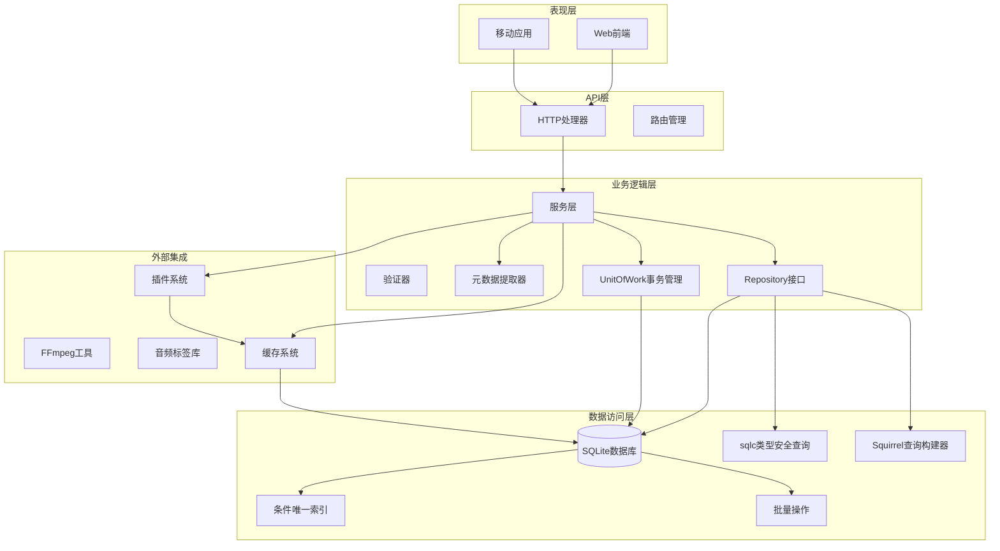

**图表来源**
- [app.go:27-42](file://internal/app/app.go#L27-L42)
- [main.go:30-63](file://main.go#L30-L63)
- [sqlite.go:19-24](file://internal/database/sqlite.go#L19-L24)

**章节来源**
- [app.go:64-226](file://internal/app/app.go#L64-L226)
- [main.go:30-63](file://main.go#L30-L63)
- [sqlite.go:19-24](file://internal/database/sqlite.go#L19-L24)

## 核心组件

### Repository模式架构

**更新** 新增Repository模式的核心组件：

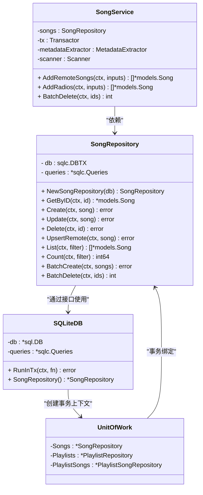

**图表来源**
- [song_repository.go:16-27](file://internal/database/song_repository.go#L16-L27)
- [song_service.go:16-57](file://internal/services/song_service.go#L16-L57)
- [unit_of_work.go:3-10](file://internal/database/unit_of_work.go#L3-L10)
- [sqlite.go:79-102](file://internal/database/sqlite.go#L79-L102)

### 数据模型

系统定义了统一的歌曲数据模型，支持三种歌曲类型：

| 属性 | 类型 | 描述 | 必需 |
|------|------|------|------|
| id | int64 | 歌曲唯一标识符 | 是 |
| type | string | 歌曲类型 (local/remote/radio) | 是 |
| title | string | 歌曲标题 | 是 |
| artist | string | 艺术家/歌手 | 否 |
| album | string | 专辑名称 | 否 |
| duration | float64 | 播放时长（秒） | 否 |
| file_path | string | 本地文件路径 | 本地歌曲必需 |
| url | string | 网络地址 | 网络歌曲和电台必需 |
| cover_path | string | 封面图片本地路径 | 否 |
| cover_url | string | 封面图片URL | 否 |
| lyric | string | 歌词内容 | 否 |
| lyric_source | string | 歌词来源 | 否 |
| file_size | int64 | 文件大小（字节） | 否 |
| format | string | 音频格式 | 否 |
| bit_rate | int | 比特率（kbps） | 否 |
| sample_rate | int | 采样率（Hz） | 否 |
| is_live | bool | 是否为直播流 | 否 |
| plugin_entry_path | string | 插件入口路径 | 插件歌曲必需 |
| source_data | string | 源数据JSON | 插件歌曲必需 |
| dedup_key | string | 去重键 | 插件歌曲必需 |
| added_at | time.Time | 添加时间 | 是 |
| updated_at | time.Time | 更新时间 | 是 |

**更新** 新增插件歌曲相关字段：plugin_entry_path、source_data、dedup_key，用于支持基于插件的智能去重机制。

**章节来源**
- [models.go:64-122](file://internal/models/models.go#L64-L122)
- [models.go:87-112](file://internal/models/models.go#L87-L112)

## 架构概览

**更新** 新的Repository模式架构：

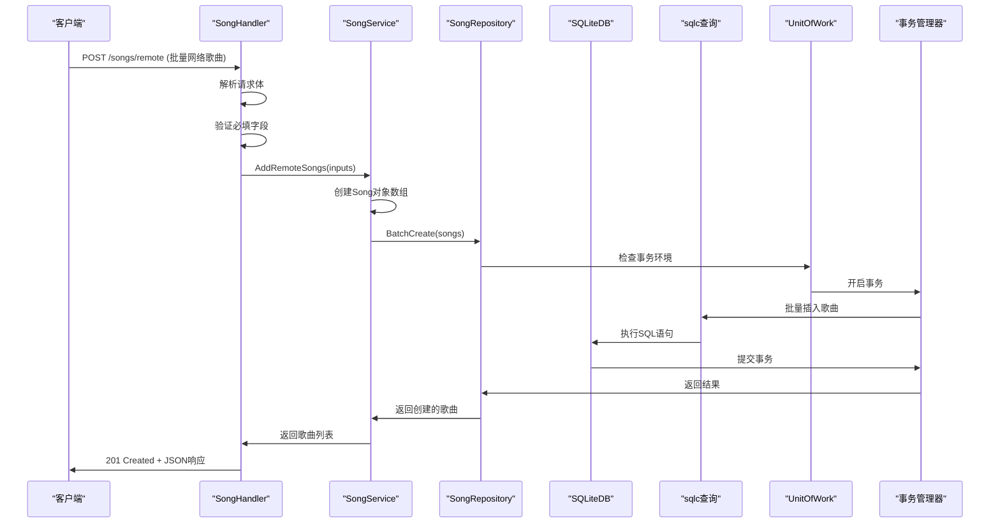

**图表来源**
- [music.go:291-368](file://internal/handlers/music.go#L291-L368)
- [song_service.go:494-523](file://internal/services/song_service.go#L494-L523)
- [song_repository.go:275-303](file://internal/database/song_repository.go#L275-L303)
- [sqlite.go:79-102](file://internal/database/sqlite.go#L79-L102)

## 详细组件分析

### Repository接口设计

**更新** 新增Repository接口抽象层：

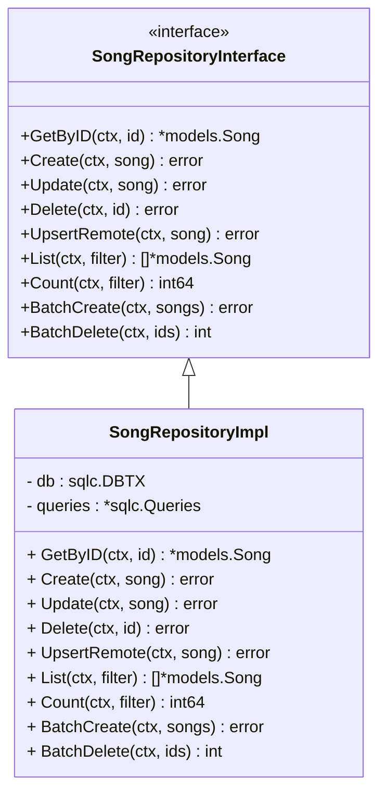

**图表来源**
- [song_repository.go:16-32](file://internal/database/song_repository.go#L16-L32)
- [song_service.go:16-32](file://internal/services/song_service.go#L16-L32)

### 基于sqlc的类型安全查询

**更新** 新增sqlc查询机制：

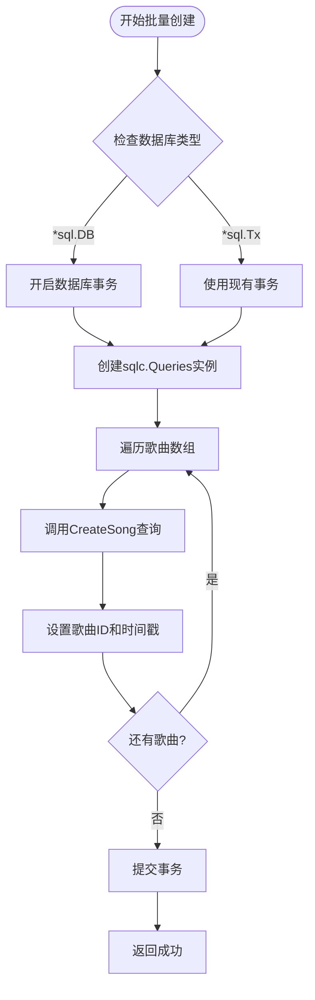

**图表来源**
- [song_repository.go:275-317](file://internal/database/song_repository.go#L275-L317)
- [sqlite.go:20-27](file://internal/database/sqlite.go#L20-L27)

### UnitOfWork事务管理

**更新** 新增UnitOfWork事务管理：

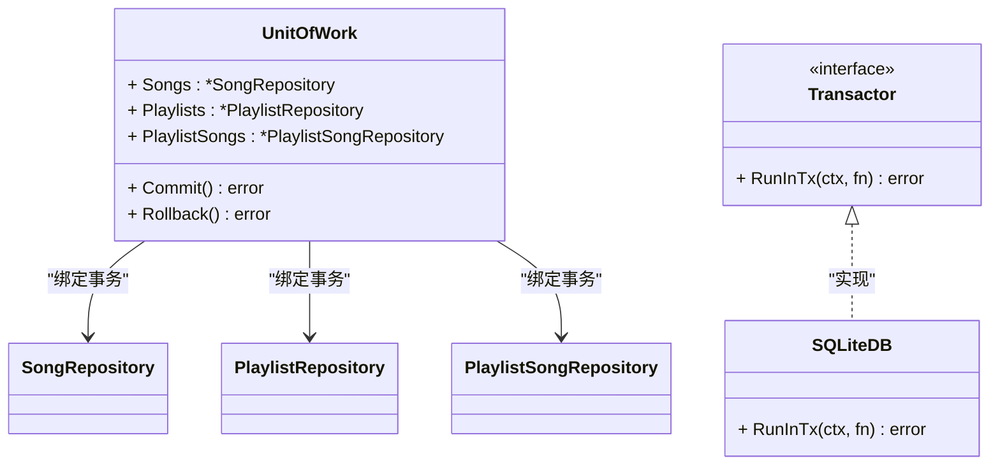

**图表来源**
- [unit_of_work.go:3-10](file://internal/database/unit_of_work.go#L3-L10)
- [sqlite.go:79-102](file://internal/database/sqlite.go#L79-L102)

### 批量网络歌曲创建

批量网络歌曲创建功能支持一次添加多个在线音频文件：

#### API 接口定义

| 属性 | 值 |
|------|-----|
| 方法 | POST |
| 路径 | `/songs/remote` |
| 认证 | Bearer Token |
| 成功状态码 | 201 |
| 失败状态码 | 400, 500 |

#### 请求体结构

```typescript
interface AddRemoteSongRequest {
    url: string;           // 音频文件URL
    title: string;         // 歌曲标题
    artist?: string;       // 艺术家
    album?: string;        // 专辑
    cover_url?: string;    // 封面URL
    duration?: number;     // 播放时长（秒）
    plugin_entry_path?: string; // 插件入口路径
    source_data?: string;  // 源数据JSON
    dedup_key?: string;    // 去重键
    lyric?: string;        // 歌词内容
    lyric_source?: string; // 歌词来源
}
```

#### Repository模式实现

**更新** 新增Repository模式下的批量创建流程：

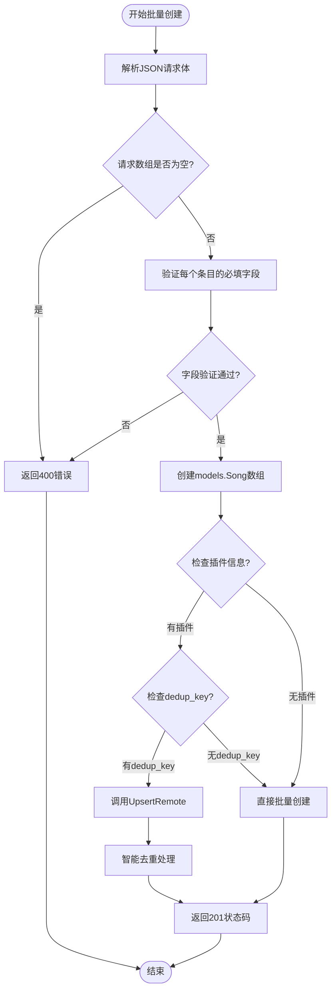

**图表来源**
- [music.go:291-368](file://internal/handlers/music.go#L291-L368)
- [song_repository.go:156-200](file://internal/database/song_repository.go#L156-L200)

**章节来源**
- [music.go:291-368](file://internal/handlers/music.go#L291-L368)
- [song_service.go:494-523](file://internal/services/song_service.go#L494-L523)

### 批量电台创建

电台创建功能专门处理直播流和播客内容：

#### API 接口定义

| 属性 | 值 |
|------|-----|
| 方法 | POST |
| 路径 | `/songs/radio` |
| 认证 | Bearer Token |
| 成功状态码 | 201 |
| 失败状态码 | 400, 500 |

#### 请求体结构

```typescript
interface AddRadioRequest {
    title: string;         // 电台名称
    url: string;           // 播放流URL
    cover_url?: string;    // 封面URL
}
```

#### Repository模式实现

**更新** 新增Repository模式下的电台创建：

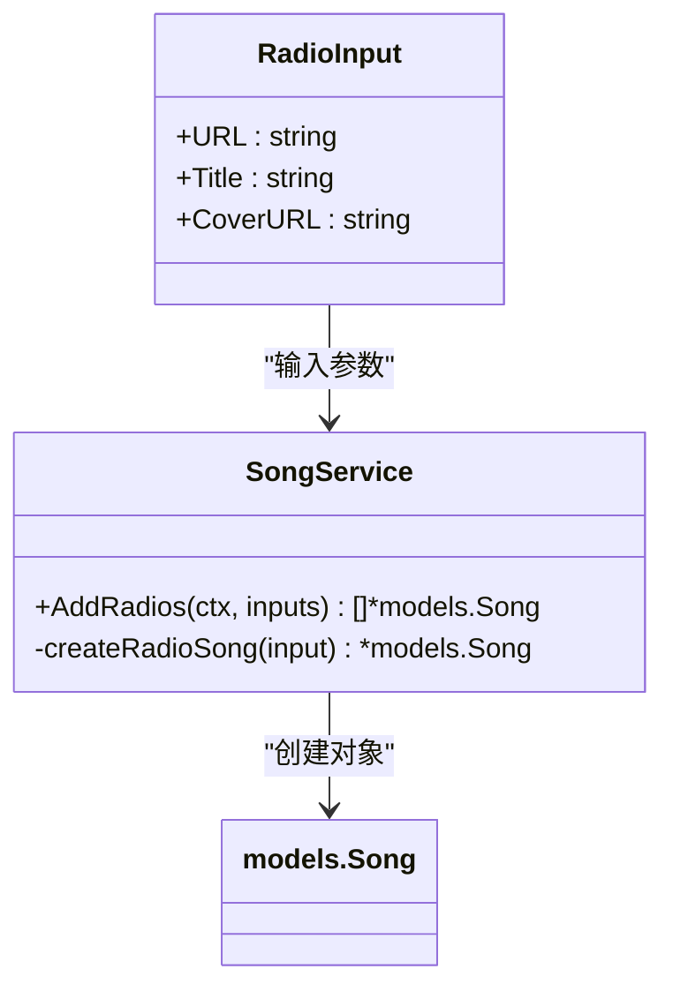

**图表来源**
- [song_service.go:525-546](file://internal/services/song_service.go#L525-L546)

**章节来源**
- [music.go:370-424](file://internal/handlers/music.go#L370-L424)
- [song_service.go:525-546](file://internal/services/song_service.go#L525-L546)

### 数据库事务处理

**更新** 新增Repository模式下的事务处理：

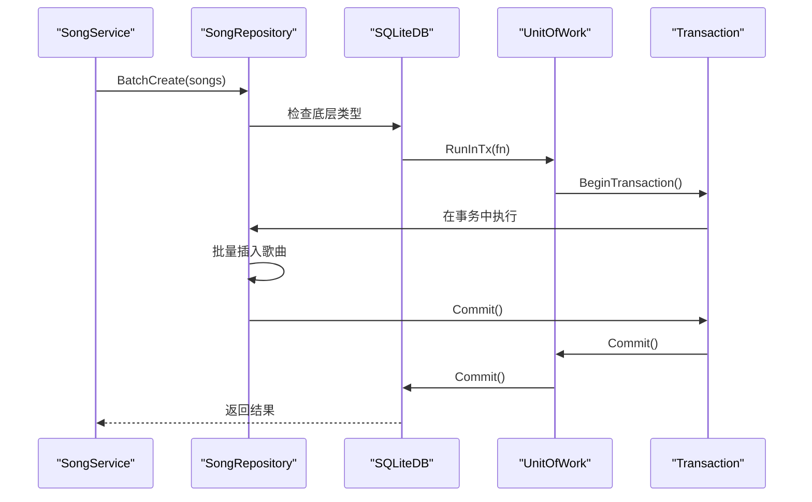

**图表来源**
- [song_repository.go:275-303](file://internal/database/song_repository.go#L275-L303)
- [sqlite.go:79-102](file://internal/database/sqlite.go#L79-L102)

**章节来源**
- [sqlite.go:79-102](file://internal/database/sqlite.go#L79-L102)

### 前端集成

前端提供了直观的用户界面来触发批量歌曲创建：

#### Web前端实现

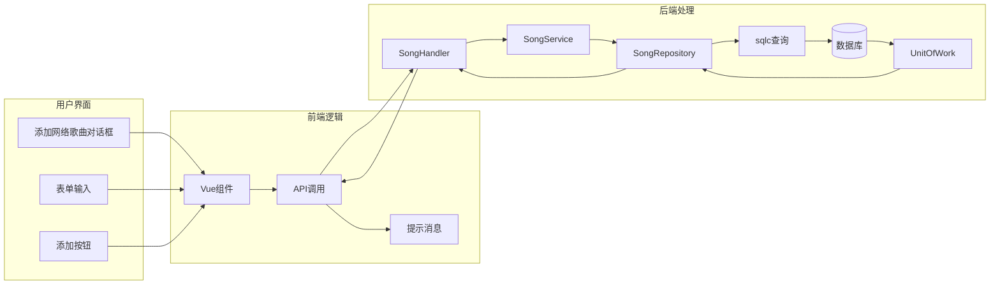

**图表来源**
- [index.vue:638-666](file://web/src/views/Library/index.vue#L638-L666)
- [songs.ts:42-50](file://web/src/api/songs.ts#L42-L50)

**章节来源**
- [index.vue:638-666](file://web/src/views/Library/index.vue#L638-L666)
- [songs.ts:42-50](file://web/src/api/songs.ts#L42-L50)

### 插件歌曲智能去重

**更新** 新增基于插件的智能去重机制：

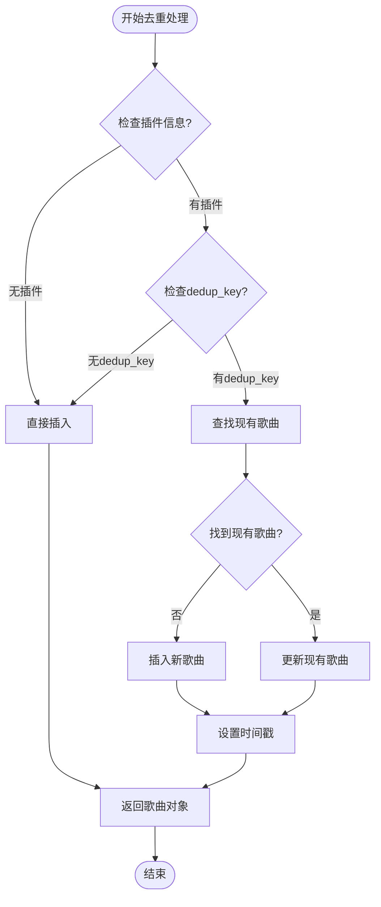

**图表来源**
- [song_repository.go:156-200](file://internal/database/song_repository.go#L156-L200)

**章节来源**
- [song_repository.go:156-200](file://internal/database/song_repository.go#L156-L200)

## 依赖关系分析

**更新** 新增Repository模式下的依赖关系：

```mermaid
graph TB
subgraph "外部依赖"
Chi[Chi路由器]
SQLite[SQLite数据库]
FFProbe[FFmpeg工具]
TagLib[音频标签库]
SQLC[sqlc查询生成器]
Squirrel[Squirrel查询构建器]
UnitOfWork[UnitOfWork事务管理]
Plugin[插件系统]
Cache[缓存系统]
End
subgraph "内部模块"
Handler[HTTP处理器]
Service[业务服务]
Repository[Repository接口]
DB[数据库访问]
Model[数据模型]
Config[配置管理]
Metadata[元数据提取器]
Transactor[事务执行器]
end
Handler --> Service
Service --> Repository
Repository --> DB
Repository --> SQLC
Repository --> Squirrel
Repository --> UnitOfWork
Service --> Transactor
Service --> Model
Service --> Config
Service --> Metadata
DB --> SQLite
Service --> FFProbe
Service --> TagLib
Service --> Plugin
Service --> Cache
Transactor --> UnitOfWork
Handler --> Chi
```

**图表来源**
- [app.go:146-162](file://internal/app/app.go#L146-L162)
- [main.go:39-40](file://main.go#L39-L40)
- [sqlite.go:19-24](file://internal/database/sqlite.go#L19-L24)

**章节来源**
- [app.go:146-162](file://internal/app/app.go#L146-L162)
- [types.go:3-9](file://internal/config/types.go#L3-L9)

## 性能考虑

### Repository模式优化

**更新** 新增Repository模式下的性能优化策略：

1. **接口抽象**：通过接口隔离具体实现，支持Mock测试和替换
2. **类型安全**：使用sqlc生成类型安全的查询方法
3. **事务管理**：UnitOfWork确保跨表操作的一致性
4. **批量操作**：Repository层支持批量插入和更新
5. **连接池**：SQLiteDB管理数据库连接池

### sqlc查询优化

**更新** 新增sqlc查询优化：

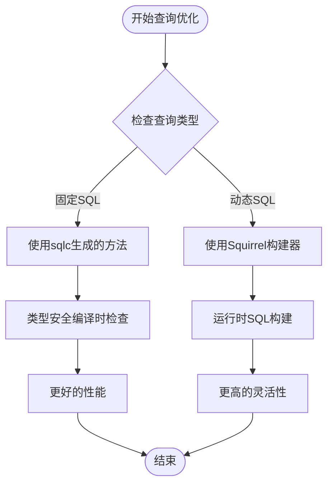

**图表来源**
- [song_repository.go:16-18](file://internal/database/song_repository.go#L16-L18)

### UnitOfWork事务优化

**更新** 新增UnitOfWork事务优化：

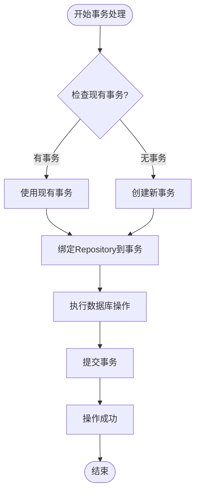

**图表来源**
- [sqlite.go:79-102](file://internal/database/sqlite.go#L79-L102)

## 故障排除指南

### Repository模式常见问题

**更新** 新增Repository模式下的故障排除：

| 错误类型 | HTTP状态码 | 错误原因 | 解决方案 |
|----------|------------|----------|----------|
| Repository注入失败 | 500 | 依赖注入配置错误 | 检查服务容器配置，确保Repository正确注册 |
| sqlc查询编译错误 | 500 | 查询SQL语法错误 | 检查queries.sql文件，修复SQL语法 |
| 事务超时 | 504 | 事务执行时间过长 | 优化批量操作，减少事务持有时间 |
| 去重冲突 | 409 | dedup_key重复冲突 | 检查插件去重逻辑，确保唯一性 |
| 接口实现缺失 | 500 | Repository接口实现不完整 | 实现所有必需的接口方法 |

### 调试建议

1. **启用详细日志**：检查服务端日志以获取详细的错误信息
2. **验证Repository注入**：确保所有依赖正确注入到服务层
3. **测试sqlc查询**：运行sqlc生成器验证查询正确性
4. **监控事务状态**：观察事务执行时间和资源使用情况
5. **检查接口实现**：确保Repository接口的所有方法都有正确实现
6. **验证UnitOfWork使用**：确保跨表操作使用UnitOfWork包装

**章节来源**
- [music.go:300-330](file://internal/handlers/music.go#L300-L330)

## 结论

批量歌曲创建功能通过全新的Repository模式架构，实现了更强的可维护性、更好的性能和更可靠的数据一致性。新的实现采用基于sqlc的类型安全查询和UnitOfWork事务管理，为用户提供了高效、稳定的音乐内容管理体验。

**更新** 主要改进包括：
- **Repository接口抽象**：通过接口隔离实现，支持更好的测试和替换
- **sqlc类型安全查询**：编译时SQL检查，避免运行时错误
- **UnitOfWork事务管理**：确保跨表操作的一致性和原子性
- **智能去重机制**：基于插件的去重键支持，避免重复数据
- **批量操作优化**：Repository层原生支持批量插入和更新

系统支持多种歌曲类型，具备完善的错误处理机制，并通过Repository模式和UnitOfWork确保数据一致性。新的架构设计为未来的功能扩展和维护提供了坚实的基础。

主要优势包括：
- **类型安全**：sqlc生成的查询方法提供编译时类型检查
- **事务保证**：UnitOfWork确保跨表操作的原子性
- **可测试性**：接口抽象支持Mock测试
- **性能优化**：Repository层批量操作和连接池管理
- **可维护性**：清晰的分层架构和职责分离
- **扩展性**：Repository模式便于功能扩展和替换

该功能为 MiMusic 的音乐管理提供了现代化、企业级的解决方案，支持用户轻松管理和组织各种类型的音乐内容。新的Repository模式确保了在高并发场景下的稳定性和性能表现。